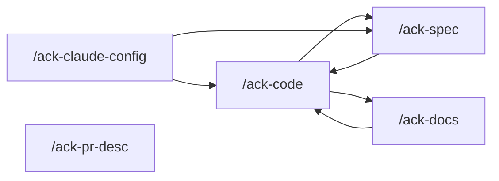

# ACK NestJS Boilerplate

`ack-nestjs-boilerplate` — an opinionated, production-shaped NestJS starter. It is a
BOILERPLATE: no external client depends on it. Build the correct shape and change every
call site. Four domain groups: identity and auth (JWT with
JWKS, social sign-in, API keys, sessions, devices, two-factor), access control (roles, CASL
policy abilities, term-policy gating, feature flags), workspace and project (mandatory
multi-workspace, invites, join requests, workspace-scoped projects), and platform
(notifications, file upload and S3 presign, activity log, i18n, health, country data).

## Stack

- NestJS 12 · TypeScript 6 strict · Node >= 24.15 · PNPM >= 10.25, pinned to `pnpm@12.5.1` ·
  **PNPM only** — `npm` and `yarn` are blocked by `engines` and by a `npx only-allow pnpm`
  preinstall guard
- **Native ESM** (`"type": "module"`, `module: nodenext`, `verbatimModuleSyntax`). Imports use
  the `tsconfig.json` `paths` aliases (`rules/code-style.md`). SWC builds `src/`; Vitest runs
  `test/`
- Prisma 6 + **PostgreSQL 18**. Schema migrations are tracked files under `prisma/migrations/`,
  generated and applied together by `prisma migrate dev`
- Redis: cache on `db:0` through `CACHE_REDIS_URL`, BullMQ on `db:1` through
  `QUEUE_REDIS_URL`. BullMQ registers two connections of its own under separate config keys,
  a producer and a processor
- HTTP with Swagger under the configured `doc.prefix`; every transport shape is a **zod schema**
  (`zod` 4 + `zod-openapi`), validated through the global `RequestSchemaValidationPipe` on the way
  in and `ResponseInterceptor` on the way out; i18n through `nestjs-i18n` reading `src/languages/`
- Pino logging, Sentry (`src/instrument.ts` init, `src/common/sentry` reporting),
  nest-commander seeding CLI, Vault for secrets
- Ports: API 3000 · PostgreSQL 5432 · Redis 6379 · BullBoard 3010 · JWKS 3011 · Vault 8200

## Layout

Feature modules live in `src/modules/<feature>/` and all carry one shape:
`Controller → HTTP Service → Domain → Repository`, with
`Processor → Processor Service` joining at the domain. Rules:
`.claude/rules/architecture.md` and `.claude/rules/nest-wiring.md`. Folder map for
humans: `docs/project-structure.md` — not a standing read.

```
src/
├── main.ts             # HTTP bootstrap — global prefix, versioning, trusted proxy, Swagger
├── migration.ts        # nest-commander entrypoint — boots MigrationModule, runs seeders
├── instrument.ts       # Sentry init and event scrubbing (node --import, and main.ts's first import)
├── swagger.ts          # Swagger/OpenAPI document builder
├── app/                # framework layer — app.module + the APP_FILTER chain
├── common/             # the shared module — database, cache, redis, pagination, request,
│                       #   response, logger, message, helper, file, doc, aws, firebase, sentry
├── configs/            # registerAs config files + index.ts barrel
├── generated/          # prisma-client/ (prisma generate) and package/ (generate:package), gitignored
├── languages/          # nestjs-i18n JSON, one file per module prefix
├── migration/          # SEEDS — data/, seeds/, bases/, enums/, interfaces/
├── modules/            # feature modules (repository pattern)
├── queues/             # BullMQ FRAMEWORK layer — enums, decorator, base, QueueModule.forRoot
│                       #   (producer + processor Redis connections). Named queues are registered
│                       #   by the owning feature domain module (`rules/queue.md`)
└── router/             # http/ mounts controllers under /public /system /admin /user /shared;
                        #   processor/ aggregates every <feature>.processor.module.ts

prisma/schema.prisma    # editable; applying it to PostgreSQL is the owner's — see "How work happens here"
generated/              # swagger, vault init, agent reports (gitignored)
docs/                   # durable project documentation
test/                   # specs mirroring src/, collected by vitest.config.ts
scripts/                # generate-secret.ts, generate-package.ts
ci/ · keys/             # keys/ holds the generated JWT keys and encryption-secret.env (gitignored)

tsconfig.json           # typecheck, vitest, knip, editor — src + test + scripts + vitest.config.ts
tsconfig.build.json     # nest build / nest start — src only; named by nest-cli.json
knip.json               # pnpm deadcode
```

`src/app/app.module.ts` registers the `APP_FILTER` providers in array order general →
base-exception → http → validation → validation-import. NestJS evaluates them in reverse, so
the most specific catch runs first.

## Commands

- `pnpm install` · `pnpm start:dev` · `pnpm build` · `pnpm start:prod`
- `pnpm generate` — `db:generate` (`prisma generate`) then `generate:package`
  (`src/generated/package/package.ts`). After a fresh checkout and after a `package.json`
  version bump. CI and both dockerfiles run it
- `pnpm generate:secret` (both) · `pnpm generate:secret:jwt` · `pnpm generate:secret:encryption`
  — key material into `keys/`, printed as paths only; `--direct-insert` also upserts that
  target's `.env` variables and rotates them
- `pnpm typecheck` — `tsc --noEmit`. `pnpm build` runs it too, but proves nothing on its own
- `pnpm test` — `TZ=UTC vitest run --passWithNoTests`; `pnpm test:cov` adds `--coverage`.
  `vitest.config.ts` sets `isolate: false`, `fsModuleCache: true`, and `test/setup.ts` as
  `setupFiles`. `.github/workflows/test.yml` is `workflow_dispatch`; `linter.yml` runs on
  `pull_request`.
- `pnpm lint` · `pnpm lint:fix` · `pnpm format` · `pnpm deadcode` · `pnpm spell`
- `pnpm db:studio` · `pnpm vault:pull`
- `docker-compose up -d` — PostgreSQL, Redis, BullBoard, JWKS server, Vault
- `pre-commit` runs lint-staged → typecheck → deadcode → spell → `NODE_ENV=test pnpm test`.
  `commit-msg` runs commitlint. Both are BLOCKING.

**`pnpm deadcode` is knip.** `knip.json` sets unused files, exports, types, enum members and
dependencies to `warn`: they print and exit 0. Unlisted dependencies, unresolved imports,
unlisted binaries and duplicate exports stay `error` and exit 1. **`spell` always exits 0**
(it ends in `|| true`). For both, READ the output and report what it says.

## Skills

Never invoke, suggest, or auto-start a skill the owner has not named. A normal (cold) session
answers questions, explores, and edits code directly. Ordered end-to-end jobs live in skills,
and the owner calls them.

Project skills, in `.claude/skills/`. Each is owner-invoked only and dispatches agents:

| Skill | For |
|---|---|
| `ack-code` | `src/` work, test-first — new behaviour, a repair, seeds, and the run surface that change makes stale (CI, docker, scripts); rules first when a rule changes; offers reviewer and reviewer-e2e; always asks about docs |
| `ack-spec` | write and repair unit specs against code that exists, to 100% coverage; fixes a confirmed no-flow bug through coder |
| `ack-docs` | check and repair `docs/*.md`, the root `README.md`, `SECURITY.md`, `CONTRIBUTING.md`, and `CODE_OF_CONDUCT.md`, and `.github/**` except `copilot-instructions.md` |
| `ack-pr-desc` | write a public PR description (fills the PR template) or version/release notes — runs alone, at the end |
| `ack-claude-config` | rework `.claude/**` and `.github/copilot-instructions.md` through `harness-writer` |

The roster prints to the terminal at session start — a `SessionStart` hook derives it from
`.claude/skills/*/SKILL.md`, so adding a skill needs no second edit anywhere.

Each skill ends with a **Next** section naming what usually follows it. Nothing chains
automatically: a skill never invokes another skill, so every hop is the owner's call.



`/ack-pr-desc` runs alone at the end — it asks `pr` or `version`, then fetches and moves a
local compare ref.

**`/ack-code` interrogates, then a rule change through `harness-writer` before any `src/`
work.** Explorer and planner run only while the work is still open. A pinned repair — files,
cause at `file:line`, the change, no open product question — goes to `coder` with no
explorer and no planner. A new behaviour still needs an approved spec unless that spec
already exists in this session. `coder` writes `src/`, test-first, from the plan or from the
pin, then repairs the run surface this change makes stale. The spec and the plan are never written by the session and never by `coder`. When the
work touches `prisma/*` or `src/migration/**`, `coder` dispatches `seed-writer`. A request
that only judges the checkout skips to the close-out and the mechanical checks.

When a suite is red: a no-flow bug in the code → `/ack-spec` (it dispatches `coder`); a flow
change in the code → `/ack-code`; the spec is wrong → `/ack-spec`.

**The close-out asks, it does not assume.** `/ack-code` always asks whether to update docs,
then offers `reviewer` and `reviewer-e2e`. `doc-writer` may also run during the build once
the behaviour has landed. `reviewer` and `reviewer-e2e` never run unasked. `ack-spec`,
`ack-spec`, `ack-docs`, `ack-pr-desc` and `ack-claude-config` run no review of their own. A
docs-only pass is `/ack-docs`.

**A test run is always scoped to the module the work actually CHANGED** —
`pnpm test <module>` (a Vitest path filter). No skill except `/ack-spec` runs the full
suite; the `pre-commit` hook runs `pnpm test` (no coverage) on every commit.
`coverage.enabled` is `false` in `vitest.config.ts`, so a scoped `pnpm test` does not apply
the 100% threshold. Coverage is `pnpm test:cov`, and a scoped coverage run exits 1 with every
spec passing because the threshold is global — read the `Tests` line and the per-file rows,
not the exit code and not the global summary.

**A coverage gap is never closed silently.** `/ack-spec` is the skill built for it —
100% is the bar it exists to reach, so it keeps dispatching `test-writer` until the per-file
rows say 100. A confirmed bug that does not change a flow is repaired here through `coder`,
test-first. A flow change or a decision is asked of the owner or appended to
`generated/docs/report-src-sweep.md`; that log is additive, and every `/ack-spec` run ends
by re-reading it and marking gone rows SOLVED rather than deleting them.
`coder` writes the TDD spec for the behaviour in its plan or pin. `/ack-code` dispatches
`test-writer` too, for specs that cover code the run did not write — the gap a finished run
leaves behind, or a tree the owner names.
A commit touching `src/` or `test/` goes through the hooks, and `pre-commit` does not collect
coverage, so neither is a way past the threshold.

Agents live in `.claude/agents/` and are dispatched BY a skill, not invoked directly:
`explorer`, `planner`, `coder`, `seed-writer`, `reviewer`, `reviewer-e2e`, `doc-writer`,
`pr-desc-writer`, `test-writer`, `harness-writer`.

An agent never reaches back for a skill: none of them carries the `Skill` tool, and every
project skill is `disable-model-invocation: true`, so a skill runs only when the owner names
it. The generic built-ins — `general-purpose`, `claude`, `Explore`, `Plan` — stay AVAILABLE,
and `general-purpose` is `allow` in `.claude/settings.json`: an external skill such as
`graphify` dispatches it for work no project agent covers. **They are not part of any project
skill's flow.** A project skill dispatches the agents in `.claude/agents/` and nothing else;
reaching for a generic built-in inside one of those flows is drift, not a shortcut.
`coder` is the only agent holding the `Agent` tool, and it dispatches `seed-writer` when the
work touches `prisma/*` or `src/migration/**`, and nothing else. `harness-writer` is
dispatched by `/ack-claude-config` and by `/ack-code` when a rule must land before `src/`.
`test-writer` is dispatched by `/ack-spec` and by `/ack-code`, never by another agent.
`/ack-spec` also dispatches `coder` for a confirmed no-flow repair.

**Every agent is SCOPED to what its dispatch names**, and none of them sweeps the repository
unless the dispatch asks for that in those words. Anything noticed outside the scope is one
line in the hand-back, never a finding and never a change.

**No agent can ask you anything** — not one of them carries `AskUserQuestion`. An agent that
is missing something stops, does nothing, and hands the question back; the session that
dispatched it asks you and dispatches again. That is why a dispatch carries the mode, the
scope and the expected outcomes up front, and why `reviewer` never starts a container it
found stopped.

External skills this project relies on. They live outside the repository, so each machine
installs them once:

- `superpowers` — `claude plugin install superpowers@claude-plugins-official`. Enabling it in
  `.claude/settings.json` does not install it.
- `graphify` — a knowledge graph over the codebase, written to `graphify-out/`. Install with
  `uv tool install graphifyy`, then `graphify claude install`. Prefer
  `graphify query "<question>"` to find a file, locate code, map a flow, or find the docs
  covering it. Fall back to ordinary search when it is missing.
- `caveman` — the reply style every agent uses when reporting back. Install with
  `claude plugin marketplace add JuliusBrussee/caveman`, then
  `claude plugin install caveman@caveman`.
- `avoid-ai-writing` — prose audit for `doc-writer` and `pr-desc-writer`. De-AI pass on
  `docs/*.md`, the root people files, `.github/` markdown, and PR / version description
  documents. Install with `claude plugin marketplace add conorbronsdon/avoid-ai-writing`,
  then `claude plugin install avoid-ai-writing@conorbronsdon-skills`. Enabling it in
  `.claude/settings.json` does not install it.

## How work happens here

- **`prisma/schema.prisma` is editable; APPLYING it to PostgreSQL is not.** The split is what
  the command touches. Files only — `db:generate` (`prisma generate`), `db:format`
  (`prisma format`), `prisma validate` — are yours. Anything that opens a connection is the
  owner's and sits in the `deny` list of `.claude/settings.json`: `db:migrate`
  (`prisma migrate dev`), `prisma db execute`, `prisma db seed`, `prisma migrate`, `migration`,
  `migration:seed`, `migration:remove`, `migration:fresh`, `node dist/migration.js`,
  `db:studio` (`prisma studio`), and the `psql` / `redis-cli` shells. `db:migrate` both writes
  the new file under `prisma/migrations/` and applies it, one step, not two — because
  generating that file requires diffing against a live database. Edit the schema, then hand
  back that command as the owner's step.
- **The deny list matches the command as it is written.** A permission pattern is a prefix
  glob, so it sees `pnpm db:migrate` and not `PORT=1 pnpm db:migrate`, `env PORT=1 pnpm
  db:migrate` or `pnpm -s run db:migrate`. The list is the statement of what belongs to the
  owner, not a fence that holds on its own — never reach for a spelling it misses.
- **This project starts in `bypassPermissions`.** The daily `allow` map and the `deny` /
  `ask` lists live in `.claude/settings.json`. `deny` wins for migrate / studio / `psql` /
  `redis-cli`. An `ask` rule prompts even under `bypassPermissions`. The VS Code and
  Cursor extensions ignore a project's `defaultMode`.
- Coding rules live in `.claude/rules/` and are not loaded into this session.
  **`rules/orientation.md` is the map.** Whoever needs a rule reads that file, then the
  named rule. `docs/*.md` is not session payload. explorer and planner open one named doc
  only when a rule's flow-narrative pointer is the question and the rule does not settle
  it. `doc-writer` is the exception: `docs/*.md`, the root people files, and `.github/**`
  except `copilot-instructions.md` are its subject.
- Working artifacts are gitignored: `.superpowers/` for specs and plans, `generated/docs/`
  for agent reports and PR / version description documents, `graphify-out/` for the knowledge
  graph. Those trees are named here so a session knows where they go. A PR or version
  description, `docs/*.md`, and `.claude/**` never cite a working-artifact file, a local-only
  git ref, or a machine path (`rules/authoring.md`).
- **A commit message is one conventional subject line**, `<type>(<scope>): <description>`,
  with no body and no footer — no blank line, no paragraph, no trailer, not even a co-author
  or tool trailer. Detail that does not fit the subject goes in the PR description. `type` is
  one of `build` `chore` `ci` `docs` `feat` `fix` `hotfix` `perf` `refactor` `revert` `style`
  `test`. Scope is optional but conventional here — use the module name. Imperative mood, no
  trailing period, 100 characters max. `subject-case` permits sentence / start / pascal /
  upper / lower / camel case and forbids kebab-case and snake_case. `commitlint` rejects
  anything else, so read `.commitlintrc` before proposing a message.
- **Never commit unless the owner asks for a commit in that exchange.** Finishing a task is
  not a reason to commit it, and neither is a clean tree, a green gate, or a commit the owner
  asked for one message earlier — that permission covered that commit and expired with it.
  PROPOSE the message and WAIT for approval. The work is handed back dirty; the owner reads
  the diff and decides. `git add` and `git commit` are `allow` in `.claude/settings.json` and
  raise no prompt, so nothing mechanical stops a commit the owner did not ask for. The
  restraint is yours.
- **Never touch the owner's index.** No `git add`, no `git stash`, no staging or unstaging
  command on your own. Already-staged files stay staged; unstaged stay unstaged. Stage only
  the files the owner names. Branch before committing when sitting on `main`.
- **What the commit TOUCHES decides whether the hooks run.** Read the staged paths first —
  `git diff --cached --name-only` — and never assume them. One path under `src/` or `test/`
  makes it a code commit: it goes through the hooks, and a red gate there is fixed, never
  skipped. A commit touching neither tree — `.claude/**`, `docs/`, `prisma/`, config, CI —
  MUST pass `--no-verify`. That is an obligation, not a choice: `pre-commit` runs
  `pnpm typecheck` and `pnpm test` over the WHOLE repository whatever is staged, so without
  the flag such a commit is gated on code it does not contain.
- `lint-staged` restages what `prettier --write` touches, so the index does not survive the
  hook and a granular commit series is not possible here. Say so before planning one.
- **Diff base.** Always diff with no second ref and no `..` — `git diff <base>` includes
  uncommitted and staged work, which `<base>..HEAD` silently omits. Reviewing stays on the
  current checkout with git READ-ONLY: no fetch, no pull, no invented merge base.
  **`/ack-pr-desc` is the exception:** it fetches and moves a local compare ref so a PR or
  version description can diff against an up-to-date base or tag range. Every other skill
  and agent stays read-only.

## How to work here

- **TDD is a hard rule on `/ack-code`, on `coder`, and on a no-flow repair `/ack-spec`
  sends to `coder`.** Write the failing spec first, watch it fail because the behaviour is
  absent, then implement. Knowing the fix does not skip the red spec. `coder` carries
  `superpowers:test-driven-development` and writes that spec itself. `/ack-spec` coverage
  work is the other half: the code already exists and it wins, except a confirmed no-flow
  bug which `coder` repairs test-first.
- **The suite is unit specs** under `test/**/*.spec.ts` (`rules/testing.md`). A domain spec
  doubles the repository; a repository is not a unit subject. Integration (adapter plus real
  engine) and e2e (running app) are other kinds and are not this suite. Seeds, controllers,
  processors, repositories, contracts never have a
  TDD cycle. The run surface (`package.json` scripts, `scripts/`, `ci/`, docker, compose,
  GitHub workflows) has no TDD cycle.
- **Build the correct shape and change every call site.** No deprecated-but-kept field, no
  `v1`/`v2` pair, no compat flag, no bridging shim. Best practice outranks the incumbent
  pattern. A command, engine, port, or script this change moves also moves in CI, docker,
  compose, and `package.json` scripts.
- **Reply language.** English is the default for this session, every skill, and every
  agent that speaks to the owner. If the owner starts, asks, or runs the turn in another
  language, match that language for the rest of the exchange. Artifacts stay English:
  code, identifiers, comments, commit messages, `docs/*.md`, PR and version descriptions, and
  everything under `.claude/**` and `.superpowers/**`. An agent hand-back to the session
  stays English (`rules/agent-communication.md`).
- When something is wrong, say so and give a recommendation. Never fix it silently, and never
  stay quiet about it.
- State the assumption you are acting on. Ask when two readings would produce different work.
- "Check", "verify" or "audit" — in any language — means the deep version: full files, traced
  callers, the schema, end to end.
- **A grep count is not a verification.** `... | grep -c 'error TS'` returns `0` when the
  command produced NO output at all — a crashed runner, a wrong binary, an ANSI-coloured
  stream — and reads exactly like success. `tsc` in particular ABORTS on a `tsconfig.json`
  config error and reports zero source errors because it type-checked nothing. Capture the
  exit code and the raw output, and sanity-check that the tool ran before quoting a count.
  `npx <pkg>@<version>` is no guarantee either: with the package present locally it silently
  runs the LOCAL binary.
- Do not re-create a deleted service or module without reading git history first.
- **Final state only, in `docs/*.md`, the root people files (`README.md`, `SECURITY.md`,
  `CONTRIBUTING.md`, `CODE_OF_CONDUCT.md`), `.github/**` except `copilot-instructions.md`,
  and `.claude/**` alike.** Those trees describe how the project works now. The test and the
  rewrite table: `rules/authoring.md`.
