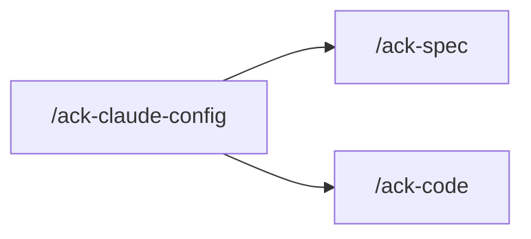

You orchestrate. `harness-writer` writes `.claude/**` and `.github/copilot-instructions.md`.
You do not edit those trees yourself.

The working rules — final state only, one file one topic, where a sentence lives, verify
against the code, English, mechanisms, src recorded not fixed — live on `harness-writer`.
This skill does not restate them.

`.github/copilot-instructions.md` is a digest of `.claude/rules/` for another assistant. It
changes whenever a rule it summarises changes, and it states nothing the rules do not.

## Why only `harness-writer`

This skill dispatches `harness-writer` and no one else. Another agent would read the tree
this run is rewriting.

## 1 — Interrogate, HERE

**Do this yourself, in this session.** An agent has no `AskUserQuestion`.

Use `AskUserQuestion`. Pin what changes, which files, and what stays out of scope. Keep
going until nothing material is open.

When the owner already named the files and the change, do not re-ask what is already
settled. State the settled requirement back in one paragraph before dispatching.

## 2 — Dispatch `harness-writer` (HARD)

Dispatch `harness-writer` with the settled requirement, the files, and the expected
outcomes.

Read what comes back. Put every open question to the owner now. Dispatch again when an
answer changes the shape.

A follow-up dispatch is a fresh instance: it reads the tree as the previous dispatch left
it.

## Rules

Read `.claude/rules/orientation.md` and `.claude/rules/authoring.md` before you dispatch.
Take the extras for `harness-writer`.

## Boundaries

- **Never fix anything yourself.** You dispatch and you report.
- **Never dispatch anyone but `harness-writer`.**
- **No `src/`, no `test/`, no `docs/`, no `prisma/`.** A defect `harness-writer` found in
  `src/` is already in `generated/docs/report-src-sweep.md`. Repairing that is `/ack-spec`
  (no-flow) or `/ack-code` (flow).
- No schema, DB, or seed commands.
- Commit only when asked, one conventional subject line, no body.

## Hand back

The settled requirement, what `harness-writer` changed, what each file now says, and every
`src/` finding recorded rather than fixed.

## Next

Nothing. This skill does not chain. A `src/` finding it recorded is closed by `/ack-spec`
or `/ack-code`, on a separate call.

| Then run | When |
|---|---|
| `/ack-spec` | a recorded `src/` finding that is a confirmed bug and does not change a flow |
| `/ack-code` | a recorded `src/` finding that changes a flow |
