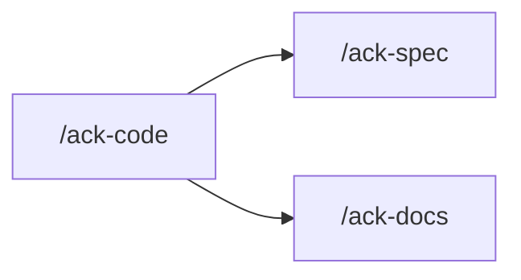

One skill for `src/` work: new behaviour, a repair, baseline seeds, and the compliance pass.
You orchestrate. The agents do the work. `coder` writes `src/`, test-first.

## TDD (HARD)

`coder` carries `superpowers:test-driven-development`. A behaviour lands as a failing spec,
watched fail, then the minimum `src/` that turns it green. `coder` writes that spec.

**A spec that covers code this run did not write is `test-writer`'s**, dispatched from here
with the paths and the 100% bar (`rules/testing.md`). Name in the hand-back which specs came
from which agent.

A seed-only run and a judge-only run have no TDD cycle.

## Rules

Read `.claude/rules/orientation.md` before you dispatch or answer a design question. Take the
four, the extras for the agent you are about to send, then every surface row the work touches.
A shape you decide in conversation is bound by the same rows.

## Reject early

| The request | Where it goes |
|---|---|
| specs for code that already exists, or a coverage gap | `/ack-spec` — it touches no `src/` |
| a docs-only pass of `docs/*.md` or the root `README.md` | `/ack-docs` |
| `.claude/**` | `/ack-claude-config` |

Say which, and stop.

## Two shapes

| The request | Path |
|---|---|
| new or repaired behaviour, including seeds | §1 → explorer → planner → coder → §6 → §7 |
| judge work already on the checkout | name the paths, then §6 → §7 — no explorer, no planner, no coder |

## 1 — Interrogate, HERE

**Do this yourself, in this session.** An agent has no `AskUserQuestion`.

Use `AskUserQuestion`. Ask about the hard parts: edge cases, failure, what is out of scope,
which existing surface this becomes visible to, which route scope it belongs under (`/admin`
behaves differently from every other scope — `rules/router.md`). Keep going until nothing
material is open.

When the request is a symptom, pin it first: the input, the observed result, the expected
result, and where it surfaces. A cause you have not shown in the code is a guess.

When the request depends on a third-party contract, that is `explorer`'s research half.

State the settled requirement back in one paragraph before moving on.

## 2 — Explore, through `explorer` (HARD)

Dispatch `explorer` with the settled requirement. It locates, researches, and brainstorms.

Read the **Open questions** and put them to the owner with `AskUserQuestion` now. Dispatch
`explorer` again with the answers when any of them changes the shape.

**You do not write the spec or the plan here.** That is `planner`.

## 3 — Spec, through `planner` (HARD)

Dispatch `planner` in **`SPEC` mode**. It returns `.superpowers/<slug>-spec.md`.

Read the spec's **Open questions** and put them to the owner now. Dispatch `planner` again in
`SPEC` mode when any answer changes the shape.

**Put the spec to the owner before planning it.** Name the file path and ask whether it is
right.

## 4 — Plan, through `planner` (HARD)

Dispatch `planner` in **`PLAN` mode**, naming the APPROVED spec path. It returns
`.superpowers/<slug>-plan.md`.

Read the plan's **Open questions** — anything there goes back to the owner now.

A plan step that touches `prisma/*` or `src/migration/**` names `seed-writer` as the agent
that writes that tree.

## 5 — Build, through `coder` (HARD)

Dispatch `coder` with the plan. `coder` writes `src/` test-first against the rules.

**When the plan touches `prisma/*` or `src/migration/**`, `coder` dispatches `seed-writer`
itself.** Do not dispatch `seed-writer` from here unless `coder` handed that back undone.

A schema delta is `coder`'s edit and the OWNER'S push. `coder` edits `prisma/schema.prisma`
and runs `db:generate`. Relay the push — the model, the field, the index, the data
consequence, and `pnpm db:migrate`. Nobody here may run `db:migrate`.

Findings from a picked `reviewer` go back to `coder`. One round, then stop. What `coder`
does not resolve in that round goes to the owner as an open item.

## 6 — Offer the close-out (HARD)

The work is done and the diff is visible. **Nothing in this step runs unasked.**

Ask once, with `AskUserQuestion`, multi-select, and dispatch only what comes back:

| Offer | Recommend it when |
|---|---|
| `reviewer` | almost always — rules plus boot plus pre-commit except `pnpm test` |
| `reviewer-e2e` | the work crossed a transport, enqueued a job, or sent a notification |
| `doc-writer` | the behaviour is described in `docs/` or the root `README.md` |

**`reviewer-e2e` and `doc-writer` never run on your own initiative.** `reviewer` does not
either. Nothing picked means nothing dispatched. Name every skip in the hand-back.

When `reviewer` is picked, ask it for every rule file it read, by name, and every surface it
checked and found clean. Check that list against the scope and
`rules/orientation.md`. A controller with no `http.md`, a Prisma query with no
`database.md`, a status code with no `status-code.md` — one re-dispatch for the gap.

When `doc-writer` is picked, name the doc files the work actually touched. It repairs
`docs/*.md` and the root `README.md`. A CONFLICT comes back unresolved.

## 7 — Mechanical checks (HARD)

Run all five and report each with its output:

```bash
pnpm typecheck
pnpm lint
pnpm deadcode
pnpm spell
pnpm test <module>
```

**The test run is SCOPED to the modules the work actually CHANGED.** Name each one. A module
you only read is not in scope. A full `pnpm test` belongs to `/ack-spec` and to `pre-commit`.

`coverage.enabled` is `false` in `vitest.config.ts`. Coverage is `pnpm test:cov`. A scoped
coverage run exits 1 while every spec passes because the threshold is GLOBAL — read the
`Tests` line and the per-file rows.

`spell` ALWAYS exits 0. `deadcode` (knip) exits 1 only on an `error`-level finding; unused
files and exports print as warnings — they are not findings (`rules/architecture.md`). READ
both outputs and report them.

A coverage gap beyond the TDD specs `coder` wrote is named with its file and its uncovered
lines. Closing it here is a `test-writer` dispatch carrying those paths and the 100% bar; a
sweep of a whole tree is `/ack-spec`.

**`--no-verify` is never yours to choose.**

## Verdict (when the request was to judge)

- **PASS** — all five checks green, and if `reviewer` was picked, every rule file that
  applies was read and every surface reported.
- **FAIL** — anything else. There is no third outcome.

## Boundaries

- **Never fix anything yourself.** You dispatch and you report.
- **Never dispatch `reviewer`, `reviewer-e2e`, or `doc-writer` unasked.**
- Never run a DB or seed command. The schema EDIT is `coder`'s; the push is the owner's.
- Never stage or commit unless the owner asks in that exchange.
- Do not write `docs/*.md` yourself. Offer `doc-writer`. A docs-only pass is `/ack-docs`.
- Do not write `test/` yourself. `coder` writes the TDD spec of its plan. Every other spec
  is `/ack-spec`.

## Hand back

The settled requirement, the spec path, the plan path, the schema delta the owner must apply,
what each agent produced, every status code allocated, every finding and whether it was
resolved, every operational step a rename introduced, the output of all five checks, which
optional checks the owner picked, and the verdict when this run was a judge pass.

## Next



| Then run | When |
|---|---|
| `/ack-spec` | a coverage gap beyond the TDD specs, or a suite that is wrong against the code |
| `/ack-docs` | a full docs pass, or the owner declined `doc-writer` here and still wants the docs updated |
