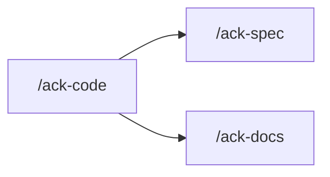

One skill for `src/` work: new behaviour, a repair, baseline seeds, the run surface that
work makes stale, and the compliance pass.
You orchestrate. The agents do the work. `coder` writes `src/`, test-first, and repairs the
run surface this change makes stale.

## TDD (HARD)

Every `src/` behaviour change in this skill is TDD. Knowing the fix does not skip the red
spec. `coder` carries `superpowers:test-driven-development`. A behaviour lands as a failing
spec, watched fail, then the minimum `src/` that turns it green. `coder` writes that spec.

A dispatch to `coder` does not grant an exception, and neither does a pinned repair.

**A spec that covers code this run did not write is `test-writer`'s**, dispatched from here
with the paths and the 100% bar (`rules/testing.md`). Name in the hand-back which specs came
from which agent.

A seed-only run, a run-surface-only run, and a judge-only run have no TDD cycle.

## Rules

Read `.claude/rules/orientation.md` before you dispatch or answer a design question. Take the
four, the extras for the agent you are about to send, then every surface row the work touches.
A shape you decide in conversation is bound by the same rows.

## Reject early

| The request | Where it goes |
|---|---|
| specs for code that already exists, or a coverage gap | `/ack-spec` |
| a docs-only pass of `docs/*.md`, the root `README.md`, `SECURITY.md`, `CONTRIBUTING.md`, or `CODE_OF_CONDUCT.md`, or `.github/**` except `copilot-instructions.md` | `/ack-docs` |
| a PR or version description document | `/ack-pr-desc` |
| `.claude/**` only | `/ack-claude-config` |

A request that is both a rule change and `src/` work stays here: rules first, then code.
Say which reject, and stop.

## Pinned vs open (HARD)

`explorer` and `planner` run only while the work is still **open**. Do not dispatch either
to confirm a path you have open, a cause already at `file:line`, or a change the owner
already named.

**Pinned** — all of these are already in hand, from the owner or from work already done in
this session:

- the files
- the cause at `file:line`, or the new behaviour fully stated
- the change
- no open product question

A pinned **repair** goes §1 → §2 if a rule must change → §6. No explorer, no planner, no
spec file, no plan file.

A pinned **new behaviour** still needs a spec the owner has approved. Dispatch `planner` in
`SPEC` mode only when that spec is not already in this session. Dispatch `planner` in `PLAN`
mode only when that plan is not already written against the approved spec. Skip `explorer`
when this session already has the location table.

**Open** — a symptom without a cause, a third-party contract this repository cannot answer,
or a shape with more than one reading. Then: §1 → §2 if needed → §3 → §4 → §5 → §6.

## Two shapes

| The request | Path |
|---|---|
| new or repaired behaviour, including seeds and the run surface | pinned or open path above, then §7 → §8 |
| judge work already on the checkout | name the paths, then §7 → §8 — no explorer, no planner, no coder |

## 1 — Interrogate, HERE

**Do this yourself, in this session.** An agent has no `AskUserQuestion`.

Use `AskUserQuestion`. Ask about the hard parts: edge cases, failure, what is out of scope,
which existing surface this becomes visible to, which route scope it belongs under (`/admin`
behaves differently from every other scope — `rules/router.md`). Keep going until nothing
material is open.

When the request is a symptom, pin it first: the input, the observed result, the expected
result, and where it surfaces. A cause you have not shown in the code is a guess.

When the request depends on a third-party contract, that is `explorer`'s research half.

State the settled requirement back in one paragraph before moving on.

When the owner already named the files, the cause, and the change, do not re-ask what is
already settled.

## 2 — Rules first (HARD)

When the work requires a change under `.claude/**`, dispatch `harness-writer` with that
change and wait for it to return **before any `src/` work**. Code is written against the
rule as it stands after that dispatch.

Do not write `src/` against a rule this run is about to change. Do not save the rule change
for close-out.

A request that is only `.claude/**` is `/ack-claude-config`.

## 3 — Explore, through `explorer`

Dispatch `explorer` with the settled requirement. It locates, researches, and brainstorms.

**Skip this step when the work is pinned**, or when this session already has the location
table and no third-party contract is still unknown.

Read the **Open questions** and put them to the owner with `AskUserQuestion` now. Dispatch
`explorer` again with the answers when any of them changes the shape.

**You do not write the spec or the plan here.** That is `planner`.

## 4 — Spec, through `planner`

Dispatch `planner` in **`SPEC` mode**. It returns `.superpowers/<slug>-spec.md`.

**Skip this step when the work is a pinned repair**, or when an approved spec for this
behaviour already exists in this session.

Read the spec's **Open questions** and put them to the owner now. Dispatch `planner` again in
`SPEC` mode when any answer changes the shape.

**Put the spec to the owner before planning it.** Name the file path and ask whether it is
right.

## 5 — Plan, through `planner`

Dispatch `planner` in **`PLAN` mode**, naming the APPROVED spec path. It returns
`.superpowers/<slug>-plan.md`.

**Skip this step when the work is a pinned repair**, or when a plan against the approved
spec already exists in this session.

Read the plan's **Open questions** — anything there goes back to the owner now.

A plan step that touches `prisma/*` or `src/migration/**` names `seed-writer` as the agent
that writes that tree.

## 6 — Build, through `coder` (HARD)

Dispatch `coder` with the plan, or with the pinned repair (files, cause at `file:line`, the
change). `coder` writes `src/` test-first against the rules, then the run surface this
change makes stale (`rules/architecture.md` → The correct shape).

**When the plan or the pin touches `prisma/*` or `src/migration/**`, `coder` dispatches
`seed-writer` itself.** Do not dispatch `seed-writer` from here unless `coder` handed that
back undone.

A schema delta is `coder`'s edit and the OWNER'S push. `coder` edits `prisma/schema.prisma`
and runs `db:generate`. Relay the push — the model, the field, the index, the data
consequence, and `pnpm db:migrate`. Nobody here may run `db:migrate`.

Findings from a picked `reviewer` go back to `coder`. One round, then stop. What `coder`
does not resolve in that round goes to the owner as an open item.

You may dispatch `doc-writer` once the behaviour has landed, when that behaviour is
described in `docs/`, a root people file (`README.md`, `SECURITY.md`, `CONTRIBUTING.md`,
`CODE_OF_CONDUCT.md`), or `.github/**` except `copilot-instructions.md`. Name the files. The
close-out question in §7 still runs.

## 7 — Offer the close-out (HARD)

The work is done and the diff is visible.

**Docs — always ask.** Ask with `AskUserQuestion` whether to update `docs/*.md`, the root
people files, and `.github/**` except `copilot-instructions.md`. Yes → dispatch `doc-writer`
with the files the work actually touched (the root four and that `.github/` tree are always
included). No → name the skip in the hand-back. Never skip the question.

Then ask once, with `AskUserQuestion`, multi-select, and dispatch only what comes back:

| Offer | Recommend it when |
|---|---|
| `reviewer` | almost always — rules plus boot plus pre-commit except `pnpm test` |
| `reviewer-e2e` | the work crossed a transport, enqueued a job, or sent a notification |

**`reviewer` and `reviewer-e2e` never run on your own initiative.** Nothing picked there
means nothing dispatched. Name every skip in the hand-back.

When `reviewer` is picked, ask it for every rule file it read, by name, and every surface it
checked and found clean. Check that list against the scope and
`rules/orientation.md`. A controller with no `http.md`, a Prisma query with no
`database.md`, a status code with no `status-code.md` — one re-dispatch for the gap.

When `doc-writer` runs, name the doc files the work actually touched. It repairs
`docs/*.md`, the root `README.md`, `SECURITY.md`, `CONTRIBUTING.md`, and
`CODE_OF_CONDUCT.md`, and `.github/**` except `copilot-instructions.md` (the root four and
that `.github/` tree are always included). A CONFLICT comes back unresolved.

## 8 — Mechanical checks (HARD)

Run all five and report each with its output:

```bash
pnpm typecheck
pnpm lint
pnpm deadcode
pnpm spell
pnpm test <module>
```

**The test run is SCOPED to the modules the work actually CHANGED.** Name each one. A module
you only read is not in scope. A full `pnpm test` belongs to `/ack-spec` and to `pre-commit`.

`coverage.enabled` is `false` in `vitest.config.ts`. Coverage is `pnpm test:cov`. A scoped
coverage run exits 1 while every spec passes because the threshold is GLOBAL — read the
`Tests` line and the per-file rows.

`spell` ALWAYS exits 0. `deadcode` (knip) exits 1 only on an `error`-level finding; unused
files and exports print as warnings — they are not findings (`rules/architecture.md`). READ
both outputs and report them.

A coverage gap beyond the TDD specs `coder` wrote is named with its file and its uncovered
lines. Closing it here is a `test-writer` dispatch carrying those paths and the 100% bar; a
sweep of a whole tree is `/ack-spec`.

**`--no-verify` is never yours to choose.**

## Verdict (when the request was to judge)

- **PASS** — all five checks green, and if `reviewer` was picked, every rule file that
  applies was read and every surface reported.
- **FAIL** — anything else. There is no third outcome.

## Boundaries

- **Never fix anything yourself.** You dispatch and you report.
- **Never dispatch `reviewer` or `reviewer-e2e` unasked.**
- Never run a DB or seed command. The schema EDIT is `coder`'s; the push is the owner's.
- Never stage or commit unless the owner asks in that exchange.
- Do not write `docs/*.md` yourself. Dispatch `doc-writer` — during the run once the
  behaviour has landed, and always after the close-out question.
- Do not write `.claude/**` yourself. Dispatch `harness-writer` in §2.
- Do not write `test/` yourself. `coder` writes the TDD spec of its plan or pin. Every other
  spec is `/ack-spec`.
- Do not write the run surface yourself. `coder` repairs it.

## Hand back

The settled requirement, whether the work was pinned or open, the spec path, the plan path,
the schema delta the owner must apply, what each agent produced, every run-surface file
`coder` checked and whether it was repaired, every status code allocated,
every finding and whether it was resolved, every operational step a rename introduced, the
output of all five checks, the docs answer, which optional checks the owner picked, and the
verdict when this run was a judge pass.

## Next



| Then run | When |
|---|---|
| `/ack-spec` | a coverage gap beyond the TDD specs, or a suite that is wrong against the code |
| `/ack-docs` | a full docs pass, or the owner declined `doc-writer` here and still wants the docs updated |
| `/ack-pr-desc` | the branch or release set is settled and needs a public PR or version description |

`/ack-pr-desc` is NOT a step here. Run it on its own once the branch or release set is
settled — it fetches and moves a local ref.
