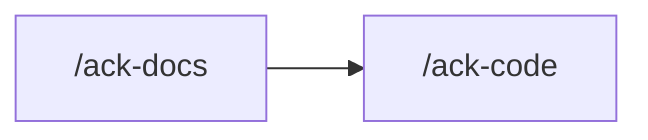

One dispatch to `doc-writer`, the only agent that may write `docs/*.md` and the root
`README.md`.

## Rules

Read `.claude/rules/orientation.md` and `.claude/rules/authoring.md` before dispatching. A
claim is bound by the same surface row that binds the code it describes. `authoring.md` is
the prose contract: final state, indicative, no filler, mermaid for flows.

## Scope

**The current checkout as it sits.** Ask the owner whether they want everything, or named
files: `docs/` holds around thirty files and a full pass is a long run.

**The root `README.md` is in scope.** It carries the version table, the prerequisites, and
the Quick Start sequence. A pass the owner asked for in whole-tree words includes it; name
it in the dispatch either way.

Git stays read-only.

## Dispatch

`doc-writer`, with the file list and, when the owner knows it, what changed recently.

## What comes back

Claims classified ACCURATE, STALE, MISSING, PHANTOM, CONTRADICTS, and CONFLICT. The first
five are repaired. **CONFLICT is never resolved by the agent.**

**Every CONFLICT goes to the owner with the git evidence for both sides.** When the evidence
suggests the CODE is wrong — a guard removed in a commit that does not mention it, a doc
newer than the change, a disagreement about authorization, credentials, or session
invalidation — that is a suspected defect, and it belongs in an `/ack-code` run, not a doc
edit.

## Read the repair

A repair states what IS. The test: would this sentence exist if the system had always been
this way. Send back any sentence that exists only because something used to be different:

- a negation that rebuts rather than states a contract
- a clause defending the claim against an older one
- an explanation of why two things differ, where the reader only needs what they are

## Prose

`rules/authoring.md` binds every line:

- indicative — a fact plus a pointer to the rule, never an obligation
- no em-dash in documentation prose
- no filler, no throat-clearing, no rhetorical questions
- a flow, a stack, or a hand-off is a mermaid diagram (`flowchart`, `sequenceDiagram`, or
  `stateDiagram-v2`)
- match the section structure already on the page

`doc-writer` then runs `avoid-ai-writing` in edit mode (`--context docs`, `--voice technical`)
on every in-scope file. `rules/authoring.md` wins any conflict. The de-AI spans come back in
the hand-back, separate from the claim classes.

## Boundaries

- `docs/status-codes.md` is the human catalog, updated from the report of whichever change
  touched a status-code enum. It is not re-derived here as a routine pass.
- No `src/`, no `test/`, no `.claude/`, no `prisma/`.
- No schema, DB, or seed commands. Never stage or commit unless the owner asks in that
  exchange.

## Hand back

What was found by class, what was repaired, every CONFLICT — unresolved, with its evidence —
and the avoid-ai-writing spans touched.

## Next

| Then run | When |
|---|---|
| `/ack-code` | a CONFLICT resolved as the CODE is wrong |
