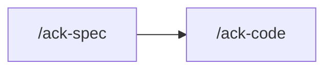

Specs against code that exists, and the no-flow repairs that code still needs. You
orchestrate. `test-writer` writes `test/`. `coder` writes a confirmed no-flow repair,
test-first.

## Rules

Read `.claude/rules/orientation.md` before dispatching. Standing extras for `test-writer`:
`testing.md`, `testing-spec-style.md`, `agent-communication.md`, then the surface row that
governs the subject. Standing extras for `coder` when you send a repair: `testing.md`,
`testing-spec-style.md`, `agent-communication.md`.

## Coverage vs repair

**Coverage.** Everything under `src/` is treated as correct. Write the spec that asserts
what the code does. Follow the code that is there. Existing specs are the style guide as
much as `rules/testing-spec-style.md`.

**Repair.** A finding is classified before anyone writes:

| Class | What it is | What you do |
|---|---|---|
| **No-flow bug** | Confirmed defect. The public contract, the guard stack, the status code, and the call order stay the same. | Dispatch `coder` with the pin. TDD. Report the fix. |
| **Flow or decision** | The repair would change a route, a DTO, a status code, a guard, who can do what, or when something happens; or two readings produce different work. | `AskUserQuestion`, or append the finding to `generated/docs/report-src-sweep.md`. Do not implement. |

A no-flow bug that is **pinned** (files, cause at `file:line`, the change) goes straight to
`coder`. No `explorer`, no `planner`. Knowing the fix does not skip the red spec.

Location unknown: dispatch `explorer`, then classify. Do not dispatch `planner` for a
no-flow repair.

A flow change the owner approves in this session, and that is pinned, may go to `coder`. A
flow change that still needs a spec and a plan is `/ack-code`.

A failing suite splits three ways:

- the SPEC is wrong, or the code moved and the spec was left behind → `test-writer`
- the CODE is a no-flow bug → `coder`, then the spec against the repaired tree
- the CODE is a flow or a decision → ask or sweep; pin the spec green against current
  behaviour until the owner decides

## The sweep (HARD)

`generated/docs/report-src-sweep.md` is an additive log. Create it with these headings when
it is missing: CHANGE, STYLE, RENAME, DELETE, ADD.

**Append only.** A new finding is a new open row under the matching heading:

```
- [ ] `src/<path>:<line>` — <the fact>
```

Never delete a row. Never rewrite the file. Never drop a SOLVED row to tidy it.

**End of every run, validate the whole file.** Re-read every row. Open the `src/` it names.

| The defect | Mark |
|---|---|
| gone | `[x]` and append `SOLVED` to that row. Prefer this over deleting. |
| still there, line moved | keep `[ ]`, update the `file:line` |
| still there, unchanged | leave it |

Do this even when this run added nothing.

## 1 — Establish what is actually wrong

Run the suite for the named scope first, and read the failure.

```bash
pnpm test <scope>
```

The scope is a path fragment; Vitest runs every spec whose path contains it.

**Clear the Vitest cache (`pnpm exec vitest --clearCache`) before believing a coverage gap.**

Classify every defect the run surfaces, every defect you notice while covering, and every
defect `test-writer` or `explorer` hands back, before dispatching.

## 2 — Repair no-flow bugs, through `coder`

For each pinned no-flow bug, dispatch `coder` with the files, the cause at `file:line`, and
the change. `coder` writes `src/` test-first.

When `coder` touches `prisma/*` or `src/migration/**`, it dispatches `seed-writer` itself.

A flow or decision stays out of this step: ask, or append to the sweep.

## 3 — Dispatch `test-writer`

Dispatch `test-writer` with the scope. Carry the target: 100% on every file in scope, and
the code as written — including repairs this run already landed — is the behaviour to
describe.

A structural rename may narrow the dispatch to **RELOCATE ONLY** — move existing green specs
and author no new assertion.

## 4 — Confirm, and reach 100% (HARD)

Re-run the suite for that scope, then run the FULL coverage suite. **This skill is the only
one that does.**

```bash
pnpm test:cov
```

Every other skill runs `pnpm test <module>` without coverage and stops there. A spec repair
reaches past its own scope: a global mock, a shared fixture, a relocated helper, and the
**100% global threshold, which is measured only when `--coverage` is on**.
`coverage.enabled` is `false` in `vitest.config.ts`, so `pnpm test` never applies the
threshold. Report the totals with the command that produced them.

Controllers, processors, repositories, contracts, and
the paths on the coverage denylist sit outside the coverage set — a gap there is not an
`/ack-spec` gap (`rules/testing.md`). The doc kit in `src/common/doc/` is measured. Changing
the denylist is an owner change to `vitest.config.ts`.

**100% is the bar.** A file in scope still short of it is another `test-writer` dispatch,
until the per-file rows read 100 across statements, branches, functions and lines. Read the
PER-FILE rows.

**The one thing that stops the coverage loop is a line that cannot be covered without
changing `src/`** — an unreachable branch, a defensive throw no input can produce, a
type-narrowing guard the compiler already proves. Classify that line: no-flow → §2; flow or
decision → ask or sweep. It is not a waiver.

## 5 — Validate the sweep (HARD)

Before handing back, run the end-of-run pass in **The sweep**. Every open row, every SOLVED
mark this run made, named in the hand-back.

## Boundaries

- **Never fix a no-flow bug yourself.** Dispatch `coder`. Never write a coverage spec
  yourself. Dispatch `test-writer`.
- **Never implement a flow change the owner has not approved.** Ask, or append to the sweep.
- **No `planner` on a pinned no-flow repair.** No `explorer` when the files and the cause
  are already in hand.
- **No review, no boot.** This skill dispatches `test-writer`, `coder`, and `explorer` when
  location is unknown, and nothing else.
- **Unit specs only.** Integration, e2e, and load tests are not this suite (`rules/testing.md`).
- Never delete or skip a spec to reach green.
- Never lower the coverage threshold, add a path to the coverage denylist, or add an
  ignore comment.
- **Never `--no-verify` on your own initiative.**
- Never stage or commit unless the owner asks in that exchange.

## Hand back

Specs written or repaired, every no-flow bug fixed (file, line, what changed), every flow
or decision asked or recorded, the coverage numbers with their command, every file that
reached 100% and every file that did not with the reason, and the sweep validation — each
open row still open, each row marked SOLVED this run.

## Next



| Then run | When |
|---|---|
| `/ack-code` | a flow change the owner approved that still needs a spec and a plan |
