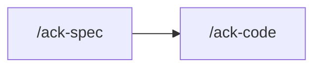

Specs only. **`src/` is not yours and not the agent's — not one line, for any reason (HARD).**

## Rules

Read `.claude/rules/orientation.md` before dispatching. Standing extras for `test-writer`:
`testing.md`, `testing-spec-style.md`, `agent-communication.md`, then the surface row that
governs the subject.

## The code is the specification

Everything under `src/` is treated as correct. Write the spec that asserts what the code
does. Code that looks wrong is still pinned green, then reported as a suspected defect with
`file:line`. The repair is a separate `/ack-code` run the owner decides on.

**Follow the code that is there.** Existing specs are the style guide as much as
`rules/testing-spec-style.md`.

A failing suite splits two ways:

- the SPEC is wrong, or the code moved and the spec was left behind → this skill
- the CODE is wrong — the spec asserts the right thing and the code does not do it →
  `/ack-code`

If making the suite green requires touching `src/`, stop and say so.

## 1 — Establish what is actually wrong

Run the suite for the named scope first, and read the failure.

```bash
pnpm test <scope>
```

The scope is a path fragment; Vitest runs every spec whose path contains it.

**Clear the Vitest cache (`pnpm exec vitest --clearCache`) before believing a coverage gap.**

## 2 — Dispatch

Dispatch `test-writer` with the scope. Carry the target: 100% on every file in scope, and
the code as written is the behaviour to describe.

A structural rename may narrow the dispatch to **RELOCATE ONLY** — move existing green specs
and author no new assertion.

## 3 — Confirm, and reach 100% (HARD)

Re-run the suite for that scope, then run the FULL coverage suite. **This skill is the only
one that does.**

```bash
pnpm test:cov
```

Every other skill runs `pnpm test <module>` without coverage and stops there. A spec repair
reaches past its own scope: a global mock, a shared fixture, a relocated helper, and the
**100% global threshold, which is measured only when `--coverage` is on**.
`coverage.enabled` is `false` in `vitest.config.ts`, so `pnpm test` never applies the
threshold. Report the totals with the command that produced them.

Controllers, processors, repositories, contracts, Swagger doc factories (`*.doc.ts`), and
the paths on the coverage denylist sit outside the coverage set — a gap there is not an
`/ack-spec` gap (`rules/testing.md`). The doc kit in `src/common/doc/` is measured. Changing
the denylist is an owner change to `vitest.config.ts`.

**100% is the bar.** A file in scope still short of it is another `test-writer` dispatch,
until the per-file rows read 100 across statements, branches, functions and lines. Read the
PER-FILE rows.

**The one thing that stops the loop is a line that cannot be covered without changing
`src/`** — an unreachable branch, a defensive throw no input can produce, a type-narrowing
guard the compiler already proves. That is a HAND-BACK naming the file, the line, and why.
It is not a waiver.

## Boundaries

- **No `src/` changes. None.** A blocked compile is a hand-back with the file and the error.
  The owner takes it to `/ack-code`.
- **No review, no boot.** This skill dispatches `test-writer` and nothing else.
- **Unit specs only.** Integration, e2e, and load tests are not this suite (`rules/testing.md`).
- Never delete or skip a spec to reach green.
- Never lower the coverage threshold, add a path to the coverage denylist, or add an
  ignore comment.
- **Never `--no-verify` on your own initiative.**
- Never stage or commit unless the owner asks in that exchange.

## Hand back

Specs written or repaired, the coverage numbers with their command, every file that reached
100% and every file that did not with the reason, and every defect pinned rather than
fixed — each with `file:line`.

## Next

Usually nothing. This skill ends where it started: `src/` unchanged.



| Then run | When |
|---|---|
| `/ack-code` | a defect you pinned green and the owner wants it repaired |

**Never repair the pinned defect from here.**
