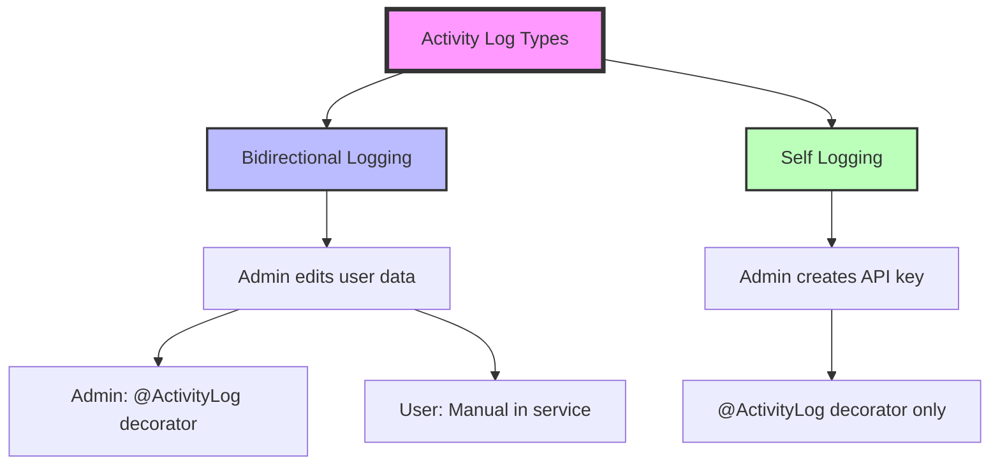
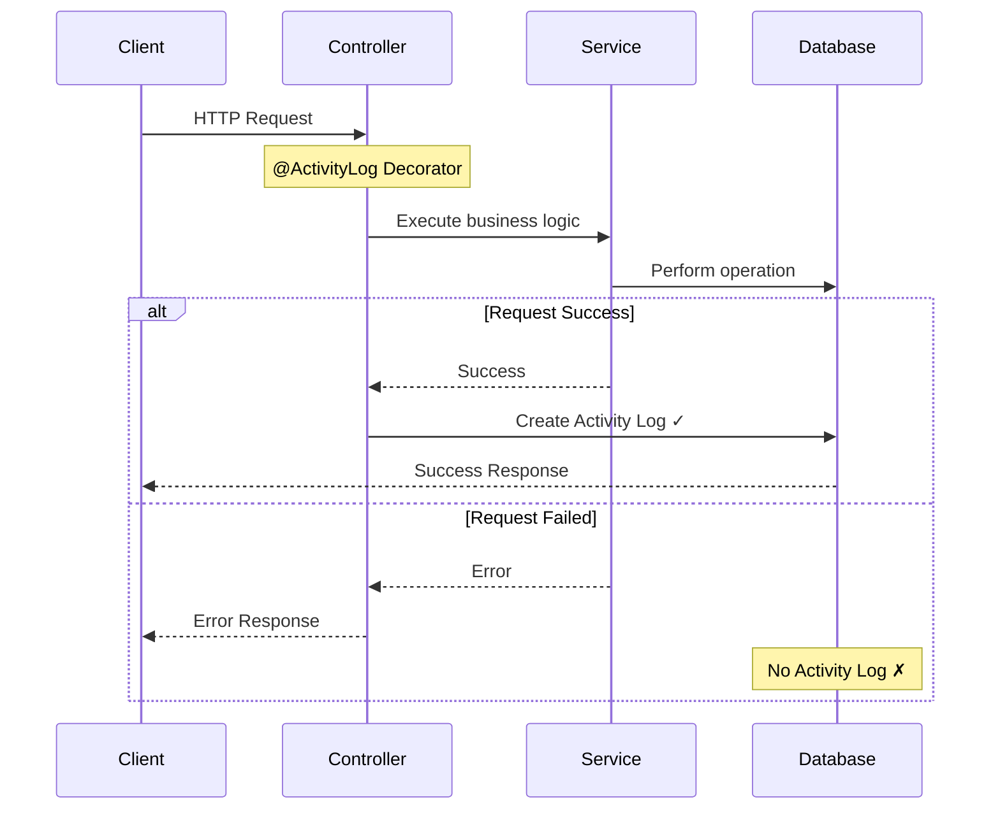
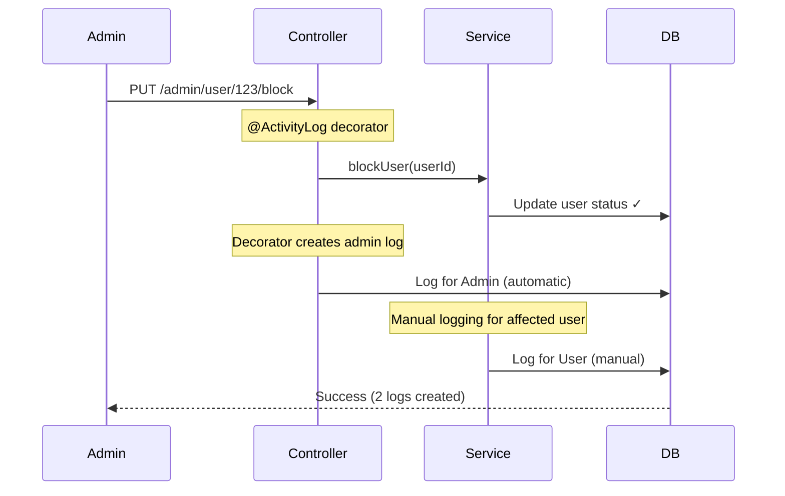

# Activity Log

> `Future Plan:` Will support decorator-based logging for all endpoints (admin and user).

## Overview

Activity Log is a system to record successful user activities in the application. It supports bidirectional logging and self-activity recording.

**Notes:**
- Activity logs are **only recorded for successful requests**. Failed requests are not logged.
- **Current Implementation:** Only admin endpoints use `@ActivityLog` decorator. All user endpoints handle logging manually in service/repository layer.

# Table of Contents

- [Overview](#overview)
- [Types](#types)
- [Flow](#flow)
- [Recorded Contains](#recorded-contains)
- [Implementation](#implementation)
  - [Admin Endpoints: Use Decorator](#admin-endpoints-use-decorator)
  - [User Endpoints: Manual Logging](#user-endpoints-manual-logging)
- [Usage Examples](#usage-examples)
  - [Admin Blocks User](#admin-blocks-user)
  - [Logs Created](#logs-created)
- [Metadata Guidelines](#metadata-guidelines)

## Types



**1. Bidirectional Logging** (Manual Implementation Required)
- Records activity from both sides
- Example: Admin blocks user
  - Admin log: Created by `@ActivityLog` decorator
  - User log: Created manually in service/repository
- **Note:** Decorator only handles self-recording, affected user must be logged manually

**2. Self Logging** (Decorator Handles Everything)
- Records only the actor's activity
- Example: Admin creates API key
  - Only admin's log is created via `@ActivityLog` decorator
- Example: User updates own profile
  - Only user's log is created (manual in service)

## Flow



## Recorded Contains

Each activity log contains:
- **userId** - User who performed or was affected
- **action** - Type of activity (enum)
- **ipAddress** - Request IP address
- **userAgent** - Browser/device info (JSON)
- **metadata** - Additional context (optional, JSON)
- **createdAt** - Timestamp

## Implementation

### Admin Endpoints: Use Decorator

Use `@ActivityLog` decorator for clean, automatic logging.

```typescript
@ActivityLog(ENUM_ACTIVITY_LOG_ACTION.adminApiKeyCreate)
@Post('/create')
async create(@Body() body: ApiKeyCreateRequestDto) {
    return this.apiKeyService.create(body);
}
```

**What the decorator does:**
- Automatically creates activity log for the admin (self-recording only)
- Captures IP address and user agent
- Only executes on successful response

**What the decorator does NOT do:**
- Does NOT create logs for affected users (bidirectional)
- For bidirectional logging, you must manually create the second log in service


### User Endpoints: Manual Logging

Record activity directly in service/repository layer.

```typescript
async updateProfile(userId: string, data: UpdateProfileDto) {
    // Update profile
    const updated = await this.userRepository.update(userId, data);
    
    // Record activity log (only on success)
    await this.activityLogRepository.create({
        userId,
        action: ENUM_ACTIVITY_LOG_ACTION.userUpdateProfile,
        ipAddress: this.request.ip,
        userAgent: this.request.userAgent,
        metadata: { updatedFields: Object.keys(data) }
    });
    
    return updated;
}
```

## Usage Examples

Admin Blocks User



**Implementation:**

```typescript
// Controller - decorator handles admin's log
@ActivityLog(ENUM_ACTIVITY_LOG_ACTION.adminUserUpdateStatus)
@Put('/user/:id/block')
async blockUser(@Param('id') userId: string) {
    return this.userService.blockUser(userId);
}

// Service - manually create log for affected user
async blockUser(userId: string) {
    const oldStatus = await this.getUserStatus(userId);
    
    // Update user status
    await this.userRepository.updateStatus(userId, 'blocked');
    
    // Manually create activity log for the affected user
    await this.activityLogRepository.create({
        userId: userId,  // The affected user
        action: ENUM_ACTIVITY_LOG_ACTION.userUpdateStatus,
        ipAddress: this.request.ip,
        userAgent: this.request.userAgent,
        metadata: {
            updatedBy: this.request.user.id,  // Admin who did it
            oldStatus: oldStatus,
            newStatus: 'blocked'
        }
    });
    
    return { success: true };
}
```

**Logs Created:**

Admin's log (created by decorator):
```json
{
  "userId": "admin-id",
  "action": "adminUserUpdateStatus",
  "ipAddress": "192.168.1.1",
  "userAgent": { ... }
}
```

User's log (created manually in service):
```json
{
  "userId": "user-123",
  "action": "userUpdateStatus",
  "metadata": {
    "updatedBy": "admin-id",
    "oldStatus": "active",
    "newStatus": "blocked"
  }
}
```

## Metadata Guidelines

**✅ Good:**
```typescript
metadata: {
  targetUserId: "user-123",
  oldValue: "active",
  newValue: "blocked",
  reason: "policy violation"
}
```

**❌ Bad:**
```typescript
metadata: {
  password: "secret123",      // Never log sensitive data!
  token: "jwt_token",          // Never log tokens!
  entireObject: { huge }       // Don't log large objects
}
```


<!-- REFERENCES -->

<!-- BADGE LINKS -->

[ack-contributors-shield]: https://img.shields.io/github/contributors/andrechristikan/ack-nestjs-boilerplate?style=for-the-badge
[ack-forks-shield]: https://img.shields.io/github/forks/andrechristikan/ack-nestjs-boilerplate?style=for-the-badge
[ack-stars-shield]: https://img.shields.io/github/stars/andrechristikan/ack-nestjs-boilerplate?style=for-the-badge
[ack-issues-shield]: https://img.shields.io/github/issues/andrechristikan/ack-nestjs-boilerplate?style=for-the-badge
[ack-license-shield]: https://img.shields.io/github/license/andrechristikan/ack-nestjs-boilerplate?style=for-the-badge
[nestjs-shield]: https://img.shields.io/badge/nestjs-%23E0234E.svg?style=for-the-badge&logo=nestjs&logoColor=white
[nodejs-shield]: https://img.shields.io/badge/Node.js-339933?style=for-the-badge&logo=nodedotjs&logoColor=white
[typescript-shield]: https://img.shields.io/badge/TypeScript-007ACC?style=for-the-badge&logo=typescript&logoColor=white
[mongodb-shield]: https://img.shields.io/badge/MongoDB-white?style=for-the-badge&logo=mongodb&logoColor=4EA94B
[jwt-shield]: https://img.shields.io/badge/JWT-000000?style=for-the-badge&logo=JSON%20web%20tokens&logoColor=white
[jest-shield]: https://img.shields.io/badge/-jest-%23C21325?style=for-the-badge&logo=jest&logoColor=white
[yarn-shield]: https://img.shields.io/badge/yarn-%232C8EBB.svg?style=for-the-badge&logo=yarn&logoColor=white
[docker-shield]: https://img.shields.io/badge/docker-%230db7ed.svg?style=for-the-badge&logo=docker&logoColor=white
[github-shield]: https://img.shields.io/badge/GitHub-100000?style=for-the-badge&logo=github&logoColor=white
[linkedin-shield]: https://img.shields.io/badge/LinkedIn-0077B5?style=for-the-badge&logo=linkedin&logoColor=white

<!-- CONTACTS -->

[ref-author-linkedin]: https://linkedin.com/in/andrechristikan
[ref-author-email]: mailto:andrechristikan@gmail.com
[ref-author-github]: https://github.com/andrechristikan
[ref-author-paypal]: https://www.paypal.me/andrechristikan
[ref-author-kofi]: https://ko-fi.com/andrechristikan

<!-- Repo LINKS -->

[ref-ack]: https://github.com/andrechristikan/ack-nestjs-boilerplate
[ref-ack-issues]: https://github.com/andrechristikan/ack-nestjs-boilerplate/issues
[ref-ack-stars]: https://github.com/andrechristikan/ack-nestjs-boilerplate/stargazers
[ref-ack-forks]: https://github.com/andrechristikan/ack-nestjs-boilerplate/network/members
[ref-ack-contributors]: https://github.com/andrechristikan/ack-nestjs-boilerplate/graphs/contributors
[ref-ack-license]: LICENSE.md

<!-- THIRD PARTY -->

[ref-nestjs]: http://nestjs.com
[ref-prisma]: https://www.prisma.io
[ref-mongodb]: https://docs.mongodb.com/
[ref-redis]: https://redis.io
[ref-bullmq]: https://bullmq.io
[ref-nodejs]: https://nodejs.org/
[ref-typescript]: https://www.typescriptlang.org/
[ref-docker]: https://docs.docker.com
[ref-dockercompose]: https://docs.docker.com/compose/
[ref-yarn]: https://yarnpkg.com
[ref-12factor]: https://12factor.net
[ref-commander]: https://nest-commander.jaymcdoniel.dev
[ref-package-json]: package.json
[ref-jwt]: https://jwt.io
[ref-jest]: https://jestjs.io/docs/getting-started
[ref-git]: https://git-scm.com
[ref-google-console]: https://console.cloud.google.com/
[ref-google-client-secret]: https://developers.google.com/identity/protocols/oauth2

<!-- DOCUMENTS -->

[ref-doc-root]: readme.md
[ref-doc-audit-activity-log]: docs/audit-activity-log.md
[ref-doc-authentication]: docs/authentication.md
[ref-doc-authorization]: docs/authorization.md
[ref-doc-cache]: docs/cache.md
[ref-doc-configuration]: docs/configuration.md
[ref-doc-database]: docs/database.md
[ref-doc-environment]: docs/environment.md
[ref-doc-feature-flag]: docs/feature-flag.md
[ref-doc-handling-error]: docs/handling-error.md
[ref-doc-installation]: docs/installation.md
[ref-doc-internationalization]: docs/internationalization.md
[ref-doc-logger]: docs/logger.md
[ref-doc-project-structure]: docs/project-structure.md
[ref-doc-queue]: docs/queue.md
[ref-doc-request-validation]: docs/request-validation.md
[ref-doc-response-structure]: docs/response-structure.md
[ref-doc-security-and-middleware]: docs/security-and-middleware.md
[ref-doc-service-side-pagination]: docs/service-side-pagination.md
[ref-doc-third-party-integration]: docs/third-party-integration.md
