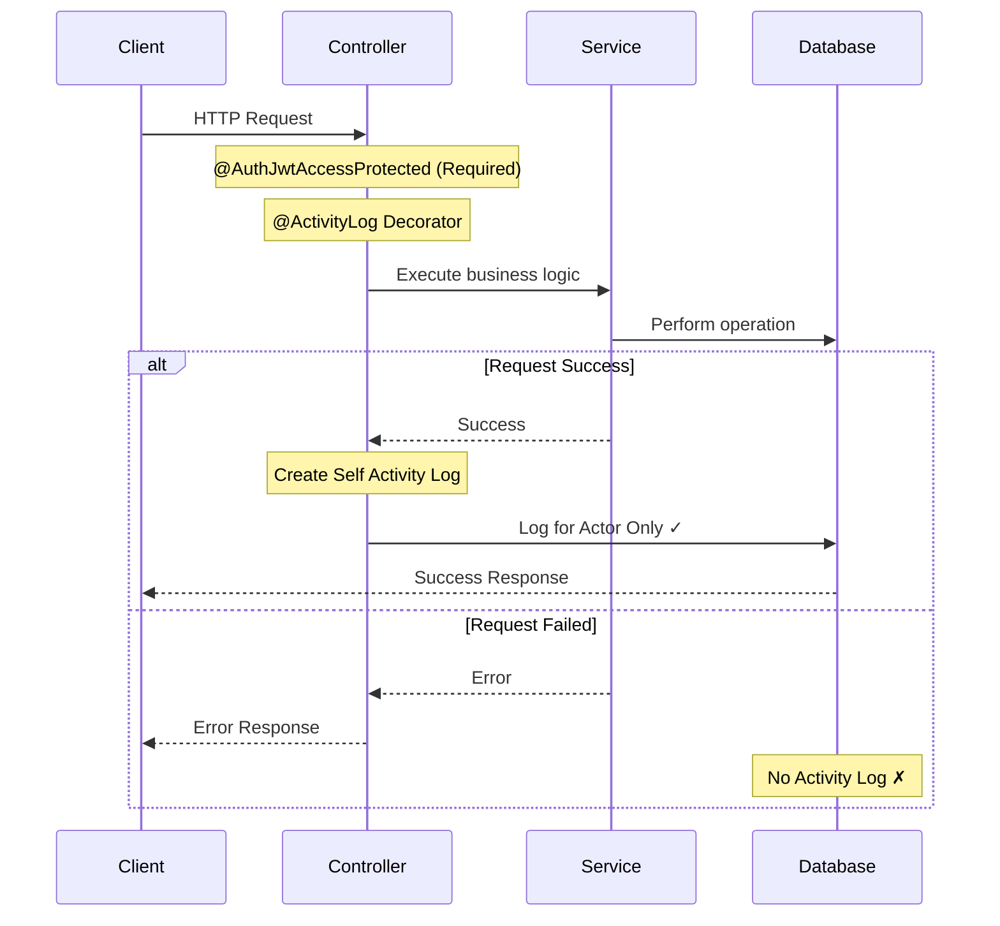
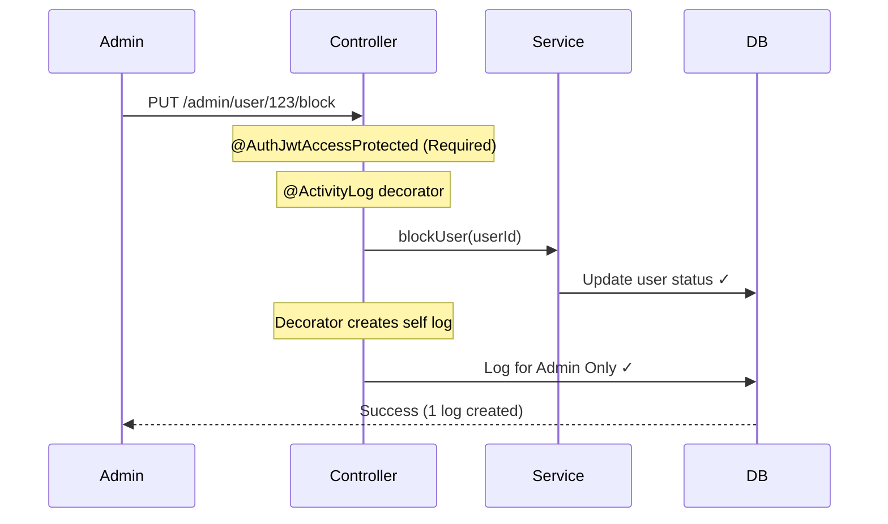

# Activity Log Documentation

This documentation explains the features and usage of **Activity Log Module**: Located at `src/modules/activity-log`

## Overview

> ⚠️ `Future Plan:` Will support decorator-based logging for bidirectional activity and self activity.

Activity Log is a system to record successful user activities in the application. It supports self activity recording.

**Notes:**
- Activity logs are **only recorded for successful requests**. Failed requests are not logged.
- `@ActivityLog` decorator is **only implemented for admin endpoints**.
- `@ActivityLog` decorator **requires** `@AuthJwtAccessProtected` decorator to be present.

## Related Documents

- [Authentication Documentation][ref-doc-authentication] - For understanding user context

## Table of Contents

- [Overview](#overview)
- [Related Documents](#related-documents)
- [Flow](#flow)
- [Data](#data)
  - [Metadata](#metadata)
- [Usage](#usage)

## Flow



## Data

Each activity log contains:
- **userId** - User who performed or was affected
- **action** - Type of activity (enum)
- **ipAddress** - Request IP address
- **userAgent** - Browser/device info (JSON)
- **metadata** - Additional context (optional, JSON)
- **createdAt** - Timestamp

### Metadata

Metadata allows you to record additional context about the activity. The decorator automatically captures metadata by reading `metadataActivityLog` from the service response.

**How it works:**

1. Service returns `IResponseReturn` with `metadataActivityLog` property
2. Decorator reads `metadataActivityLog` from response
3. Decorator includes it in the activity log under `metadata` field

**Example:**

```typescript
// Controller with decorator
@ActivityLog(ENUM_ACTIVITY_LOG_ACTION.adminUserUpdateStatus)
@AuthJwtAccessProtected() // Required for ActivityLog
@Put('/user/:id/block')
async blockUser(@Param('id') userId: string) {
    return this.userService.blockUser(userId); // Returns IResponseReturn
}

// Service returns IResponseReturn with metadataActivityLog
async blockUser(userId: string): Promise<IResponseReturn> {
    const user = await this.userRepository.findOneById(userId);
    const oldStatus = user.status; // Store old value
    
    const updated = await this.userRepository.updateStatus(userId, 'blocked');
    
    // Return with metadataActivityLog
    return {
        data: this.userUtil.mapOne(updated),
        metadataActivityLog: {
            userId: user.id,
            userName: user.name,
            oldStatus: oldStatus,    // Before change
            newStatus: 'blocked'     // After change
        }
    };
}
```

**Result:** Activity log will contain the metadata automatically.

```json
{
  "userId": "admin-id",
  "action": "adminUserUpdateStatus",
  "metadata": {
    "userId": "user-123",
    "userName": "John Doe",
    "oldStatus": "active",
    "newStatus": "blocked"
  }
}
```

**Guidelines:**

Never include sensitive data:
```typescript
metadataActivityLog: {
    password: "secret123",        // Never!
    accessToken: "jwt_token",     // Never!
    entireUserObject: { ... }     // Too large
}
```

## Usage

Admin Blocks User



**Implementation:**

```typescript
// Controller - decorator handles admin's log
@ActivityLog(ENUM_ACTIVITY_LOG_ACTION.adminUserUpdateStatus)
@AuthJwtAccessProtected() // Required for ActivityLog decorator
@Put('/user/:id/block')
async blockUser(@Param('id') userId: string) {
    return this.userService.blockUser(userId);
}

// Service - returns metadataActivityLog
async blockUser(userId: string): Promise<IResponseReturn> {
    const user = await this.userRepository.findOneById(userId);
    const updated = await this.userRepository.updateStatus(userId, 'blocked');
    
    return {
        data: this.userUtil.mapOne(updated),
        metadataActivityLog: {
            userId: user.id,
            userName: user.name,
            oldStatus: user.status,
            newStatus: 'blocked'
        }
    };
}
```

**Logs Created:**

```json
{
  "userId": "admin-id",
  "action": "adminUserUpdateStatus",
  "ipAddress": "192.168.1.1",
  "userAgent": { ... },
  "metadata": {
    "userId": "user-123",
    "userName": "John Doe",
    "oldStatus": "active",
    "newStatus": "blocked"
  }
}
```


<!-- REFERENCES -->

<!-- BADGE LINKS -->

[ack-contributors-shield]: https://img.shields.io/github/contributors/andrechristikan/ack-nestjs-boilerplate?style=for-the-badge
[ack-forks-shield]: https://img.shields.io/github/forks/andrechristikan/ack-nestjs-boilerplate?style=for-the-badge
[ack-stars-shield]: https://img.shields.io/github/stars/andrechristikan/ack-nestjs-boilerplate?style=for-the-badge
[ack-issues-shield]: https://img.shields.io/github/issues/andrechristikan/ack-nestjs-boilerplate?style=for-the-badge
[ack-license-shield]: https://img.shields.io/github/license/andrechristikan/ack-nestjs-boilerplate?style=for-the-badge
[nestjs-shield]: https://img.shields.io/badge/nestjs-%23E0234E.svg?style=for-the-badge&logo=nestjs&logoColor=white
[nodejs-shield]: https://img.shields.io/badge/Node.js-339933?style=for-the-badge&logo=nodedotjs&logoColor=white
[typescript-shield]: https://img.shields.io/badge/TypeScript-007ACC?style=for-the-badge&logo=typescript&logoColor=white
[mongodb-shield]: https://img.shields.io/badge/MongoDB-white?style=for-the-badge&logo=mongodb&logoColor=4EA94B
[jwt-shield]: https://img.shields.io/badge/JWT-000000?style=for-the-badge&logo=JSON%20web%20tokens&logoColor=white
[jest-shield]: https://img.shields.io/badge/-jest-%23C21325?style=for-the-badge&logo=jest&logoColor=white
[yarn-shield]: https://img.shields.io/badge/yarn-%232C8EBB.svg?style=for-the-badge&logo=yarn&logoColor=white
[docker-shield]: https://img.shields.io/badge/docker-%230db7ed.svg?style=for-the-badge&logo=docker&logoColor=white
[github-shield]: https://img.shields.io/badge/GitHub-100000?style=for-the-badge&logo=github&logoColor=white
[linkedin-shield]: https://img.shields.io/badge/LinkedIn-0077B5?style=for-the-badge&logo=linkedin&logoColor=white

<!-- CONTACTS -->

[ref-author-linkedin]: https://linkedin.com/in/andrechristikan
[ref-author-email]: mailto:andrechristikan@gmail.com
[ref-author-github]: https://github.com/andrechristikan
[ref-author-paypal]: https://www.paypal.me/andrechristikan
[ref-author-kofi]: https://ko-fi.com/andrechristikan

<!-- Repo LINKS -->

[ref-ack]: https://github.com/andrechristikan/ack-nestjs-boilerplate
[ref-ack-issues]: https://github.com/andrechristikan/ack-nestjs-boilerplate/issues
[ref-ack-stars]: https://github.com/andrechristikan/ack-nestjs-boilerplate/stargazers
[ref-ack-forks]: https://github.com/andrechristikan/ack-nestjs-boilerplate/network/members
[ref-ack-contributors]: https://github.com/andrechristikan/ack-nestjs-boilerplate/graphs/contributors
[ref-ack-license]: LICENSE.md

<!-- THIRD PARTY -->

[ref-nestjs]: http://nestjs.com
[ref-prisma]: https://www.prisma.io
[ref-mongodb]: https://docs.mongodb.com/
[ref-redis]: https://redis.io
[ref-bullmq]: https://bullmq.io
[ref-nodejs]: https://nodejs.org/
[ref-typescript]: https://www.typescriptlang.org/
[ref-docker]: https://docs.docker.com
[ref-dockercompose]: https://docs.docker.com/compose/
[ref-yarn]: https://yarnpkg.com
[ref-12factor]: https://12factor.net
[ref-commander]: https://nest-commander.jaymcdoniel.dev
[ref-package-json]: package.json
[ref-jwt]: https://jwt.io
[ref-jest]: https://jestjs.io/docs/getting-started
[ref-git]: https://git-scm.com
[ref-google-console]: https://console.cloud.google.com/
[ref-google-client-secret]: https://developers.google.com/identity/protocols/oauth2

<!-- DOCUMENTS -->

[ref-doc-root]: readme.md
[ref-doc-activity-log]: docs/activity-log.md
[ref-doc-authentication]: docs/authentication.md
[ref-doc-authorization]: docs/authorization.md
[ref-doc-cache]: docs/cache.md
[ref-doc-configuration]: docs/configuration.md
[ref-doc-database]: docs/database.md
[ref-doc-environment]: docs/environment.md
[ref-doc-feature-flag]: docs/feature-flag.md
[ref-doc-file-upload]: docs/file-upload.md
[ref-doc-handling-error]: docs/handling-error.md
[ref-doc-installation]: docs/installation.md
[ref-doc-logger]: docs/logger.md
[ref-doc-message]: docs/message.md
[ref-doc-pagination]: docs/pagination.md
[ref-doc-project-structure]: docs/project-structure.md
[ref-doc-queue]: docs/queue.md
[ref-doc-request-validation]: docs/request-validation.md
[ref-doc-response]: docs/response.md
[ref-doc-security-and-middleware]: docs/security-and-middleware.md
[ref-doc-doc]: docs/doc.md
[ref-doc-third-party-integration]: docs/third-party-integration.md
