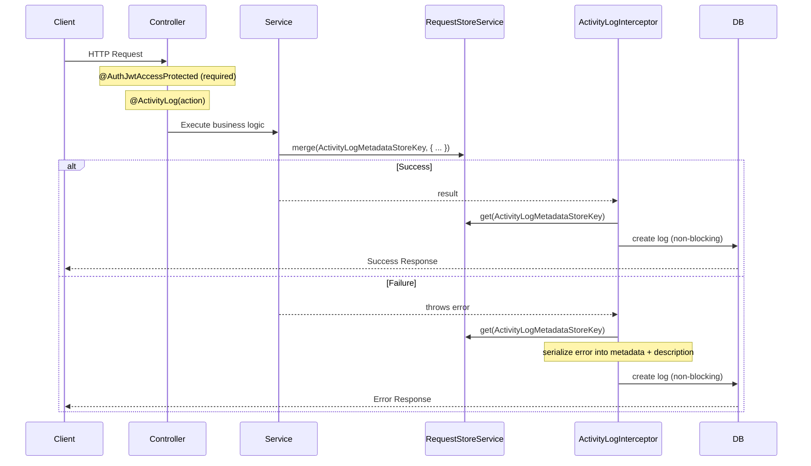

# Activity Log Documentation

This documentation explains the features and usage of **Activity Log Module**: Located at `src/modules/activity-log`

## Overview

> [!NOTE]
> `Future Plan:` Will support decorator-based logging for bidirectional activity and self activity. The `user*` actions in `EnumActivityLogAction` are reserved for this and are not wired yet.

Activity Log records audited user actions. Recording is decorator-driven: `@ActivityLog` attaches `ActivityLogInterceptor` to a controller method, the interceptor persists one log for the authenticated actor after the handler runs.

**Notes:**

- Logs are recorded for **both success and failure**. On failure the error is serialized: `errorMessage` and `errorStack` are merged into `metadata`, and ` - Error: <message>` is appended to `description`.
- Saving is **non-blocking** (fire-and-forget). A failed write is logged and never breaks the response.
- `@ActivityLog` is currently applied to **admin endpoints only** (all `admin*` actions).
- `@ActivityLog` **requires** `@AuthJwtAccessProtected` so `request.user` is populated before the interceptor runs.
- Never log secrets (password, token, apiKey) or large objects in metadata.

## Related Documents

- [Authentication Documentation][ref-doc-authentication] - For user context (`request.user`)
- [Authorization Documentation][ref-doc-authorization] - For decorator order and guards
- [Response Documentation][ref-doc-response] - For serialization of list responses
- [Message Documentation][ref-doc-message] - For the i18n description source
- [Pagination Documentation][ref-doc-pagination] - For the list endpoints

## Table of Contents

- [Activity Log Documentation](#activity-log-documentation)
  - [Overview](#overview)
  - [Related Documents](#related-documents)
  - [Table of Contents](#table-of-contents)
  - [Architecture](#architecture)
  - [Flow](#flow)
  - [Recording an Activity](#recording-an-activity)
    - [@ActivityLog Decorator](#activitylog-decorator)
    - [Metadata](#metadata-dynamic-only)
    - [Request store (metadata)](#request-store-metadata)
  - [Data](#data)
    - [Metadata](#metadata)
    - [Description](#description)

## Architecture

| Component | Responsibility |
|---|---|
| `@ActivityLog(action)` | Method decorator: attaches the interceptor, stores the action |
| `ActivityLogInterceptor` | Reads the action, reads dynamic metadata and request context (`IRequestLog`: IP, user agent, geo) from the request store, persists the log on success and failure |
| `RequestStoreService` | Generic per-request carrier (`nestjs-cls` / AsyncLocalStorage); holds both the dynamic metadata and the request log (`RequestLogStoreKey`); shared by all modules |
| `ActivityLogService` | Read side: paginated listing for admin and self |
| `ActivityLogRepository` | Data access (Prisma) |
| `ActivityLogUtil` | Builds the i18n description, serializes list responses |

## Flow


```mermaid
sequenceDiagram
    participant Client
    participant Controller
    participant Service
    participant Storage as RequestStoreService
    participant Interceptor as ActivityLogInterceptor
    participant DB

    Client->>Controller: HTTP Request
    Note over Controller: @AuthJwtAccessProtected (required)
    Note over Controller: @ActivityLog(action)
    Controller->>Service: Execute business logic
    Service->>Storage: merge(ActivityLogMetadataStoreKey, { ... })
    alt Success
        Service-->>Interceptor: result
        Interceptor->>Storage: get(ActivityLogMetadataStoreKey)
        Interceptor->>DB: create log (non-blocking)
        DB-->>Client: Success Response
    else Failure
        Service-->>Interceptor: throws error
        Interceptor->>Storage: get(ActivityLogMetadataStoreKey)
        Note over Interceptor: serialize error into metadata + description
        Interceptor->>DB: create log (non-blocking)
        DB-->>Client: Error Response
    end
```

## Recording an Activity

### @ActivityLog Decorator

```typescript
ActivityLog(action: EnumActivityLogAction): MethodDecorator
```

- `action` - the recorded action enum, also the i18n key for the description (`activityLog.<action>`).

The decorator takes only `action`. There is no static metadata at decoration time; all metadata is set dynamically from the service via `RequestStoreService.merge(ActivityLogMetadataStoreKey, ...)`.

Place it per the decorator order rules (see [Authorization Documentation][ref-doc-authorization]). It must sit above `@AuthJwtAccessProtected`.

```typescript
@ActivityLog(EnumActivityLogAction.adminRoleCreate)
@AuthJwtAccessProtected() // required
@Post('/create')
async create(@Body() dto: RoleCreateRequestDto): Promise<IResponseReturn<RoleDto>> {
    return this.roleService.create(dto);
}
```

### Metadata (dynamic only)

All metadata is dynamic: set at runtime from the service via `RequestStoreService.merge(ActivityLogMetadataStoreKey, ...)`. Use it for entity values resolved during the request. The interceptor reads it from the request store and, on failure, merges in the serialized error (`{ ...metadata, ...error }`) before writing.

### Request store (metadata)

Dynamic metadata lives in the generic `RequestStoreService` (`@common/request`), backed by `nestjs-cls`. Services call `merge(ActivityLogMetadataStoreKey, metadata)` to shallow-merge into the current request's metadata; the interceptor reads it via `get(ActivityLogMetadataStoreKey)`. The `ActivityLogMetadataStoreKey` constant is the only key used for activity-log metadata.

Request context (IP, user agent, geo) is read from the same store under `RequestLogStoreKey`. It is computed once per request by `RequestUtil.buildRequestLog(req)` in `RequestRequestLogMiddleware`, not recomputed by the interceptor. See [Security and Middleware Documentation][ref-doc-security-and-middleware].

```typescript
merge<T extends object>(key: string, value: Partial<T>): void; // shallow-merge into the request store
get<T>(key: string): T | null;                                 // null when none set
```

Build the metadata shape in the module's util, then merge it in the service:

```typescript
// Service - inject RequestStoreService, merge metadata after the mutation
async create(dto: RoleCreateRequestDto): Promise<IResponseReturn<RoleDto>> {
    const created = await this.roleRepository.create(dto);

    this.requestStoreService.merge<IActivityLogMetadata>(
        ActivityLogMetadataStoreKey,
        this.roleUtil.mapActivityLogMetadata(created)
    );

    return { data: this.roleUtil.mapOne(created) };
}

// Util - owns the metadata shape
mapActivityLogMetadata(role: Role): IActivityLogMetadata {
    return {
        roleId: role.id,
        roleName: role.name,
        roleType: role.type,
        timestamp: role.updatedAt ?? role.createdAt,
    };
}
```

## Data

Each log contains:

- **userId** - the authenticated actor (from JWT)
- **user** - related user record (included on read)
- **action** - `EnumActivityLogAction`
- **description** - localized text; on failure the error message is appended
- **ipAddress** - read from the request store `IRequestLog` (may be null); resolved once per request via `@supercharge/request-ip`
- **userAgent** - read from the request store `IRequestLog` (JSON); parsed once per request via `ua-parser-js`
- **geoLocation** - read from the request store `IRequestLog` (JSON, may be null): `latitude`, `longitude`, `country`, `region`, `city`; derived from IP via `geoip-lite`
- **metadata** - dynamic context from the request store (JSON, null when empty)
- **createdAt** - timestamp

### Metadata

```typescript
type IActivityLogMetadata = Record<string, string | number | Date | boolean>;
```

Stored as `null` when empty. On failure the interceptor adds `errorMessage` and `errorStack`.

```json
{
  "userId": "admin-id",
  "action": "adminUserUpdateStatus",
  "geoLocation": {
    "latitude": -6.2,
    "longitude": 106.8,
    "country": "ID",
    "region": "JK",
    "city": "Jakarta"
  },
  "metadata": {
    "userId": "user-123",
    "userName": "John Doe",
    "oldStatus": "active",
    "newStatus": "blocked"
  }
}
```

**Never** include sensitive or oversized values:

```typescript
this.requestStoreService.merge<IActivityLogMetadata>(ActivityLogMetadataStoreKey, {
    password: 'secret123',     // never
    accessToken: 'jwt_token',  // never
    entireUserObject: { ... }, // too large
});
```

### Description

Built by `ActivityLogUtil.getDescription`, which resolves the i18n key `activityLog.<action>` via `MessageService.setMessage`, passing the merged metadata for placeholder interpolation. Strings live in `src/languages/<lang>/activityLog.json`. On failure, ` - Error: <message>` is appended.


<!-- REFERENCES -->

[ref-doc-authentication]: authentication.md
[ref-doc-authorization]: authorization.md
[ref-doc-response]: response.md
[ref-doc-message]: message.md
[ref-doc-pagination]: pagination.md
[ref-doc-security-and-middleware]: security-and-middleware.md