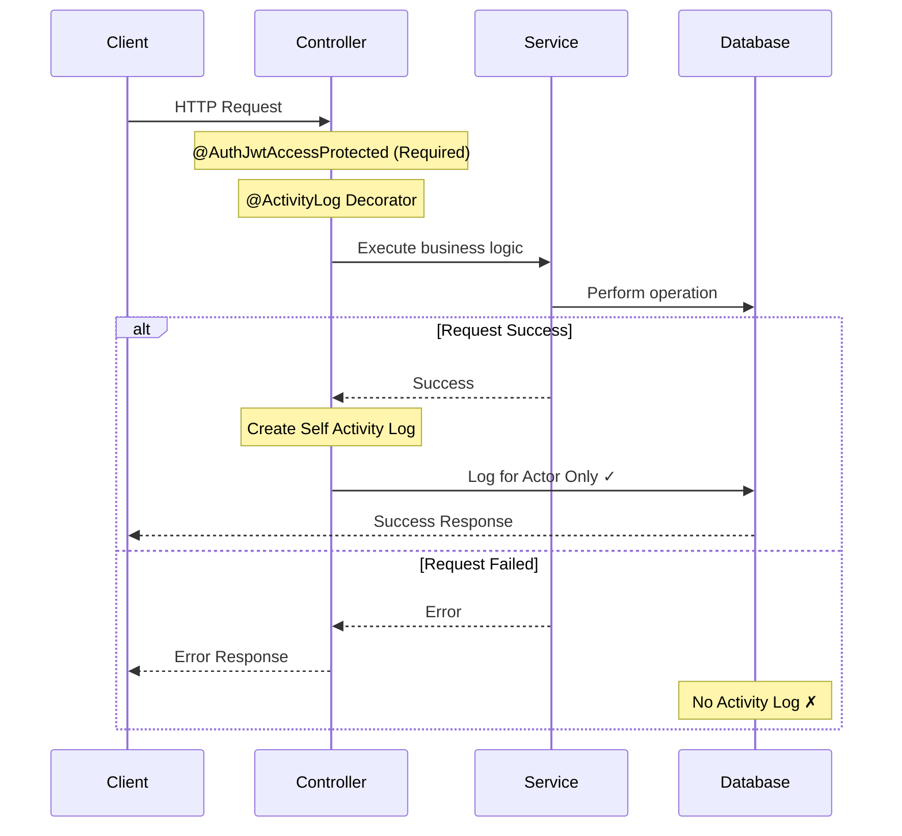
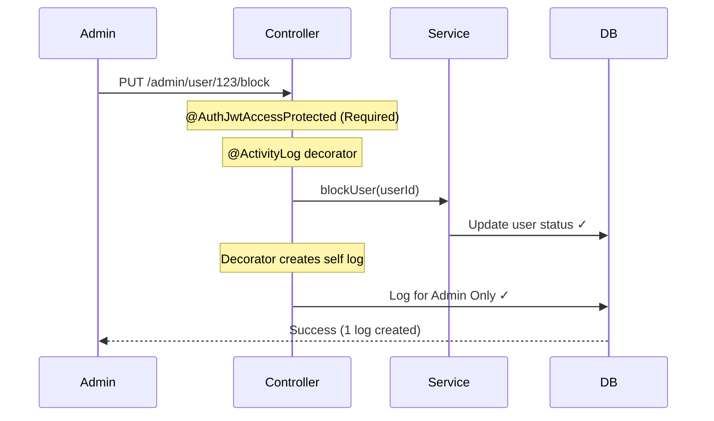

# Activity Log Documentation

This documentation explains the features and usage of **Activity Log Module**: Located at `src/modules/activity-log`

## Overview

> ⚠️ `Future Plan:` Will support decorator-based logging for bidirectional activity and self activity.

Activity Log is a system to record successful user activities in the application. It supports self activity recording.

**Notes:**
- Activity logs are **only recorded for successful requests**. Failed requests are not logged.
- `@ActivityLog` decorator is **only implemented for admin endpoints**.
- `@ActivityLog` decorator **requires** `@AuthJwtAccessProtected` decorator to be present.

## Related Documents

- [Authentication Documentation][ref-doc-authentication] - For understanding user context

## Table of Contents

- [Overview](#overview)
- [Related Documents](#related-documents)
- [Flow](#flow)
- [Data](#data)
  - [Metadata](#metadata)
- [Usage](#usage)

## Flow


```mermaid
sequenceDiagram
    participant Client
    participant Controller
    participant Service
    participant Database
    
    Client->>Controller: HTTP Request
    Note over Controller: @AuthJwtAccessProtected (Required)
    Note over Controller: @ActivityLog Decorator
    Controller->>Service: Execute business logic
    Service->>Database: Perform operation
    
    alt Request Success
        Service-->>Controller: Success
        Note over Controller: Create Self Activity Log
        Controller->>Database: Log for Actor Only ✓
        Database-->>Client: Success Response
    else Request Failed
        Service-->>Controller: Error
        Controller-->>Client: Error Response
        Note over Database: No Activity Log ✗
    end
```

## Data

Each activity log contains:
- **userId** - User who performed or was affected
- **action** - Type of activity (enum)
- **ipAddress** - Request IP address
- **userAgent** - Browser/device info (JSON)
- **geoLocation** - Geographic location derived from IP address (optional, JSON) — contains `latitude`, `longitude`, `country`, `region`, `city`
- **metadata** - Additional context (optional, JSON)
- **createdAt** - Timestamp

### Metadata

Metadata allows you to record additional context about the activity. The decorator automatically captures metadata by reading `metadataActivityLog` from the service response.

**How it works:**

1. Service returns `IResponseReturn` with `metadataActivityLog` property
2. Decorator reads `metadataActivityLog` from response
3. Decorator includes it in the activity log under `metadata` field

**Example:**

```typescript
// Controller with decorator
@ActivityLog(EnumActivityLogAction.adminUserUpdateStatus)
@AuthJwtAccessProtected() // Required for ActivityLog
@Put('/user/:id/block')
async blockUser(@Param('id') userId: string) {
    return this.userService.blockUser(userId); // Returns IResponseReturn
}

// Service returns IResponseReturn with metadataActivityLog
async blockUser(userId: string): Promise<IResponseReturn> {
    const user = await this.userRepository.findOneById(userId);
    const oldStatus = user.status; // Store old value
    
    const updated = await this.userRepository.updateStatus(userId, 'blocked');
    
    // Return with metadataActivityLog
    return {
        data: this.userUtil.mapOne(updated),
        metadataActivityLog: {
            userId: user.id,
            userName: user.name,
            oldStatus: oldStatus,    // Before change
            newStatus: 'blocked'     // After change
        }
    };
}
```

**Result:** Activity log will contain the metadata automatically.

```json
{
  "userId": "admin-id",
  "action": "adminUserUpdateStatus",
  "geoLocation": {
    "latitude": -6.2,
    "longitude": 106.8,
    "country": "ID",
    "region": "JK",
    "city": "Jakarta"
  },
  "metadata": {
    "userId": "user-123",
    "userName": "John Doe",
    "oldStatus": "active",
    "newStatus": "blocked"
  }
}
```

**Guidelines:**

Never include sensitive data:
```typescript
metadataActivityLog: {
    password: "secret123",        // Never!
    accessToken: "jwt_token",     // Never!
    entireUserObject: { ... }     // Too large
}
```

## Usage

Admin Blocks User


```mermaid
sequenceDiagram
    participant Admin
    participant Controller
    participant Service
    participant DB
    
    Admin->>Controller: PUT /admin/user/123/block
    Note over Controller: @AuthJwtAccessProtected (Required)
    Note over Controller: @ActivityLog decorator
    Controller->>Service: blockUser(userId)
    Service->>DB: Update user status ✓
    Note over Controller: Decorator creates self log
    Controller->>DB: Log for Admin Only ✓
    DB-->>Admin: Success (1 log created)
```

**Implementation:**

```typescript
// Controller - decorator handles admin's log
@ActivityLog(EnumActivityLogAction.adminUserUpdateStatus)
@AuthJwtAccessProtected() // Required for ActivityLog decorator
@Put('/user/:id/block')
async blockUser(@Param('id') userId: string) {
    return this.userService.blockUser(userId);
}

// Service - returns metadataActivityLog
async blockUser(userId: string): Promise<IResponseReturn> {
    const user = await this.userRepository.findOneById(userId);
    const updated = await this.userRepository.updateStatus(userId, 'blocked');
    
    return {
        data: this.userUtil.mapOne(updated),
        metadataActivityLog: {
            userId: user.id,
            userName: user.name,
            oldStatus: user.status,
            newStatus: 'blocked'
        }
    };
}
```

**Logs Created:**

```json
{
  "userId": "admin-id",
  "action": "adminUserUpdateStatus",
  "ipAddress": "192.168.1.1",
  "userAgent": { ... },
  "geoLocation": {
    "latitude": -6.2,
    "longitude": 106.8,
    "country": "ID",
    "region": "JK",
    "city": "Jakarta"
  },
  "metadata": {
    "userId": "user-123",
    "userName": "John Doe",
    "oldStatus": "active",
    "newStatus": "blocked"
  }
}
```


<!-- REFERENCES -->

[ref-doc-authentication]: authentication.md

