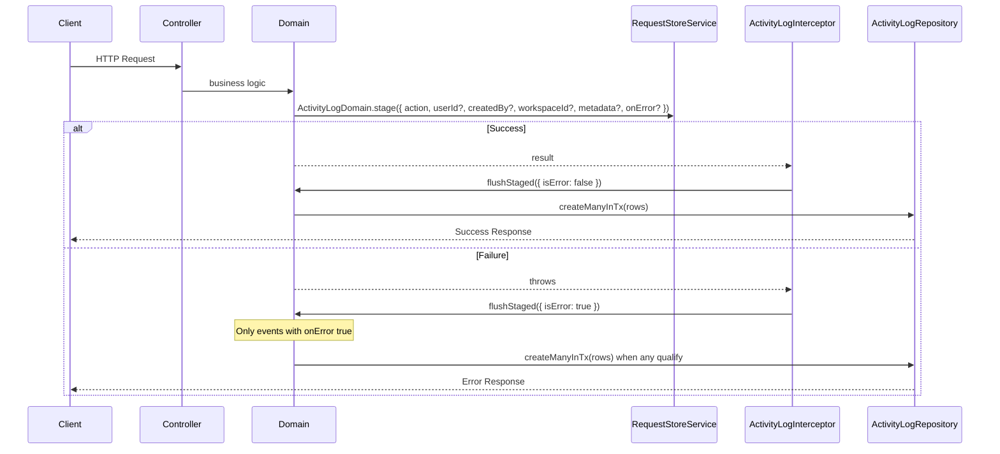
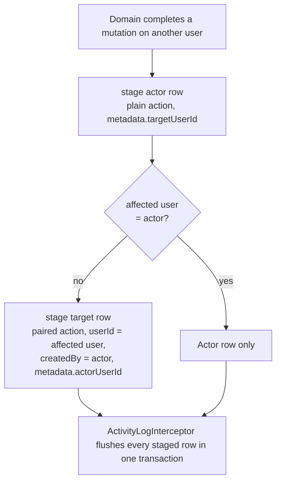

# Activity Log Documentation

This documentation explains the features and usage of **Activity Log Module**: Located at `src/modules/activity-log`

## Overview

Activity Log records audited user actions. Domains call `ActivityLogDomain.stage` during the request. The always-on `ActivityLogInterceptor` (registered from `ActivityLogDomainModule`) flushes staged events after the handler settles: success flushes every staged event; an error path flushes only events staged with `onError: true`. Flushed rows go through `ActivityLogRepository.createManyInTx` inside `DatabaseService.withTransaction`.

An action one user takes on another user writes two rows: one owned by the actor and one owned by the affected user. See [Actor and target rows](#actor-and-target-rows).

**`userLoginFailed`:** On credential password mismatch, `UserAuthDomain` increments the password-attempt counter and calls `UserLoginDomain.stageLoginFailed`, which stages `EnumActivityLogAction.userLoginFailed` with `userId` and `createdBy` set to the target user. Contract in `ActivityLogContractByAction`: `user = target`, `workspace = none`, metadata `ActivityLogEmptyMetadataSchema`. i18n description: `activityLog.userLoginFailed` ("Login failed with invalid credentials"). Login path: [Authentication](authentication.md). Analytic failed-login metrics count `userLoginFailed` rows: [Analytic](analytic.md).

**Notes:**

- Flush failures are logged and do not change the handler outcome.
- Metadata carries no secrets (password, token, API key) and no large objects; each action's metadata schema in `ActivityLogContractByAction` declares what it holds. Metadata is returned to the client through a typed response schema. The constraint when changing this: `.claude/rules/security.md`.

## Related Documents

- [Authentication Documentation][ref-doc-authentication] - For user context (`request.user`)
- [Authorization Documentation][ref-doc-authorization] - For guards and policy abilities
- [Response Documentation][ref-doc-response] - For serialization of list responses
- [Message Documentation][ref-doc-message] - For the i18n description source
- [Pagination Documentation][ref-doc-pagination] - For the list endpoints
- [Analytic Documentation][ref-doc-analytic] - Metrics that count activity-log actions

## Table of Contents

- [Overview](#overview)
- [Related Documents](#related-documents)
- [Architecture](#architecture)
- [List Endpoints](#list-endpoints)
- [Flow](#flow)
- [Staging an activity](#staging-an-activity)
- [Actor and target rows](#actor-and-target-rows)
- [Data](#data)

## Architecture

| Component | Responsibility |
|---|---|
| `ActivityLogDomain.stage` | Validates contract and metadata, pushes an event onto the request-store stage list |
| `ActivityLogInterceptor` | After the handler settles, calls `ActivityLogDomain.flushStaged` (all staged on success; `onError: true` only on error) |
| `RequestStoreService` | Per-request carrier for staged events (`ActivityLogStageStoreKey`), request log, and workspace |
| `ActivityLogDomain.flushStaged` | Builds rows and writes them via `ActivityLogRepository.createManyInTx` |
| `ActivityLogHttpService` | Transport layer for the four list routes; the page it returns is serialized against `ActivityLogResponseSchema` declared on the route |
| `ActivityLogRepository` | Data access (Prisma), including `createManyInTx` |
| `ActivityLogUtil` | Builds the i18n description (`getDescription`) |
| `ActivityLogContractByAction` | Per-action contract: how `userId` and `workspaceId` resolve, and the metadata schema |
| `ActivityLogWorkspaceVolumeExcludedActions` | Target-side workspace and project actions left out of workspace volume metrics |

## List Endpoints

| Method | Path | Scope |
|--------|------|-------|
| `GET` | `/shared/user/activity-log/list` | Authenticated user lists own logs (cursor) |
| `GET` | `/shared/user/activity-log/workspace/list` | Authenticated user lists own logs in the workspace from `x-workspace-id` (cursor) |
| `GET` | `/admin/activity-log/user/:userId/list` | Admin lists a user's logs (offset) |
| `GET` | `/admin/activity-log/workspace/:workspaceId/list` | Admin lists a workspace's logs, optionally narrowed by a `userId` query param (offset) |

Global prefix `/api` and version `v1` apply as elsewhere.

The two user-scoped lists return every row whose `userId` is that user, with or without a workspace: the actions the user performed and the target rows written when someone else acted on the user. The two workspace-scoped lists return the rows of one workspace. The shared one is narrowed to the caller's rows; the admin one is narrowed only when `userId` is passed, so a paired workspace action appears there twice, once for each party.

## Flow


```mermaid
sequenceDiagram
    participant Client
    participant Controller
    participant Domain
    participant Storage as RequestStoreService
    participant Interceptor as ActivityLogInterceptor
    participant Repo as ActivityLogRepository

    Client->>Controller: HTTP Request
    Controller->>Domain: business logic
    Domain->>Storage: ActivityLogDomain.stage({ action, userId?, createdBy?, workspaceId?, metadata?, onError? })
    alt Success
        Domain-->>Interceptor: result
        Interceptor->>Domain: flushStaged({ isError: false })
        Domain->>Repo: createManyInTx(rows)
        Repo-->>Client: Success Response
    else Failure
        Domain-->>Interceptor: throws
        Interceptor->>Domain: flushStaged({ isError: true })
        Note over Domain: Only events with onError true
        Domain->>Repo: createManyInTx(rows) when any qualify
        Repo-->>Client: Error Response
    end
```

## Staging an activity

Domains call `ActivityLogDomain.stage` after the mutation they are auditing (or, for `userLoginFailed`, after a password mismatch). Metadata is validated against `ActivityLogContractByAction[action].metadata` at stage time. Example pattern from owner domains:

```typescript
this.activityLogDomain.stage({
    action: EnumActivityLogAction.adminRoleCreate,
    metadata: this.roleUtil.mapActivityLogMetadata(created),
});
```

`userLoginFailed` stages with an explicit target `userId`, the same user as `createdBy`, and empty metadata:

```typescript
this.activityLogDomain.stage({
    action: EnumActivityLogAction.userLoginFailed,
    userId,
    createdBy: userId,
});
```

The contract's `user` value decides which user fields `stage` accepts:

| `user` | Row owner (`userId`) | `createdBy` | What `stage` carries |
|---|---|---|---|
| `payload` | The JWT user (`request.user.userId`), read by `ActivityLogInterceptor` and resolved at flush | The row owner | Neither `userId` nor `createdBy` |
| `target` | The `userId` passed to `stage` | The `createdBy` passed to `stage`: the acting user, or the row's own user on a self or public path | Both `userId` and `createdBy` |

A missing required field, or a user field passed to a `payload` action, throws `ActivityLogContractInvalidException`. The contract's `workspace` value works the same way: `payload` reads the current workspace from the request store, `target` takes the staged `workspaceId`, and `none` stores `null`.

Request context (IP, user agent, geo) is read at flush from `RequestLogStoreKey`, filled once per request by `RequestRequestLogMiddleware`. See [Security and Middleware][ref-doc-security-and-middleware].

## Actor and target rows

When one user acts on another user, the domain stages two rows. The **actor row** uses the action the actor performed and belongs to the actor. The **target row** uses the paired `…ByAdmin`, `…ByOwner`, or `…ByInvitee` action (or `userBlocked` / `userUpdateStatus` for a status change), has contract `user = target`, and belongs to the affected user, with `createdBy` set to the actor. When the actor and the affected user are the same person, the domain stages the actor row only; each stage site makes that comparison itself.


```mermaid
flowchart TD
    A[Domain completes a mutation on another user] --> B["stage actor row<br/>plain action, metadata.targetUserId"]
    B --> C{"affected user<br/>= actor?"}
    C -->|yes| E[Actor row only]
    C -->|no| D["stage target row<br/>paired action, userId = affected user,<br/>createdBy = actor, metadata.actorUserId"]
    D --> F[ActivityLogInterceptor flushes every staged row in one transaction]
    E --> F
```

| Actor action (row of the actor) | Target action (row of the affected user) | Affected user |
|---|---|---|
| `adminUserCreate` | `userCreatedByAdmin` | The new user |
| `adminUserImport` | `userCreatedByAdmin`, one row per imported user | Each new user |
| `adminUserUpdateStatus` | `userBlocked` (status `blocked`), `userUpdateStatus` (any other status) | The updated user |
| `adminUserUpdatePassword` | `userUpdatePasswordByAdmin` | The updated user |
| `adminUserResetTwoFactor` | `userResetTwoFactorByAdmin` | The updated user |
| `adminSessionRevoke` | `userRevokeSessionByAdmin` | The session owner |
| `adminSessionRevokeAll` | `userRevokeAllSessionsByAdmin` | The session owner |
| `adminDeviceRemove` | `userRemoveDeviceByAdmin` | The device owner |
| `workspaceMemberRoleUpdated` | `workspaceMemberRoleUpdatedByAdmin` | The target member |
| `workspaceMemberRemoved` | `workspaceMemberRemovedByAdmin` | The removed member |
| `workspaceOwnershipTransferred` | `workspaceOwnershipTransferredByOwner` | The new owner |
| `workspaceInviteCreated` | `workspaceInviteCreatedByAdmin` | The active account whose email matches the invite |
| `workspaceInviteRevoked` | `workspaceInviteRevokedByAdmin` | The active account whose email matches the invite |
| `workspaceInviteAccepted` | `workspaceInviteAcceptedByInvitee` | The inviter |
| `workspaceJoinAccepted` | `workspaceJoinAcceptedByAdmin` | The requester |
| `workspaceJoinRejected` | `workspaceJoinRejectedByAdmin` | The requester |
| `projectMemberAssigned` | `projectMemberAssignedByAdmin` | The assigned member |
| `projectMemberRoleUpdated` | `projectMemberRoleUpdatedByAdmin` | The target member |
| `projectMemberRemoved` | `projectMemberRemovedByAdmin` | The removed member |

- **Invites:** The invite actor row is written whether or not the email has an account. The target row is written only when the email belongs to an active account.
- **Admin onboarding:** Admin create and admin import also stage `userSendVerificationEmail` and `workspaceCreatedByAdmin` (the personal workspace) for each new user. Every per-user row belongs to the new user and has `createdBy` set to the admin; only `adminUserCreate` / `adminUserImport` belongs to the admin. Sign-up stages `userSignedUp` and `userSendVerificationEmail`, social sign-up stages `userCreated`, and both stage `workspaceCreated` for a personal workspace or the `workspaceInviteAccepted` pair for an invite token, with the new user as `createdBy`.
- **Self targets:** The admin single-session revoke and the admin device removal accept the admin's own account and then write the actor row only. Status change, temporary password, two-factor reset, and revoke-all reject the admin's own account with `UserNotSelfException` (400, `51001`) and write no row.
- **Single-row actions:** An action whose actor is the affected user writes one row under its plain name: every self-service `user…` action, `userRemoveDevice`, `userRevokeSession`, `workspaceCreated`, `workspaceUpdated`, `workspaceVisibilityUpdated`, `workspaceDeleted`, `workspaceSwitched`, `workspaceJoinRequested`, `workspaceMemberLeft`, `projectCreated`, `projectUpdated`, `projectDeleted`, and `projectMemberLeft`. An invite resend writes no row.
- **Counting:** `ActivityLogWorkspaceVolumeExcludedActions` lists the eleven workspace and project target actions. Workspace volume metrics leave them out, so each paired workspace event counts once. `workspaceCreatedByAdmin` is not on the list, because the admin's row for the same event carries no workspace. See [Analytic][ref-doc-analytic].

The pair model and the self check are bound by `.claude/rules/security.md` (Activity log).

## Data

Each flushed log contains:

- **userId** - the user the entry belongs to: the JWT user for a `payload` action, the staged `userId` for a `target` action
- **user** - the same user as `userId`, embedded on read
- **createdBy** - the user who performed the action (see [Actor and target rows](#actor-and-target-rows)); nullable in the response
- **action** - `EnumActivityLogAction`, a Prisma enum; a new member reaches MongoDB through `pnpm db:migrate`
- **description** - localized text from `ActivityLogUtil.getDescription` (`activityLog.<action>`)
- **ipAddress** - from the request store `IRequestLog` (may be null)
- **userAgent** - from the request store `IRequestLog` (JSON)
- **geoLocation** - from the request store `IRequestLog` (JSON, may be null)
- **metadata** - staged metadata (JSON, null when empty)
- **workspaceId** - from the staged value, the current workspace store, or null when the contract is `workspace = none` (as with `userLoginFailed`)
- **createdAt** - timestamp

### Metadata

```typescript
type IActivityLogMetadata = Record<string, string | number | boolean | Date>;
```

Stored as `null` when empty. Each action's schema is a strict zod object, so a key the schema does not declare fails the contract at stage time. Every id in the schemas below is required.

| Actions | Keys |
|---|---|
| `workspaceMemberRoleUpdated`, `workspaceMemberRemoved`, `workspaceOwnershipTransferred`, `workspaceInviteAccepted`, `workspaceJoinAccepted`, `workspaceJoinRejected`, `projectMemberAssigned`, `projectMemberRoleUpdated`, `projectMemberRemoved` | `targetUserId` |
| `workspaceInviteCreated`, `workspaceInviteRevoked` | `workspaceInviteId`, plus `targetUserId` when the email belongs to an active account |
| The eleven workspace and project target actions, `workspaceCreatedByAdmin` | `actorUserId` |
| `adminUserCreate`, `adminUserUpdateStatus`, `adminUserUpdatePassword`, `adminUserResetTwoFactor` | `targetUserId`, `targetUsername`, `timestamp` |
| `userCreatedByAdmin`, `userBlocked`, `userUpdateStatus`, `userUpdatePasswordByAdmin`, `userResetTwoFactorByAdmin` | `actorUserId`, `timestamp` |
| `adminUserImport` | `userCount` |
| `adminSessionRevoke` | `targetUserId`, `targetUsername`, `timestamp`, `sessionId` |
| `userRevokeSessionByAdmin` | `actorUserId`, `timestamp`, `sessionId` |
| `adminSessionRevokeAll` | `targetUserId`, `sessionCount` |
| `userRevokeAllSessionsByAdmin` | `actorUserId`, `sessionCount` |
| `adminDeviceRemove` | `targetUserId`, `targetUsername`, `timestamp`, `deviceOwnershipId`, `deviceId`, `sessionCount` |
| `userRemoveDeviceByAdmin` | `actorUserId`, `timestamp`, `deviceOwnershipId`, `deviceId`, `sessionCount` |
| API key, role, term policy, and notification setting actions | Their own schemas; every key optional |
| Every other action | None |

The response returns `metadata` through `ActivityLogMetadataResponseSchema`, which declares every key above as optional, types `timestamp` as a string, and is `null` when nothing was stored. A stored key the schema does not declare is stripped from the response. The schema lives in `dtos/response/activity-log.metadata.response.dto.ts`; the constraint when changing it: `.claude/rules/dto.md`.

### Description

Built by `ActivityLogUtil.getDescription`, which resolves `activityLog.<action>` via `MessageService.setMessage`, passing staged metadata for placeholder interpolation. The text is rendered at flush and stored on the row. Strings live in `src/languages/<lang>/activityLog.json`. Target rows use fixed text with no placeholder ("Your workspace role has been updated"); the admin actor rows that carry `targetUsername` interpolate it ("Status of user {targetUsername} has been updated").


<!-- REFERENCES -->

[ref-doc-authentication]: authentication.md
[ref-doc-authorization]: authorization.md
[ref-doc-response]: response.md
[ref-doc-message]: message.md
[ref-doc-pagination]: pagination.md
[ref-doc-security-and-middleware]: security-and-middleware.md
[ref-doc-analytic]: analytic.md
