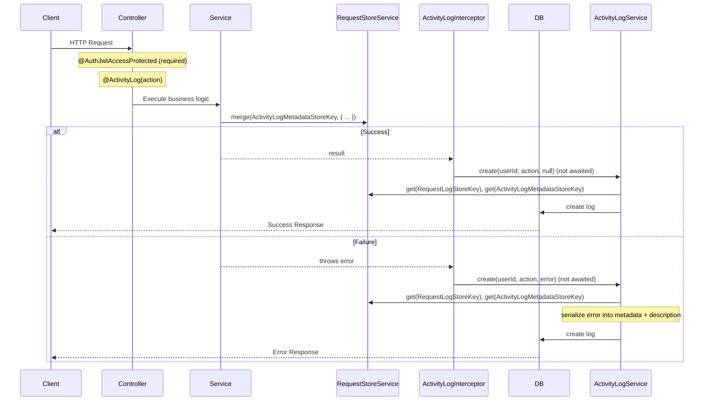

# Activity Log Documentation

This documentation explains the features and usage of **Activity Log Module**: Located at `src/modules/activity-log`

## Overview

Activity Log records audited user actions. There are two recording paths:

1. **Decorator-driven** - `@ActivityLog` attaches `ActivityLogInterceptor` to a controller method; after the handler runs the interceptor hands the action to `ActivityLogService.create()`, which writes one log for the authenticated actor. This document covers that path.
2. **Transaction-recorded** - a domain service calls `ActivityLogService.recordInTx` inside `this.databaseService.client.$transaction`. `ActivityLogRepository.createInTx` writes the `ActivityLog` row, with the description from `ActivityLogUtil.getDescription` and the `workspaceId` the caller passes. Every `user*`, `workspace*`, and `project*` action in `EnumActivityLogAction` is recorded this way (`userLoginCredential`, `workspaceInviteAccepted`, `projectMemberAssigned`, and the rest).

**Notes:**

- Logs are recorded for **both success and failure**. On failure the error is serialized: `errorMessage` is merged into `metadata`, and `description` gains ` - Error: <message>` followed by ` - Stack: <stack>` when the error carried a stack.
- Saving through the interceptor is **non-blocking** (fire-and-forget). A failed write is logged and never breaks the response. A `recordInTx` log is part of the caller-owned transaction and rolls back with it.
- `@ActivityLog` is applied to **admin endpoints only** (`admin*` actions).
- `@ActivityLog` **requires** `@AuthJwtAccessProtected` so `request.user` is populated before the interceptor runs. The interceptor is a no-op when `request.user` is absent.
- Do not log secrets (password, token, apiKey) or large objects in metadata.

## Related Documents

- [Authentication Documentation][ref-doc-authentication] - For user context (`request.user`)
- [Authorization Documentation][ref-doc-authorization] - For decorator order and guards
- [Response Documentation][ref-doc-response] - For serialization of list responses
- [Message Documentation][ref-doc-message] - For the i18n description source
- [Pagination Documentation][ref-doc-pagination] - For the list endpoints

## Table of Contents

- [Activity Log Documentation](#activity-log-documentation)
  - [Overview](#overview)
  - [Related Documents](#related-documents)
  - [Table of Contents](#table-of-contents)
  - [Architecture](#architecture)
  - [Flow](#flow)
  - [Recording an Activity](#recording-an-activity)
    - [@ActivityLog Decorator](#activitylog-decorator)
    - [Metadata](#metadata-dynamic-only)
    - [Request store (metadata)](#request-store-metadata)
  - [Data](#data)
    - [Metadata](#metadata)
    - [Description](#description)

## Architecture

| Component | Responsibility |
|---|---|
| `@ActivityLog(action)` | Method decorator: attaches the interceptor, stores the action |
| `ActivityLogInterceptor` | Reads the action off the handler, and on both the success and the error path calls `ActivityLogService.create(userId, action, rawError)` without awaiting it |
| `RequestStoreService` | Generic per-request carrier (`nestjs-cls` / AsyncLocalStorage); holds both the dynamic metadata and the request log (`RequestLogStoreKey`); shared by all modules |
| `ActivityLogService` | Write side of both paths: `create` for the interceptor (reads metadata and `IRequestLog` from the request store, serializes any error, swallows a failed write); `recordInTx` for a caller-owned transaction (takes `IRequestLog` and `workspaceId`, rejects so the transaction rolls back). Read side: paginated listing for admin and self, user-scoped or workspace-scoped |
| `ActivityLogHttpService` | Transport layer for the four list routes; the page it returns is serialized against `ActivityLogResponseSchema` declared on the route |
| `ActivityLogRepository` | Data access (Prisma): `create` for the interceptor path, `createInTx` for the transaction path |
| `ActivityLogUtil` | Builds the i18n description (`getDescription`) |

## List Endpoints

| Method | Path | Scope |
|--------|------|-------|
| `GET` | `/shared/user/activity-log/list` | Authenticated user lists own logs (cursor) |
| `GET` | `/shared/user/activity-log/workspace/list` | Authenticated user lists own logs in the workspace from `x-workspace-id` (cursor) |
| `GET` | `/admin/activity-log/user/:userId/list` | Admin lists a user's logs (offset) |
| `GET` | `/admin/activity-log/workspace/:workspaceId/list` | Admin lists a workspace's logs, optionally narrowed by a `userId` query param (offset) |

Global prefix `/api` and version `v1` apply as elsewhere.

The two user-scoped lists match rows whose `workspaceId` is null or unset, so an account's own timeline holds the logs that belong to no workspace. A log written inside a workspace mutation appears in the two workspace-scoped lists.

## Flow


```mermaid
sequenceDiagram
    participant Client
    participant Controller
    participant Service
    participant Storage as RequestStoreService
    participant Interceptor as ActivityLogInterceptor
    participant DB

    Client->>Controller: HTTP Request
    Note over Controller: @AuthJwtAccessProtected (required)
    Note over Controller: @ActivityLog(action)
    Controller->>Service: Execute business logic
    Service->>Storage: merge(ActivityLogMetadataStoreKey, { ... })
    alt Success
        Service-->>Interceptor: result
        Interceptor->>ActivityLogService: create(userId, action, null) (not awaited)
        ActivityLogService->>Storage: get(RequestLogStoreKey), get(ActivityLogMetadataStoreKey)
        ActivityLogService->>DB: create log
        DB-->>Client: Success Response
    else Failure
        Service-->>Interceptor: throws error
        Interceptor->>ActivityLogService: create(userId, action, error) (not awaited)
        ActivityLogService->>Storage: get(RequestLogStoreKey), get(ActivityLogMetadataStoreKey)
        Note over ActivityLogService: serialize error into metadata + description
        ActivityLogService->>DB: create log
        DB-->>Client: Error Response
    end
```

## Recording an Activity

### @ActivityLog Decorator

```typescript
ActivityLog(action: EnumActivityLogAction): MethodDecorator
```

- `action` - the recorded action enum, also the i18n key for the description (`activityLog.<action>`).

The decorator takes only `action`. There is no static metadata at decoration time; all metadata is set dynamically from the service via `RequestStoreService.merge(ActivityLogMetadataStoreKey, ...)`.

Place it per the decorator order rules (see [Authorization Documentation][ref-doc-authorization]). It sits above `@AuthJwtAccessProtected` in source so the interceptor runs after JWT has populated `request.user`.

```typescript
@Response('role.create', { schema: RoleSchema })
@ActivityLog(EnumActivityLogAction.adminRoleCreate)
@AuthJwtAccessProtected() // required
@Post('/create')
async create(
    @Body({ schema: RoleCreateRequestSchema }) body: RoleCreateRequestDto
): Promise<IResponseReturn<RoleDto>> {
    return this.roleHttpService.create(body);
}
```

### Metadata (dynamic only)

All metadata is dynamic: set at runtime from the service via `RequestStoreService.merge(ActivityLogMetadataStoreKey, ...)`. Use it for entity values resolved during the request. `ActivityLogService.create()` reads it from the request store and, on failure, merges in the serialized error (`{ ...metadata, ...error }`) before writing.

### Request store (metadata)

Dynamic metadata lives in the generic `RequestStoreService` (`@common/request`), backed by `nestjs-cls`. Services call `merge(ActivityLogMetadataStoreKey, metadata)` to shallow-merge into the current request's metadata; the interceptor reads it via `get(ActivityLogMetadataStoreKey)`. The `ActivityLogMetadataStoreKey` constant is the only key used for activity-log metadata.

Request context (IP, user agent, geo) is read from the same store under `RequestLogStoreKey`. It is computed once per request by `RequestUtil.buildRequestLog(req)` in `RequestRequestLogMiddleware`, and read from there rather than recomputed. See [Security and Middleware Documentation][ref-doc-security-and-middleware].

```typescript
merge<T extends object>(key: string, value: Partial<T>): void; // shallow-merge into the request store
get<T>(key: string): T | null;                                 // null when none set
```

Build the metadata shape in the module's util, then merge it in the service:

```typescript
// Service - inject RequestStoreService, merge metadata after the mutation
async create(body: RoleCreateRequestDto): Promise<IResponseReturn<RoleDto>> {
    const created = await this.roleRepository.create(body);

    this.requestStoreService.merge<IActivityLogMetadata>(
        ActivityLogMetadataStoreKey,
        this.roleUtil.mapActivityLogMetadata(created)
    );

    return { data: created };
}

// Util - owns the metadata shape
mapActivityLogMetadata(role: Role): IActivityLogMetadata {
    return {
        roleId: role.id,
        roleName: role.name,
        roleType: role.type,
        timestamp: role.updatedAt ?? role.createdAt,
    };
}
```

## Data

Each log contains:

- **userId** - the authenticated actor (from JWT)
- **user** - related user record (included on read)
- **action** - `EnumActivityLogAction`
- **description** - localized text; on failure the error message is appended
- **ipAddress** - read from the request store `IRequestLog` (may be null); resolved once per request via `@supercharge/request-ip`
- **userAgent** - read from the request store `IRequestLog` (JSON); parsed once per request via `ua-parser-js`
- **geoLocation** - read from the request store `IRequestLog` (JSON, may be null): `latitude`, `longitude`, `country`, `region`, `city`; derived from IP via `geoip-lite`
- **metadata** - dynamic context from the request store (JSON, null when empty)
- **workspaceId** - the workspace a `recordInTx` log belongs to, passed by the caller. An interceptor-written log carries none, which is what places it in the user-scoped lists
- **createdAt** - timestamp

### Metadata

```typescript
type IActivityLogMetadata = Record<string, string | number | Date | boolean>;
```

Stored as `null` when empty. On failure `errorMessage` is added; the stack goes to the description rather than the metadata.

```json
{
  "userId": "admin-id",
  "action": "adminUserUpdateStatus",
  "geoLocation": {
    "latitude": -6.2,
    "longitude": 106.8,
    "country": "ID",
    "region": "JK",
    "city": "Jakarta"
  },
  "metadata": {
    "userId": "user-123",
    "userName": "John Doe",
    "oldStatus": "active",
    "newStatus": "blocked"
  }
}
```

**Never** include sensitive or oversized values:

```typescript
this.requestStoreService.merge<IActivityLogMetadata>(ActivityLogMetadataStoreKey, {
    password: 'secret123',     // never
    accessToken: 'jwt_token',  // never
    entireUserObject: { ... }, // too large
});
```

### Description

Built by `ActivityLogUtil.getDescription`, which resolves the i18n key `activityLog.<action>` via `MessageService.setMessage`, passing the merged metadata for placeholder interpolation. Strings live in `src/languages/<lang>/activityLog.json`. On failure, ` - Error: <message>` is appended.


<!-- REFERENCES -->

[ref-doc-authentication]: authentication.md
[ref-doc-authorization]: authorization.md
[ref-doc-response]: response.md
[ref-doc-message]: message.md
[ref-doc-pagination]: pagination.md
[ref-doc-security-and-middleware]: security-and-middleware.md