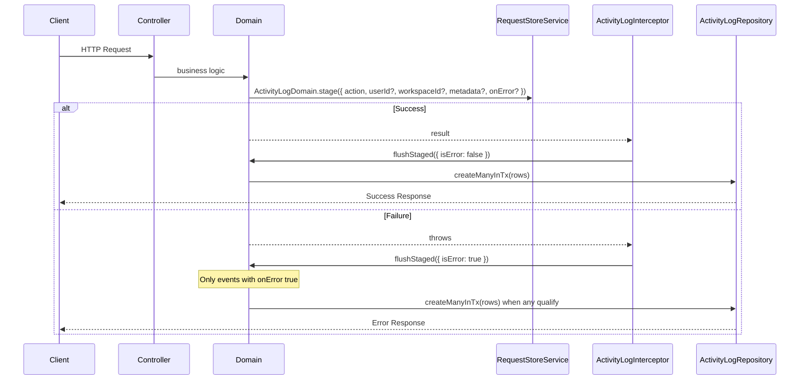

# Activity Log Documentation

This documentation explains the features and usage of **Activity Log Module**: Located at `src/modules/activity-log`

## Overview

Activity Log records audited user actions. Domains call `ActivityLogDomain.stage` during the request. The always-on `ActivityLogInterceptor` (registered from `ActivityLogDomainModule`) flushes staged events after the handler settles: success flushes every staged event; an error path flushes only events staged with `onError: true`. Flushed rows go through `ActivityLogRepository.createManyInTx` inside `DatabaseService.withTransaction`.

**`userLoginFailed`:** On credential password mismatch, `UserAuthDomain` increments the password-attempt counter and calls `UserLoginDomain.stageLoginFailed`, which stages `EnumActivityLogAction.userLoginFailed` with `userId` set to the target user. Contract in `ActivityLogContractByAction`: `user = target`, `workspace = none`, metadata `ActivityLogEmptyMetadataSchema`. i18n description: `activityLog.userLoginFailed` ("Login failed with invalid credentials"). Login path: [Authentication](authentication.md). Analytic failed-login metrics count `userLoginFailed` rows: [Analytic](analytic.md).

**Notes:**

- Flush failures are logged and do not change the handler outcome.
- Do not stage secrets (password, token, apiKey) or large objects in metadata.

## Related Documents

- [Authentication Documentation][ref-doc-authentication] - For user context (`request.user`)
- [Authorization Documentation][ref-doc-authorization] - For guards and policy abilities
- [Response Documentation][ref-doc-response] - For serialization of list responses
- [Message Documentation][ref-doc-message] - For the i18n description source
- [Pagination Documentation][ref-doc-pagination] - For the list endpoints
- [Analytic Documentation][ref-doc-analytic] - Metrics that count activity-log actions

## Table of Contents

- [Overview](#overview)
- [Related Documents](#related-documents)
- [Architecture](#architecture)
- [List Endpoints](#list-endpoints)
- [Flow](#flow)
- [Staging an activity](#staging-an-activity)
- [Data](#data)

## Architecture

| Component | Responsibility |
|---|---|
| `ActivityLogDomain.stage` | Validates contract and metadata, pushes an event onto the request-store stage list |
| `ActivityLogInterceptor` | After the handler settles, calls `ActivityLogDomain.flushStaged` (all staged on success; `onError: true` only on error) |
| `RequestStoreService` | Per-request carrier for staged events (`ActivityLogStageStoreKey`), request log, and workspace |
| `ActivityLogDomain.flushStaged` | Builds rows and writes them via `ActivityLogRepository.createManyInTx` |
| `ActivityLogHttpService` | Transport layer for the four list routes; the page it returns is serialized against `ActivityLogResponseSchema` declared on the route |
| `ActivityLogRepository` | Data access (Prisma), including `createManyInTx` |
| `ActivityLogUtil` | Builds the i18n description (`getDescription`) |

## List Endpoints

| Method | Path | Scope |
|--------|------|-------|
| `GET` | `/shared/user/activity-log/list` | Authenticated user lists own logs (cursor) |
| `GET` | `/shared/user/activity-log/workspace/list` | Authenticated user lists own logs in the workspace from `x-workspace-id` (cursor) |
| `GET` | `/admin/activity-log/user/:userId/list` | Admin lists a user's logs (offset) |
| `GET` | `/admin/activity-log/workspace/:workspaceId/list` | Admin lists a workspace's logs, optionally narrowed by a `userId` query param (offset) |

Global prefix `/api` and version `v1` apply as elsewhere.

The two user-scoped lists match rows whose `workspaceId` is null or unset, so an account's own timeline holds the logs that belong to no workspace. A log written inside a workspace mutation appears in the two workspace-scoped lists.

## Flow


```mermaid
sequenceDiagram
    participant Client
    participant Controller
    participant Domain
    participant Storage as RequestStoreService
    participant Interceptor as ActivityLogInterceptor
    participant Repo as ActivityLogRepository

    Client->>Controller: HTTP Request
    Controller->>Domain: business logic
    Domain->>Storage: ActivityLogDomain.stage({ action, userId?, workspaceId?, metadata?, onError? })
    alt Success
        Domain-->>Interceptor: result
        Interceptor->>Domain: flushStaged({ isError: false })
        Domain->>Repo: createManyInTx(rows)
        Repo-->>Client: Success Response
    else Failure
        Domain-->>Interceptor: throws
        Interceptor->>Domain: flushStaged({ isError: true })
        Note over Domain: Only events with onError true
        Domain->>Repo: createManyInTx(rows) when any qualify
        Repo-->>Client: Error Response
    end
```

## Staging an activity

Domains call `ActivityLogDomain.stage` after the mutation they are auditing (or, for `userLoginFailed`, after a password mismatch). Metadata is validated against `ActivityLogContractByAction[action].metadata` at stage time. Example pattern from owner domains:

```typescript
this.activityLogDomain.stage({
    action: EnumActivityLogAction.adminRoleCreate,
    metadata: this.roleUtil.mapActivityLogMetadata(created),
});
```

`userLoginFailed` stages with an explicit target `userId` and empty metadata:

```typescript
this.activityLogDomain.stage({
    action: EnumActivityLogAction.userLoginFailed,
    userId,
});
```

Request context (IP, user agent, geo) is read at flush from `RequestLogStoreKey`, filled once per request by `RequestRequestLogMiddleware`. See [Security and Middleware][ref-doc-security-and-middleware].

## Data

Each flushed log contains:

- **userId** - from the staged target or from `request.user.userId` when the contract uses the actor
- **user** - related user record (included on read)
- **action** - `EnumActivityLogAction`
- **description** - localized text from `ActivityLogUtil.getDescription` (`activityLog.<action>`)
- **ipAddress** - from the request store `IRequestLog` (may be null)
- **userAgent** - from the request store `IRequestLog` (JSON)
- **geoLocation** - from the request store `IRequestLog` (JSON, may be null)
- **metadata** - staged metadata (JSON, null when empty)
- **workspaceId** - from the staged value, the current workspace store, or null when the contract is `workspace = none` (as with `userLoginFailed`)
- **createdAt** - timestamp

### Metadata

```typescript
type IActivityLogMetadata = Record<string, string | number | Date | boolean>;
```

Stored as `null` when empty. Secrets and oversized objects do not belong in metadata.

### Description

Built by `ActivityLogUtil.getDescription`, which resolves `activityLog.<action>` via `MessageService.setMessage`, passing staged metadata for placeholder interpolation. Strings live in `src/languages/<lang>/activityLog.json`.


<!-- REFERENCES -->

[ref-doc-authentication]: authentication.md
[ref-doc-authorization]: authorization.md
[ref-doc-response]: response.md
[ref-doc-message]: message.md
[ref-doc-pagination]: pagination.md
[ref-doc-security-and-middleware]: security-and-middleware.md
[ref-doc-analytic]: analytic.md
