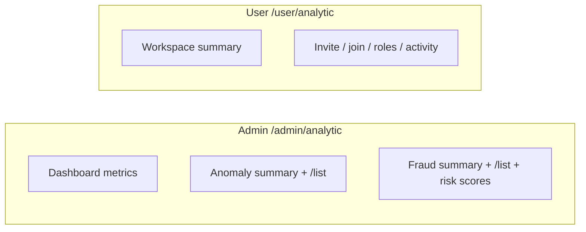

# Analytic Documentation

Analytic lives at `src/modules/analytic`.

## Overview

Analytic exposes read-only HTTP metrics. Platform admins get dashboard numbers, anomaly summaries, and fraud reports across the whole platform. Authenticated workspace members get metrics for the workspace named in `x-workspace-id`.

Each request aggregates from owner-module data, then Redis `AnalyticCache` stores the result under keys and TTLs from `src/configs/analytic.config.ts`.

Fraud and anomaly routes are report-only:

- They return summaries, lists, and risk scores.
- They do not block users, revoke sessions, or change credentials.

Analytic injects owner `*AnalyticDomain` / `*AnalyticRepository` pairs and never opens foreign Prisma models.

Status codes for this module live in the `52100` block. Catalog: [Status Codes](status-codes.md).

## Related Documents

- [Authorization](authorization.md): `EnumPolicySubject.analytic` on admin routes
- [Cache](cache.md): `CacheMainProvider` and feature cache classes
- [Configuration](configuration.md): `analytic.config.ts`
- [Activity Log](activity-log.md): actions Analytic counts, including `userLoginFailed` and `userReachMaxPasswordAttempt`
- [Workspace](workspace.md): `x-workspace-id` and workspace member roles
- [Pagination](pagination.md): offset list envelopes
- [Response](response.md): response envelope and schema stripping
- [Status Codes](status-codes.md): `52100` block

## Table of Contents

- [Overview](#overview)
- [Related Documents](#related-documents)
- [HTTP surfaces](#http-surfaces)
- [Caching and config](#caching-and-config)
- [Authorization](#authorization)
- [Status codes](#status-codes)
- [Activity log seam](#activity-log-seam)

## HTTP surfaces

Global prefix `/api` and URI version `v1`. Controllers mount through the HTTP router:

| Scope | Router path | Controller | Controller path |
|---|---|---|---|
| Admin | `/admin` | `AnalyticAdminController` | `/analytic` |
| User | `/user` | `AnalyticUserController` | `/analytic` |

Full paths below are under `/api/v1`. Every Analytic route is `GET`.

### Who can call

**Admin** (`/admin/analytic/*`). Every route stacks:

- `@ApiKeyProtected`
- `@AuthJwtAccessProtected`
- `@UserProtected`
- `@RoleProtected(EnumRoleType.admin)`
- `@PolicyProtected({ subject: EnumPolicySubject.analytic, action: [EnumPolicyAction.read] })`
- `@TermPolicyAcceptanceProtected`
- `@RequestThrottle({ user: true })`

Admin scope carries no workspace header.

**User** (`/user/analytic/*`). Every route stacks:

- `@ApiKeyProtected`
- `@AuthJwtAccessProtected`
- `@FeatureFlagProtected('workspace')`
- `@UserProtected`
- `@WorkspaceProtected`
- `@WorkspaceMemberProtected` (with role where noted)
- `@TermPolicyAcceptanceProtected`
- `@RequestThrottle({ user: true })`

The workspace comes from `x-workspace-id` only. These routes do not use `PolicyProtected` or `EnumPolicySubject.analytic`.

### Admin dashboard

Mounted at `/admin/analytic`. One controller: `AnalyticAdminController` (`analytic.admin.controller.ts`).

#### Users

| Method | Path | Returns |
|---|---|---|
| `GET` | `/admin/analytic/users/registrations` | Registration count for a required date range |
| `GET` | `/admin/analytic/users/churn` | Churn rate for a required date range |
| `GET` | `/admin/analytic/users/blocked` | Blocked-user counts for a required date range |
| `GET` | `/admin/analytic/users/sign-up-with` | Sign-up method distribution (optional date range) |
| `GET` | `/admin/analytic/users/sign-up-from` | Sign-up source distribution (optional date range) |
| `GET` | `/admin/analytic/users/email-verification` | Email verification rate (optional date range) |
| `GET` | `/admin/analytic/users/mobile-verification` | Mobile verification rate (optional date range) |
| `GET` | `/admin/analytic/users/status-distribution` | User status distribution |
| `GET` | `/admin/analytic/users/country-distribution` | User country distribution |
| `GET` | `/admin/analytic/users/role-distribution` | User role distribution |
| `GET` | `/admin/analytic/users/self-delete` | Self-delete count for a required date range |
| `GET` | `/admin/analytic/users/claim-username` | Username claim count for a required date range |
| `GET` | `/admin/analytic/users/mobile-churn` | Mobile-number churn for a required date range |

#### Auth and sessions

| Method | Path | Returns |
|---|---|---|
| `GET` | `/admin/analytic/auth/login-frequency` | Login count for a required date range |
| `GET` | `/admin/analytic/auth/login-method` | Login method distribution (optional date range) |
| `GET` | `/admin/analytic/auth/login-source` | Login source distribution (optional date range) |
| `GET` | `/admin/analytic/auth/lockout` | Lockout metrics for a required date range |
| `GET` | `/admin/analytic/auth/session-revoke` | Session-revoke count for a required date range |
| `GET` | `/admin/analytic/auth/concurrent-sessions` | Concurrent-session distribution |
| `GET` | `/admin/analytic/auth/sessions-geo` | Session country distribution (optional date range) |
| `GET` | `/admin/analytic/auth/sessions-user-agent` | Session user-agent distribution (optional date range) |
| `GET` | `/admin/analytic/auth/refresh-token-volume` | Refresh-token volume for a required date range |
| `GET` | `/admin/analytic/auth/logout-rate` | Logout count for a required date range |
| `GET` | `/admin/analytic/auth/verification-funnel` | Email and mobile verification funnels for a required date range |
| `GET` | `/admin/analytic/auth/password-expiry` | Password-expiry snapshot |
| `GET` | `/admin/analytic/auth/password-change` | Password-change count for a required date range |
| `GET` | `/admin/analytic/auth/forgot-password-conversion` | Forgot-password conversion for a required date range |
| `GET` | `/admin/analytic/auth/admin-force-password` | Admin-forced password-change count for a required date range |
| `GET` | `/admin/analytic/auth/two-factor-adoption` | Two-factor adoption snapshot |
| `GET` | `/admin/analytic/auth/two-factor-admin-reset` | Admin two-factor reset count for a required date range |
| `GET` | `/admin/analytic/auth/two-factor-verify-success` | Two-factor verify-success count for a required date range |
| `GET` | `/admin/analytic/auth/backup-code-regeneration` | Backup-code regeneration count for a required date range |
| `GET` | `/admin/analytic/auth/two-factor-attempt` | Two-factor attempt snapshot |

#### Devices

| Method | Path | Returns |
|---|---|---|
| `GET` | `/admin/analytic/devices/registration` | Device registration count for a required date range |
| `GET` | `/admin/analytic/devices/platform` | Device platform distribution |
| `GET` | `/admin/analytic/devices/push-token` | Push-token coverage rate |
| `GET` | `/admin/analytic/devices/info-refresh` | Device info-refresh count for a required date range |
| `GET` | `/admin/analytic/devices/session-ratio` | Session-to-device ratio |
| `GET` | `/admin/analytic/devices/per-user` | Devices-per-user distribution |
| `GET` | `/admin/analytic/devices/inactivity` | Inactive device count |

#### API keys

| Method | Path | Returns |
|---|---|---|
| `GET` | `/admin/analytic/api-keys/lifecycle` | API-key lifecycle counts for a required date range |
| `GET` | `/admin/analytic/api-keys/active-expired` | Active and expired API-key counts |
| `GET` | `/admin/analytic/api-keys/type-mix` | API-key type distribution |

#### Term policies

| Method | Path | Returns |
|---|---|---|
| `GET` | `/admin/analytic/term-policies/acceptance-rate` | Term-policy acceptance rate (optional date range) |
| `GET` | `/admin/analytic/term-policies/time-to-accept` | Term-policy time-to-accept (optional date range) |

#### Workspaces and projects

| Method | Path | Returns |
|---|---|---|
| `GET` | `/admin/analytic/workspaces/creation` | Workspace creation count for a required date range |
| `GET` | `/admin/analytic/workspaces/visibility` | Workspace visibility distribution |
| `GET` | `/admin/analytic/workspaces/invite-funnel` | Invite status counts for a required date range (`{ statuses: [...] }`) |
| `GET` | `/admin/analytic/workspaces/join-outcomes` | Join-request status counts for a required date range (`{ statuses: [...] }`) |
| `GET` | `/admin/analytic/workspaces/membership` | Offset-paginated member counts per workspace |
| `GET` | `/admin/analytic/workspaces/activity-volume` | Offset-paginated activity volume per workspace (date range on the list query) |
| `GET` | `/admin/analytic/projects/creation` | Project creation counts for a required date range |
| `GET` | `/admin/analytic/projects/membership` | Offset-paginated member counts per project |

### Admin fraud

Fraud routes live under `/admin/analytic/fraud`. Each signal exposes a summary and a matching `/list` (offset-paginated detail), except risk score which is per-user or a paginated roster.

| Method | Path | Returns |
|---|---|---|
| `GET` | `/admin/analytic/fraud/credential-stuffing` | Credential-stuffing summary (`windowMs`) |
| `GET` | `/admin/analytic/fraud/credential-stuffing/list` | Offset-paginated credential-stuffing rows |
| `GET` | `/admin/analytic/fraud/account-takeover` | Account-takeover summary (required date range) |
| `GET` | `/admin/analytic/fraud/account-takeover/list` | Offset-paginated account-takeover rows |
| `GET` | `/admin/analytic/fraud/mass-registration` | Mass-registration summary (`windowMs`) |
| `GET` | `/admin/analytic/fraud/mass-registration/list` | Offset-paginated mass-registration rows |
| `GET` | `/admin/analytic/fraud/password-reset-enumeration` | Password-reset enumeration summary (`windowMs`) |
| `GET` | `/admin/analytic/fraud/password-reset-enumeration/list` | Offset-paginated password-reset enumeration rows |
| `GET` | `/admin/analytic/fraud/shared-fingerprint` | Shared device-fingerprint summary |
| `GET` | `/admin/analytic/fraud/shared-fingerprint/list` | Offset-paginated shared-fingerprint rows |
| `GET` | `/admin/analytic/fraud/session-after-admin` | Session-after-admin-action summary (required date range) |
| `GET` | `/admin/analytic/fraud/session-after-admin/list` | Offset-paginated session-after-admin rows |
| `GET` | `/admin/analytic/fraud/forgot-password-token-abuse` | Forgot-password token-abuse summary (`windowMs`) |
| `GET` | `/admin/analytic/fraud/forgot-password-token-abuse/list` | Offset-paginated forgot-password abuse rows |
| `GET` | `/admin/analytic/fraud/refresh-spike` | Refresh-token spike summary (`windowMs`) |
| `GET` | `/admin/analytic/fraud/refresh-spike/list` | Offset-paginated refresh-spike rows |
| `GET` | `/admin/analytic/fraud/backup-code-new-device` | Backup-code-on-new-device summary (`windowMs`) |
| `GET` | `/admin/analytic/fraud/backup-code-new-device/list` | Offset-paginated backup-code-new-device rows |
| `GET` | `/admin/analytic/fraud/api-key-burst` | API-key burst summary (`windowMs`) |
| `GET` | `/admin/analytic/fraud/api-key-burst/list` | Offset-paginated API-key burst rows |
| `GET` | `/admin/analytic/fraud/risk-score/:userId` | Fraud risk score for one user (Mongo id path param) |
| `GET` | `/admin/analytic/fraud/risk-scores` | Offset-paginated fraud risk scores |

### Admin anomaly

Anomaly routes live under `/admin/analytic/anomaly`. Each signal exposes a summary and a matching `/list`.

| Method | Path | Returns |
|---|---|---|
| `GET` | `/admin/analytic/anomaly/impossible-travel` | Impossible-travel summary (optional date range) |
| `GET` | `/admin/analytic/anomaly/impossible-travel/list` | Offset-paginated impossible-travel rows |
| `GET` | `/admin/analytic/anomaly/login-spike-ip` | Login-spike-by-IP summary (`windowMs`) |
| `GET` | `/admin/analytic/anomaly/login-spike-ip/list` | Offset-paginated login-spike-by-IP rows |
| `GET` | `/admin/analytic/anomaly/failed-login-spike` | Failed-login / near-lockout summary |
| `GET` | `/admin/analytic/anomaly/failed-login-spike/list` | Offset-paginated near-lockout rows |
| `GET` | `/admin/analytic/anomaly/device-proliferation` | Device-proliferation summary |
| `GET` | `/admin/analytic/anomaly/device-proliferation/list` | Offset-paginated device-proliferation rows |
| `GET` | `/admin/analytic/anomaly/login-time` | Login-time anomaly summary (optional date range) |
| `GET` | `/admin/analytic/anomaly/login-time/list` | Offset-paginated login-time anomaly rows |

### User (current workspace)

Mounted at `/user/analytic`. One controller: `AnalyticUserController` (`analytic.user.controller.ts`).

| Method | Path | Who | Returns |
|---|---|---|---|
| `GET` | `/user/analytic/workspace/summary` | Any workspace member | Workspace summary (optional date range) |
| `GET` | `/user/analytic/workspace/invite-funnel` | Workspace `admin` (owner satisfies every role check) | Invite status counts for a required date range (`{ statuses: [...] }`) |
| `GET` | `/user/analytic/workspace/join-outcomes` | Workspace `admin` (owner satisfies every role check) | Join-request status counts for a required date range (`{ statuses: [...] }`) |
| `GET` | `/user/analytic/workspace/member-roles` | Workspace `admin` (owner satisfies every role check) | Member role counts (`{ roles: [...] }`) |
| `GET` | `/user/analytic/workspace/activity` | Workspace `admin` (owner satisfies every role check) | Activity count for a required date range |

### Query shapes and pagination

- Required date range: `AnalyticDateRangeRequestSchema` (`startDate`, `endDate`).
- Optional date range: `AnalyticOptionalDateRangeRequestSchema`. Both bounds together or neither; a single bound raises `AnalyticInvalidDateRangeException`.
- Window: `AnalyticWindowRequestSchema` (`windowMs`) on several fraud and anomaly summaries.
- Offset lists: anomaly and fraud `/list` routes, `GET /fraud/risk-scores`, and the three dashboard distributions `GET /workspaces/membership`, `GET /workspaces/activity-volume`, and `GET /projects/membership` use `@ResponsePagination` and list schemas that extend `PaginationOffsetQuerySchema`. Anomaly and fraud lists carry order-by allow-lists in `analytic.list.constant.ts`. The three dashboard membership / activity-volume lists extend the kit offset schema only and declare no `orderBy` allow-list.

A signal that the database cannot group and page in one query computes its rows, slices `[skip, skip + limit)`, and builds the envelope with `PaginationService.offsetPage`, so `page` is 1-based and `totalPage` counts the whole computed set. Page metadata: [Pagination](pagination.md).

Every route declares its payload on `@Response` or `@ResponsePagination`. Schemas live in `src/modules/analytic/dtos/response/`. Handlers return `IResponseReturn<T>` or `IResponsePaginationReturn<T>`; the response interceptors serialize `data` against the declared schema. Flow: [Response](response.md).

Each endpoint carries `@Doc({ summary })` plus `@Response` / `@ResponsePagination`. Query parameters reach OpenAPI from the zod schema on `@Query({ schema })`. Published OpenAPI errors are kit-only; domain exceptions such as `AnalyticInvalidDateRangeException` appear in OpenAPI only when an endpoint opts in with `@DocErrors`. Flow: [Doc](doc.md).

## Caching and config

`AnalyticCache` injects `CacheMainProvider` and reads `analytic.cache.*` from config. Domains call get-then-compute-then-set for:

- dashboard metrics
- anomaly summaries
- fraud summaries
- risk scores

Default TTLs in `analytic.config.ts`:

| Concern | TTL |
|---|---|
| Dashboard metric | 1h |
| Anomaly summary | 5m |
| Fraud summary | 5m |
| Fraud risk score | 10m |

The same config file holds anomaly and fraud detection thresholds (windows, minimum counts, risk weights, band labels). Values are literals via `ms(...)`; they are not environment-driven.

Date range validation lives in `AnalyticDateDomain` (`requireRange`, `optionalRange`). A required range with a missing bound or `startDate >= endDate` raises `AnalyticInvalidDateRangeException`. An optional range accepts both bounds together or neither.

## Authorization

Admin analytic routes require `EnumPolicySubject.analytic` with `EnumPolicyAction.read`, plus `EnumRoleType.admin`. The subject is seeded with the other policy subjects for roles that receive every subject. User workspace analytic routes authorize through workspace membership, not CASL. Details: [Authorization](authorization.md).

## Status codes

| member | statusCode | httpStatus | messagePath |
|---|---|---|---|
| `invalidDateRange` | `52100` | 400 (`BAD_REQUEST`) | `analytic.error.invalidDateRange` |

Exception class: `AnalyticInvalidDateRangeException`.

## Activity log seam

Several dashboard, anomaly, and fraud metrics count or list `ActivityLog` rows by `EnumActivityLogAction`. Contract and description: [Activity Log](activity-log.md). Login path: [Authentication](authentication.md).

Credential-failure rows (`UserAuthDomain` calls both writers; every row uses `onError: true`, so they are written although the request answers an error):

- Wrong password → `userLoginFailed` through `UserLoginDomain.recordLoginFailed`
- Password-attempt limit → `userRevokeAllSessions` and `userReachMaxPasswordAttempt` through `UserPasswordDomain.reachMaxPasswordAttempt`

How Analytic reads them:

- `UserLoginAnalyticDomain.lockoutMetrics` (`GET /admin/analytic/auth/lockout`) counts `userLoginFailed` and `userReachMaxPasswordAttempt`
- `findFailedLoginEvents` lists those two for the credential-stuffing signal

An action one user takes on another writes an actor row and a target row ([Activity Log](activity-log.md#actor-and-target-rows)). The metrics that read those actions count one side of each pair:

| Metric | Actions counted | Route |
|---|---|---|
| `authSessionRevoke` | `userRevokeSession`, `userRevokeAllSessions`, `userRevokeSessionByAdmin`, `userRevokeAllSessionsByAdmin` | `GET /admin/analytic/auth/session-revoke` |
| Session after admin revoke (`computeSessionAfterAdmin`) | `userRevokeSessionByAdmin`, `userRevokeAllSessionsByAdmin` | `GET /admin/analytic/fraud/session-after-admin` and `/list` |
| Workspace activity volume | Every action in the workspace except the ones listed in `ActivityLogWorkspaceVolumeContract` | `GET /admin/analytic/workspaces/activity-volume`, `GET /user/analytic/workspace/summary`, `GET /user/analytic/workspace/activity` |

- `authSessionRevoke` counts the rows of the user whose sessions were revoked, so an admin revoke counts once. Every account self-deletion writes `userRevokeAllSessions`, including one that revoked no session, so each self-deletion adds one to this metric and one to the `userDeleteSelf` count. Every credential lockout writes `userRevokeAllSessions` the same way, so each lockout also adds one to this metric. An admin revoking a session of their own account writes only `adminSessionRevoke`, which this metric does not count.
- The session-after-admin signal reads the target rows, whose `userId` is the user whose sessions were revoked, and flags a login by that same user within `analytic.fraud.sessionAfterAdmin.sessionAfterAdminRevokeInMs`. An admin status change to `blocked` or `inactive` that revokes sessions writes `userRevokeAllSessionsByAdmin` too, so it feeds both metrics.
- `ActivityLogWorkspaceVolumeContract` (owned by the activity-log module) lists the eleven workspace and project target actions. `workspaceCreatedByAdmin` stays counted, because the admin's row for that event carries no workspace.
