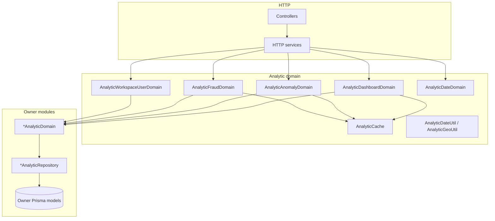
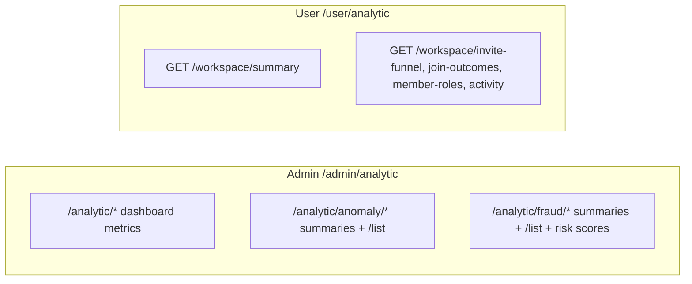

# Analytic Documentation

Analytic lives at `src/modules/analytic`.

## Overview

Analytic serves dashboard numbers for platform admins and metrics for the caller's current workspace. Aggregation is live: each request computes from owner data, then Redis `AnalyticCache` stores the result under keys and TTLs from `src/configs/analytic.config.ts`.

The module orchestrates only. Owner features expose `*AnalyticDomain` / `*AnalyticRepository` pairs; Analytic injects those domains and never opens foreign Prisma models. That boundary is `rules/cross-module.md`.

Fraud and anomaly routes are report-only. They return summaries, lists, and risk scores. They do not block users, revoke sessions, or change credentials.

Status codes for this module live in the `52100` block. Catalog: [Status Codes](status-codes.md).

## Related Documents

- [Authorization](authorization.md): `EnumPolicySubject.analytic` on admin routes
- [Cache](cache.md): `CacheMainProvider` and feature cache classes
- [Configuration](configuration.md): `analytic.config.ts`
- [Activity Log](activity-log.md): actions Analytic counts, including `userLoginFailed` and `userReachMaxPasswordAttempt`
- [Workspace](workspace.md): `x-workspace-id` and workspace member roles
- [Status Codes](status-codes.md): `52100` block

## Table of Contents

- [Overview](#overview)
- [Related Documents](#related-documents)
- [Layering](#layering)
- [HTTP surfaces](#http-surfaces)
- [Caching and config](#caching-and-config)
- [Authorization](#authorization)
- [Status codes](#status-codes)
- [Activity log seam](#activity-log-seam)

## Layering

Nest wiring:

| Module file | Role |
|---|---|
| `analytic.domain.module.ts` | `AnalyticCache`, `AnalyticDateDomain`, date/geo utils, dashboard / anomaly / fraud / workspace-user domains; imports owner `*DomainModule`s |
| `analytic.http.module.ts` | HTTP services; imported by admin and user router modules |

Analytic has no repository module of its own. Owner features keep sibling files such as `user.analytic.domain.ts` with `user.analytic.repository.ts` (and the same pattern on activity-log, session, device, workspace, project, api-key, term-policy, password-history). Placement and imports: `rules/nest-wiring.md`, `rules/architecture.md`.

## HTTP surfaces

Global prefix `/api` and version `v1` apply as elsewhere. Controllers mount under `/admin` or `/user` through the HTTP router modules.

### Admin

Mounted under `/admin`. One controller, `AnalyticAdminController` (`analytic.admin.controller.ts`), path `/analytic`. Dashboard metrics sit at `/analytic/*`. Anomaly reports sit at `/analytic/anomaly/*` (summary per signal, matching `/list` for offset-paginated detail). Fraud reports sit at `/analytic/fraud/*` (summary per signal, matching `/list`, plus `GET /risk-score/:userId` and `GET /risk-scores`).

Admin guard stack on these routes: `@ApiKeyProtected`, `@AuthJwtAccessProtected`, `@UserProtected`, `@RoleProtected(EnumRoleType.admin)`, `@PolicyProtected({ subject: EnumPolicySubject.analytic, action: [EnumPolicyAction.read] })`, `@TermPolicyAcceptanceProtected`, plus `@RequestThrottle({ user: true })`. Admin scope carries no workspace header. Guard order and admin scope: `rules/http.md`, `rules/security.md`.

Anomaly and fraud detail lists, and `GET /fraud/risk-scores`, use offset pagination (`@PaginationOffsetQuery`, `@ResponsePaging`) with `AnalyticDefaultAvailableOrderBy` (`createdAt`, `id`) as the order-by allow-list. Three dashboard distributions are offset-paginated as well, with a bare `@PaginationOffsetQuery()`: `GET /analytic/workspaces/membership`, `GET /analytic/workspaces/activity-volume`, and `GET /analytic/projects/membership`. Pagination rules: `rules/pagination.md`.

A signal that the database cannot group and page in one query computes its rows, slices `[skip, skip + limit)`, and builds the envelope with `PaginationService.offsetPage`, so `page` is 1-based and `totalPage` counts the whole computed set. Page metadata: [Pagination](pagination.md).

### User (current workspace)

Mounted under `/user`. `AnalyticUserController` uses path `/analytic` and resolves the workspace from `x-workspace-id` only.

| Route | Membership |
|---|---|
| `GET /workspace/summary` | any workspace member |
| `GET /workspace/invite-funnel` | workspace `admin` (owner short-circuits as elsewhere) |
| `GET /workspace/join-outcomes` | workspace `admin` |
| `GET /workspace/member-roles` | workspace `admin` |
| `GET /workspace/activity` | workspace `admin` |

User stack includes `@FeatureFlagProtected('workspace')`, `@WorkspaceProtected`, `@WorkspaceMemberProtected` (with role where required), and `@TermPolicyAcceptanceProtected`. These routes do not use `PolicyProtected` or `EnumPolicySubject.analytic`.

### Response shapes and Swagger

Every route declares its payload shape on `@Response` or `@ResponsePaging`, and those schemas live in `src/modules/analytic/dtos/response/`. Each one is an object at the top level. The five distributions over a fixed enum take no pagination and send their rows as a named array field inside it: admin `GET /analytic/workspaces/invite-funnel` and `/analytic/workspaces/join-outcomes` and user `GET /analytic/workspace/invite-funnel` and `/analytic/workspace/join-outcomes` carry `AnalyticStatusCountResponseSchema` (`{ statuses: [...] }`), and user `GET /analytic/workspace/member-roles` carries `AnalyticRoleCountResponseSchema` (`{ roles: [...] }`). Handlers and HTTP services return `IResponseReturn<T>`, and `IResponsePagingReturn<T>` on the paginated routes; `ResponseInterceptor` takes `data` off that return and serializes it against the declared schema. Schema and envelope rules: `rules/dto.md`. Flow: [Response](response.md).

Each endpoint has a zero-argument doc factory in `src/modules/analytic/docs/analytic.admin.doc.ts` or `analytic.user.doc.ts`, in the controller's order, carrying the same i18n message path and the same response schema the route declares. Those factories (`*.doc.ts`) sit outside the coverage set and have no unit spec; there are no files under `test/modules/analytic/docs/`. Query parameters reach the OpenAPI document from the zod schema bound on `@Query({ schema })` through `standardSchemaConverter`. Published OpenAPI errors are kit-only (`Doc`, `DocAuth`, `DocGuard`, and when used `DocResponsePagination`); domain exceptions such as `AnalyticInvalidDateRangeException` are not listed on the factory. Doc factory rules: `rules/http.md`. Flow: [Doc](doc.md).

## Caching and config

`AnalyticCache` injects `CacheMainProvider` and reads `analytic.cache.*` from config. Domains call get-then-compute-then-set for dashboard metrics, anomaly summaries, fraud summaries, and risk scores. Cache class placement: `rules/cache.md`. Config shape: `rules/config.md`.

Key patterns and default TTLs in `analytic.config.ts`:

| Concern | Key pattern | TTL |
|---|---|---|
| Dashboard metric | `Analytic:dashboard:{metric}:{start}:{end}` | 1h |
| Anomaly summary | `Analytic:anomaly:{signal}:{window}` | 5m |
| Fraud summary | `Analytic:fraud:{signal}:{window}` | 5m |
| Fraud risk score | `Analytic:fraud:risk:{userId}` | 10m |

`{metric}`, `{signal}`, `{window}` and `{userId}` are filled by `HelperStringService.fillPattern`, which raises `HelperPatternTokenMissingException` (`52202`, 500) for a placeholder the call supplies no value for. `{window}` itself comes from `AnalyticDateUtil`, from `analytic.cache.windowTokenPattern` (`{start}:{end}`) or `workspaceWindowTokenPattern` (`{workspaceId}:{start}:{end}`), with an absent bound rendering `_`.

A paginated dashboard distribution appends `page=<n>:perPage=<n>` to its `{metric}` token, so each page caches under its own key.

The same config file holds anomaly and fraud detection thresholds (windows, minimum counts, risk weights, band labels). Values are literals via `ms(...)`; they are not environment-driven.

Date range validation lives in `AnalyticDateDomain` (`requireRange`, `optionalRange`). Both take `Date | null`. HTTP services normalize optional query dates with `?? null` before the call. A required range with a missing bound or `startDate >= endDate` raises `AnalyticInvalidDateRangeException`. An optional range accepts both bounds together or neither; a single bound is invalid. `AnalyticDateUtil` builds cache window tokens (`windowTokenPattern`, `workspaceWindowTokenPattern`), with an absent bound rendering `_`.

## Authorization

Admin analytic routes require `EnumPolicySubject.analytic` with `EnumPolicyAction.read`, plus `EnumRoleType.admin`. The subject is seeded with the other policy subjects for roles that receive every subject. User workspace analytic routes authorize through workspace membership, not CASL. Details: [Authorization](authorization.md).

## Status codes

| member | statusCode | httpStatus | messagePath |
|---|---|---|---|
| `invalidDateRange` | `52100` | 400 (`BAD_REQUEST`) | `analytic.error.invalidDateRange` |

Exception class: `AnalyticInvalidDateRangeException`. Exception and status-code layout: `rules/exceptions.md`, `rules/status-code.md`.

## Activity log seam

Several dashboard, anomaly, and fraud metrics count or list `ActivityLog` rows by `EnumActivityLogAction`. A credential login with a wrong password writes `userLoginFailed` through `UserLoginDomain.recordLoginFailed`, and the attempt that meets the password-attempt limit writes `userRevokeAllSessions` and `userReachMaxPasswordAttempt` through `UserPasswordDomain.reachMaxPasswordAttempt`. `UserAuthDomain` calls both, and every one of these rows is prepared with `onError: true`, so they are written although the request answers an error. `UserLoginAnalyticDomain.lockoutMetrics` (`GET /admin/analytic/auth/lockout`) counts `userLoginFailed` and `userReachMaxPasswordAttempt`, and `findFailedLoginEvents` lists those two for the credential-stuffing signal. Contract and description: [Activity Log](activity-log.md). Login path: [Authentication](authentication.md).

An action one user takes on another writes an actor row and a target row ([Activity Log](activity-log.md#actor-and-target-rows)). The metrics that read those actions count one side of each pair:

| Metric | Actions counted | Route |
|---|---|---|
| `authSessionRevoke` | `userRevokeSession`, `userRevokeAllSessions`, `userRevokeSessionByAdmin`, `userRevokeAllSessionsByAdmin` | `GET /admin/analytic/auth/session-revoke` |
| Session after admin revoke (`computeSessionAfterAdmin`) | `userRevokeSessionByAdmin`, `userRevokeAllSessionsByAdmin` | `GET /admin/analytic/fraud/session-after-admin` and `/list` |
| Workspace activity volume | Every action in the workspace except the ones listed in `ActivityLogWorkspaceVolumeContract` | `GET /admin/analytic/workspaces/activity-volume`, `GET /user/analytic/workspace/summary`, `GET /user/analytic/workspace/activity` |

- `authSessionRevoke` counts the rows of the user whose sessions were revoked, so an admin revoke counts once. Every account self-deletion writes `userRevokeAllSessions`, including one that revoked no session, so each self-deletion adds one to this metric and one to the `userDeleteSelf` count. Every credential lockout writes `userRevokeAllSessions` the same way, so each lockout also adds one to this metric. An admin revoking a session of their own account writes only `adminSessionRevoke`, which this metric does not count.
- The session-after-admin signal reads the target rows, whose `userId` is the user whose sessions were revoked, and flags a login by that same user within `analytic.fraud.sessionAfterAdmin.sessionAfterAdminRevokeInMs`. An admin status change to `blocked` or `inactive` that revokes sessions writes `userRevokeAllSessionsByAdmin` too, so it feeds both metrics.
- `ActivityLogWorkspaceVolumeContract` (owned by the activity-log module) lists the eleven workspace and project target actions. `workspaceCreatedByAdmin` stays counted, because the admin's row for that event carries no workspace.
