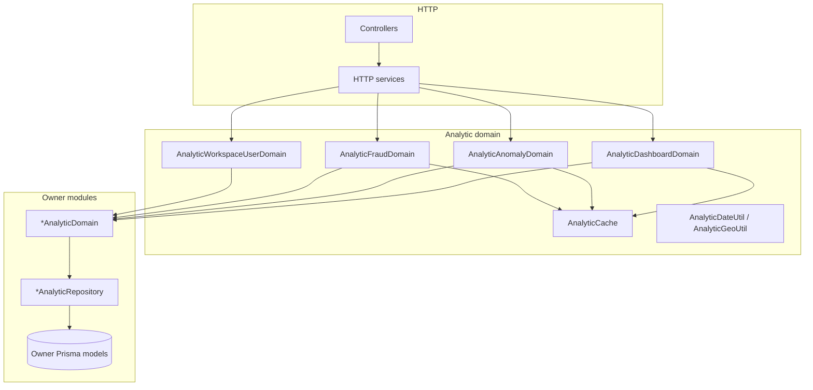
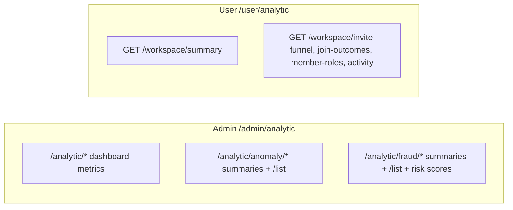

# Analytic Documentation

This documentation covers the **Analytic Module** at `src/modules/analytic`.

## Overview

Analytic serves dashboard numbers for platform admins and metrics for the caller's current workspace. Aggregation is live (A1): each request computes from owner data, then Redis `AnalyticCache` stores the result under keys and TTLs from `src/configs/analytic.config.ts`.

The module orchestrates only. Owner features expose `*AnalyticDomain` / `*AnalyticRepository` pairs; Analytic injects those domains and never opens foreign Prisma models. That boundary is `rules/cross-module.md`.

Fraud and anomaly routes are report-only. They return summaries, lists, and risk scores. They do not block users, revoke sessions, or change credentials.

Status codes for this module live in the `52100` block. Catalog: [Status Codes](status-codes.md).

## Related Documents

- [Authorization](authorization.md): `EnumPolicySubject.analytic` on admin routes
- [Cache](cache.md): `CacheMainProvider` and feature cache classes
- [Configuration](configuration.md): `analytic.config.ts`
- [Activity Log](activity-log.md): actions Analytic counts, including `userLoginFailed`
- [Workspace](workspace.md): `x-workspace-id` and workspace member roles
- [Status Codes](status-codes.md): `52100` block

## Table of Contents

- [Overview](#overview)
- [Related Documents](#related-documents)
- [Layering](#layering)
- [HTTP surfaces](#http-surfaces)
- [Caching and config](#caching-and-config)
- [Authorization](#authorization)
- [Status codes](#status-codes)
- [Activity log seam](#activity-log-seam)

## Layering

Nest wiring:

| Module file | Role |
|---|---|
| `analytic.domain.module.ts` | `AnalyticCache`, date/geo utils, dashboard / anomaly / fraud / workspace-user domains; imports owner `*DomainModule`s |
| `analytic.http.module.ts` | HTTP services; imported by admin and user router modules |

Analytic has no repository module of its own. Owner features keep sibling files such as `user.analytic.domain.ts` with `user.analytic.repository.ts` (and the same pattern on activity-log, session, device, workspace, project, api-key, term-policy, password-history). Placement and imports: `rules/nest-wiring.md`, `rules/architecture.md`.

## HTTP surfaces

Global prefix `/api` and version `v1` apply as elsewhere. Controllers mount under `/admin` or `/user` through the HTTP router modules.

### Admin

Mounted under `/admin`. Controllers:

| Controller | Path prefix | Surface |
|---|---|---|
| `AnalyticDashboardAdminController` | `/analytic` | Live dashboard metrics (users, auth, devices, API keys, term policies, workspaces, projects) |
| `AnalyticAnomalyAdminController` | `/analytic/anomaly` | Anomaly summary per signal; matching `/list` for offset-paginated detail |
| `AnalyticFraudAdminController` | `/analytic/fraud` | Fraud summary per signal; matching `/list`; `GET /risk-score/:userId` and `GET /risk-scores` |

Admin guard stack on these routes: `@ApiKeyProtected`, `@AuthJwtAccessProtected`, `@UserProtected`, `@RoleProtected(EnumRoleType.admin)`, `@PolicyProtected({ subject: EnumPolicySubject.analytic, action: [EnumPolicyAction.read] })`, `@TermPolicyAcceptanceProtected`, plus `@RequestThrottle({ user: true })`. Admin scope carries no workspace header. Guard order and admin scope: `rules/http.md`, `rules/security.md`.

Anomaly and fraud detail lists use offset pagination (`@PaginationOffsetQuery`, `@ResponsePaging`). Pagination rules: `rules/pagination.md`.

### User (current workspace)

Mounted under `/user`. Both controllers use path `/analytic` and resolve the workspace from `x-workspace-id` only.

| Controller | Routes | Membership |
|---|---|---|
| `AnalyticUserController` | `GET /workspace/summary` | any workspace member |
| `AnalyticUserAdminController` | `GET /workspace/invite-funnel`, `/workspace/join-outcomes`, `/workspace/member-roles`, `/workspace/activity` | workspace `admin` (owner short-circuits as elsewhere) |

User stack includes `@FeatureFlagProtected('workspace')`, `@WorkspaceProtected`, `@WorkspaceMemberProtected` (with role where required), and `@TermPolicyAcceptanceProtected`. These routes do not use `PolicyProtected` or `EnumPolicySubject.analytic`.

## Caching and config

`AnalyticCache` injects `CacheMainProvider` and reads `analytic.cache.*` from config. Domains call get-then-compute-then-set for dashboard metrics, anomaly summaries, fraud summaries, and risk scores. Cache class placement: `rules/cache.md`. Config shape: `rules/config.md`.

Key patterns and default TTLs in `analytic.config.ts`:

| Concern | Key pattern | TTL |
|---|---|---|
| Dashboard metric | `Analytic:dashboard:{metric}:{start}:{end}` | 1h |
| Anomaly summary | `Analytic:anomaly:{signal}:{window}` | 5m |
| Fraud summary | `Analytic:fraud:{signal}:{window}` | 5m |
| Fraud risk score | `Analytic:fraud:risk:{userId}` | 10m |

The same config file holds anomaly and fraud detection thresholds (windows, minimum counts, risk weights, band labels). Values are literals via `ms(...)`; they are not environment-driven.

Date range helpers live in `AnalyticDateUtil`. A required range with a missing bound or `startDate >= endDate` raises `AnalyticInvalidDateRangeException`. An optional range accepts both bounds together or neither; a single bound is invalid.

## Authorization

Admin analytic routes require `EnumPolicySubject.analytic` with `EnumPolicyAction.read`, plus `EnumRoleType.admin`. The subject is seeded with the other policy subjects for roles that receive every subject. User workspace analytic routes authorize through workspace membership, not CASL. Details: [Authorization](authorization.md).

## Status codes

| member | statusCode | httpStatus | messagePath |
|---|---|---|---|
| `invalidDateRange` | `52100` | 400 (`BAD_REQUEST`) | `analytic.error.invalidDateRange` |

Exception class: `AnalyticInvalidDateRangeException`. Exception and status-code layout: `rules/exceptions.md`, `rules/status-code.md`.

## Activity log seam

Several dashboard, anomaly, and fraud metrics count or list `ActivityLog` rows by `EnumActivityLogAction`. Failed credential login stages `userLoginFailed` from `UserLoginDomain.stageLoginFailed` (called by `UserAuthDomain` after a password mismatch). Contract and description: [Activity Log](activity-log.md). Login path: [Authentication](authentication.md).

An action one user takes on another writes an actor row and a target row ([Activity Log](activity-log.md#actor-and-target-rows)). The metrics that read those actions count one side of each pair:

| Metric | Actions counted | Route |
|---|---|---|
| `authSessionRevoke` | `userRevokeSession`, `userRevokeAllSessions`, `userRevokeSessionByAdmin`, `userRevokeAllSessionsByAdmin` | `GET /admin/analytic/auth/session-revoke` |
| Session after admin revoke (`computeSessionAfterAdmin`) | `userRevokeSessionByAdmin`, `userRevokeAllSessionsByAdmin` | `GET /admin/analytic/fraud/session-after-admin` and `/list` |
| Workspace activity volume | Every action in the workspace except `ActivityLogWorkspaceVolumeExcludedActions` | `GET /admin/analytic/workspaces/activity-volume`, `GET /user/analytic/workspace/summary`, `GET /user/analytic/workspace/activity` |

- `authSessionRevoke` counts the rows of the user whose sessions were revoked, so an admin revoke counts once. An admin revoking a session of their own account writes only `adminSessionRevoke`, which this metric does not count.
- The session-after-admin signal reads the target rows, whose `userId` is the user whose sessions were revoked, and flags a login by that same user within `analytic.fraud.sessionAfterAdmin.sessionAfterAdminRevokeInMs`. An admin status change to `blocked` or `inactive` that revokes sessions writes `userRevokeAllSessionsByAdmin` too, so it feeds both metrics.
- `ActivityLogWorkspaceVolumeExcludedActions` (owned by the activity-log module) lists the eleven workspace and project target actions. `workspaceCreatedByAdmin` stays counted, because the admin's row for that event carries no workspace.
