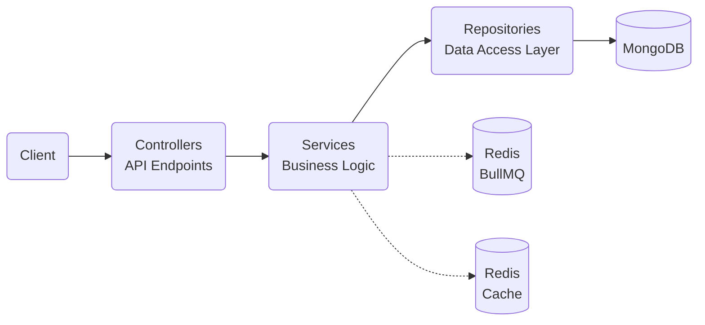

# Architecture

The application architecture is built around two core design principles: Repository Pattern and Component-Based Folder Structure.

### Repository Design Pattern

The application implements a clean repository design pattern to separate business logic from data access:



- **Controllers** (`controllers/`) - Handle HTTP requests and delegate to services
- **Entities** (`repository/entities/`) - MongoDB schema definitions with decorators for validation and configuration
- **Repositories** (`repository/repositories/`) - Classes extending `DatabaseRepositoryBase` that handle database operations
- **Repository Modules** (`repository/*.repository.module.ts`) - Module registration for repositories with MongoDB connection
- **Services** (`services/`) - Business logic classes that use repositories for data operations
- **Controllers** (`controllers/`) - API endpoints organized by access level that use services
- **DTOs** (`dtos/`) - Data transfer objects for request/response validation and transformation

This pattern provides:
- **Separation of concerns** - Clear boundaries between data access and business logic
- **Testability** - Easy mocking of repositories for unit testing
- **Database abstraction** - Ability to change database technologies with minimal impact
- **Standardized data access** - Consistent patterns across all modules

### Component-Based Folder Structure

Each feature is encapsulated in its own module with a self-contained set of components:

```
module-name/
├── constants/               # Constants, default values, and enumerations
├── controllers/             # HTTP endpoints separated by access level
│   ├── module.admin.controller.ts  # Admin-specific endpoints
│   ├── module.public.controller.ts # Public endpoints
│   └── module.user.controller.ts   # User-specific endpoints
├── decorators/              # Custom decorators for the feature
├── docs/                    # Swagger documentation
│   ├── module.admin.doc.ts  # Admin API documentation
│   ├── module.public.doc.ts # Public API documentation
│   └── module.user.doc.ts   # User API documentation
├── dtos/                    # Data Transfer Objects
│   ├── request/             # Request validation schemas
│   └── response/            # Response formatting schemas
├── enums/                   # Type enumerations and status codes
├── guards/                  # Access control and validation guards
├── interfaces/              # TypeScript interfaces for module models
├── pipes/                   # Data transformation and validation pipes
├── repository/              # Data access layer
│   ├── entities/            # MongoDB schema definitions
│   ├── repositories/        # Repository classes for database operations
│   └── module.repository.module.ts # Repository module configuration
├── services/                # Business logic services
└── module.module.ts         # Module definition and dependency injection
```

The component-based folder structure ensures:

- **High cohesion** - Related functionality is grouped together
- **Low coupling** - Modules interact through well-defined interfaces
- **Maintainability** - Easy to locate and modify specific features
- **Scalability** - New components can be added without disrupting existing ones
- **Consistent patterns** - Each module follows the same structure
- **Access level separation** - Controllers are organized by access type (admin/user/public)

