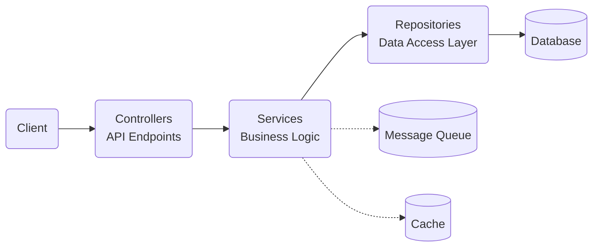

# Overview

## Table of Contents
- [Overview](#overview)
  - [Table of Contents](#table-of-contents)
    - [Repository Design Pattern](#repository-design-pattern)
    - [Module Structure](#module-structure)
    - [Component Types](#component-types)

The application architecture is built around two core design principles: Repository Pattern and Component-Based Folder Structure.

### Repository Design Pattern

The application implements a clean repository design pattern to separate concerns:



- **Client** - External systems or users that interact with the application
- **Controllers** - Handle HTTP requests and route them to appropriate services
- **Services** - Contain business logic and orchestrate data operations
- **Repositories** - Provide abstraction over the database with standardized operations
- **Database** - Persistent storage for application data
- **Message Queue** - Handles asynchronous processing and background tasks
- **Cache** - Improves performance by storing frequently accessed data

### Module Structure

Each feature is encapsulated in its own module with a consistent internal structure:

```
module-name/
├── constants/
├── controllers/
├── decorators/
├── docs/
├── dtos/
│   ├── request/
│   └── response/
├── enums/
├── guards/
├── interfaces/
├── pipes/
├── processors/
├── indicators/
├── repository/
│   ├── entities/
│   ├── repositories/
│   └── *.repository.module.ts
├── services/
├── factories/
└── *.module.ts
```

### Component Types

- **Controllers** - Handle HTTP requests, validate inputs, and delegate processing to services
- **Services** - Implement business logic, orchestrate operations, and manage transactions
- **Repositories** - Provide data access abstractions and database operations
- **Entities** - Define data structures and schemas for database storage
- **DTOs** - Structure data for requests and responses with validation rules
- **Interfaces** - Define contracts and types to ensure consistency across components
- **Docs** - Provide API specifications and usage examples
- **Decorators** - Enhance classes and methods with metadata and cross-cutting concerns
- **Guards** - Implement access control, permission checks, and request filtering
- **Pipes** - Transform and validate data as it flows through the application
- **Enums** - Define type-safe constants and option sets
- **Processors** - Handle background and asynchronous tasks
- **Factories** - Create complex objects and testing fixtures

This pattern provides:
- **Separation of concerns** - Each component has a single responsibility
- **Testability** - Components can be tested in isolation with mocks
- **Modularity** - Features can be developed and maintained independently
- **Flexibility** - Implementation details can change without affecting consumers
- **Consistency** - Common patterns are applied throughout the application
