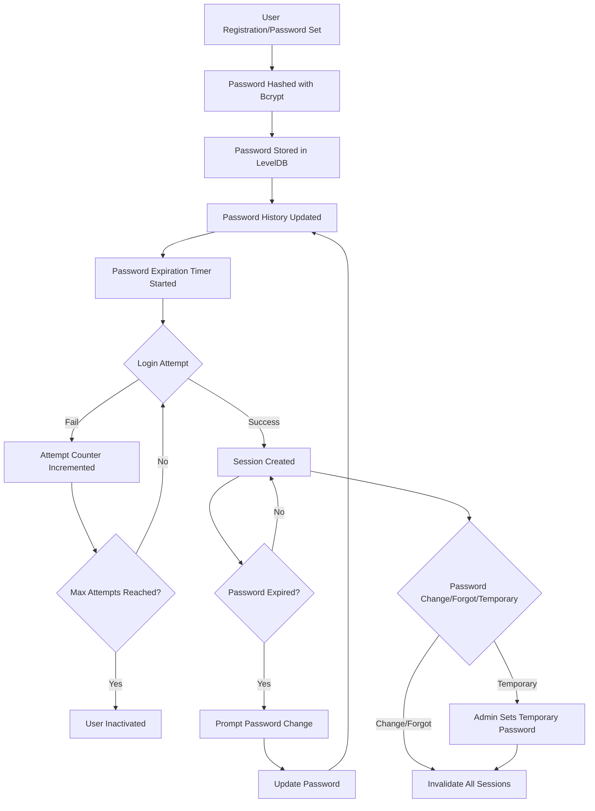
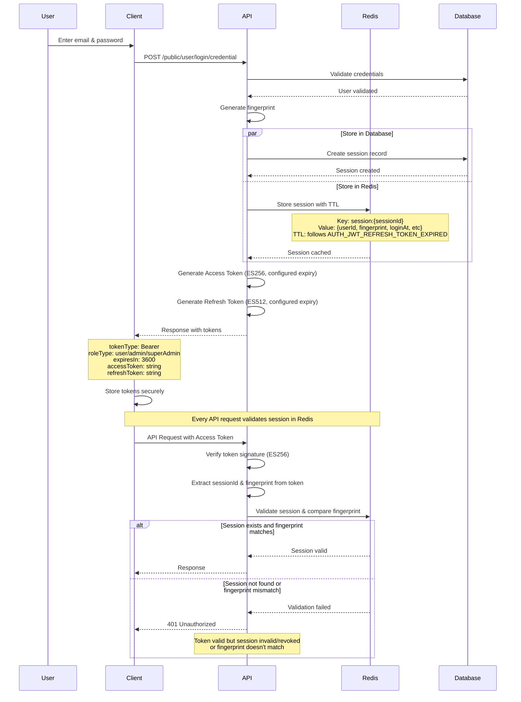
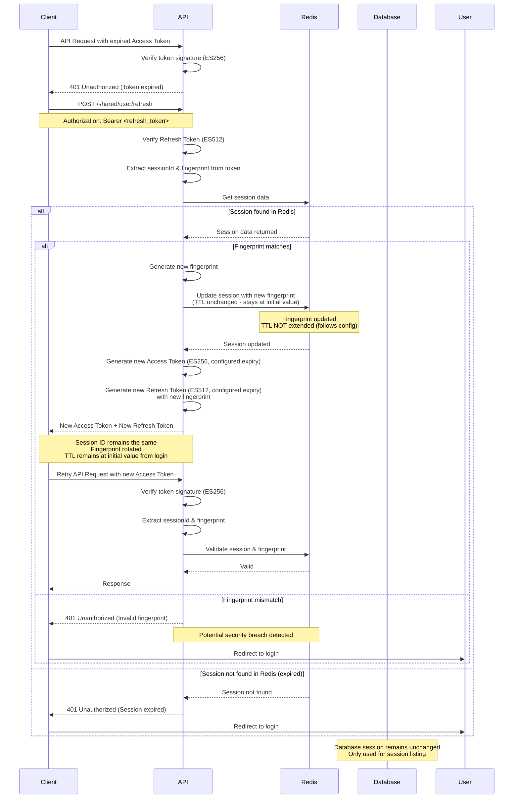
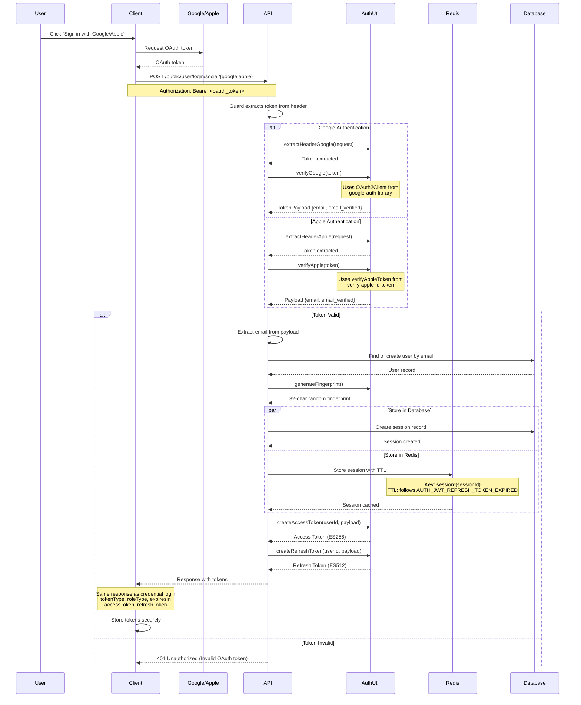
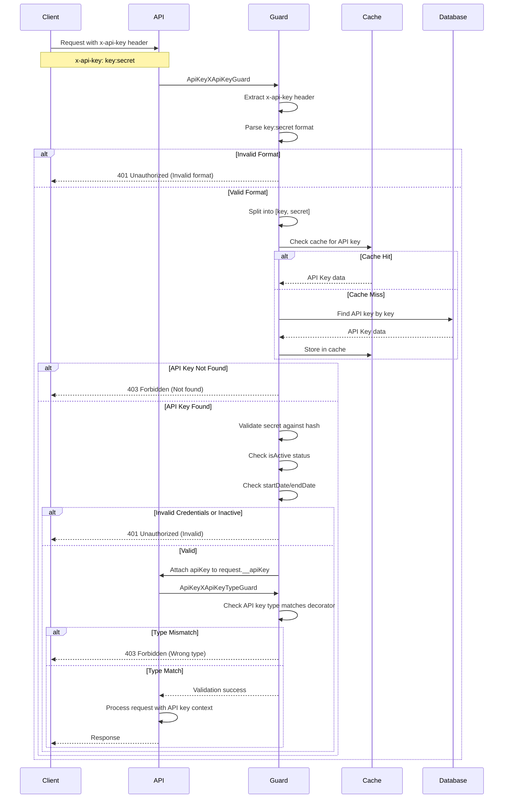
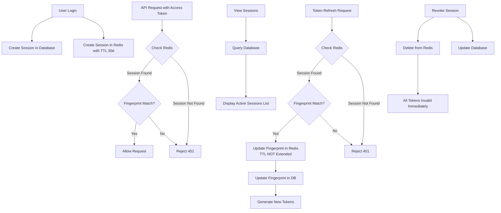
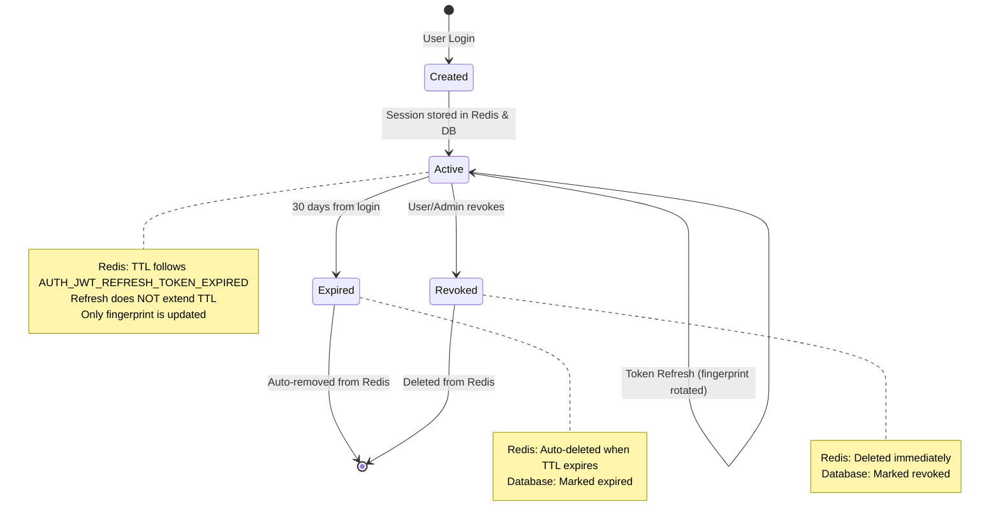
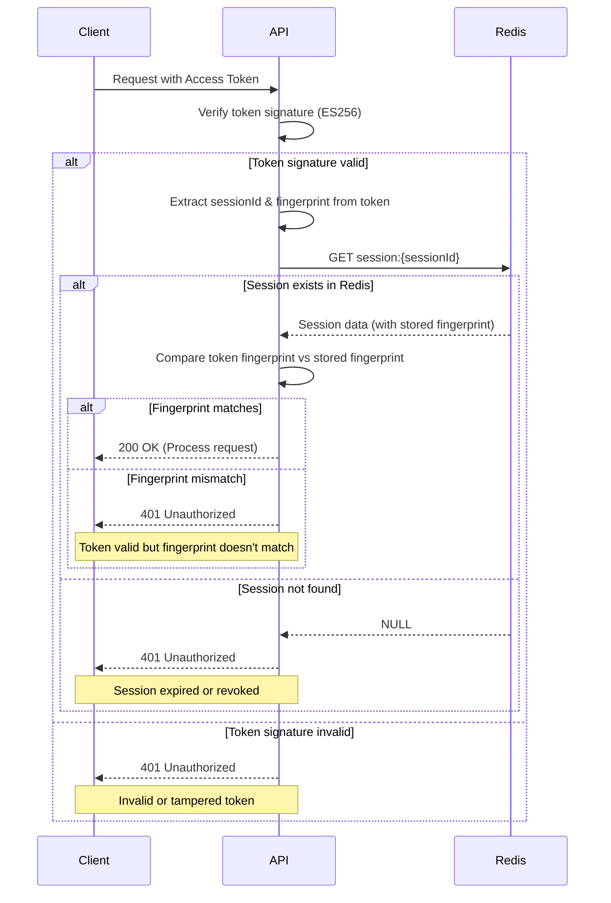

# Authentication

## Overview

This document provides a comprehensive overview of authentication and session management in the ACK NestJS Boilerplate. It covers:

- **Password Security**: Passwords are securely hashed (bcrypt), have configurable expiration and rotation, login attempt limits, history tracking, and support for reset/change/temporary password with session invalidation.
- **JWT Authentication**: Stateless authentication using access and refresh tokens, with configurable expiration and security mechanisms such as fingerprint validation.
- **Session Management**: Dual storage strategy using Redis for high-performance validation and automatic expiration, and a database for session listing, management, and audit trail. Sessions are validated on every API request and can be revoked instantly.
- **Social Authentication**: Integration with Google OAuth 2.0 and Apple Sign In, allowing users to authenticate using third-party providers. The backend validates OAuth tokens and manages sessions similarly to credential-based authentication.
- **API Key Authentication**: Stateless authentication for machine-to-machine and system integrations, supporting both default and system API keys with caching for performance.
- **Session Lifecycle and Validation**: Detailed flows for login, token refresh, session revocation, and validation, ensuring secure and manageable user sessions across devices and integrations.

Configuration for tokens, sessions, password, social providers, and API keys is managed di `src/configs/auth.config.ts`.

# Table of Contents

- [Overview](#overview)
- [Password](#password)
    - [Configuration](#configuration)
    - [Password Features](#password-features)
        - [Password Expiration](#password-expiration)
        - [Password Period (Rotation)](#password-period-rotation)
        - [Attempt Limiting](#attempt-limiting)
    - [Password Lifecycle](#password-lifecycle)
    - [Implementation](#implementation)
    - [Password Endpoints](#password-endpoints)
        - [Forgot Password](#forgot-password)
        - [Reset Password](#reset-password)
        - [Change Password](#change-password)
        - [Admin Temporary Password](#admin-temporary-password)
- [JWT (JSON Web Token) Authentication](#jwt-json-web-token-authentication)
    - [Configuration](#configuration-1)
    - [Tokens](#tokens)
        - [Access Token](#access-token)
        - [Refresh Token](#refresh-token)
    - [Payload Structure](#payload-structure)
        - [Access Token Payload](#access-token-payload)
        - [Refresh Token Payload](#refresh-token-payload)
    - [Authentication Endpoints](#authentication-endpoints)
        - [Login](#login)
        - [Refresh Token](#refresh-token-1)
        - [Profile](#profile)
    - [Implementation](#implementation-1)
        - [Protecting Endpoints](#protecting-endpoints)
        - [Getting JWT Payload](#getting-jwt-payload)
        - [Getting Raw Token](#getting-raw-token)
    - [Access Token Flow](#access-token-flow)
    - [Refresh Token Flow](#refresh-token-flow)
    - [Security: Fingerprint](#security-fingerprint)
- [Social Authentication](#social-authentication)
    - [Google Authentication](#google-authentication)
        - [Configuration](#configuration-2)
        - [Setup Google OAuth 2.0](#setup-google-oauth-20)
        - [Endpoint](#endpoint-1)
        - [Request Header](#request-header-1)
        - [Response Structure](#response-structure-1)
        - [Implementation](#implementation-2)
    - [Apple Authentication](#apple-authentication)
        - [Configuration](#configuration-3)
        - [Setup Apple Sign In](#setup-apple-sign-in)
        - [Endpoint](#endpoint-2)
        - [Request Header](#request-header-2)
        - [Response Structure](#response-structure-2)
        - [Implementation](#implementation-3)
    - [Social Authentication Flow](#social-authentication-flow)
- [API Key Authentication](#api-key-authentication)
    - [Configuration](#configuration-4)
    - [API Key Types](#api-key-types)
        - [Default API Key](#default-api-key)
        - [System API Key](#system-api-key)
    - [Request Format](#request-format)
    - [Implementation](#implementation-4)
        - [Protecting Endpoints](#protecting-endpoints-1)
        - [Getting API Key Payload](#getting-api-key-payload)
        - [API Key Schema](#api-key-schema)
    - [Api Key Authentication Flow](#api-key-authentication-flow)
- [Session Management](#session-management)
    - [Session Storage](#session-storage)
        - [Redis (Primary - Validation)](#redis-primary---validation)
        - [Database (Secondary - Management)](#database-secondary---management)
        - [How They Work Together](#how-they-work-together)
    - [Session API](#session-api)
        - [List User Sessions](#list-user-sessions)
        - [Revoke Session](#revoke-session)
        - [What Happens on Revocation](#what-happens-on-revocation)
    - [Session Lifecycle](#session-lifecycle)
    - [Session Validation Flow](#session-validation-flow)

## Password

Secures passwords with bcrypt hashing, enforces expiration and rotation, tracks history, limits login attempts, and supports reset, change, and temporary password creation with session invalidation.

### Configuration
- **Password Hashing:** Uses bcrypt with salt length of 8.
- **Password Expiration:** Default expiration is 182 days.
- **Password Rotation Period:** A password cannot be reused for 90 days.
- **Max Login Attempts:** 5 failed attempts before user is inactivated (configurable in `src/configs/auth.config.ts`).
- **Password History:** All passwords are stored in a history table for audit purposes.
- **Temporary Passwords:** Admins can set temporary passwords with a 3-day lifetime.
- **Forgot Password Token:** Expires in 5 minutes, can be resent every 2 minutes.

### Password Features

#### Password Expiration
- Passwords expire after 182 days by default.
- Expiration is configurable.

#### Password Period (Rotation)
- Users cannot reuse the same password within 90 days.
- Enforced via password history table.

#### Attempt Limiting
- Users are allowed up to 5 failed login attempts.
- Exceeding this limit sets the user to inactive.
- Configurable via `src/configs/auth.config.ts`.

### Password Lifecycle


### Implementation
- Passwords are hashed and stored in LevelDB.
- Password history is maintained in a dedicated table for audit and rotation enforcement.
- All password-related configurations are dynamic and can be adjusted in `src/configs/auth.config.ts`.
- On password change, forgot password, or temporary password set, all user sessions are invalidated.

### Password Endpoints
#### Forgot Password
- **Endpoint:** `POST /public/user/password/forgot`
- **Behavior:** Sends a reset link to the user's email. Token expires in 5 minutes. Resend allowed every 2 minutes.

#### Reset Password
- **Endpoint:** `PUT /public/user/password/reset`
- **Behavior:** If token is valid and not expired, password is updated. All sessions invalidated.

#### Change Password
- **Endpoint:** `PATCH /shared/user/change-password`
- **Behavior:** If old password matches, password is updated. All sessions invalidated.

#### Admin Temporary Password
- **Endpoint:** `PUT /admin/user/update/:userId/password`
- **Behavior:** Admin sets a temporary password (valid for 3 days). All sessions invalidated.

## JWT (JSON Web Token) Authentication

JWT (JSON Web Token) is an open standard ([RFC 7519][ref-jwt]) that defines a compact and self-contained way for securely transmitting information between parties as a JSON object. This information can be verified and trusted because it is digitally signed.

JWTs can be signed using a secret (with the HMAC algorithm) or a public/private key pair using RSA or ECDSA.

For more detailed information about JWT, please visit the official [JWT website][ref-jwt].


### Configuration

All authentication settings are configured in `src/configs/auth.config.ts`:

```typescript
export default registerAs(
    'auth',
    (): IConfigAuth => ({
        jwt: {
            accessToken: {
                jwksUri: process.env.AUTH_JWT_ACCESS_TOKEN_JWKS_URI,
                kid: process.env.AUTH_JWT_ACCESS_TOKEN_KID,
                algorithm: 'ES256',  // ECDSA using P-256 and SHA-256
                privateKey: process.env.AUTH_JWT_ACCESS_TOKEN_PRIVATE_KEY,
                publicKey: process.env.AUTH_JWT_ACCESS_TOKEN_PUBLIC_KEY,
                expirationTimeInSeconds:
                    ms(process.env.AUTH_JWT_ACCESS_TOKEN_EXPIRED) / 1000,
                // Default: '1h' = 3600 seconds
            },

            refreshToken: {
                jwksUri: process.env.AUTH_JWT_REFRESH_TOKEN_JWKS_URI,
                kid: process.env.AUTH_JWT_REFRESH_TOKEN_KID,
                algorithm: 'ES512',  // ECDSA using P-521 and SHA-512
                privateKey: process.env.AUTH_JWT_REFRESH_TOKEN_PRIVATE_KEY,
                publicKey: process.env.AUTH_JWT_REFRESH_TOKEN_PUBLIC_KEY,
                expirationTimeInSeconds:
                    ms(process.env.AUTH_JWT_REFRESH_TOKEN_EXPIRED) / 1000,
                // Default: '30d' = 2592000 seconds
                // This value also determines Redis session TTL
            },

            audience: process.env.AUTH_JWT_AUDIENCE,
            issuer: process.env.AUTH_JWT_ISSUER,
            header: 'Authorization',
            prefix: 'Bearer',
        },
    })
);
```

### Tokens

#### Access Token
A short-lived token used to authenticate API requests. 

- **Algorithm**: ES256 (ECDSA using P-256 and SHA-256)
- **Validity**: Configured in `auth.config.ts` (default: 1 hour)
- **Config**: `AUTH_JWT_ACCESS_TOKEN_EXPIRED` environment variable
- **Purpose**: Authenticate API requests

#### Refresh Token
A long-lived token used to obtain new access tokens without requiring the user to log in again.

- **Algorithm**: ES512 (ECDSA using P-521 and SHA-512)
- **Validity**: Configured in `auth.config.ts` (default: 30 days)
- **Config**: `AUTH_JWT_REFRESH_TOKEN_EXPIRED` environment variable
- **Redis TTL**: Session TTL in Redis follows this expiration time
- **Purpose**: Generate new access tokens without re-authentication

### Payload Structure

#### Access Token Payload

Interface `IAuthJwtAccessTokenPayload`

```typescript
{
    loginAt: Date;
    loginFrom: ENUM_USER_LOGIN_FROM;
    loginWith: ENUM_USER_SIGN_UP_WITH;
    email: string;
    username: string;
    userId: string;
    sessionId: string;
    roleId: string;
    fingerprint: string;
    
    // Standard JWT claims
    iat?: number;  // Issued at
    nbf?: number;  // Not before
    exp?: number;  // Expiration time
    aud?: string;  // Audience
    iss?: string;  // Issuer
    sub?: string;  // Subject
}
```

#### Refresh Token Payload

Interface `IAuthJwtRefreshTokenPayload`

```typescript
{
    loginAt: Date;
    loginFrom: ENUM_USER_LOGIN_FROM;
    loginWith: ENUM_USER_SIGN_UP_WITH;
    userId: string;
    sessionId: string;
    fingerprint: string;
    
    // Standard JWT claims
    iat?: number;
    nbf?: number;
    exp?: number;
    aud?: string;
    iss?: string;
    sub?: string;
}
```

### Authentication Endpoints

#### Login

##### Endpoint
```
POST /public/user/login/credential
```

##### Request Body
```json
{
    "email": "user@example.com",
    "password": "password123"
}
```

##### Response Structure
```typescript
{
    tokenType: "Bearer";
    roleType: "superAdmin" | "admin" | "user";
    expiresIn: 3600;  // timestamp in seconds
    accessToken: string;
    refreshToken: string;
}
```

#### Refresh Token

##### Endpoint
```
POST /shared/user/refresh
```

##### Request Header
```
Authorization: Bearer <refresh_token>
```

##### Response Structure
Same as login response structure with new tokens generated.


#### Profile

##### Endpoint
```
GET /shared/user/profile
```

##### Request Header
```
Authorization: Bearer <access_token>
```

##### Response Structure
```typescript
const userProfile: UserProfileResponseDto = {
  id: "65f1c2e4b7a1a2b3c4d5e6f7",
  createdAt: "2025-11-29T12:00:00.000Z",
  updatedAt: "2025-11-29T12:00:00.000Z",
  name: "John Doe",
  username: "johndoe",
  isVerified: true,
  verifiedAt: "2025-11-28T10:00:00.000Z",
  email: "johndoe@example.com",
  roleId: "65f1c2e4b7a1a2b3c4d5e6f8",
  role: {
    id: "65f1c2e4b7a1a2b3c4d5e6f8",
    createdAt: "2025-11-29T12:00:00.000Z",
    updatedAt: "2025-11-29T12:00:00.000Z",
    name: "Admin",
    description: "Administrator role",
    type: "admin",
    abilities: [
      { subject: "user", action: ["manage", "read", "update"] },
      { subject: "role", action: ["read"] }
    ]
  },
  passwordExpired: "2025-12-29T12:00:00.000Z",
  passwordCreated: "2025-11-01T12:00:00.000Z",
  passwordAttempt: 0,
  signUpDate: "2025-11-01T12:00:00.000Z",
  signUpFrom: "admin",
  signUpWith: "credential",
  status: "active",
  countryId: "65f1c2e4b7a1a2b3c4d5e6f9",
  gender: "male",
  lastLoginAt: "2025-11-29T11:00:00.000Z",
  lastIPAddress: "192.168.1.1",
  lastLoginFrom: "website",
  lastLoginWith: "credential",
  termPolicy: {
    termsOfService: true,
    privacy: true,
    cookie: true,
    marketing: false
  },
  photo: {
    bucket: "USER-PHOTOS",
    key: "profile/johndoe.jpg",
    cdnUrl: "https://cdn.example.com/profile/johndoe.jpg",
    completedUrl: "https://s3.amazonaws.com/user-photos/profile/johndoe.jpg",
    mime: "image/jpeg",
    extension: "jpg",
    access: "public",
    size: 204800
  },
  country: {
    id: "65f1c2e4b7a1a2b3c4d5e6f9",
    createdAt: "2025-11-29T12:00:00.000Z",
    updatedAt: "2025-11-29T12:00:00.000Z",
    name: "Indonesia",
    alpha2Code: "ID",
    alpha3Code: "IDN",
    phoneCode: ["62"],
    continent: "Asia",
    timezone: "Asia/Jakarta"
  },
  mobileNumber: {
    id: "mobile1",
    createdAt: "2025-11-29T12:00:00.000Z",
    updatedAt: "2025-11-29T12:00:00.000Z",
    number: "81234567890",
    phoneCode: "62",
    country: {
      id: "65f1c2e4b7a1a2b3c4d5e6f9",
      createdAt: "2025-11-29T12:00:00.000Z",
      updatedAt: "2025-11-29T12:00:00.000Z",
      name: "Indonesia",
      alpha2Code: "ID",
      alpha3Code: "IDN",
      phoneCode: ["62"],
      continent: "Asia",
      timezone: "Asia/Jakarta"
    }
  }
};
```

### Implementation

#### Protecting Endpoints

To protect an endpoint with JWT access token validation, use the `@AuthJwtAccessProtected` decorator:

```typescript
@AuthJwtAccessProtected()
@Get('/profile')
async getProfile() {
    // This endpoint requires a valid access token
    // Token signature (ES256) is verified
    // Session existence is validated in Redis
    return { message: 'Profile data' };
}
```

For refresh token endpoints (typically only used in the refresh endpoint itself), use `@AuthJwtRefreshProtected`:

```typescript
@AuthJwtRefreshProtected()
@Post('/refresh')
async refresh() {
    // This endpoint requires a valid refresh token
    // Token signature (ES512) is verified
    return { message: 'Token refreshed' };
}
```

#### Getting JWT Payload

To access the JWT payload in your controller, use the `@AuthJwtPayload()` decorator:

```typescript
@AuthJwtAccessProtected()
@Get('/me')
async getCurrentUser(
    @AuthJwtPayload() payload: IAuthJwtAccessTokenPayload
) {
    // Access user information from token
    return {
        userId: payload.userId,
        email: payload.email,
        username: payload.username,
        sessionId: payload.sessionId,
        roleId: payload.roleId
    };
}
```

You can also extract specific fields:

```typescript
@AuthJwtAccessProtected()
@Get('/user-id')
async getUserId(
    @AuthJwtPayload('userId') userId: string
) {
    return { userId };
}
```

**Decorator Implementation:**
```typescript
export const AuthJwtPayload = createParamDecorator(
    <T = IAuthJwtAccessTokenPayload>(
        data: string,
        ctx: ExecutionContext
    ): T | undefined => {
        const { user } = ctx
            .switchToHttp()
            .getRequest<IRequestApp & { user: T }>();
        return data ? user[data] : user;
    }
);
```

#### Getting Raw Token

To access the raw JWT token string, use the `@AuthJwtToken()` decorator:

```typescript
@AuthJwtAccessProtected()
@Get('/verify')
async verifyToken(
    @AuthJwtToken() token: string
) {
    // Access raw token for additional processing
    return { token };
}
```

**Decorator Implementation:**
```typescript
export const AuthJwtToken = createParamDecorator(
    (_: unknown, ctx: ExecutionContext): string | undefined => {
        const { headers } = ctx.switchToHttp().getRequest<IRequestApp>();
        const { authorization } = headers;
        const authorizations: string[] = authorization?.split(' ') ?? [];

        return authorizations.length >= 2 ? authorizations[1] : undefined;
    }
);
```

### Access Token Flow

The following diagram illustrates the complete authentication flow from login to token generation:




### Refresh Token Flow

When the access token expires, the refresh token is used to obtain a new access token. The fingerprint validation ensures additional security:



### Security: Fingerprint

> The **fingerprint** is a critical security mechanism for both access and refresh token validation.

A unique identifier generated during login and stored in both the token payload and the session in Redis.

#### How it Works

1. **During Login**
   - API generates a unique fingerprint
   - Fingerprint is stored in Redis session
   - Fingerprint is embedded in both access and refresh tokens

2. **During Every API Request (Access Token)**
   - Client sends request with access token
   - API extracts the fingerprint from the access token payload
   - API compares it with the fingerprint stored in Redis
   - **If fingerprints match**: Request is allowed
   - **If fingerprints don't match**: Request is rejected (401 Unauthorized)

3. **During Token Refresh (Refresh Token)**
   - Client sends the refresh token to the API
   - API extracts the fingerprint from the refresh token payload
   - API compares it with the fingerprint stored in Redis
   - **If fingerprints match**: Token refresh proceeds with a new fingerprint
   - **If fingerprints don't match**: Request is rejected (potential security breach)

4. **Fingerprint Rotation**
   - Each successful token refresh generates a **new fingerprint**
   - Old fingerprint is invalidated
   - New fingerprint is stored in Redis
   - New tokens contain the new fingerprint
   - **Important**: Session TTL remains unchanged (stays at initial value from login based on `AUTH_JWT_REFRESH_TOKEN_EXPIRED` config)

## Social Authentication

Social authentication allows users to sign in using their Google or Apple accounts. The backend validates the OAuth tokens provided by the client and extracts user information to create a session, similar to credential-based authentication.

**Supported Providers:**
- Google OAuth 2.0
- Apple Sign In

**Authentication Flow:**
1. Client obtains OAuth token from Google/Apple
2. Client sends token to backend via Authorization header
3. Backend validates token using `AuthUtil` service
4. Backend extracts user email from validated token
5. Backend creates/updates user account
6. Backend generates JWT tokens and session (same as credential auth)

### Google Authentication

#### Configuration

Google authentication is configured in `auth.config.ts`:

```typescript
google: {
    header: 'Authorization',
    prefix: 'Bearer',
    clientId: process.env.AUTH_SOCIAL_GOOGLE_CLIENT_ID,
    clientSecret: process.env.AUTH_SOCIAL_GOOGLE_CLIENT_SECRET,
}
```

**Environment Variables:**
- `AUTH_SOCIAL_GOOGLE_CLIENT_ID`: Google OAuth 2.0 client ID
- `AUTH_SOCIAL_GOOGLE_CLIENT_SECRET`: Google OAuth 2.0 client secret


#### Setup Google OAuth 2.0

To obtain Google OAuth credentials:

1. Go to [Google Cloud Console][ref-google-console]
2. Create a new project or select existing project
3. Enable Google+ API
4. Create OAuth 2.0 credentials (Web application)
5. Configure authorized redirect URIs
6. Copy Client ID and Client Secret to your `.env` file

**For detailed setup instructions**, visit [Google OAuth 2.0 Documentation][ref-google-client-secret]

#### Endpoint

```
POST /public/user/login/social/google
```

#### Request Header

```
Authorization: Bearer <google_oauth_token>
```

#### Response Structure

Same as credential login response:

```typescript
{
    tokenType: "Bearer";
    roleType: "superAdmin" | "admin" | "user";
    expiresIn: 3600;
    accessToken: string;
    refreshToken: string;
}
```

#### Implementation

**Protecting the Endpoint:**

```typescript
@AuthSocialGoogleProtected()
@Post('/login/social/google')
async loginGoogle(@AuthJwtPayload() payload: IAuthSocialPayload) {
    const { email, emailVerified } = payload;
    
    // Find or create user
    // Generate session
    // Return JWT tokens
}
```

**Token Validation (`auth.util.ts`):**

```typescript
/**
 * Verifies a Google OAuth ID token and extracts the payload.
 */
async verifyGoogle(token: string): Promise<TokenPayload> {
    const login: LoginTicket = await this.googleClient.verifyIdToken({
        idToken: token,
    });

    const payload: TokenPayload = login.getPayload();

    return payload;
}
```

### Apple Authentication

#### Configuration

Apple authentication is configured in `auth.config.ts`:

```typescript
apple: {
    header: 'Authorization',
    prefix: 'Bearer',
    clientId: process.env.AUTH_SOCIAL_APPLE_CLIENT_ID,
    signInClientId: process.env.AUTH_SOCIAL_APPLE_SIGN_IN_CLIENT_ID,
}
```

**Environment Variables:**
- `AUTH_SOCIAL_APPLE_CLIENT_ID`: Apple service ID
- `AUTH_SOCIAL_APPLE_SIGN_IN_CLIENT_ID`: Apple sign-in client ID

#### Setup Apple Sign In

To obtain Apple credentials:

1. Go to [Apple Developer Portal](https://developer.apple.com/)
2. Create an App ID with Sign in with Apple capability
3. Create a Services ID for web authentication
4. Configure return URLs
5. Download and configure private key
6. Copy Service ID (Client ID) to your `.env` file

**For detailed setup instructions**, visit [Apple Sign In Documentation](https://developer.apple.com/sign-in-with-apple/get-started/)

#### Endpoint

```
POST /public/user/login/social/apple
```

#### Request Header

```
Authorization: Bearer <apple_id_token>
```

#### Response Structure

Same as credential login response:

```typescript
{
    tokenType: "Bearer";
    roleType: "superAdmin" | "admin" | "user";
    expiresIn: 3600;
    accessToken: string;
    refreshToken: string;
}
```


#### Implementation

**Protecting the Endpoint:**

```typescript
@AuthSocialAppleProtected()
@Post('/login/social/apple')
async loginApple(@AuthJwtPayload() payload: IAuthSocialPayload) {
    const { email, emailVerified } = payload;
    
    // Find or create user
    // Generate session
    // Return JWT tokens
}
```

**Token Validation (`auth.util.ts`):**

```typescript
/**
 * Verifies an Apple Sign-In ID token and extracts the payload.
 */
async verifyApple(token: string): Promise<VerifyAppleIdTokenResponse> {
    return verifyAppleToken({
        idToken: token,
        clientId: [this.appleClientId, this.appleSignInClientId],
    });
}
```

### Social Authentication Flow

The following diagram illustrates the social authentication flow:



## API Key Authentication

API Key authentication provides a simple, stateless authentication mechanism for machine-to-machine communication and system integrations. Unlike JWT tokens, API keys don't require session management and are validated directly against the database/cache.

**Key Features:**
- Stateless authentication
- No session management required
- Two types: Default and System
- Cached for high performance
- Simple `key:secret` format

**Use Cases:**
- External system integrations
- Webhook endpoints
- System-to-system communication
- Background jobs and scheduled tasks
- Third-party API access

### Configuration

API Key authentication is configured in `auth.config.ts`:

```typescript
export default registerAs(
    'auth',
    (): IConfigAuth => ({
        xApiKey: {
            header: 'x-api-key',
            cachePrefixKey: 'ApiKey',
        },
    })
);
```

**Configuration Options:**
- `header`: Header name for API key (`x-api-key`)
- `cachePrefixKey`: Redis cache prefix for API key caching


### API Key Types

#### Default API Key

Default API keys are used for standard external integrations and third-party access.

**Characteristics:**
- Type: `ENUM_API_KEY_TYPE.default`
- Purpose: General-purpose API access
- Use Case: External clients, third-party integrations
- Validation: Requires valid `key:secret` combination
- Cache: Cached in Redis for performance

**Guard Decorator:**
```typescript
@ApiKeyProtected()
```

**Example Usage:**
```typescript
@ApiKeyProtected()
@Get('/api/external/data')
async getExternalData(@ApiKeyPayload() apiKey: ApiKey) {
    return { data: 'accessible with default API key' };
}
```

#### System API Key

System API keys are used for internal system operations that bypass standard authentication.

**Characteristics:**
- Type: `ENUM_API_KEY_TYPE.system`
- Purpose: System-level operations
- Use Case: Internal services, background jobs, system maintenance
- Validation: Requires valid `key:secret` combination
- Cache: Cached in Redis for performance

**Guard Decorator:**
```typescript
@ApiKeySystemProtected()
```

**Example Usage:**
```typescript
@ApiKeySystemProtected()
@Post('/api/system/maintenance')
async runMaintenance(@ApiKeyPayload() apiKey: ApiKey) {
    // System-level endpoint
    // No user authentication required
    return { status: 'maintenance completed' };
}
```

### Request Format

API keys are sent via the `x-api-key` header with the format `${key}:${secret}`:

**Header Format:**
```
x-api-key: ${key}:${secret}
```

**Format Rules:**
- Pattern: `key:secret`
- Separator: Colon (`:`)
- Both key and secret are required
- No spaces allowed
- Case-sensitive

### Implementation

#### Protecting Endpoints

**Default API Key Protection:**

```typescript
@ApiKeyProtected()
@Get('/external/data')
async getExternalData(@ApiKeyPayload() apiKey: ApiKey) {
    // Endpoint requires default API key
    // apiKey contains full API key schema from database
    return {
        message: 'Data accessed with default API key',
        apiKeyId: apiKey.id,
        apiKeyName: apiKey.name
    };
}
```

**System API Key Protection:**

```typescript
@ApiKeySystemProtected()
@Post('/system/maintenance')
async runMaintenance(@ApiKeyPayload() apiKey: ApiKey) {
    // Endpoint requires system API key
    // Bypasses user authentication
    // Used for system-level operations
    return {
        message: 'Maintenance task executed',
        executedBy: apiKey.name
    };
}
```

#### Getting API Key Payload

Access the full API key data using `@ApiKeyPayload()` decorator:

**Full Payload:**
```typescript
@ApiKeyProtected()
@Get('/resource')
async getResource(@ApiKeyPayload() apiKey: ApiKey) {
    // Access full API key object
    return {
        keyId: apiKey.id,
        keyName: apiKey.name,
        keyType: apiKey.type,
        isActive: apiKey.isActive
    };
}
```

**Specific Fields:**
```typescript
@ApiKeyProtected()
@Get('/resource')
async getResource(
    @ApiKeyPayload('name') apiKeyName: string,
    @ApiKeyPayload('type') apiKeyType: ENUM_API_KEY_TYPE
) {
    // Extract specific fields only
    return {
        accessedBy: apiKeyName,
        keyType: apiKeyType
    };
}
```

**Decorator Implementation:**

```typescript
export const ApiKeyPayload: () => ParameterDecorator = createParamDecorator(
    <T = ApiKey>(data: string, ctx: ExecutionContext): T => {
        const { __apiKey } = ctx.switchToHttp().getRequest<IRequestApp>();
        return data ? __apiKey[data] : (__apiKey as T);
    }
);
```

**API Key Schema:**

The `@ApiKeyPayload()` decorator provides access to the complete `ApiKey` schema:

```typescript
interface ApiKey {
    id: string;
    createdAt: Date;
    updatedAt: Date;
    name: string;           // API key name/description
    key: string;            // Public key part
    hash: string;           // Hashed secret
    isActive: boolean;      // Active status
    startDate?: Date;       // Optional start date
    endDate?: Date;         // Optional end date
    type: ENUM_API_KEY_TYPE; // 'default' | 'system'
}
```

### Api Key Authentication Flow



## Session Management

Session management handles user authentication sessions across multiple devices and locations. It provides visibility and control over active sessions, allowing users and administrators to monitor and revoke access as needed.

This implementation uses a **dual storage strategy**:
- **Redis**: High-performance session validation and automatic expiration
- **Database**: Session listing, management, and audit trail

### Session Storage

#### Redis (Primary - Validation)
Used for high-speed session validation for **both access and refresh tokens**.

**Purpose:**
- **Validate access tokens** on every API request
- Fast token validation during refresh
- Store session data with fingerprint
- Automatic expiration with TTL

**Critical Behavior**: Every API call with an access token will check Redis. If the session is not found in Redis, the request is rejected immediately, even if the token signature is valid.

**Data Stored:**
```typescript
{
    sessionId: string;
    userId: string;
    fingerprint: string;
    loginAt: Date;
    loginFrom: ENUM_USER_LOGIN_FROM;
    loginWith: ENUM_USER_SIGN_UP_WITH;
}
```

**Redis Key Pattern:**
```
session:{sessionId}
```

**TTL Behavior:**
- Initial TTL: Follows refresh token expiration from `auth.config.ts` (default: 30 days)
- TTL Source: `AUTH_JWT_REFRESH_TOKEN_EXPIRED` environment variable
- TTL Behavior: **NOT extended** on token refresh - remains at initial value from login
- Auto Cleanup: Expired sessions are automatically removed by Redis when TTL expires

**Example:**
- If `AUTH_JWT_REFRESH_TOKEN_EXPIRED=30d`, Redis TTL = 30 days
- If `AUTH_JWT_REFRESH_TOKEN_EXPIRED=7d`, Redis TTL = 7 days
- Token refresh does NOT reset the TTL

**Key Benefits:**
- **High Performance**: In-memory operations for fast validation
- **Instant Validation**: Every API call validates against Redis
- **Fingerprint Check**: Every access token validates fingerprint match
- **Auto Expiration**: TTL automatically removes expired sessions
- **Configurable Lifetime**: Session lifetime configured via `AUTH_JWT_REFRESH_TOKEN_EXPIRED`
- **Fixed Duration**: Session expires based on config, not extended on refresh
- **Instant Revocation**: Deleting from Redis immediately invalidates all tokens

#### Database (Secondary - Management)
Used for session listing and management purposes.

**Purpose:**
- Display active sessions to users
- Session management (view all devices/locations)
- Session revocation tracking
- Audit trail and history

**When Updated:**
- Created during login
- Updated when session is revoked
- Can be queried to show user's active sessions across devices

**Not Used For:**
- Token validation (Redis handles this)
- Frequent operations during token refresh

#### How They Work Together



### Session API

#### List User Sessions

##### Get Current User Sessions

**Endpoint:**
```
GET /shared/user/session/list
```

**Purpose**: User can view their own active sessions

**Response:**
```typescript
{
    sessions: [
      {
        id: "65f1c2e4b7a1a2b3c4d5e6fa",
        createdAt: "2025-11-29T12:00:00.000Z",
        updatedAt: "2025-11-29T12:00:00.000Z",
        userId: "65f1c2e4b7a1a2b3c4d5e6f7",
        user: {
          id: "65f1c2e4b7a1a2b3c4d5e6f7",
          createdAt: "2025-11-29T12:00:00.000Z",
          updatedAt: "2025-11-29T12:00:00.000Z",
          name: "John Doe",
          username: "johndoe",
          isVerified: true,
          verifiedAt: "2025-11-28T10:00:00.000Z",
          email: "johndoe@example.com",
          roleId: "65f1c2e4b7a1a2b3c4d5e6f8",
          role: {
            id: "65f1c2e4b7a1a2b3c4d5e6f8",
            createdAt: "2025-11-29T12:00:00.000Z",
            updatedAt: "2025-11-29T12:00:00.000Z",
            name: "Admin",
            description: "Administrator role",
            type: "admin",
            abilities: [
              { subject: "user", action: ["manage", "read", "update"] },
              { subject: "role", action: ["read"] }
            ]
          },
          status: "active",
          countryId: "65f1c2e4b7a1a2b3c4d5e6f9",
          termPolicy: {
            termsOfService: true,
            privacy: true,
            cookie: true,
            marketing: false
          },
          photo: {
            bucket: "USER-PHOTOS",
            key: "profile/johndoe.jpg",
            cdnUrl: "https://cdn.example.com/profile/johndoe.jpg",
            completedUrl: "https://s3.amazonaws.com/user-photos/profile/johndoe.jpg",
            mime: "image/jpeg",
            extension: "jpg",
            access: "public",
            size: 204800
          },
          country: {
            id: "65f1c2e4b7a1a2b3c4d5e6f9",
            createdAt: "2025-11-29T12:00:00.000Z",
            updatedAt: "2025-11-29T12:00:00.000Z",
            name: "Indonesia",
            alpha2Code: "ID",
            alpha3Code: "IDN",
            phoneCode: ["62"],
            continent: "Asia",
            timezone: "Asia/Jakarta"
          }
          // ...other field
        },
        ipAddress: "192.168.1.1",
        userAgent: {
          ua: "Mozilla/5.0 (iPhone; CPU iPhone OS 16_3_1 like Mac OS X) AppleWebKit/537.36 (KHTML, like Gecko) Chrome/112.0.5615.49 Mobile Safari/537.36",
          browser: {
            name: "Chrome",
            version: "112.0.5615.49",
            major: "112",
            type: "mobile"
          },
          cpu: {
            architecture: "amd64"
          },
          device: {
            type: "mobile",
            vendor: "Apple",
            model: "iPhone"
          },
          engine: {
            name: "WebKit",
            version: "537.36"
          },
          os: {
            name: "iOS",
            version: "16.3.1"
          }
        },
        expiredAt: "2025-12-29T12:00:00.000Z",
        revokedAt: null,
        isRevoked: false
      }
    ]
}
```

##### Get Any User Sessions (Admin)

**Endpoint:**
```
GET /admin/user/:userId/session/list
```

**Purpose**: Admin can view any user's active sessions

#### Revoke Session

##### Revoke by User

**Endpoint:**
```
DELETE /shared/session/revoke/:sessionId
```

**Purpose**: User can revoke their own sessions (e.g., logout from other devices)

**Authorization**: User can only revoke their own sessions

##### Revoke by Admin

**Endpoint:**
```
DELETE /admin/session/revoke/:sessionId
```

**Purpose**: Admin can revoke any user's session

**Authorization**: Admin can revoke sessions for any user

#### What Happens on Revocation

When a session is revoked:

1. **Redis**: Session is deleted immediately
2. **Database**: Session record is updated (marked as revoked)
3. **Access Tokens**: All access tokens for this session become invalid immediately
4. **Refresh Tokens**: All refresh tokens for this session become invalid immediately
5. **Active Requests**: Any subsequent API calls with tokens from this session will be rejected

### Session Lifecycle



### Session Validation Flow

Every protected API endpoint follows this validation flow:




<!-- REFERENCES -->

<!-- BADGE LINKS -->

[ack-contributors-shield]: https://img.shields.io/github/contributors/andrechristikan/ack-nestjs-boilerplate?style=for-the-badge
[ack-forks-shield]: https://img.shields.io/github/forks/andrechristikan/ack-nestjs-boilerplate?style=for-the-badge
[ack-stars-shield]: https://img.shields.io/github/stars/andrechristikan/ack-nestjs-boilerplate?style=for-the-badge
[ack-issues-shield]: https://img.shields.io/github/issues/andrechristikan/ack-nestjs-boilerplate?style=for-the-badge
[ack-license-shield]: https://img.shields.io/github/license/andrechristikan/ack-nestjs-boilerplate?style=for-the-badge
[nestjs-shield]: https://img.shields.io/badge/nestjs-%23E0234E.svg?style=for-the-badge&logo=nestjs&logoColor=white
[nodejs-shield]: https://img.shields.io/badge/Node.js-339933?style=for-the-badge&logo=nodedotjs&logoColor=white
[typescript-shield]: https://img.shields.io/badge/TypeScript-007ACC?style=for-the-badge&logo=typescript&logoColor=white
[mongodb-shield]: https://img.shields.io/badge/MongoDB-white?style=for-the-badge&logo=mongodb&logoColor=4EA94B
[jwt-shield]: https://img.shields.io/badge/JWT-000000?style=for-the-badge&logo=JSON%20web%20tokens&logoColor=white
[jest-shield]: https://img.shields.io/badge/-jest-%23C21325?style=for-the-badge&logo=jest&logoColor=white
[yarn-shield]: https://img.shields.io/badge/yarn-%232C8EBB.svg?style=for-the-badge&logo=yarn&logoColor=white
[docker-shield]: https://img.shields.io/badge/docker-%230db7ed.svg?style=for-the-badge&logo=docker&logoColor=white
[github-shield]: https://img.shields.io/badge/GitHub-100000?style=for-the-badge&logo=github&logoColor=white
[linkedin-shield]: https://img.shields.io/badge/LinkedIn-0077B5?style=for-the-badge&logo=linkedin&logoColor=white

<!-- CONTACTS -->

[ref-author-linkedin]: https://linkedin.com/in/andrechristikan
[ref-author-email]: mailto:andrechristikan@gmail.com
[ref-author-github]: https://github.com/andrechristikan
[ref-author-paypal]: https://www.paypal.me/andrechristikan
[ref-author-kofi]: https://ko-fi.com/andrechristikan

<!-- Repo LINKS -->

[ref-ack]: https://github.com/andrechristikan/ack-nestjs-boilerplate
[ref-ack-issues]: https://github.com/andrechristikan/ack-nestjs-boilerplate/issues
[ref-ack-stars]: https://github.com/andrechristikan/ack-nestjs-boilerplate/stargazers
[ref-ack-forks]: https://github.com/andrechristikan/ack-nestjs-boilerplate/network/members
[ref-ack-contributors]: https://github.com/andrechristikan/ack-nestjs-boilerplate/graphs/contributors
[ref-ack-license]: LICENSE.md

<!-- THIRD PARTY -->

[ref-nestjs]: http://nestjs.com
[ref-prisma]: https://www.prisma.io
[ref-mongodb]: https://docs.mongodb.com/
[ref-redis]: https://redis.io
[ref-bullmq]: https://bullmq.io
[ref-nodejs]: https://nodejs.org/
[ref-typescript]: https://www.typescriptlang.org/
[ref-docker]: https://docs.docker.com
[ref-dockercompose]: https://docs.docker.com/compose/
[ref-yarn]: https://yarnpkg.com
[ref-12factor]: https://12factor.net
[ref-commander]: https://nest-commander.jaymcdoniel.dev
[ref-package-json]: package.json
[ref-jwt]: https://jwt.io
[ref-jest]: https://jestjs.io/docs/getting-started
[ref-git]: https://git-scm.com
[ref-google-console]: https://console.cloud.google.com/
[ref-google-client-secret]: https://developers.google.com/identity/protocols/oauth2

<!-- DOCUMENTS -->

[ref-doc-root]: readme.md
[ref-doc-audit-activity-log]: docs/audit-activity-log.md
[ref-doc-authentication]: docs/authentication.md
[ref-doc-authorization]: docs/authorization.md
[ref-doc-cache]: docs/cache.md
[ref-doc-configuration]: docs/configuration.md
[ref-doc-database]: docs/database.md
[ref-doc-environment]: docs/environment.md
[ref-doc-feature-flag]: docs/feature-flag.md
[ref-doc-handling-error]: docs/handling-error.md
[ref-doc-installation]: docs/installation.md
[ref-doc-internationalization]: docs/internationalization.md
[ref-doc-logger]: docs/logger.md
[ref-doc-project-structure]: docs/project-structure.md
[ref-doc-queue]: docs/queue.md
[ref-doc-request-validation]: docs/request-validation.md
[ref-doc-response-structure]: docs/response-structure.md
[ref-doc-security-and-middleware]: docs/security-and-middleware.md
[ref-doc-service-side-pagination]: docs/service-side-pagination.md
[ref-doc-third-party-integration]: docs/third-party-integration.md