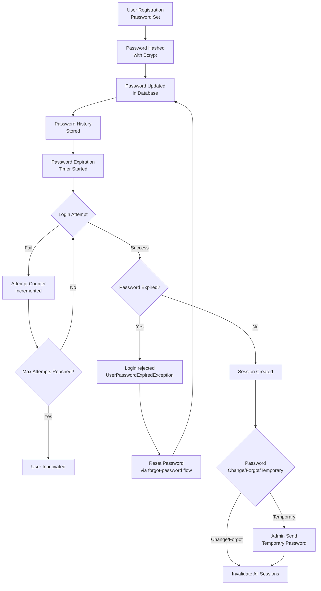
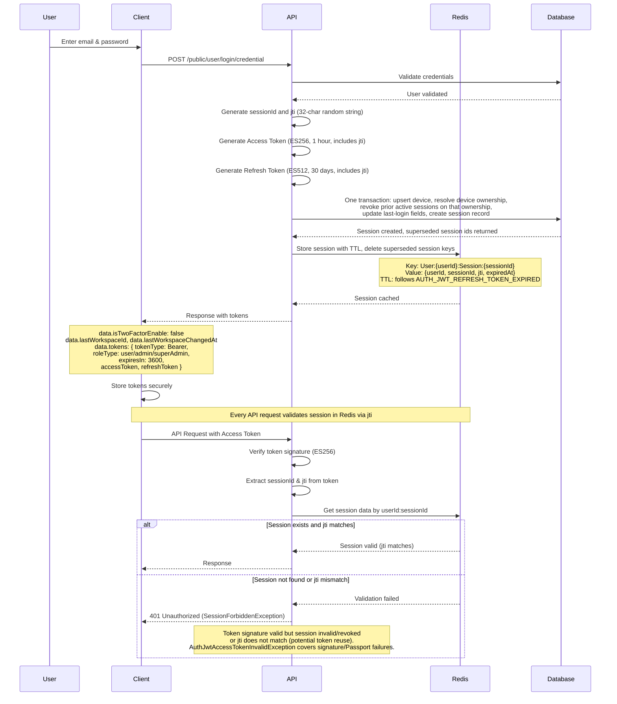
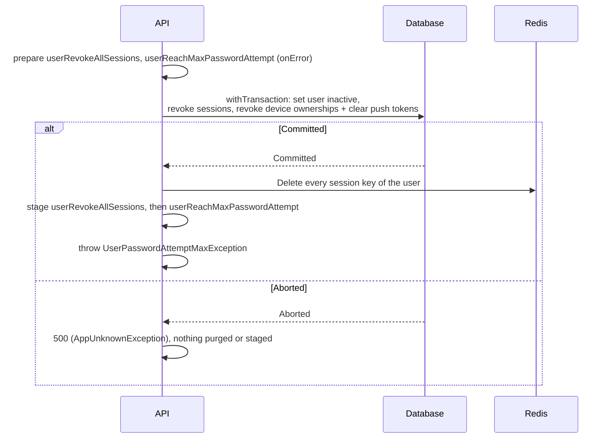
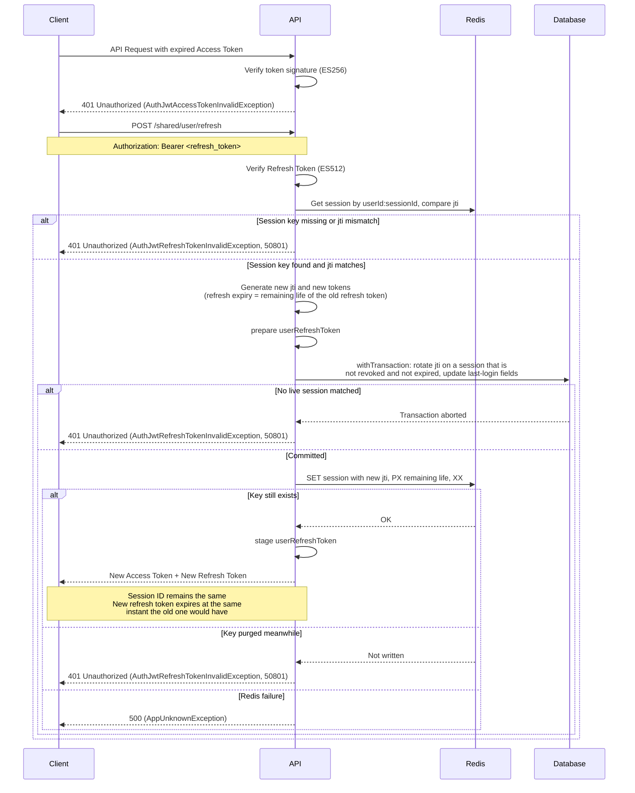
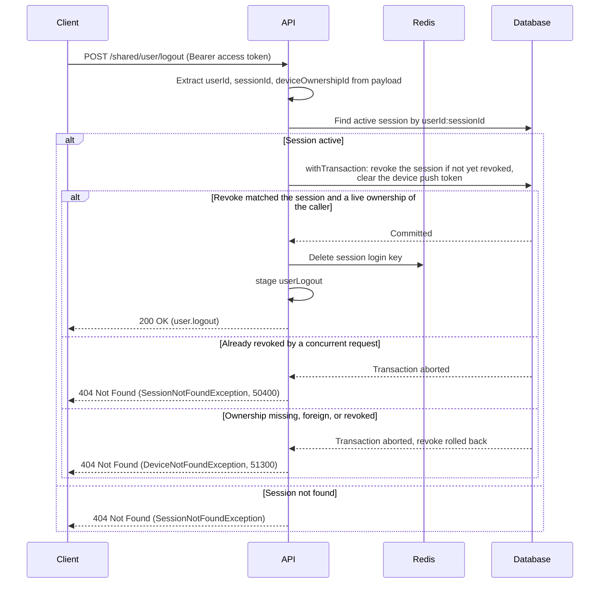
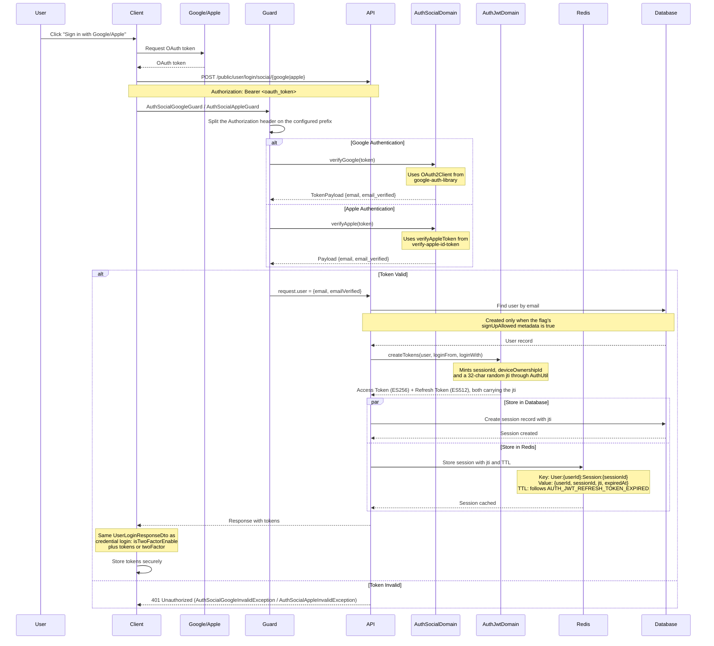
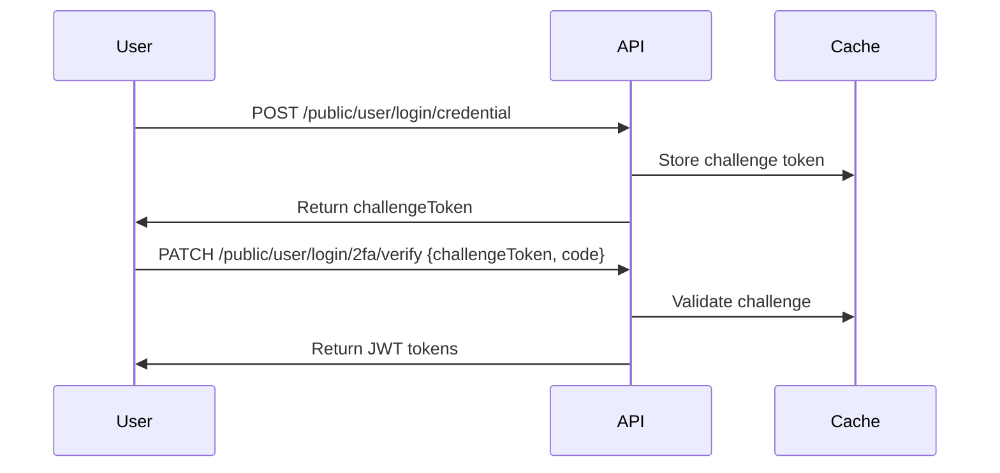
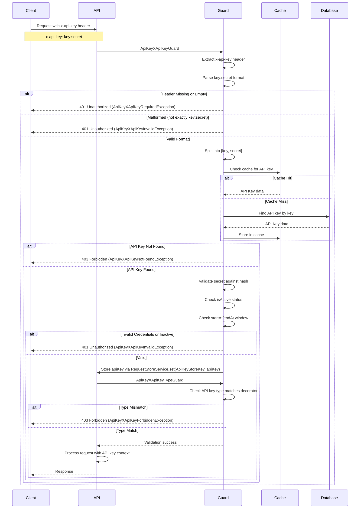
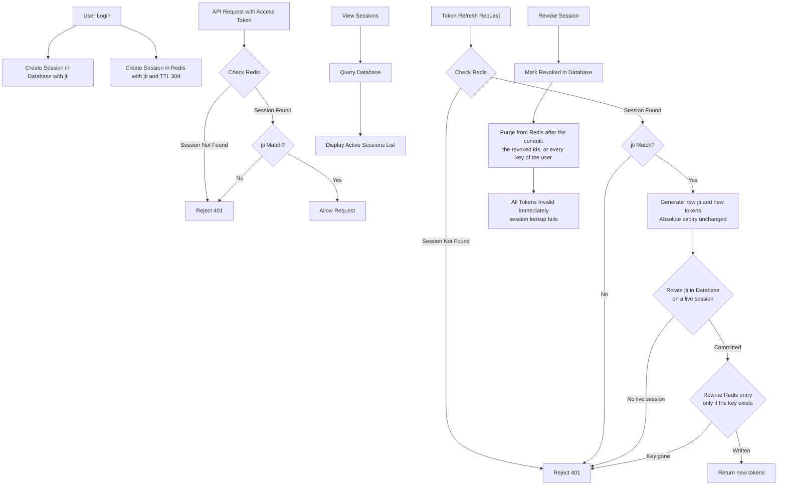
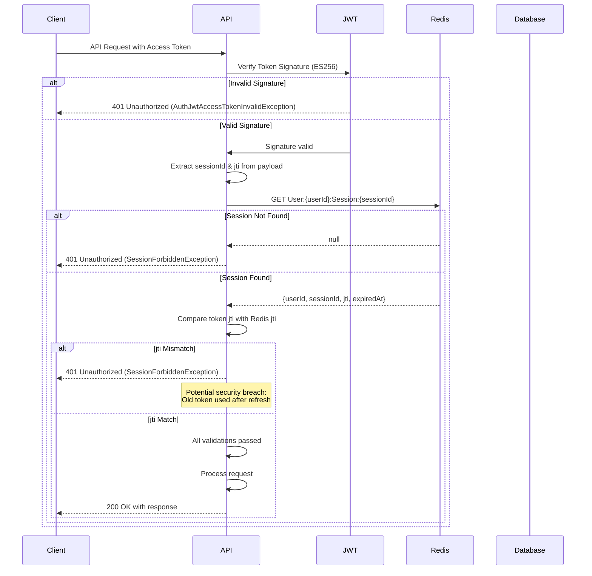

# Authentication Documentation

Auth lives in `src/modules/auth`. Sessions live in `src/modules/session`. API keys live in `src/modules/api-key`.

## Overview

Credential login, JWT access/refresh (ES256/ES512), Redis plus Mongo sessions, Google/Apple social login, and API keys.

- **Password:** bcrypt hash, expiration, rotation, attempt limits, history, and reset/change/temporary-password flows that invalidate sessions.
- **JWT:** access and refresh tokens, `jti` checked against the session on each request.
- **Session:** Redis for validation and TTL; database for listing, management, and history. A missing or mismatched Redis `jti` rejects the request.
- **Social:** Google OAuth 2.0 and Apple Sign In. The backend verifies the provider token, then follows the same session path as credential login.
- **API key:** default and system keys, checked against the database and cache.

Configuration for tokens, password, two-factor, social providers, and API keys is in `src/configs/auth.config.ts`. The Redis session key pattern is in `src/configs/session.config.ts`.

## Related Documents

- [Cache Documentation][ref-doc-cache] - Session cache in Redis
- [Configuration Documentation][ref-doc-configuration] - Auth and session config
- [Environment Documentation][ref-doc-environment] - JWT and OAuth env vars
- [Device Documentation][ref-doc-device] - Devices and session lifecycle
- [Two Factor Documentation][ref-doc-two-factor] - TOTP and backup codes
- [Workspace Documentation][ref-doc-workspace] - Workspace scope and invite sign-up
- [Project Documentation][ref-doc-project] - Project scope inside a workspace
- [Authorization Documentation][ref-doc-authorization] - What an authenticated caller may reach

This document covers authentication only: proving who the caller is. Authorization, workspace, and project scoping are separate docs.

## Table of Contents

- [Overview](#overview)
- [Related Documents](#related-documents)
- [Password](#password)
    - [Password Configuration](#password-configuration)
    - [Password Flow](#password-flow)
- [JWT Authentication](#jwt-authentication)
    - [JWT Configuration](#jwt-configuration)
    - [JWT Flow](#jwt-flow)
        - [JWT Access Token Flow](#jwt-access-token-flow)
        - [JWT Refresh Token Flow](#jwt-refresh-token-flow)
        - [JWT Logout Flow](#jwt-logout-flow)
    - [JWT Tokens](#jwt-tokens)
        - [JWT Access Token](#jwt-access-token)
        - [JWT Refresh Token](#jwt-refresh-token)
    - [JWT Payload Structure](#jwt-payload-structure)
        - [JWT Access Token Payload](#jwt-access-token-payload)
        - [JWT Refresh Token Payload](#jwt-refresh-token-payload)
    - [Usage](#usage)
        - [Protecting Endpoints](#protecting-endpoints)
        - [Getting JWT Payload](#getting-jwt-payload)
        - [Getting Raw Token](#getting-raw-token)
    - [Security: JWT ID (jti)](#security-jwt-id-jti)
        - [How it Works](#how-it-works)
- [Social Authentication](#social-authentication)
    - [Social Authentication Flow](#social-authentication-flow)
    - [Google Authentication](#google-authentication)
        - [Configuration](#configuration)
        - [Setup Google OAuth 2.0](#setup-google-oauth-20)
        - [Usage](#usage-1)
    - [Apple Authentication](#apple-authentication)
        - [Configuration](#configuration-1)
        - [Setup Apple Sign In](#setup-apple-sign-in)
        - [Usage](#usage-2)
- [Two-Factor Authentication (TOTP)](#two-factor-authentication-totp)
    - [Configuration](#configuration-2)
    - [Flow](#flow)
- [API Key Authentication](#api-key-authentication)
    - [Configuration](#configuration-3)
    - [API Key Types](#api-key-types)
        - [Default API Key](#default-api-key)
        - [System API Key](#system-api-key)
    - [Request Format](#request-format)
    - [Usage](#usage-3)
        - [Protecting Endpoints](#protecting-endpoints-1)
        - [Getting API Key Payload](#getting-api-key-payload)
    - [API Key Authentication Flow](#api-key-authentication-flow)
- [Session Management](#session-management)
    - [Session Endpoints](#session-endpoints)
    - [Session Storage](#session-storage)
        - [Redis (Primary - Validation)](#redis-primary---validation)
        - [Database (Secondary - Management)](#database-secondary---management)
        - [How They Work Together](#how-they-work-together)
    - [Session Lifecycle](#session-lifecycle)
    - [Session Validation Flow](#session-validation-flow)
    - [What Happens on Revocation](#what-happens-on-revocation)

## Password

Secures passwords with bcrypt hashing, enforces expiration and rotation, tracks history, limits login attempts, and supports reset, change, and temporary password creation with session invalidation.

### Password Configuration

All password settings are configured in `src/configs/auth.config.ts`:

```typescript
export default registerAs(
    'auth',
    (): IConfigAuth => ({
        password: {
            // Enable/disable login attempt limiting feature
            attempt: true,
            
            // Failed login attempts tolerated; the next login inactivates the user
            maxAttempt: 5,
            
            // Number of bcrypt salt rounds used for password hashing
            saltLength: 12,
            
            // Password expiration (182 days), stored in milliseconds
            expiredInMs: ms('182d'),
            
            // Temporary password expiration (3 days), stored in milliseconds
            expiredTemporaryInMs: ms('3d'),
            
            // Password reuse window in days (90), the unit the reuse check takes
            // A password kept in history for this long cannot be set again
            periodInDays: ms('90d') / ms('1d'),
        },
    })
);
```

### Password Flow


```mermaid
graph TD
    A[User Registration<br/>Password Set] --> B[Password Hashed<br/>with Bcrypt]
    B --> C[Password Updated<br/>in Database]
    C --> D[Password History<br/>Stored]
    D --> E[Password Expiration<br/>Timer Started]
    E --> F{Login Attempt}
    F -->|Success| K{Password Expired?}
    F -->|Fail| H[Attempt Counter<br/>Incremented]
    H --> I{Max Attempts Reached?}
    I -->|No| F
    I -->|Yes| J[User Inactivated]
    K -->|No| G[Session Created]
    K -->|Yes| L[Login rejected<br/>UserPasswordExpiredException]
    L --> M[Reset Password<br/>via forgot-password flow]
    M --> C
    G --> N{Password <br/>Change/Forgot/Temporary}
    N -->|Change/Forgot| O[Invalidate All Sessions]
    N -->|Temporary| P[Admin Send<br/>Temporary Password]
    P --> O
```

## JWT Authentication

Access and refresh tokens are JWTs ([RFC 7519][ref-jwt]). This project signs them with ECDSA: ES256 for access, ES512 for refresh. Specs: [JWT.io][ref-jwt].

> [!NOTE]
> JWT authentication uses cryptographic key pairs. Generation is [Installation Documentation - Generate Keys][ref-doc-installation].

### JWT Configuration

All JWT settings are configured in `src/configs/auth.config.ts`:

```typescript
export default registerAs(
    'auth',
    (): IConfigAuth => ({
        jwt: {
            accessToken: {
                // JWKS URI the access-token strategy verifies signatures against (required)
                jwksUri: process.env.AUTH_JWT_ACCESS_TOKEN_JWKS_URI,
                
                // Key ID stamped into the token header as `kid` (required)
                kid: process.env.AUTH_JWT_ACCESS_TOKEN_KID,
                
                // Algorithm for signing and verifying access tokens
                algorithm: 'ES256',  // ECDSA using P-256 and SHA-256
                
                // Private key for signing access tokens (from environment)
                privateKey: process.env.AUTH_JWT_ACCESS_TOKEN_PRIVATE_KEY,
                
                // Public key, used by the direct verify helpers on AuthJwtDomain
                publicKey: process.env.AUTH_JWT_ACCESS_TOKEN_PUBLIC_KEY,
                
                // Access token expiration in seconds, the unit the JWT signer takes,
                // parsed from the ms() string in AUTH_JWT_ACCESS_TOKEN_EXPIRED
                expirationTimeInSeconds:
                    ms(process.env.AUTH_JWT_ACCESS_TOKEN_EXPIRED) / 1000,
            },

            refreshToken: {
                // JWKS URI the refresh-token strategy verifies signatures against (required)
                jwksUri: process.env.AUTH_JWT_REFRESH_TOKEN_JWKS_URI,
                
                // Key ID stamped into the token header as `kid` (required)
                kid: process.env.AUTH_JWT_REFRESH_TOKEN_KID,
                
                // Algorithm for signing and verifying refresh tokens
                algorithm: 'ES512',  // ECDSA using P-521 and SHA-512
                
                // Private key for signing refresh tokens (from environment)
                privateKey: process.env.AUTH_JWT_REFRESH_TOKEN_PRIVATE_KEY,
                
                // Public key, used by the direct verify helpers on AuthJwtDomain
                publicKey: process.env.AUTH_JWT_REFRESH_TOKEN_PUBLIC_KEY,
                
                // Refresh token expiration in seconds, parsed from the ms() string in
                // AUTH_JWT_REFRESH_TOKEN_EXPIRED; it also sets the initial session expiry and Redis TTL
                expirationTimeInSeconds:
                    ms(process.env.AUTH_JWT_REFRESH_TOKEN_EXPIRED) / 1000,
            },

            // JWT audience claim (identifies intended recipients)
            audience: process.env.AUTH_JWT_AUDIENCE,
            
            // JWT issuer claim (identifies who issued the token)
            issuer: process.env.AUTH_JWT_ISSUER,
            
            // HTTP header name for token transmission
            header: 'Authorization',
            
            // Token prefix (e.g., 'Bearer' in 'Bearer <token>')
            prefix: 'Bearer',
        },
    })
);
```

Signature verification on incoming requests is done by the Passport strategies (`AuthJwtAccessStrategy`, `AuthJwtRefreshStrategy`) against the **JWKS endpoint**, not against the configured `publicKey`.

Both strategies:

- cache JWKS keys
- rate-limit fetches to 5 requests per minute
- enforce `audience`, `issuer`, expiration, and `nbf`

The configured `publicKey` is only used by `AuthJwtDomain.validateAccessToken` / `AuthJwtDomain.validateRefreshToken`.

### JWT Flow

#### JWT Access Token Flow

Login through token generation:


```mermaid
sequenceDiagram
    participant User
    participant Client
    participant API
    participant Redis
    participant Database

    User->>Client: Enter email & password
    Client->>API: POST /public/user/login/credential
    API->>Database: Validate credentials
    Database-->>API: User validated
    
    API->>API: Generate sessionId and jti (32-char random string)
    API->>API: Generate Access Token (ES256, 1 hour, includes jti)
    API->>API: Generate Refresh Token (ES512, 30 days, includes jti)
    
    API->>Database: One transaction: upsert device, resolve device ownership,<br/>revoke prior active sessions on that ownership,<br/>update last-login fields, create session record
    Database-->>API: Session created, superseded session ids returned
    
    API->>Redis: Store session with TTL, delete superseded session keys
    Note over Redis: Key: User:{userId}:Session:{sessionId}<br/>Value: {userId, sessionId, jti, expiredAt}<br/>TTL: follows AUTH_JWT_REFRESH_TOKEN_EXPIRED
    Redis-->>API: Session cached
    
    API-->>Client: Response with tokens
    Note over Client: data.isTwoFactorEnable: false<br/>data.lastWorkspaceId, data.lastWorkspaceChangedAt<br/>data.tokens: { tokenType: Bearer,<br/>roleType: user/admin/superAdmin,<br/>expiresIn: 3600,<br/>accessToken, refreshToken }
    
    Client->>Client: Store tokens securely
    
    Note over Client,Redis: Every API request validates session in Redis via jti
    
    Client->>API: API Request with Access Token
    API->>API: Verify token signature (ES256)
    API->>API: Extract sessionId & jti from token
    API->>Redis: Get session data by userId:sessionId
    
    alt Session exists and jti matches
        Redis-->>API: Session valid (jti matches)
        API-->>Client: Response
    else Session not found or jti mismatch
        Redis-->>API: Validation failed
        API-->>Client: 401 Unauthorized (SessionForbiddenException)
        Note over API: Token signature valid but session invalid/revoked<br/>or jti does not match (potential token reuse).<br/>AuthJwtAccessTokenInvalidException covers signature/Passport failures.
    end
```

The route itself is gated by `@FeatureFlagProtected('loginWithCredential')` and `@ApiKeyProtected()`, so a disabled flag rejects the request before any credential is read.

Credential checks run in a fixed order. Each one throws before the next is reached:

1. user found (`UserNotFoundException`)
2. status active (`UserInactiveForbiddenException`)
3. password set (`UserPasswordNotSetException`)
4. attempt limit not already reached (the lockout below runs, then `UserPasswordAttemptMaxException` is thrown)
5. password matches (`UserLoginDomain.recordLoginFailed` increments the attempt counter and writes a `userLoginFailed` row, then `UserPasswordNotMatchException` is thrown)

Every row these two branches write is prepared with `onError: true`, which is what writes it although the request answers an error ([Activity Log][ref-doc-activity-log]). A match resets the attempt counter first, and only then is password expiry checked (`UserPasswordExpiredException`).

**Lockout.** `UserPasswordDomain.reachMaxPasswordAttempt` prepares `userRevokeAllSessions` and `userReachMaxPasswordAttempt` for the user, then runs one transaction that:

1. sets the user `inactive`, with `updatedBy` set to the user;
2. revokes every active session of the user, with the user as the revoking actor;
3. revokes every live device ownership of the user and clears the push token of each of those devices ([Device][ref-doc-device]).

After the commit:

1. the lockout deletes every session key of the user from Redis
2. stages `userRevokeAllSessions`, then `userReachMaxPasswordAttempt`

Both rows are written on every lockout, including one where the user had no active session. `UserAuthDomain` then throws `UserPasswordAttemptMaxException`.

The transaction runs once:

- A domain exception raised inside it travels out as it is.
- Every other failure, a MongoDB write conflict (`P2034`) included, answers 500 (`AppUnknownException`). On that path nothing is purged and no row is staged, and the attempt counter stays at the limit, so the next login runs the lockout again.


```mermaid
sequenceDiagram
    participant API
    participant Database
    participant Redis

    API->>API: prepare userRevokeAllSessions, userReachMaxPasswordAttempt (onError)
    API->>Database: withTransaction: set user inactive,<br/>revoke sessions, revoke device ownerships + clear push tokens
    alt Committed
        Database-->>API: Committed
        API->>Redis: Delete every session key of the user
        API->>API: stage userRevokeAllSessions, then userReachMaxPasswordAttempt
        API->>API: throw UserPasswordAttemptMaxException
    else Aborted
        Database-->>API: Aborted
        API->>API: 500 (AppUnknownException), nothing purged or staged
    end
```

Two branches then short-circuit before any session or token is created:

- **Email not verified**: a new email verification is issued, the verification email is sent, and the login fails with `UserEmailNotVerifiedException`.
- **Two-factor enabled**: no session and no tokens are created. The challenge is written to Redis first (`AuthCache.createChallenge`); a Redis failure there answers 500. The response carries `data.isTwoFactorEnable: true` and `data.twoFactor` with `challengeToken`, `challengeExpiresInMs`, `isRequiredSetup`, and `backupCodesRemaining`. When `isRequiredSetup` is true the secret is provisioned in the same response, which also carries `otpauthUrl` and `secret`. See [Two-Factor Authentication (TOTP)](#two-factor-authentication-totp).

Session creation also enforces the device constraint. Inside one database transaction:

- device upsert
- device-ownership lookup
- revocation of every still-active session bound to that device-user pair
- creation of the new session record

The login activity row is prepared before the transaction. After the commit, in one parallel batch:

- the new session key is written (`SessionCache.setLogin`)
- exactly the superseded session ids are purged (`SessionDomain.purgeRevokedLogins`)
- the new-device login notification runs when the device ownership was created rather than reused

The login row is staged once that batch settles. A purge failure is logged and the login still succeeds. A failed session key write answers 500 and stages no row.

#### JWT Refresh Token Flow

When the access token expires, the refresh token is used to obtain a new access token. Each refresh issues a new `jti`, which is what the session check matches. `UserLoginDomain.refreshSession` rotates the `jti` in the database first and in Redis after the commit, and stages `userRefreshToken` only after the Redis rewrite. The Redis write succeeds only while the session key still exists, so a refresh cannot bring back a session a revoke has purged:


```mermaid
sequenceDiagram
    participant Client
    participant API
    participant Redis
    participant Database

    Client->>API: API Request with expired Access Token
    API->>API: Verify token signature (ES256)
    API-->>Client: 401 Unauthorized (AuthJwtAccessTokenInvalidException)

    Client->>API: POST /shared/user/refresh
    Note over Client,API: Authorization: Bearer <refresh_token>

    API->>API: Verify Refresh Token (ES512)
    API->>Redis: Get session by userId:sessionId, compare jti
    alt Session key missing or jti mismatch
        API-->>Client: 401 Unauthorized (AuthJwtRefreshTokenInvalidException, 50801)
    else Session key found and jti matches
        API->>API: Generate new jti and new tokens<br/>(refresh expiry = remaining life of the old refresh token)
        API->>API: prepare userRefreshToken
        API->>Database: withTransaction: rotate jti on a session that is<br/>not revoked and not expired, update last-login fields
        alt No live session matched
            Database-->>API: Transaction aborted
            API-->>Client: 401 Unauthorized (AuthJwtRefreshTokenInvalidException, 50801)
        else Committed
            API->>Redis: SET session with new jti, PX remaining life, XX
            alt Key still exists
                Redis-->>API: OK
                API->>API: stage userRefreshToken
                API-->>Client: New Access Token + New Refresh Token
                Note over Client,API: Session ID remains the same<br/>New refresh token expires at the same<br/>instant the old one would have
            else Key purged meanwhile
                Redis-->>API: Not written
                API-->>Client: 401 Unauthorized (AuthJwtRefreshTokenInvalidException, 50801)
            else Redis failure
                API-->>Client: 500 (AppUnknownException)
            end
        end
    end
```

`AuthJwtRefreshGuard` runs the first session check before the handler, and `refreshSession` repeats it against the same key. `userRefreshToken` is success-only, so a refresh that ends in 401 or 500 writes no row.

#### JWT Logout Flow

Endpoint: `POST /shared/user/logout`. Protected by `@AuthJwtAccessProtected`, `@UserProtected`, `@TermPolicyAcceptanceProtected`, and `@ApiKeyProtected`. Returns `200 OK` with message `user.logout` and records the `userLogout` activity-log action.

The handler reads `userId`, `sessionId`, and `deviceOwnershipId` from the access-token payload, then:

1. Verifies the session is still active in the database (`SessionDomain.validateActive`; `404 session.error.notFound` otherwise) and prepares `userLogout`.
2. `UserLoginDomain.logout` opens `this.databaseService.withTransaction` and composes `SessionDomain.revokeInTx` and `DeviceDomain.clearNotificationInTx`. The revoke matches only a session that is not yet revoked; when it matches nothing (a concurrent logout of the same session got there first), the transaction aborts with `SessionNotFoundException` (404, `50400`) and nothing changes. `DeviceDomain.clearNotificationInTx` resolves the device only through a live ownership: the `deviceOwnershipId` from the token, belonging to the caller, not revoked. When no such ownership exists (missing, owned by another user, or already revoked), the transaction aborts with `DeviceNotFoundException` (404, `51300`) and the session revoke rolls back. Otherwise `DeviceRepository.clearNotificationByIdsInTx` clears the device's push token, stamps `lastActiveAt`, and sets `updatedBy` to the user.
3. After the commit, `SessionDomain.purgeRevokedLogins` deletes the session's Redis key. A purge failure is logged and the logout still succeeds.
4. `userLogout` is staged, and `ActivityLogInterceptor` writes the row once the handler returns.


```mermaid
sequenceDiagram
    participant Client
    participant API
    participant Redis
    participant Database

    Client->>API: POST /shared/user/logout (Bearer access token)
    API->>API: Extract userId, sessionId, deviceOwnershipId from payload
    API->>Database: Find active session by userId:sessionId
    alt Session active
        API->>Database: withTransaction: revoke the session if not yet revoked,<br/>clear the device push token
        alt Revoke matched the session and a live ownership of the caller
            Database-->>API: Committed
            API->>Redis: Delete session login key
            API->>API: stage userLogout
            API-->>Client: 200 OK (user.logout)
        else Already revoked by a concurrent request
            Database-->>API: Transaction aborted
            API-->>Client: 404 Not Found (SessionNotFoundException, 50400)
        else Ownership missing, foreign, or revoked
            Database-->>API: Transaction aborted, revoke rolled back
            API-->>Client: 404 Not Found (DeviceNotFoundException, 51300)
        end
    else Session not found
        API-->>Client: 404 Not Found (SessionNotFoundException)
    end
```

Logout revokes only the current session; other active sessions remain valid.

### JWT Tokens

#### JWT Access Token

A short-lived token used to authenticate API requests. 

- **Algorithm**: ES256 (ECDSA using P-256 and SHA-256)
- **Validity**: Configured in `auth.config.ts` (default: 1 hour)
- **Config**: `AUTH_JWT_ACCESS_TOKEN_EXPIRED` environment variable
- **Purpose**: Authenticate API requests
- **jti**: Included for session tracking and validation

#### JWT Refresh Token

A long-lived token used to obtain new access tokens without requiring the user to log in again.

- **Algorithm**: ES512 (ECDSA using P-521 and SHA-512)
- **Validity**: Configured in `auth.config.ts` (default: 30 days)
- **Config**: `AUTH_JWT_REFRESH_TOKEN_EXPIRED` environment variable
- **Redis TTL**: Session TTL in Redis follows this expiration time
- **Purpose**: Generate new access tokens without re-authentication
- **jti**: Included for session tracking and validation

### JWT Payload Structure

#### JWT Access Token Payload

Interface `IAuthJwtAccessTokenPayload`

```typescript
{
    loginAt: Date;
    loginFrom: EnumUserLoginFrom;
    loginWith: EnumUserLoginWith;
    email: string;
    username: string;
    userId: string;
    sessionId: string;
    deviceOwnershipId: string;
    roleId: string;
    
    // Standard JWT claims
    jti?: string;  // JWT ID - unique token identifier
    iat?: number;  // Issued at
    nbf?: number;  // Not before
    exp?: number;  // Expiration time
    aud?: string;  // Audience
    iss?: string;  // Issuer
    sub?: string;  // Subject
}
```

#### JWT Refresh Token Payload

Interface `IAuthJwtRefreshTokenPayload`

A type alias derived from `IAuthJwtAccessTokenPayload` with `Omit`. The refresh payload drops `roleId`, `username`, and `email`, keeping the rest:

```typescript
{
    loginAt: Date;
    loginFrom: EnumUserLoginFrom;
    loginWith: EnumUserLoginWith;
    userId: string;
    sessionId: string;
    deviceOwnershipId: string;
    
    // Standard JWT claims
    jti?: string;  // JWT ID - unique token identifier
    iat?: number;
    nbf?: number;
    exp?: number;
    aud?: string;
    iss?: string;
    sub?: string;
}
```

### Usage

#### Protecting Endpoints

To protect an endpoint with JWT access token validation, use the `@AuthJwtAccessProtected` decorator:

```typescript
@UserProtected()
@AuthJwtAccessProtected()
@Get('/profile/get')
async profile(
    @AuthJwtPayload('userId') userId: string
): Promise<IResponseReturn<IUserProfile>> {
    return this.userProfileHttpService.getProfile(userId);
}
```

Refresh uses `@AuthJwtRefreshProtected` on `POST /refresh`:

```typescript
@UserProtected()
@AuthJwtRefreshProtected()
@Post('/refresh')
async refresh(
    @UserCurrent() user: IUser,
    @AuthJwtToken() refreshToken: string
): Promise<IResponseReturn<IAuthToken>> {
    return this.userAuthHttpService.refresh(user, refreshToken);
}
```

#### Getting JWT Payload

To access the JWT payload in your controller, use the `@AuthJwtPayload()` decorator:

Shared profile reads `userId` from the payload:

```typescript
@UserProtected()
@AuthJwtAccessProtected()
@Get('/profile/get')
async profile(
    @AuthJwtPayload('userId') userId: string
): Promise<IResponseReturn<IUserProfile>> {
    return this.userProfileHttpService.getProfile(userId);
}
```

`AuthJwtPayload<T, K>(field?)` reads `request.user`, which the authenticating guard wrote.

| Piece | Meaning |
|---|---|
| `T` | payload type; defaults to `IAuthJwtAccessTokenPayload` |
| `field` | typed as a key of `T` |

- Without a field it returns the whole payload; with one it returns that field, non-null
- The social login routes read `@AuthJwtPayload<IAuthSocialPayload>('email')`
- An empty `request.user` (a route that reads the payload without an authenticating guard), or a named field the payload does not carry, throws `RequestContextMissingException` (500, `50304`)

#### Getting Raw Token

To access the raw JWT token string, use the `@AuthJwtToken()` decorator:

Refresh is the call site:

```typescript
@UserProtected()
@AuthJwtRefreshProtected()
@Post('/refresh')
async refresh(
    @UserCurrent() user: IUser,
    @AuthJwtToken() refreshToken: string
): Promise<IResponseReturn<IAuthToken>> {
    return this.userAuthHttpService.refresh(user, refreshToken);
}
```

### Security: JWT ID (jti)

A unique identifier (32-character random string) generated during login and token refresh, stored in both the token payload and the session in Redis.

#### How it Works

1. **During Login**
   - API generates a unique jti (32-character random string)
   - jti is stored in Redis session
   - jti is embedded in both access and refresh tokens as a standard JWT claim

2. **During Every API Request (Access Token)**
   - Client sends request with access token
   - API extracts the jti from the access token payload
   - API retrieves session from Redis using userId and sessionId
   - API compares token jti with session jti
   - **If jti matches**: Request is allowed
   - **If jti doesn't match**: Request is rejected (401 Unauthorized - potential token reuse)

3. **During Token Refresh (Refresh Token)**
   - Client sends the refresh token to the API
   - API extracts the jti from the refresh token payload
   - API retrieves session from Redis using userId and sessionId
   - API compares token jti with session jti
   - **If jti matches**: Token refresh proceeds with a new jti
   - **If jti doesn't match**: Request is rejected (401 Unauthorized - potential security breach)

4. **jti Rotation**
   - Each successful token refresh generates a **new jti** (32-character random string)
   - Old jti is invalidated
   - New jti is stored in the database session record, then in Redis once the transaction has committed
   - The Redis write happens only while the session key still exists; a key purged by a revoke in the meantime makes the refresh answer 401
   - New tokens contain the new jti
   - The session's absolute expiry is never pushed out: the new refresh token and the Redis TTL both carry only the time still left on the presented refresh token, so a session cannot outlive `AUTH_JWT_REFRESH_TOKEN_EXPIRED` counted from login

5. **What the check catches**
   - An access or refresh token presented after a refresh carries the old jti, which no longer matches
   - Each refresh writes a new jti, so a token maps to one point in the session's history
   - Deleting the session key from Redis invalidates every token carrying that sessionId at once
   - An intercepted old token cannot be replayed

## Social Authentication

Social authentication allows users to sign in using their Google or Apple accounts. The backend validates the OAuth tokens provided by the client and extracts user information to create a session, similar to credential-based authentication.

**Supported Providers:**
- Google OAuth 2.0
- Apple Sign In

### Social Authentication Flow

Social login:


```mermaid
sequenceDiagram
    participant User
    participant Client
    participant GoogleApple as Google/Apple
    participant Guard
    participant API
    participant AuthSocialDomain
    participant AuthJwtDomain
    participant Redis
    participant Database

    User->>Client: Click "Sign in with Google/Apple"
    Client->>GoogleApple: Request OAuth token
    GoogleApple-->>Client: OAuth token
    
    Client->>API: POST /public/user/login/social/{google|apple}
    Note over Client,API: Authorization: Bearer <oauth_token>
    
    Client->>Guard: AuthSocialGoogleGuard / AuthSocialAppleGuard
    Guard->>Guard: Split the Authorization header on the configured prefix
    
    alt Google Authentication
        Guard->>AuthSocialDomain: verifyGoogle(token)
        Note over AuthSocialDomain: Uses OAuth2Client from<br/>google-auth-library
        AuthSocialDomain-->>Guard: TokenPayload {email, email_verified}
    else Apple Authentication
        Guard->>AuthSocialDomain: verifyApple(token)
        Note over AuthSocialDomain: Uses verifyAppleToken from<br/>verify-apple-id-token
        AuthSocialDomain-->>Guard: Payload {email, email_verified}
    end
    
    alt Token Valid
        Guard->>API: request.user = {email, emailVerified}
        API->>Database: Find user by email
        Note over API,Database: Created only when the flag's<br/>signUpAllowed metadata is true
        Database-->>API: User record
        
        API->>AuthJwtDomain: createTokens(user, loginFrom, loginWith)
        Note over AuthJwtDomain: Mints sessionId, deviceOwnershipId<br/>and a 32-char random jti through AuthUtil
        AuthJwtDomain-->>API: Access Token (ES256) + Refresh Token (ES512), both carrying the jti
        
        par Store in Database
            API->>Database: Create session record with jti
            Database-->>API: Session created
        and Store in Redis
            API->>Redis: Store session with jti and TTL
            Note over Redis: Key: User:{userId}:Session:{sessionId}<br/>Value: {userId, sessionId, jti, expiredAt}<br/>TTL: follows AUTH_JWT_REFRESH_TOKEN_EXPIRED
            Redis-->>API: Session cached
        end
        
        API-->>Client: Response with tokens
        Note over Client: Same UserLoginResponseDto as<br/>credential login: isTwoFactorEnable<br/>plus tokens or twoFactor
        
        Client->>Client: Store tokens securely
        
    else Token Invalid
        API-->>Client: 401 Unauthorized (AuthSocialGoogleInvalidException / AuthSocialAppleInvalidException)
    end
```

Social login joins the credential login path once the user is resolved, so the two-factor branch and the device constraint apply exactly as they do for credential login. The email-verification branch does not: a social user who is not yet verified is marked verified in place before the shared path runs, so `UserEmailNotVerifiedException` is never reached from a social login. A user whose status is not `active` is rejected with `UserInactiveForbiddenException` at the same point, whether the record was just created or already existed.

Both routes are also gated by `@FeatureFlagProtected('loginWithGoogle')` / `@FeatureFlagProtected('loginWithApple')` and `@ApiKeyProtected()`. A missing or malformed `Authorization` header fails with `AuthSocialGoogleRequiredException` / `AuthSocialAppleRequiredException` (401) before any token verification runs.

When the account does not exist and the flag's `signUpAllowed` metadata is true, the user is created on this path: the default user role is resolved, the username is checked against the allowed pattern, the bad-word list, and existing usernames, the workspace context is resolved (from `inviteToken` when present, otherwise a personal workspace), the record is created, and a welcome email is sent. Supplying an `inviteToken` also requires the `workspace` flag's `invitationAllowed` metadata, and an invite token that resolves to nothing fails with `WorkspaceInviteInvalidException`.

### Google Authentication

#### Configuration

Google authentication is configured in `auth.config.ts`:

```typescript
export default registerAs(
    'auth',
    (): IConfigAuth => ({
        google: {
            header: 'Authorization',
            prefix: 'Bearer',
            clientId: process.env.AUTH_SOCIAL_GOOGLE_CLIENT_ID ?? null,
            clientSecret: process.env.AUTH_SOCIAL_GOOGLE_CLIENT_SECRET ?? null,
        }
    })
);
```

**Environment Variables:**
- `AUTH_SOCIAL_GOOGLE_CLIENT_ID`: Google OAuth 2.0 client ID
- `AUTH_SOCIAL_GOOGLE_CLIENT_SECRET`: Google OAuth 2.0 client secret

#### Setup Google OAuth 2.0

To obtain Google OAuth credentials:

1. Go to [Google Cloud Console][ref-google-console]
2. Create a new project or select existing project
3. Enable Google+ API
4. Create OAuth 2.0 credentials (Web application)
5. Configure authorized redirect URIs
6. Copy Client ID and Client Secret to your `.env` file

Setup: [Google OAuth 2.0 Documentation][ref-google-client-secret]

#### Usage

**Protecting the Endpoint:**

```typescript
@AuthPublicLoginSocialGoogleDoc()
@Response('user.loginWithSocialGoogle', { schema: UserLoginResponseSchema })
@AuthSocialGoogleProtected()
@FeatureFlagProtected('loginWithGoogle')
@ApiKeyProtected()
@RequestThrottle({ route: EnumRequestThrottleRoute.strict })
@HttpCode(HttpStatus.OK)
@Post('/login/social/google')
async loginWithGoogle(
    @AuthJwtPayload<IAuthSocialPayload>('email') email: string,
    @Body({ schema: UserCreateSocialRequestSchema })
    body: UserCreateSocialRequestDto
): Promise<IResponseReturn<IUserLoginOutcome>> {
    return this.userAuthHttpService.loginWithSocial(
        email,
        EnumUserLoginWith.socialGoogle,
        body
    );
}
```

The guard puts the verified `IAuthSocialPayload` (`email`, `emailVerified`) on `request.user`, which is what `@AuthJwtPayload` reads. The request body still carries the device and `from` fields the session needs.

### Apple Authentication

#### Configuration

Apple authentication is configured in `auth.config.ts`:

```typescript
export default registerAs(
    'auth',
    (): IConfigAuth => ({
        apple: {
            header: 'Authorization',
            prefix: 'Bearer',
            clientId: process.env.AUTH_SOCIAL_APPLE_CLIENT_ID ?? null,
            signInClientId:
                process.env.AUTH_SOCIAL_APPLE_SIGN_IN_CLIENT_ID ?? null,
        }
    })
);
```

**Environment Variables:**
- `AUTH_SOCIAL_APPLE_CLIENT_ID`: Apple service ID
- `AUTH_SOCIAL_APPLE_SIGN_IN_CLIENT_ID`: Apple sign-in client ID

#### Setup Apple Sign In

To obtain Apple credentials:

1. Go to [Apple Developer Portal](https://developer.apple.com/)
2. Create an App ID with Sign in with Apple capability
3. Create a Services ID for web authentication
4. Configure return URLs
5. Download and configure private key
6. Copy Service ID (Client ID) to your `.env` file

Setup: [Apple Sign In Documentation](https://developer.apple.com/sign-in-with-apple/get-started/)

#### Usage

**Protecting the Endpoint:**

```typescript
@AuthPublicLoginSocialAppleDoc()
@Response('user.loginWithSocialApple', { schema: UserLoginResponseSchema })
@AuthSocialAppleProtected()
@FeatureFlagProtected('loginWithApple')
@ApiKeyProtected()
@RequestThrottle({ route: EnumRequestThrottleRoute.strict })
@HttpCode(HttpStatus.OK)
@Post('/login/social/apple')
async loginWithApple(
    @AuthJwtPayload<IAuthSocialPayload>('email') email: string,
    @Body({ schema: UserCreateSocialRequestSchema })
    body: UserCreateSocialRequestDto
): Promise<IResponseReturn<IUserLoginOutcome>> {
    return this.userAuthHttpService.loginWithSocial(
        email,
        EnumUserLoginWith.socialApple,
        body
    );
}
```

The Apple token is verified against both `clientId` and `signInClientId`, so one route serves the web Services ID and the native app.

## Two-Factor Authentication (TOTP)

TOTP-based 2FA adds a second verification step to login. Tokens are only issued after the user passes 2FA.

### Configuration

Two-Factor settings are configured in `src/configs/auth.config.ts`:

```typescript
export default registerAs(
    'auth',
    (): IConfigAuth => ({
        twoFactor: {
            strategy: 'totp',          // OTP strategy (totp)
            algorithm: 'sha1',         // Hash algorithm (sha1)
            issuer: process.env.AUTH_TWO_FACTOR_ISSUER,
            digits: 6,
            periodInSeconds: ms('30s') / 1000, // Token validity window in seconds, the unit otplib takes
            window: 1,
            secretLength: 32,
            challengeTtlInMs: ms('5m'),
            challengeKeyPattern: 'TwoFactor:Challenge:{token}',
            lockKeyPattern: 'TwoFactor:Lock:{userId}',
            backupCodes: {
                count: 8,
                length: 10,
            },
            maxAttempt: 5,
            lockAttemptDurationInMs: ms('2m'),
            encryption: {
                key: process.env.AUTH_TWO_FACTOR_ENCRYPTION_KEY,
            },
        },
    })
);
```

**Configuration Options:**
- `strategy`: OTP strategy, `totp` (time-based)
- `algorithm`: Hash algorithm used for TOTP generation, `sha1`
- `issuer`: Label shown in the authenticator app, from `AUTH_TWO_FACTOR_ISSUER`
- `periodInSeconds`: Token validity window in seconds (default: 30), passed straight to otplib
- `digits`: Number of digits in the OTP code (default: `6`)
- `window`: Backward-only time steps tolerated; `epochTolerance` is `[window × periodInSeconds, 0]`, so a past step is accepted and a future one is not (default: `1`)
- `secretLength`: Length of the generated secret (default: `32`)
- `challengeTtlInMs`: TTL for the challenge token in cache (default: `5m`)
- `challengeKeyPattern`: Cache key pattern for the challenge token (`TwoFactor:Challenge:{token}`)
- `lockKeyPattern`: Cache key pattern for the lockout entry (`TwoFactor:Lock:{userId}`)
- `maxAttempt`: Max failed TOTP attempts before lockout (default: `5`)
- `lockAttemptDurationInMs`: Lockout duration after max attempts exceeded (default: `2m`)
- `backupCodes.count`: Number of backup codes generated (default: `8`)
- `backupCodes.length`: Length of each backup code (default: `10`)
- `encryption.key`: Root secret for the stored TOTP secrets, from `AUTH_TWO_FACTOR_ENCRYPTION_KEY` (exactly 64 base64url characters)

### Flow


```mermaid
sequenceDiagram
    participant User
    participant API
    participant Cache

    User->>API: POST /public/user/login/credential
    API->>Cache: Store challenge token
    API->>User: Return challengeToken
    User->>API: PATCH /public/user/login/2fa/verify {challengeToken, code}
    API->>Cache: Validate challenge
    API->>User: Return JWT tokens
```

A user whose two-factor is flagged `requiredSetup` completes enrollment at `POST /public/user/login/2fa/enable` with the same `challengeToken`, then verifies. Both routes are public: `@ApiKeyProtected()` is the only guard on either.

Details: [Two-Factor Documentation][ref-doc-two-factor].

## API Key Authentication

API keys authenticate machines. They have no session. The key is checked against the database and cache. The callers are external integrations, webhook senders, internal services, scheduled jobs, and third-party clients.

### Configuration

API Key authentication is configured in `auth.config.ts`:

```typescript
export default registerAs(
    'auth',
    (): IConfigAuth => ({
        xApiKey: {
            header: 'x-api-key',
            keyPattern: 'ApiKey:{key}',
        },
    })
);
```

**Configuration Options:**
- `header`: Header name for API key (`x-api-key`)
- `keyPattern`: Redis cache key pattern for API key caching (`{key}` is replaced with the key)

An admin write that changes or deletes a key runs the database write, stages its activity row, then deletes the key's cache entry. A failed cache delete answers 500 with the database change applied. Details: [Cache][ref-doc-cache].

### API Key Types

#### Default API Key

Default API keys are used for standard external integrations and third-party access.

**Characteristics:**
- Type: `EnumApiKeyType.default`
- Purpose: General-purpose API access
- Use Case: External clients, third-party integrations
- Validation: Requires valid `key:secret` combination
- Cache: Cached in Redis for performance

**Guard Decorator:**
```typescript
@ApiKeyProtected()
```

Public login stacks it:

```typescript
@FeatureFlagProtected('loginWithCredential')
@ApiKeyProtected()
@Post('/login/credential')
async loginWithCredential(
    @Body({ schema: UserLoginRequestSchema })
    body: UserLoginRequestDto
): Promise<IResponseReturn<IUserLoginOutcome>> {
    return this.userAuthHttpService.loginCredential(body);
}
```

#### System API Key

System API keys are used for internal system operations that bypass standard authentication.

**Characteristics:**
- Type: `EnumApiKeyType.system`
- Purpose: System-level operations
- Use Case: Internal services, background jobs, system maintenance
- Validation: Requires valid `key:secret` combination
- Cache: Cached in Redis for performance

**Guard Decorator:**
```typescript
@ApiKeySystemProtected()
```

Health checks stack it on `HealthSystemController` (`VERSION_NEUTRAL`, path `/health` under `/system`):

```typescript
@ApiKeySystemProtected()
@Get('/aws')
async checkAws(): Promise<IResponseReturn<HealthAwsResponseDto>> {
    return this.healthHttpService.checkAws();
}
```

### Request Format

API keys are sent via the `x-api-key` header with the format `${key}:${secret}`. The stored `key` carries the environment it was minted in as a prefix, `<APP_ENV>_<random>` (for example `local_fyFGb7ywyM37TqDY8nuhAmGW5` for the seeded default key), and the header sends that full value:

**Header Format:**
```
x-api-key: ${key}:${secret}
```

**Format Rules:**
- Pattern: `key:secret`, where `key` is the full `<APP_ENV>_<random>` value
- Separator: Colon (`:`)
- Both key and secret are required
- No spaces allowed
- Case-sensitive

### Usage

#### Protecting Endpoints

**Default API Key Protection:**

```typescript
@FeatureFlagProtected('loginWithCredential')
@ApiKeyProtected()
@Post('/login/credential')
async loginWithCredential(
    @Body({ schema: UserLoginRequestSchema })
    body: UserLoginRequestDto
): Promise<IResponseReturn<IUserLoginOutcome>> {
    return this.userAuthHttpService.loginCredential(body);
}
```

**System API Key Protection:**

```typescript
@ApiKeySystemProtected()
@Get('/aws')
async checkAws(): Promise<IResponseReturn<HealthAwsResponseDto>> {
    return this.healthHttpService.checkAws();
}
```

#### Getting API Key Payload

`@ApiKeyPayload(field?)` reads the `ApiKey` that `@ApiKeyProtected()` or `@ApiKeySystemProtected()` stored under `ApiKeyStoreKey`. With no argument it returns the whole `ApiKey`; with a field name typed against `ApiKey` it returns that field. Both are non-null, so a route that reads it without the guard, or names a field holding `null`, answers `RequestContextMissingException` (500, `50304`). See [Security and Middleware][ref-doc-security-and-middleware].

### API Key Authentication Flow


```mermaid
sequenceDiagram
    participant Client
    participant API
    participant Guard
    participant Cache
    participant Database

    Client->>API: Request with x-api-key header
    Note over Client,API: x-api-key: key:secret

    API->>Guard: ApiKeyXApiKeyGuard
    Guard->>Guard: Extract x-api-key header
    Guard->>Guard: Parse key:secret format

    alt Header Missing or Empty
        Guard-->>Client: 401 Unauthorized (ApiKeyXApiKeyRequiredException)
    else Malformed (not exactly key:secret)
        Guard-->>Client: 401 Unauthorized (ApiKeyXApiKeyInvalidException)
    else Valid Format
        Guard->>Guard: Split into [key, secret]
        Guard->>Cache: Check cache for API key
        
        alt Cache Hit
            Cache-->>Guard: API Key data
        else Cache Miss
            Guard->>Database: Find API key by key
            Database-->>Guard: API Key data
            Guard->>Cache: Store in cache
        end

        alt API Key Not Found
            Guard-->>Client: 403 Forbidden (ApiKeyXApiKeyNotFoundException)
        else API Key Found
            Guard->>Guard: Validate secret against hash
            Guard->>Guard: Check isActive status
            Guard->>Guard: Check startAt/endAt window

            alt Invalid Credentials or Inactive
                Guard-->>Client: 401 Unauthorized (ApiKeyXApiKeyInvalidException)
            else Valid
                Guard->>API: Store apiKey via RequestStoreService.set(ApiKeyStoreKey, apiKey)
                API->>Guard: ApiKeyXApiKeyTypeGuard
                Guard->>Guard: Check API key type matches decorator

                alt Type Mismatch
                    Guard-->>Client: 403 Forbidden (ApiKeyXApiKeyForbiddenException)
                else Type Match
                    Guard-->>API: Validation success
                    API->>API: Process request with API key context
                    API-->>Client: Response
                end
            end
        end
    end
```

## Session Management

Sessions are bound to a user and a device. Users and admins can list them and revoke them.

Sessions sit on `DeviceOwnership` (one user on one device). That pair may hold only one active session. A device can still be owned by more than one user.

Storage:
- **Redis:** validation and TTL, for both access and refresh tokens
- **Database:** listing, management, and audit trail

### Session Endpoints

Global prefix `/api` and version `v1` apply as elsewhere.

| Method | Path | Scope |
|---|---|---|
| `GET` | `/shared/user/session/list` | The caller's own sessions (cursor) |
| `DELETE` | `/shared/user/session/revoke/:sessionId` | Revoke one of the caller's sessions |
| `GET` | `/admin/user/:userId/session/list` | A user's sessions (offset), filterable by `isRevoked` |
| `DELETE` | `/admin/user/:userId/session/revoke/:sessionId` | Revoke one session of a user |
| `DELETE` | `/admin/user/:userId/session/revoke-all` | Revoke every active session of a user |

The admin routes carry `@RoleProtected(EnumRoleType.admin)` and `@PolicyProtected` on `user: [read]` plus `session: [read]` (list) or `session: [read, delete]` (both revoke routes), and no workspace guard. Every session route is throttled with `@RequestThrottle({ user: true })`.

**Revoke one.** `DELETE /shared/user/session/revoke/:sessionId` and the admin `DELETE /admin/user/:userId/session/revoke/:sessionId`:

1. check that the session is active
2. prepare their activity rows
3. revoke with a write that matches only a session that is not yet revoked

When that write matches nothing (a concurrent revoke of the same session got there first), the request answers `SessionNotFoundException` (404, `50400`), and nothing is purged or written to the activity log. Otherwise the session's Redis key is deleted, then the rows are staged.

**Revoke all (admin).** `DELETE /admin/user/:userId/session/revoke-all`:

1. revokes every active session of the user in one transaction (`SessionRepository.revokeActiveByUser`)
2. deletes every session key of the user from Redis (`SessionDomain.purgeLoginsByUser`)
3. stages its activity rows

It answers with the message `session.revokeAll`.

| Case | Exception | statusCode | HTTP |
|---|---|---|---|
| `userId` is the admin's own account | `UserNotSelfException` | `51001` | 400 |
| The user holds no active session, or does not exist | `SessionNotFoundException` | `50400` | 404 |

Neither case revokes a session or writes an activity-log row. A successful call writes `adminSessionRevokeAll` for the admin and `userRevokeAllSessionsByAdmin` for the user, each carrying `sessionCount`. The single-session admin revoke writes `adminSessionRevoke` and `userRevokeSessionByAdmin`, and writes only `adminSessionRevoke` when the admin revokes a session of their own account. See [Activity Log][ref-doc-activity-log] and [Status Codes][ref-doc-status-codes].

### Session Storage

#### Redis (Primary - Validation)

Used to validate **both access and refresh tokens**.

Every API call carrying an access token checks Redis. A session key that is missing, or a jti that does not match, rejects the request at once, even with a valid token signature.

**Data Stored:**
```typescript
{
    sessionId: string;
    userId: string;
    jti: string;  // JWT ID for token validation
    expiredAt: Date;
}
```

**Redis Key Pattern:**
```
User:{userId}:Session:{sessionId}
```

**TTL Behavior:**
- Initial TTL: `expiredAt - now`, where `expiredAt` is login time plus the refresh token expiration from `auth.config.ts` (default: 30 days)
- TTL Source: `AUTH_JWT_REFRESH_TOKEN_EXPIRED` environment variable
- On refresh: the entry is rewritten with the new jti and a TTL equal to the **remaining** lifetime of the presented refresh token, so the absolute expiry set at login is preserved and **never extended**
- Auto Cleanup: Expired sessions are automatically removed by Redis when TTL expires

**Example:**
- If `AUTH_JWT_REFRESH_TOKEN_EXPIRED=30d`, the session expires 30 days after login
- If `AUTH_JWT_REFRESH_TOKEN_EXPIRED=7d`, the session expires 7 days after login
- Refreshing on day 20 of a 30-day session leaves 10 days, both on the new refresh token and on the Redis TTL

#### Database (Secondary - Management)

Used for session listing and management purposes.

**Fields Stored:**
- `jti` — JWT ID for session tracking
- `ipAddress` — Client IP at login time
- `userAgent` — Parsed user agent (browser, OS, device)
- `geoLocation` — Geographic location derived from IP (optional): `latitude`, `longitude`, `country`, `region`, `city`
- `deviceOwnershipId` — Reference to the `DeviceOwnership` record associated with this session (represents the user-device relationship)
- `expiredAt`, `revokedAt`, `isRevoked`, `revokedById` — Lifecycle and revocation tracking fields

**When Updated:**
- Created during login with initial jti (linked to a DeviceOwnership)
- Updated when session jti is rotated during token refresh
- Updated when session is revoked
- Can be queried to show user's active sessions across devices

**Not Used For:**
- Token validation (Redis handles this via jti matching)
- Real-time validation during API requests

#### How They Work Together


```mermaid
graph TB
    A[User Login] --> B[Create Session in Database with jti]
    A --> C[Create Session in Redis with jti and TTL 30d]
    
    D[API Request with Access Token] --> E{Check Redis}
    E -->|Session Found| F{jti Match?}
    E -->|Session Not Found| G[Reject 401]
    
    F -->|Yes| H[Allow Request]
    F -->|No| G
    
    I[Token Refresh Request] --> J{Check Redis}
    J -->|Session Found| K{jti Match?}
    J -->|Session Not Found| L[Reject 401]
    
    K -->|Yes| M[Generate new jti and new tokens<br/>Absolute expiry unchanged]
    K -->|No| L
    
    M --> N{Rotate jti in Database<br/>on a live session}
    N -->|No live session| L
    N -->|Committed| O{Rewrite Redis entry<br/>only if the key exists}
    O -->|Key gone| L
    O -->|Written| W[Return new tokens]
    
    P[View Sessions] --> Q[Query Database]
    Q --> R[Display Active Sessions List]
    
    T[Revoke Session] --> S[Mark Revoked in Database]
    S --> U[Purge from Redis after the commit:<br/>the revoked ids, or every key of the user]
    U --> V[All Tokens Invalid Immediately<br/>session lookup fails]
```

#### What Happens on Revocation

When a session is revoked:

1. **Database**: Session record is updated with revocation metadata, and the write is awaited (inside a transaction when the revoke is part of a larger operation):
   - `isRevoked = true`
   - `revokedAt = now`
   - `revokedById = userId` (who initiated the revocation)
2. **Redis**: After the commit, a path that revokes one session or a subset calls `SessionDomain.purgeRevokedLogins(userId, sessions)`, which deletes exactly the revoked session ids. A path that revokes every session of the user calls `SessionDomain.purgeLoginsByUser(userId)`, which deletes every session key of the user found by `SCAN`, including a stale key whose row was already revoked. A purge failure is logged and the request still succeeds; an unpurged key keeps passing the session check until its TTL expires.
3. **Activity log**: The rows are staged after the purge.
4. **Access Tokens**: All access tokens for this session become invalid immediately (jti validation fails)
5. **Refresh Tokens**: All refresh tokens for this session become invalid immediately (jti validation fails). A refresh already running when the key is purged answers 401, because its Redis rewrite requires the key to exist
6. **Active Requests**: Any subsequent API calls with tokens from this session will be rejected with 401 Unauthorized

### Session Lifecycle

1. **Creation (Login)**
   - User logs in successfully
   - System generates unique sessionId and jti
   - Session linked to a `DeviceOwnership` (the specific user-device pair)
   - **Device Constraint**: Only one active session per device-user pair is allowed
   - Session stored in both Redis (with TTL) and Database (with jti and deviceOwnershipId)
   - Tokens issued containing sessionId and jti

2. **Validation (Every Request)**
   - Access token received
   - Token signature verified (ES256)
   - sessionId and jti extracted from token
   - Redis checked for session existence
   - jti compared between token and Redis session
   - Request allowed only if session exists AND jti matches

3. **Refresh**
   - Refresh token received
   - Token signature verified (ES512)
   - sessionId and jti extracted from token
   - Redis checked for session existence
   - jti compared between token and Redis session
   - If valid: new jti generated, session updated in the Database, then in Redis while its key still exists
   - New tokens issued with new jti
   - Old jti invalidated (old tokens won't work)

4. **Expiration**
   - Redis TTL expires (based on config)
   - Session automatically removed from Redis
   - All tokens become invalid (session not found in Redis)
   - Database record remains for audit trail

5. **Revocation**
   - User or admin revokes session
   - Database record marked as revoked
   - Revoked session id purged from Redis after the commit, then the activity row staged
   - All tokens for this session become invalid immediately

**What invalidates sessions.** Every trigger follows one order: revoke the session rows in the database, commit, purge Redis, then stage the activity rows. The JWT guards read Redis, so a revoked token fails on the first request after the purge. A purge failure is logged and does not fail the request.

| Trigger | Scope | Redis purge |
|---|---|---|
| Password change (`PATCH /shared/user/password/change`) | All sessions of the user | Every key of the user |
| Forgot-password reset (`PATCH /public/user/password/reset`) | All sessions of the user | Every key of the user |
| Admin temporary password | All sessions of the target user | Every key of the user |
| Two-factor disable, and admin two-factor reset | All sessions of the user | Every key of the user |
| Self account deletion (`DELETE /user/user/self/delete`) | All sessions of the user, revoked in the same transaction as the soft-delete and the device-ownership revoke | Every key of the user |
| Credential login that reaches the password-attempt limit | All sessions of the user, revoked in the same transaction as the `inactive` status write and the device-ownership revoke | Every key of the user |
| Admin revoke-all (`DELETE /admin/user/:userId/session/revoke-all`) | All sessions of the target user | Every key of the user |
| Admin status change to `blocked` or `inactive` (`PATCH /admin/user/update/:userId/status`) | All sessions of the target user | Every key of the user |
| Device removal, by the user or an admin | All sessions bound to that device ownership | The revoked ids |
| Re-login from an already-owned device | Prior active sessions on that device-user pair | The revoked ids |
| Logout (`POST /shared/user/logout`) | The current session only | That session's key |
| Session revoke, by the user or an admin | The named session only | That session's key |

**Self account deletion.** `UserDomain.deleteSelf` prepares `userRevokeAllSessions` (with the user passed explicitly as `userId` and `createdBy`) and `userDeleteSelf`, then runs one transaction that soft-deletes the user and sets it `inactive`, revokes every active session, and revokes every live device ownership with its device's push token cleared ([Device][ref-doc-device]). After the commit it purges every session key of the user, stages `userRevokeAllSessions`, then stages `userDeleteSelf`. Both rows are written on every self-deletion, including one with no active session.

**Status change by an admin.** Setting a user to `blocked` or `inactive` revokes every active session of that user in the same transaction as the status write, then deletes every session key of the user from Redis. A user with no active session changes status without an error, and no revoke-all rows are written. When at least one session was revoked, the call stages `adminSessionRevokeAll` and `userRevokeAllSessionsByAdmin` first, then the status pair (`adminUserUpdateStatus` with `userBlocked` or `userUpdateStatus`). Setting a user to `active` revokes nothing and purges nothing.

Account status is also enforced per request: `UserGuard`, applied through `@UserProtected()`, re-reads the user from the database on every call and rejects a blocked account (`UserBlockedForbiddenException`), any other non-active status (`UserInactiveForbiddenException`), and an expired password (`UserPasswordExpiredException`). It also rejects an unverified email (`UserEmailNotVerifiedException`) unless the route opts out with `@UserProtected(false)`. The same re-read is why a password that expires mid-session locks the caller out without any session being revoked.

### Session Validation Flow


```mermaid
sequenceDiagram
    participant Client
    participant API
    participant JWT
    participant Redis
    participant Database

    Client->>API: API Request with Access Token
    
    API->>JWT: Verify Token Signature (ES256)
    alt Invalid Signature
        JWT-->>Client: 401 Unauthorized (AuthJwtAccessTokenInvalidException)
    else Valid Signature
        JWT->>API: Signature valid
        
        API->>API: Extract sessionId & jti from payload
        
        API->>Redis: GET User:{userId}:Session:{sessionId}
        
        alt Session Not Found
            Redis-->>API: null
            API-->>Client: 401 Unauthorized (SessionForbiddenException)
        else Session Found
            Redis-->>API: {userId, sessionId, jti, expiredAt}
            
            API->>API: Compare token jti with Redis jti
            
            alt jti Mismatch
                API-->>Client: 401 Unauthorized (SessionForbiddenException)
                Note over API: Potential security breach:<br/>Old token used after refresh
            else jti Match
                API->>API: All validations passed
                API->>API: Process request
                API-->>Client: 200 OK with response
            end
        end
    end
```

## Contribution

Special thanks to [Gzerox][ref-contributor-gzerox] for providing the idea and contribution for Refresh Token Rotation and JWT ID (jti) validation mechanism.

<!-- REFERENCES -->

[ref-jwt]: https://jwt.io
[ref-google-console]: https://console.cloud.google.com/
[ref-google-client-secret]: https://developers.google.com/identity/protocols/oauth2

[ref-doc-installation]: installation.md
[ref-doc-cache]: cache.md
[ref-doc-configuration]: configuration.md
[ref-doc-environment]: environment.md
[ref-doc-device]: device.md
[ref-doc-two-factor]: two-factor.md
[ref-doc-authorization]: authorization.md
[ref-doc-workspace]: workspace.md
[ref-doc-project]: project.md
[ref-doc-activity-log]: activity-log.md
[ref-doc-status-codes]: status-codes.md
[ref-doc-security-and-middleware]: security-and-middleware.md

[ref-contributor-gzerox]: https://github.com/Gzerox
