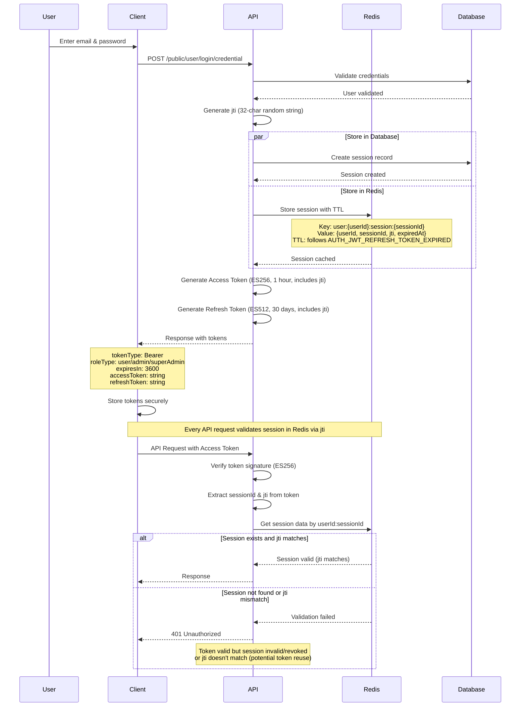
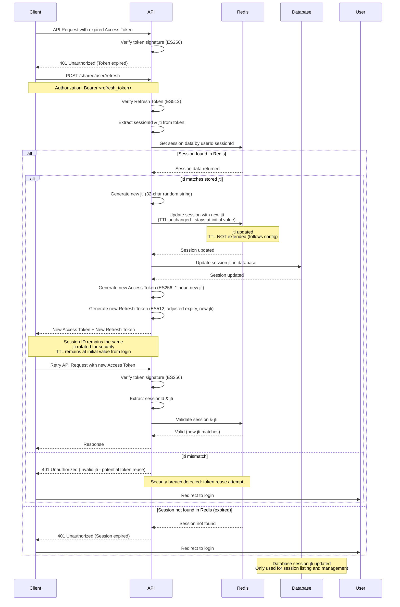
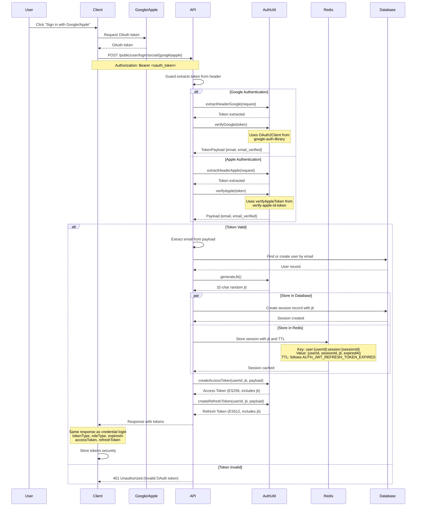
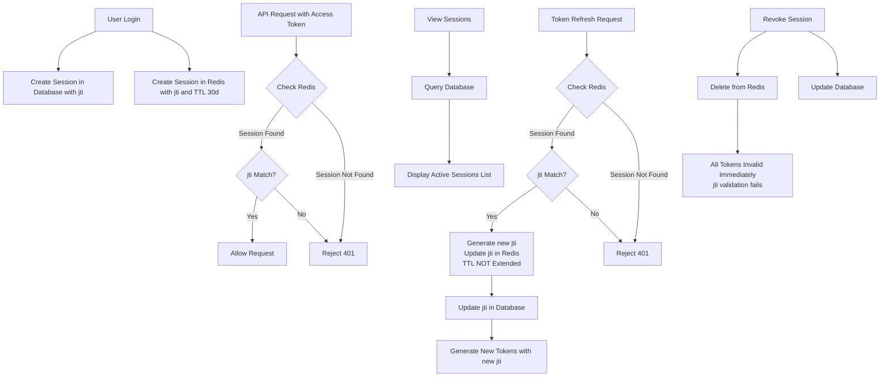
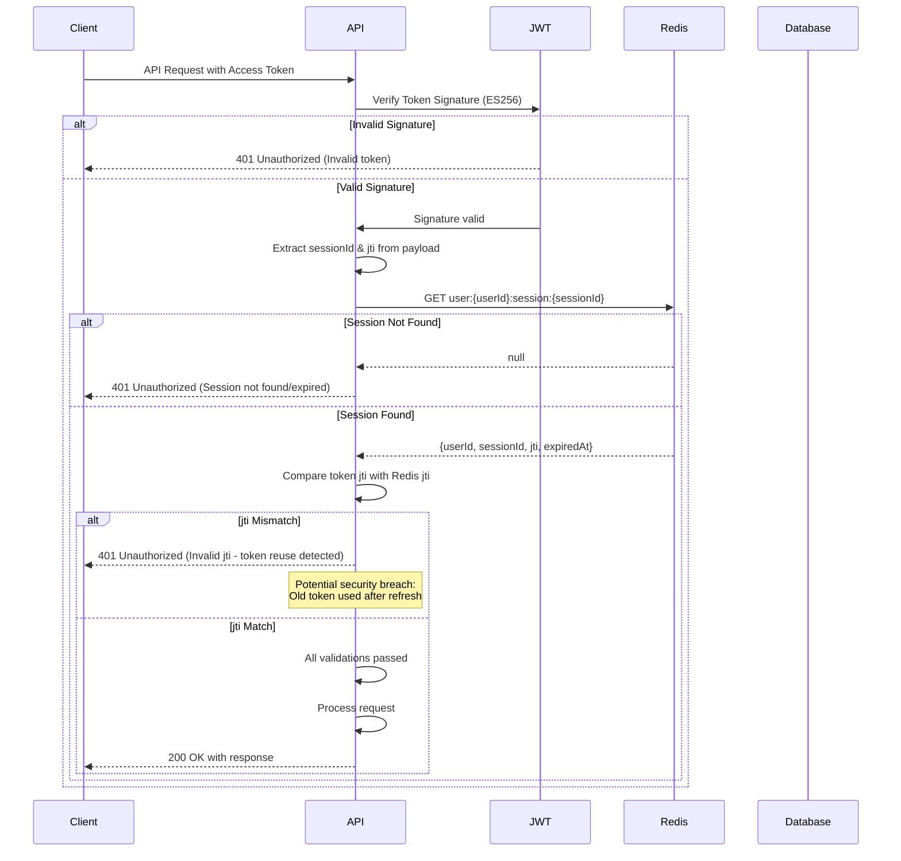

# Authentication Documentation

This documentation explains the features and usage of:
- **Authentication Module**: Located at `src/modules/auth`
- **Session Module**: Located at `src/modules/session`
- **ApiKey Module**: Located at `src/modules/api-key`

## Overview

This document provides a comprehensive overview of authentication and session management in the ACK NestJS Boilerplate. 

It covers:
- **Password**: Passwords are securely hashed (bcrypt), have configurable expiration and rotation, login attempt limits, history tracking, and support for reset/change/temporary password with session invalidation.
- **JWT Authentication**: Stateless authentication using access and refresh tokens with ES256/ES512 algorithms, configurable expiration, and security mechanisms such as JWT ID (jti) validation for session tracking.
- **Session Management**: Dual storage strategy using Redis for high-performance validation and automatic expiration, and database for session listing, management, and audit trail. Sessions are validated on every API request via jti matching and can be revoked instantly.
- **Social Authentication**: Integration with Google OAuth 2.0 and Apple Sign In, allowing users to authenticate using third-party providers. The backend validates OAuth tokens and manages sessions similarly to credential-based authentication.
- **API Key Authentication**: Stateless authentication for machine-to-machine and system integrations, supporting both default and system API keys with caching for performance.

Configuration for tokens, sessions, password, social providers, and API keys is managed in `src/configs/auth.config.ts`.

## Related Documents

- [Cache Documentation][ref-doc-cache] - For understanding session storage and caching mechanisms
- [Configuration Documentation][ref-doc-configuration] - For auth configuration details
- [Environment Documentation][ref-doc-environment] - For JWT and OAuth environment variables

## Table of Contents

- [Overview](#overview)
- [Related Documents](#related-documents)
- [Password](#password)
    - [Password Configuration](#password-configuration)
    - [Password Flow](#password-flow)
- [JWT Authentication](#jwt-authentication)
    - [JWT Configuration](#jwt-configuration)
    - [JWT Flow](#jwt-flow)
        - [JWT Access Token Flow](#jwt-access-token-flow)
        - [JWT Refresh Token Flow](#jwt-refresh-token-flow)
    - [JWT Tokens](#jwt-tokens)
        - [JWT Access Token](#jwt-access-token)
        - [JWT Refresh Token](#jwt-refresh-token)
    - [JWT Payload Structure](#jwt-payload-structure)
        - [JWT Access Token Payload](#jwt-access-token-payload)
        - [JWT Refresh Token Payload](#jwt-refresh-token-payload)
    - [Usage](#usage)
        - [Protecting Endpoints](#protecting-endpoints)
        - [Getting JWT Payload](#getting-jwt-payload)
        - [Getting Raw Token](#getting-raw-token)
    - [Security: JWT ID (jti)](#security-jwt-id-jti)
        - [How it Works](#how-it-works)
- [Social Authentication](#social-authentication)
    - [Social Authentication Flow](#social-authentication-flow)
    - [Google Authentication](#google-authentication)
        - [Configuration](#configuration)
        - [Setup Google OAuth 2.0](#setup-google-oauth-20)
        - [Usage](#usage-1)
    - [Apple Authentication](#apple-authentication)
        - [Configuration](#configuration-1)
        - [Setup Apple Sign In](#setup-apple-sign-in)
        - [Usage](#usage-2)
- [API Key Authentication](#api-key-authentication)
    - [Configuration](#configuration-2)
    - [API Key Types](#api-key-types)
        - [Default API Key](#default-api-key)
        - [System API Key](#system-api-key)
    - [Request Format](#request-format)
    - [Usage](#usage-3)
        - [Protecting Endpoints](#protecting-endpoints-1)
        - [Getting API Key Payload](#getting-api-key-payload)
    - [API Key Authentication Flow](#api-key-authentication-flow)
- [Session Management](#session-management)
    - [Session Storage](#session-storage)
        - [Redis (Primary - Validation)](#redis-primary---validation)
        - [Database (Secondary - Management)](#database-secondary---management)
        - [How They Work Together](#how-they-work-together)
    - [Session API](#session-api)
        - [List User Sessions](#list-user-sessions)
        - [Revoke Session](#revoke-session)
        - [What Happens on Revocation](#what-happens-on-revocation)
    - [Session Lifecycle](#session-lifecycle)
    - [Session Validation Flow](#session-validation-flow)

## Password

Secures passwords with bcrypt hashing, enforces expiration and rotation, tracks history, limits login attempts, and supports reset, change, and temporary password creation with session invalidation.

### Password Configuration

All password settings are configured in `src/configs/auth.config.ts`:

```typescript
export default registerAs(
    'auth',
    (): IConfigAuth => ({
        password: {
            // Enable/disable login attempt limiting feature
            attempt: true,
            
            // Maximum number of failed login attempts before user is inactivated
            maxAttempt: 5,
            
            // Length of salt used in bcrypt password hashing
            saltLength: 8,
            
            // Password expiration time in seconds (182 days = 15724800 seconds)
            expiredInSeconds: 15724800,
            
            // Temporary password expiration time in seconds (3 days = 259200 seconds)
            expiredTemporaryInSeconds: 259200,
            
            // Password rotation period in seconds (90 days = 7776000 seconds)
            // Users are prompted to change password after this period
            periodInSeconds: 7776000,
        },
    })
);
```

### Password Flow


## JWT Authentication

JWT (JSON Web Token) is an open standard ([RFC 7519][ref-jwt]) that defines a compact and self-contained way for securely transmitting information between parties as a JSON object. This information can be verified and trusted because it is digitally signed.

JWTs can be signed using a secret (with the HMAC algorithm) or a public/private key pair using RSA or ECDSA.

For more detailed information about JWT, please visit the official [JWT website][ref-jwt].

> **Note**: Before using JWT authentication, you must generate cryptographic key pairs. See the [Installation Documentation - Generate Keys][ref-doc-installation] section for detailed instructions on key generation.

### JWT Configuration

All JWT settings are configured in `src/configs/auth.config.ts`:

```typescript
export default registerAs(
    'auth',
    (): IConfigAuth => ({
        jwt: {
            accessToken: {
                // JWKS URI for token validation (optional, from environment)
                jwksUri: process.env.AUTH_JWT_ACCESS_TOKEN_JWKS_URI,
                
                // Key ID for JWKS (optional, from environment)
                kid: process.env.AUTH_JWT_ACCESS_TOKEN_KID,
                
                // Algorithm for signing and verifying access tokens
                algorithm: 'ES256',  // ECDSA using P-256 and SHA-256
                
                // Private key for signing access tokens (from environment)
                privateKey: process.env.AUTH_JWT_ACCESS_TOKEN_PRIVATE_KEY,
                
                // Public key for verifying access tokens (from environment)
                publicKey: process.env.AUTH_JWT_ACCESS_TOKEN_PUBLIC_KEY,
                
                // Access token expiration time in seconds (1 hour = 3600 seconds)
                expirationTimeInSeconds: 3600,
            },

            refreshToken: {
                // JWKS URI for token validation (optional, from environment)
                jwksUri: process.env.AUTH_JWT_REFRESH_TOKEN_JWKS_URI,
                
                // Key ID for JWKS (optional, from environment)
                kid: process.env.AUTH_JWT_REFRESH_TOKEN_KID,
                
                // Algorithm for signing and verifying refresh tokens
                algorithm: 'ES512',  // ECDSA using P-521 and SHA-512
                
                // Private key for signing refresh tokens (from environment)
                privateKey: process.env.AUTH_JWT_REFRESH_TOKEN_PRIVATE_KEY,
                
                // Public key for verifying refresh tokens (from environment)
                publicKey: process.env.AUTH_JWT_REFRESH_TOKEN_PUBLIC_KEY,
                
                // Refresh token expiration time in seconds (30 days = 2592000 seconds)
                // This value also determines Redis session TTL
                expirationTimeInSeconds: 2592000,
            },

            // JWT audience claim (identifies intended recipients)
            audience: process.env.AUTH_JWT_AUDIENCE,
            
            // JWT issuer claim (identifies who issued the token)
            issuer: process.env.AUTH_JWT_ISSUER,
            
            // HTTP header name for token transmission
            header: 'Authorization',
            
            // Token prefix (e.g., 'Bearer' in 'Bearer <token>')
            prefix: 'Bearer',
        },
    })
);
```

### JWT Flow

#### JWT Access Token Flow

The following diagram illustrates the complete authentication flow from login to token generation:



#### JWT Refresh Token Flow

When the access token expires, the refresh token is used to obtain a new access token. The jti validation ensures additional security by tracking token usage:



### JWT Tokens

#### JWT Access Token

A short-lived token used to authenticate API requests. 

- **Algorithm**: ES256 (ECDSA using P-256 and SHA-256)
- **Validity**: Configured in `auth.config.ts` (default: 1 hour)
- **Config**: `AUTH_JWT_ACCESS_TOKEN_EXPIRED` environment variable
- **Purpose**: Authenticate API requests
- **jti**: Included for session tracking and validation

#### JWT Refresh Token

A long-lived token used to obtain new access tokens without requiring the user to log in again.

- **Algorithm**: ES512 (ECDSA using P-521 and SHA-512)
- **Validity**: Configured in `auth.config.ts` (default: 30 days)
- **Config**: `AUTH_JWT_REFRESH_TOKEN_EXPIRED` environment variable
- **Redis TTL**: Session TTL in Redis follows this expiration time
- **Purpose**: Generate new access tokens without re-authentication
- **jti**: Included for session tracking and validation

### JWT Payload Structure

#### JWT Access Token Payload

Interface `IAuthJwtAccessTokenPayload`

```typescript
{
    loginAt: Date;
    loginFrom: EnumUserLoginFrom;
    loginWith: EnumUserSignUpWith;
    email: string;
    username: string;
    userId: string;
    sessionId: string;
    roleId: string;
    
    // Standard JWT claims
    jti?: string;  // JWT ID - unique token identifier
    iat?: number;  // Issued at
    nbf?: number;  // Not before
    exp?: number;  // Expiration time
    aud?: string;  // Audience
    iss?: string;  // Issuer
    sub?: string;  // Subject
}
```

#### JWT Refresh Token Payload

Interface `IAuthJwtRefreshTokenPayload`

```typescript
{
    loginAt: Date;
    loginFrom: EnumUserLoginFrom;
    loginWith: EnumUserSignUpWith;
    userId: string;
    sessionId: string;
    
    // Standard JWT claims
    jti?: string;  // JWT ID - unique token identifier
    iat?: number;
    nbf?: number;
    exp?: number;
    aud?: string;
    iss?: string;
    sub?: string;
}
```

### Usage

#### Protecting Endpoints

To protect an endpoint with JWT access token validation, use the `@AuthJwtAccessProtected` decorator:

```typescript
@AuthJwtAccessProtected()
@Get('/profile')
async getProfile() {
    // This endpoint requires a valid access token
    // Token signature (ES256) is verified
    // Session existence is validated in Redis
    // jti is validated against cached session
    return { message: 'Profile data' };
}
```

For refresh token endpoints (typically only used in the refresh endpoint itself), use `@AuthJwtRefreshProtected`:

```typescript
@AuthJwtRefreshProtected()
@Post('/refresh')
async refresh() {
    // This endpoint requires a valid refresh token
    // Token signature (ES512) is verified
    // jti is validated against cached session
    return { message: 'Token refreshed' };
}
```

#### Getting JWT Payload

To access the JWT payload in your controller, use the `@AuthJwtPayload()` decorator:

```typescript
@AuthJwtAccessProtected()
@Get('/me')
async getCurrentUser(
    @AuthJwtPayload() payload: IAuthJwtAccessTokenPayload
) {
    // Access user information from token
    return {
        userId: payload.userId,
        email: payload.email,
        username: payload.username,
        sessionId: payload.sessionId,
        roleId: payload.roleId
    };
}
```

You can also extract specific fields:

```typescript
@AuthJwtAccessProtected()
@Get('/user-id')
async getUserId(
    @AuthJwtPayload('userId') userId: string
) {
    return { userId };
}
```

#### Getting Raw Token

To access the raw JWT token string, use the `@AuthJwtToken()` decorator:

```typescript
@AuthJwtAccessProtected()
@Get('/verify')
async verifyToken(
    @AuthJwtToken() token: string
) {
    // Access raw token for additional processing
    return { token };
}
```

### Security: JWT ID (jti)

> The **JWT ID (jti)** is a critical security mechanism for both access and refresh token validation.

A unique identifier (32-character random string) generated during login and token refresh, stored in both the token payload and the session in Redis.

#### How it Works

1. **During Login**
   - API generates a unique jti (32-character random string)
   - jti is stored in Redis session
   - jti is embedded in both access and refresh tokens as a standard JWT claim

2. **During Every API Request (Access Token)**
   - Client sends request with access token
   - API extracts the jti from the access token payload
   - API retrieves session from Redis using userId and sessionId
   - API compares token jti with session jti
   - **If jti matches**: Request is allowed
   - **If jti doesn't match**: Request is rejected (401 Unauthorized - potential token reuse)

3. **During Token Refresh (Refresh Token)**
   - Client sends the refresh token to the API
   - API extracts the jti from the refresh token payload
   - API retrieves session from Redis using userId and sessionId
   - API compares token jti with session jti
   - **If jti matches**: Token refresh proceeds with a new jti
   - **If jti doesn't match**: Request is rejected (401 Unauthorized - potential security breach)

4. **jti Rotation**
   - Each successful token refresh generates a **new jti** (32-character random string)
   - Old jti is invalidated
   - New jti is stored in Redis
   - New jti is stored in database session record
   - New tokens contain the new jti
   - **Important**: Session TTL remains unchanged (stays at initial value from login based on `AUTH_JWT_REFRESH_TOKEN_EXPIRED` config)

5. **Security Benefits**
   - **Token Reuse Detection**: If an old access/refresh token is used after refresh, the jti won't match
   - **Session Tracking**: Each token refresh creates a new jti, allowing precise tracking of token usage
   - **Instant Revocation**: Deleting the session from Redis immediately invalidates all tokens with that sessionId
   - **Replay Attack Prevention**: Old tokens cannot be reused even if intercepted

## Social Authentication

Social authentication allows users to sign in using their Google or Apple accounts. The backend validates the OAuth tokens provided by the client and extracts user information to create a session, similar to credential-based authentication.

**Supported Providers:**
- Google OAuth 2.0
- Apple Sign In

### Social Authentication Flow

The following diagram illustrates the social authentication flow:



### Google Authentication

#### Configuration

Google authentication is configured in `auth.config.ts`:

```typescript
export default registerAs(
    'auth',
    (): IConfigAuth => ({
        google: {
            header: 'Authorization',
            prefix: 'Bearer',
            clientId: process.env.AUTH_SOCIAL_GOOGLE_CLIENT_ID,
            clientSecret: process.env.AUTH_SOCIAL_GOOGLE_CLIENT_SECRET,
        }
    })
);
```

**Environment Variables:**
- `AUTH_SOCIAL_GOOGLE_CLIENT_ID`: Google OAuth 2.0 client ID
- `AUTH_SOCIAL_GOOGLE_CLIENT_SECRET`: Google OAuth 2.0 client secret

#### Setup Google OAuth 2.0

To obtain Google OAuth credentials:

1. Go to [Google Cloud Console][ref-google-console]
2. Create a new project or select existing project
3. Enable Google+ API
4. Create OAuth 2.0 credentials (Web application)
5. Configure authorized redirect URIs
6. Copy Client ID and Client Secret to your `.env` file

**For detailed setup instructions**, visit [Google OAuth 2.0 Documentation][ref-google-client-secret]

#### Usage

**Protecting the Endpoint:**

```typescript
@AuthSocialGoogleProtected()
@Post('/login/social/google')
async loginGoogle(@AuthJwtPayload() payload: IAuthSocialPayload) {
    const { email, emailVerified } = payload;
    
    // Find or create user
    // Generate session with jti
    // Return JWT tokens (both include jti)
}
```

### Apple Authentication

#### Configuration

Apple authentication is configured in `auth.config.ts`:

```typescript
export default registerAs(
    'auth',
    (): IConfigAuth => ({
        apple: {
            header: 'Authorization',
            prefix: 'Bearer',
            clientId: process.env.AUTH_SOCIAL_APPLE_CLIENT_ID,
            signInClientId: process.env.AUTH_SOCIAL_APPLE_SIGN_IN_CLIENT_ID,
        }
    })
);
```

**Environment Variables:**
- `AUTH_SOCIAL_APPLE_CLIENT_ID`: Apple service ID
- `AUTH_SOCIAL_APPLE_SIGN_IN_CLIENT_ID`: Apple sign-in client ID

#### Setup Apple Sign In

To obtain Apple credentials:

1. Go to [Apple Developer Portal](https://developer.apple.com/)
2. Create an App ID with Sign in with Apple capability
3. Create a Services ID for web authentication
4. Configure return URLs
5. Download and configure private key
6. Copy Service ID (Client ID) to your `.env` file

**For detailed setup instructions**, visit [Apple Sign In Documentation](https://developer.apple.com/sign-in-with-apple/get-started/)

#### Usage

**Protecting the Endpoint:**

```typescript
@AuthSocialAppleProtected()
@Post('/login/social/apple')
async loginApple(@AuthJwtPayload() payload: IAuthSocialPayload) {
    const { email, emailVerified } = payload;
    
    // Find or create user
    // Generate session with jti
    // Return JWT tokens (both include jti)
}
```

## API Key Authentication

API Key authentication provides a simple, stateless authentication mechanism for machine-to-machine communication and system integrations. Unlike JWT tokens, API keys don't require session management and are validated directly against the database/cache.

**Use Cases:**
- External system integrations
- Webhook endpoints
- System-to-system communication
- Background jobs and scheduled tasks
- Third-party API access

### Configuration

API Key authentication is configured in `auth.config.ts`:

```typescript
export default registerAs(
    'auth',
    (): IConfigAuth => ({
        xApiKey: {
            header: 'x-api-key',
            cachePrefixKey: 'ApiKey',
        },
    })
);
```

**Configuration Options:**
- `header`: Header name for API key (`x-api-key`)
- `cachePrefixKey`: Redis cache prefix for API key caching

### API Key Types

#### Default API Key

Default API keys are used for standard external integrations and third-party access.

**Characteristics:**
- Type: `EnumApiKeyType.default`
- Purpose: General-purpose API access
- Use Case: External clients, third-party integrations
- Validation: Requires valid `key:secret` combination
- Cache: Cached in Redis for performance

**Guard Decorator:**
```typescript
@ApiKeyProtected()
```

**Example Usage:**
```typescript
@ApiKeyProtected()
@Get('/api/external/data')
async getExternalData(@ApiKeyPayload() apiKey: ApiKey) {
    return { data: 'accessible with default API key' };
}
```

#### System API Key

System API keys are used for internal system operations that bypass standard authentication.

**Characteristics:**
- Type: `EnumApiKeyType.system`
- Purpose: System-level operations
- Use Case: Internal services, background jobs, system maintenance
- Validation: Requires valid `key:secret` combination
- Cache: Cached in Redis for performance

**Guard Decorator:**
```typescript
@ApiKeySystemProtected()
```

**Example Usage:**
```typescript
@ApiKeySystemProtected()
@Post('/api/system/maintenance')
async runMaintenance(@ApiKeyPayload() apiKey: ApiKey) {
    // System-level endpoint
    // No user authentication required
    return { status: 'maintenance completed' };
}
```

### Request Format

API keys are sent via the `x-api-key` header with the format `${key}:${secret}`:

**Header Format:**
```
x-api-key: ${key}:${secret}
```

**Format Rules:**
- Pattern: `key:secret`
- Separator: Colon (`:`)
- Both key and secret are required
- No spaces allowed
- Case-sensitive

### Usage

#### Protecting Endpoints

**Default API Key Protection:**

```typescript
@ApiKeyProtected()
@Get('/external/data')
async getExternalData(@ApiKeyPayload() apiKey: ApiKey) {
    // Endpoint requires default API key
    // apiKey contains full API key schema from database
    return {
        message: 'Data accessed with default API key',
        apiKeyId: apiKey.id,
        apiKeyName: apiKey.name
    };
}
```

**System API Key Protection:**

```typescript
@ApiKeySystemProtected()
@Post('/system/maintenance')
async runMaintenance(@ApiKeyPayload() apiKey: ApiKey) {
    // Endpoint requires system API key
    // Bypasses user authentication
    // Used for system-level operations
    return {
        message: 'Maintenance task executed',
        executedBy: apiKey.name
    };
}
```

#### Getting API Key Payload

Access the full API key data using `@ApiKeyPayload()` decorator:

**Full Payload:**
```typescript
@ApiKeyProtected()
@Get('/resource')
async getResource(@ApiKeyPayload() apiKey: ApiKey) {
    // Access full API key object
    return {
        keyId: apiKey.id,
        keyName: apiKey.name,
        keyType: apiKey.type,
        isActive: apiKey.isActive
    };
}
```

**Specific Fields:**
```typescript
@ApiKeyProtected()
@Get('/resource')
async getResource(
    @ApiKeyPayload('name') apiKeyName: string,
    @ApiKeyPayload('type') apiKeyType: EnumApiKeyType
) {
    // Extract specific fields only
    return {
        accessedBy: apiKeyName,
        keyType: apiKeyType
    };
}
```

### API Key Authentication Flow


## Session Management

Session management handles user authentication sessions across multiple devices and locations. It provides visibility and control over active sessions, allowing users and administrators to monitor and revoke access as needed.

This implementation uses a **dual storage strategy**:
- **Redis**: High-performance session validation and automatic expiration
- **Database**: Session listing, management, and audit trail

### Session Storage

#### Redis (Primary - Validation)

Used for high-speed session validation for **both access and refresh tokens**.

**Critical Behavior**: Every API call with an access token will check Redis. If the session is not found in Redis or the jti doesn't match, the request is rejected immediately, even if the token signature is valid.

**Data Stored:**
```typescript
{
    sessionId: string;
    userId: string;
    jti: string;  // JWT ID for token validation
    expiredAt: Date;
}
```

**Redis Key Pattern:**
```
user:{userId}:session:{sessionId}
```

**TTL Behavior:**
- Initial TTL: Follows refresh token expiration from `auth.config.ts` (default: 30 days)
- TTL Source: `AUTH_JWT_REFRESH_TOKEN_EXPIRED` environment variable
- TTL Behavior: **NOT extended** on token refresh - remains at initial value from login
- Auto Cleanup: Expired sessions are automatically removed by Redis when TTL expires

**Example:**
- If `AUTH_JWT_REFRESH_TOKEN_EXPIRED=30d`, Redis TTL = 30 days
- If `AUTH_JWT_REFRESH_TOKEN_EXPIRED=7d`, Redis TTL = 7 days
- Token refresh updates jti but does NOT reset the TTL

#### Database (Secondary - Management)

Used for session listing and management purposes.

**When Updated:**
- Created during login with initial jti
- Updated when session jti is rotated during token refresh
- Updated when session is revoked
- Can be queried to show user's active sessions across devices

**Not Used For:**
- Token validation (Redis handles this via jti matching)
- Real-time validation during API requests

#### How They Work Together



#### What Happens on Revocation

When a session is revoked:

1. **Redis**: Session is deleted immediately
2. **Database**: Session record is updated (marked as revoked)
3. **Access Tokens**: All access tokens for this session become invalid immediately (jti validation fails)
4. **Refresh Tokens**: All refresh tokens for this session become invalid immediately (jti validation fails)
5. **Active Requests**: Any subsequent API calls with tokens from this session will be rejected with 401 Unauthorized

### Session Lifecycle

1. **Creation (Login)**
   - User logs in successfully
   - System generates unique sessionId and jti
   - Session stored in both Redis (with TTL) and Database (with jti)
   - Tokens issued containing sessionId and jti

2. **Validation (Every Request)**
   - Access token received
   - Token signature verified (ES256)
   - sessionId and jti extracted from token
   - Redis checked for session existence
   - jti compared between token and Redis session
   - Request allowed only if session exists AND jti matches

3. **Refresh**
   - Refresh token received
   - Token signature verified (ES512)
   - sessionId and jti extracted from token
   - Redis checked for session existence
   - jti compared between token and Redis session
   - If valid: new jti generated, session updated in Redis and Database
   - New tokens issued with new jti
   - Old jti invalidated (old tokens won't work)

4. **Expiration**
   - Redis TTL expires (based on config)
   - Session automatically removed from Redis
   - All tokens become invalid (session not found in Redis)
   - Database record remains for audit trail

5. **Revocation**
   - User or admin revokes session
   - Session deleted from Redis immediately
   - Database record marked as revoked
   - All tokens for this session become invalid immediately

### Session Validation Flow



## Contribution

Special thanks to [Gzerox][ref-contributor-gzerox] for providing the idea and contribution for Refresh Token Rotation and JWT ID (jti) validation mechanism.

<!-- REFERENCES -->

<!-- BADGE LINKS -->

[ack-contributors-shield]: https://img.shields.io/github/contributors/andrechristikan/ack-nestjs-boilerplate?style=for-the-badge
[ack-forks-shield]: https://img.shields.io/github/forks/andrechristikan/ack-nestjs-boilerplate?style=for-the-badge
[ack-stars-shield]: https://img.shields.io/github/stars/andrechristikan/ack-nestjs-boilerplate?style=for-the-badge
[ack-issues-shield]: https://img.shields.io/github/issues/andrechristikan/ack-nestjs-boilerplate?style=for-the-badge
[ack-license-shield]: https://img.shields.io/github/license/andrechristikan/ack-nestjs-boilerplate?style=for-the-badge
[nestjs-shield]: https://img.shields.io/badge/nestjs-%23E0234E.svg?style=for-the-badge&logo=nestjs&logoColor=white
[nodejs-shield]: https://img.shields.io/badge/Node.js-339933?style=for-the-badge&logo=nodedotjs&logoColor=white
[typescript-shield]: https://img.shields.io/badge/TypeScript-007ACC?style=for-the-badge&logo=typescript&logoColor=white
[mongodb-shield]: https://img.shields.io/badge/MongoDB-white?style=for-the-badge&logo=mongodb&logoColor=4EA94B
[jwt-shield]: https://img.shields.io/badge/JWT-000000?style=for-the-badge&logo=JSON%20web%20tokens&logoColor=white
[jest-shield]: https://img.shields.io/badge/-jest-%23C21325?style=for-the-badge&logo=jest&logoColor=white
[pnpm-shield]: https://img.shields.io/badge/pnpm-%232C8EBB.svg?style=for-the-badge&logo=pnpm&logoColor=white&color=F9AD00
[docker-shield]: https://img.shields.io/badge/docker-%230db7ed.svg?style=for-the-badge&logo=docker&logoColor=white
[github-shield]: https://img.shields.io/badge/GitHub-100000?style=for-the-badge&logo=github&logoColor=white
[linkedin-shield]: https://img.shields.io/badge/LinkedIn-0077B5?style=for-the-badge&logo=linkedin&logoColor=white

<!-- CONTACTS -->

[ref-author-linkedin]: https://linkedin.com/in/andrechristikan
[ref-author-email]: mailto:andrechristikan@gmail.com
[ref-author-github]: https://github.com/andrechristikan
[ref-author-paypal]: https://www.paypal.me/andrechristikan
[ref-author-kofi]: https://ko-fi.com/andrechristikan

<!-- Repo LINKS -->

[ref-ack]: https://github.com/andrechristikan/ack-nestjs-boilerplate
[ref-ack-issues]: https://github.com/andrechristikan/ack-nestjs-boilerplate/issues
[ref-ack-stars]: https://github.com/andrechristikan/ack-nestjs-boilerplate/stargazers
[ref-ack-forks]: https://github.com/andrechristikan/ack-nestjs-boilerplate/network/members
[ref-ack-contributors]: https://github.com/andrechristikan/ack-nestjs-boilerplate/graphs/contributors
[ref-ack-license]: LICENSE.md

<!-- THIRD PARTY -->

[ref-nestjs]: http://nestjs.com
[ref-nestjs-swagger]: https://docs.nestjs.com/openapi/introduction
[ref-nestjs-swagger-types]: https://docs.nestjs.com/openapi/types-and-parameters
[ref-prisma]: https://www.prisma.io
[ref-mongodb]: https://docs.mongodb.com/
[ref-redis]: https://redis.io
[ref-bullmq]: https://bullmq.io
[ref-nodejs]: https://nodejs.org/
[ref-typescript]: https://www.typescriptlang.org/
[ref-docker]: https://docs.docker.com
[ref-dockercompose]: https://docs.docker.com/compose/
[ref-pnpm]: https://pnpm.io
[ref-12factor]: https://12factor.net
[ref-commander]: https://nest-commander.jaymcdoniel.dev
[ref-package-json]: package.json
[ref-jwt]: https://jwt.io
[ref-jest]: https://jestjs.io/docs/getting-started
[ref-git]: https://git-scm.com
[ref-google-console]: https://console.cloud.google.com/
[ref-google-client-secret]: https://developers.google.com/identity/protocols/oauth2

<!-- DOCUMENTS -->

[ref-doc-root]: ../readme.md
[ref-doc-activity-log]: activity-log.md
[ref-doc-authentication]: authentication.md
[ref-doc-authorization]: authorization.md
[ref-doc-cache]: cache.md
[ref-doc-configuration]: configuration.md
[ref-doc-database]: database.md
[ref-doc-environment]: environment.md
[ref-doc-feature-flag]: feature-flag.md
[ref-doc-file-upload]: file-upload.md
[ref-doc-handling-error]: handling-error.md
[ref-doc-installation]: installation.md
[ref-doc-logger]: logger.md
[ref-doc-message]: message.md
[ref-doc-pagination]: pagination.md
[ref-doc-project-structure]: project-structure.md
[ref-doc-queue]: queue.md
[ref-doc-request-validation]: request-validation.md
[ref-doc-response]: response.md
[ref-doc-security-and-middleware]: security-and-middleware.md
[ref-doc-doc]: doc.md
[ref-doc-third-party-integration]: third-party-integration.md
[ref-doc-presign]: presign.md
[ref-doc-term-policy]: term-policy.md

<!-- CONTRIBUTOR -->

[ref-contributor-gzerox]: https://github.com/Gzerox