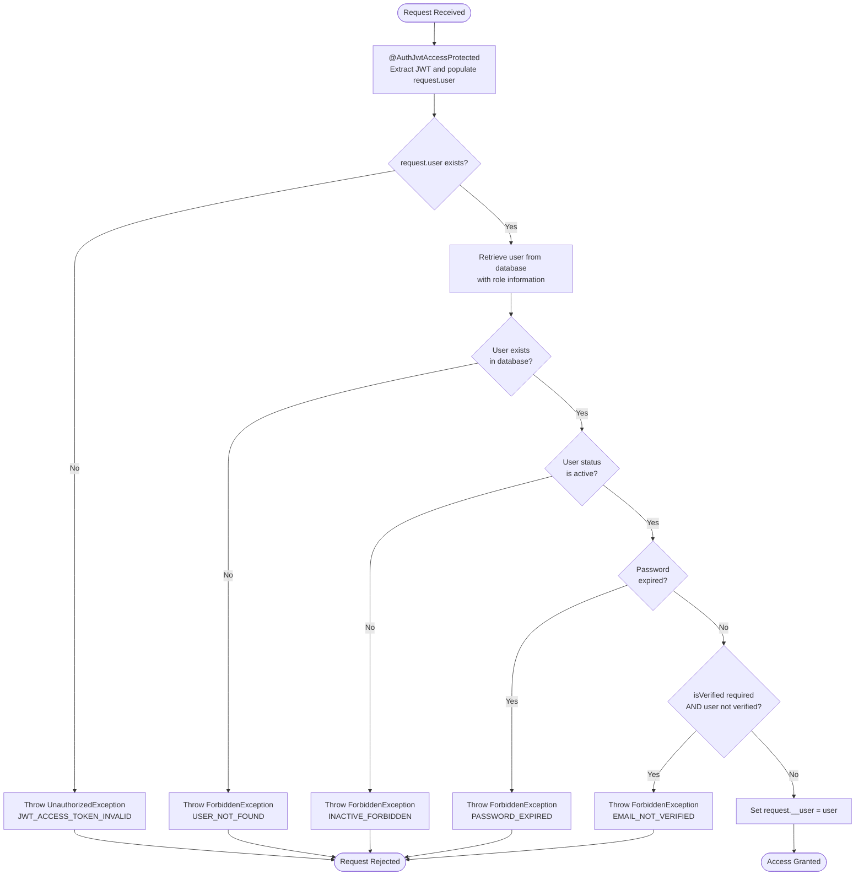
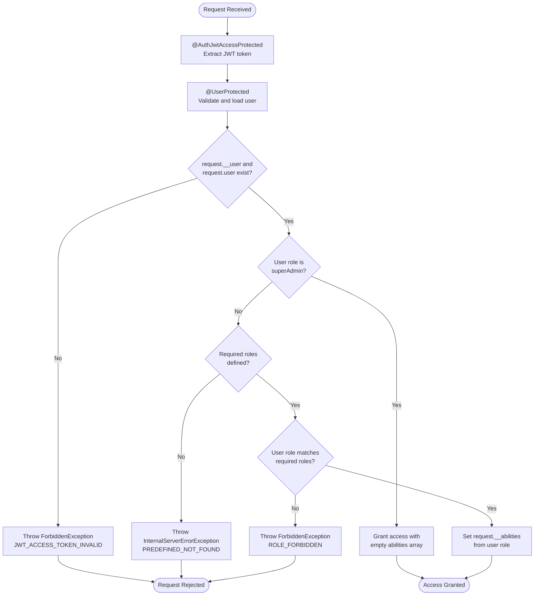
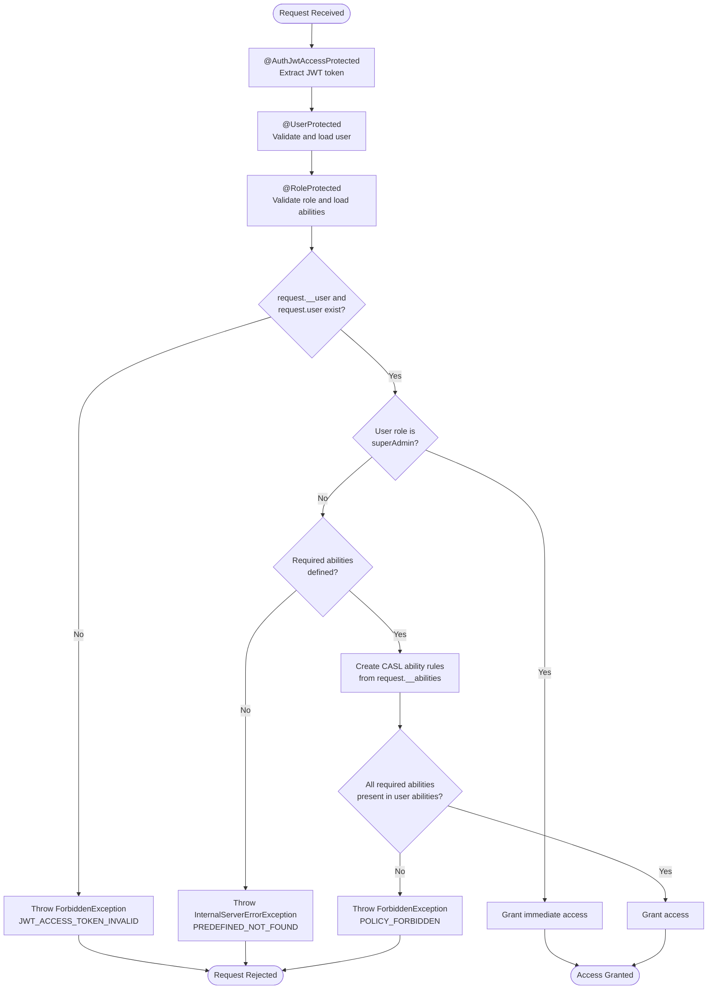
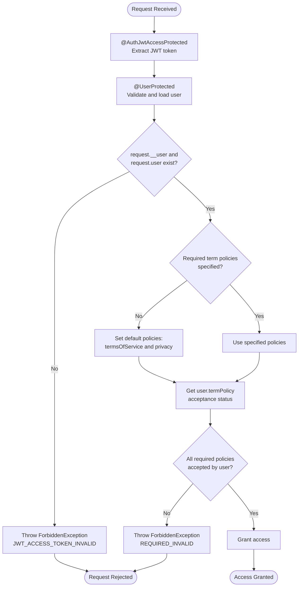
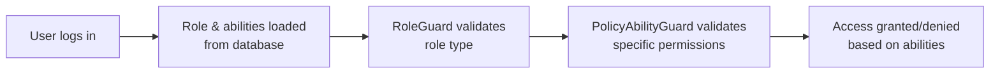

# Authorization Documentation

This documentation explains the features and usage of: 
- **UserProtected**: Located at `src/modules/user/decorators`
- **RoleProtected**: Located at `src/modules/role/decorators`
- **PolicyAbilityProtected**: Located at `src/modules/policy/decorators`
- **TermPolicyAcceptanceProtected**: Located at `src/modules/term-policy/decorators`

## Overview

This authorization system provides a comprehensive, layered security approach for ACK NestJs Boilerplate. It implements multiple protection levels including user authentication, role-based access control, policy-based permissions, and terms acceptance verification.

The system is built using NestJS guards and decorators, making it easy to apply different authorization levels to your route handlers with simple, declarative syntax.

## Related Documents

- [Configuration Documentation][ref-doc-configuration] - For Redis configuration settings
- [Environment Documentation][ref-doc-environment] - For Redis environment variables
- [Authentication Documentation][ref-doc-authentication] - For understand authentication system
- [Activity Log Documentation][ref-doc-activity-log] - For tracking authorization-related user activities
- [Term Policy Document][ref-doc-term-policy] - For managing user acceptance of terms and policies 

## Table of Contents

- [Overview](#overview)
- [Related Documents](#related-documents)
- [User Protected](#user-protected)
  - [Decorators](#decorators)
    - [UserProtected() Decorator](#userprotected-decorator)
    - [UserCurrent() Parameter Decorator](#usercurrent-parameter-decorator)
  - [Guards](#guards)
    - [UserGuard](#userguard)
  - [Important Notes](#important-notes)
- [Role Protected](#role-protected)
  - [Decorators](#decorators-1)
    - [RoleProtected() Decorator](#roleprotected-decorator)
  - [Getting Current Role](#getting-current-role)
  - [Guards](#guards-1)
    - [RoleGuard](#roleguard)
  - [Important Notes](#important-notes-1)
- [Policy Ability Protected](#policy-ability-protected)
  - [Decorators](#decorators-2)
    - [PolicyAbilityProtected() Decorator](#policyabilityprotected-decorator)
  - [Guards](#guards-2)
    - [PolicyAbilityGuard](#policyabilityguard)
  - [CASL Integration](#casl-integration)
  - [Important Notes](#important-notes-2)
- [Term Policy Acceptance Protected](#term-policy-acceptance-protected)
  - [Decorators](#decorators-3)
    - [TermPolicyAcceptanceProtected() Decorator](#termpolicyacceptanceprotected-decorator)
  - [Guards](#guards-3)
    - [TermPolicyGuard](#termpolicyguard)
  - [Important Notes](#important-notes-3)
- [Creating Custom Roles](#creating-custom-roles)
  - [Overview](#overview-1)
  - [How to Create a New Role](#how-to-create-a-new-role)
  - [Role Configuration](#role-configuration)
  - [Assigning Roles to Users](#assigning-roles-to-users)
  - [Important Notes](#important-notes-4)

## User Protected

`UserProtected` provides basic user authentication and verification. It ensures that only authenticated users can access protected routes and optionally validates whether the user's email has been verified.

### Decorators

#### UserProtected Decorator

**Method decorator** that applies `UserGuard` to route handlers.

**Parameters:**
- `isVerified` (boolean, optional): Whether to require email verification. Default: `true`

**Usage:**

```typescript
@UserProtected()
@AuthJwtAccessProtected()
@Get('profile')
getProfile(@UserCurrent() user: IUser) {
  return user;
}

// Allow unverified users
@UserProtected(false)
@AuthJwtAccessProtected()
@Get('dashboard')
getDashboard(@UserCurrent() user: IUser) {
  return { user };
}
```

#### UserCurrent Parameter Decorator

Extracts the authenticated user object from the request context.

**Returns:** `IUser | undefined`

**Usage:**

```typescript
@UserProtected()
@AuthJwtAccessProtected()
@Get('me')
getCurrentUser(@UserCurrent() user: IUser) {
  return {
    id: user.id,
    email: user.email,
    role: user.role
  };
}
```

### Guards

#### `UserGuard`

The guard implementation that performs the actual validation.

The `UserProtected` decorator follows this validation sequence:

1. **Authentication Check**: Verifies that `request.user` exists (populated by JWT strategy)
2. **User Lookup**: Retrieves user from database with role information
3. **User Existence**: Ensures user record exists
4. **Status Validation**: Confirms user status is `active`
5. **Password Expiry**: Checks if password has expired
6. **Email Verification**: Validates email verification if required

**Flow Diagram:**



### Important Notes

- `@UserProtected()` **requires** `@AuthJwtAccessProtected()` to be applied first (above in code)
- `@AuthJwtAccessProtected()` populates `request.user` from JWT token. See [Authentication Documentation][ref-doc-authentication] for details
- This decorator populates `request.__user` which is required by downstream guards

## Role Protected

`RoleProtected` implements role-based access control (RBAC) to restrict route access based on user roles. It ensures that only users with specific role types can access protected endpoints.

### Decorators

#### RoleProtected Decorator

**Method decorator** that applies `RoleGuard` to route handlers.

**Parameters:**
- `...requiredRoles` (EnumRoleType[]): One or more role types required to access the route

**Available Role Types:**
- `EnumRoleType.superAdmin` - Super administrator with unrestricted access
- `EnumRoleType.admin` - Administrator role
- `EnumRoleType.user` - Standard user role

**Usage:**

```typescript
// Single role requirement
@RoleProtected(EnumRoleType.admin)
@UserProtected()
@AuthJwtAccessProtected()
@Get('admin/dashboard')
getAdminDashboard(@UserCurrent() user: IUser) {
  return this.dashboardService.getAdminData();
}

// Multiple role requirements (user must have one of the specified roles)
@RoleProtected(EnumRoleType.admin, EnumRoleType.superAdmin)
@UserProtected()
@AuthJwtAccessProtected()
@Delete('users/:id')
deleteUser(@Param('id') id: string) {
  return this.userService.delete(id);
}
```

### Getting Current Role

To access the current user's role, use the `@UserCurrent()` decorator and access the `role` property:

```typescript
@RoleProtected(EnumRoleType.admin)
@UserProtected()
@AuthJwtAccessProtected()
@Get('role-info')
getRoleInfo(@UserCurrent() user: IUser) {
  return {
    roleType: user.role.type,
    roleName: user.role.name,
    abilities: user.role.abilities
  };
}
```

### Guards

#### `RoleGuard`

The guard implementation that validates user roles and populates role abilities.

The `RoleProtected` decorator follows this validation sequence:

1. **User Validation**: Verifies that `request.__user` and `request.user` exist
2. **Super Admin Bypass**: If user role is `superAdmin`, grants immediate access with empty abilities array
3. **Required Roles Check**: Validates that required roles are defined
4. **Role Match**: Confirms user's role type matches one of the required roles
5. **Abilities Population**: Attaches role abilities to `request.__abilities` for downstream use

**Flow Diagram:**



### Important Notes

- `@RoleProtected()` **requires** `@AuthJwtAccessProtected()` and `@UserProtected()` to be applied
- `@AuthJwtAccessProtected()` must be placed at the bottom, followed by `@RoleProtected()`, then `@UserProtected()`. See [Authentication Documentation][ref-doc-authentication] for `@AuthJwtAccessProtected()` details
- This decorator populates `request.__abilities` which is required by policy guards
- Incorrect ordering will result in runtime errors
- Users with `superAdmin` role type have unrestricted access to all `@RoleProtected` routes, regardless of the specified required roles. The guard returns an empty abilities array for super admins, as they bypass ability checks.


## Policy Ability Protected

`PolicyAbilityProtected` implements fine-grained, permission-based access control using CASL (an isomorphic authorization library). It allows you to define specific actions (read, create, update, delete, manage) that users can perform on specific subjects (resources like users, roles, settings, etc.).

### Decorators

#### PolicyAbilityProtected Decorator

**Method decorator** that applies `PolicyAbilityGuard` to route handlers.

**Parameters:**
- `...requiredAbilities` (RoleAbilityRequestDto[]): One or more policy ability objects defining required permissions

**Available Policy Actions:**
- `EnumPolicyAction.manage` - Full control over a subject
- `EnumPolicyAction.read` - Read/view permission
- `EnumPolicyAction.create` - Create new resources
- `EnumPolicyAction.update` - Modify existing resources
- `EnumPolicyAction.delete` - Remove resources

**Available Policy Subjects:**
- `EnumPolicySubject.all` - All resources
- `EnumPolicySubject.apiKey` - API key management
- `EnumPolicySubject.role` - Role management
- `EnumPolicySubject.user` - User management
- `EnumPolicySubject.session` - Session management
- `EnumPolicySubject.activityLog` - Activity logs
- `EnumPolicySubject.passwordHistory` - Password history
- `EnumPolicySubject.termPolicy` - Terms and policies
- `EnumPolicySubject.futureFlag` - Feature flags

**Usage:**

```typescript
// Single ability requirement
@PolicyAbilityProtected({
  subject: EnumPolicySubject.user,
  action: [EnumPolicyAction.read]
})
@RoleProtected(EnumRoleType.admin)
@UserProtected()
@AuthJwtAccessProtected()
@Get('users')
getUsers() {
  return this.userService.findAll();
}

// Multiple actions on single subject
@PolicyAbilityProtected({
  subject: EnumPolicySubject.user,
  action: [EnumPolicyAction.update, EnumPolicyAction.delete]
})
@RoleProtected(EnumRoleType.admin)
@UserProtected()
@AuthJwtAccessProtected()
@Put('users/:id')
updateUser(@Param('id') id: string, @Body() dto: UpdateUserDto) {
  return this.userService.update(id, dto);
}

// Multiple ability requirements (different subjects)
@PolicyAbilityProtected(
  {
    subject: EnumPolicySubject.role,
    action: [EnumPolicyAction.read]
  },
  {
    subject: EnumPolicySubject.user,
    action: [EnumPolicyAction.manage]
  }
)
@RoleProtected(EnumRoleType.admin)
@UserProtected()
@AuthJwtAccessProtected()
@Post('users/:id/assign-role')
assignRole(@Param('id') id: string, @Body() dto: AssignRoleDto) {
  return this.userService.assignRole(id, dto.roleId);
}
```

### Guards

#### `PolicyAbilityGuard`

The guard implementation that validates user abilities using CASL library.

The `PolicyAbilityProtected` decorator follows this validation sequence:

1. **User Validation**: Verifies that `request.__user` and `request.user` exist
2. **Super Admin Bypass**: If user role is `superAdmin`, grants immediate access
3. **Required Abilities Check**: Validates that required abilities are defined
4. **Ability Creation**: Creates CASL ability rules from user's role abilities (`request.__abilities`)
5. **Permission Validation**: Checks if user abilities match all required abilities
6. **Access Decision**: Grants or denies access based on permission match

**Flow Diagram:**



### CASL Integration

The system uses [CASL][casl] (Code Access Security Library) to handle complex permission logic:

**PolicyAbilityFactory:**

- `createForUser()`: Builds CASL ability rules from user's assigned abilities
- `handlerAbilities()`: Validates if user has all required abilities using CASL's `can()` method

**How it works:**

The factory creates a CASL ability instance that can check if a user can perform specific actions on specific subjects. Every required ability must be satisfied for access to be granted.

### Important Notes

- `@PolicyAbilityProtected()` **requires** `@AuthJwtAccessProtected()`, `@RoleProtected()`, and `@UserProtected()` to be applied
- Decorators must be stacked in this order from bottom to top: `@PolicyAbilityProtected()` → `@RoleProtected()` → `@UserProtected()` → `@AuthJwtAccessProtected()`. See [Authentication Documentation][ref-doc-authentication] for `@AuthJwtAccessProtected()` details
- Incorrect ordering will result in runtime errors
- Users with `superAdmin` role type have unrestricted access to all `@PolicyAbilityProtected` routes, bypassing all ability checks.
- All actions in a required ability must be present in the user's abilities. For example, if you require `[UPDATE, DELETE]` on `USER` subject, the user must have both actions, not just one.

## Term Policy Acceptance Protected

`TermPolicyAcceptanceProtected` validates that users have accepted required legal terms and policies (such as Terms of Service, Privacy Policy, etc.) before allowing access to protected routes. This ensures legal compliance and user consent management.

For more detailed information about term policies, see [Term Policy Document][ref-doc-term-policy].

### Decorators

#### TermPolicyAcceptanceProtected Decorator

**Method decorator** that applies `TermPolicyGuard` to route handlers.

**Parameters:**
- `...requiredTermPolicies` (EnumTermPolicyType[], optional): One or more term policy types that must be accepted. If not provided, defaults to `termsOfService` and `privacy`

**Available Term Policy Types:**
- `EnumTermPolicyType.termsOfService` - Terms of Service acceptance
- `EnumTermPolicyType.privacy` - Privacy Policy acceptance
- `EnumTermPolicyType.cookies` - Cookies Policy acceptance
- `EnumTermPolicyType.marketing` - Marketing consent acceptance

**Usage:**

```typescript
// Default: requires termsOfService and privacy acceptance
@TermPolicyAcceptanceProtected()
@UserProtected()
@AuthJwtAccessProtected()
@Get('premium-features')
getPremiumFeatures() {
  return this.featureService.getPremiumFeatures();
}

// Single term policy requirement
@TermPolicyAcceptanceProtected(EnumTermPolicyType.marketing)
@UserProtected()
@AuthJwtAccessProtected()
@Post('subscribe-newsletter')
subscribeNewsletter(@Body() dto: SubscribeDto) {
  return this.newsletterService.subscribe(dto);
}

// Multiple term policy requirements
@TermPolicyAcceptanceProtected(
  EnumTermPolicyType.termsOfService,
  EnumTermPolicyType.privacy,
  EnumTermPolicyType.cookies
)
@UserProtected()
@AuthJwtAccessProtected()
@Post('data-processing')
processUserData(@Body() dto: ProcessDataDto) {
  return this.dataService.process(dto);
}
```

### Guards

#### `TermPolicyGuard`

The guard implementation that validates user term policy acceptance.

The `TermPolicyAcceptanceProtected` decorator follows this validation sequence:

1. **User Validation**: Verifies that `request.__user` and `request.user` exist
2. **Default Policy Check**: If no required policies specified, sets defaults to `termsOfService` and `privacy`
3. **Term Policy Lookup**: Retrieves user's term policy acceptance status from `__user.termPolicy`
4. **Acceptance Validation**: Checks if all required term policies are accepted
5. **Access Decision**: Grants access only if all required policies are accepted

**Flow Diagram:**



### Important Notes

- `@TermPolicyAcceptanceProtected()` **requires** `@UserProtected()` and `@AuthJwtAccessProtected()` to be applied
- Decorator order from top to bottom: `@TermPolicyAcceptanceProtected()` → `@UserProtected()` → `@AuthJwtAccessProtected()`
- For more details about `@AuthJwtAccessProtected()`, see [Authentication Documentation][ref-doc-authentication]
- Without the required decorators, the endpoint will throw a 403 Forbidden error
- If no term policies are specified, it defaults to requiring `termsOfService` and `privacy` acceptance
- All specified term policies must be accepted by the user for access to be granted
- Incorrect decorator ordering will result in runtime errors

## Creating Custom Roles

The boilerplate supports creating custom roles through the role management API. Each role can have a unique combination of permissions (abilities) that define what actions users with that role can perform on different resources.

This feature allows you to create specialized roles beyond the default `superAdmin`, `admin`, and `user` types - for example, you could create roles like "ContentModerator", "Accountant", "CustomerSupport", etc., each with their own specific set of permissions.

### How to Create a New Role

Custom roles are created through the admin role management endpoints. The API documentation is available in your Swagger docs at `/docs`.

**Basic steps:**

1. Authenticate as an admin user
2. Call the role creation endpoint
3. Provide role details including name, type, description, and abilities
4. The new role is immediately available for assignment to users

**Example role creation request:**

```json
{
  "name": "contentmoderator",
  "description": "Role for moderating user-generated content",
  "type": "admin",
  "abilities": [
    {
      "subject": "user",
      "action": ["read", "update"]
    },
    {
      "subject": "activityLog",
      "action": ["read"]
    }
  ]
}
```

### Role Configuration

**Role Properties:**

- **name**: Unique identifier for the role (alphanumeric, lowercase, 3-30 characters)
- **description**: Optional description explaining the role's purpose (max 500 characters)
- **type**: Role type from `EnumRoleType` (superAdmin, admin, or user)
- **abilities**: Array of permission objects defining what the role can do

**Ability Structure:**

Each ability consists of:
- **subject**: The resource type (e.g., user, role, apiKey, session, termPolicy, activityLog)
- **action**: Array of allowed actions (manage, read, create, update, delete)

**Available subjects and actions are defined in:**
- `EnumPolicySubject`: all, apiKey, role, user, session, activityLog, passwordHistory, termPolicy, futureFlag
- `EnumPolicyAction`: manage, read, create, update, delete

### Assigning Roles to Users

Once a custom role is created, it can be assigned to users through:

1. **User creation**: Specify the `roleId` when creating new users
2. **User update**: Update existing users to assign them the new role

**How it works automatically:**

- When a user is assigned a role, they immediately inherit all abilities defined for that role
- The `RoleGuard` automatically loads the user's role and abilities during authentication
- The `PolicyAbilityGuard` validates permissions based on the role's abilities
- No application restart or additional configuration is needed

**Permission enforcement flow:**



### Important Notes

- **Role names must be unique** - You cannot create two roles with the same name
- **Roles cannot be deleted if in use** - You must first reassign users to different roles before deleting


<!-- REFERENCES -->

<!-- BADGE LINKS -->

[ack-contributors-shield]: https://img.shields.io/github/contributors/andrechristikan/ack-nestjs-boilerplate?style=for-the-badge
[ack-forks-shield]: https://img.shields.io/github/forks/andrechristikan/ack-nestjs-boilerplate?style=for-the-badge
[ack-stars-shield]: https://img.shields.io/github/stars/andrechristikan/ack-nestjs-boilerplate?style=for-the-badge
[ack-issues-shield]: https://img.shields.io/github/issues/andrechristikan/ack-nestjs-boilerplate?style=for-the-badge
[ack-license-shield]: https://img.shields.io/github/license/andrechristikan/ack-nestjs-boilerplate?style=for-the-badge
[nestjs-shield]: https://img.shields.io/badge/nestjs-%23E0234E.svg?style=for-the-badge&logo=nestjs&logoColor=white
[nodejs-shield]: https://img.shields.io/badge/Node.js-339933?style=for-the-badge&logo=nodedotjs&logoColor=white
[typescript-shield]: https://img.shields.io/badge/TypeScript-007ACC?style=for-the-badge&logo=typescript&logoColor=white
[mongodb-shield]: https://img.shields.io/badge/MongoDB-white?style=for-the-badge&logo=mongodb&logoColor=4EA94B
[jwt-shield]: https://img.shields.io/badge/JWT-000000?style=for-the-badge&logo=JSON%20web%20tokens&logoColor=white
[jest-shield]: https://img.shields.io/badge/-jest-%23C21325?style=for-the-badge&logo=jest&logoColor=white
[pnpm-shield]: https://img.shields.io/badge/pnpm-%232C8EBB.svg?style=for-the-badge&logo=pnpm&logoColor=white&color=F9AD00
[docker-shield]: https://img.shields.io/badge/docker-%230db7ed.svg?style=for-the-badge&logo=docker&logoColor=white
[github-shield]: https://img.shields.io/badge/GitHub-100000?style=for-the-badge&logo=github&logoColor=white
[linkedin-shield]: https://img.shields.io/badge/LinkedIn-0077B5?style=for-the-badge&logo=linkedin&logoColor=white

<!-- CONTACTS -->

[ref-author-linkedin]: https://linkedin.com/in/andrechristikan
[ref-author-email]: mailto:andrechristikan@gmail.com
[ref-author-github]: https://github.com/andrechristikan
[ref-author-paypal]: https://www.paypal.me/andrechristikan
[ref-author-kofi]: https://ko-fi.com/andrechristikan

<!-- Repo LINKS -->

[ref-ack]: https://github.com/andrechristikan/ack-nestjs-boilerplate
[ref-ack-issues]: https://github.com/andrechristikan/ack-nestjs-boilerplate/issues
[ref-ack-stars]: https://github.com/andrechristikan/ack-nestjs-boilerplate/stargazers
[ref-ack-forks]: https://github.com/andrechristikan/ack-nestjs-boilerplate/network/members
[ref-ack-contributors]: https://github.com/andrechristikan/ack-nestjs-boilerplate/graphs/contributors
[ref-ack-license]: LICENSE.md

<!-- THIRD PARTY -->

[casl]: https://casl.js.org/
[ref-nestjs-swagger]: https://docs.nestjs.com/openapi/introduction
[ref-nestjs-swagger-types]: https://docs.nestjs.com/openapi/types-and-parameters
[ref-nestjs]: http://nestjs.com
[ref-prisma]: https://www.prisma.io
[ref-mongodb]: https://docs.mongodb.com/
[ref-redis]: https://redis.io
[ref-bullmq]: https://bullmq.io
[ref-nodejs]: https://nodejs.org/
[ref-typescript]: https://www.typescriptlang.org/
[ref-docker]: https://docs.docker.com
[ref-dockercompose]: https://docs.docker.com/compose/
[ref-pnpm]: https://pnpm.io
[ref-12factor]: https://12factor.net
[ref-commander]: https://nest-commander.jaymcdoniel.dev
[ref-package-json]: package.json
[ref-jwt]: https://jwt.io
[ref-jest]: https://jestjs.io/docs/getting-started
[ref-git]: https://git-scm.com
[ref-google-console]: https://console.cloud.google.com/
[ref-google-client-secret]: https://developers.google.com/identity/protocols/oauth2

<!-- DOCUMENTS -->

[ref-doc-root]: ../readme.md
[ref-doc-activity-log]: activity-log.md
[ref-doc-authentication]: authentication.md
[ref-doc-authorization]: authorization.md
[ref-doc-cache]: cache.md
[ref-doc-configuration]: configuration.md
[ref-doc-database]: database.md
[ref-doc-environment]: environment.md
[ref-doc-feature-flag]: feature-flag.md
[ref-doc-file-upload]: file-upload.md
[ref-doc-handling-error]: handling-error.md
[ref-doc-installation]: installation.md
[ref-doc-logger]: logger.md
[ref-doc-message]: message.md
[ref-doc-pagination]: pagination.md
[ref-doc-project-structure]: project-structure.md
[ref-doc-queue]: queue.md
[ref-doc-request-validation]: request-validation.md
[ref-doc-response]: response.md
[ref-doc-security-and-middleware]: security-and-middleware.md
[ref-doc-doc]: doc.md
[ref-doc-third-party-integration]: third-party-integration.md
[ref-doc-presign]: presign.md
[ref-doc-term-policy]: term-policy.md
[ref-doc-two-factor]: two-factor.md

<!-- CONTRIBUTOR -->

[ref-contributor-gzerox]: https://github.com/Gzerox
[ref-contributor-ak2g]: https://github.com/ak2g