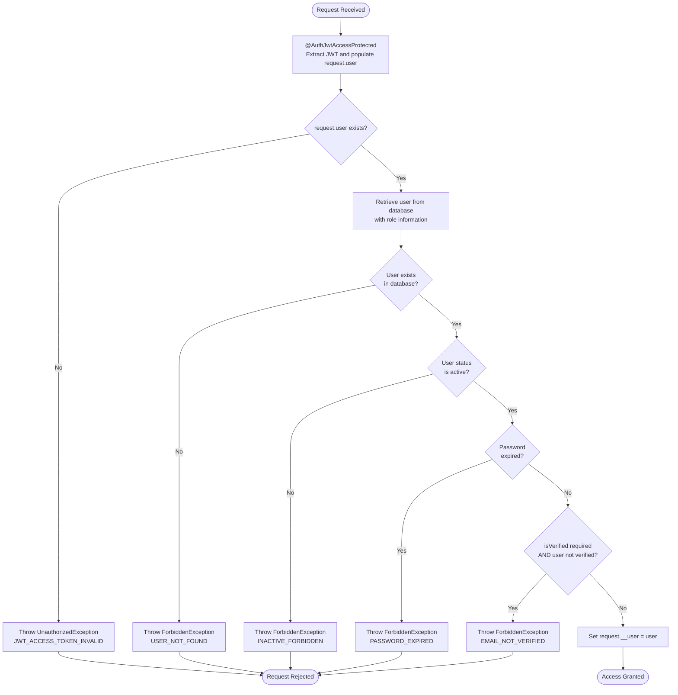
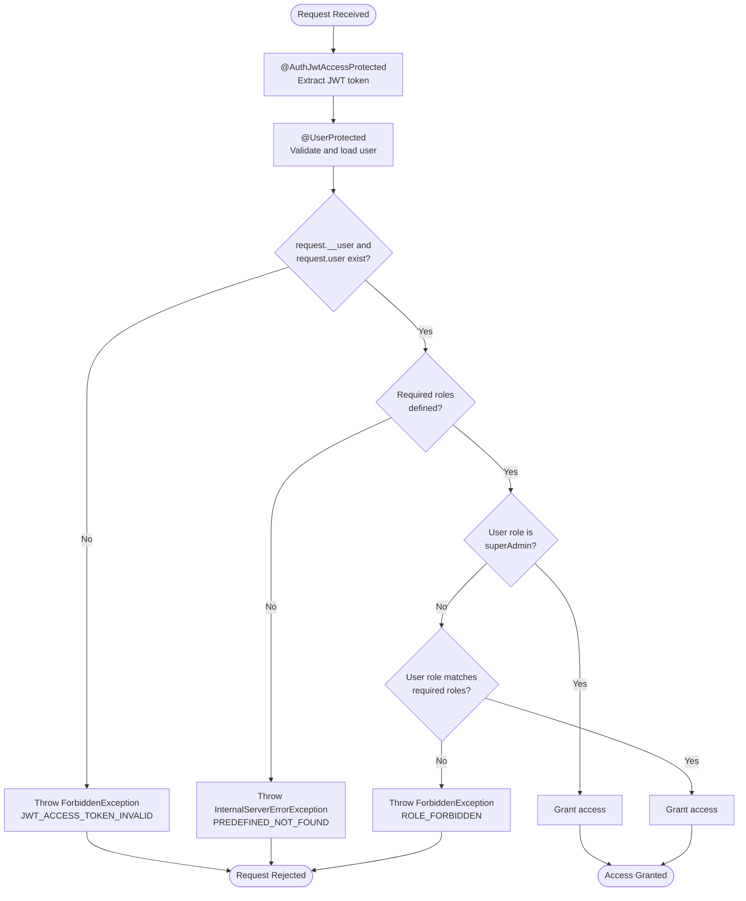
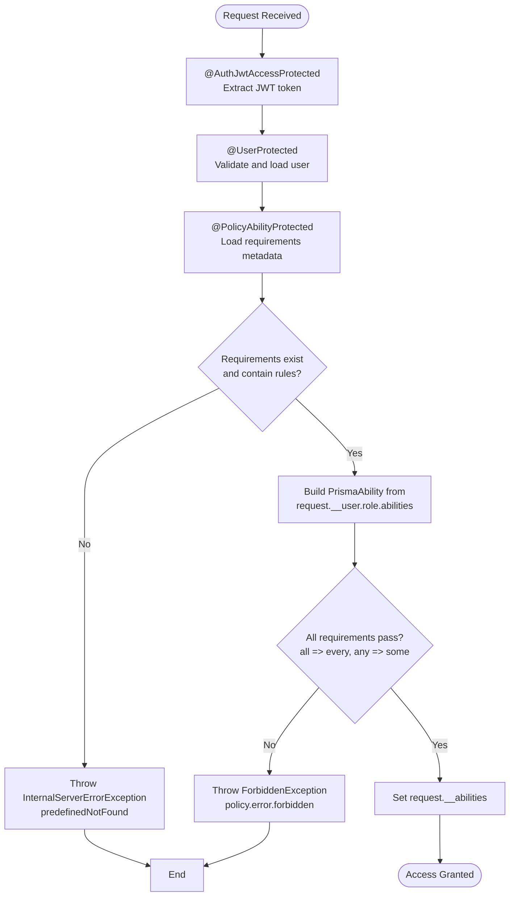
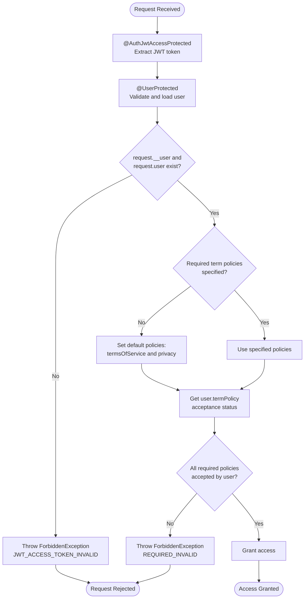
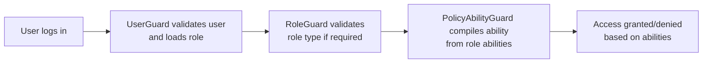

# Authorization Documentation

This documentation explains the features and usage of: 
- **UserProtected**: Located at `src/modules/user/decorators`
- **RoleProtected**: Located at `src/modules/role/decorators`
- **PolicyAbilityProtected**: Located at `src/modules/policy/decorators`
- **TermPolicyAcceptanceProtected**: Located at `src/modules/term-policy/decorators`

## Overview

This authorization system provides a comprehensive, layered security approach for ACK NestJs Boilerplate. It implements multiple protection levels including user authentication, role-based access control, policy-based permissions, and terms acceptance verification.

The system is built using NestJS guards and decorators, making it easy to apply different authorization levels to your route handlers with simple, declarative syntax.

## Related Documents

- [Configuration Documentation][ref-doc-configuration] - For Redis configuration settings
- [Environment Documentation][ref-doc-environment] - For Redis environment variables
- [Authentication Documentation][ref-doc-authentication] - For understand authentication system
- [Activity Log Documentation][ref-doc-activity-log] - For tracking authorization-related user activities
- [Term Policy Document][ref-doc-term-policy] - For managing user acceptance of terms and policies
- [Device Documentation][ref-doc-device] - For device management and session invalidation

## Table of Contents

- [Overview](#overview)
- [Related Documents](#related-documents)
- [User Protected](#user-protected)
  - [Decorators](#decorators)
    - [UserProtected() Decorator](#userprotected-decorator)
    - [UserCurrent() Parameter Decorator](#usercurrent-parameter-decorator)
  - [Guards](#guards)
    - [UserGuard](#userguard)
  - [Important Notes](#important-notes)
- [Role Protected](#role-protected)
  - [Decorators](#decorators-1)
    - [RoleProtected() Decorator](#roleprotected-decorator)
  - [Getting Current Role](#getting-current-role)
  - [Guards](#guards-1)
    - [RoleGuard](#roleguard)
  - [Important Notes](#important-notes-1)
- [Policy Ability Protected](#policy-ability-protected)
  - [Decorators](#decorators-2)
    - [PolicyAbilityProtected() Decorator](#policyabilityprotected-decorator)
  - [Guards](#guards-2)
    - [PolicyAbilityGuard](#policyabilityguard)
  - [CASL Integration](#casl-integration)
  - [Important Notes](#important-notes-2)
- [Term Policy Acceptance Protected](#term-policy-acceptance-protected)
  - [Decorators](#decorators-3)
    - [TermPolicyAcceptanceProtected() Decorator](#termpolicyacceptanceprotected-decorator)
  - [Guards](#guards-3)
    - [TermPolicyGuard](#termpolicyguard)
  - [Important Notes](#important-notes-3)
- [Creating Custom Roles](#creating-custom-roles)
  - [Overview](#overview-1)
  - [How to Create a New Role](#how-to-create-a-new-role)
  - [Role Configuration](#role-configuration)
  - [Assigning Roles to Users](#assigning-roles-to-users)
  - [Important Notes](#important-notes-4)

## User Protected

`UserProtected` provides basic user authentication and verification. It ensures that only authenticated users can access protected routes and optionally validates whether the user's email has been verified.

### Decorators

#### UserProtected Decorator

**Method decorator** that applies `UserGuard` to route handlers.

**Parameters:**
- `isVerified` (boolean, optional): Whether to require email verification. Default: `true`

**Usage:**

```typescript
@UserProtected()
@AuthJwtAccessProtected()
@Get('profile')
getProfile(@UserCurrent() user: IUser) {
  return user;
}

// Allow unverified users
@UserProtected(false)
@AuthJwtAccessProtected()
@Get('dashboard')
getDashboard(@UserCurrent() user: IUser) {
  return { user };
}
```

#### UserCurrent Parameter Decorator

Extracts the authenticated user object from the request context.

**Returns:** `IUser | undefined`

**Usage:**

```typescript
@UserProtected()
@AuthJwtAccessProtected()
@Get('me')
getCurrentUser(@UserCurrent() user: IUser) {
  return {
    id: user.id,
    email: user.email,
    role: user.role
  };
}
```

### Guards

#### `UserGuard`

The guard implementation that performs the actual validation.

The `UserProtected` decorator follows this validation sequence:

1. **Authentication Check**: Verifies that `request.user` exists (populated by JWT strategy)
2. **User Lookup**: Retrieves user from database with role information
3. **User Existence**: Ensures user record exists
4. **Status Validation**: Confirms user status is `active`
5. **Password Expiry**: Checks if password has expired
6. **Email Verification**: Validates email verification if required

**Flow Diagram:**


```mermaid
flowchart TD
    Start([Request Received]) --> JwtGuard[ @AuthJwtAccessProtected<br/>Extract JWT and populate request.user]
    JwtGuard --> CheckAuth{request.user exists?}
    CheckAuth -->|No| ErrorAuth[Throw UnauthorizedException<br/>JWT_ACCESS_TOKEN_INVALID]
    CheckAuth -->|Yes| LookupUser[Retrieve user from database<br/>with role information]
    
    LookupUser --> UserExists{User exists<br/>in database?}
    UserExists -->|No| ErrorNotFound[Throw ForbiddenException<br/>USER_NOT_FOUND]
    UserExists -->|Yes| CheckStatus{User status<br/>is active?}
    
    CheckStatus -->|No| ErrorInactive[Throw ForbiddenException<br/>INACTIVE_FORBIDDEN]
    CheckStatus -->|Yes| CheckPassword{Password<br/>expired?}
    
    CheckPassword -->|Yes| ErrorPassword[Throw ForbiddenException<br/>PASSWORD_EXPIRED]
    CheckPassword -->|No| CheckVerified{isVerified required<br/>AND user not verified?}
    
    CheckVerified -->|Yes| ErrorVerified[Throw ForbiddenException<br/>EMAIL_NOT_VERIFIED]
    CheckVerified -->|No| SetUser[Set request.__user = user]
    
    SetUser --> Success([Access Granted])
    
    ErrorAuth --> End([Request Rejected])
    ErrorNotFound --> End
    ErrorInactive --> End
    ErrorPassword --> End
    ErrorVerified --> End
```

### Important Notes

- `@UserProtected()` **requires** `@AuthJwtAccessProtected()` to be applied first (above in code)
- `@AuthJwtAccessProtected()` populates `request.user` from JWT token. See [Authentication Documentation][ref-doc-authentication] for details
- This decorator populates `request.__user` which is required by downstream guards

## Role Protected

`RoleProtected` implements role-based access control (RBAC) to restrict route access based on user roles. It ensures that only users with specific role types can access protected endpoints.

### Decorators

#### RoleProtected Decorator

**Method decorator** that applies `RoleGuard` to route handlers.

**Parameters:**
- `...requiredRoles` (EnumRoleType[]): One or more role types required to access the route

**Available Role Types:**
- `EnumRoleType.superAdmin` - Super administrator with unrestricted access
- `EnumRoleType.admin` - Administrator role
- `EnumRoleType.user` - Standard user role

**Usage:**

```typescript
// Single role requirement
@RoleProtected(EnumRoleType.admin)
@UserProtected()
@AuthJwtAccessProtected()
@Get('admin/dashboard')
getAdminDashboard(@UserCurrent() user: IUser) {
  return this.dashboardService.getAdminData();
}

// Multiple role requirements (user must have one of the specified roles)
@RoleProtected(EnumRoleType.admin, EnumRoleType.superAdmin)
@UserProtected()
@AuthJwtAccessProtected()
@Delete('users/:id')
deleteUser(@Param('id') id: string) {
  return this.userService.delete(id);
}
```

### Getting Current Role

To access the current user's role, use the `@UserCurrent()` decorator and access the `role` property:

```typescript
@RoleProtected(EnumRoleType.admin)
@UserProtected()
@AuthJwtAccessProtected()
@Get('role-info')
getRoleInfo(@UserCurrent() user: IUser) {
  return {
    roleType: user.role.type,
    roleName: user.role.name,
    abilities: user.role.abilities
  };
}
```

### Guards

#### `RoleGuard`

The guard implementation that validates user roles.

The `RoleProtected` decorator follows this validation sequence:

1. **User Validation**: Verifies that `request.__user` and `request.user` exist
2. **Required Roles Check**: Validates that required roles are defined
3. **Role Match**: Confirms user's role type matches one of the required roles
4. **Super Admin Role Match Exception**: `superAdmin` bypasses role match restrictions in this guard

**Flow Diagram:**


```mermaid
flowchart TD
    Start([Request Received]) --> JwtGuard[ @AuthJwtAccessProtected<br/>Extract JWT token]
    JwtGuard --> UserGuard[ @UserProtected<br/>Validate and load user]
    UserGuard --> CheckUser{request.__user and<br/>request.user exist?}
    
    CheckUser -->|No| ErrorUser[Throw ForbiddenException<br/>JWT_ACCESS_TOKEN_INVALID]
    CheckUser -->|Yes| CheckRequired{Required roles<br/>defined?}
    
    CheckRequired -->|No| ErrorPredefined[Throw InternalServerErrorException<br/>PREDEFINED_NOT_FOUND]
    CheckRequired -->|Yes| CheckSuperAdmin{User role is<br/>superAdmin?}
    
    CheckSuperAdmin -->|Yes| GrantSuperAdmin[Grant access]
    CheckSuperAdmin -->|No| CheckRoleMatch{User role matches<br/>required roles?}
    
    CheckRoleMatch -->|No| ErrorForbidden[Throw ForbiddenException<br/>ROLE_FORBIDDEN]
    CheckRoleMatch -->|Yes| GrantAccess[Grant access]
    
    GrantSuperAdmin --> Success([Access Granted])
    GrantAccess --> Success
    
    ErrorUser --> End([Request Rejected])
    ErrorPredefined --> End
    ErrorForbidden --> End
```

### Important Notes

- `@RoleProtected()` **requires** `@AuthJwtAccessProtected()` and `@UserProtected()` to be applied
- Recommended stack from top to bottom: `@RoleProtected()` → `@UserProtected()` → `@AuthJwtAccessProtected()`. See [Authentication Documentation][ref-doc-authentication] for `@AuthJwtAccessProtected()` details
- This decorator validates role access only. CASL ability compilation is done by `PolicyAbilityGuard`/`PolicyService`
- Incorrect ordering will result in runtime errors
- Users with `superAdmin` role type have unrestricted access to `@RoleProtected` role matching, regardless of the specified required roles.


## Policy Ability Protected

`PolicyAbilityProtected` implements fine-grained authorization using CASL v6 with the Prisma adapter (`@casl/prisma`). It validates whether the current user can perform specific actions on specific subjects, with support for grouped requirements, field-level checks, and Prisma condition filters.

### Decorators

#### PolicyAbilityProtected Decorator

**Method decorator** that applies `PolicyAbilityGuard` to route handlers.

**Parameters:**
- `...inputs` supports two modes:
  - **Shorthand mode**: one or more `IPolicyRule` objects
  - **Requirement mode**: one or more `IPolicyRequirement` objects with `rules` + optional `match`

**`IPolicyRule` shape:**
- `subject` (`EnumPolicySubject`)
- `action` (`EnumPolicyAction[]`)
- `fields?` (`string[]`) for field-level permission checks
- `conditions?` (`PrismaQuery`) for conditional checks

**`IPolicyRequirement` shape:**
- `rules` (`IPolicyRule[]`)
- `match?` (`EnumPolicyMatch.all | EnumPolicyMatch.any`)  
  - `all` (default): every rule in the requirement must pass
  - `any`: at least one rule in the requirement must pass

**Important contract:**
- Do not mix `IPolicyRule` and `IPolicyRequirement` arguments in the same decorator call.
- In shorthand mode, all provided rules are wrapped as a single requirement with `match: all`.

**Available Policy Actions:**
- `EnumPolicyAction.manage` - Full control over a subject
- `EnumPolicyAction.read` - Read/view permission
- `EnumPolicyAction.create` - Create new resources
- `EnumPolicyAction.update` - Modify existing resources
- `EnumPolicyAction.delete` - Remove resources

**Available Policy Effects (role ability definitions):**
- `EnumPolicyEffect.can` - Allow rule
- `EnumPolicyEffect.cannot` - Deny rule

**Available Requirement Match Modes:**
- `EnumPolicyMatch.all` - Every rule in the group must pass
- `EnumPolicyMatch.any` - At least one rule in the group must pass

**Available Policy Subjects:**
- `EnumPolicySubject.all` - All resources
- `EnumPolicySubject.apiKey` - API key management
- `EnumPolicySubject.role` - Role management
- `EnumPolicySubject.user` - User management
- `EnumPolicySubject.session` - Session management
- `EnumPolicySubject.activityLog` - Activity logs
- `EnumPolicySubject.passwordHistory` - Password history
- `EnumPolicySubject.termPolicy` - Terms and policies
- `EnumPolicySubject.featureFlag` - Feature flags
- `EnumPolicySubject.device` - Device management

**Usage:**

```typescript
// Shorthand mode: all rules must pass
@PolicyAbilityProtected({
  subject: EnumPolicySubject.user,
  action: [EnumPolicyAction.read]
})
@RoleProtected(EnumRoleType.admin)
@UserProtected()
@AuthJwtAccessProtected()
@Get('users')
getUsers() {
  return this.userService.findAll();
}

// Requirement mode: at least one rule in this requirement must pass
@PolicyAbilityProtected(
  {
    match: EnumPolicyMatch.any,
    rules: [
      {
        subject: EnumPolicySubject.role,
        action: [EnumPolicyAction.read]
      },
      {
        subject: EnumPolicySubject.user,
        action: [EnumPolicyAction.manage]
      }
    ]
  }
)
@RoleProtected(EnumRoleType.admin)
@UserProtected()
@AuthJwtAccessProtected()
@Post('users/:id/assign-role')
assignRole(@Param('id') id: string, @Body() dto: AssignRoleDto) {
  return this.userService.assignRole(id, dto.roleId);
}

// Field-level requirement
@PolicyAbilityProtected({
  subject: EnumPolicySubject.activityLog,
  action: [EnumPolicyAction.read],
  fields: ['action', 'createdAt', 'ipAddress']
})
@UserProtected()
@AuthJwtAccessProtected()
@Get('activity-log/list')
list(@PolicyAbilityCurrent() ability: PolicyAbility) {
  return this.activityService.getList(ability);
}
```

`PolicyAbilityCurrent()` is a parameter decorator that injects the compiled request-scoped CASL `PolicyAbility`, which can then be used in services with `accessibleBy(...)`.

### Guards

#### `PolicyAbilityGuard`

The guard implementation that validates request access against policy requirements.

The `PolicyAbilityProtected` decorator follows this validation sequence:

1. **Metadata Read**: Reads `IPolicyRequirement[]` from route metadata (`PolicyAuthorizeMetaKey`)
2. **Requirement Validation**: Rejects empty requirements or empty rule sets (`predefinedNotFound`)
3. **Ability Build**: Compiles CASL ability from `request.__user.role.abilities`
4. **Requirement Evaluation**: Evaluates each requirement with `all` (`every`) or `any` (`some`)
5. **Access Decision**: Throws `forbidden` when at least one requirement fails; otherwise stores compiled ability in `request.__abilities`

**Flow Diagram:**


```mermaid
flowchart TD
    Start([Request Received]) --> JwtGuard[ @AuthJwtAccessProtected<br/>Extract JWT token]
    JwtGuard --> UserGuard[ @UserProtected<br/>Validate and load user]
    UserGuard --> PolicyGuard[ @PolicyAbilityProtected<br/>Load requirements metadata]
    PolicyGuard --> CheckRequired{Requirements exist<br/>and contain rules?}
    
    CheckRequired -->|No| ErrorPredefined[Throw InternalServerErrorException<br/>predefinedNotFound]
    CheckRequired -->|Yes| BuildAbility[Build PrismaAbility from<br/>request.__user.role.abilities]
    
    BuildAbility --> CheckRequirements{All requirements pass?<br/>all => every, any => some}
    
    CheckRequirements -->|No| ErrorForbidden[Throw ForbiddenException<br/>policy.error.forbidden]
    CheckRequirements -->|Yes| SetAbility[Set request.__abilities]
    
    SetAbility --> Success([Access Granted])
    
    ErrorPredefined --> End
    ErrorForbidden --> End
```

### CASL Integration

The system uses [CASL][casl] + [`@casl/prisma`][casl-prisma] through `PolicyAbilityFactory` and `PolicyService`:

**1) Ability parsing and validation (`parseAbilities`)**
- Validates persisted role abilities (Prisma composite `RoleAbility`) before compiling:
  - `action` must be a non-empty array
  - `subject` must match `EnumPolicySubject`
  - `fields`, when present, must be `string[]`
  - `conditions`, when present, must be a plain object
- Invalid shapes throw `policy.error.invalidConfiguration`.

**2) Rule ordering and precedence (`createForUser`)**
- Uses `AbilityBuilder(createPrismaAbility)` to produce a Prisma-aware ability.
- Rules are sorted by:
  - `priority` ascending (`lower` applied first)
  - within same priority: `can` first, then `cannot`  
This gives deny rules (`cannot`) precedence when both match at equal priority.

**3) Conditions + placeholders**
- Role abilities can include Prisma-style `conditions`.
- Placeholders (currently `$userId`) are resolved from request context (`{ userId: request.__user.id }`).
- Unknown placeholders throw `policy.error.invalidConditionPlaceholder`.
- Conditions must use Prisma filter style, not Mongo `$operators`.

**4) Field-level authorization**
- Rules can define `fields` to restrict allowed properties.
- `PolicyService.getPermittedFields(...)` delegates to `permittedFieldsOf(...)`.
- Return value:
  - `undefined` => all fields allowed
  - `string[]` => restrict output/query select to these fields

**5) Request-level usage with Prisma queries**
- `PolicyAbilityCurrent()` injects the compiled ability.
- Services can combine query filters safely:
  - `accessibleBy(ability).Model` for row-level filtering
  - `getPermittedFields(...)` for field-level projection

```typescript
const permittedFields = this.policyService.getPermittedFields(
  ability,
  EnumPolicyAction.read,
  EnumPolicySubject.activityLog
);

return this.activityRepository.findWithPaginationCursor({
  ...pagination,
  ...(permittedFields
    ? { select: Object.fromEntries(permittedFields.map(f => [f, true])) }
    : {}),
  where: {
    AND: [
      accessibleBy(ability).ActivityLog,
      pagination.where,
      { userId },
    ].filter(Boolean),
  },
});
```

### Important Notes

- `@PolicyAbilityProtected()` requires authenticated user context from `@AuthJwtAccessProtected()` + `@UserProtected()`
- `@RoleProtected()` is optional for policy checks and should be used when route-level role gating is also required
- Recommended stack from top to bottom: `@PolicyAbilityProtected()` → `@RoleProtected()` (optional) → `@UserProtected()` → `@AuthJwtAccessProtected()`
- Incorrect ordering will result in runtime errors
- There is no hardcoded super-admin bypass in `PolicyAbilityGuard`; unrestricted access depends on assigned abilities (default seed gives `superAdmin` `all/manage`)
- For a single rule, all actions in `action[]` must pass
- For grouped requirements, `match: all` requires every rule, while `match: any` requires at least one
- Subject values map to enum values used by CASL/Prisma (`User`, `Role`, `ActivityLog`, etc.)

## Term Policy Acceptance Protected

`TermPolicyAcceptanceProtected` validates that users have accepted required legal terms and policies (such as Terms of Service, Privacy Policy, etc.) before allowing access to protected routes. This ensures legal compliance and user consent management.

For more detailed information about term policies, see [Term Policy Document][ref-doc-term-policy].

### Decorators

#### TermPolicyAcceptanceProtected Decorator

**Method decorator** that applies `TermPolicyGuard` to route handlers.

**Parameters:**
- `...requiredTermPolicies` (EnumTermPolicyType[], optional): One or more term policy types that must be accepted. If not provided, defaults to `termsOfService` and `privacy`

**Available Term Policy Types:**
- `EnumTermPolicyType.termsOfService` - Terms of Service acceptance
- `EnumTermPolicyType.privacy` - Privacy Policy acceptance
- `EnumTermPolicyType.cookies` - Cookies Policy acceptance
- `EnumTermPolicyType.marketing` - Marketing consent acceptance

**Usage:**

```typescript
// Default: requires termsOfService and privacy acceptance
@TermPolicyAcceptanceProtected()
@UserProtected()
@AuthJwtAccessProtected()
@Get('premium-features')
getPremiumFeatures() {
  return this.featureService.getPremiumFeatures();
}

// Single term policy requirement
@TermPolicyAcceptanceProtected(EnumTermPolicyType.marketing)
@UserProtected()
@AuthJwtAccessProtected()
@Post('subscribe-newsletter')
subscribeNewsletter(@Body() dto: SubscribeDto) {
  return this.newsletterService.subscribe(dto);
}

// Multiple term policy requirements
@TermPolicyAcceptanceProtected(
  EnumTermPolicyType.termsOfService,
  EnumTermPolicyType.privacy,
  EnumTermPolicyType.cookies
)
@UserProtected()
@AuthJwtAccessProtected()
@Post('data-processing')
processUserData(@Body() dto: ProcessDataDto) {
  return this.dataService.process(dto);
}
```

### Guards

#### `TermPolicyGuard`

The guard implementation that validates user term policy acceptance.

The `TermPolicyAcceptanceProtected` decorator follows this validation sequence:

1. **User Validation**: Verifies that `request.__user` and `request.user` exist
2. **Default Policy Check**: If no required policies specified, sets defaults to `termsOfService` and `privacy`
3. **Term Policy Lookup**: Retrieves user's term policy acceptance status from `__user.termPolicy`
4. **Acceptance Validation**: Checks if all required term policies are accepted
5. **Access Decision**: Grants access only if all required policies are accepted

**Flow Diagram:**


```mermaid
flowchart TD
    Start([Request Received]) --> JwtGuard[ @AuthJwtAccessProtected<br/>Extract JWT token]
    JwtGuard --> UserGuard[ @UserProtected<br/>Validate and load user]
    UserGuard --> CheckUser{request.__user and<br/>request.user exist?}
    
    CheckUser -->|No| ErrorUser[Throw ForbiddenException<br/>JWT_ACCESS_TOKEN_INVALID]
    CheckUser -->|Yes| CheckRequired{Required term policies<br/>specified?}
    
    CheckRequired -->|No| SetDefault[Set default policies:<br/>termsOfService and privacy]
    CheckRequired -->|Yes| UseSpecified[Use specified policies]
    
    SetDefault --> GetTermPolicy[Get user.termPolicy<br/>acceptance status]
    UseSpecified --> GetTermPolicy
    
    GetTermPolicy --> CheckAcceptance{All required policies<br/>accepted by user?}
    
    CheckAcceptance -->|No| ErrorRequired[Throw ForbiddenException<br/>REQUIRED_INVALID]
    CheckAcceptance -->|Yes| GrantAccess[Grant access]
    
    GrantAccess --> Success([Access Granted])
    
    ErrorUser --> End([Request Rejected])
    ErrorRequired --> End
```

### Important Notes

- `@TermPolicyAcceptanceProtected()` **requires** `@UserProtected()` and `@AuthJwtAccessProtected()` to be applied
- Decorator order from top to bottom: `@TermPolicyAcceptanceProtected()` → `@UserProtected()` → `@AuthJwtAccessProtected()`
- For more details about `@AuthJwtAccessProtected()`, see [Authentication Documentation][ref-doc-authentication]
- Without the required decorators, the endpoint will throw a 403 Forbidden error
- If no term policies are specified, it defaults to requiring `termsOfService` and `privacy` acceptance
- All specified term policies must be accepted by the user for access to be granted
- Incorrect decorator ordering will result in runtime errors

## Creating Custom Roles

The boilerplate supports creating custom roles through the role management API. Each role can have a unique combination of permissions (abilities) that define what actions users with that role can perform on different resources.

This feature allows you to create specialized roles beyond the default `superAdmin`, `admin`, and `user` types - for example, you could create roles like "ContentModerator", "Accountant", "CustomerSupport", etc., each with their own specific set of permissions.

### How to Create a New Role

Custom roles are created through the admin role management endpoints. The API documentation is available in your Swagger docs at `/docs`.

**Basic steps:**

1. Authenticate as an admin user
2. Call the role creation endpoint
3. Provide role details including name, type, description, and abilities
4. The new role is immediately available for assignment to users

**Example role creation request:**

```json
{
  "name": "contentmoderator",
  "description": "Role for moderating user-generated content",
  "type": "admin",
  "abilities": [
    {
      "subject": "ActivityLog",
      "action": ["read"],
      "fields": ["action", "createdAt", "ipAddress"],
      "conditions": {
        "userId": "$userId"
      },
      "effect": "can",
      "reason": "Users can only read their own safe activity-log fields",
      "priority": 0
    },
    {
      "subject": "User",
      "action": ["delete"],
      "effect": "cannot",
      "reason": "Explicit deny for destructive user actions",
      "priority": 10
    }
  ]
}
```

### Role Configuration

**Role Properties:**

- **name**: Unique identifier for the role (alphanumeric, lowercase, 3-30 characters)
- **description**: Optional description explaining the role's purpose (max 500 characters)
- **type**: Role type from `EnumRoleType` (superAdmin, admin, or user)
- **abilities**: Array of permission objects defining what the role can do

**Ability Structure:**

Each ability consists of:
- **subject**: Resource type (`all`, `ApiKey`, `Role`, `User`, `Session`, `ActivityLog`, `PasswordHistory`, `TermPolicy`, `FeatureFlag`, `Device`)
- **action**: Allowed actions (`manage`, `read`, `create`, `update`, `delete`)
- **effect** *(optional)*: `can` (allow) or `cannot` (deny)
- **fields** *(optional)*: Field-level allow-list
- **conditions** *(optional)*: Prisma filter-style conditions (supports placeholders like `$userId`)
- **reason** *(optional)*: Human-readable rule reason
- **priority** *(optional)*: Rule order priority (`lower` applies first)

**Available subjects and actions are defined in:**
- `EnumPolicySubject`: all, ApiKey, Role, User, Session, ActivityLog, PasswordHistory, TermPolicy, FeatureFlag, Device
- `EnumPolicyAction`: manage, read, create, update, delete
- `EnumPolicyEffect`: can, cannot

### Assigning Roles to Users

Once a custom role is created, it can be assigned to users through:

1. **User creation**: Specify the `roleId` when creating new users
2. **User update**: Update existing users to assign them the new role

**How it works automatically:**

- When a user is assigned a role, they immediately inherit all abilities defined for that role
- `UserGuard` loads the user and role into `request.__user`
- `PolicyAbilityGuard` compiles CASL `PrismaAbility` from `request.__user.role.abilities` and stores it in `request.__abilities`
- Services can enforce row-level and field-level restrictions using `accessibleBy(...)` and `getPermittedFields(...)`
- No application restart or additional configuration is needed

**Permission enforcement flow:**


```mermaid
flowchart LR
    User[User logs in] --> UserGuard[UserGuard validates user<br/>and loads role]
    UserGuard --> RoleGuard[RoleGuard validates<br/>role type if required]
    RoleGuard --> PolicyGuard[PolicyAbilityGuard compiles ability<br/>from role abilities]
    PolicyGuard --> Access[Access granted/denied<br/>based on abilities]
```

### Important Notes

- **Role names must be unique** - You cannot create two roles with the same name
- **Roles cannot be deleted if in use** - You must first reassign users to different roles before deleting


<!-- REFERENCES -->

[casl]: https://casl.js.org/
[casl-prisma]: https://github.com/stalniy/casl/tree/master/packages/casl-prisma

[ref-doc-authentication]: authentication.md
[ref-doc-configuration]: configuration.md
[ref-doc-environment]: environment.md
[ref-doc-activity-log]: activity-log.md
[ref-doc-term-policy]: term-policy.md
[ref-doc-device]: device.md
