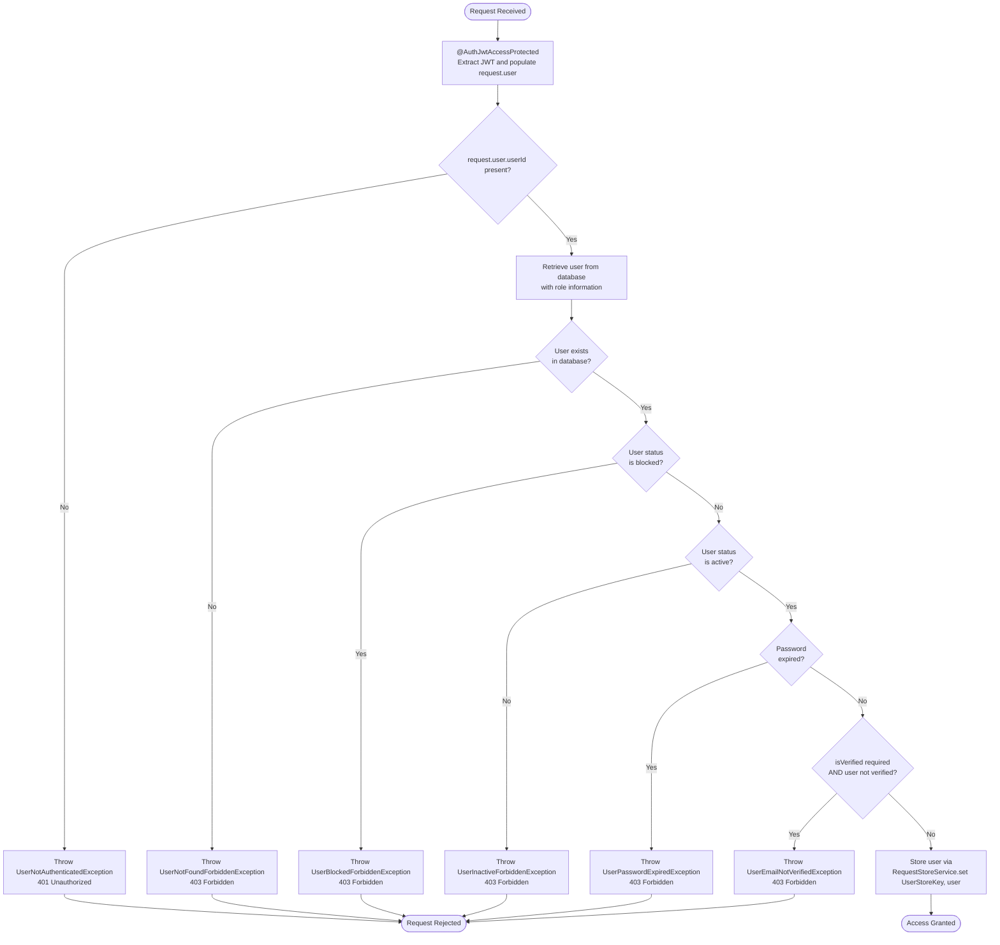
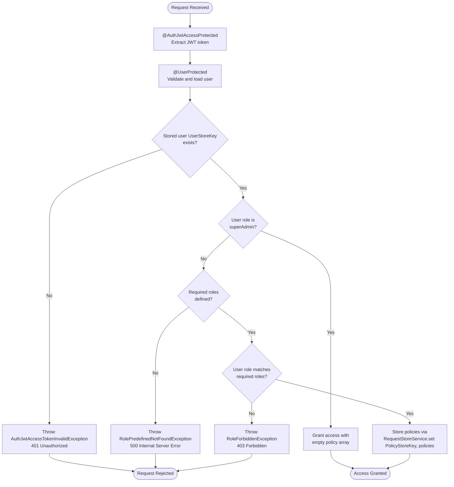
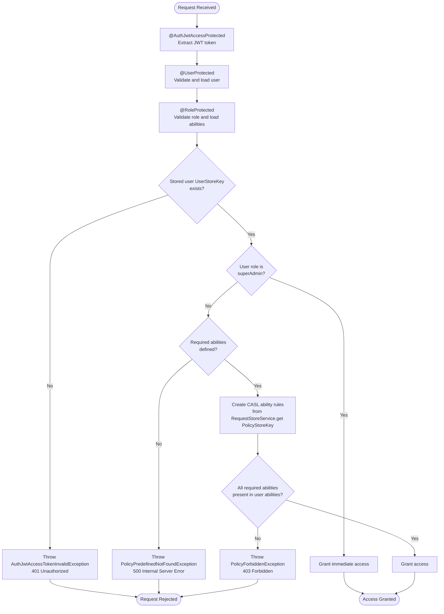
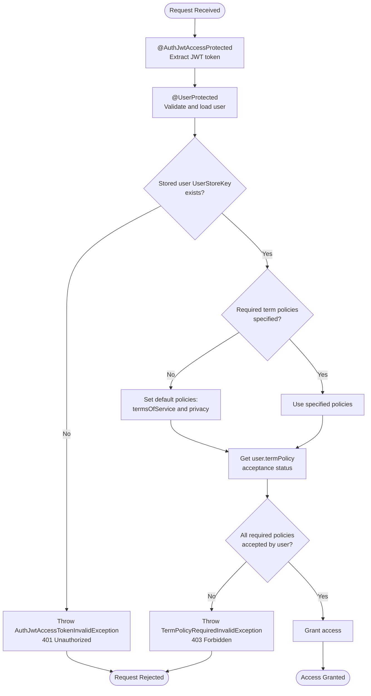
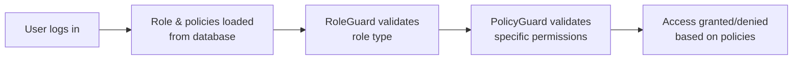

# Authorization Documentation

This documentation explains the features and usage of: 
- **UserProtected**: Located at `src/modules/user/decorators`
- **RoleProtected**: Located at `src/modules/role/decorators`
- **PolicyProtected**: Located at `src/modules/policy/decorators`
- **TermPolicyAcceptanceProtected**: Located at `src/modules/term-policy/decorators`

The workspace and project decorators (`WorkspaceProtected`, `WorkspaceMemberProtected`, `ProjectProtected`, `ProjectMemberProtected`) are summarised here and documented in full by [Workspace][ref-doc-workspace] and [Project][ref-doc-project].

## Overview

This authorization system provides a comprehensive, layered security approach for ACK NestJs Boilerplate. It implements multiple protection levels including user authentication, role-based access control, policy-based permissions, and terms acceptance verification.

The system is built using NestJS guards and decorators, making it easy to apply different authorization levels to your route handlers with simple, declarative syntax.

## Related Documents

- [Configuration Documentation][ref-doc-configuration] - For Redis configuration settings
- [Environment Documentation][ref-doc-environment] - For Redis environment variables
- [Authentication Documentation][ref-doc-authentication] - For understand authentication system
- [Activity Log Documentation][ref-doc-activity-log] - For tracking authorization-related user activities
- [Term Policy Document][ref-doc-term-policy] - For managing user acceptance of terms and policies
- [Device Documentation][ref-doc-device] - For device management and session invalidation
- [Workspace Documentation][ref-doc-workspace] - For the workspace guards, their exceptions, and `x-workspace-id`
- [Project Documentation][ref-doc-project] - For the project guards and the workspace-owner bypass

## Table of Contents

- [Overview](#overview)
- [Related Documents](#related-documents)
- [Decorator Order](#decorator-order)
- [User Protected](#user-protected)
  - [Decorators](#decorators)
    - [UserProtected() Decorator](#userprotected-decorator)
    - [UserCurrent() Parameter Decorator](#usercurrent-parameter-decorator)
  - [Guards](#guards)
    - [UserGuard](#userguard)
  - [Important Notes](#important-notes)
- [Role Protected](#role-protected)
  - [Decorators](#decorators-1)
    - [RoleProtected() Decorator](#roleprotected-decorator)
  - [Getting Current Role](#getting-current-role)
  - [Guards](#guards-1)
    - [RoleGuard](#roleguard)
  - [Important Notes](#important-notes-1)
- [Policy Protected](#policy-protected)
  - [Decorators](#decorators-2)
    - [PolicyProtected() Decorator](#policyprotected-decorator)
  - [Guards](#guards-2)
    - [PolicyGuard](#policyguard)
  - [CASL Integration](#casl-integration)
  - [Important Notes](#important-notes-2)
- [Term Policy Acceptance Protected](#term-policy-acceptance-protected)
  - [Decorators](#decorators-3)
    - [TermPolicyAcceptanceProtected() Decorator](#termpolicyacceptanceprotected-decorator)
  - [Guards](#guards-3)
    - [TermPolicyGuard](#termpolicyguard)
  - [Important Notes](#important-notes-3)
- [Workspace and Project Protected](#workspace-and-project-protected)
- [Creating Custom Roles](#creating-custom-roles)
  - [How to Create a New Role](#how-to-create-a-new-role)
  - [Role Configuration](#role-configuration)
  - [Assigning Roles to Users](#assigning-roles-to-users)
  - [Important Notes](#important-notes-4)

## Decorator Order

NestJS evaluates stacked decorators bottom-up, so the guard NEAREST the method executes FIRST. The order encodes which gate rejects first, so reshuffling it changes the error a caller sees even when the application still boots. Keep this exact order, top to bottom in source:

```typescript
@ExampleDoc()                              // 1.  Swagger doc factory
@Response('example.action')                // 2.  @Response / @ResponsePaging / @ResponseFile
@TermPolicyAcceptanceProtected()           // 3.  Term policy acceptance
@PolicyProtected({ ... })           // 4.  CASL policy ability
@RoleProtected(EnumRoleType.admin)         // 5.  Role type
@ProjectMemberProtected(...)               // 6.  Project member role
@ProjectProtected()                        // 7.  Project resolution from :projectId
@WorkspaceMemberProtected(...)             // 8.  Workspace member role
@WorkspaceProtected()                      // 9.  Workspace resolution from x-workspace-id
@ActivityLog(EnumActivityLogAction.adminUserUpdateStatus) // 10. Activity log
@UserProtected()                           // 11. User status
@FeatureFlagProtected('exampleKey')        // 12. Feature flag
@AuthJwtAccessProtected()                  // 13. JWT access or refresh
@ApiKeyProtected()                         // 14. API key
@HttpCode(HttpStatus.OK)                   // 15. HTTP status, only when it differs from the default
@Get('/endpoint')                          // 16. HTTP method, always last
```

A route takes only the slots it needs; the relative order of the ones it takes never changes. Guard execution therefore runs `@ApiKeyProtected()` → `@AuthJwtAccessProtected()` → `@FeatureFlagProtected()` → `@UserProtected()` → `@WorkspaceProtected()` → `@WorkspaceMemberProtected()` → `@ProjectProtected()` → `@ProjectMemberProtected()` → `@RoleProtected()` → `@PolicyProtected()` → `@TermPolicyAcceptanceProtected()`.

- A social-login guard (`@AuthSocialGoogleProtected()`) takes the JWT slot for that route.
- `@RequestThrottle({ ... })` sits outside this order. It mounts an interceptor, so it runs after every guard whatever its position in the stack. Routes declare it below `@ApiKeyProtected()`, so the rate limit reads next to the guards protecting the same route. See [Security and Middleware][ref-doc-security-and-middleware].
- `@ActivityLog()` binds an interceptor, not a guard, so it runs after every guard has passed. It still occupies its source slot and requires `@AuthJwtAccessProtected()`.
- A guard that depends on state an earlier guard sets must sit ABOVE that guard in source, so it runs after it.
- `@FeatureFlagProtected()` sits ABOVE `@AuthJwtAccessProtected()` so the flag guard sees `request.user`. Below it the guard always takes its anonymous branch, which makes `targetUserIds` and any rollout below 100% inert on that route.
- The workspace and project slots are used by the `/user` scope. The `/admin` scope reaches the same resources through `@RoleProtected()` + `@PolicyProtected()` instead, and takes the workspace or project id from the path.

## User Protected

`UserProtected` provides basic user authentication and verification. It ensures that only authenticated users can access protected routes and optionally validates whether the user's email has been verified.

### Decorators

#### UserProtected Decorator

**Method decorator** that applies `UserGuard` to route handlers.

**Parameters:**
- `isVerified` (boolean, optional): Whether to require email verification. Default: `true`

**Usage:**

```typescript
@UserProtected()
@AuthJwtAccessProtected()
@Get('profile')
getProfile(@UserCurrent() user: IUser) {
  return user;
}

// Allow unverified users
@UserProtected(false)
@AuthJwtAccessProtected()
@Get('dashboard')
getDashboard(@UserCurrent() user: IUser) {
  return { user };
}
```

#### UserCurrent Parameter Decorator

Extracts the authenticated user object from the request context.

**Returns:** `IUser | undefined`

**Usage:**

```typescript
@UserProtected()
@AuthJwtAccessProtected()
@Get('me')
getCurrentUser(@UserCurrent() user: IUser) {
  return {
    id: user.id,
    email: user.email,
    role: user.role
  };
}
```

### Guards

#### `UserGuard`

The guard implementation that performs the actual validation.

The `UserProtected` decorator follows this validation sequence:

1. **Authentication Check**: Verifies that the JWT strategy put a `userId` on `request.user`
2. **User Lookup**: Retrieves user from database with role information
3. **User Existence**: Ensures user record exists
4. **Blocked Check**: Rejects a user whose status is `blocked`
5. **Status Validation**: Confirms user status is `active`
6. **Password Expiry**: Checks if password has expired
7. **Email Verification**: Validates email verification if required

**Flow Diagram:**


```mermaid
flowchart TD
    Start([Request Received]) --> JwtGuard[ @AuthJwtAccessProtected<br/>Extract JWT and populate request.user]
    JwtGuard --> CheckAuth{request.user.userId present?}
    CheckAuth -->|No| ErrorAuth[Throw UserNotAuthenticatedException<br/>401 Unauthorized]
    CheckAuth -->|Yes| LookupUser[Retrieve user from database<br/>with role information]
    
    LookupUser --> UserExists{User exists<br/>in database?}
    UserExists -->|No| ErrorNotFound[Throw UserNotFoundForbiddenException<br/>403 Forbidden]
    UserExists -->|Yes| CheckBlocked{User status<br/>is blocked?}
    
    CheckBlocked -->|Yes| ErrorBlocked[Throw UserBlockedForbiddenException<br/>403 Forbidden]
    CheckBlocked -->|No| CheckStatus{User status<br/>is active?}
    
    CheckStatus -->|No| ErrorInactive[Throw UserInactiveForbiddenException<br/>403 Forbidden]
    CheckStatus -->|Yes| CheckPassword{Password<br/>expired?}
    
    CheckPassword -->|Yes| ErrorPassword[Throw UserPasswordExpiredException<br/>403 Forbidden]
    CheckPassword -->|No| CheckVerified{isVerified required<br/>AND user not verified?}
    
    CheckVerified -->|Yes| ErrorVerified[Throw UserEmailNotVerifiedException<br/>403 Forbidden]
    CheckVerified -->|No| SetUser[Store user via<br/>RequestStoreService.set UserStoreKey, user]
    
    SetUser --> Success([Access Granted])
    
    ErrorAuth --> End([Request Rejected])
    ErrorNotFound --> End
    ErrorBlocked --> End
    ErrorInactive --> End
    ErrorPassword --> End
    ErrorVerified --> End
```

### Important Notes

- `@UserProtected()` requires `@AuthJwtAccessProtected()` to run first, so JWT sits below `@UserProtected()` in source (nearest the method). Nest runs guards bottom-up.
- `@AuthJwtAccessProtected()` populates `request.user` from JWT token. See [Authentication Documentation][ref-doc-authentication] for details
- This decorator stores the validated user via `RequestStoreService.set(UserStoreKey, user)` (read back with `RequestStoreService.get(UserStoreKey)`, e.g. by `@UserCurrent()`), which is required by downstream guards

## Role Protected

`RoleProtected` implements role-based access control (RBAC) to restrict route access based on user roles. It ensures that only users with specific role types can access protected endpoints.

### Decorators

#### RoleProtected Decorator

**Method decorator** that applies `RoleGuard` to route handlers.

**Parameters:**
- `...requiredRoles` (EnumRoleType[]): One or more role types required to access the route

**Available Role Types:**
- `EnumRoleType.superAdmin` - Super administrator with unrestricted access
- `EnumRoleType.admin` - Administrator role
- `EnumRoleType.user` - Standard user role

**Usage:**

```typescript
// Single role requirement
@RoleProtected(EnumRoleType.admin)
@UserProtected()
@AuthJwtAccessProtected()
@Get('admin/dashboard')
getAdminDashboard(@UserCurrent() user: IUser) {
  return this.dashboardService.getAdminData();
}

// Multiple role requirements (user must have one of the specified roles)
@RoleProtected(EnumRoleType.admin, EnumRoleType.user)
@UserProtected()
@AuthJwtAccessProtected()
@Delete('users/:id')
deleteUser(@Param('id') id: string) {
  return this.userService.delete(id);
}
```

**Never list `superAdmin` in `@RoleProtected()`.** The guard returns before the required-role list is read for a `superAdmin`, so adding it grants nothing and misleads the next reader into thinking the route is gated by an enumeration that is never reached.

### Getting Current Role

To access the current user's role, use the `@UserCurrent()` decorator and access the `role` property:

```typescript
@RoleProtected(EnumRoleType.admin)
@UserProtected()
@AuthJwtAccessProtected()
@Get('role-info')
getRoleInfo(@UserCurrent() user: IUser) {
  return {
    roleType: user.role.type,
    roleName: user.role.name,
    policies: user.role.policies
  };
}
```

### Guards

#### `RoleGuard`

The guard implementation that validates user roles and stashes the role's policies.

The `RoleProtected` decorator follows this validation sequence:

1. **User Validation**: Verifies that the stored user (`RequestStoreService.get(UserStoreKey)`) exists
2. **Super Admin Bypass**: If user role is `superAdmin`, grants immediate access with an empty policy array
3. **Required Roles Check**: Validates that required roles are defined
4. **Role Match**: Confirms user's role type matches one of the required roles
5. **Policy Population**: Stores `role.policies` via `RequestStoreService.set(PolicyStoreKey, policies)` for downstream use

**Flow Diagram:**


```mermaid
flowchart TD
    Start([Request Received]) --> JwtGuard[ @AuthJwtAccessProtected<br/>Extract JWT token]
    JwtGuard --> UserGuard[ @UserProtected<br/>Validate and load user]
    UserGuard --> CheckUser{Stored user UserStoreKey<br/>exists?}
    
    CheckUser -->|No| ErrorUser[Throw AuthJwtAccessTokenInvalidException<br/>401 Unauthorized]
    CheckUser -->|Yes| CheckSuperAdmin{User role is<br/>superAdmin?}
    
    CheckSuperAdmin -->|Yes| GrantSuperAdmin[Grant access with<br/>empty policy array]
    CheckSuperAdmin -->|No| CheckRequired{Required roles<br/>defined?}
    
    CheckRequired -->|No| ErrorPredefined[Throw RolePredefinedNotFoundException<br/>500 Internal Server Error]
    CheckRequired -->|Yes| CheckRoleMatch{User role matches<br/>required roles?}
    
    CheckRoleMatch -->|No| ErrorForbidden[Throw RoleForbiddenException<br/>403 Forbidden]
    CheckRoleMatch -->|Yes| SetAbilities[Store policies via<br/>RequestStoreService.set PolicyStoreKey, policies]
    
    GrantSuperAdmin --> Success([Access Granted])
    SetAbilities --> Success
    
    ErrorUser --> End([Request Rejected])
    ErrorPredefined --> End
    ErrorForbidden --> End
```

### Important Notes

- `@RoleProtected()` **requires** `@AuthJwtAccessProtected()` and `@UserProtected()` to be applied
- Decorators must be stacked in this order from top to bottom: `@RoleProtected()` → `@UserProtected()` → `@AuthJwtAccessProtected()`. See [Authentication Documentation][ref-doc-authentication] for `@AuthJwtAccessProtected()` details
- This decorator stores the role's policies via `RequestStoreService.set(PolicyStoreKey, policies)` (read back with `RequestStoreService.get(PolicyStoreKey)`), which is what `PolicyGuard` evaluates
- Incorrect ordering will result in runtime errors
- Users with `superAdmin` role type have unrestricted access to all `@RoleProtected` routes, regardless of the specified required roles. The guard returns an empty policy array for super admins, as they bypass the policy check.


## Policy Protected

`PolicyProtected` implements fine-grained, permission-based access control using CASL (an isomorphic authorization library). It allows you to define specific actions (read, create, update, delete, manage) that users can perform on specific subjects (resources like users, roles, settings, etc.).

### Decorators

#### PolicyProtected Decorator

**Method decorator** that applies `PolicyGuard` to route handlers.

**Parameters:**
- `...requiredPolicies` (PolicyRequestDto[]): One or more `{ subject, action[] }` objects naming the required permissions

**Available Policy Actions:**
- `EnumPolicyAction.manage` - Full control over a subject
- `EnumPolicyAction.read` - Read/view permission
- `EnumPolicyAction.create` - Create new resources
- `EnumPolicyAction.update` - Modify existing resources
- `EnumPolicyAction.delete` - Remove resources

**Available Policy Subjects:**
- `EnumPolicySubject.all` - All resources
- `EnumPolicySubject.apiKey` - API key management
- `EnumPolicySubject.role` - Role management
- `EnumPolicySubject.user` - User management
- `EnumPolicySubject.session` - Session management
- `EnumPolicySubject.activityLog` - Activity logs
- `EnumPolicySubject.passwordHistory` - Password history
- `EnumPolicySubject.termPolicy` - Terms and policies
- `EnumPolicySubject.featureFlag` - Feature flags
- `EnumPolicySubject.device` - Device management
- `EnumPolicySubject.workspace` - Workspace management
- `EnumPolicySubject.project` - Project management

**Usage:**

```typescript
// Single ability requirement
@PolicyProtected({
  subject: EnumPolicySubject.user,
  action: [EnumPolicyAction.read]
})
@RoleProtected(EnumRoleType.admin)
@UserProtected()
@AuthJwtAccessProtected()
@Get('users')
getUsers() {
  return this.userService.findAll();
}

// Multiple actions on single subject
@PolicyProtected({
  subject: EnumPolicySubject.user,
  action: [EnumPolicyAction.update, EnumPolicyAction.delete]
})
@RoleProtected(EnumRoleType.admin)
@UserProtected()
@AuthJwtAccessProtected()
@Put('users/:id')
updateUser(
  @Param('id') id: string,
  @Body({ schema: UpdateUserRequestSchema }) body: UpdateUserRequestDto
) {
  return this.userHttpService.update(id, body);
}

// Multiple ability requirements (different subjects)
@PolicyProtected(
  {
    subject: EnumPolicySubject.role,
    action: [EnumPolicyAction.read]
  },
  {
    subject: EnumPolicySubject.user,
    action: [EnumPolicyAction.manage]
  }
)
@RoleProtected(EnumRoleType.admin)
@UserProtected()
@AuthJwtAccessProtected()
@Post('users/:id/assign-role')
assignRole(
  @Param('id') id: string,
  @Body({ schema: AssignRoleRequestSchema }) body: AssignRoleRequestDto
) {
  return this.userHttpService.assignRole(id, body.roleId);
}
```

### Guards

#### `PolicyGuard`

The guard reads the user and the stored policies off the request store and hands both to `PolicyService.validatePolicyGuard`, which evaluates them through CASL.

The `PolicyProtected` decorator follows this validation sequence:

1. **User Validation**: Verifies that the stored user (`RequestStoreService.get(UserStoreKey)`) exists
2. **Super Admin Bypass**: If user role is `superAdmin`, grants immediate access
3. **Required Policies Check**: Validates that required policies are declared on the handler
4. **Ability Creation**: Creates CASL ability rules from the stored policies (`RequestStoreService.get(PolicyStoreKey)`)
5. **Permission Validation**: Checks that every required `(subject, action)` pair is allowed
6. **Access Decision**: Grants or denies access based on permission match

**Flow Diagram:**


```mermaid
flowchart TD
    Start([Request Received]) --> JwtGuard[ @AuthJwtAccessProtected<br/>Extract JWT token]
    JwtGuard --> UserGuard[ @UserProtected<br/>Validate and load user]
    UserGuard --> RoleGuard[ @RoleProtected<br/>Validate role and load abilities]
    RoleGuard --> CheckUser{Stored user UserStoreKey<br/>exists?}
    
    CheckUser -->|No| ErrorUser[Throw AuthJwtAccessTokenInvalidException<br/>401 Unauthorized]
    CheckUser -->|Yes| CheckSuperAdmin{User role is<br/>superAdmin?}
    
    CheckSuperAdmin -->|Yes| GrantSuperAdmin[Grant immediate access]
    CheckSuperAdmin -->|No| CheckRequired{Required abilities<br/>defined?}
    
    CheckRequired -->|No| ErrorPredefined[Throw PolicyPredefinedNotFoundException<br/>500 Internal Server Error]
    CheckRequired -->|Yes| CreateAbilities[Create CASL ability rules<br/>from RequestStoreService.get PolicyStoreKey]
    
    CreateAbilities --> ValidateAbilities{All required abilities<br/>present in user abilities?}
    
    ValidateAbilities -->|No| ErrorForbidden[Throw PolicyForbiddenException<br/>403 Forbidden]
    ValidateAbilities -->|Yes| GrantAccess[Grant access]
    
    GrantSuperAdmin --> Success([Access Granted])
    GrantAccess --> Success
    
    ErrorUser --> End([Request Rejected])
    ErrorPredefined --> End
    ErrorForbidden --> End
```

### CASL Integration

The system uses [CASL][casl] (Code Access Security Library) to handle complex permission logic:

**PolicyAbilityFactory:**

- `createForUser(policies)`: Builds CASL ability rules from the role's stored policies
- `handlerPolicies(userPolicies, policies)`: Returns true only when every required action on each subject is allowed, using CASL's `can()`

**How it works:**

The factory creates a CASL ability instance that can check if a user can perform specific actions on specific subjects. Every required ability must be satisfied for access to be granted.

### Important Notes

- `@PolicyProtected()` **requires** `@AuthJwtAccessProtected()`, `@RoleProtected()`, and `@UserProtected()` to be applied
- Decorators must be stacked in this order from top to bottom: `@PolicyProtected()` → `@RoleProtected()` → `@UserProtected()` → `@AuthJwtAccessProtected()`. See [Authentication Documentation][ref-doc-authentication] for `@AuthJwtAccessProtected()` details
- Incorrect ordering will result in runtime errors
- Users with `superAdmin` role type have unrestricted access to all `@PolicyProtected` routes, bypassing all ability checks.
- Every action of a required policy has to be present in the user's policies. Requiring `[EnumPolicyAction.update, EnumPolicyAction.delete]` on the `EnumPolicySubject.user` subject grants access only when the user holds both actions, not just one.

## Term Policy Acceptance Protected

`TermPolicyAcceptanceProtected` validates that users have accepted required legal terms and policies (such as Terms of Service, Privacy Policy, etc.) before allowing access to protected routes. This ensures legal compliance and user consent management.

For more detailed information about term policies, see [Term Policy Document][ref-doc-term-policy].

### Decorators

#### TermPolicyAcceptanceProtected Decorator

**Method decorator** that applies `TermPolicyGuard` to route handlers.

**Parameters:**
- `...requiredTermPolicies` (EnumTermPolicyType[], optional): One or more term policy types that must be accepted. If not provided, defaults to `termsOfService` and `privacy`

**Available Term Policy Types:**
- `EnumTermPolicyType.termsOfService` - Terms of Service acceptance
- `EnumTermPolicyType.privacy` - Privacy Policy acceptance
- `EnumTermPolicyType.cookies` - Cookies Policy acceptance
- `EnumTermPolicyType.marketing` - Marketing consent acceptance

**Usage:**

```typescript
// Default: requires termsOfService and privacy acceptance
@TermPolicyAcceptanceProtected()
@UserProtected()
@AuthJwtAccessProtected()
@Get('premium-features')
getPremiumFeatures() {
  return this.featureService.getPremiumFeatures();
}

// Single term policy requirement
@TermPolicyAcceptanceProtected(EnumTermPolicyType.marketing)
@UserProtected()
@AuthJwtAccessProtected()
@Post('subscribe-newsletter')
subscribeNewsletter(
  @Body({ schema: SubscribeRequestSchema }) body: SubscribeRequestDto
) {
  return this.newsletterHttpService.subscribe(body);
}

// Multiple term policy requirements
@TermPolicyAcceptanceProtected(
  EnumTermPolicyType.termsOfService,
  EnumTermPolicyType.privacy,
  EnumTermPolicyType.cookies
)
@UserProtected()
@AuthJwtAccessProtected()
@Post('data-processing')
processUserData(
  @Body({ schema: ProcessDataRequestSchema }) body: ProcessDataRequestDto
) {
  return this.dataHttpService.process(body);
}
```

### Guards

#### `TermPolicyGuard`

The guard implementation that validates user term policy acceptance.

The `TermPolicyAcceptanceProtected` decorator follows this validation sequence:

1. **User Validation**: Verifies that the stored user (`RequestStoreService.get(UserStoreKey)`) exists
2. **Default Policy Check**: If no required policies specified, sets defaults to `termsOfService` and `privacy`
3. **Term Policy Lookup**: Retrieves user's term policy acceptance status from the stored user's `termPolicy`
4. **Acceptance Validation**: Checks if all required term policies are accepted
5. **Access Decision**: Grants access only if all required policies are accepted

**Flow Diagram:**


```mermaid
flowchart TD
    Start([Request Received]) --> JwtGuard[ @AuthJwtAccessProtected<br/>Extract JWT token]
    JwtGuard --> UserGuard[ @UserProtected<br/>Validate and load user]
    UserGuard --> CheckUser{Stored user UserStoreKey<br/>exists?}
    
    CheckUser -->|No| ErrorUser[Throw AuthJwtAccessTokenInvalidException<br/>401 Unauthorized]
    CheckUser -->|Yes| CheckRequired{Required term policies<br/>specified?}
    
    CheckRequired -->|No| SetDefault[Set default policies:<br/>termsOfService and privacy]
    CheckRequired -->|Yes| UseSpecified[Use specified policies]
    
    SetDefault --> GetTermPolicy[Get user.termPolicy<br/>acceptance status]
    UseSpecified --> GetTermPolicy
    
    GetTermPolicy --> CheckAcceptance{All required policies<br/>accepted by user?}
    
    CheckAcceptance -->|No| ErrorRequired[Throw TermPolicyRequiredInvalidException<br/>403 Forbidden]
    CheckAcceptance -->|Yes| GrantAccess[Grant access]
    
    GrantAccess --> Success([Access Granted])
    
    ErrorUser --> End([Request Rejected])
    ErrorRequired --> End
```

### Important Notes

- `@TermPolicyAcceptanceProtected()` **requires** `@UserProtected()` and `@AuthJwtAccessProtected()` to be applied
- Decorator order from top to bottom: `@TermPolicyAcceptanceProtected()` → `@UserProtected()` → `@AuthJwtAccessProtected()`
- For more details about `@AuthJwtAccessProtected()`, see [Authentication Documentation][ref-doc-authentication]
- Without the required decorators the stored user is never populated, so the guard throws `AuthJwtAccessTokenInvalidException` (401 Unauthorized)
- If no term policies are specified, it defaults to requiring `termsOfService` and `privacy` acceptance
- All specified term policies must be accepted by the user for access to be granted
- Incorrect decorator ordering will result in runtime errors

## Workspace and Project Protected

Four decorators scope a `/user` request to one workspace and, inside it, to one project. They occupy slots 6-9 of the stack above and are documented in full by the modules that own them.

| Decorator | Guards it binds | Selects the resource from |
|---|---|---|
| `@WorkspaceProtected()` | `WorkspaceGuard` | The `x-workspace-id` header |
| `@WorkspaceMemberProtected(...roles)` | `WorkspaceMemberGuard`, plus `WorkspaceRoleGuard` when roles are given | The membership of the resolved workspace |
| `@ProjectProtected()` | `ProjectGuard` | The `:projectId` route param, constrained to the resolved workspace |
| `@ProjectMemberProtected(...roles)` | `ProjectMemberGuard` with no arguments, `ProjectRoleGuard` with roles | The membership of the resolved project |

Three properties matter wherever these appear:

- **Each guard reads what the previous one stored and never re-fetches or re-authenticates.** Dropping one from the stack leaves the next reading an empty store key, which surfaces as a `notFound` or `forbidden` rather than a crash.
- **A workspace `owner` is privileged.** It satisfies every workspace role, and it reaches every project in the workspace without holding a `ProjectMember` row.
- **The `/admin` scope takes none of them.** Admin routes reach the same resources through `@RoleProtected()` + `@PolicyProtected()` and take the workspace or project id from the path.

For the guard bodies, the exceptions and status codes each one throws, the store keys, and the `@WorkspaceCurrent()` / `@ProjectCurrent()` parameter decorators, see [Workspace][ref-doc-workspace] and [Project][ref-doc-project].

## Creating Custom Roles

The boilerplate supports creating custom roles through the role management API. A role carries a set of policies, each naming one subject and the actions allowed on it.

This feature allows you to create specialized roles beyond the default `superAdmin`, `admin`, and `user` types - for example, you could create roles like "ContentModerator", "Accountant", "CustomerSupport", etc., each with their own specific set of permissions.

### How to Create a New Role

A role and its policies are two separate admin surfaces: `POST /admin/role/create` creates the role, and `POST /admin/role/:roleId/policy/create` attaches one policy to it. The API documentation is available in your Swagger docs at `/docs`.

**Basic steps:**

1. Authenticate as an admin user
2. Call the role creation endpoint with name, type, and description
3. Call the policy creation endpoint once per subject the role may reach
4. The role is available for assignment to users as soon as it exists

**Example role creation request** (`POST /admin/role/create`):

```json
{
  "name": "contentmoderator",
  "description": "Role for moderating user-generated content",
  "type": "admin"
}
```

**Example policy creation request** (`POST /admin/role/:roleId/policy/create`), one call per subject:

```json
{
  "subject": "user",
  "action": ["read", "update"]
}
```

### Role Configuration

**Role Properties:**

- **name**: Unique identifier for the role (alphanumeric, lowercase, 3-30 characters)
- **description**: Optional description explaining the role's purpose (max 500 characters)
- **type**: Role type from `EnumRoleType` (superAdmin, admin, or user)

**Policy Structure:**

Each policy row consists of:
- **subject**: The resource type (e.g., user, role, apiKey, session, termPolicy, activityLog)
- **action**: Array of allowed actions (manage, read, create, update, delete)

A role holds at most one policy per subject: creating a second policy for a subject already covered is rejected.

**Available subjects and actions are defined in:**
- `EnumPolicySubject`: all, apiKey, role, user, session, activityLog, passwordHistory, termPolicy, featureFlag, device, workspace, project
- `EnumPolicyAction`: manage, read, create, update, delete

### Assigning Roles to Users

Once a custom role is created, it can be assigned to users through:

1. **User creation**: Specify the `roleId` when creating new users
2. **User update**: Update existing users to assign them the new role

**How it works automatically:**

- When a user is assigned a role, they immediately inherit every policy attached to that role
- The `RoleGuard` loads the user's role and its policies during the request
- The `PolicyGuard` validates permissions based on the role's policies
- No application restart or additional configuration is needed

**Permission enforcement flow:**


```mermaid
flowchart LR
    User[User logs in] --> LoadRole[Role & policies loaded<br/>from database]
    LoadRole --> RoleGuard[RoleGuard validates<br/>role type]
    RoleGuard --> PolicyGuard[PolicyGuard validates<br/>specific permissions]
    PolicyGuard --> Access[Access granted/denied<br/>based on policies]
```

### Important Notes

- **Role names must be unique** - You cannot create two roles with the same name
- **Roles cannot be deleted if in use** - You must first reassign users to different roles before deleting


<!-- REFERENCES -->

[casl]: https://casl.js.org/

[ref-doc-authentication]: authentication.md
[ref-doc-security-and-middleware]: security-and-middleware.md
[ref-doc-configuration]: configuration.md
[ref-doc-environment]: environment.md
[ref-doc-activity-log]: activity-log.md
[ref-doc-term-policy]: term-policy.md
[ref-doc-device]: device.md
[ref-doc-workspace]: workspace.md
[ref-doc-project]: project.md