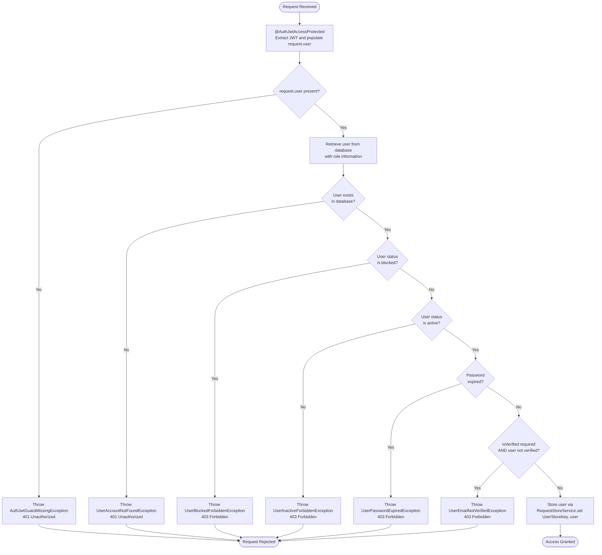
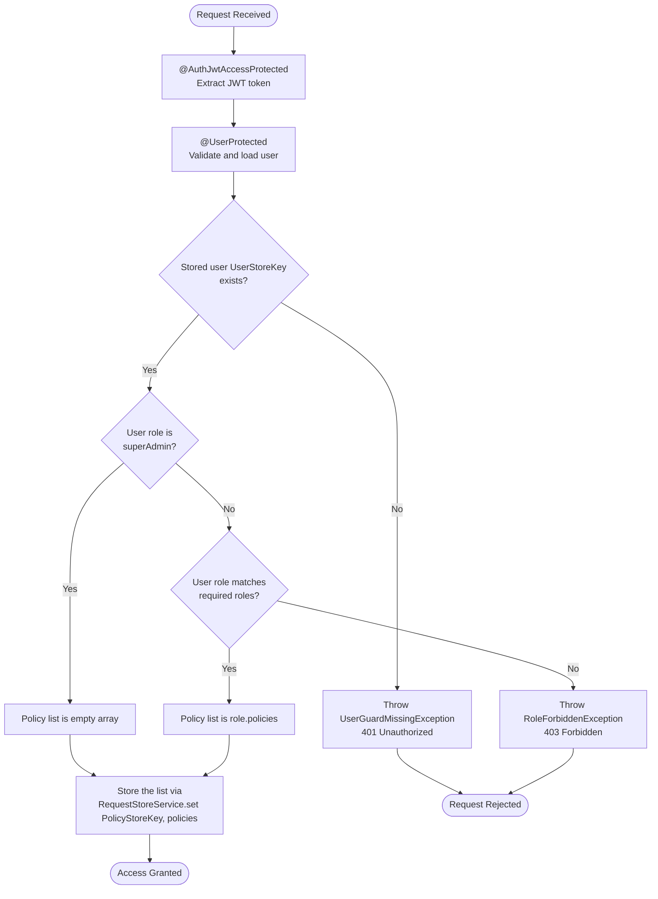
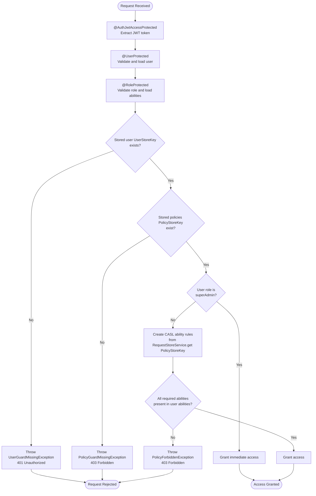
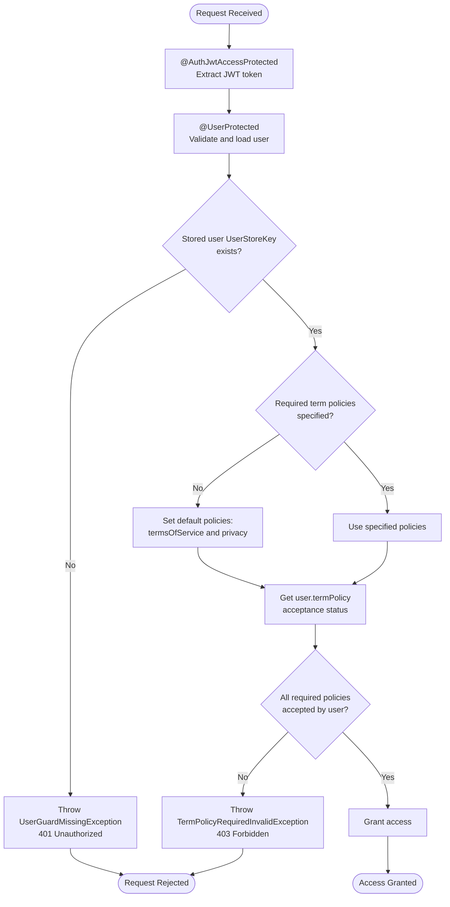
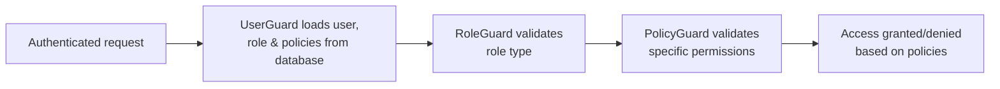

# Authorization Documentation

Decorator locations:

- **UserProtected**: `src/modules/user/decorators`
- **RoleProtected**: `src/modules/role/decorators`
- **PolicyProtected**: `src/modules/policy/decorators`
- **TermPolicyAcceptanceProtected**: `src/modules/term-policy/decorators`

The workspace and project decorators (`WorkspaceProtected`, `WorkspaceMemberProtected`, `ProjectProtected`, `ProjectMemberProtected`) are summarised here and documented in full by [Workspace][ref-doc-workspace] and [Project][ref-doc-project].

## Overview

Guards stack as:

- user
- role
- policy
- term-policy acceptance

NestJS applies each layer on the route handler.

## Related Documents

- [Authentication Documentation][ref-doc-authentication]: JWT, sessions, and API keys
- [Activity Log Documentation][ref-doc-activity-log]: Authz-related activity rows
- [Term Policy Documentation][ref-doc-term-policy]: Acceptance gating
- [Device Documentation][ref-doc-device]: Device revoke and sessions
- [Workspace Documentation][ref-doc-workspace]: Workspace guards and `x-workspace-id`
- [Project Documentation][ref-doc-project]: Project guards and owner bypass
- [Feature Flag Documentation][ref-doc-feature-flag]: `@FeatureFlagProtected` in the stack
- [Security and Middleware Documentation][ref-doc-security-and-middleware]: Rate limits and headers

## Table of Contents

- [Overview](#overview)
- [Related Documents](#related-documents)
- [Decorator Order](#decorator-order)
    - [Missing store entries](#missing-store-entries)
- [User Protected](#user-protected)
    - [Decorators](#decorators)
        - [UserProtected() Decorator](#userprotected-decorator)
        - [UserCurrent() Parameter Decorator](#usercurrent-parameter-decorator)
    - [Guards](#guards)
        - [UserGuard](#userguard)
    - [Important Notes](#important-notes)
- [Role Protected](#role-protected)
    - [Decorators](#decorators-1)
        - [RoleProtected() Decorator](#roleprotected-decorator)
    - [Getting Current Role](#getting-current-role)
    - [Guards](#guards-1)
        - [RoleGuard](#roleguard)
    - [Important Notes](#important-notes-1)
- [Policy Protected](#policy-protected)
    - [Decorators](#decorators-2)
        - [PolicyProtected() Decorator](#policyprotected-decorator)
    - [Guards](#guards-2)
        - [PolicyGuard](#policyguard)
    - [CASL Integration](#casl-integration)
    - [Important Notes](#important-notes-2)
- [Term Policy Acceptance Protected](#term-policy-acceptance-protected)
    - [Decorators](#decorators-3)
        - [TermPolicyAcceptanceProtected() Decorator](#termpolicyacceptanceprotected-decorator)
    - [Guards](#guards-3)
        - [TermPolicyGuard](#termpolicyguard)
    - [Important Notes](#important-notes-3)
- [Workspace and Project Protected](#workspace-and-project-protected)
- [Creating Custom Roles](#creating-custom-roles)
    - [How to Create a New Role](#how-to-create-a-new-role)
    - [Role Configuration](#role-configuration)
    - [Assigning Roles to Users](#assigning-roles-to-users)
    - [Important Notes](#important-notes-4)

## Decorator Order

- Method decorators apply bottom-up, so the decorator written lower in the source registers its guard earlier and that guard runs earlier. The guard nearest the method runs first.
- "Below" and "above" on this page and in the pages linked from it always mean position in the source: a guard written below another runs before it.
- The order encodes which gate rejects first, so a reshuffle changes the error a caller sees even when the application still boots.

Every route uses this order, top to bottom in source:

```typescript
@Doc({ summary: '…' })                     // 1.  OpenAPI operation + global error kit
@Response('example.action')                // 2.  @Response / @ResponsePagination / @ResponseFile
@TermPolicyAcceptanceProtected()           // 3.  Term policy acceptance
@PolicyProtected({ ... })                  // 4.  CASL policy ability
@RoleProtected(EnumRoleType.admin)         // 5.  Role type
@ProjectMemberProtected(...)               // 6.  Project member role
@ProjectProtected()                        // 7.  Project resolution from :projectId
@WorkspaceMemberProtected(...)             // 8.  Workspace member role
@WorkspaceProtected()                      // 9.  Workspace resolution from x-workspace-id
@UserProtected()                           // 10. User status
@FeatureFlagProtected('exampleKey')        // 11. Feature flag
@AuthJwtAccessProtected()                  // 12. JWT access or refresh
@ApiKeyProtected()                         // 13. API key
@HttpCode(HttpStatus.OK)                   // 14. HTTP status, only when it differs from the default
@Get('/endpoint')                          // 15. HTTP method, always last
```

A route takes only the slots it needs, and the relative order of the ones it takes never changes. Guard execution therefore runs:

1. `@ApiKeyProtected()`
2. `@AuthJwtAccessProtected()`
3. `@FeatureFlagProtected()`
4. `@UserProtected()`
5. `@WorkspaceProtected()`
6. `@WorkspaceMemberProtected()`
7. `@ProjectProtected()`
8. `@ProjectMemberProtected()`
9. `@RoleProtected()`
10. `@PolicyProtected()`
11. `@TermPolicyAcceptanceProtected()`

Placement rules:

- A social-login guard (`@AuthSocialGoogleProtected()`, `@AuthSocialAppleProtected()`) sits ABOVE `@FeatureFlagProtected()`, so it runs after the flag guard.
    - A disabled flag answers `FeatureFlagDisabledException` (404, `50601`) before the provider token is verified.
    - The flag guard takes its anonymous branch on those routes.
- `@RequestThrottle({ ... })` sits outside this order. See [Security and Middleware][ref-doc-security-and-middleware].
    - Its `route` tier is read by a global guard, which runs before every route guard.
    - Its `user` switch mounts an interceptor, which runs after every guard.
    - Neither depends on its position in the stack.
    - Routes declare it below `@ApiKeyProtected()`, so the rate limit reads next to the guards protecting the same route.
- Activity logging takes no slot. See [Activity Log][ref-doc-activity-log].
    - Domains build activity logs with `ActivityLogDomain.prepare` and queue them with `ActivityLogDomain.stagePrepared`.
    - The global `ActivityLogInterceptor` writes them after the handler settles.
- A guard that depends on state an earlier guard sets sits ABOVE that guard in source, so it runs after it.
- `@FeatureFlagProtected()` sits ABOVE `@AuthJwtAccessProtected()` so the flag guard runs after JWT and sees `request.user`. Written below it, the flag guard runs first and always takes its anonymous branch, which makes `targetUserIds` and any rollout below 100% inert on that route.
- One guard condition answers one exception and one HTTP status in every guard. A caller who holds no workspace or project membership answers `WorkspaceMemberForbiddenException` or `ProjectMemberForbiddenException` (403), and a missing store entry answers the guard-only exception in [Missing store entries](#missing-store-entries).
- The workspace and project slots are used by the `/user` scope. The `/admin` scope reaches the same resources through `@RoleProtected()` + `@PolicyProtected()` instead, and takes the workspace or project id from the path.

### Missing store entries

Each guard checks, at request time, the store entry that a guard running earlier wrote.

- When the entry is empty, the guard throws the guard-only exception of the missing subject.
- Identity subjects answer 401: the JWT payload, the user, and the API key.
- Authorization subjects answer 403: policies, workspace, workspace member, project, and project member.
- No check for a missing or misordered guard runs when a route is decorated, so such a stack boots and fails on every request, not only the first.
- A decorator argument check still throws when the route is decorated, so a bad argument fails the boot: `RoleProtectedEmptyException`, `PolicyProtectedEmptyException`, `PolicyProtectedActionEmptyException`, and `RequestEnvProtected()` called with no environment.
- The `*Current` and `*Payload` parameter decorators throw the same exception for the same empty entry.

| Guard | Reads | Throws when the entry is empty |
| --- | --- | --- |
| `WorkspaceGuard` | the request workspace id (`RequestWorkspaceIdStoreKey`, written by the global `RequestWorkspaceMiddleware` from `x-workspace-id`, `null` when the header is absent) | `WorkspaceHeaderMissingException` (400, `51621`); the guard has no guard-missing case because it reads no guard's store |
| `ApiKeyXApiKeyTypeGuard` | the API key | `ApiKeyGuardMissingException` (401, `50707`) |
| `UserGuard` | the JWT payload on `request.user` | `AuthJwtGuardMissingException` (401, `50820`) |
| `RoleGuard` | the user | `UserGuardMissingException` (401, `51027`) |
| `PolicyGuard` | the user, then the policy list | `UserGuardMissingException`, then `PolicyGuardMissingException` (403, `51103`) |
| `TermPolicyGuard` | the user | `UserGuardMissingException` |
| `WorkspaceMemberGuard` | the user, then the workspace | `UserGuardMissingException`, then `WorkspaceGuardMissingException` (403, `51622`) |
| `WorkspaceRoleGuard` | the workspace member | `WorkspaceMemberGuardMissingException` (403, `51623`) |
| `ProjectGuard` | the workspace | `WorkspaceGuardMissingException` |
| `ProjectMemberGuard` | the user, then the project | `UserGuardMissingException`, then `ProjectGuardMissingException` (403, `51708`) |
| `ProjectRoleGuard` | the project, then the workspace member | `ProjectGuardMissingException`, then `WorkspaceMemberGuardMissingException` |

The parameter decorators map to the same exceptions:

- `@AuthJwtPayload()`: `AuthJwtGuardMissingException`.
- `@UserCurrent()` and `@RoleCurrent()`: `UserGuardMissingException`.
- `@PolicyCurrent()`: `PolicyGuardMissingException`.
- `@WorkspaceCurrent()` and `@WorkspaceMemberCurrent()`: `WorkspaceGuardMissingException` and `WorkspaceMemberGuardMissingException`.
- `@ProjectCurrent()` and `@ProjectMemberCurrent()`: `ProjectGuardMissingException` and `ProjectMemberGuardMissingException`.
- `@ApiKeyPayload()`: `ApiKeyGuardMissingException`.

A stored value with a `null` field throws `RequestContextMissingException` (500, `50304`) when a decorator asks for that field. See [Status Codes][ref-doc-status-codes] and [Handling Error][ref-doc-handling-error].

## User Protected

- `UserProtected` applies `UserGuard`, which reads the JWT `userId` and loads the user.
- Email verification defaults to on.

### Decorators

#### UserProtected Decorator

**Method decorator** that applies `UserGuard` to route handlers.

**Parameters:**

- `isVerified` (boolean, optional): Whether to require email verification. Default: `true`

**Usage:**

- `@UserProtected()` requires email verification.
- `@UserProtected(false)` skips that check.
- The default is `true`.

Shared profile:

```typescript
@TermPolicyAcceptanceProtected()
@UserProtected()
@AuthJwtAccessProtected()
@ApiKeyProtected()
@RequestThrottle({ user: true })
@Get('/profile/get')
async profile(
  @AuthJwtPayload('userId') userId: string
): Promise<IResponseReturn<IUserProfile>> {
  return this.userProfileHttpService.getProfile(userId);
}
```

#### UserCurrent Parameter Decorator

Reads back the authenticated user `UserGuard` stored, or one of its fields when a field name is passed.

**Returns:** `IUser`, or the named field of it. Both are non-null:

- An empty store key throws `UserGuardMissingException` (401, `51027`).
- A field holding `null` throws `RequestContextMissingException` (500, `50304`).

**Usage:**

Refresh is a call site:

```typescript
@UserProtected()
@AuthJwtRefreshProtected()
@ApiKeyProtected()
@RequestThrottle({ user: true, route: EnumRequestThrottleRoute.relaxed })
@HttpCode(HttpStatus.OK)
@Post('/refresh')
async refresh(
  @UserCurrent() user: IUser,
  @AuthJwtToken() refreshToken: string
): Promise<IResponseReturn<IAuthToken>> {
  return this.userAuthHttpService.refresh(user, refreshToken);
}
```

### Guards

#### `UserGuard`

The guard implementation that performs the actual validation.

The `UserProtected` decorator follows this validation sequence:

1. **Authentication Check**: Verifies that the JWT guard put a payload on `request.user`. Without one the guard throws `AuthJwtGuardMissingException` (401, `50820`)
2. **User Lookup**: Retrieves user from database with role information
3. **User Existence**: Ensures user record exists. A valid token whose user row is gone throws `UserAccountNotFoundException` (401, `51024`)
4. **Blocked Check**: Rejects a user whose status is `blocked`
5. **Status Validation**: Confirms user status is `active`
6. **Password Expiry**: Checks if password has expired
7. **Email Verification**: Validates email verification if required

**Flow Diagram:**


```mermaid
flowchart TD
    Start([Request Received]) --> JwtGuard[ @AuthJwtAccessProtected<br/>Extract JWT and populate request.user]
    JwtGuard --> CheckAuth{request.user present?}
    CheckAuth -->|No| ErrorAuth[Throw AuthJwtGuardMissingException<br/>401 Unauthorized]
    CheckAuth -->|Yes| LookupUser[Retrieve user from database<br/>with role information]

    LookupUser --> UserExists{User exists<br/>in database?}
    UserExists -->|No| ErrorNotFound[Throw UserAccountNotFoundException<br/>401 Unauthorized]
    UserExists -->|Yes| CheckBlocked{User status<br/>is blocked?}

    CheckBlocked -->|Yes| ErrorBlocked[Throw UserBlockedForbiddenException<br/>403 Forbidden]
    CheckBlocked -->|No| CheckStatus{User status<br/>is active?}

    CheckStatus -->|No| ErrorInactive[Throw UserInactiveForbiddenException<br/>403 Forbidden]
    CheckStatus -->|Yes| CheckPassword{Password<br/>expired?}

    CheckPassword -->|Yes| ErrorPassword[Throw UserPasswordExpiredException<br/>403 Forbidden]
    CheckPassword -->|No| CheckVerified{isVerified required<br/>AND user not verified?}

    CheckVerified -->|Yes| ErrorVerified[Throw UserEmailNotVerifiedException<br/>403 Forbidden]
    CheckVerified -->|No| SetUser[Store user via<br/>RequestStoreService.set UserStoreKey, user]

    SetUser --> Success([Access Granted])

    ErrorAuth --> End([Request Rejected])
    ErrorNotFound --> End
    ErrorBlocked --> End
    ErrorInactive --> End
    ErrorPassword --> End
    ErrorVerified --> End
```

### Important Notes

- `@UserProtected()` requires `@AuthJwtAccessProtected()` to run first, so JWT sits below `@UserProtected()` in source (nearest the method). Nest runs guards bottom-up.
- `@AuthJwtAccessProtected()` populates `request.user` from JWT token. See [Authentication Documentation][ref-doc-authentication] for details
- This decorator stores the validated user via `RequestStoreService.set(UserStoreKey, user)` (read back with `RequestStoreService.get(UserStoreKey)`, e.g. by `@UserCurrent()`), which is required by downstream guards
- An unreachable JWKS endpoint answers 503 before this guard runs, and so does a Redis outage while the JWT guard reads the session when Redis is not connected (any other store error there answers 500)

## Role Protected

`RoleProtected` is RBAC: `RoleGuard` accepts only a role type listed on the decorator.

### Decorators

#### RoleProtected Decorator

**Method decorator** that applies `RoleGuard` to route handlers.

**Parameters:**

- `...requiredRoles` (EnumRoleType[]): One or more role types required to access the route
    - Called with none, the decorator throws `RoleProtectedEmptyException` when it is evaluated.

**Available Role Types:**

- `EnumRoleType.superAdmin`: Super administrator with unrestricted access
- `EnumRoleType.admin`: Administrator role
- `EnumRoleType.user`: Standard user role

**Usage:**

```typescript
@TermPolicyAcceptanceProtected()
@PolicyProtected({
  subject: EnumPolicySubject.user,
  action: [EnumPolicyAction.read]
})
@RoleProtected(EnumRoleType.admin)
@UserProtected()
@AuthJwtAccessProtected()
@ApiKeyProtected()
@RequestThrottle({ user: true })
@Get('/list')
async list(
  @Query({ schema: UserListRequestSchema }) query: UserListRequestDto
): Promise<IResponsePaginationReturn<IUserList>> {
  return this.userHttpService.getListOffsetByAdmin(query);
}
```

- The decorator accepts more than one type (`@RoleProtected(EnumRoleType.admin, EnumRoleType.user)`).
- The caller needs one of the listed types.
- Admin user routes pass `EnumRoleType.admin` alone.

**`superAdmin` is absent from every `@RoleProtected()` list.** The guard returns before the required-role list is read for a `superAdmin`, so listing it would grant nothing.

### Getting Current Role

Two parameter decorators read the role:

- `@RoleCurrent(field?)` returns the role `UserGuard` loaded (`IRoleWithPolicies`), or one of its fields: `type`, `name`, `policies`, and the rest. It reads `UserStoreKey`.
    - A missing user throws `UserGuardMissingException` (401, `51027`).
    - A `null` field of the role throws `RequestContextMissingException` (500, `50304`).
- `@PolicyCurrent()` returns the `Policy[]` `RoleGuard` stored under `PolicyStoreKey`.
    - An empty list is a valid value (a `superAdmin`).
    - A route without `@RoleProtected()` stores no list, so the read throws `PolicyGuardMissingException` (403, `51103`).

`@UserCurrent()` also carries the role on the returned `IUser`: `user.role.type`, `user.role.name`, and `user.role.policies`.

### Guards

#### `RoleGuard`

The guard implementation that validates user roles and stashes the role's policies.

The `RoleProtected` decorator follows this validation sequence:

1. **User Validation**: Verifies that the stored user (`RequestStoreService.get(UserStoreKey)`) exists
2. **Role Resolution**: `RoleDomain.validateRoleGuard` returns the policy list to store:
    - A `superAdmin` gets an empty list and no role match runs.
    - Any other caller must hold a required role type, otherwise the guard throws `RoleForbiddenException`. A handler with no required roles matches none, so the guard denies it.
    - A matching caller gets `role.policies`.
3. **Policy Population**: Stores the returned list via `RequestStoreService.set(PolicyStoreKey, policies)` for every caller who passes, `superAdmin` included

**Flow Diagram:**


```mermaid
flowchart TD
    Start([Request Received]) --> JwtGuard[ @AuthJwtAccessProtected<br/>Extract JWT token]
    JwtGuard --> UserGuard[ @UserProtected<br/>Validate and load user]
    UserGuard --> CheckUser{Stored user UserStoreKey<br/>exists?}

    CheckUser -->|No| ErrorUser[Throw UserGuardMissingException<br/>401 Unauthorized]
    CheckUser -->|Yes| CheckSuperAdmin{User role is<br/>superAdmin?}

    CheckSuperAdmin -->|Yes| EmptyPolicies[Policy list is empty array]
    CheckSuperAdmin -->|No| CheckRoleMatch{User role matches<br/>required roles?}

    CheckRoleMatch -->|No| ErrorForbidden[Throw RoleForbiddenException<br/>403 Forbidden]
    CheckRoleMatch -->|Yes| RolePolicies[Policy list is role.policies]

    EmptyPolicies --> SetAbilities[Store the list via<br/>RequestStoreService.set PolicyStoreKey, policies]
    RolePolicies --> SetAbilities
    SetAbilities --> Success([Access Granted])

    ErrorUser --> End([Request Rejected])
    ErrorForbidden --> End
```

### Important Notes

- `@RoleProtected()` reads the user `@UserProtected()` stored, which in turn depends on `@AuthJwtAccessProtected()`
- The stack reads top to bottom `@RoleProtected()` → `@UserProtected()` → `@AuthJwtAccessProtected()`. See [Authentication Documentation][ref-doc-authentication] for `@AuthJwtAccessProtected()` details
- This decorator stores the policy list via `RequestStoreService.set(PolicyStoreKey, policies)` for every caller who passes (read back with `RequestStoreService.get(PolicyStoreKey)`), which is what `PolicyGuard` evaluates
- Without a stored user the guard throws `UserGuardMissingException` (401)
- Users with `superAdmin` role type have unrestricted access to all `@RoleProtected` routes, regardless of the specified required roles. The guard stores an empty policy array for a super admin, so `PolicyGuard` finds a list and never throws `PolicyGuardMissingException` for one; `PolicyDomain.validatePolicyGuard` then returns before it reads the list.

## Policy Protected

- `PolicyProtected` is CASL.
- A policy names an action (`read`, `create`, `update`, `delete`, `manage`) on a subject (`user`, `role`, `session`, and the rest of `EnumPolicySubject`).

### Decorators

#### PolicyProtected Decorator

**Method decorator** that applies `PolicyGuard` to route handlers.

**Parameters:**

- `...requiredPolicies` (PolicyRequestDto[]): One or more `{ subject, action[] }` objects naming the required permissions
    - Called with none, the decorator throws `PolicyProtectedEmptyException` when it is evaluated.
    - A policy with an empty `action` list throws `PolicyProtectedActionEmptyException` when it is evaluated.

**Available Policy Actions:**

- `EnumPolicyAction.manage`: Full control over a subject
- `EnumPolicyAction.read`: Read/view permission
- `EnumPolicyAction.create`: Create new resources
- `EnumPolicyAction.update`: Modify existing resources
- `EnumPolicyAction.delete`: Remove resources

**Available Policy Subjects:**

- `EnumPolicySubject.all`: All resources
- `EnumPolicySubject.apiKey`: API key management
- `EnumPolicySubject.role`: Role management
- `EnumPolicySubject.user`: User management
- `EnumPolicySubject.session`: Session management
- `EnumPolicySubject.activityLog`: Activity logs
- `EnumPolicySubject.passwordHistory`: Password history
- `EnumPolicySubject.termPolicy`: Terms and policies
- `EnumPolicySubject.featureFlag`: Feature flags
- `EnumPolicySubject.device`: Device management
- `EnumPolicySubject.workspace`: Workspace management
- `EnumPolicySubject.project`: Project management
- `EnumPolicySubject.analytic`: Admin analytic dashboard, anomaly, and fraud read routes

**Usage:**

```typescript
@TermPolicyAcceptanceProtected()
@PolicyProtected({
  subject: EnumPolicySubject.user,
  action: [EnumPolicyAction.read]
})
@RoleProtected(EnumRoleType.admin)
@UserProtected()
@AuthJwtAccessProtected()
@ApiKeyProtected()
@RequestThrottle({ user: true })
@Get('/list')
async list(
  @Query({ schema: UserListRequestSchema }) query: UserListRequestDto
): Promise<IResponsePaginationReturn<IUserList>> {
  return this.userHttpService.getListOffsetByAdmin(query);
}

@TermPolicyAcceptanceProtected()
@PolicyProtected({
  subject: EnumPolicySubject.user,
  action: [EnumPolicyAction.read, EnumPolicyAction.update]
})
@RoleProtected(EnumRoleType.admin)
@UserProtected()
@AuthJwtAccessProtected()
@ApiKeyProtected()
@RequestThrottle({ user: true })
@Patch('/update/:userId/status')
async updateStatus(
  @Param('userId', { schema: RequestMongoIdSchema }) userId: string,
  @AuthJwtPayload('userId') updatedBy: string,
  @Body({ schema: UserUpdateStatusRequestSchema }) body: UserUpdateStatusRequestDto
): Promise<IResponseReturn<void>> {
  await this.userHttpService.updateStatusByAdmin(userId, body, updatedBy);

  return {};
}

@TermPolicyAcceptanceProtected()
@PolicyProtected(
  {
    subject: EnumPolicySubject.user,
    action: [EnumPolicyAction.read]
  },
  {
    subject: EnumPolicySubject.session,
    action: [EnumPolicyAction.read, EnumPolicyAction.delete]
  }
)
@RoleProtected(EnumRoleType.admin)
@UserProtected()
@AuthJwtAccessProtected()
@ApiKeyProtected()
@RequestThrottle({ user: true })
@Delete('/revoke/:sessionId')
async revoke(
  @Param('userId', { schema: RequestMongoIdSchema }) userId: string,
  @Param('sessionId', { schema: RequestMongoIdSchema }) sessionId: string,
  @AuthJwtPayload('userId') revokedBy: string
): Promise<IResponseReturn<void>> {
  await this.sessionHttpService.revokeByAdmin(userId, sessionId, revokedBy);

  return {};
}
```

The `revoke` handler lives in `SessionAdminController`, which carries the path `/user/:userId/session` under the admin scope. `:userId` comes from that controller path, and the full route is `DELETE /admin/user/:userId/session/revoke/:sessionId`.

### Guards

#### `PolicyGuard`

The guard reads the user and the stored policies off the request store and hands both to `PolicyDomain.validatePolicyGuard`, which evaluates them through CASL.

The `PolicyProtected` decorator follows this validation sequence:

1. **User Validation**: Verifies that the stored user (`RequestStoreService.get(UserStoreKey)`) exists
2. **Policy List Validation**: Verifies that `RoleGuard` stored a policy list (`RequestStoreService.get(PolicyStoreKey)`). An empty list is valid
3. **Super Admin Bypass**: If user role is `superAdmin`, grants immediate access
4. **Ability Creation**: Creates CASL ability rules from the stored policies
5. **Permission Validation**: Checks that every required `(subject, action)` pair is allowed. An empty policy list or an empty action list is denied
6. **Access Decision**: Grants or denies access based on permission match

**Flow Diagram:**


```mermaid
flowchart TD
    Start([Request Received]) --> JwtGuard[ @AuthJwtAccessProtected<br/>Extract JWT token]
    JwtGuard --> UserGuard[ @UserProtected<br/>Validate and load user]
    UserGuard --> RoleGuard[ @RoleProtected<br/>Validate role and load abilities]
    RoleGuard --> CheckUser{Stored user UserStoreKey<br/>exists?}

    CheckUser -->|No| ErrorUser[Throw UserGuardMissingException<br/>401 Unauthorized]
    CheckUser -->|Yes| CheckPolicies{Stored policies PolicyStoreKey<br/>exist?}

    CheckPolicies -->|No| ErrorPolicies[Throw PolicyGuardMissingException<br/>403 Forbidden]
    CheckPolicies -->|Yes| CheckSuperAdmin{User role is<br/>superAdmin?}

    CheckSuperAdmin -->|Yes| GrantSuperAdmin[Grant immediate access]
    CheckSuperAdmin -->|No| CreateAbilities[Create CASL ability rules<br/>from RequestStoreService.get PolicyStoreKey]

    CreateAbilities --> ValidateAbilities{All required abilities<br/>present in user abilities?}

    ValidateAbilities -->|No| ErrorForbidden[Throw PolicyForbiddenException<br/>403 Forbidden]
    ValidateAbilities -->|Yes| GrantAccess[Grant access]

    GrantSuperAdmin --> Success([Access Granted])
    GrantAccess --> Success

    ErrorUser --> End([Request Rejected])
    ErrorPolicies --> End
    ErrorForbidden --> End
```

### CASL Integration

The project uses [CASL][casl] for permission checks:

**PolicyAbilityFactory:**

- `createByUser(policies)`: Builds CASL ability rules from the role's stored policies
- `handlerPolicies(userPolicies, policies)`: Returns true only when at least one policy is required and every required action on each subject is allowed, using CASL's `can()`. An empty policy list or an empty action list returns false

### Important Notes

- `@PolicyProtected()` reads the policies `@RoleProtected()` stored and the user `@UserProtected()` stored, both of which depend on `@AuthJwtAccessProtected()`
- The stack reads top to bottom `@PolicyProtected()` → `@RoleProtected()` → `@UserProtected()` → `@AuthJwtAccessProtected()`. See [Authentication Documentation][ref-doc-authentication] for `@AuthJwtAccessProtected()` details
- Without a stored user the guard throws `UserGuardMissingException` (401), and without a stored policy list `PolicyGuardMissingException` (403)
- Users with `superAdmin` role type have unrestricted access to all `@PolicyProtected` routes, bypassing all ability checks.
- Access needs every action of a required policy in the user's policies. Requiring `[EnumPolicyAction.update, EnumPolicyAction.delete]` on the `EnumPolicySubject.user` subject grants access only when the user holds both actions.

## Term Policy Acceptance Protected

`TermPolicyAcceptanceProtected` rejects the request until the user has accepted the required policies (Terms of Service, Privacy Policy, and the rest of the set).

Details: [Term Policy Documentation][ref-doc-term-policy].

### Decorators

#### TermPolicyAcceptanceProtected Decorator

**Method decorator** that applies `TermPolicyGuard` to route handlers.

**Parameters:**

- `...requiredTermPolicies` (EnumTermPolicyType[], optional): One or more term policy types the guard checks for acceptance. Defaults to `termsOfService` and `privacy`

**Available Term Policy Types:**

- `EnumTermPolicyType.termsOfService`: Terms of Service acceptance
- `EnumTermPolicyType.privacy`: Privacy Policy acceptance
- `EnumTermPolicyType.cookies`: Cookies Policy acceptance
- `EnumTermPolicyType.marketing`: Marketing consent acceptance

**Usage:**

```typescript
@TermPolicyAcceptanceProtected()
@UserProtected()
@AuthJwtAccessProtected()
@ApiKeyProtected()
@RequestThrottle({ user: true })
@Get('/acceptance/list')
async listAccepted(
  @Query({ schema: TermPolicyAcceptedListRequestSchema })
  query: TermPolicyAcceptedListRequestDto,
  @AuthJwtPayload('userId') userId: string
): Promise<IResponsePaginationReturn<ITermPolicyUserAcceptance>> {
  return this.termPolicyAcceptanceHttpService.getListUserAccepted(
    userId,
    query
  );
}
```

- The decorator takes optional `EnumTermPolicyType` arguments.
- With none, it requires `termsOfService` and `privacy`.
- Shared and admin routes pass no arguments.

### Guards

#### `TermPolicyGuard`

The guard implementation that validates user term policy acceptance.

The `TermPolicyAcceptanceProtected` decorator follows this validation sequence:

1. **User Validation**: Verifies that the stored user (`RequestStoreService.get(UserStoreKey)`) exists
2. **Default Policy Check**: If no required policies specified, sets defaults to `termsOfService` and `privacy`
3. **Term Policy Lookup**: Retrieves user's term policy acceptance status from the stored user's `termPolicy`
4. **Acceptance Validation**: Checks if all required term policies are accepted
5. **Access Decision**: Grants access only if all required policies are accepted

**Flow Diagram:**


```mermaid
flowchart TD
    Start([Request Received]) --> JwtGuard[ @AuthJwtAccessProtected<br/>Extract JWT token]
    JwtGuard --> UserGuard[ @UserProtected<br/>Validate and load user]
    UserGuard --> CheckUser{Stored user UserStoreKey<br/>exists?}

    CheckUser -->|No| ErrorUser[Throw UserGuardMissingException<br/>401 Unauthorized]
    CheckUser -->|Yes| CheckRequired{Required term policies<br/>specified?}

    CheckRequired -->|No| SetDefault[Set default policies:<br/>termsOfService and privacy]
    CheckRequired -->|Yes| UseSpecified[Use specified policies]

    SetDefault --> GetTermPolicy[Get user.termPolicy<br/>acceptance status]
    UseSpecified --> GetTermPolicy

    GetTermPolicy --> CheckAcceptance{All required policies<br/>accepted by user?}

    CheckAcceptance -->|No| ErrorRequired[Throw TermPolicyRequiredInvalidException<br/>403 Forbidden]
    CheckAcceptance -->|Yes| GrantAccess[Grant access]

    GrantAccess --> Success([Access Granted])

    ErrorUser --> End([Request Rejected])
    ErrorRequired --> End
```

### Important Notes

- `@TermPolicyAcceptanceProtected()` reads the user `@UserProtected()` stored, which depends on `@AuthJwtAccessProtected()`
- Decorator order from top to bottom: `@TermPolicyAcceptanceProtected()` → `@UserProtected()` → `@AuthJwtAccessProtected()`
- For more details about `@AuthJwtAccessProtected()`, see [Authentication Documentation][ref-doc-authentication]
- Without the required decorators the stored user is never populated, so the guard throws `UserGuardMissingException` (401 Unauthorized)
- `POST /user/term-policy/accept` and `POST /user/refresh` carry no `@TermPolicyAcceptanceProtected()`, so a caller who has not accepted the policies can accept them and refresh the token
- If no term policies are specified, it defaults to requiring `termsOfService` and `privacy` acceptance
- Access is granted only when the user has accepted every specified term policy

## Workspace and Project Protected

- Four decorators scope a `/user` request to one workspace and, inside it, to one project.
- They occupy slots 6-9 of the source-order listing under [Decorator Order](#decorator-order) and are documented in full by the modules that own them.

| Decorator | Guards it binds | Selects the resource from |
| --- | --- | --- |
| `@WorkspaceProtected()` | `WorkspaceGuard` | The `x-workspace-id` header |
| `@WorkspaceMemberProtected(...roles)` | `WorkspaceMemberGuard`, plus `WorkspaceRoleGuard` when roles are given | The membership of the resolved workspace |
| `@ProjectProtected()` | `ProjectGuard` | The `:projectId` route param, constrained to the resolved workspace |
| `@ProjectMemberProtected(...roles)` | `ProjectMemberGuard` with no arguments, `ProjectRoleGuard` with roles | The membership of the resolved project |

Resolution answers:

- An absent `x-workspace-id` header answers `WorkspaceHeaderMissingException` (400, `51621`).
- A malformed workspace id, or one naming no active workspace, answers `WorkspaceNotFoundException` (404, `51600`).
- A caller with no membership in the workspace answers `WorkspaceMemberForbiddenException` (403).
- A caller whose workspace role is not in the `@WorkspaceMemberProtected(...roles)` list answers `WorkspaceRoleForbiddenException` (403, `51602`). A workspace `owner` passes every role list.
- A malformed `:projectId`, or one naming no active project in the workspace, answers `ProjectNotFoundException` (404, `51700`).
- `@ProjectMemberCurrent()` reads the row only on the role-less `@ProjectMemberProtected()`; a role-gated route stores no row and the read throws `ProjectMemberGuardMissingException` (403).

Three properties matter wherever these appear:

- **Each guard reads what the previous one stored and never re-fetches or re-authenticates.** Dropping one from the stack leaves the next reading an empty store entry, which answers the guard-only exception of the missing subject (see [Missing store entries](#missing-store-entries)).
- **A workspace `owner` is privileged.** It satisfies every workspace role, and it reaches every project in the workspace without holding a `ProjectMember` row.
- **The `/admin` scope takes none of them.** Admin routes reach the same resources through `@RoleProtected()` + `@PolicyProtected()` and take the workspace or project id from the path.

For the guard bodies, the exceptions and status codes each one throws, the store keys, and the `@WorkspaceCurrent()` / `@ProjectCurrent()` parameter decorators, see [Workspace][ref-doc-workspace] and [Project][ref-doc-project].

## Creating Custom Roles

- The boilerplate supports creating custom roles through the role management API.
- A role carries a set of policies, each naming one subject and the actions allowed on it.
- A custom role is any role other than `superAdmin`, `admin`, and `user`.
- Examples: ContentModerator, Accountant, CustomerSupport.

### How to Create a New Role

- A role and its policies are two separate admin surfaces.
    - `POST /admin/role/create` creates the role.
    - `POST /admin/role/:roleId/policy/create` attaches one policy to it.
- The API documentation is available in your Swagger docs at `/docs`.

**Basic steps:**

1. Authenticate as an admin user
2. Call the role creation endpoint with name, type, and description
3. Call the policy creation endpoint once per subject the role may reach
4. The role is available for assignment to users as soon as it exists

**Example role creation request** (`POST /admin/role/create`):

```json
{
    "name": "contentmoderator",
    "description": "Role for moderating user-generated content",
    "type": "admin"
}
```

**Example policy creation request** (`POST /admin/role/:roleId/policy/create`), one call per subject:

```json
{
    "subject": "user",
    "action": ["read", "update"]
}
```

### Role Configuration

**Role Properties:**

- **name**: Unique identifier for the role (alphanumeric, lowercase, 3-30 characters)
- **description**: Optional description explaining the role's purpose (max 500 characters)
- **type**: Role type from `EnumRoleType` (superAdmin, admin, or user)

**Policy Structure:**

Each policy row consists of:

- **subject**: The resource type (e.g., user, role, apiKey, session, termPolicy, activityLog, analytic)
- **action**: Array of allowed actions (manage, read, create, update, delete)

A role holds at most one policy per subject: creating a second policy for a subject already covered is rejected.

**Available subjects and actions are defined in:**

- `EnumPolicySubject`: all, apiKey, role, user, session, activityLog, passwordHistory, termPolicy, featureFlag, device, workspace, project, analytic
- `EnumPolicyAction`: manage, read, create, update, delete

### Assigning Roles to Users

Once a custom role is created, it can be assigned to users through:

1. **User creation**: Specify the `roleId` in `POST /admin/user/create`

No admin route changes the role of an existing user.

**How it works automatically:**

- When a user is assigned a role, they immediately inherit every policy attached to that role
- `UserGuard` loads the user with its role and the role's policies on every request
- `RoleGuard` checks the role type and stores the policies
- `PolicyGuard` validates permissions against the stored policies
- No application restart or additional configuration is needed

**Permission enforcement flow:**


```mermaid
flowchart LR
    User[Authenticated request] --> LoadRole[UserGuard loads user,<br/>role & policies from database]
    LoadRole --> RoleGuard[RoleGuard validates<br/>role type]
    RoleGuard --> PolicyGuard[PolicyGuard validates<br/>specific permissions]
    PolicyGuard --> Access[Access granted/denied<br/>based on policies]
```

### Important Notes

- **Role names are unique**: creating a second role with an existing name is rejected
- **A role in use cannot be deleted**: deletion is rejected (`RoleUsedException`) while any user holds the role

<!-- REFERENCES -->

[casl]: https://casl.js.org/
[ref-doc-authentication]: authentication.md
[ref-doc-security-and-middleware]: security-and-middleware.md
[ref-doc-activity-log]: activity-log.md
[ref-doc-term-policy]: term-policy.md
[ref-doc-device]: device.md
[ref-doc-workspace]: workspace.md
[ref-doc-project]: project.md
[ref-doc-feature-flag]: feature-flag.md
[ref-doc-status-codes]: status-codes.md
[ref-doc-handling-error]: handling-error.md
