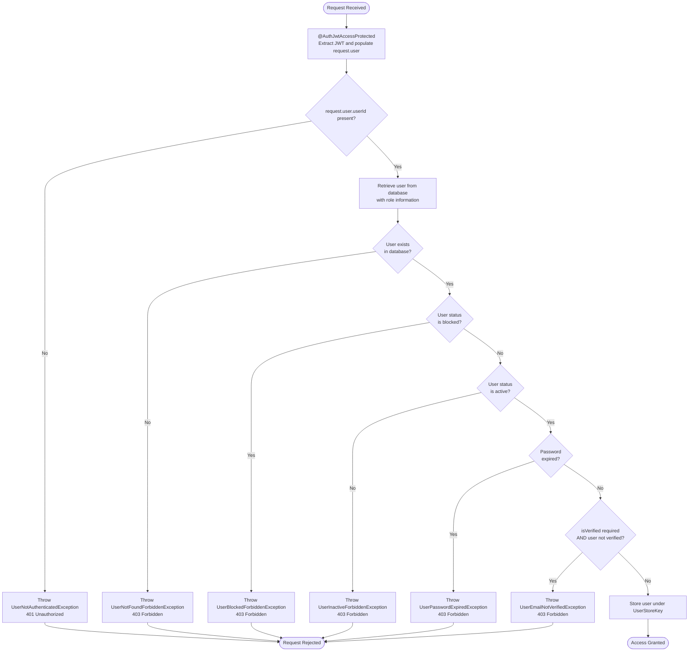
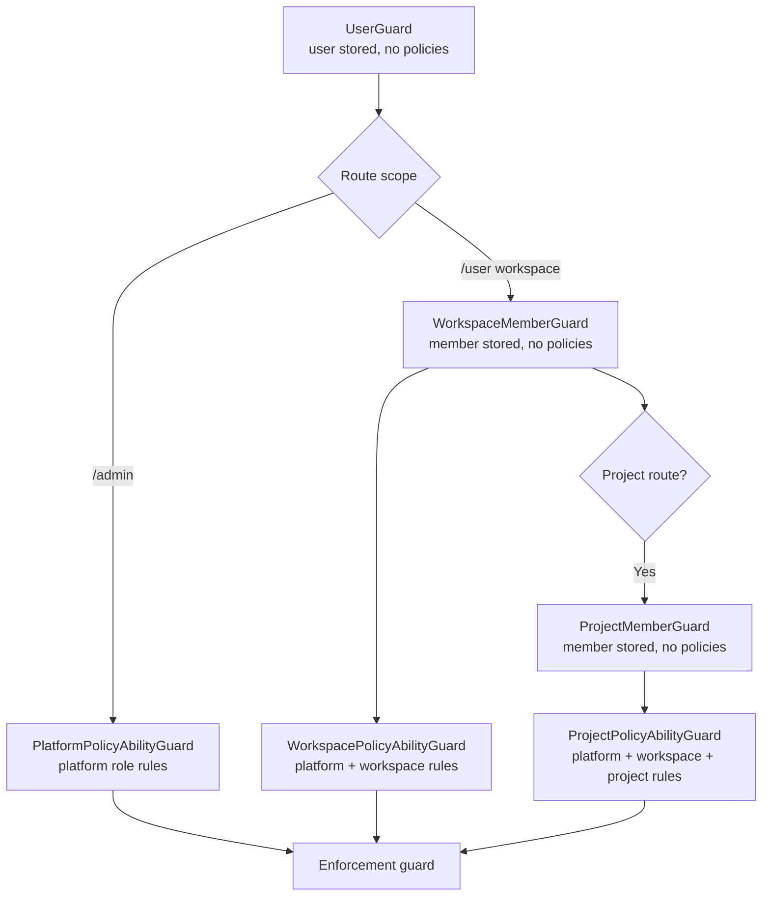
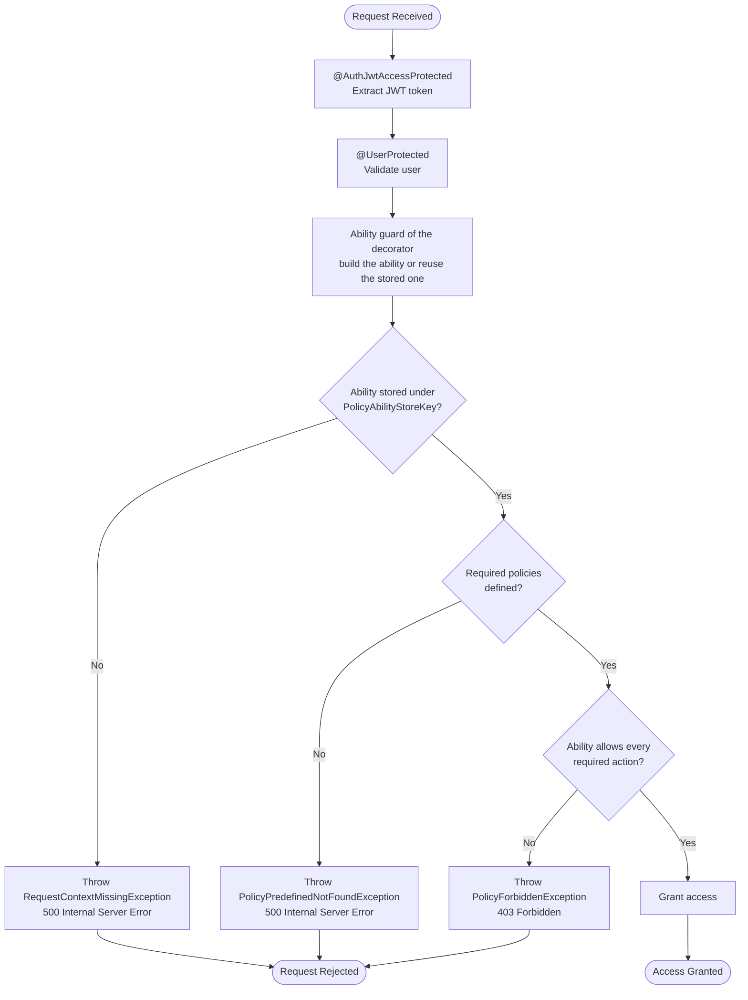
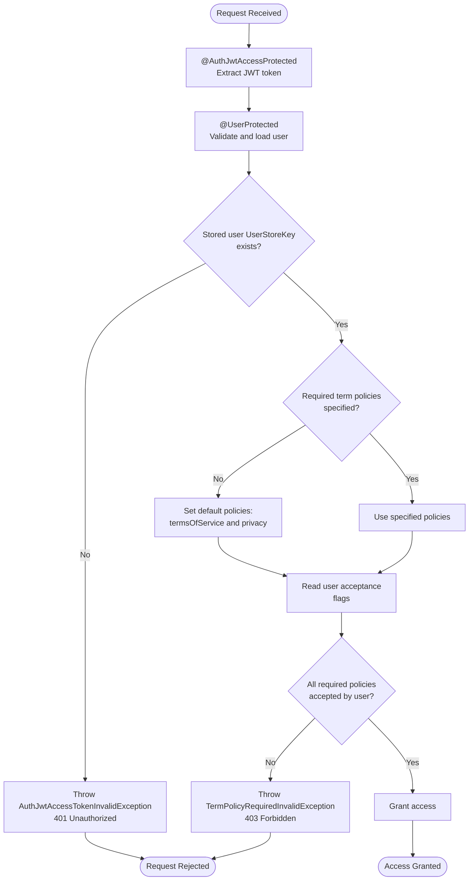
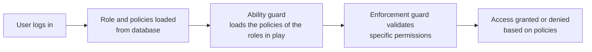

# Authorization Documentation

Decorator locations:

- **UserProtected**: `src/modules/user/decorators`
- **PlatformPolicyProtected**, **PolicyAbilityProtected**: `src/modules/policy/decorators`
- **WorkspacePolicyProtected**, **WorkspaceMemberPolicyProtected**, **WorkspaceSubjectPolicyProtected**: `src/modules/workspace/decorators`
- **ProjectPolicyProtected**, **ProjectMemberPolicyProtected**: `src/modules/project/decorators`
- **TermPolicyAcceptanceProtected**: `src/modules/term-policy/decorators`

The workspace and project decorators (`WorkspaceProtected`, `WorkspaceMemberProtected`, `ProjectProtected`, `ProjectMemberProtected` and the policy decorators above) are summarised here and documented in full by [Workspace][ref-doc-workspace] and [Project][ref-doc-project].

## Overview

Authorization is CASL only. Guards stack as:

- user (authenticates and stores the user; loads no policies)
- workspace and project resolution and membership (store the resource and the member rows; load no policies)
- policy ability guard (builds the request ability from the role policies of one scope)
- policy enforcement guard (decides against the ability)
- term-policy acceptance

NestJS applies each layer on the route handler. A role decides nothing by itself: it is a named set of policies, and an ability guard turns the policies of the roles in play into one CASL ability that an enforcement guard evaluates. A route that carries no policy decorator loads no policies and builds no ability.

## Related Documents

- [Authentication Documentation][ref-doc-authentication] - JWT, sessions, and API keys
- [Activity Log Documentation][ref-doc-activity-log] - Authz-related activity rows
- [Term Policy Documentation][ref-doc-term-policy] - Acceptance gating
- [Device Documentation][ref-doc-device] - Device revoke and sessions
- [Workspace Documentation][ref-doc-workspace] - Workspace guards and `x-workspace-id`
- [Project Documentation][ref-doc-project] - Project guards and project roles
- [Feature Flag Documentation][ref-doc-feature-flag] - `@FeatureFlagProtected` in the stack
- [Security and Middleware Documentation][ref-doc-security-and-middleware] - Rate limits and headers

## Table of Contents

- [Overview](#overview)
- [Related Documents](#related-documents)
- [Decorator Order](#decorator-order)
- [User Protected](#user-protected)
  - [Decorators](#decorators)
    - [UserProtected() Decorator](#userprotected-decorator)
    - [UserCurrent() Parameter Decorator](#usercurrent-parameter-decorator)
  - [Guards](#guards)
    - [UserGuard](#userguard)
  - [Important Notes](#important-notes)
- [Roles and the Request Ability](#roles-and-the-request-ability)
- [Policy Protected](#policy-protected)
  - [Decorators](#decorators-2)
    - [PlatformPolicyProtected() Decorator](#platformpolicyprotected-decorator)
    - [Scoped Policy Decorators](#scoped-policy-decorators)
  - [Guards](#guards-2)
    - [Ability Guards](#ability-guards)
    - [PolicyGuard](#policyguard)
  - [CASL Integration](#casl-integration)
  - [Important Notes](#important-notes-2)
- [Term Policy Acceptance Protected](#term-policy-acceptance-protected)
  - [Decorators](#decorators-3)
    - [TermPolicyAcceptanceProtected() Decorator](#termpolicyacceptanceprotected-decorator)
  - [Guards](#guards-3)
    - [TermPolicyGuard](#termpolicyguard)
  - [Important Notes](#important-notes-3)
- [Workspace and Project Protected](#workspace-and-project-protected)
- [Role Catalog and Policies](#role-catalog-and-policies)
  - [Role Catalog](#role-catalog)
  - [Managing Roles and Policies](#managing-roles-and-policies)
  - [Assigning Roles](#assigning-roles)
  - [Important Notes](#important-notes-4)

## Decorator Order

NestJS evaluates stacked decorators bottom-up, so the guard NEAREST the method executes FIRST. The order encodes which gate rejects first, so a reshuffle changes the error a caller sees even when the application still boots. Every route uses this order, top to bottom in source:

```typescript
@Doc({ summary: '…' })                     // 1.  OpenAPI operation + global error kit
@Response('example.action')                // 2.  @Response / @ResponsePagination / @ResponseFile
@TermPolicyAcceptanceProtected()           // 3.  Term policy acceptance
@PlatformPolicyProtected({ ... })          // 4.  One policy decorator: ability guard + enforcement guard
@ProjectMemberProtected(...)               // 5.  Project membership
@ProjectProtected()                        // 6.  Project resolution from :projectId
@WorkspaceMemberProtected()                // 7.  Workspace membership
@WorkspaceProtected()                      // 8.  Workspace resolution from x-workspace-id
@UserProtected()                           // 9.  User status
@FeatureFlagProtected('exampleKey')        // 10. Feature flag
@AuthJwtAccessProtected()                  // 11. JWT access or refresh
@ApiKeyProtected()                         // 12. API key
@HttpCode(HttpStatus.OK)                   // 13. HTTP status, only when it differs from the default
@Get('/endpoint')                          // 14. HTTP method, always last
```

A route takes only the slots it needs; the relative order of the ones it takes never changes. Guard execution therefore runs `@ApiKeyProtected()` → `@AuthJwtAccessProtected()` → `@FeatureFlagProtected()` → `@UserProtected()` → `@WorkspaceProtected()` → `@WorkspaceMemberProtected()` → `@ProjectProtected()` → `@ProjectMemberProtected()` → the policy decorator (ability guard, then enforcement guard) → `@TermPolicyAcceptanceProtected()`.

- A social-login guard (`@AuthSocialGoogleProtected()`) takes the JWT slot for that route.
- `@RequestThrottle({ ... })` sits outside this order. It mounts an interceptor, so it runs after every guard whatever its position in the stack. Routes declare it below `@ApiKeyProtected()`, so the rate limit reads next to the guards protecting the same route. See [Security and Middleware][ref-doc-security-and-middleware].
- Activity logging takes no slot. Domains build events with `ActivityLogDomain.prepare` and queue them with `ActivityLogDomain.stagePrepared`, and the global `ActivityLogInterceptor` writes them after the handler settles. See [Activity Log][ref-doc-activity-log].
- A guard that depends on state an earlier guard sets sits ABOVE that guard in source, so it runs after it.
- `@FeatureFlagProtected()` sits ABOVE `@AuthJwtAccessProtected()` so the flag guard sees `request.user`. Below it the guard always takes its anonymous branch, which makes `targetUserIds` and any rollout below 100% inert on that route.
- Slot 4 takes one of `@PlatformPolicyProtected`, `@WorkspacePolicyProtected`, `@WorkspaceMemberPolicyProtected`, `@WorkspaceSubjectPolicyProtected`, `@ProjectPolicyProtected`, `@ProjectMemberPolicyProtected`, or `@PolicyAbilityProtected(scope)`. Each composes the ability guard of its scope with its enforcement guard.
- The workspace and project slots are used by the `/user` scope. The `/admin` scope reaches the same resources through `@PlatformPolicyProtected()`, which evaluates the caller's platform role policies, and takes the workspace or project id from the path. An admin route that judges a workspace record writes `@WorkspacePolicyProtected()` above `@PlatformPolicyProtected()`, so the platform ability is stored first and the workspace decorator reuses it.

## User Protected

`UserProtected` applies `UserGuard`, which reads the JWT `userId`, loads the user with its platform role, and stores the user under `UserStoreKey`. It authenticates only: it loads no policies and builds no ability. Email verification defaults to on.

### Decorators

#### UserProtected Decorator

**Method decorator** that applies `UserGuard` to route handlers.

**Parameters:**
- `isVerified` (boolean, optional): Whether to require email verification. Default: `true`

**Usage:**

`@UserProtected()` requires email verification. `@UserProtected(false)` skips that check. The default is `true`. Shared profile:

```typescript
@TermPolicyAcceptanceProtected()
@UserProtected()
@AuthJwtAccessProtected()
@Get('/profile/get')
async profile(
  @AuthJwtPayload('userId') userId: string
): Promise<IResponseReturn<IUserProfile>> {
  return this.userProfileHttpService.getProfile(userId);
}
```

#### UserCurrent Parameter Decorator

Reads back the authenticated user `UserGuard` stored, or one of its fields when a field name is passed.

**Returns:** `IUser`, or the named field of it. Both are non-null: an empty store key, or a field holding `null`, throws `RequestContextMissingException` (500, `50304`).

**Usage:**

Refresh is a call site:

```typescript
@UserProtected()
@AuthJwtRefreshProtected()
@Post('/refresh')
async refresh(
  @UserCurrent() user: IUser,
  @AuthJwtToken() refreshToken: string
): Promise<IResponseReturn<IAuthToken>> {
  return this.userAuthHttpService.refresh(user, refreshToken);
}
```

### Guards

#### `UserGuard`

The guard implementation that performs the actual validation.

The `UserProtected` decorator follows this validation sequence:

1. **Authentication Check**: Verifies that the JWT strategy put a `userId` on `request.user`
2. **User Lookup**: Retrieves user from database with role information
3. **User Existence**: Ensures user record exists
4. **Blocked Check**: Rejects a user whose status is `blocked`
5. **Status Validation**: Confirms user status is `active`
6. **Password Expiry**: Checks if password has expired
7. **Email Verification**: Validates email verification if required
8. **Role Scope**: Confirms the user's role has `platform` scope
9. **Store**: Stores the user under `UserStoreKey`

**Flow Diagram:**


```mermaid
flowchart TD
    Start([Request Received]) --> JwtGuard[ @AuthJwtAccessProtected<br/>Extract JWT and populate request.user]
    JwtGuard --> CheckAuth{request.user.userId present?}
    CheckAuth -->|No| ErrorAuth[Throw UserNotAuthenticatedException<br/>401 Unauthorized]
    CheckAuth -->|Yes| LookupUser[Retrieve user from database<br/>with role information]
    
    LookupUser --> UserExists{User exists<br/>in database?}
    UserExists -->|No| ErrorNotFound[Throw UserNotFoundForbiddenException<br/>403 Forbidden]
    UserExists -->|Yes| CheckBlocked{User status<br/>is blocked?}
    
    CheckBlocked -->|Yes| ErrorBlocked[Throw UserBlockedForbiddenException<br/>403 Forbidden]
    CheckBlocked -->|No| CheckStatus{User status<br/>is active?}
    
    CheckStatus -->|No| ErrorInactive[Throw UserInactiveForbiddenException<br/>403 Forbidden]
    CheckStatus -->|Yes| CheckPassword{Password<br/>expired?}
    
    CheckPassword -->|Yes| ErrorPassword[Throw UserPasswordExpiredException<br/>403 Forbidden]
    CheckPassword -->|No| CheckVerified{isVerified required<br/>AND user not verified?}
    
    CheckVerified -->|Yes| ErrorVerified[Throw UserEmailNotVerifiedException<br/>403 Forbidden]
    CheckVerified -->|No| SetUser[Store user under UserStoreKey]
    
    SetUser --> Success([Access Granted])
    
    ErrorAuth --> End([Request Rejected])
    ErrorNotFound --> End
    ErrorBlocked --> End
    ErrorInactive --> End
    ErrorPassword --> End
    ErrorVerified --> End
```

### Important Notes

- `@UserProtected()` requires `@AuthJwtAccessProtected()` to run first, so JWT sits below `@UserProtected()` in source (nearest the method). Nest runs guards bottom-up.
- `@AuthJwtAccessProtected()` populates `request.user` from JWT token. See [Authentication Documentation][ref-doc-authentication] for details
- This decorator stores the validated user via `RequestStoreService.set(UserStoreKey, user)` (read back with `RequestStoreService.get(UserStoreKey)`, e.g. by `@UserCurrent()`). The stored user carries its platform `role` row without policies

## Roles and the Request Ability

One `Role` model covers every level. A role has a `scope` (`platform`, `workspace`, or `project`), an immutable `key`, and a `name` and `description` an admin edits. The pair `(scope, key)` is unique. The role a user, a workspace member, or a project member holds is a foreign key (`roleId`) to that model, and each role owns the policies that define what it may do.

No decorator gates a route by role. The role reaches a route through the request ability: a policy decorator selects one of three fixed ability scopes, and the ability guard of that scope loads the policies of the roles in play and composes them into one CASL ability.

| Ability scope | Guard | Policies loaded, in composition order |
|---|---|---|
| `platform` | `PlatformPolicyAbilityGuard` | The platform role of the authenticated user |
| `workspace` | `WorkspacePolicyAbilityGuard` | The platform role, then the workspace role of the acting workspace member |
| `project` | `ProjectPolicyAbilityGuard` | The platform role, then the workspace role of the acting workspace member, then the project role of the acting project member when the caller has one |

`PolicyAbilityDomain.buildAbility` (a domain, not a service) loads each role's policies through the policy repository, resolves the placeholders that layer owns, and passes the concatenated rules to `PolicyAbilityFactory.build`. The factory adds every allowing rule before every inverted rule, so a matching inverted rule is authoritative whichever role holds it. An absent rule does not revoke a broader allow; a narrowing role uses an explicit inverted rule.

The ability is stored under `PolicyAbilityStoreKey`. An ability guard that finds a stored ability returns without loading or overwriting anything, so stacked policy decorators share the first ability built for the request.


```mermaid
flowchart TD
    User[UserGuard<br/>user stored, no policies] --> Route{Route scope}
    Route -->|/admin| PA[PlatformPolicyAbilityGuard<br/>platform role rules]
    Route -->|/user workspace| WM[WorkspaceMemberGuard<br/>member stored, no policies]
    WM --> WA[WorkspacePolicyAbilityGuard<br/>platform + workspace rules]
    WM --> PM{Project route?}
    PM -->|Yes| PMG[ProjectMemberGuard<br/>member stored, no policies]
    PMG --> PJA[ProjectPolicyAbilityGuard<br/>platform + workspace + project rules]
    PA --> Enforce[Enforcement guard]
    WA --> Enforce
    PJA --> Enforce
```

Reading the current role: `@UserCurrent()` returns the stored `IUser`, whose `role` is the `Role` row (`id`, `scope`, `key`, `name`, `description`, and audit columns) without its policies. `@WorkspaceMemberCurrent()` returns the workspace member with its role (`id`, `scope`, `key`, `name`, no policies). `@ProjectMemberCurrent()` returns the project member with its role (`id`, `scope`, `key`, `name`, no policies).

A domain or HTTP service that has to branch on a capability reads the ability from `PolicyAbilityStoreKey` and calls `ability.can(action, subject)`, which answers `true` or `false`. `PolicyDomain.assertCan(ability, action, target)` throws `PolicyForbiddenException` (403, `51100`) instead, carrying the `reason` of the matched inverted rule when one exists. `target` is a subject name for a type-level check, or a record tagged with `PolicyUtil.toSubject(subject, record)` for a record check.

`superAdmin` holds a persisted policy `manage` on `all`. That row is what lets it pass every enforcement guard, and the policies of the `superAdmin` role cannot be created, updated, or deleted (`PolicyImmutableException`, 403, `51104`). The platform `admin` role holds an explicit subject list, not `all`.

## Policy Protected

A policy decorator is CASL. A policy names an action (`read`, `create`, `update`, `delete`, `manage`) on a subject (`User`, `Role`, `Session`, and the rest of `EnumPolicySubject`).

### Decorators

#### PlatformPolicyProtected Decorator

**Method decorator** that applies `PlatformPolicyAbilityGuard` and `PolicyGuard` to route handlers, and documents the `403` and `500` policy error responses.

**Parameters:**
- `...requiredPolicies` (IPolicyRequired[]): One or more `{ subject, action[] }` objects naming the required permissions

**Available Policy Actions:**
- `EnumPolicyAction.manage` - Full control over a subject
- `EnumPolicyAction.read` - Read/view permission
- `EnumPolicyAction.create` - Create new resources
- `EnumPolicyAction.update` - Modify existing resources
- `EnumPolicyAction.delete` - Remove resources

**Available Policy Subjects:**
- `EnumPolicySubject.all` - All resources
- `EnumPolicySubject.ApiKey` - API key management
- `EnumPolicySubject.Role` - Role management
- `EnumPolicySubject.User` - User management
- `EnumPolicySubject.Session` - Session management
- `EnumPolicySubject.ActivityLog` - Activity logs
- `EnumPolicySubject.PasswordHistory` - Password history
- `EnumPolicySubject.TermPolicy` - Terms and policies
- `EnumPolicySubject.FeatureFlag` - Feature flags
- `EnumPolicySubject.Device` - Device management
- `EnumPolicySubject.Workspace` - Workspace management
- `EnumPolicySubject.Project` - Project management
- `EnumPolicySubject.analytic` - Admin analytic dashboard, anomaly, and fraud read routes, and the workspace analytic routes
- `EnumPolicySubject.WorkspaceMember` - Workspace member list, role change, and removal
- `EnumPolicySubject.WorkspaceInvite` - Workspace invite create, resend, and revoke
- `EnumPolicySubject.WorkspaceJoinRequest` - Workspace join request accept and reject
- `EnumPolicySubject.ProjectMember` - Project member assign, role change, and removal

**Usage:**

```typescript
@PlatformPolicyProtected({
  subject: EnumPolicySubject.User,
  action: [EnumPolicyAction.read]
})
@UserProtected()
@AuthJwtAccessProtected()
@Get('/list')
async list(
  @Query({ schema: UserListRequestSchema }) query: UserListRequestDto
): Promise<IResponsePaginationReturn<IUserList>> {
  return this.userHttpService.getListOffsetByAdmin(query);
}

@PlatformPolicyProtected({
  subject: EnumPolicySubject.User,
  action: [EnumPolicyAction.read, EnumPolicyAction.update]
})
@UserProtected()
@AuthJwtAccessProtected()
@Patch('/update/:userId/status')
async updateStatus(
  @Param('userId', { schema: RequestUuidSchema }) userId: string,
  @AuthJwtPayload('userId') updatedBy: string,
  @Body({ schema: UserUpdateStatusRequestSchema }) body: UserUpdateStatusRequestDto
): Promise<IResponseReturn<void>> {
  return this.userHttpService.updateStatusByAdmin(userId, body, updatedBy);
}

@PlatformPolicyProtected(
  {
    subject: EnumPolicySubject.User,
    action: [EnumPolicyAction.read]
  },
  {
    subject: EnumPolicySubject.Session,
    action: [EnumPolicyAction.read, EnumPolicyAction.delete]
  }
)
@UserProtected()
@AuthJwtAccessProtected()
@Delete('/revoke/:sessionId')
async revoke(
  @Param('userId', { schema: RequestUuidSchema }) userId: string,
  @Param('sessionId', { schema: RequestUuidSchema }) sessionId: string,
  @AuthJwtPayload('userId') revokedBy: string
): Promise<IResponseReturn<void>> {
  return this.sessionHttpService.revokeByAdmin(userId, sessionId, revokedBy);
}
```

#### Scoped Policy Decorators

Each decorator composes the ability guard of its scope with one enforcement guard. The workspace and project decorators fix their subject and take actions only, so a route cannot pair a workspace guard with an unrelated subject.

| Decorator | Ability guard | Enforcement guard | Judges |
|---|---|---|---|
| `@PlatformPolicyProtected({ subject, action[] })` | `PlatformPolicyAbilityGuard` | `PolicyGuard` | The subject type, with no record |
| `@WorkspacePolicyProtected(...actions)` | `WorkspacePolicyAbilityGuard` | `WorkspacePolicyGuard` | The workspace record |
| `@WorkspaceMemberPolicyProtected(...actions)` | `WorkspacePolicyAbilityGuard` | `WorkspaceMemberPolicyGuard` | The target workspace member record |
| `@WorkspaceSubjectPolicyProtected({ subject, action[] })` | `WorkspacePolicyAbilityGuard` | `PolicyGuard` | The subject type, for subjects with no record to judge (invite, join request, analytic, project create) and for lists whose service needs a CASL predicate (workspace member list) |
| `@ProjectPolicyProtected(...actions)` | `ProjectPolicyAbilityGuard` | `ProjectPolicyGuard` | The project record |
| `@ProjectMemberPolicyProtected(...actions)` | `ProjectPolicyAbilityGuard` | `ProjectMemberPolicyGuard` | The target project member record, or the subject type when the route has no `:projectMemberId` |
| `@PolicyAbilityProtected(scope)` | the guard of `scope` | none | Nothing. Builds the ability for routes that read it without enforcing a policy (permissions, project list) |

`WorkspaceMemberProtected` and `ProjectMemberProtected` stay membership decorators. The decorator parameters and target decorators (`@WorkspaceMemberTargetCurrent()`, `@ProjectMemberTargetCurrent()`) are documented in [Workspace][ref-doc-workspace] and [Project][ref-doc-project].

### Guards

#### Ability Guards

An ability guard reads the stored `PolicyAbilityStoreKey` first and returns when it holds an ability. Otherwise it reads what the earlier guards stored and builds the ability for its fixed scope through `PolicyAbilityDomain`. A missing stored user, workspace, member, or project throws `RequestContextMissingException` (500, `50304`). An ability guard authorizes nothing.

- `PlatformPolicyAbilityGuard` reads the user. It resolves `${userId}`, and `${workspaceId}` and `${projectId}` when the route carries a valid `:workspaceId` or `:projectId` param, so a platform rule may be scoped to the workspace or project an admin route addresses.
- `WorkspacePolicyAbilityGuard` reads the user, the workspace, and the acting workspace member. The platform layer resolves `${userId}`; the workspace layer resolves `${userId}`, `${workspaceId}`, and `${workspaceMemberId}`.
- `ProjectPolicyAbilityGuard` reads the user, the workspace, the acting workspace member, the project, and the project member when one is stored. The project layer resolves `${projectId}` and `${projectMemberId}` as well, and is empty when the caller has no project member row.

#### `PolicyGuard`

The guard reads the stored ability, then the handler's required policies, and calls `PolicyDomain.assertCan` for each required `(subject, action)` pair as a type-level check. It loads no policy rows and builds no ability.

The `PlatformPolicyProtected` and `WorkspaceSubjectPolicyProtected` decorators follow this validation sequence:

1. **Ability Check**: Reads the ability under `PolicyAbilityStoreKey`; a missing entry throws `RequestContextMissingException` (500, `50304`)
2. **Required Policies Check**: Validates that required policies are declared on the handler
3. **Permission Validation**: `PolicyDomain.assertCan` checks each required `(subject, action)` pair against the ability
4. **Access Decision**: Grants access, or throws `PolicyForbiddenException` on the first pair that is denied

**Flow Diagram:**


```mermaid
flowchart TD
    Start([Request Received]) --> JwtGuard[ @AuthJwtAccessProtected<br/>Extract JWT token]
    JwtGuard --> UserGuard[ @UserProtected<br/>Validate user]
    UserGuard --> AbilityGuard[ Ability guard of the decorator<br/>build the ability or reuse the stored one]
    AbilityGuard --> CheckAbility{Ability stored under<br/>PolicyAbilityStoreKey?}

    CheckAbility -->|No| ErrorCtx[Throw RequestContextMissingException<br/>500 Internal Server Error]
    CheckAbility -->|Yes| CheckRequired{Required policies<br/>defined?}

    CheckRequired -->|No| ErrorPredefined[Throw PolicyPredefinedNotFoundException<br/>500 Internal Server Error]
    CheckRequired -->|Yes| ValidateAbilities{Ability allows every<br/>required action?}

    ValidateAbilities -->|No| ErrorForbidden[Throw PolicyForbiddenException<br/>403 Forbidden]
    ValidateAbilities -->|Yes| GrantAccess[Grant access]

    GrantAccess --> Success([Access Granted])

    ErrorCtx --> End([Request Rejected])
    ErrorPredefined --> End
    ErrorForbidden --> End
```

The record guards follow the same shape with a record in place of the subject type:

- `WorkspacePolicyGuard` judges a `Workspace` tagged record: `:workspaceId` when the route carries it (admin, soft-deleted workspaces included; an invalid id throws `WorkspaceNotFoundException`), otherwise the workspace `WorkspaceGuard` stored.
- `WorkspaceMemberPolicyGuard` loads the target through `PolicyDomain.requireAccessibleWhere` and the workspace member domain, judges it tagged as `WorkspaceMember`, and stores it. The `:workspaceMemberId` param always wins; the acting member is the target only when the route carries no param.
- `ProjectPolicyGuard` judges the `Project` record `ProjectGuard` stored.
- `ProjectMemberPolicyGuard` loads the `:projectMemberId` target inside the project through `PolicyDomain.requireAccessibleWhere`, judges it tagged as `ProjectMember`, and stores it.

A target the policy predicate does not reach answers the module's not-found exception, so a caller cannot tell a forbidden record from a missing one. A subject on which the ability holds no rule at all throws `PolicyForbiddenException` before any query runs.

### CASL Integration

The project uses [CASL][casl] with `@casl/prisma`. The ability is a typed Prisma ability created by `createPrismaAbility`, so a stored condition is a Prisma where-input.

**Rule model.** A `Policy` row is one rule:

| Field | Meaning |
|---|---|
| `subject` | A value of `EnumPolicySubject`. It maps onto the Prisma model of the same name; `all` and `analytic` have no model |
| `action` | One or more of `manage`, `read`, `create`, `update`, `delete` |
| `conditions` | A Prisma where-input as JSON, or `null` for the whole subject |
| `inverted` | `true` makes the rule a CASL `cannot` |
| `reason` | Optional text (max 500) carried by an inverted rule |

A role holds any number of rules for one subject. A policy write stores the rule as given; no registry checks a rule's actions, conditions, or scope against the role.

**PolicyAbilityFactory:**

- `build(rules)`: Creates the Prisma ability from ability rules, allowing rules first and inverted rules after. An inverted rule becomes a `cannot` carrying its reason
- `buildFromPolicies(policies, placeholders)`: Resolves the placeholders of each stored rule and builds the ability from the resulting rules

**PolicyAbilityDomain:**

- `buildAbility(input)`: Builds the ability of the effective scope (`EnumPolicyAbilityScope`: `platform`, `workspace`, `project`), loading each layer's role policies and resolving the placeholders that layer owns

**PolicyDomain:**

- `assertCan(ability, action, target)`: Throws `PolicyForbiddenException` when the ability denies the action on the subject name or tagged record
- `accessibleWhere(ability, action, subject)`: The Prisma where-input of the records the ability reaches for that subject, or `null` when the ability holds no rule for it
- `requireAccessibleWhere(ability, action, subject)`: The same where-input, throwing `PolicyForbiddenException` when the ability holds no rule, so a query never runs without its predicate
- `getEffectivePermissions(ability, subjects)`: The concrete actions the ability grants per subject, omitting a subject with none
- `createByAdmin`, `updateByAdmin`, and `deleteByAdmin`: Write a role's policy rows and reject any write to the `superAdmin` role

**Query predicates.** A list or point read that must honour the stored conditions takes the predicate from `accessibleWhere` or `requireAccessibleWhere` and passes it to the domain as an optional generic `where`. The repository AND-composes that `where` with its mandatory constraints (workspace, project, active rows) and with the caller's search and pagination filters, so the predicate cannot be replaced or dropped by a caller filter. The Prisma client carries `createCaslExtension()`, which turns a denied predicate into "matches nothing". Workspace and project domains stay callable by processors and automations, which pass no ability.

**Placeholders.** A condition value that equals one of these tokens is replaced by a value from the request context before the ability is built: `${userId}`, `${workspaceId}`, `${workspaceMemberId}`, `${projectId}`, `${projectMemberId}`. A rule that holds a placeholder with no value at its layer is dropped, so a missing context never widens a rule into an unconditional one.

**Scope conditions.** Seeded workspace-level and project-level rules tie themselves to the active boundary through a condition key set to a placeholder:

| Subject | Level | Condition key | Placeholder |
|---|---|---|---|
| `Workspace`, `WorkspaceMember`, `WorkspaceInvite`, `WorkspaceJoinRequest`, `analytic` | workspace | `workspaceId` | `${workspaceId}` |
| `Project`, `ProjectMember` | project | `projectId` | `${projectId}` |

A lone `create` on `Project` carries no condition, since no project exists yet.

### Important Notes

- A policy decorator reads what the user, workspace, and project guards stored, all of which depend on `@AuthJwtAccessProtected()`
- The stack reads top to bottom policy decorator → `@ProjectMemberProtected()` → `@ProjectProtected()` → `@WorkspaceMemberProtected()` → `@WorkspaceProtected()` → `@UserProtected()` → `@AuthJwtAccessProtected()`. See [Authentication Documentation][ref-doc-authentication] for `@AuthJwtAccessProtected()` details
- `superAdmin` passes every `@PlatformPolicyProtected` route through its persisted `manage` on `all` policy. CASL treats `manage` as every action and `all` as every subject.
- A type-level check asks by subject type, so a rule's `conditions` narrow the rows a query may reach and are not evaluated by it. A record guard or a service that passes a tagged record gets the conditions evaluated against that record.
- Every action of a required policy has to be allowed by the ability. Requiring `[EnumPolicyAction.update, EnumPolicyAction.delete]` on the `EnumPolicySubject.User` subject grants access only when the ability allows both actions, not just one.

## Term Policy Acceptance Protected

`TermPolicyAcceptanceProtected` rejects the request until the user has accepted the required policies (Terms of Service, Privacy Policy, and the rest of the set).

Details: [Term Policy Documentation][ref-doc-term-policy].

### Decorators

#### TermPolicyAcceptanceProtected Decorator

**Method decorator** that applies `TermPolicyGuard` to route handlers.

**Parameters:**
- `...requiredTermPolicies` (EnumTermPolicyType[], optional): One or more term policy types that must be accepted. If not provided, defaults to `termsOfService` and `privacy`

**Available Term Policy Types:**
- `EnumTermPolicyType.termsOfService` - Terms of Service acceptance
- `EnumTermPolicyType.privacy` - Privacy Policy acceptance
- `EnumTermPolicyType.cookies` - Cookies Policy acceptance
- `EnumTermPolicyType.marketing` - Marketing consent acceptance

**Usage:**

```typescript
@TermPolicyAcceptanceProtected()
@UserProtected()
@AuthJwtAccessProtected()
@Get('/acceptance/list')
async listAccepted(
  @Query({ schema: TermPolicyAcceptedListRequestSchema })
  query: TermPolicyAcceptedListRequestDto,
  @AuthJwtPayload('userId') userId: string
): Promise<IResponsePaginationReturn<ITermPolicyUserAcceptance>> {
  return this.termPolicyAcceptanceHttpService.getListUserAccepted(
    userId,
    query
  );
}
```

The decorator takes optional `EnumTermPolicyType` arguments. With none, it requires `termsOfService` and `privacy`. Shared and admin routes in this checkout pass no arguments.

### Guards

#### `TermPolicyGuard`

The guard implementation that validates user term policy acceptance.

The `TermPolicyAcceptanceProtected` decorator follows this validation sequence:

1. **User Validation**: Verifies that the stored user (`RequestStoreService.get(UserStoreKey)`) exists
2. **Default Policy Check**: If no required policies specified, sets defaults to `termsOfService` and `privacy`
3. **Term Policy Lookup**: Reads the user's acceptance flags (`termsOfServiceAccepted`, `privacyAccepted`, `marketingAccepted`, `cookiesAccepted`) from the stored user
4. **Acceptance Validation**: Checks if all required term policies are accepted
5. **Access Decision**: Grants access only if all required policies are accepted

**Flow Diagram:**


```mermaid
flowchart TD
    Start([Request Received]) --> JwtGuard[ @AuthJwtAccessProtected<br/>Extract JWT token]
    JwtGuard --> UserGuard[ @UserProtected<br/>Validate and load user]
    UserGuard --> CheckUser{Stored user UserStoreKey<br/>exists?}
    
    CheckUser -->|No| ErrorUser[Throw AuthJwtAccessTokenInvalidException<br/>401 Unauthorized]
    CheckUser -->|Yes| CheckRequired{Required term policies<br/>specified?}
    
    CheckRequired -->|No| SetDefault[Set default policies:<br/>termsOfService and privacy]
    CheckRequired -->|Yes| UseSpecified[Use specified policies]
    
    SetDefault --> GetTermPolicy[Read user acceptance<br/>flags]
    UseSpecified --> GetTermPolicy
    
    GetTermPolicy --> CheckAcceptance{All required policies<br/>accepted by user?}
    
    CheckAcceptance -->|No| ErrorRequired[Throw TermPolicyRequiredInvalidException<br/>403 Forbidden]
    CheckAcceptance -->|Yes| GrantAccess[Grant access]
    
    GrantAccess --> Success([Access Granted])
    
    ErrorUser --> End([Request Rejected])
    ErrorRequired --> End
```

### Important Notes

- `@TermPolicyAcceptanceProtected()` reads the user `@UserProtected()` stored, which depends on `@AuthJwtAccessProtected()`
- Decorator order from top to bottom: `@TermPolicyAcceptanceProtected()` → `@UserProtected()` → `@AuthJwtAccessProtected()`
- For more details about `@AuthJwtAccessProtected()`, see [Authentication Documentation][ref-doc-authentication]
- Without the required decorators the stored user is never populated, so the guard throws `AuthJwtAccessTokenInvalidException` (401 Unauthorized)
- If no term policies are specified, it defaults to requiring `termsOfService` and `privacy` acceptance
- Access is granted only when the user has accepted every specified term policy

## Workspace and Project Protected

Four decorators scope a `/user` request to one workspace and, inside it, to one project. They occupy slots 5-8 of the stack above and are documented in full by the modules that own them.

| Decorator | Guard it binds | Selects the resource from | Stores |
|---|---|---|---|
| `@WorkspaceProtected()` | `WorkspaceGuard` | The `x-workspace-id` header | The workspace row |
| `@WorkspaceMemberProtected()` | `WorkspaceMemberGuard` | The membership of the resolved workspace | The workspace member row with its role |
| `@ProjectProtected()` | `ProjectGuard` | The `:projectId` route param, constrained to the resolved workspace | The project row |
| `@ProjectMemberProtected({ required?: boolean })` | `ProjectMemberGuard` | The membership of the resolved project | The project member row with its role, when one exists |

Three properties matter wherever these appear:

- **Each guard reads what the previous one stored and never re-fetches or re-authenticates.** Dropping one from the stack leaves the next reading an empty store key, which surfaces as a `notFound`, a `forbidden`, or a `RequestContextMissingException`.
- **`@ProjectMemberProtected()` is strict by default.** A caller with no `ProjectMember` row is rejected with `ProjectMemberForbiddenException`. With `{ required: false }` that caller passes and no member is stored, so the project ability carries the platform and workspace rules alone and a workspace role that holds the capability (the `owner` holds explicit `Project` and `ProjectMember` actions) still decides. Every policy-gated project route uses that form, and project leave uses the strict form.
- **The `/admin` scope takes none of them.** Admin routes reach the same resources through `@PlatformPolicyProtected()` and take the workspace or project id from the path.

For the guard bodies, the exceptions and status codes each one throws, the store keys, and the `@WorkspaceCurrent()` / `@ProjectCurrent()` parameter decorators, see [Workspace][ref-doc-workspace] and [Project][ref-doc-project].

## Role Catalog and Policies

### Role Catalog

The seeded catalog is fixed. Roles are neither created nor deleted through the API.

| Scope | Keys |
|---|---|
| `platform` | `superAdmin`, `admin`, `user` |
| `workspace` | `owner`, `admin`, `member` |
| `project` | `admin`, `member`, `viewer` |

The keys live in `EnumRolePlatformKey`, `EnumRoleWorkspaceKey`, and `EnumRoleProjectKey`. Seeded rules per role, in the order listed. Workspace and project rules on a scoped subject carry the scope condition, except a lone `create` on `Project`:

| Role | Policies |
|---|---|
| platform `superAdmin` | `manage` on `all` |
| platform `admin` | every action on `ActivityLog`, `ApiKey`, `Device`, `FeatureFlag`, `PasswordHistory`, `Role`, `Session`, `TermPolicy`, `User`; `read` on `analytic`, `Workspace`, and `Project` |
| platform `user` | none |
| workspace `owner` | `manage` on `Workspace`; `read`, `update`, and `delete` on `WorkspaceMember`; `manage` on `WorkspaceInvite`; `update` on `WorkspaceJoinRequest`; `create`, then `read`, `update`, and `delete` on `Project`; `create`, `update`, and `delete` on `ProjectMember`; `read` on `analytic` |
| workspace `admin` | `read` and `update` on `Workspace`; `read`, `update`, and `delete` on `WorkspaceMember`; `manage` on `WorkspaceInvite`; `update` on `WorkspaceJoinRequest`; `create`, then `delete` on `Project`; `read` on `analytic` |
| workspace `member` | `read` on `Workspace`; `read` on `WorkspaceMember` |
| project `admin` | `read` and `update` on `Project`; `create`, `update`, and `delete` on `ProjectMember` |
| project `member` | `read` on `Project` |
| project `viewer` | `read` on `Project` |

### Managing Roles and Policies

A role and its policies are two admin surfaces:

- `GET /admin/role/list` and `GET /admin/role/get/:roleId` read roles, and the list filters by `scope` (comma-delimited). The admin, system, and shared lists return `RoleListResponseDto`: `id`, `name`, `description` (nullable), `scope`, `key`, the timestamps, and a numeric `policies` count in place of the policy rows.
- `PUT /admin/role/update/:roleId` edits `name` and `description` only. The `key` and `scope` never change.
- `GET /admin/role/:roleId/policy/list`, `POST .../policy/create`, `PUT .../policy/update/:policyId`, and `DELETE .../policy/delete/:policyId` manage the policies of one role. The API documentation is in Swagger under the configured `doc.prefix`.
- `GET /shared/role/list` returns the catalog a client picks a role from, offset paginated. The query takes a required `scope` (`workspace` or `project`), `page`, `perPage`, `search`, and `orderBy` (`createdAt`, `name`). Each row carries the policy count, so workspace and project members see how many policies a role holds.

**Example policy creation request** (`POST /admin/role/:roleId/policy/create`), one rule per call:

```json
{
  "subject": "Project",
  "action": ["read", "update"],
  "conditions": { "projectId": "${projectId}" }
}
```

`PUT .../policy/update/:policyId` takes the same body without `subject`, which is fixed at creation, and replaces the whole rule. The body is strict: an unknown field is rejected.

**Policy Structure:**

- **subject**: The resource type from `EnumPolicySubject`: all, ApiKey, Role, User, Session, ActivityLog, PasswordHistory, TermPolicy, FeatureFlag, Device, Workspace, Project, analytic, WorkspaceMember, WorkspaceInvite, WorkspaceJoinRequest, ProjectMember
- **action**: Array of actions from `EnumPolicyAction`: manage, read, create, update, delete
- **conditions**: Optional Prisma where-input object
- **inverted**: Optional boolean, `false` when absent
- **reason**: Optional text of up to 500 characters

**Write rules.** The `superAdmin` role rejects every policy write (`PolicyImmutableException`, 403, `51104`). A write to a role that does not exist answers `RoleNotFoundException`, and an update or delete of a policy the role does not hold answers `PolicyNotFoundException`. The request body is validated as a strict zod schema: an unknown field and a `conditions` value that is not a JSON object are rejected. The rule is stored as given; no check compares its subject, actions, or conditions with the role's scope.

Conditions use the Prisma where-input dialect of the subject's model. A condition on a relation names an operator (`is`, `isNot`, `some`, `none`, `every`), and the logical keys are `AND`, `OR`, and `NOT`.

### Assigning Roles

Request bodies name a role by UUID and the API checks the role's scope against the assignment:

| Assignment | Field | Required scope |
|---|---|---|
| Admin user creation | `roleId` | `platform` |
| Workspace member role change | `roleId` | `workspace`; `owner` is rejected (`WorkspaceOwnerRoleNotAssignableException`, 400, `51620`) |
| Workspace invite | `workspaceRoleId`, optional `projectRoleId` | `workspace` and `project` |
| Project member assign and role change | `roleId` | `project` |

A role of another scope is rejected with `RoleScopeMismatchException` (400, `50501`). Responses of other modules that embed a role return `role: { id, scope, key, name }` (`RoleRefResponseSchema`).

A user or member inherits every policy of the assigned role on the next request. No restart or extra configuration is involved.


```mermaid
flowchart LR
    User[User logs in] --> LoadRole[Role and policies loaded<br/>from database]
    LoadRole --> Guards[Ability guard<br/>loads the policies of the roles in play]
    Guards --> PolicyGuard[Enforcement guard validates<br/>specific permissions]
    PolicyGuard --> Access[Access granted or denied<br/>based on policies]
```

### Important Notes

- **Role keys are immutable**: the `(scope, key)` pair identifies a catalog role, and the role admin API neither creates nor deletes roles
- **A workspace `owner` reaches every project of its workspace** through the explicit `Project` and `ProjectMember` actions its workspace role holds, so no `ProjectMember` row is needed


<!-- REFERENCES -->

[casl]: https://casl.js.org/

[ref-doc-authentication]: authentication.md
[ref-doc-security-and-middleware]: security-and-middleware.md
[ref-doc-activity-log]: activity-log.md
[ref-doc-term-policy]: term-policy.md
[ref-doc-device]: device.md
[ref-doc-workspace]: workspace.md
[ref-doc-project]: project.md
[ref-doc-feature-flag]: feature-flag.md
