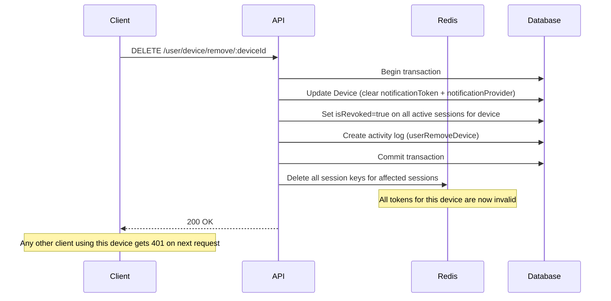

# Device Documentation

This documentation explains the features and usage of **Device Module**: Located at `src/modules/device`

## Overview

Every session is tied to a **Device** record. When a device is removed, all active sessions linked to that device are immediately invalidated — across both Redis and the database — forcing logout on every affected client.

This is a critical security mechanism. It allows users (and admins) to forcibly terminate all sessions on a specific device.

## Related Documents

- [Authentication Documentation][ref-doc-authentication] - For understanding session management and JWT
- [Authorization Documentation][ref-doc-authorization] - For policy-based access control on device endpoints
- [Notification Documentation][ref-doc-notification] - For push notification token management tied to devices

## Table of Contents

- [Overview](#overview)
- [Related Documents](#related-documents)
- [Device Model](#device-model)
- [Device-Session Relationship](#device-session-relationship)
- [What Happens When a Device is Removed](#what-happens-when-a-device-is-removed)
- [Endpoints](#endpoints)
  - [Shared (User Self-Service)](#shared-user-self-service)
  - [Admin](#admin)
- [Policy Control](#policy-control)

## Device Model

A Device represents a physical or virtual client that has logged in. It is identified by a unique `fingerprint` per user.

**Fields:**
- `fingerprint` — Unique identifier for the device per user. This value should be generated on the frontend and sent with every login/refresh request. The recommended library is [FingerprintJS](https://fingerprint.com) (or its open-source variant [`@fingerprintjs/fingerprintjs`](https://github.com/fingerprintjs/fingerprintjs))
- `name` — Human-readable device name (optional, e.g. `"iPhone 15"`, `"Chrome on Windows"`)
- `platform` — Platform of the device. See `EnumDevicePlatform` below
- `notificationToken` — FCM/APNs push token (optional, used for push notifications). Populated via `POST /user/device/refresh`
- `notificationProvider` — Derived automatically from `platform`. See `EnumDeviceNotificationProvider` below
- `lastActiveAt` — Timestamp of last device activity, updated on every `refresh` call

### Enums

**`EnumDevicePlatform`**

| Value | Description |
|-------|-------------|
| `ios` | Apple iOS device |
| `android` | Android device |
| `web` | Web browser |

**`EnumDeviceNotificationProvider`**

Automatically derived from `platform` when a `notificationToken` is present. Not set for `web` platform.

| Value | Platform | Description |
|-------|----------|-------------|
| `fcm` | `android` | Firebase Cloud Messaging |
| `apns` | `ios` | Apple Push Notification Service |

## Device-Session Relationship

Each `Session` record has a required `deviceId` field pointing to a `Device`. One device can have multiple active sessions (e.g. multiple logins from the same device).

```
User
 └── Device (1 per fingerprint per user)
       └── Session[] (one per login on this device)
```

When listing devices, the API includes a count of active (non-revoked, non-expired) sessions per device, so users and admins can see which devices are currently logged in.

## What Happens When a Device is Removed

Removing a device triggers a transaction that:

1. **Updates the `Device` record** — clears `notificationToken` and `notificationProvider` (push token is invalidated), updates `lastActiveAt` and `updatedBy`. The device record is retained in the database.
2. **Revokes all active sessions** for that device in the database (`isRevoked: true`, `revokedAt: now`)
3. **Deletes all session keys from Redis** — causing immediate 401 on any subsequent request using those tokens
4. **Creates an activity log** entry with action `userRemoveDevice`



## Endpoints

### Shared (User Self-Service)

| Method | Path | Description |
|--------|------|-------------|
| `GET` | `/user/device/list` | List own devices (cursor-based) with active session count for current session |
| `POST` | `/user/device/refresh` | Update device info (name, push token, platform) |
| `DELETE` | `/user/device/remove/:deviceId` | Remove own device — revokes all its sessions immediately |

### Admin

| Method | Path | Description |
|--------|------|-------------|
| `GET` | `/user/:userId/device/list` | List a user's devices (offset-based) |
| `DELETE` | `/user/:userId/device/remove/:deviceId` | Remove a user's device — revokes all its sessions immediately |

## Policy Control

Device endpoints are protected using `EnumPolicySubject.device`. Admin endpoints require both `user` (read) and `device` (read/delete) abilities:

```typescript
// Admin list devices
@PolicyAbilityProtected(
    { subject: EnumPolicySubject.user, action: [EnumPolicyAction.read] },
    { subject: EnumPolicySubject.device, action: [EnumPolicyAction.read] }
)

// Admin remove device
@PolicyAbilityProtected(
    { subject: EnumPolicySubject.user, action: [EnumPolicyAction.read] },
    { subject: EnumPolicySubject.device, action: [EnumPolicyAction.delete] }
)
```

Shared (user self-service) endpoints only require `@UserProtected()` and `@AuthJwtAccessProtected()` — no policy subject check since users can only manage their own devices.


<!-- REFERENCES -->

<!-- BADGE LINKS -->

[ack-contributors-shield]: https://img.shields.io/github/contributors/andrechristikan/ack-nestjs-boilerplate?style=for-the-badge
[ack-forks-shield]: https://img.shields.io/github/forks/andrechristikan/ack-nestjs-boilerplate?style=for-the-badge
[ack-stars-shield]: https://img.shields.io/github/stars/andrechristikan/ack-nestjs-boilerplate?style=for-the-badge
[ack-issues-shield]: https://img.shields.io/github/issues/andrechristikan/ack-nestjs-boilerplate?style=for-the-badge
[ack-license-shield]: https://img.shields.io/github/license/andrechristikan/ack-nestjs-boilerplate?style=for-the-badge
[nestjs-shield]: https://img.shields.io/badge/nestjs-%23E0234E.svg?style=for-the-badge&logo=nestjs&logoColor=white
[nodejs-shield]: https://img.shields.io/badge/Node.js-339933?style=for-the-badge&logo=nodedotjs&logoColor=white
[typescript-shield]: https://img.shields.io/badge/TypeScript-007ACC?style=for-the-badge&logo=typescript&logoColor=white
[mongodb-shield]: https://img.shields.io/badge/MongoDB-white?style=for-the-badge&logo=mongodb&logoColor=4EA94B
[jwt-shield]: https://img.shields.io/badge/JWT-000000?style=for-the-badge&logo=JSON%20web%20tokens&logoColor=white
[jest-shield]: https://img.shields.io/badge/-jest-%23C21325?style=for-the-badge&logo=jest&logoColor=white
[pnpm-shield]: https://img.shields.io/badge/pnpm-%232C8EBB.svg?style=for-the-badge&logo=pnpm&logoColor=white&color=F9AD00
[docker-shield]: https://img.shields.io/badge/docker-%230db7ed.svg?style=for-the-badge&logo=docker&logoColor=white
[github-shield]: https://img.shields.io/badge/GitHub-100000?style=for-the-badge&logo=github&logoColor=white
[linkedin-shield]: https://img.shields.io/badge/LinkedIn-0077B5?style=for-the-badge&logo=linkedin&logoColor=white

<!-- CONTACTS -->

[ref-author-linkedin]: https://linkedin.com/in/andrechristikan
[ref-author-email]: mailto:andrechristikan@gmail.com
[ref-author-github]: https://github.com/andrechristikan
[ref-author-paypal]: https://www.paypal.me/andrechristikan
[ref-author-kofi]: https://ko-fi.com/andrechristikan

<!-- Repo LINKS -->

[ref-ack]: https://github.com/andrechristikan/ack-nestjs-boilerplate
[ref-ack-issues]: https://github.com/andrechristikan/ack-nestjs-boilerplate/issues
[ref-ack-stars]: https://github.com/andrechristikan/ack-nestjs-boilerplate/stargazers
[ref-ack-forks]: https://github.com/andrechristikan/ack-nestjs-boilerplate/network/members
[ref-ack-contributors]: https://github.com/andrechristikan/ack-nestjs-boilerplate/graphs/contributors
[ref-ack-license]: LICENSE.md

<!-- THIRD PARTY -->

[ref-nestjs]: http://nestjs.com
[ref-nestjs-swagger]: https://docs.nestjs.com/openapi/introduction
[ref-nestjs-swagger-types]: https://docs.nestjs.com/openapi/types-and-parameters
[ref-prisma]: https://www.prisma.io
[ref-mongodb]: https://docs.mongodb.com/
[ref-redis]: https://redis.io
[ref-bullmq]: https://bullmq.io
[ref-nodejs]: https://nodejs.org/
[ref-typescript]: https://www.typescriptlang.org/
[ref-docker]: https://docs.docker.com
[ref-dockercompose]: https://docs.docker.com/compose/
[ref-pnpm]: https://pnpm.io
[ref-12factor]: https://12factor.net
[ref-commander]: https://nest-commander.jaymcdoniel.dev
[ref-package-json]: package.json
[ref-jwt]: https://jwt.io
[ref-jest]: https://jestjs.io/docs/getting-started
[ref-git]: https://git-scm.com
[ref-google-console]: https://console.cloud.google.com/
[ref-google-client-secret]: https://developers.google.com/identity/protocols/oauth2

<!-- DOCUMENTS -->

[ref-doc-root]: ../readme.md
[ref-doc-activity-log]: activity-log.md
[ref-doc-authentication]: authentication.md
[ref-doc-authorization]: authorization.md
[ref-doc-cache]: cache.md
[ref-doc-configuration]: configuration.md
[ref-doc-database]: database.md
[ref-doc-device]: device.md
[ref-doc-environment]: environment.md
[ref-doc-feature-flag]: feature-flag.md
[ref-doc-file-upload]: file-upload.md
[ref-doc-handling-error]: handling-error.md
[ref-doc-installation]: installation.md
[ref-doc-logger]: logger.md
[ref-doc-message]: message.md
[ref-doc-notification]: notification.md
[ref-doc-pagination]: pagination.md
[ref-doc-project-structure]: project-structure.md
[ref-doc-queue]: queue.md
[ref-doc-request-validation]: request-validation.md
[ref-doc-response]: response.md
[ref-doc-security-and-middleware]: security-and-middleware.md
[ref-doc-doc]: doc.md
[ref-doc-third-party-integration]: third-party-integration.md
[ref-doc-presign]: presign.md
[ref-doc-term-policy]: term-policy.md
[ref-doc-two-factor]: two-factor.md

<!-- CONTRIBUTOR -->

[ref-contributor-gzerox]: https://github.com/Gzerox
[ref-contributor-ak2g]: https://github.com/ak2g
