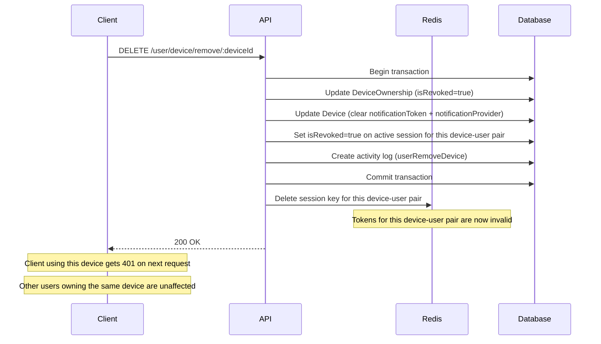

# Device Documentation

This documentation explains the features and usage of **Device Module**: Located at `src/modules/device`

## Overview

Devices represent physical or virtual clients that users log in from. Each device is uniquely identified by a `fingerprint` and can be owned by multiple users. User-device relationships are managed through the `DeviceOwnership` model.

When a device ownership is removed, all active sessions linked to that device-user pair are immediately invalidated — across both Redis and the database — forcing logout on the affected client.

This is a critical security mechanism. It allows users (and admins) to forcibly terminate all sessions on a specific device-user pair.

## Related Documents

- [Authentication Documentation][ref-doc-authentication] - For understanding session management and JWT
- [Authorization Documentation][ref-doc-authorization] - For policy-based access control on device endpoints
- [Notification Documentation][ref-doc-notification] - For push notification token management tied to devices

## Table of Contents

- [Overview](#overview)
- [Related Documents](#related-documents)
- [Device Model](#device-model)
- [Device-Session Relationship](#device-session-relationship)
- [What Happens When a Device is Removed](#what-happens-when-a-device-is-removed)
- [Endpoints](#endpoints)
  - [Shared (User Self-Service)](#shared-user-self-service)
  - [Admin](#admin)
- [Policy Control](#policy-control)

## Device Model

A Device represents a physical or virtual client. It is identified by a globally unique `fingerprint` that can be owned by multiple users.

**Fields:**
- `fingerprint` — Globally unique identifier for the device. This value should be generated on the frontend and sent with every login/refresh request. The recommended library is [FingerprintJS](https://fingerprint.com) (or its open-source variant [`@fingerprintjs/fingerprintjs`](https://github.com/fingerprintjs/fingerprintjs))
- `name` — Human-readable device name (optional, e.g. `"iPhone 15"`, `"Chrome on Windows"`)
- `platform` — Platform of the device. See `EnumDevicePlatform` below
- `notificationToken` — FCM/APNs push token (optional, used for push notifications). Globally unique per device. Populated via `POST /user/device/refresh`
- `notificationProvider` — Derived automatically from `platform`. See `EnumDeviceNotificationProvider` below

### Enums

**`EnumDevicePlatform`**

| Value | Description |
|-------|-------------|
| `ios` | Apple iOS device |
| `android` | Android device |
| `web` | Web browser |

**`EnumDeviceNotificationProvider`**

Automatically derived from `platform` when a `notificationToken` is present. Not set for `web` platform.

| Value | Platform | Description |
|-------|----------|-------------|
| `fcm` | `android` | Firebase Cloud Messaging |
| `apns` | `ios` | Apple Push Notification Service |

## DeviceOwnership Model

The `DeviceOwnership` model represents the relationship between a `User` and a `Device`. It tracks:
- Which device a user owns
- Device revocation status and history
- Session count for that device-user pair

## Device-Session Relationship

Each `Session` record has a required `deviceOwnershipId` field pointing to a `DeviceOwnership`. One device-user pair can have **only one active session** at a time.

```
User
 └── DeviceOwnership (N per user, one per owned device)
       ├── Device (shared across multiple users via other ownerships)
       └── Session[] (max 1 active per device-user pair)

Device
 └── DeviceOwnership[] (can be owned by multiple users)
       └── Session[] (per ownership)
```

When listing devices, the API shows only the devices owned by the user, with session information for their specific ownership.

## What Happens When a Device Ownership is Removed

Removing a device ownership (device per user) triggers a transaction that:

1. **Updates the `DeviceOwnership` record** — marks as revoked (`isRevoked: true`, `revokedAt: now`, `revokedById: userId`), updates `updatedBy`. The ownership record is retained for audit trail.
2. **Updates the `Device` record** — clears the `notificationToken` and `notificationProvider` for this specific ownership (push token is invalidated), updates `updatedBy`.
3. **Revokes the active session** for that device-user pair in the database (`isRevoked: true`, `revokedAt: now`)
4. **Deletes the session key from Redis** — causing immediate 401 on any subsequent request using those tokens
5. **Creates an activity log** entry with action `userRemoveDevice` or `adminDeviceRemove`



## Endpoints

### Shared (User Self-Service)

| Method | Path | Description |
|--------|------|-------------|
| `GET` | `/user/device/list` | List own devices (cursor-based) with active session count for current session |
| `POST` | `/user/device/refresh` | Update device info (name, push token, platform) |
| `DELETE` | `/user/device/remove/:deviceId` | Remove own device — revokes all its sessions immediately |

### Admin

| Method | Path | Description |
|--------|------|-------------|
| `GET` | `/user/:userId/device/list` | List a user's devices (offset-based) |
| `DELETE` | `/user/:userId/device/remove/:deviceId` | Remove a user's device — revokes all its sessions immediately |

## Policy Control

Device endpoints are protected using `EnumPolicySubject.device`. Admin endpoints require both `user` (read) and `device` (read/delete) abilities:

```typescript
// Admin list devices
@PolicyAbilityProtected(
    { subject: EnumPolicySubject.user, action: [EnumPolicyAction.read] },
    { subject: EnumPolicySubject.device, action: [EnumPolicyAction.read] }
)

// Admin remove device
@PolicyAbilityProtected(
    { subject: EnumPolicySubject.user, action: [EnumPolicyAction.read] },
    { subject: EnumPolicySubject.device, action: [EnumPolicyAction.delete] }
)
```

Shared (user self-service) endpoints only require `@UserProtected()` and `@AuthJwtAccessProtected()` — no policy subject check since users can only manage their own devices.


<!-- REFERENCES -->

[ref-doc-authentication]: authentication.md
[ref-doc-authorization]: authorization.md
[ref-doc-notification]: notification.md
