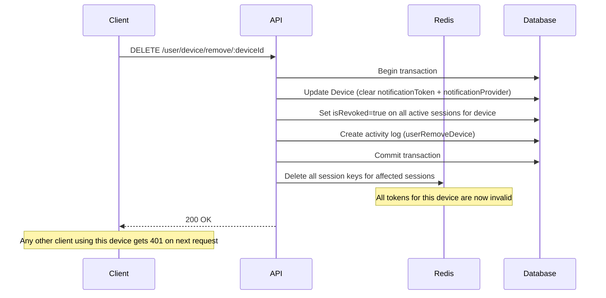

# Device Documentation

This documentation explains the features and usage of **Device Module**: Located at `src/modules/device`

## Overview

Every session is tied to a **Device** record. When a device is removed, all active sessions linked to that device are immediately invalidated — across both Redis and the database — forcing logout on every affected client.

This is a critical security mechanism. It allows users (and admins) to forcibly terminate all sessions on a specific device.

## Related Documents

- [Authentication Documentation][ref-doc-authentication] - For understanding session management and JWT
- [Authorization Documentation][ref-doc-authorization] - For policy-based access control on device endpoints
- [Notification Documentation][ref-doc-notification] - For push notification token management tied to devices

## Table of Contents

- [Overview](#overview)
- [Related Documents](#related-documents)
- [Device Model](#device-model)
- [Device-Session Relationship](#device-session-relationship)
- [What Happens When a Device is Removed](#what-happens-when-a-device-is-removed)
- [Endpoints](#endpoints)
  - [Shared (User Self-Service)](#shared-user-self-service)
  - [Admin](#admin)
- [Policy Control](#policy-control)

## Device Model

A Device represents a physical or virtual client that has logged in. It is identified by a unique `fingerprint` per user.

**Fields:**
- `fingerprint` — Unique identifier for the device per user. This value should be generated on the frontend and sent with every login/refresh request. The recommended library is [FingerprintJS](https://fingerprint.com) (or its open-source variant [`@fingerprintjs/fingerprintjs`](https://github.com/fingerprintjs/fingerprintjs))
- `name` — Human-readable device name (optional, e.g. `"iPhone 15"`, `"Chrome on Windows"`)
- `platform` — Platform of the device. See `EnumDevicePlatform` below
- `notificationToken` — FCM/APNs push token (optional, used for push notifications). Populated via `POST /user/device/refresh`
- `notificationProvider` — Derived automatically from `platform`. See `EnumDeviceNotificationProvider` below
- `lastActiveAt` — Timestamp of last device activity, updated on every `refresh` call

### Enums

**`EnumDevicePlatform`**

| Value | Description |
|-------|-------------|
| `ios` | Apple iOS device |
| `android` | Android device |
| `web` | Web browser |

**`EnumDeviceNotificationProvider`**

Automatically derived from `platform` when a `notificationToken` is present. Not set for `web` platform.

| Value | Platform | Description |
|-------|----------|-------------|
| `fcm` | `android` | Firebase Cloud Messaging |
| `apns` | `ios` | Apple Push Notification Service |

## Device-Session Relationship

Each `Session` record has a required `deviceId` field pointing to a `Device`. One device can have multiple active sessions (e.g. multiple logins from the same device).

```
User
 └── Device (1 per fingerprint per user)
       └── Session[] (one per login on this device)
```

When listing devices, the API includes a count of active (non-revoked, non-expired) sessions per device, so users and admins can see which devices are currently logged in.

## What Happens When a Device is Removed

Removing a device triggers a transaction that:

1. **Updates the `Device` record** — clears `notificationToken` and `notificationProvider` (push token is invalidated), updates `lastActiveAt` and `updatedBy`. The device record is retained in the database.
2. **Revokes all active sessions** for that device in the database (`isRevoked: true`, `revokedAt: now`)
3. **Deletes all session keys from Redis** — causing immediate 401 on any subsequent request using those tokens
4. **Creates an activity log** entry with action `userRemoveDevice`



## Endpoints

### Shared (User Self-Service)

| Method | Path | Description |
|--------|------|-------------|
| `GET` | `/user/device/list` | List own devices (cursor-based) with active session count for current session |
| `POST` | `/user/device/refresh` | Update device info (name, push token, platform) |
| `DELETE` | `/user/device/remove/:deviceId` | Remove own device — revokes all its sessions immediately |

### Admin

| Method | Path | Description |
|--------|------|-------------|
| `GET` | `/user/:userId/device/list` | List a user's devices (offset-based) |
| `DELETE` | `/user/:userId/device/remove/:deviceId` | Remove a user's device — revokes all its sessions immediately |

## Policy Control

Device endpoints are protected using `EnumPolicySubject.device`. Admin endpoints require both `user` (read) and `device` (read/delete) abilities:

```typescript
// Admin list devices
@PolicyAbilityProtected(
    { subject: EnumPolicySubject.user, action: [EnumPolicyAction.read] },
    { subject: EnumPolicySubject.device, action: [EnumPolicyAction.read] }
)

// Admin remove device
@PolicyAbilityProtected(
    { subject: EnumPolicySubject.user, action: [EnumPolicyAction.read] },
    { subject: EnumPolicySubject.device, action: [EnumPolicyAction.delete] }
)
```

Shared (user self-service) endpoints only require `@UserProtected()` and `@AuthJwtAccessProtected()` — no policy subject check since users can only manage their own devices.


<!-- REFERENCES -->

[ref-doc-authentication]: authentication.md
[ref-doc-authorization]: authorization.md
[ref-doc-notification]: notification.md
