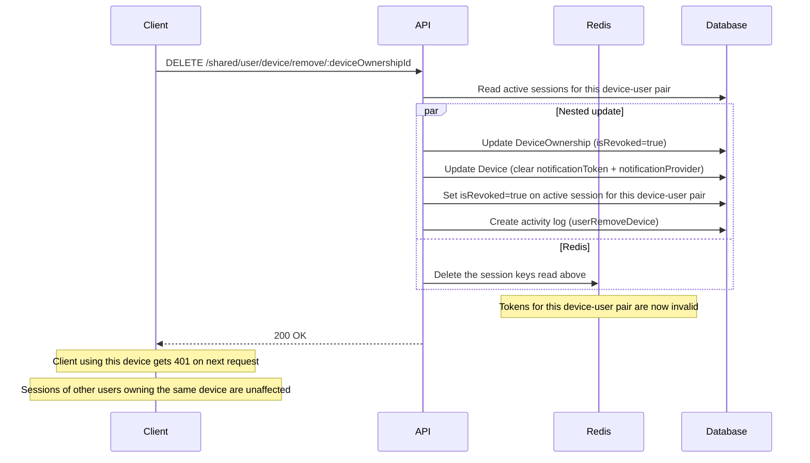

# Device Documentation

This documentation explains the features and usage of **Device Module**: Located at `src/modules/device`

## Overview

Devices represent physical or virtual clients that users log in from. Each device is uniquely identified by a `fingerprint` and can be owned by multiple users. User-device relationships are managed through the `DeviceOwnership` model.

When a device ownership is removed, all active sessions linked to that device-user pair are immediately invalidated across both Redis and the database, forcing logout on the affected client.

This is a critical security mechanism. It allows users (and admins) to forcibly terminate all sessions on a specific device-user pair.

## Related Documents

- [Authentication Documentation][ref-doc-authentication] - For understanding session management and JWT
- [Authorization Documentation][ref-doc-authorization] - For policy-based access control on device endpoints
- [Notification Documentation][ref-doc-notification] - For push notification token management tied to devices

## Table of Contents

- [Overview](#overview)
- [Related Documents](#related-documents)
- [Device Model](#device-model)
- [DeviceOwnership Model](#deviceownership-model)
- [Device-Session Relationship](#device-session-relationship)
- [What Happens When a Device Ownership is Removed](#what-happens-when-a-device-ownership-is-removed)
- [Refreshing Device Info](#refreshing-device-info)
- [Endpoints](#endpoints)
  - [Shared (User Self-Service)](#shared-user-self-service)
  - [Admin](#admin)
- [Policy Control](#policy-control)

## Device Model

A Device represents a physical or virtual client. It is identified by a globally unique `fingerprint` that can be owned by multiple users.

**Fields:**
- `fingerprint` — Globally unique identifier for the device. The frontend generates this value and sends it with every login request; the device row is upserted on it. It is not sent on refresh, which identifies the device from the `deviceOwnershipId` in the access token. The recommended library is [FingerprintJS](https://fingerprint.com) (or its open-source variant [`@fingerprintjs/fingerprintjs`](https://github.com/fingerprintjs/fingerprintjs))
- `name` — Human-readable device name (optional, e.g. `"iPhone 15"`, `"Chrome on Windows"`)
- `platform` — Platform of the device. See `EnumDevicePlatform` below
- `lastActiveAt` — Stamped on login, on device refresh, and on device removal. The stale-token cleanup uses it to decide which push tokens are dead
- `notificationToken` — FCM/APNs push token (optional, used for push notifications). Set on login and via `POST /shared/user/device/refresh`, cleared on device removal, by the stale-token cleanup cron, and by the invalid-token cleanup job that runs after a push provider rejects a token
- `notificationProvider` — Derived automatically from `platform`. See `EnumDeviceNotificationProvider` below

`fingerprint` and `notificationToken` carry `@Exclude()` and `@ApiHideProperty()` on `DeviceResponseDto`, so neither reaches a response payload nor the OpenAPI schema.

### Enums

**`EnumDevicePlatform`**

| Value | Description |
|-------|-------------|
| `ios` | Apple iOS device |
| `android` | Android device |
| `web` | Web browser |

**`EnumDeviceNotificationProvider`**

Derived from `platform`, on login and on every refresh. It stays `null` for the `web` platform.

| Value | Platform | Description |
|-------|----------|-------------|
| `fcm` | `android` | Firebase Cloud Messaging |
| `apns` | `ios` | Apple Push Notification Service |

## DeviceOwnership Model

The `DeviceOwnership` model represents the relationship between a `User` and a `Device`. It tracks:
- Which device a user owns (`deviceId`, `userId`)
- Revocation status and history (`isRevoked`, `revokedAt`, `revokedById`)
- `lastActiveAt` for that device-user pair, stamped on login and on device refresh

`activeSessionCount` in a response is computed per read by a `_count` on `sessions`, counting only sessions that are neither revoked nor expired.

## Device-Session Relationship

Each `Session` record has a required `deviceOwnershipId` field pointing to a `DeviceOwnership`. One device-user pair can have **only one active session** at a time.

```
User
 └── DeviceOwnership (N per user, one per owned device)
       ├── Device (shared across multiple users via other ownerships)
       └── Session[] (max 1 active per device-user pair)

Device
 └── DeviceOwnership[] (can be owned by multiple users)
       └── Session[] (per ownership)
```

When listing devices, the API shows only the devices owned by the user, with session information for their specific ownership.

## What Happens When a Device Ownership is Removed

Removing a device ownership (device per user) issues one nested `deviceOwnership.update` (steps 1 to 4) alongside a Redis delete (step 5). The four database effects travel as a single Prisma nested write and land atomically.

1. **Updates the `DeviceOwnership` record** — marks as revoked (`isRevoked: true`, `revokedAt: now`, `revokedById` set to the acting user: the owner on the self-service path, the admin on the admin path) and updates `updatedBy`. The ownership record is retained for audit trail; its own `lastActiveAt` is left at the value of the last real activity.
2. **Updates the `Device` record** — clears `notificationToken` and `notificationProvider`, updates `lastActiveAt` and `updatedBy`. These fields live on the shared `Device` row, not on the ownership, so the push token is invalidated for every user owning that device.
3. **Revokes the active sessions** for that device-user pair in the database (`isRevoked: true`, `revokedAt: now`, `revokedById` and `updatedBy` set to the acting user)
4. **Creates an activity log** entry with action `userRemoveDevice` against the device owner, inside the same nested write. Its `createdBy` is the acting user, so an admin removal is still traceable to the admin.
5. **Deletes the session keys from Redis** — causing immediate 401 on any subsequent request using those tokens. This runs concurrently with the database write, over a session list read before that write starts.

`DeviceOwnershipRepository.remove()` backs the self-service path and `removeByAdmin()` the admin path. Both delegate to one private write that records action `userRemoveDevice` on the owner's activity log, with `createdBy` and `revokedById` set to the acting user.

The admin endpoint carries `@ActivityLog(EnumActivityLogAction.adminDeviceRemove)`, and `ActivityLogInterceptor` writes that record against the admin after the handler returns, outside the nested write. One admin removal therefore leaves two activity-log records with different subjects: `userRemoveDevice` on the target user and `adminDeviceRemove` on the admin.


```mermaid
sequenceDiagram
    participant Client
    participant API
    participant Redis
    participant Database

    Client->>API: DELETE /shared/user/device/remove/:deviceOwnershipId
    API->>Database: Read active sessions for this device-user pair
    par Nested update
        API->>Database: Update DeviceOwnership (isRevoked=true)
        API->>Database: Update Device (clear notificationToken + notificationProvider)
        API->>Database: Set isRevoked=true on active session for this device-user pair
        API->>Database: Create activity log (userRemoveDevice)
    and Redis
        API->>Redis: Delete the session keys read above
    end
    Note over Redis: Tokens for this device-user pair are now invalid
    API-->>Client: 200 OK
    Note over Client: Client using this device gets 401 on next request
    Note over Client: Sessions of other users owning the same device are unaffected
```

## Refreshing Device Info

`POST /shared/user/device/refresh` updates the device the caller's access token already points at. The body (`DeviceRefreshRequestDto`) carries `name`, `platform`, and `notificationToken`; it omits `fingerprint`, because the ownership is taken from the `deviceOwnershipId` claim in the token.

- The ownership is looked up first. One that does not exist, belongs to another user, or is already revoked produces a 404 with status code `51300` (`EnumDeviceStatusCodeError.notFound`).
- `notificationProvider` is re-derived from `platform` and written together with `name` and `notificationToken` on the shared `Device` row.
- `lastActiveAt` is stamped on both the `DeviceOwnership` and the `Device`.
- An activity log entry with action `userDeviceRefresh` is written for the user, and `updatedBy` is stamped on the user row.
- The refresh write leaves `lastLoginAt` and `lastIPAddress` on `User` untouched; the login path stamps those.
- The handler returns `200 OK` with no data payload.

## Endpoints

### Shared (User Self-Service)

| Method | Path | Description |
|--------|------|-------------|
| `GET` | `/shared/user/device/list` | List own active devices (cursor-based, ordered by `createdAt`); each entry carries `activeSessionCount` and an `isCurrentDevice` flag matched against the calling session |
| `POST` | `/shared/user/device/refresh` | Update device info (name, push token, platform); returns no data |
| `DELETE` | `/shared/user/device/remove/:deviceOwnershipId` | Remove own device; revokes all its sessions immediately |

### Admin

| Method | Path | Description |
|--------|------|-------------|
| `GET` | `/admin/user/:userId/device/list` | List a user's devices, revoked ones included (offset-based, orderable by `createdAt` or `lastActiveAt`), filterable by `isRevoked`. The query loads no sessions, so `isCurrentDevice` is `false` on every entry |
| `DELETE` | `/admin/user/:userId/device/remove/:deviceOwnershipId` | Remove a user's device; revokes all its sessions immediately |

## Policy Control

Device endpoints are protected using `EnumPolicySubject.device`. Admin endpoints require both `user` (read) and `device` (read/delete) abilities:

```typescript
// Admin list devices
@PolicyAbilityProtected(
    { subject: EnumPolicySubject.user, action: [EnumPolicyAction.read] },
    { subject: EnumPolicySubject.device, action: [EnumPolicyAction.read] }
)

// Admin remove device
@PolicyAbilityProtected(
    { subject: EnumPolicySubject.user, action: [EnumPolicyAction.read] },
    { subject: EnumPolicySubject.device, action: [EnumPolicyAction.read, EnumPolicyAction.delete] }
)
```

Shared (user self-service) endpoints carry `@ApiKeyProtected()`, `@AuthJwtAccessProtected()`, `@UserProtected()`, and `@TermPolicyAcceptanceProtected()`, but no policy subject check since users can only manage their own devices. The admin endpoints add `@RoleProtected(EnumRoleType.admin)` on top of the policy abilities, and `DELETE /admin/user/:userId/device/remove/:deviceOwnershipId` also carries `@ActivityLog(EnumActivityLogAction.adminDeviceRemove)`.


<!-- REFERENCES -->

[ref-doc-authentication]: authentication.md
[ref-doc-authorization]: authorization.md
[ref-doc-notification]: notification.md
