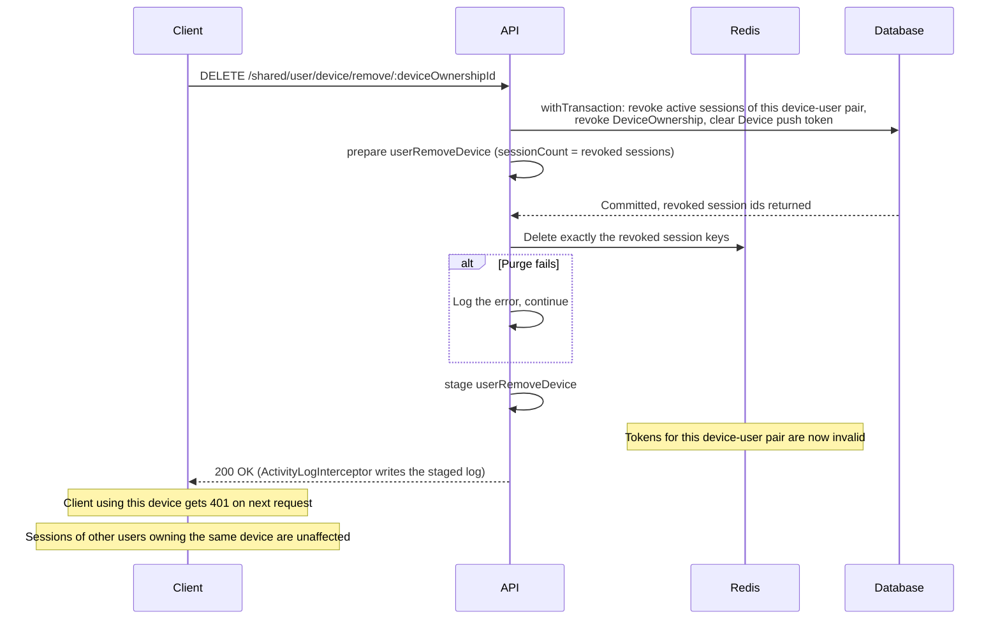

# Device Documentation

Device lives in `src/modules/device`.

## Overview

Devices are the clients users log in from. Each device is identified by a `fingerprint` and can be owned by multiple users through `DeviceOwnership`.

When a device ownership is removed, all active sessions for that device-user pair are revoked in the database, and the revoked session keys are purged from Redis after the commit, which logs the client out. Account self-deletion and the credential lockout each revoke every live ownership of the user and clear the push token of each of those devices.

`DeviceRepository` is the only class that writes `Device` rows, and `DeviceAnalyticRepository` is the only class that reads them directly. `DeviceOwnershipRepository` and `DeviceOwnershipAnalyticRepository` issue statements only against `DeviceOwnership`, and reach `Device` fields through a relation `include`, `select`, or filter. `DeviceDomain` composes the two repositories and opens the transaction for every write that touches both models.

## Related Documents

- [Authentication Documentation][ref-doc-authentication] - For understanding session management and JWT
- [Authorization Documentation][ref-doc-authorization] - For policy-based access control on device endpoints
- [Notification Documentation][ref-doc-notification] - For push notification token management tied to devices

## Table of Contents

- [Overview](#overview)
- [Related Documents](#related-documents)
- [Device Model](#device-model)
- [DeviceOwnership Model](#deviceownership-model)
- [Device-Session Relationship](#device-session-relationship)
- [What Happens When a Device Ownership is Removed](#what-happens-when-a-device-ownership-is-removed)
- [Account Self-Deletion](#account-self-deletion)
- [Refreshing Device Info](#refreshing-device-info)
- [Endpoints](#endpoints)
  - [Shared (User Self-Service)](#shared-user-self-service)
  - [Admin](#admin)
- [Policy Control](#policy-control)

## Device Model

A Device represents a physical or virtual client. It is identified by a globally unique `fingerprint` that can be owned by multiple users.

**Fields:**
- `fingerprint` — Globally unique identifier for the device. The frontend generates this value and sends it with every login request; the device row is upserted on it. It is not sent on refresh, which identifies the device from the `deviceOwnershipId` in the access token. The recommended library is [FingerprintJS](https://fingerprint.com) (or its open-source variant [`@fingerprintjs/fingerprintjs`](https://github.com/fingerprintjs/fingerprintjs))
- `name` — Human-readable device name (optional, e.g. `"iPhone 15"`, `"Chrome on Windows"`)
- `platform` — Platform of the device. See `EnumDevicePlatform` below
- `lastActiveAt` — Stamped on login, on device refresh, on logout, on device removal, on account self-deletion, and on the credential lockout. The stale-token cleanup uses it to decide which push tokens are dead
- `notificationToken` — FCM/APNs push token (optional, used for push notifications). Set on login and via `POST /shared/user/device/refresh`, cleared on logout, on device removal, on account self-deletion, on the credential lockout, by the stale-token cleanup cron, and by the invalid-token cleanup job that runs after a push provider rejects a token
- `notificationProvider` — Derived automatically from `platform`. See `EnumDeviceNotificationProvider` below

`DeviceResponseSchema` declares neither `fingerprint` nor `notificationToken`, so neither reaches a response payload nor the OpenAPI schema.

### Enums

**`EnumDevicePlatform`**

| Value | Description |
|-------|-------------|
| `ios` | Apple iOS device |
| `android` | Android device |
| `web` | Web browser |

**`EnumDeviceNotificationProvider`**

Derived from `platform`, on login and on every refresh. It stays `null` for the `web` platform.

| Value | Platform | Description |
|-------|----------|-------------|
| `fcm` | `android` | Firebase Cloud Messaging |
| `apns` | `ios` | Apple Push Notification Service |

## DeviceOwnership Model

The `DeviceOwnership` model represents the relationship between a `User` and a `Device`. It tracks:
- Which device a user owns (`deviceId`, `userId`)
- Revocation status and history (`isRevoked`, `revokedAt`, `revokedById`)
- `lastActiveAt` for that device-user pair, stamped on login and on device refresh

`activeSessionCount` in a response is computed per read by a `_count` on `sessions`, counting only sessions that are neither revoked nor expired.

## Device-Session Relationship

Each `Session` record has a required `deviceOwnershipId` field pointing to a `DeviceOwnership`. One device-user pair can have **only one active session** at a time.

```
User
 └── DeviceOwnership (N per user, one per owned device)
       ├── Device (shared across multiple users via other ownerships)
       └── Session[] (max 1 active per device-user pair)

Device
 └── DeviceOwnership[] (can be owned by multiple users)
       └── Session[] (per ownership)
```

When listing devices, the API shows only the devices owned by the user, with session information for their specific ownership.

## What Happens When a Device Ownership is Removed

Removing a device ownership (device per user) is composed by `DeviceDomain.remove` (self-service) and `DeviceDomain.removeByAdmin` (admin). One `withTransaction`, opened by `DeviceDomain`, lands the database effects atomically. Both paths then follow one order: commit, purge Redis, stage the activity rows.

1. **Revokes the active sessions** for that device-user pair (`SessionDomain.revokeByDeviceOwnershipInTx`): `isRevoked: true`, `revokedAt: now`, `revokedById` and `updatedBy` set to the acting user. The call returns the ids of the sessions it revoked.
2. **Updates the `DeviceOwnership` record** (`DeviceOwnershipRepository.removeOwnershipInTx`): marks as revoked (`isRevoked: true`, `revokedAt: now`, `revokedBy` connected to the acting user: the owner on the self-service path, the admin on the admin path), with `updatedBy` stamped from the request actor. The ownership record is retained for audit trail; its own `lastActiveAt` is left at the value of the last real activity.
3. **Clears the shared `Device` row** in a separate statement (`DeviceRepository.clearNotificationByIdsInTx`): clears `notificationToken` and `notificationProvider`, updates `lastActiveAt`, and sets `updatedBy` to the acting user, so the push token is invalidated for every user owning that device.
4. **Prepares the activity rows** inside the transaction, after the ownership write whose row the metadata reads. `sessionCount` in the metadata is the number of sessions step 1 revoked.
5. **Purges the revoked session keys from Redis** once the transaction has committed (`SessionDomain.purgeRevokedLogins`). Exactly the ids returned in step 1 are deleted, so any later request carrying those tokens gets 401. A purge failure is logged and the removal still succeeds; the unpurged keys keep passing the session check until their TTL expires.
6. **Stages the activity rows** with `ActivityLogDomain.stagePrepared` after the purge, and `ActivityLogInterceptor` writes them after the handler returns. The rows depend on the path:

| Path | Rows |
|---|---|
| Self-service (`remove`) | `userRemoveDevice`; `userId` and `createdBy` are the device owner |
| Admin (`removeByAdmin`), another user's device | `adminDeviceRemove` on the admin, plus `userRemoveDeviceByAdmin` on the device owner with `createdBy` set to the admin |
| Admin (`removeByAdmin`), the admin's own device | `adminDeviceRemove` only |

`userRemoveDevice` carries `deviceOwnershipId`, `deviceId`, and `sessionCount`. `adminDeviceRemove` carries `targetUserId`, `targetUsername`, `deviceOwnershipId`, `deviceId`, `timestamp`, and `sessionCount`; `userRemoveDeviceByAdmin` carries `actorUserId` in place of the two target keys. See [Activity Log][ref-doc-activity-log].


```mermaid
sequenceDiagram
    participant Client
    participant API
    participant Redis
    participant Database

    Client->>API: DELETE /shared/user/device/remove/:deviceOwnershipId
    API->>Database: withTransaction: revoke active sessions of this device-user pair,<br/>revoke DeviceOwnership, clear Device push token
    API->>API: prepare userRemoveDevice (sessionCount = revoked sessions)
    Database-->>API: Committed, revoked session ids returned
    API->>Redis: Delete exactly the revoked session keys
    alt Purge fails
        API->>API: Log the error, continue
    end
    API->>API: stage userRemoveDevice
    Note over Redis: Tokens for this device-user pair are now invalid
    API-->>Client: 200 OK (ActivityLogInterceptor writes the staged log)
    Note over Client: Client using this device gets 401 on next request
    Note over Client: Sessions of other users owning the same device are unaffected
```

## Account Self-Deletion

`DELETE /user/user/self/delete` runs `UserDomain.deleteSelf`, whose transaction calls `DeviceDomain.revokeAllByUserInTx`. `DeviceOwnershipRepository.revokeAllByUserInTx` marks every ownership of the user that is not yet revoked as revoked (`isRevoked: true`, `revokedAt: now`, `revokedById` and `updatedBy` set to the user) and returns their device ids. `DeviceRepository.clearNotificationByIdsInTx` then clears `notificationToken` and `notificationProvider`, stamps `lastActiveAt`, and sets `updatedBy` to the user on each of those devices. The token is cleared even when another user also owns the device. This path writes no device activity row. The session side of the same transaction: [Authentication][ref-doc-authentication].

The credential lockout (`UserPasswordDomain.reachMaxPasswordAttempt`) is the second caller of `DeviceDomain.revokeAllByUserInTx`, inside its own transaction, with the user as the revoking actor ([Authentication][ref-doc-authentication]).

## Refreshing Device Info

`POST /shared/user/device/refresh` updates the device the caller's access token already points at. The body (`DeviceRefreshRequestDto`) carries `name`, `platform`, and `notificationToken`; it omits `fingerprint`, because the ownership is taken from the `deviceOwnershipId` claim in the token.

- The ownership is looked up first. One that does not exist, belongs to another user, or is already revoked produces a 404 with status code `51300` (`EnumDeviceStatusCodeError.notFound`).
- `notificationProvider` is re-derived from `platform` and written together with `name` and `notificationToken` on the shared `Device` row.
- `lastActiveAt` is stamped on both the `DeviceOwnership` and the `Device`.
- `DeviceDomain.refresh` prepares `userDeviceRefresh`, opens `withTransaction` around `DeviceOwnershipRepository.touchInTx` (which returns the device id) and `DeviceRepository.refreshInTx`, then stages the prepared event after the commit.
- The refresh write leaves `lastLoginAt` and `lastIPAddress` on `User` untouched; the login path stamps those.
- The handler returns `200 OK` with no data payload.

## Endpoints

### Shared (User Self-Service)

| Method | Path | Description |
|--------|------|-------------|
| `GET` | `/shared/user/device/list` | List own active devices (cursor-based, ordered by `createdAt`); each entry carries `activeSessionCount` and an `isCurrentDevice` flag matched against the calling session |
| `POST` | `/shared/user/device/refresh` | Update device info (name, push token, platform); returns no data |
| `DELETE` | `/shared/user/device/remove/:deviceOwnershipId` | Remove own device; revokes all its sessions immediately |

### Admin

| Method | Path | Description |
|--------|------|-------------|
| `GET` | `/admin/user/:userId/device/list` | List a user's devices, revoked ones included (offset-based, orderable by `createdAt` or `lastActiveAt`), filterable by `isRevoked`. The query loads no sessions, so `isCurrentDevice` is `false` on every entry |
| `DELETE` | `/admin/user/:userId/device/remove/:deviceOwnershipId` | Remove a user's device; revokes all its sessions immediately |

## Policy Control

Device endpoints are protected using `EnumPolicySubject.device`. Admin endpoints require both `user` (read) and `device` (read/delete) abilities:

```typescript
// Admin list devices
@PolicyProtected(
    { subject: EnumPolicySubject.user, action: [EnumPolicyAction.read] },
    { subject: EnumPolicySubject.device, action: [EnumPolicyAction.read] }
)

// Admin remove device
@PolicyProtected(
    { subject: EnumPolicySubject.user, action: [EnumPolicyAction.read] },
    { subject: EnumPolicySubject.device, action: [EnumPolicyAction.read, EnumPolicyAction.delete] }
)
```

Shared (user self-service) endpoints carry `@ApiKeyProtected()`, `@AuthJwtAccessProtected()`, `@UserProtected()`, and `@TermPolicyAcceptanceProtected()`, but no policy subject check since users can only manage their own devices. The admin endpoints add `@RoleProtected(EnumRoleType.admin)` on top of the policy abilities.


<!-- REFERENCES -->

[ref-doc-authentication]: authentication.md
[ref-doc-authorization]: authorization.md
[ref-doc-notification]: notification.md
[ref-doc-activity-log]: activity-log.md
