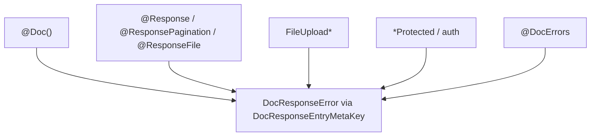

# Doc Documentation

Swagger decorators live in `src/common/doc`.

## Overview

Decorators that build the [Swagger/OpenAPI][ref-nestjs-swagger] document from route metadata and the same zod schemas used for request validation.

OpenAPI is co-located on the same runtime decorators that own the HTTP contract.

Controller-facing surface:

- `@Doc` stamps operation metadata, shared headers, and the global kit error responses
- `@DocErrors` is the public escape hatch for endpoint-specific module-flow errors an endpoint opts into the OpenAPI document
- Success envelopes and response-kind error kits come from `@Response` / `@ResponsePagination` / `@ResponseFile`
- Auth and guard error kits come from the matching `*Protected` / auth decorators
- Multipart upload OpenAPI comes from `FileUploadSingle` / `FileUploadMultiple` / `FileUploadMultipleFields`
- Path, query, and body shapes come from zod on `@Param` / `@Query` / `@Body` via `standardSchemaConverter` in `src/swagger.ts`

Internal kit plumbing:

- `DocResponseError` merges response entries under `DocResponseEntryMetaKey` and re-emits `ApiResponse` for that status
- Kit constants (`DocGlobalErrorResponses`, `DocPaginationErrorResponses`, `DocFileErrorResponses`, …) live in `src/common/doc/constants/doc.constant.ts`
- Module kits live as `Doc<Module>ErrorResponses` in that module's `constants/<module>.constant.ts`

The kit in `src/common/doc/` is in the coverage set.

## Related Documents

- [Request Validation Documentation][ref-doc-request-validation] - Request schemas OpenAPI is built from
- [Response Documentation][ref-doc-response] - Response structure and formatting
- [Authentication Documentation][ref-doc-authentication] - Auth decorator usage on routes
- [Authorization Documentation][ref-doc-authorization] - Guard and protection kits
- [Pagination Documentation][ref-doc-pagination] - Offset and cursor list contracts
- [File Upload Documentation][ref-doc-file-upload] - Multipart upload decorators

## Table of Contents

- [Overview](#overview)
- [Related Documents](#related-documents)
- [Decorators](#decorators)
  - [Doc](#doc)
  - [DocErrors](#docerrors)
  - [DocResponseError](#docresponseerror)
- [Who documents what](#who-documents-what)
  - [Request shape](#request-shape)
  - [Success and response-kind errors](#success-and-response-kind-errors)
  - [Auth and guard errors](#auth-and-guard-errors)
  - [Published errors](#published-errors)
- [Swagger JSON](#swagger-json)
- [Schema Documentation](#schema-documentation)
  - [.meta()](#meta)
- [Usage](#usage)
  - [Complete Admin Endpoint](#complete-admin-endpoint)
  - [Complete Public Endpoint](#complete-public-endpoint)
  - [Paginated List Endpoint](#paginated-list-endpoint)
  - [File Upload Endpoint](#file-upload-endpoint)


## Decorators

### Doc

Basic operation metadata for an endpoint. Every endpoint carries `@Doc({ summary })` at the top of the decorator stack.

**Parameters:**

- `options?: IDocOptions`
  - `summary?: string` - Operation summary
  - `operation?: string` - Operation ID
  - `deprecated?: boolean` - Mark as deprecated
  - `description?: string` - Detailed description

**Auto-includes:**

- Custom headers:
  - `x-custom-lang` - Custom language header (default: EN)
  - `x-correlation-id` - Correlation identifier for tracking requests across services
- Global kit error responses from `DocGlobalErrorResponses` in `src/common/doc/constants/doc.constant.ts`:
  - Internal server error (500)
  - Request timeout (408)
  - Validation error (422)
  - Too many requests (429)
  - Helper decrypt / encryption-secret / pattern-token failures (500)
  - Missing request schema or request context (500)
  - Unique-value generation failure (500)
  - AWS service unavailable (503)

**Usage:**

```typescript
@Doc({
    summary: 'get profile',
})
@Response('user.profile', { schema: UserProfileResponseSchema })
@Get('/profile/get')
async profile(
    @AuthJwtPayload('userId') userId: string
): Promise<IResponseReturn<IUserProfile>> {
    return this.userProfileHttpService.getProfile(userId);
}
```

### DocErrors

Public escape hatch for endpoint-specific module-flow errors an endpoint opts into the OpenAPI document. Controllers do not call `DocResponseError` directly; they use `@DocErrors`.

**Parameters:**

- `httpStatus: HttpStatus` - HTTP status for the documented responses
- `...entries: IDocResponseErrorOptions[]` - Each entry is a `statusCode` plus its i18n `messagePath` (and optional `schema` / `baseSchema`)

**Usage:**

```typescript
@Doc({ summary: '…' })
@DocErrors(HttpStatus.UNPROCESSABLE_ENTITY, {
    statusCode: EnumAnalyticStatusCodeError.invalidDateRange,
    messagePath: 'analytic.error.invalidDateRange',
})
@Response('…', { schema: SomeResponseSchema })
@Get('/…')
async handler(): Promise<IResponseReturn<SomeResponseDto>> {
    // …
}
```

For a module-flow exception that is not already covered by a kit and that the endpoint documents in OpenAPI.

### DocResponseError

Internal kit emitter for responses of one HTTP status. Each entry is a `statusCode` plus its i18n `messagePath` (and optional `schema` for `data`, optional `baseSchema` defaulting to `ResponseSchema`). Paginated success uses `baseSchema: ResponsePaginationSchema`.

It is a `MethodDecorator` that merges entries onto the handler under `DocResponseEntryMetaKey` and re-emits `ApiResponse` for that status, so entries from different primitives at one status compose instead of replacing each other. Deduping key: `httpStatus:statusCode:messagePath`.

- One entry at a status emits a plain schema with field examples.
- Two or more emit one shared response-envelope schema plus named OpenAPI `examples` keyed by `messagePath`, each value the full envelope (`statusCode`, `message`, `metadata`).
- A `oneOf` of full envelopes is not used.

Common kit `DocResponseError` calls live in `src/common/doc/constants/doc.constant.ts`:

- `DocGlobalErrorResponses`
- `DocPaginationErrorResponses`
- `DocPaginationOffsetErrorResponses`
- `DocPaginationCursorErrorResponses`
- `DocFileErrorResponses`
- `DocSerializationErrorResponses`
- and related groups

Module `*Protected` / auth kits live as `Doc<Module>ErrorResponses` in that module's `constants/<module>.constant.ts` and are spread into the decorator's `applyDecorators(...)`. Each entry is a bare `DocResponseError(...)` MethodDecorator; kit constants are never pre-composed `applyDecorators` blobs.

## Who documents what

### Request shape

| Binding | OpenAPI source |
|---|---|
| `@Param('…', { schema })` / `@Query({ schema })` / `@Query('…', { schema })` / `@Body({ schema })` | zod via `standardSchemaConverter` in `src/swagger.ts` (`.meta` for description, example, required) |
| Path placeholder a **guard** reads; the handler has no `@Param` | the owning Protected decorator (for example `ProjectProtected` emits `ApiParam('projectId')`) |
| Multipart upload | `FileUploadSingle` / `FileUploadMultiple` / `FileUploadMultipleFields`: `ApiConsumes('multipart/form-data')` plus binary `ApiBody` from field name(s) plus upload error kit |
| List query (`page` / `cursor` / `perPage` / `search` / `orderBy` + filters) | the list zod schema on `@Query({ schema })`, built from `PaginationOffsetQuerySchema` / `PaginationCursorQuerySchema` plus `.extend` |

A hand-written schema object beside a zod schema is a mirror. Every field carries `.meta({ description, example })` on the zod schema. Do not call `faker.seed()`.

### Success and response-kind errors

| Runtime decorator | Success OpenAPI | Error kits it publishes |
|---|---|---|
| `@Response(messagePath, { schema?, cache? })` | Success envelope; HTTP status and body `statusCode` from `@HttpCode` or Nest method defaults (`POST` → 201, else 200) | `DocSerializationErrorResponses.serialization` |
| `@ResponsePagination(messagePath, { schema, cache? })` | 200 page envelope with `baseSchema: ResponsePaginationSchema`; item schema is the row | Shared pagination errors plus both offset and cursor kits, plus serialization / pagination-shape / pagination-type failures |
| `@ResponseFile({ extension? })` | Non-JSON produces for the extension | Export size / data caps from `DocFileErrorResponses` |
| `FileUpload*` | Multipart consumes + binary body | Upload errors from `DocFileErrorResponses` |

`IResponseOptions` carries only `schema` and `cache`. It does not carry `httpStatus` or `statusCode`. Override either status at runtime via `metadata` on the handler return. `@ResponsePagination` does not emit list `ApiQuery`s; those come from the zod query schema.

### Auth and guard errors

Each `*Protected` / auth decorator emits exactly the throw set of the guard class it installs, plus any security scheme (`ApiBearerAuth`, `ApiSecurity`). Where a decorator installs a different guard class depending on its arguments, each class takes its own kit.

OpenAPI security scheme names are the module constants below. `ApiBearerAuth`, `ApiSecurity`, `DocumentBuilder.addBearerAuth`, and `DocumentBuilder.addApiKey` take those consts:

| Const | Scheme value | Registered in |
|---|---|---|
| `AuthJwtAccessDocSecurityName` | `accessToken` | `src/swagger.ts` + `AuthJwtAccessProtected` |
| `AuthJwtRefreshDocSecurityName` | `refreshToken` | `src/swagger.ts` + `AuthJwtRefreshProtected` |
| `AuthSocialGoogleDocSecurityName` | `google` | `src/swagger.ts` + `AuthSocialGoogleProtected` |
| `AuthSocialAppleDocSecurityName` | `apple` | `src/swagger.ts` + `AuthSocialAppleProtected` |
| `ApiKeyDocSecurityName` | `xApiKey` | `src/swagger.ts` + `ApiKeyProtected` / `ApiKeySystemProtected` |

Scheme values are camelCase. The API key transport header is `x-api-key` (`addApiKey` `name`).

`auth.error.accessTokenUnauthorized` belongs to `AuthJwtAccessProtected`. A Protected decorator whose domain also throws when the principal is missing does not publish that 401 again.

### Published errors

One error has one source, from where the exception lives:

| The exception lives in | Its entry belongs to |
|---|---|
| `src/common/` or `src/app/`, and any request can reach it | `@Doc()` |
| `src/common/`, behind one runtime primitive | that primitive: pagination kits on `@ResponsePagination`, upload kits on `FileUpload*`, download kits on `@ResponseFile` |
| a module, raised by a guard or an auth strategy | the matching `*Protected` / auth decorator |
| a module, raised by a specific endpoint's flow and required in OpenAPI | `@DocErrors` on that handler |

A module marked `@Global()` changes nothing about this. Its errors reach the kit only through a guard or auth strategy that gates them, or through `@DocErrors` when an endpoint opts in.



## Swagger JSON

The OpenAPI document describes endpoints, schemas, and metadata for integration and external tools.

The Swagger document is built only when `app.env` is not `production`. In a production environment neither the `/docs` UI, the JSON endpoint, nor `generated/swagger.json` is produced.

Building the document (and loading the Swagger UI) takes noticeably longer because the document carries many examples: per-status error kits emit named OpenAPI `examples` keyed by `messagePath`, and list, query, and response fields carry `.meta` examples.

### How to Get swagger.json

Two ways, both outside production only:

1. **Via URL (API Docs Endpoint):**
    - After starting the server, access: `/docs/json`
    - Example: `http://localhost:3000/docs/json`
    - The path comes from `doc.jsonUrlPattern` (`{docPrefix}/json`), filled with `doc.prefix` in `src/swagger.ts`.
    - This endpoint serves the latest Swagger spec for the running app.

2. **Via Generated File:**
    - The file is written at: `generated/swagger.json`
    - Written every time the app starts in a non-production environment.
    - Use for CI/CD, external tools, or static documentation.

Both methods provide the same OpenAPI spec: one served live, one written to disk.

## Schema Documentation

A DTO here is a zod schema plus the type inferred from it, and the OpenAPI schema object is produced from that same schema by [zod-openapi][ref-zod-openapi]. There is no separate annotation layer: the response and file decorators call `createSchema(schema)` (or equivalent) and hand the result to `@nestjs/swagger`.

Each `*.dto.ts` file declares one schema and its inferred type. Both carry a one-line JSDoc summary followed by `@public`; the same convention covers decorators, enums, exceptions, and constants.

### .meta()

Per-field OpenAPI metadata lives in `.meta()` on the field.

**Common keys:**
- `description?: string` - Property description
- `example?: unknown` - Example value
- `deprecated?: boolean` - Mark the property deprecated

Everything else the OpenAPI schema carries comes from the zod type itself: `.min()` / `.max()` become `minLength` / `maxLength` or `minimum` / `maximum`, `.regex()` becomes `pattern`, `z.enum()` becomes `enum`, `.optional()` keeps the field out of `required`, `.nullable()` sets the nullable type, and `.default()` becomes `default`.

**Usage:**

```typescript
/**
 * Validates the body for changing the signed-in user password.
 * @public
 */
export const UserChangePasswordRequestSchema =
    UserLoginVerifyTwoFactorRequestSchema.omit({ challengeToken: true })
        .partial()
        .extend({
            newPassword: z
                .string()
                .min(8)
                .max(50)
                .regex(RequestPasswordStrengthRegex, {
                    error: () => 'request.error.isPassword.strong',
                })
                .meta({
                    description:
                        "new string password, newPassword can't same with oldPassword",
                    example: 'aBcDe@Fgh!123',
                }),
            oldPassword: z.string().min(1).meta({
                description: 'old string password',
                example: 'xYzAb@Cde!456',
            }),
        });

/**
 * Body for changing the signed-in user password.
 * @public
 */
export type UserChangePasswordRequestDto = z.infer<
    typeof UserChangePasswordRequestSchema
>;
```

**With Composition:**

A derived schema inherits the `.meta()` of every field it keeps, so only the new field carries its own:

```typescript
export const UserForgotPasswordResetRequestSchema =
    UserChangePasswordRequestSchema.pick({ newPassword: true }).extend({
        method: UserLoginVerifyTwoFactorRequestSchema.shape.method.optional(),
        code: UserLoginVerifyTwoFactorRequestSchema.shape.code,
        backupCode: UserLoginVerifyTwoFactorRequestSchema.shape.backupCode,
        token: z.string().min(1).meta({
            description: 'Forgot password token',
            example: faker.string.alphanumeric(20),
        }),
    });

export type UserForgotPasswordResetRequestDto = z.infer<
    typeof UserForgotPasswordResetRequestSchema
>;
```

## Usage

### Complete Admin Endpoint

Zod-bound path params reach OpenAPI from the schema on `@Param`. Auth and role kits live on the Protected decorators.

```typescript
@Doc({ summary: 'get detail an user' })
@Response('user.get', { schema: UserProfileResponseSchema })
@TermPolicyAcceptanceProtected()
@PolicyProtected({
    subject: EnumPolicySubject.user,
    action: [EnumPolicyAction.read],
})
@RoleProtected(EnumRoleType.admin)
@UserProtected()
@AuthJwtAccessProtected()
@ApiKeyProtected()
@RequestThrottle({ user: true })
@Get('/get/:userId')
async get(
    @Param('userId', { schema: RequestMongoIdSchema }) userId: string
): Promise<IResponseReturn<IUserProfile>> {
    return this.userHttpService.getOneByAdmin(userId);
}
```

### Complete Public Endpoint

```typescript
@Doc({ summary: 'User sign up' })
@Response('user.signUp')
@FeatureFlagProtected('signUp')
@ApiKeyProtected()
@RequestThrottle({ route: EnumRequestThrottleRoute.strict })
@Post('/sign-up')
async signUp(
    @Body({ schema: UserSignUpRequestSchema }) body: UserSignUpRequestDto
): Promise<void> {
    await this.userAuthHttpService.signUp(body);
}
```

Body Content-Type and field shapes come from the zod schema on `@Body`. Success HTTP status follows Nest's `POST` default (`201`) unless `@HttpCode` overrides it.

### Paginated List Endpoint

List query OpenAPI comes only from the zod schema on `@Query({ schema })`. `@ResponsePagination` documents the page envelope and both pagination error kits; it does not emit `ApiQuery` for `page`, `cursor`, `perPage`, `search`, or `orderBy`.

```typescript
@Doc({ summary: 'get all users' })
@ResponsePagination('user.list', { schema: UserListResponseSchema })
@TermPolicyAcceptanceProtected()
@PolicyProtected({
    subject: EnumPolicySubject.user,
    action: [EnumPolicyAction.read],
})
@RoleProtected(EnumRoleType.admin)
@UserProtected()
@AuthJwtAccessProtected()
@ApiKeyProtected()
@RequestThrottle({ user: true })
@Get('/list')
async list(
    @Query({ schema: UserListRequestSchema }) query: UserListRequestDto
): Promise<IResponsePaginationReturn<IUserList>> {
    return this.userHttpService.getListOffsetByAdmin(query);
}
```

`UserListRequestSchema` extends `PaginationOffsetQuerySchema` with `search`, `orderBy`, and filter fields. Allow-list text in `.meta({ description })` uses the same constants the HTTP service passes to `PaginationQueryUtil`. Flow: [Pagination Documentation][ref-doc-pagination].

### File Upload Endpoint

```typescript
@Doc({ summary: 'upload photo profile' })
@Response('user.uploadPhotoProfile')
@TermPolicyAcceptanceProtected()
@UserProtected()
@AuthJwtAccessProtected()
@ApiKeyProtected()
@FileUploadSingle()
@RequestTimeout('1m')
@RequestThrottle({ user: true, route: EnumRequestThrottleRoute.moderate })
@HttpCode(HttpStatus.OK)
@Post('/profile/photo/upload')
async uploadPhotoProfile(
    @AuthJwtPayload('userId') userId: string,
    @UploadedFile(
        FileRequiredPipe(),
        FileExtensionPipe([
            EnumFileExtensionImage.jpeg,
            EnumFileExtensionImage.png,
            EnumFileExtensionImage.jpg,
        ])
    )
    file: IFile
): Promise<void> {
    await this.userProfileHttpService.uploadPhotoProfile(userId, file);
}
```

`FileUploadSingle` publishes multipart consumes, the binary body field, and the upload error kit. `@Response` publishes the success envelope.

See the [NestJS OpenAPI documentation][ref-nestjs-swagger].


<!-- REFERENCES -->

[ref-nestjs-swagger]: https://docs.nestjs.com/openapi/introduction
[ref-zod-openapi]: https://github.com/samchungy/zod-openapi

[ref-doc-request-validation]: request-validation.md
[ref-doc-response]: response.md
[ref-doc-authentication]: authentication.md
[ref-doc-authorization]: authorization.md
[ref-doc-pagination]: pagination.md
[ref-doc-file-upload]: file-upload.md
