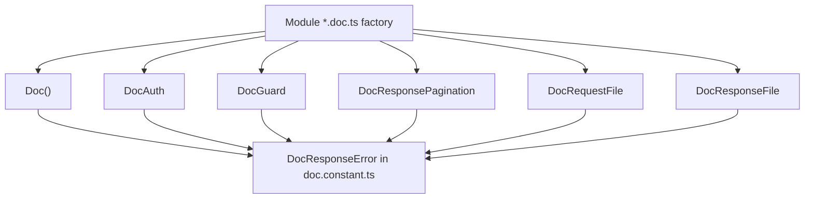

# Doc Documentation

Swagger decorators live in `src/common/doc`.

## Overview

Decorators that build the [Swagger/OpenAPI][ref-nestjs-swagger] document from route metadata and the same zod schemas used for request validation.

A feature Swagger factory lives at `src/modules/<feature>/docs/<feature>.<scope>.doc.ts` and is `applyDecorators` of this kit. It sits outside the coverage set and has no unit spec. The kit in `src/common/doc/` is in the coverage set.

Features:
- `Doc` stamps operation metadata, shared headers, and the global kit error responses
- `DocRequest` documents params and queries the other primitives do not emit, and the request Content-Type; `DocRequestFile` documents multipart uploads and file error responses
- `DocResponse` / `DocResponsePagination` / `DocResponseFile` document the success envelope, pagination kit queries, and file downloads
- `DocAuth` documents JWT, social, and `x-api-key` schemes and their auth error responses; `DocGuard` documents the throw set of each enabled guard flag
- `DocResponseError` is the kit emitter for non-success responses of one HTTP status; module `*.doc.ts` factories do not call it

Constraint when changing this surface: `rules/http.md` (Swagger section).

## Related Documents

- [Request Validation Documentation][ref-doc-request-validation] - For the request schemas the OpenAPI document is generated from
- [Response Documentation][ref-doc-response] - For response structure and formatting
- [Authentication Documentation][ref-doc-authentication] - For authentication decorator usage
- [Authorization Documentation][ref-doc-authorization] - For authorization guard documentation
- [Pagination Documentation][ref-doc-pagination] - For offset and cursor list contracts

## Table of Contents

- [Overview](#overview)
- [Related Documents](#related-documents)
- [Decorators](#decorators)
  - [Doc](#doc)
  - [DocRequest](#docrequest)
  - [DocRequestFile](#docrequestfile)
  - [DocResponse](#docresponse)
  - [DocResponsePagination](#docresponsepagination)
  - [DocResponseFile](#docresponsefile)
  - [DocAuth](#docauth)
  - [DocGuard](#docguard)
- [Published errors](#published-errors)
  - [DocResponseError](#docresponseerror)
  - [Accumulation shape](#accumulation-shape)
- [Swagger JSON](#swagger-json)
- [Schema Documentation](#schema-documentation)
  - [.meta()](#meta)
- [Usage](#usage)
  - [Complete Admin Endpoint](#complete-admin-endpoint)
  - [Complete Public Endpoint](#complete-public-endpoint)
  - [Paginated List Endpoint](#paginated-list-endpoint)
  - [File Upload Endpoint](#file-upload-endpoint)


## Decorators

### Doc

Basic operation metadata for an endpoint.

**Parameters:**

- `options?: IDocOptions`
  - `summary?: string` - Operation summary
  - `operation?: string` - Operation ID
  - `deprecated?: boolean` - Mark as deprecated
  - `description?: string` - Detailed description

**Auto-includes:**

- Custom headers:
  - `x-custom-lang` - Custom language header (default: EN)
  - `x-correlation-id` - Correlation identifier for tracking requests across services
- Global kit error responses from `DocGlobalErrorResponses` in `src/common/doc/constants/doc.constant.ts`:
  - Internal server error (500)
  - Request timeout (408)
  - Validation error (422)
  - Too many requests (429)
  - Helper decrypt / encryption-secret / pattern-token failures (500)
  - Missing request schema or request context (500)
  - Unique-value generation failure (500)
  - AWS service unavailable (503)

**Usage:**

```typescript
@Doc({
    summary: 'get profile',
})
@Get('/profile/get')
async profile(
    @AuthJwtPayload('userId') userId: string
): Promise<IResponseReturn<IUserProfile>> {
    return this.userProfileHttpService.getProfile(userId);
}
```

### DocRequest

Documents request shape the other primitives do not. Path and query inputs follow one of four bindings; which binding decides whether `DocRequest` appears:

| Binding on the controller | OpenAPI source | `DocRequest`? |
|---|---|---|
| `@Param('…', { schema })` or `@Query({ schema })` / `@Query('…', { schema })` | zod via `standardSchemaConverter` in `src/swagger.ts` | No. A `*.doc.constant.ts` entry beside it documents twice. |
| Path placeholder the route declares and a **guard** reads; the handler has no `@Param` | nothing else emits it | Yes: `DocRequest({ params })` with a PascalCase `ApiParamOptions[]` in `<module>.doc.constant.ts` (for example `projectId` on `/user/project` routes). |
| `@PaginationQueryFilter*` field next to `@PaginationOffsetQuery` / `@PaginationCursorQuery` | nothing (filter pipes do not emit `@ApiQuery`) | Yes: `DocRequest({ queries })` with a PascalCase `ApiQueryOptions[]` in `<module>.doc.constant.ts`. Every filter field name on the controller has a matching entry; each entry carries `description`. |
| `@PaginationOffsetQuery` / `@PaginationCursorQuery` kit alone (`search`, `orderBy`, page/cursor) | `DocResponsePagination` from the same allow-list constants | No for those kit keys. |

`DocResponsePagination` never documents module filter fields. A list that uses both `@Pagination*Query` and `@PaginationQueryFilter*` therefore carries both `DocResponsePagination` (kit) and `DocRequest({ queries })` (filters). `bodyType` on `DocRequest` still sets `ApiConsumes` when the endpoint has a body.

`@ApiQuery` / `@ApiParam` arrays live only as those PascalCase constants in `<module>/constants/<module>.doc.constant.ts`. Never an inline array in a `*.doc.ts`. The file exists only when it holds those arrays; an empty constant file is deleted.

**Parameters:**

- `options?: IDocRequestOptions`
  - `params?: ApiParamOptions[]` - URL parameters (guard-read path placeholders only)
  - `queries?: ApiQueryOptions[]` - Query parameters (pagination filter fields)
  - `bodyType?: EnumDocRequestBodyType` - Request body content type

**Body Types:**

```typescript
enum EnumDocRequestBodyType {
    json = 'json',
    formData = 'formData',
    formUrlencoded = 'formUrlencoded',
    text = 'text',
    none = 'none',
}
```

**Auto-includes:**

- Content-Type (`ApiConsumes`) derived from `bodyType`; when `bodyType` is `none` or omitted, no Content-Type is emitted

**Usage:**

```typescript
@DocRequest({
    queries: UserDocQueryList,
    bodyType: EnumDocRequestBodyType.json,
})
@Put('/update')
async updateUser() {
    // implementation
}
```

### DocRequestFile

Documents file upload endpoints with multipart/form-data.

**Parameters:**

- `options?: IDocRequestFileOptions` - `params` and `queries` as on `DocRequest`, plus `schema?: z.ZodType<T>` for the multipart body; no `bodyType`

**Auto-includes:**

- Content-Type: multipart/form-data
- File-related error responses (`DocFileErrorResponses`):
  - File extension invalid error
  - File required error
  - File required extract first error
  - File exceeds the upload size cap
  - Too many files
  - Unexpected file field
  - Malformed multipart body

**Usage:**

```typescript
@DocRequestFile({
    schema: FileUploadSingleRequestSchema,
})
@Post('/upload')
async uploadFile() {
    // implementation
}
```

### DocResponse

Documents standard response with message and optional data.

**Parameters:**

- `messagePath: string` - i18n message path
- `options?: IDocResponseOptions<T>`
  - `statusCode?: number` - Custom status code
  - `httpStatus?: HttpStatus` - HTTP status (default: 200)
  - `schema?: z.ZodType<T>` - The zod schema the `data` field is documented from

**Auto-includes:**

- Content-Type: application/json
- Standard response schema with message, statusCode, and data
- Serialization failure response (`DocSerializationErrorResponses.serialization`)

**Usage:**

```typescript
@DocResponse<UserProfileResponseDto>('user.get', {
    schema: UserProfileResponseSchema
})
@Get('/get/:userId')
async getUser() {
    // implementation
}

@DocResponse('user.delete', {
    httpStatus: HttpStatus.NO_CONTENT
})
@Delete('/delete/:userId')
async deleteUser() {
    // implementation
}
```

### DocResponsePagination

Documents paginated response with automatic pagination parameters.

**Parameters:**

- `messagePath: string` - i18n message path
- `options: IDocResponsePaginationOptions<T>`
  - `schema: z.ZodType<T>` - The zod schema of ONE item of the page (required)
  - `type: EnumPaginationType` - Pagination type: `offset` or `cursor` (required, no default)
  - `statusCode?: number` - Custom status code
  - `httpStatus?: HttpStatus` - HTTP status
  - `availableSearch?: string[]` - Searchable fields
  - `availableOrderBy?: string[]` - Sortable fields

**Auto-includes:**

- Standard pagination query parameters (depends on type):
    - **Offset type**:
        - `perPage` - Data per page (max: 100)
        - `page` - Page number (max: 20)
    - **Cursor type**:
        - `perPage` - Data per page (max: 100)
        - `cursor` - The pagination cursor returned from the previous request
- Optional search query when `availableSearch` provided
- Optional ordering query when `availableOrderBy` provided:
    - `orderBy` - Field and direction in `field:direction` format (e.g., `name:asc`, `createdAt:desc`). Repeat to sort by multiple fields.
- Shared error responses (422) for both types:
    - `orderByNotAllowed`, `orderDirectionNotAllowed`, `filterInvalidValue`
    - `invalidPerPage`, `perPageExceedsMaximum`, `perPageCannotBeLessThanOne`
- Type-specific error responses (422):
    - **Offset**: `invalidOffsetPaginationParams`, `invalidPage`, `pageExceedsMaximum`, `pageCannotBeLessThanOne`
    - **Cursor**: `invalidCursorPaginationParams`, `cursorTooLong`, `invalidCursorFormat`, `invalidCursorData`, `failedToEncodeCursor`, `failedToDecodeCursor`
- Serialization and pagination-shape failures (500) from `DocSerializationErrorResponses`

**Usage:**

`availableSearch` and `availableOrderBy` are never literal arrays here. Each takes the same `<module>.list.constant.ts` constant the controller passes to `@PaginationOffsetQuery` / `@PaginationCursorQuery`, so the documented allow-list and the enforced allow-list cannot diverge. The doc decorator and the query decorator use the identical option name for the identical constant.

```typescript
// Offset pagination
@DocResponsePagination<UserListResponseDto>('user.list', {
    schema: UserListResponseSchema,
    availableSearch: UserDefaultAvailableSearch,
    availableOrderBy: UserDefaultAvailableOrderBy,
    type: EnumPaginationType.offset,
})
@Get('/list')
async getUsers() {
    // implementation
}

// Cursor pagination
@DocResponsePagination<SessionResponseDto>('session.list', {
    schema: SessionResponseSchema,
    type: EnumPaginationType.cursor,
    availableOrderBy: SessionCursorAvailableOrderBy,
})
@Get('/list')
async getSessions() {
    // implementation
}
```

A cursor route that allows no searchable field omits `availableSearch`, and the `search` query parameter is then absent from its Swagger entry.

### DocResponseFile

Documents file download/response endpoints.

**Parameters:**

- `options?: IDocResponseFileOptions`
  - `httpStatus?: HttpStatus` - HTTP status (default: 200)
  - `extension?: EnumFileExtensionDocument` - File extension (default: CSV)

**Auto-includes:**

- Produces: the MIME of `extension`
- Export error responses: row cap exceeded (`exceedMaxDataExport`) and file size cap exceeded (`exceedMaxSizeExport`)

**Usage:**

```typescript
@DocResponseFile({
    extension: EnumFileExtensionDocument.pdf
})
@Get('/export')
async exportData() {
    // implementation
}
```

### DocAuth

Documents authentication requirements and error responses.

**Parameters:**

- `options?: IDocAuthOptions`
  - `jwtAccessToken?: boolean` - Require access token
  - `jwtRefreshToken?: boolean` - Require refresh token
  - `xApiKey?: boolean` - Require API key
  - `google?: boolean` - Require Google OAuth
  - `apple?: boolean` - Require Apple OAuth

**Auto-includes:**

- Bearer auth or security scheme based on options
- Unauthorized (401), and where applicable forbidden (403) and server (500), responses for each enabled auth method
- `auth.error.accessTokenUnauthorized` belongs to `DocAuth({ jwtAccessToken: true })` only. A `DocGuard` flag whose domain also throws when the principal is missing does not republish that 401.

**Usage:**

```typescript
@DocAuth({
    jwtAccessToken: true,
    xApiKey: true
})
@Get('/protected')
async protectedRoute() {
    // implementation
}

@DocAuth({
    google: true,
    xApiKey: true
})
@Post('/auth/google')
async googleLogin() {
    // implementation
}
```

### DocGuard

Documents authorization guards and the responses each enabled flag can return. Each flag mirrors one guard class, one for one, and emits exactly that guard's throw set (`IDocGuardOptions` in `src/common/doc/interfaces/doc.interface.ts`).

**Parameters:**

- `options?: IDocGuardOptions`
    - `user?: boolean` - User status guard
    - `role?: boolean` - Role-based guard
    - `policy?: boolean` - Policy-based guard
    - `termPolicy?: boolean` - Term policy acceptance guard
    - `workspace?: boolean` - Workspace exists / membership gate
    - `workspaceRole?: boolean` - Workspace role gate
    - `featureFlag?: boolean` - Feature flag gate
    - `project?: boolean` - Project exists gate
    - `projectMember?: boolean` - Project membership gate
    - `projectRole?: boolean` - Project role gate

**Auto-includes:**

- Responses based on the enabled flags (401, 403, 404, 500, or 503 depending on the flag). A flag raised without its guard advertises an error the endpoint cannot return; a guard without its flag hides one it can.

**Usage:**

```typescript
@DocGuard({
    user: true,
    role: true,
    policy: true,
    termPolicy: true,
})
@Post('/admin/users')
async createUser() {
    // implementation
}
```

## Published errors

An endpoint factory publishes the **kit error set only**. The OpenAPI error responses come from `Doc()`, `DocAuth`, `DocGuard`, and when the route uses them `DocResponsePagination`, `DocRequestFile`, and `DocResponseFile`. Module-flow exceptions (domain or HTTP throws that are not behind a `DocGuard` / `DocAuth` flag) are not listed on the factory.



| The exception lives in | Its entry belongs to |
|---|---|
| `src/common/` or `src/app/`, and any request can reach it | `Doc()` |
| `src/common/`, behind one primitive | that primitive: pagination on `DocResponsePagination`, upload on `DocRequestFile`, download on `DocResponseFile` |
| a module, raised by a guard or an auth strategy | a `DocGuard` or `DocAuth` flag |

A module marked `@Global()` changes nothing about this. Its errors reach the kit only through a guard or auth strategy that gates them. Module `*.doc.ts` factories do not call `DocResponseError`.

### DocResponseError

`DocResponseError(httpStatus, ...entries)` is the kit emitter for non-success responses of one status. Each entry is a `statusCode` plus its i18n `messagePath` (and optional `schema`). Kit `DocResponseError` calls live in `src/common/doc/constants/doc.constant.ts` (`DocGlobalErrorResponses`, `DocPaginationErrorResponses`, `DocFileErrorResponses`, and related groups).

### Accumulation shape

Every primitive that documents errors goes through `accumulateResponseEntries` on the decorated method and re-emits that status in full, so entries from different primitives at one status compose instead of replacing each other. Order inside `applyDecorators` does not change what the endpoint documents. Deduping key is `httpStatus:statusCode:messagePath`.

- One entry at a status emits a plain schema with field examples.
- Two or more emit one shared response-envelope schema plus named OpenAPI `examples` keyed by `messagePath`, each value the full envelope (`statusCode`, `message`, `metadata`).
- A `oneOf` of full envelopes is not used.

## Swagger JSON

The OpenAPI document describes endpoints, schemas, and metadata for integration and external tools.

The Swagger document is built only when `app.env` is not `production`. In a production environment neither the `/docs` UI, the JSON endpoint, nor `generated/swagger.json` is produced.

### How to Get swagger.json

Two ways, both outside production only:

1. **Via URL (API Docs Endpoint):**
    - After starting the server, access: `/docs/json`
    - Example: `http://localhost:3000/docs/json`
    - The path comes from `doc.jsonUrlPattern` (`{docPrefix}/json`), filled with `doc.prefix` in `src/swagger.ts`.
    - This endpoint serves the latest Swagger spec for the running app.

2. **Via Generated File:**
    - The file is written at: `generated/swagger.json`
    - Written every time the app starts in a non-production environment.
    - Use for CI/CD, external tools, or static documentation.

Both methods provide the same OpenAPI spec: one served live, one written to disk.

## Schema Documentation

A DTO here is a zod schema plus the type inferred from it, and the OpenAPI schema object is produced from that same schema by [zod-openapi][ref-zod-openapi]. There is no separate annotation layer: the doc decorators call `createSchema(schema)` and hand the result to `@nestjs/swagger`.

Each `*.dto.ts` file declares one schema and its inferred type. Both carry a one-line JSDoc summary followed by `@public`; the same convention covers decorators, enums, exceptions, and constants.

### .meta()

Per-field OpenAPI metadata lives in `.meta()` on the field.

**Common keys:**
- `description?: string` - Property description
- `example?: unknown` - Example value
- `deprecated?: boolean` - Mark the property deprecated

Everything else the OpenAPI schema carries comes from the zod type itself: `.min()` / `.max()` become `minLength` / `maxLength` or `minimum` / `maximum`, `.regex()` becomes `pattern`, `z.enum()` becomes `enum`, `.optional()` keeps the field out of `required`, `.nullable()` sets the nullable type, and `.default()` becomes `default`.

**Usage:**

```typescript
/**
 * Validates the body for changing the signed-in user password.
 * @public
 */
export const UserChangePasswordRequestSchema =
    UserLoginVerifyTwoFactorRequestSchema.omit({ challengeToken: true })
        .partial()
        .extend({
            newPassword: z
                .string()
                .min(8)
                .max(50)
                .regex(RequestPasswordStrengthRegex, {
                    error: () => 'request.error.isPassword.strong',
                })
                .meta({
                    description:
                        "new string password, newPassword can't same with oldPassword",
                    example: 'aBcDe@Fgh!123',
                }),
            oldPassword: z.string().min(1).meta({
                description: 'old string password',
                example: 'xYzAb@Cde!456',
            }),
        });

/**
 * Body for changing the signed-in user password.
 * @public
 */
export type UserChangePasswordRequestDto = z.infer<
    typeof UserChangePasswordRequestSchema
>;
```

**With Composition:**

A derived schema inherits the `.meta()` of every field it keeps, so only the new field carries its own:

```typescript
export const UserForgotPasswordResetRequestSchema =
    UserChangePasswordRequestSchema.pick({ newPassword: true }).extend({
        method: UserLoginVerifyTwoFactorRequestSchema.shape.method.optional(),
        code: UserLoginVerifyTwoFactorRequestSchema.shape.code,
        backupCode: UserLoginVerifyTwoFactorRequestSchema.shape.backupCode,
        token: z.string().min(1).meta({
            description: 'Forgot password token',
            example: faker.string.alphanumeric(20),
        }),
    });

export type UserForgotPasswordResetRequestDto = z.infer<
    typeof UserForgotPasswordResetRequestSchema
>;
```

## Usage

### Complete Admin Endpoint

Zod-bound path params reach OpenAPI from the schema on `@Param`; the factory does not repeat them with `DocRequest`.

```typescript
export function UserAdminGetDoc(): MethodDecorator {
    return applyDecorators(
        Doc({
            summary: 'get detail an user',
        }),
        DocAuth({
            xApiKey: true,
            jwtAccessToken: true,
        }),
        DocGuard({ role: true, policy: true, termPolicy: true, user: true }),
        DocResponse<UserProfileResponseDto>('user.get', {
            schema: UserProfileResponseSchema,
        })
    );
}

@UserAdminGetDoc()
@Get('/get/:userId')
async getUser(
    @Param('userId', { schema: RequestUuidSchema }) userId: string
) {
    // implementation
}
```

### Complete Public Endpoint

```typescript
export function UserPublicSignUpDoc(): MethodDecorator {
    return applyDecorators(
        Doc({
            summary: 'User sign up',
        }),
        DocRequest({
            bodyType: EnumDocRequestBodyType.json,
        }),
        DocAuth({
            xApiKey: true,
        }),
        DocResponse('user.signUp', {
            httpStatus: HttpStatus.CREATED,
        })
    );
}

@UserPublicSignUpDoc()
@Post('/sign-up')
async signUp(
    @Body({ schema: UserSignUpRequestSchema }) body: UserSignUpRequestDto
) {
    // implementation
}
```

### Paginated List Endpoint

Filter fields use `DocRequest({ queries })`; pagination kit keys come from `DocResponsePagination` only.

```typescript
export function UserAdminListDoc(): MethodDecorator {
    return applyDecorators(
        Doc({
            summary: 'get all users',
        }),
        DocRequest({
            queries: UserDocQueryList,
        }),
        DocAuth({
            xApiKey: true,
            jwtAccessToken: true,
        }),
        DocGuard({ role: true, policy: true, termPolicy: true, user: true }),
        DocResponsePagination<UserListResponseDto>('user.list', {
            schema: UserListResponseSchema,
            availableSearch: UserDefaultAvailableSearch,
            availableOrderBy: UserDefaultAvailableOrderBy,
            type: EnumPaginationType.offset,
        })
    );
}

@UserAdminListDoc()
@Get('/list')
async list(
    @PaginationOffsetQuery({
        availableSearch: UserDefaultAvailableSearch,
        availableOrderBy: UserDefaultAvailableOrderBy,
    })
    pagination: IPaginationQueryOffsetParams<Prisma.UserWhereInput>
) {
    // implementation
}
```

The doc factory and the controller import the same two constants from `@modules/user/constants/user.list.constant`. The doc factory never restates the allow-list as a literal.

### File Upload Endpoint

```typescript
export function UserSharedUploadPhotoProfileDoc(): MethodDecorator {
    return applyDecorators(
        Doc({
            summary: 'upload photo profile',
        }),
        DocGuard({ termPolicy: true, user: true }),
        DocAuth({
            xApiKey: true,
            jwtAccessToken: true,
        }),
        DocRequestFile({
            schema: FileUploadSingleRequestSchema,
        }),
        DocResponse('user.uploadPhotoProfile')
    );
}

@UserSharedUploadPhotoProfileDoc()
@FileUploadSingle()
@Post('/profile/photo/upload')
async uploadPhotoProfile(
    @UploadedFile(
        FileRequiredPipe(),
        FileExtensionPipe([
            EnumFileExtensionImage.jpeg,
            EnumFileExtensionImage.png,
            EnumFileExtensionImage.jpg,
        ])
    )
    file: IFile
) {
    // implementation
}
```

See the [NestJS OpenAPI documentation][ref-nestjs-swagger].


<!-- REFERENCES -->

[ref-nestjs-swagger]: https://docs.nestjs.com/openapi/introduction
[ref-zod-openapi]: https://github.com/samchungy/zod-openapi

[ref-doc-request-validation]: request-validation.md
[ref-doc-response]: response.md
[ref-doc-authentication]: authentication.md
[ref-doc-authorization]: authorization.md
[ref-doc-pagination]: pagination.md
