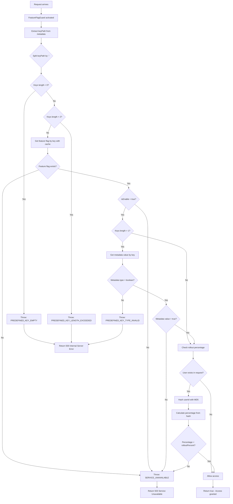

# Feature Flag Documentation

This documentation explains the features and usage of **Feature Flag Module**: Located at `src/modules/feature-flag`

## Overview

Feature flag module provides dynamic feature management for controlling application functionality. Supports gradual rollouts, A/B testing, and metadata-based feature configuration with caching for optimal performance.

## Related Documents

- [Cache Documentation][ref-doc-cache]

## Table of Contents

- [Related Documents](#related-documents)
- [Features](#features)
- [Flow](#flow)
- [Usage](#usage)
  - [With Decorators](#with-decorators)
  - [With Service](#with-service)
- [Metadata](#metadata)
- [Rollout Percentage](#rollout-percentage)
- [Caching](#caching)
- [Restrictions](#restrictions)

## Features

Feature flags provided in `src/migration/feature-flag.ts`:

| Key | Description | Rollout | Metadata |
|-----|-------------|---------|----------|
| `loginWithGoogle` | Enable login with Google | 100% | `signUpAllowed: true` |
| `loginWithApple` | Enable login with Apple | 100% | `signUpAllowed: true` |
| `loginWithCredential` | Enable login with Credential | 100% | - |
| `signUp` | Enable user sign up | 100% | - |
| `changePassword` | Enable change password feature | 100% | `forgotAllowed: true` |

## Flow

The `FeatureFlagGuard` validates feature flag status before allowing route access.



## Usage

## With Decorators

**Important:** `@FeatureFlagProtected()` does NOT provide authentication. Apply authentication guards separately if required.

Use `@FeatureFlagProtected()` decorator to protect routes:

```typescript
@Controller('auth')
export class AuthController {
  // Simple feature check
  @FeatureFlagProtected('loginWithGoogle')
  @Post('google')
  async loginWithGoogle() {
    // Route accessible only if loginWithGoogle is enabled
  }

  // Nested metadata check
  @FeatureFlagProtected('changePassword.forgotAllowed')
  @Post('forgot-password')
  async forgotPassword() {
    // Route accessible only if changePassword is enabled 
    // AND forgotAllowed metadata is true
  }
}
```

### With Service

```typescript
@Injectable()
export class YourService {
  constructor(
    private readonly featureFlagService: FeatureFlagService
  ) {}

  async example() {
    // Get feature flag with cache
    const flag = await this.featureFlagService.findOneByKeyAndCache('loginWithGoogle');
    
    // Get metadata only
    const metadata = await this.featureFlagService.findOneMetadataByKeyAndCache('changePassword');
  }
}
```

## Metadata

Metadata provides granular control within a single feature flag:

```typescript
// Feature flag with metadata
{
  key: 'changePassword',
  isEnable: true,
  metadata: {
    forgotAllowed: true,  // Can be toggled independently
    resetAllowed: false
  }
}
```

**Constraints:**
- No nested objects allowed
- Supports types: `boolean`, `number`, `string`
- Metadata keys cannot be added/removed (schema consistency)
- Only values can be modified

**Nested Key Access:**
```typescript
// Check both feature AND metadata
@FeatureFlagProtected('changePassword.forgotAllowed')
```

When using nested keys, metadata value **must** be boolean.

## Rollout Percentage

Controls gradual feature deployment using deterministic hashing:
```typescript
{
  key: 'newFeature',
  rolloutPercent: 30  // 30% of users get access
}
```

**How it works:**
1. User identifier (userId) is hashed using MD5
2. Hash converted to percentage (0-99)
3. Compared against `rolloutPercent`
4. Same user always gets same result (deterministic)

**Use cases:**
- A/B testing
- Gradual rollouts
- Canary deployments

## Caching

Feature flags are cached for performance. Configuration in `src/configs/feature-flag.config.ts`:
```typescript
{
  cachePrefixKey: 'FeatureFlag',
  cacheTtlMs: 3600  // 1 hour
}
```

**Cache operations:**
- Automatic cache on first read
- Cache invalidation on updates
- Key format: `FeatureFlag:{key}`

See [Cache Documentation][ref-doc-cache] for cache system details.

## Restrictions

- Feature flags cannot be added via admin API
- Feature flags cannot be deleted
- Metadata keys cannot be modified (add/remove)
- Only values can be updated: `isEnable`, `rolloutPercent`, metadata values


<!-- REFERENCES -->


<!-- BADGE LINKS -->

[ack-contributors-shield]: https://img.shields.io/github/contributors/andrechristikan/ack-nestjs-boilerplate?style=for-the-badge
[ack-forks-shield]: https://img.shields.io/github/forks/andrechristikan/ack-nestjs-boilerplate?style=for-the-badge
[ack-stars-shield]: https://img.shields.io/github/stars/andrechristikan/ack-nestjs-boilerplate?style=for-the-badge
[ack-issues-shield]: https://img.shields.io/github/issues/andrechristikan/ack-nestjs-boilerplate?style=for-the-badge
[ack-license-shield]: https://img.shields.io/github/license/andrechristikan/ack-nestjs-boilerplate?style=for-the-badge
[nestjs-shield]: https://img.shields.io/badge/nestjs-%23E0234E.svg?style=for-the-badge&logo=nestjs&logoColor=white
[nodejs-shield]: https://img.shields.io/badge/Node.js-339933?style=for-the-badge&logo=nodedotjs&logoColor=white
[typescript-shield]: https://img.shields.io/badge/TypeScript-007ACC?style=for-the-badge&logo=typescript&logoColor=white
[mongodb-shield]: https://img.shields.io/badge/MongoDB-white?style=for-the-badge&logo=mongodb&logoColor=4EA94B
[jwt-shield]: https://img.shields.io/badge/JWT-000000?style=for-the-badge&logo=JSON%20web%20tokens&logoColor=white
[jest-shield]: https://img.shields.io/badge/-jest-%23C21325?style=for-the-badge&logo=jest&logoColor=white
[pnpm-shield]: https://img.shields.io/badge/pnpm-%232C8EBB.svg?style=for-the-badge&logo=pnpm&logoColor=white&color=F9AD00
[docker-shield]: https://img.shields.io/badge/docker-%230db7ed.svg?style=for-the-badge&logo=docker&logoColor=white
[github-shield]: https://img.shields.io/badge/GitHub-100000?style=for-the-badge&logo=github&logoColor=white
[linkedin-shield]: https://img.shields.io/badge/LinkedIn-0077B5?style=for-the-badge&logo=linkedin&logoColor=white

<!-- CONTACTS -->

[ref-author-linkedin]: https://linkedin.com/in/andrechristikan
[ref-author-email]: mailto:andrechristikan@gmail.com
[ref-author-github]: https://github.com/andrechristikan
[ref-author-paypal]: https://www.paypal.me/andrechristikan
[ref-author-kofi]: https://ko-fi.com/andrechristikan

<!-- Repo LINKS -->

[ref-ack]: https://github.com/andrechristikan/ack-nestjs-boilerplate
[ref-ack-issues]: https://github.com/andrechristikan/ack-nestjs-boilerplate/issues
[ref-ack-stars]: https://github.com/andrechristikan/ack-nestjs-boilerplate/stargazers
[ref-ack-forks]: https://github.com/andrechristikan/ack-nestjs-boilerplate/network/members
[ref-ack-contributors]: https://github.com/andrechristikan/ack-nestjs-boilerplate/graphs/contributors
[ref-ack-license]: LICENSE.md

<!-- THIRD PARTY -->

[ref-nestjs]: http://nestjs.com
[ref-prisma]: https://www.prisma.io
[ref-mongodb]: https://docs.mongodb.com/
[ref-redis]: https://redis.io
[ref-bullmq]: https://bullmq.io
[ref-nodejs]: https://nodejs.org/
[ref-typescript]: https://www.typescriptlang.org/
[ref-docker]: https://docs.docker.com
[ref-dockercompose]: https://docs.docker.com/compose/
[ref-pnpm]: https://pnpm.io
[ref-12factor]: https://12factor.net
[ref-commander]: https://nest-commander.jaymcdoniel.dev
[ref-package-json]: package.json
[ref-jwt]: https://jwt.io
[ref-jest]: https://jestjs.io/docs/getting-started
[ref-git]: https://git-scm.com
[ref-google-console]: https://console.cloud.google.com/
[ref-google-client-secret]: https://developers.google.com/identity/protocols/oauth2

<!-- DOCUMENTS -->

[ref-doc-root]: readme.md
[ref-doc-activity-log]: docs/activity-log.md
[ref-doc-authentication]: docs/authentication.md
[ref-doc-authorization]: docs/authorization.md
[ref-doc-cache]: docs/cache.md
[ref-doc-configuration]: docs/configuration.md
[ref-doc-database]: docs/database.md
[ref-doc-environment]: docs/environment.md
[ref-doc-feature-flag]: docs/feature-flag.md
[ref-doc-file-upload]: docs/file-upload.md
[ref-doc-handling-error]: docs/handling-error.md
[ref-doc-installation]: docs/installation.md
[ref-doc-logger]: docs/logger.md
[ref-doc-message]: docs/message.md
[ref-doc-pagination]: docs/pagination.md
[ref-doc-project-structure]: docs/project-structure.md
[ref-doc-queue]: docs/queue.md
[ref-doc-request-validation]: docs/request-validation.md
[ref-doc-response]: docs/response.md
[ref-doc-security-and-middleware]: docs/security-and-middleware.md
[ref-doc-doc]: docs/doc.md
[ref-doc-third-party-integration]: docs/third-party-integration.md
[ref-doc-presign]: docs/presign.md
[ref-doc-term-policy]: docs/term-policy.md

<!-- CONTRIBUTOR -->

[ref-contributor-gzerox]: https://github.com/Gzerox
