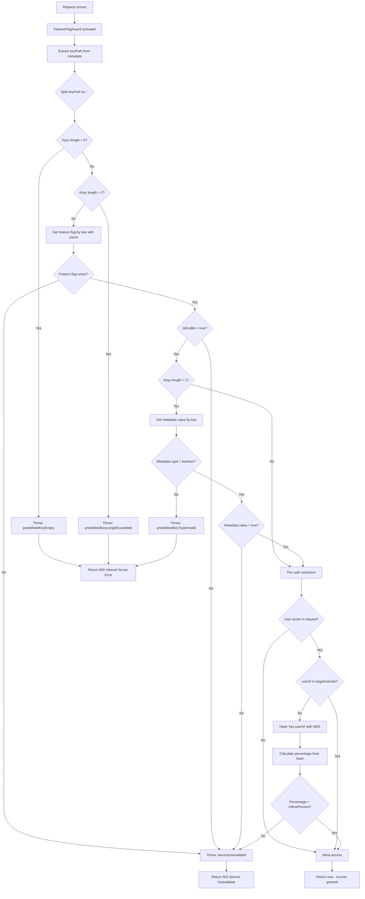

# Feature Flag Documentation

This documentation explains the features and usage of **Feature Flag Module**: Located at `src/modules/feature-flag`

## Overview

Feature flag module provides dynamic feature management for controlling application functionality. Supports gradual rollouts, per-user targeting, A/B testing, and metadata-based feature configuration with caching for optimal performance.

## Related Documents

- [Cache Documentation][ref-doc-cache]

## Table of Contents

- [Related Documents](#related-documents)
- [Features](#features)
- [Flow](#flow)
- [Usage](#usage)
  - [With Decorators](#with-decorators)
  - [With Service](#with-service)
- [Metadata](#metadata)
- [Targeting](#targeting)
- [Rollout Percentage](#rollout-percentage)
- [Caching](#caching)
- [Restrictions](#restrictions)

## Features

Feature flags provided in `src/migration/data/migration.feature-flag.data.ts`:

| Key | Description | Rollout | Metadata |
|-----|-------------|---------|----------|
| `loginWithGoogle` | Enable login with Google | 100% | `signUpAllowed: true` |
| `loginWithApple` | Enable login with Apple | 100% | `signUpAllowed: true` |
| `loginWithCredential` | Enable login with Credential | 100% | - |
| `signUp` | Enable user sign up | 100% | - |
| `changePassword` | Enable change password feature | 100% | `forgotAllowed: true` |

## Flow

The `FeatureFlagGuard` validates feature flag status before allowing route access.


```mermaid
flowchart TD
    A[Request arrives] --> B[FeatureFlagGuard activated]
    B --> C[Extract keyPath from metadata]
    C --> D{Split keyPath by '.'}
    D --> E{Keys length = 0?}
    E -->|Yes| F[Throw: predefinedKeyEmpty]
    E -->|No| G{Keys length > 2?}
    G -->|Yes| H[Throw: predefinedKeyLengthExceeded]
    G -->|No| I[Get feature flag by key with cache]
    I --> J{Feature flag exists?}
    J -->|No| K[Throw: serviceUnavailable]
    J -->|Yes| L{isEnable = true?}
    L -->|No| K
    L -->|Yes| M{Keys length > 1?}
    M -->|No| N[Per-user resolution]
    M -->|Yes| O[Get metadata value by key]
    O --> P{Metadata type = boolean?}
    P -->|No| Q[Throw: predefinedKeyTypeInvalid]
    P -->|Yes| R{Metadata value = true?}
    R -->|No| K
    R -->|Yes| N
    N --> S{User exists in request?}
    S -->|No| T[Allow access]
    S -->|Yes| S1{userId in targetUserIds?}
    S1 -->|Yes| T
    S1 -->|No| U[Hash 'key:userId' with MD5]
    U --> V[Calculate percentage from hash]
    V --> W{Percentage < rolloutPercent?}
    W -->|No| K
    W -->|Yes| T
    T --> X[Return true - Access granted]
    K --> Y[Return 503 Service Unavailable]
    F --> Z[Return 500 Internal Server Error]
    H --> Z
    Q --> Z
```

## Usage

## With Decorators

**Important:** `@FeatureFlagProtected()` does NOT provide authentication. Apply authentication guards separately if required.

Use `@FeatureFlagProtected()` decorator to protect routes:

```typescript
@Controller('auth')
export class AuthController {
  // Simple feature check
  @FeatureFlagProtected('loginWithGoogle')
  @Post('google')
  async loginWithGoogle() {
    // Route accessible only if loginWithGoogle is enabled
  }

  // Nested metadata check
  @FeatureFlagProtected('changePassword.forgotAllowed')
  @Post('forgot-password')
  async forgotPassword() {
    // Route accessible only if changePassword is enabled 
    // AND forgotAllowed metadata is true
  }
}
```

### With Service

```typescript
@Injectable()
export class YourService {
  constructor(
    private readonly featureFlagUtil: FeatureFlagUtil
  ) {}

  async example() {
    // Get feature flag with cache
    const flag = await this.featureFlagUtil.getByKeyAndCache('loginWithGoogle');
    
    // Get metadata only
    const metadata = await this.featureFlagUtil.getMetadataByKeyAndCache('changePassword');
  }
}
```

## Metadata

Metadata provides granular control within a single feature flag:

```typescript
// Feature flag with metadata
{
  key: 'changePassword',
  isEnable: true,
  metadata: {
    forgotAllowed: true,  // Can be toggled independently
    resetAllowed: false
  }
}
```

**Constraints:**
- No nested objects allowed
- Supported value types: `boolean`, `number`, `string`, and homogeneous `string[]` or `number[]`
- Arrays must be homogeneous. A mixed array (`[1, 'a']`), a nested array, and `boolean[]` are rejected
- An array value is data only, never a gate value. A nested-key gate (below) must resolve to a boolean
- Metadata keys must be camelCase, matching `/^[a-z][a-zA-Z0-9]*$/`
- Metadata keys cannot be added/removed (schema consistency)
- Only values can be modified. On update, an array value cannot change element type (`string[]` to `number[]` is rejected), and an empty array counts as an empty value and is rejected

**Nested Key Access:**
```typescript
// Check both feature AND metadata
@FeatureFlagProtected('changePassword.forgotAllowed')
```

When using nested keys, metadata value **must** be boolean.

Metadata is per-feature config (small on/off and typed values). For per-user targeting use `targetUserIds` (see [Targeting](#targeting)), not metadata.

## Targeting

`targetUserIds` is an allow-list of user ids that always receive the feature, bypassing the rollout percentage.

```typescript
{
  key: 'newFeature',
  targetUserIds: ['userIdA', 'userIdB'],
  rolloutPercent: 30
}
```

**How it works:**
1. Only evaluated when the request has an authenticated user.
2. If `userId` is in `targetUserIds`, access is granted and rollout is skipped.
3. Otherwise the user falls back to rollout percentage.
4. Anonymous requests (no user) skip targeting and rollout, and are allowed.

`targetUserIds` is admin-editable via the status update endpoint and defaults to empty.

## Rollout Percentage

Controls gradual feature deployment using deterministic hashing:
```typescript
{
  key: 'newFeature',
  rolloutPercent: 30  // 30% of users get access
}
```

**How it works:**
1. The flag key and userId are combined then hashed using MD5 (`key:userId`)
2. Hash converted to percentage (0-99)
3. Compared against `rolloutPercent`
4. Same user always gets the same result per flag (deterministic)
5. Salting by flag key keeps each flag independent (a user in flag A's 30% is not automatically in flag B's 30%)

Runs only when the request has a user who is not in `targetUserIds`.

**Use cases:**
- A/B testing
- Gradual rollouts
- Canary deployments

## Caching

Feature flags are cached for performance. Configuration in `src/configs/feature-flag.config.ts`:
```typescript
{
  keyPattern: 'FeatureFlag:{key}',
  cacheTtlInMs: ms('1h')
}
```

**Cache operations:**
- Automatic cache on first read
- Cache invalidation on updates
- Key format: `FeatureFlag:{key}`
- Best-effort: cache read/write/delete failures are logged and fall through to the database, so a cache outage never breaks evaluation. Unknown or disabled flags still return 503 (no fail-open).

See [Cache Documentation][ref-doc-cache] for cache system details.

## Restrictions

- Feature flags cannot be added via admin API
- Feature flags cannot be deleted
- Metadata keys cannot be modified (add/remove)
- Only values can be updated: `isEnable`, `rolloutPercent`, `targetUserIds`, metadata values


## Contribution

Special thanks to [Gzerox][ref-contributor-gzerox] for main contributor for this feature.


<!-- REFERENCES -->

[ref-doc-cache]: cache.md

[ref-contributor-gzerox]: https://github.com/Gzerox
