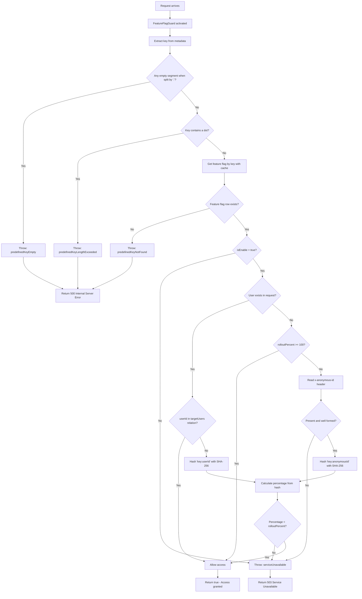

# Feature Flag Documentation

Feature Flag lives in `src/modules/feature-flag`.

## Overview

Flags gate routes and code paths. Targeting uses rollout percentage, a per-user allow-list (`targetUserIds`), and metadata sub-keys. Results are cached.

## Related Documents

- [Cache Documentation][ref-doc-cache]
- [Authorization Documentation][ref-doc-authorization]

## Table of Contents

- [Related Documents](#related-documents)
- [Features](#features)
- [Flow](#flow)
- [Usage](#usage)
  - [With Decorators](#with-decorators)
  - [With FeatureFlagCache](#with-featureflagcache)
- [Metadata](#metadata)
- [Targeting](#targeting)
- [Rollout Percentage](#rollout-percentage)
- [Caching](#caching)
- [Restrictions](#restrictions)

## Features

Feature flags provided in `src/migration/data/migration.feature-flag.data.ts`:

| Key | Description | Rollout | Metadata |
|-----|-------------|---------|----------|
| `loginWithGoogle` | Enable login with Google | 100% | `signUpAllowed: true` |
| `loginWithApple` | Enable login with Apple | 100% | `signUpAllowed: true` |
| `loginWithCredential` | Enable login with Credential | 100% | - |
| `signUp` | Enable user sign up | 100% | - |
| `changePassword` | Enable change password feature | 100% | `forgotAllowed: true` |
| `workspace` | Enable the workspace and project router surface, including invitation and join request | 100% | `invitationAllowed: true`, `joinRequestAllowed: true` |

## Flow

The `FeatureFlagGuard` validates feature flag status before allowing route access. The guard takes a bare flag key; it never reads metadata.


```mermaid
flowchart TD
    A[Request arrives] --> B[FeatureFlagGuard activated]
    B --> C[Extract key from metadata]
    C --> D{Any empty segment when split by '.'?}
    D -->|Yes| F[Throw: predefinedKeyEmpty]
    D -->|No| G{Key contains a dot?}
    G -->|Yes| H[Throw: predefinedKeyLengthExceeded]
    G -->|No| I[Get feature flag by key with cache]
    I --> J{Feature flag row exists?}
    J -->|No| J1[Throw: predefinedKeyNotFound]
    J -->|Yes| L{isEnable = true?}
    L -->|No| K[Throw: serviceUnavailable]
    L -->|Yes| S{User exists in request?}
    S -->|Yes| S1{userId in targetUsers relation?}
    S1 -->|Yes| T[Allow access]
    S1 -->|No| U[Hash 'key:userId' with SHA-256]
    S -->|No| N1{rolloutPercent >= 100?}
    N1 -->|Yes| T
    N1 -->|No| N2[Read x-anonymous-id header]
    N2 --> N3{Present and well formed?}
    N3 -->|No| K
    N3 -->|Yes| U2[Hash 'key:anonymousId' with SHA-256]
    U --> V[Calculate percentage from hash]
    U2 --> V
    V --> W{Percentage < rolloutPercent?}
    W -->|No| K
    W -->|Yes| T
    T --> X[Return true - Access granted]
    K --> Y[Return 503 Service Unavailable]
    F --> Z[Return 500 Internal Server Error]
    H --> Z
    J1 --> Z
```

## Usage

## With Decorators

`@FeatureFlagProtected()` provides no authentication; authentication comes from the guards stacked with it. A flag is never an authorization boundary.

`@FeatureFlagProtected()` takes a **bare flag key**. A key containing a dot is rejected with `predefinedKeyLengthExceeded` (500), and an empty segment is rejected with `predefinedKeyEmpty` (500). Metadata sub-keys are asserted in the owning domain, not by the decorator (see [Metadata](#metadata)).

```typescript
@Response('user.loginWithSocialGoogle', { schema: UserLoginResponseSchema })
@AuthSocialGoogleProtected()
@FeatureFlagProtected('loginWithGoogle')
@ApiKeyProtected()
@Post('/login/social/google')
async loginWithGoogle(
  @AuthJwtPayload<IAuthSocialPayload>('email') email: string,
  @Body({ schema: UserCreateSocialRequestSchema }) body: UserCreateSocialRequestDto
): Promise<IResponseReturn<IUserLoginOutcome>> {
  return this.userAuthHttpService.loginWithSocial(
    email,
    EnumUserLoginWith.socialGoogle,
    body
  );
}

@Response('user.forgotPassword')
@FeatureFlagProtected('changePassword')
@ApiKeyProtected()
@Post('/password/forgot')
async forgotPassword(
  @Body({ schema: UserForgotPasswordRequestSchema }) body: UserForgotPasswordRequestDto
): Promise<void> {
  await this.userPasswordHttpService.forgotPassword(body);
}
```

`@FeatureFlagProtected()` must sit **above** `@AuthJwtAccessProtected()` in the decorator stack. NestJS evaluates stacked decorators bottom-up, so the decorator nearest the HTTP method runs first; sitting above the JWT decorator is what makes the flag guard run *after* the JWT strategy has populated `request.user`. Without that ordering the guard never sees a user and always takes the anonymous branch, making target-user allow-listing and any rollout below 100% inert. See [Authorization Documentation][ref-doc-authorization] for the full stack.

`@FeatureFlagProtected()` sits **above** `@AuthJwtAccessProtected()` in the decorator stack. NestJS evaluates stacked decorators bottom-up, so the decorator nearest the HTTP method runs first; sitting above the JWT decorator is what makes the flag guard run *after* the JWT strategy has populated `request.user`. Without that ordering the guard never sees a user and always takes the anonymous branch, making `targetUserIds` and any rollout below 100% inert. See [Authorization Documentation][ref-doc-authorization] for the full stack.

### With FeatureFlagCache

`FeatureFlagCache` is the cache-through reader, exported by `FeatureFlagDomainModule`. `UserAuthDomain` reads social sign-up metadata through it:

```typescript
const featureFlag =
  await this.featureFlagCache.getMetadataByKeyAndCache<{
    signUpAllowed: boolean;
  }>(
    loginWith === EnumUserLoginWith.socialGoogle
      ? 'loginWithGoogle'
      : 'loginWithApple'
  );
```

`FeatureFlagDomain` is the other reader: `getByKeyAndCache` on evaluation, `deleteCacheByKey` after an admin update.

`FeatureFlagUtil` sits beside it and holds the metadata shape checks (`checkMetadataKey`) the domain applies on update.

## Metadata

Metadata on a single flag:

```typescript
// Feature flag with metadata
{
  key: 'changePassword',
  isEnable: true,
  metadata: {
    forgotAllowed: true
  }
}
```

**Constraints:**
- No nested objects
- Supported value types: `boolean`, `number`, `string`, and homogeneous `string[]` or `number[]`
- Arrays are homogeneous. A mixed array (`[1, 'a']`), a nested array, and `boolean[]` are rejected
- An array value is data only, never a gate value. A nested-key gate (below) resolves to a boolean
- Metadata keys are camelCase, matching `/^[a-z][a-zA-Z0-9]*$/`
- Metadata keys cannot be added/removed (schema consistency)
- Only values can be modified. On update, an array value cannot change element type (`string[]` to `number[]` is rejected), and an empty array counts as an empty value and is rejected

**Metadata sub-key gating:**

A metadata sub-key is asserted in the owning domain, not by the route decorator. The domain calls `FeatureFlagDomain.validateFeatureFlagMetadata(key, metadataKey)` at the point in the flow where the sub-key governs the behaviour:

```typescript
await this.featureFlagDomain.validateFeatureFlagMetadata(
  'changePassword',
  'forgotAllowed'
);
```

It throws `predefinedKeyNotFound` (500) when the flag row is missing, `serviceUnavailable` (503) when the flag is disabled, `predefinedKeyTypeInvalid` (500) when the metadata value is not a boolean, and `serviceUnavailable` (503) when the boolean is `false`.

Metadata is per-feature config (small on/off and typed values). Per-user targeting uses the `FeatureFlag.targetUsers` relation (see [Targeting](#targeting)), not metadata.

## Targeting

`FeatureFlag.targetUsers` is an allow-list stored as `FeatureFlagUser` rows. A targeted user always receives the feature, bypassing the rollout percentage.

```typescript
{
  key: 'newFeature',
  targetUsers: [{ userId: 'userIdA' }, { userId: 'userIdB' }],
  rolloutPercent: 30
}
```

1. Only evaluated when the request has an authenticated user.
2. The relation rows are converted to user IDs during evaluation. If `userId` matches one, access is granted and rollout is skipped.
3. Otherwise the user falls back to rollout percentage.
4. Anonymous requests (no user) skip targeting and go straight to the anonymous rollout branch (see [Rollout Percentage](#rollout-percentage)).

The `targetUsers` relation is managed through dedicated target-user endpoints and defaults to empty. Status updates only change `isEnable` and `rolloutPercent`.

**Admin target-user endpoints:**
- `PUT /feature-flag/:featureFlagId/user` adds a user to the allow-list. Adding an existing user is idempotent. The body is `{ "userId": "<uuid>" }`.
- `DELETE /feature-flag/:featureFlagId/user/:userId` removes a user from the allow-list. Removing a missing user is idempotent.
- Both endpoints invalidate the feature-flag cache.

## Rollout Percentage

Controls gradual feature deployment using deterministic hashing:
```typescript
{
  key: 'newFeature',
  rolloutPercent: 30  // 30% of users get access
}
```

The flag key and the caller identifier are combined and hashed with SHA-256 (`HelperHashService.sha256Hash('key:identifier')`). The first 8 hex characters of the digest, read as an integer, modulo 100 give the percentage (0-99), then compared against `rolloutPercent`. The same identifier always gets the same result per flag. Salting by flag key keeps each flag independent (a user in flag A's 30% is not automatically in flag B's 30%).

**Authenticated callers** use `userId` as the identifier. Rollout runs only when the user is not represented in `targetUsers`.

**Anonymous callers** are handled separately:

- `rolloutPercent >= 100` passes without any identifier.
- Below 100, the identifier comes from the `x-anonymous-id` request header. Its name, max length (100) and allowed charset (`/^[a-zA-Z0-9-_]+$/`) live in `src/configs/feature-flag.config.ts`.
- The evaluation **fails closed** with 503 when that header is absent, empty, over length, or does not match the pattern. An anonymous caller lands in the same bucket only while it sends the same `x-anonymous-id`.

**Use cases:**
- Gradual rollouts
- Canary deployments

## Caching

Feature flags are cached. Configuration in `src/configs/feature-flag.config.ts`:
```typescript
{
  keyPattern: 'FeatureFlag:{key}',
  cacheTtlInMs: ms('1h'),
  anonymous: {
    headerName: 'x-anonymous-id',
    idMaxLength: 100,
    idPattern: /^[a-zA-Z0-9-_]+$/
  }
}
```

**Cache operations:**
- Cache on first read
- Cache invalidation on updates
- Key format: `FeatureFlag:{key}`
- Best-effort: cache read/write/delete failures are logged and fall through to the database, so a cache outage never breaks evaluation. There is no fail-open: an unknown flag key still returns 500 (`predefinedKeyNotFound`) and a disabled flag still returns 503 (`serviceUnavailable`).

See [Cache Documentation][ref-doc-cache] for cache system details.

## Restrictions

- Feature flags cannot be added via admin API
- Feature flags cannot be deleted
- Metadata keys cannot be modified (add/remove)
- Only values can be updated: `isEnable`, `rolloutPercent`, metadata values
- Target users can be added or removed through dedicated target-user endpoints


## Contribution

Special thanks to [Gzerox][ref-contributor-gzerox] for main contributor for this feature.


<!-- REFERENCES -->

[ref-doc-cache]: cache.md
[ref-doc-authorization]: authorization.md

[ref-contributor-gzerox]: https://github.com/Gzerox
