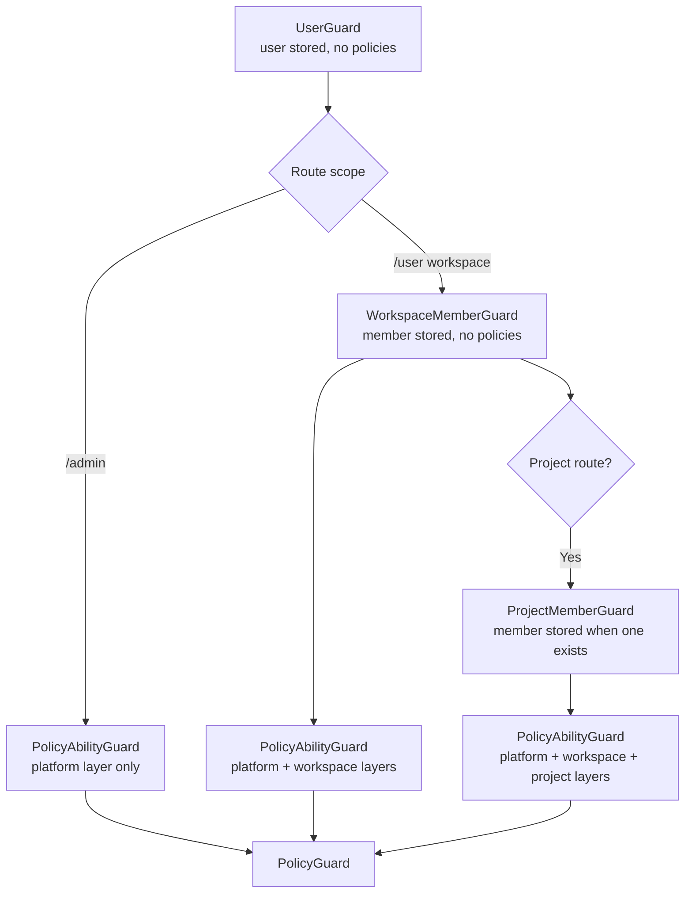
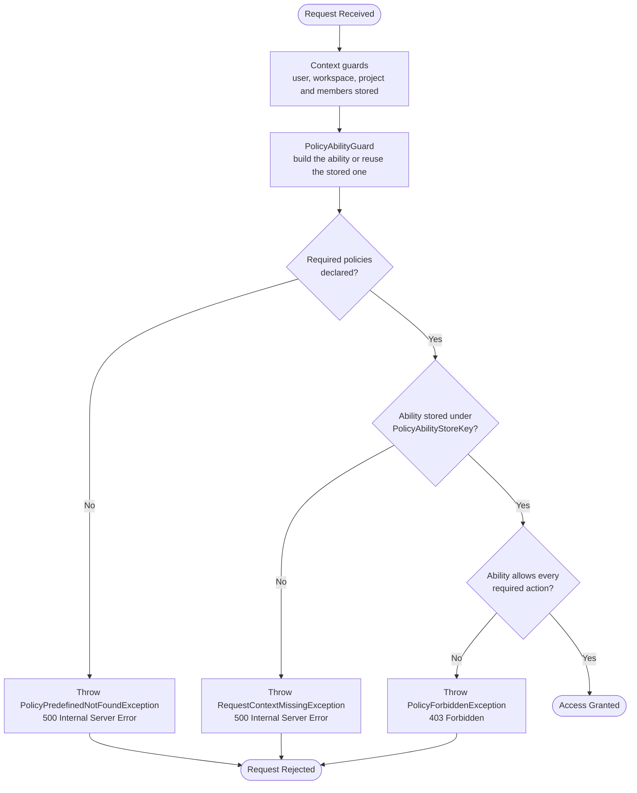

# CASL v7 Authorization Documentation

Decorator locations:

- **PlatformPolicyProtected**, **PolicyAbilityProtected**: `src/modules/policy/decorators`
- **WorkspacePolicyProtected**, **WorkspaceProtected**, **WorkspaceMemberProtected**: `src/modules/workspace/decorators`
- **ProjectPolicyProtected**, **ProjectProtected**, **ProjectMemberProtected**: `src/modules/project/decorators`

This document describes the CASL v7 policy layer as it runs today: one request ability, one enforcement guard, and the HTTP-service checks that judge a record. It follows the structure of [Authorization][ref-doc-authorization] so its sections can be merged into that document.

## Overview

Authorization is CASL only, evaluated through `@casl/prisma`. Guards stack as:

- user (authenticates and stores the user; loads no policies)
- workspace and project resolution and membership (store the resource and the member rows; load no policies)
- policy ability guard (builds the request ability from the role policies available in the request)
- policy enforcement guard (decides against the ability)
- term-policy acceptance

A role decides nothing by itself: it is a named set of policy rows. `PolicyAbilityGuard` turns the policies of the roles in play into one CASL ability, and `PolicyGuard` evaluates the declared `(subject, action)` pairs against it. Three mechanisms use that ability:

- **Type-level checks** by `PolicyGuard`, before the handler runs
- **Record-level checks** by HTTP services, which call `PolicyAbilityDomain.assertCan` with a loaded or prospective record
- **Collection predicates** from `PolicyAbilityDomain.accessibleWhere` and `requireAccessibleWhere`, which become a Prisma `where` in list queries

Domains own business invariants (last owner, last admin, role scope, immutable roles). Repositories own Prisma queries and transactions. A domain never reads a request ability, so processors and automations call it with no HTTP state.

## Related Documents

- [Authorization Documentation][ref-doc-authorization] - Decorator order, user guard, term policy, role catalog
- [Workspace Documentation][ref-doc-workspace] - Workspace guards and `x-workspace-id`
- [Project Documentation][ref-doc-project] - Project guards and project roles
- [Authentication Documentation][ref-doc-authentication] - JWT, sessions, and API keys

## Table of Contents

- [Overview](#overview)
- [Related Documents](#related-documents)
- [Decorator Order](#decorator-order)
- [Roles and the Request Ability](#roles-and-the-request-ability)
- [Policy Protected](#policy-protected)
    - [Decorators](#decorators)
        - [PolicyProtected and the Scoped Wrappers](#policyprotected-and-the-scoped-wrappers)
        - [PolicyAbilityProtected() Decorator](#policyabilityprotected-decorator)
    - [Guards](#guards)
        - [PolicyAbilityGuard](#policyabilityguard)
        - [PolicyGuard](#policyguard)
    - [Record-Level Checks](#record-level-checks)
    - [Collection Queries](#collection-queries)
    - [Effective Permissions](#effective-permissions)
    - [CASL Integration](#casl-integration)
    - [Route Policy Map](#route-policy-map)
    - [Important Notes](#important-notes)
- [Workspace and Project Protected](#workspace-and-project-protected)
- [Role Catalog and Policies](#role-catalog-and-policies)
    - [Role Catalog](#role-catalog)
    - [Managing Roles and Policies](#managing-roles-and-policies)
    - [Important Notes](#important-notes-2)
- [Current Boundaries](#current-boundaries)

## Decorator Order

NestJS evaluates stacked decorators bottom-up, so the guard NEAREST the method executes FIRST. A `/user` route that carries a project policy stacks:

```typescript
@Doc({ summary: '…' })                     // 1.  OpenAPI operation + global error kit
@Response('example.action')                // 2.  @Response / @ResponsePagination / @ResponseFile
@TermPolicyAcceptanceProtected()           // 3.  Term policy acceptance
@ProjectPolicyProtected({ ... })           // 4.  Policy: ability guard + enforcement guard
@ProjectMemberProtected(...)               // 5.  Project membership
@ProjectProtected()                        // 6.  Project resolution from :projectId
@WorkspaceMemberProtected()                // 7.  Workspace membership
@WorkspaceProtected()                      // 8.  Workspace resolution from x-workspace-id
@UserProtected()                           // 9.  User status
@FeatureFlagProtected('workspace')         // 10. Feature flag
@AuthJwtAccessProtected()                  // 11. JWT access
@ApiKeyProtected()                         // 12. API key
@Get('/endpoint')                          // 13. HTTP method, always last
```

A route takes only the slots it needs; the relative order never changes. Guard execution runs `@ApiKeyProtected()` → `@AuthJwtAccessProtected()` → `@FeatureFlagProtected()` → `@UserProtected()` → `@WorkspaceProtected()` → `@WorkspaceMemberProtected()` → `@ProjectProtected()` → `@ProjectMemberProtected()` → the policy decorator (ability guard, then enforcement guard) → `@TermPolicyAcceptanceProtected()`.

- The policy decorator sits ABOVE the membership decorators, so `PolicyAbilityGuard` reads the member rows they stored.
- Slot 4 takes one of `@PlatformPolicyProtected`, `@WorkspacePolicyProtected`, `@ProjectPolicyProtected`, or `@PolicyAbilityProtected()`.
- An `/admin` route takes none of slots 5-8. It reaches workspaces and projects through `@PlatformPolicyProtected()` and takes the id from the path.

## Roles and the Request Ability

One `Role` model covers every level. A role has a `scope` (`platform`, `workspace`, or `project`), an immutable `key`, and the policy rows it owns. The role a user, a workspace member, or a project member holds is a foreign key (`roleId`) to that model.

No decorator gates a route by role. `PolicyAbilityGuard` builds one ability per request from every role available in the request context and stores it under `PolicyAbilityStoreKey`. `PolicyAbilityDomain.buildAbility` takes this input:

```typescript
{
  user: { id, roleId },
  workspace?: { id, memberRoleId },
  project?: { id, memberRoleId: string | null },
}
```

| Layer     | Loaded when                                                 | Policies loaded                                   |
| --------- | ----------------------------------------------------------- | ------------------------------------------------- |
| platform  | Always                                                      | The platform role of the authenticated user       |
| workspace | A workspace and a workspace member are stored               | The workspace role of the acting workspace member |
| project   | A project is stored and the caller has a project member row | The project role of the acting project member     |

The domain builds one placeholder map from the whole request context and passes it to every loaded layer: `${userId}` always, `${workspaceId}` when a workspace is in context, `${projectId}` when a project is in context. The layer decides which roles are loaded; the request context decides which values exist. The domain loads each role's policies through the policy repository, resolves the placeholders, and passes the policies of each role to `PolicyAbilityFactory.resolveRules`, and the concatenated rules to `PolicyAbilityFactory.build`. The factory adds every allowing rule before every inverted rule, so a matching inverted rule is authoritative whichever role holds it. A layer whose context is absent contributes no rules.

The ability lives in the request-scoped store (`ClsService`), so it never crosses requests. Policy rows are read from the database on every request, so a role or policy change applies from the next request. Role and membership context are fixed when the guard runs. A guard that finds a stored ability returns without loading or overwriting anything, so stacked policy decorators share the first ability built for the request.



A domain or HTTP service that has to branch on a capability reads the ability from `PolicyAbilityStoreKey` through `PolicyAbilityDomain.requireStored` and calls `ability.can(action, subject)`. `PolicyAbilityDomain.assertCan(ability, action, target)` throws `PolicyForbiddenException` (403, `51100`) instead, carrying the `reason` of the matched inverted rule when one exists.

`superAdmin` holds a persisted policy `manage` on `all`. That row lets it pass every enforcement guard, and the policies of the `superAdmin` role cannot be created, updated, or deleted (`PolicyImmutableException`, 403, `51104`). The platform `admin` role holds an explicit subject list.

## Policy Protected

A policy names an action (`read`, `create`, `update`, `delete`, `manage`) on a subject (`User`, `Workspace`, `ProjectMember`, and the rest of `EnumPolicySubject`). `manage` is the CASL wildcard action; `all` is the wildcard subject.

### Decorators

#### PolicyProtected and the Scoped Wrappers

**Method decorator** that applies `PolicyAbilityGuard` and `PolicyGuard`, stores the required `{ subject, action[] }` metadata under `PolicyRequiredMetaKey`, and documents the `403` and `500` policy error responses.

**Parameters:**

- `...requirements` (IPolicyRequired[]): One or more `{ subject, action[] }` objects naming the required permissions

Three wrappers fix the subject union at the call site. They all bind the same guards and the same metadata key; the union is a compile-time constraint, not a separate ability.

| Decorator                        | Subjects it accepts                                                                                                                                                                  | Used by                                  |
| -------------------------------- | ------------------------------------------------------------------------------------------------------------------------------------------------------------------------------------ | ---------------------------------------- |
| `@PlatformPolicyProtected(...)`  | `EnumPolicyPlatformSubject`: `all`, `ApiKey`, `Role`, `User`, `Session`, `ActivityLog`, `PasswordHistory`, `TermPolicy`, `FeatureFlag`, `Device`, `Workspace`, `Project`, `analytic` | `/admin` routes                          |
| `@WorkspacePolicyProtected(...)` | `EnumPolicyWorkspaceSubject`: `Workspace`, `WorkspaceMember`, `WorkspaceInvite`, `WorkspaceJoinRequest`, `Project`, `analytic`                                                       | `/user` workspace routes, project create |
| `@ProjectPolicyProtected(...)`   | `EnumPolicyProjectSubject`: `Project`, `ProjectMember`                                                                                                                               | `/user` project routes                   |

**Usage:**

```typescript
@TermPolicyAcceptanceProtected()
@WorkspacePolicyProtected({
  subject: EnumPolicySubject.WorkspaceInvite,
  action: [EnumPolicyAction.create],
})
@WorkspaceMemberProtected()
@WorkspaceProtected()
@UserProtected()
@AuthJwtAccessProtected()
@Post('/invite/create')
async inviteCreate(
  @WorkspaceCurrent() workspace: Workspace,
  @Body({ schema: WorkspaceInviteCreateRequestSchema }) body: WorkspaceInviteCreateRequestDto
): Promise<IResponseReturn<WorkspaceInviteResponseDto>> {
  return this.workspaceInviteHttpService.createInvite(workspace, userId, body);
}
```

#### PolicyAbilityProtected Decorator

**Method decorator** that applies `PolicyAbilityGuard` alone. It declares no requirement and enforces nothing. A route that reads the ability in its service uses it: the effective-permission routes and the member project list.

### Guards

#### `PolicyAbilityGuard`

The guard reads the stored `PolicyAbilityStoreKey` first and returns when it holds an ability. Otherwise it reads the user (required), the workspace and workspace member, and the project and project member from the request store, and builds the ability through `PolicyAbilityDomain`. A missing user throws `RequestContextMissingException` (500, `50304`). The guard resolves no route id, loads no target record, and authorizes nothing.

The workspace layer is included only when both the workspace and the workspace member are stored. The project layer is included when the project is stored; its role is loaded only when the project member is stored.

#### `PolicyGuard`

The guard reads the handler's required policies, then the stored ability, and calls `PolicyAbilityDomain.assertCan` for each required `(subject, action)` pair as a type-level check. It passes the subject name, never a record. It loads no policy rows and builds no ability.

The policy decorators follow this validation sequence:

1. **Required Policies Check**: Validates that required policies are declared on the handler; none declared throws `PolicyPredefinedNotFoundException` (500, `51101`)
2. **Ability Check**: Reads the ability under `PolicyAbilityStoreKey`; a missing entry throws `RequestContextMissingException` (500, `50304`)
3. **Permission Validation**: `PolicyAbilityDomain.assertCan` checks each required `(subject, action)` pair against the ability
4. **Access Decision**: Grants access, or throws `PolicyForbiddenException` on the first pair that is denied

**Flow Diagram:**



### Record-Level Checks

The type-level check asks by subject name, so a rule's `conditions` are not evaluated by it. Record-level checks close that gap in the HTTP service. The service loads the record through a domain method, reads the ability with `PolicyAbilityDomain.requireStored`, and calls `PolicyAbilityDomain.assertCan(ability, action, subject(EnumPolicySubject.X, record))`, with `subject` from `@casl/ability`. CASL then evaluates the conditions against the real record fields. The check runs before the domain call, so a denied record never reaches the domain.

| Operation                                               | Action   | Record checked                                                                    |
| ------------------------------------------------------- | -------- | --------------------------------------------------------------------------------- |
| Workspace update, public-visibility update, slug update | `update` | The resolved `Workspace`                                                          |
| Workspace delete                                        | `delete` | The resolved `Workspace`                                                          |
| Workspace ownership transfer                            | `update` | The resolved `Workspace`                                                          |
| Workspace member role update                            | `update` | The target `WorkspaceMember`, loaded by `:workspaceMemberId` inside the workspace |
| Workspace member remove                                 | `delete` | The target `WorkspaceMember`                                                      |
| Invite create                                           | `create` | A prospective `WorkspaceInvite` with the current `workspaceId`                    |
| Invite resend                                           | `update` | The `WorkspaceInvite`, loaded by id inside the workspace                          |
| Invite revoke                                           | `delete` | The `WorkspaceInvite`                                                             |
| Join request accept and reject                          | `update` | The `WorkspaceJoinRequest`, loaded by id inside the workspace                     |
| Project create                                          | `create` | A prospective `Project` with the current `workspaceId`                            |
| Project read                                            | `read`   | The resolved `Project`                                                            |
| Project update and slug update                          | `update` | The resolved `Project`                                                            |
| Project delete                                          | `delete` | The resolved `Project`                                                            |
| Project member assign                                   | `create` | A prospective `ProjectMember` with `projectId`, `userId`, and `roleId`            |
| Project member role update                              | `update` | The target `ProjectMember`, loaded by `:projectMemberId` inside the project       |
| Project member remove                                   | `delete` | The target `ProjectMember`                                                        |

A target lookup uses the route identifier within the business boundary (workspace or project), so a record outside it answers the module's not-found exception. The target is never substituted for the caller's membership row, and the caller's membership is never substituted for a route target. The invite and join-request getters (`getInvite`, `getJoinRequest`) and the member getters return the record without judging it; the check stays in the HTTP service. Invite and join-request records are loaded again by the domain method that mutates them.

### Collection Queries

`PolicyAbilityDomain.accessibleWhere(ability, action, subject)` converts the stored ability into a Prisma where-input with `accessibleBy(ability, action).ofType(subject)`, and returns `null` when the ability holds no rule for the action and subject. `requireAccessibleWhere` throws `PolicyForbiddenException` instead of returning `null`, so a query never runs without its predicate.

| List                  | Predicate                                       | Behaviour                                                                                                                                                           |
| --------------------- | ----------------------------------------------- | ------------------------------------------------------------------------------------------------------------------------------------------------------------------- |
| Admin workspace list  | `requireAccessibleWhere(read, Workspace)`       | Required                                                                                                                                                            |
| Admin project list    | `requireAccessibleWhere(read, Project)`         | Required                                                                                                                                                            |
| Workspace member list | `requireAccessibleWhere(read, WorkspaceMember)` | Required                                                                                                                                                            |
| Member project list   | `accessibleWhere(read, Project)`                | Optional. A caller whose ability grants `Project` `read` sees every project of the workspace that read allows; any other caller sees the projects it is assigned to |

The service passes the predicate to the domain as an optional generic `where`. The repository AND-composes it with its mandatory constraints (workspace, project, active rows) and with the caller's search, equality, and pagination filters, so a caller filter cannot replace or drop the policy predicate. The Prisma client carries `createCaslExtension()`, which turns a denied predicate into "matches nothing".

Invite, join-request, and project-member lists apply their policy at the type level only and filter by the workspace or project boundary in the repository.

### Effective Permissions

`PolicyAbilityDomain.getEffectivePermissions(ability, subjects)` evaluates every `EnumPolicyAction` against each requested subject and returns only the subjects with at least one granted action:

```typescript
{
  subject: EnumPolicySubject;
  actions: EnumPolicyAction[];
}
```

`GET /user/workspace/permissions` and `GET /user/project/permissions/:projectId` run behind `@PolicyAbilityProtected()`, read the single request ability, and select their subject catalog. The workspace catalog is `Workspace`, `WorkspaceMember`, `WorkspaceInvite`, `WorkspaceJoinRequest`, `Project`, and `analytic`. The project catalog is `Project` and `ProjectMember`. The project route runs behind `@ProjectMemberProtected({ required: false })`, so a caller without a project member row still receives the permissions its workspace and platform roles grant on that project. Neither endpoint builds a second ability.

### CASL Integration

The project uses [CASL][casl] v7 with `@casl/prisma`. The ability is a typed Prisma ability created by `createPrismaAbility`, so a stored condition is a Prisma where-input.

**Rule model.** A `Policy` row is one rule:

| Field        | Meaning                                                                                                            |
| ------------ | ------------------------------------------------------------------------------------------------------------------ |
| `roleId`     | Role owning the rule                                                                                               |
| `subject`    | A value of `EnumPolicySubject`. It maps onto the Prisma model of the same name; `all` and `analytic` have no model |
| `action`     | One or more of `manage`, `read`, `create`, `update`, `delete`                                                      |
| `conditions` | A flat JSON object interpreted by CASL Prisma, or `null` for the whole subject                                     |
| `inverted`   | `true` makes the rule a CASL `cannot`                                                                              |
| `reason`     | Optional text carried by an inverted rule                                                                          |

Stored rows are the source of truth. The factory does not mutate them and derives no rule from a role name.

**PolicyAbilityFactory:**

- `resolveRules(policies, placeholders)`: Resolves the placeholders of each stored rule into plain ability rules and omits a rule that cannot resolve
- `build(rules)`: Creates the Prisma ability from ability rules, allowing rules first and inverted rules after

**PolicyAbilityDomain:**

- `buildAbility(input)`: Builds the placeholder map from the request context, loads the role policies of each available layer, resolves them with `resolveRules`, and builds the combined ability once
- `requireStored(key)`: Reads a request-store value, throwing `RequestContextMissingException` when it is empty
- `assertCan(ability, action, target)`: Throws `PolicyForbiddenException` when the ability denies the action on the subject name or tagged record
- `accessibleWhere`, `requireAccessibleWhere`: The Prisma where-input of the records the ability reaches
- `getEffectivePermissions(ability, subjects)`: The concrete actions the ability grants per subject

**PolicyDomain:**

- `createByAdmin`, `updateByAdmin`, `deleteByAdmin`: Write a role's policy rows and reject any write to the `superAdmin` role
- `findManyByRole(roleId)`: Lists the policy rows of one role

**Placeholders.** A condition value that equals one of these tokens is replaced by a value from the request context before the ability is built:

| Placeholder      | Resolved from the request context |
| ---------------- | --------------------------------- |
| `${userId}`      | The authenticated user            |
| `${workspaceId}` | The current workspace, when any   |
| `${projectId}`   | The current project, when any     |

The factory recognizes placeholder-shaped scalar strings generically and looks them up in the one map the domain built for the request. Non-placeholder scalars stay unchanged. A `${projectId}` in a workspace-role rule is safe because `ProjectGuard` stores only a project that belongs to the resolved workspace.

**Fail-closed resolution.** A rule is omitted from the ability when its conditions are not a flat object of scalar JSON values (a nested object, array, function, symbol, or `undefined` value) or when a placeholder has no value in the request context. A missing context never widens a rule into an unconditional one, so a `ProjectMember` rule that carries `${projectId}` is inert on a route with no project.

**Scope conditions.** Seeded workspace-level and project-level rules tie themselves to the active boundary through a condition key set to a placeholder:

| Subject                                                                             | Level     | Condition key | Placeholder      |
| ----------------------------------------------------------------------------------- | --------- | ------------- | ---------------- |
| `Workspace`                                                                         | workspace | `id`          | `${workspaceId}` |
| `WorkspaceMember`, `WorkspaceInvite`, `WorkspaceJoinRequest`, `Project`, `analytic` | workspace | `workspaceId` | `${workspaceId}` |
| `Project`                                                                           | project   | `id`          | `${projectId}`   |
| `ProjectMember`                                                                     | project   | `projectId`   | `${projectId}`   |

A lone `create` on `Project` carries no condition, since no project exists yet.

### Route Policy Map

| Operation                                    | Policy decorator                                                             | Additional enforcement                                                        |
| -------------------------------------------- | ---------------------------------------------------------------------------- | ----------------------------------------------------------------------------- |
| Platform administration                      | `@PlatformPolicyProtected`                                                   | Platform layer only; admin lists add `requireAccessibleWhere`                 |
| Workspace get                                | `@WorkspacePolicyProtected` (`Workspace` `read`)                             | Workspace and membership guards                                               |
| Workspace update, delete, ownership transfer | `@WorkspacePolicyProtected` (`Workspace` `update` or `delete`)               | Record check on `Workspace`; domain invariants                                |
| Workspace member list                        | `@WorkspacePolicyProtected` (`WorkspaceMember` `read`)                       | `requireAccessibleWhere`; workspace boundary                                  |
| Workspace member role and remove             | `@WorkspacePolicyProtected` (`WorkspaceMember` `update` or `delete`)         | Record check on the target; peer, owner, and last-owner rules                 |
| Invite and join-request lists                | `@WorkspacePolicyProtected` (`read`)                                         | Workspace boundary; status filters                                            |
| Invite create, resend, revoke                | `@WorkspacePolicyProtected` (`WorkspaceInvite` `create`, `update`, `delete`) | Record check; pending-state invariants                                        |
| Join request accept and reject               | `@WorkspacePolicyProtected` (`WorkspaceJoinRequest` `update`)                | Record check; pending-state invariants                                        |
| Workspace analytics                          | `@WorkspacePolicyProtected` (`analytic` `read`)                              | Workspace boundary                                                            |
| Workspace leave                              | none                                                                         | Membership guards; last-owner invariant                                       |
| Project list                                 | `@PolicyAbilityProtected()`                                                  | Optional `accessibleWhere`; assigned-project filter                           |
| Project create                               | `@WorkspacePolicyProtected` (`Project` `create`)                             | Record check on the prospective project; creator becomes project `admin`      |
| Project get, update, slug update, delete     | `@ProjectPolicyProtected` (`Project`)                                        | Record check on the project; `@ProjectMemberProtected({ required: false })`   |
| Project member list                          | `@ProjectPolicyProtected` (`ProjectMember` `read`)                           | Project boundary                                                              |
| Project member assign                        | `@ProjectPolicyProtected` (`ProjectMember` `create`)                         | Record check on the prospective member; workspace-member and role-scope rules |
| Project member role and remove               | `@ProjectPolicyProtected` (`ProjectMember` `update` or `delete`)             | Record check on the target; peer and last-admin rules                         |
| Project leave                                | none                                                                         | Strict `@ProjectMemberProtected()`; last-admin invariant                      |
| Effective permissions                        | `@PolicyAbilityProtected()`                                                  | Service evaluates the stored ability                                          |

### Important Notes

- A policy decorator reads what the user, workspace, and project guards stored, all of which depend on `@AuthJwtAccessProtected()`
- Every action of a required policy has to be allowed by the ability. Requiring `[EnumPolicyAction.update, EnumPolicyAction.delete]` on one subject grants access only when the ability allows both
- A subject on which the ability holds no rule fails the type-level check with `PolicyForbiddenException`
- Membership guards do not authorize a different target member. Target authorization is the record check of the HTTP service
- The ability is read by HTTP services only. A domain method takes the inputs the service derives from the ability (a `where`, a flag, a loaded record)
- Seeded `ProjectMember` rules on the workspace roles carry `projectId: ${projectId}`. They resolve on a route with a project in context and are omitted on a route with none

## Workspace and Project Protected

Four decorators scope a `/user` request to one workspace and, inside it, to one project. They are documented in full by [Workspace][ref-doc-workspace] and [Project][ref-doc-project].

| Decorator                                         | Guard it binds         | Selects the resource from                                           | Stores                                                |
| ------------------------------------------------- | ---------------------- | ------------------------------------------------------------------- | ----------------------------------------------------- |
| `@WorkspaceProtected()`                           | `WorkspaceGuard`       | The `x-workspace-id` header                                         | The workspace row                                     |
| `@WorkspaceMemberProtected()`                     | `WorkspaceMemberGuard` | The membership of the resolved workspace                            | The workspace member row with its role                |
| `@ProjectProtected()`                             | `ProjectGuard`         | The `:projectId` route param, constrained to the resolved workspace | The project row                                       |
| `@ProjectMemberProtected({ required?: boolean })` | `ProjectMemberGuard`   | The membership of the resolved project                              | The project member row with its role, when one exists |

- **Each guard reads what the previous one stored.** Dropping one from the stack leaves the next reading an empty store key.
- **No context guard loads policies or authorizes.** They store context for `PolicyAbilityGuard` and the services.
- **`@ProjectMemberProtected()` is strict by default.** A caller with no `ProjectMember` row is rejected with `ProjectMemberForbiddenException`.
- **`{ required: false }` lets a caller without a project row through.** No member is stored, so the project layer of the ability is empty and the platform and workspace layers decide. A workspace-scoped role can then reach a project it is not assigned to. The policy-gated project routes use that form (get, update, slug update, delete, member list, assign, role update, remove). `@ProjectMemberCurrent()` reads a stored member and throws `RequestContextMissingException` on such a route, so those handlers read the acting user from the workspace member.
- **Workspace membership is required on every `/user` route.** `@WorkspaceMemberProtected()` rejects a caller who is not a member of the current workspace before any project guard runs, so `required: false` never opens a project to a non-member of the workspace.

## Role Catalog and Policies

### Role Catalog

The seeded catalog is fixed. Roles are neither created nor deleted through the API.

| Scope       | Keys                          |
| ----------- | ----------------------------- |
| `platform`  | `superAdmin`, `admin`, `user` |
| `workspace` | `owner`, `admin`, `member`    |
| `project`   | `admin`, `member`, `viewer`   |

Seeded rules per role. Workspace and project rules on a scoped subject carry the scope condition, except a lone `create` on `Project`:

| Role                  | Policies                                                                                                                                                                                                                                                                                                                     |
| --------------------- | ---------------------------------------------------------------------------------------------------------------------------------------------------------------------------------------------------------------------------------------------------------------------------------------------------------------------------- |
| platform `superAdmin` | `manage` on `all`                                                                                                                                                                                                                                                                                                            |
| platform `admin`      | every action on `ActivityLog`, `ApiKey`, `Device`, `FeatureFlag`, `PasswordHistory`, `Role`, `Session`, `TermPolicy`, `User`; `read` on `analytic`, `Workspace`, and `Project`                                                                                                                                               |
| platform `user`       | none                                                                                                                                                                                                                                                                                                                         |
| workspace `owner`     | `manage` on `Workspace`; `read`, `update`, and `delete` on `WorkspaceMember`; `manage` on `WorkspaceInvite`; `read` and `update` on `WorkspaceJoinRequest`; `create` on `Project`; `read`, `update`, and `delete` on `Project`; `create`, `read`, `update`, and `delete` on `ProjectMember`; `read` on `analytic`            |
| workspace `admin`     | `read` and `update` on `Workspace`; `read`, `update`, and `delete` on `WorkspaceMember`; `manage` on `WorkspaceInvite`; `read` and `update` on `WorkspaceJoinRequest`; `create` on `Project`; `read`, `update`, and `delete` on `Project`; `create`, `read`, `update`, and `delete` on `ProjectMember`; `read` on `analytic` |
| workspace `member`    | `read` on `Workspace`; `read` on `WorkspaceMember`                                                                                                                                                                                                                                                                           |
| project `admin`       | `read`, `update`, and `delete` on `Project`; `create`, `read`, `update`, and `delete` on `ProjectMember`                                                                                                                                                                                                                     |
| project `member`      | `read` on `Project`; `read` on `ProjectMember`                                                                                                                                                                                                                                                                               |
| project `viewer`      | `read` on `Project`; `read` on `ProjectMember`                                                                                                                                                                                                                                                                               |

The authorization code treats these as stored policies and special-cases no role name. Domain rules stay in force after a policy grants an action: last-owner protection, project last-admin protection, self-removal rules, role-scope validation, and immutable platform roles. Project creation assigns the creator the project `admin` role. Workspace and project leave stay membership and domain concerns.

### Managing Roles and Policies

A role and its policies are two admin surfaces:

- `GET /admin/role/list` and `GET /admin/role/get/:roleId` read roles
- `PUT /admin/role/update/:roleId` edits `name` and `description` only. The `key` and `scope` never change
- `GET /admin/role/:roleId/policy/list`, `POST .../policy/create`, `PUT .../policy/update/:policyId`, and `DELETE .../policy/delete/:policyId` manage the policies of one role

**Example policy creation request** (`POST /admin/role/:roleId/policy/create`), one rule per call:

```json
{
    "subject": "Project",
    "action": ["read", "update"],
    "conditions": { "projectId": "${projectId}" }
}
```

**Write rules.** The `superAdmin` role rejects every policy write (`PolicyImmutableException`, 403, `51104`). A write to a role that does not exist answers `RoleNotFoundException`, and an update or delete of a policy the role does not hold answers `PolicyNotFoundException`. The rule body is stored as sent; see [Current Boundaries](#current-boundaries).

### Important Notes

- **Role keys are immutable**: the `(scope, key)` pair identifies a catalog role
- **A user or member inherits every policy of the assigned role on the next request.** No restart or extra configuration is involved
- **A workspace `owner` or `admin` reaches every project of its workspace** through the `Project` rules its workspace role holds, so no `ProjectMember` row is needed for project read, update, and delete

## Current Boundaries

The policy layer has these boundaries. A change to one of them extends the policy contract, the affected route, service, and domain flows, and the tests together.

- **One ability store and one ability guard.** Platform, workspace, and project rules are layers of one ability, not separate stores or guard classes
- **Type-level enforcement in guards.** `PolicyGuard` never loads or judges a record; record checks live in HTTP services, per the table in [Record-Level Checks](#record-level-checks)
- **Check, then write.** A record check loads the record, asserts, and then calls the domain, which writes in a separate step. The check and the write are not one database operation, so a record that becomes unauthorized between the two is still mutated
- **Flat conditions.** A condition is a flat object of scalar values. Nested condition trees and relation-aware interpolation are not supported
- **Three placeholders.** `${userId}`, `${workspaceId}`, and `${projectId}` are the full set. Member-instance placeholders such as `${workspaceMemberId}` and `${projectMemberId}` are not resolved
- **No write-time rule validation.** Policy create and update, through the admin API and the policy seed, do not validate or enforce a rule's subject, role scope, condition keys, or placeholders. A rule whose placeholder the request context cannot resolve is omitted when the ability is built (fail-closed), so a misconfigured rule grants nothing and raises no error. Write-time validation is a future improvement
- **Selected collection predicates.** `accessibleWhere` feeds the admin workspace and project lists, the workspace member list, and the member project list. Other lists filter by their workspace or project boundary
- **Point reads.** A point read that is not in the record-check table uses its route identifier and the context guards, with the type-level capability check from the decorator

<!-- REFERENCES -->

[casl]: https://casl.js.org/
[ref-doc-authorization]: ../authorization.md
[ref-doc-authentication]: ../authentication.md
[ref-doc-workspace]: ../workspace.md
[ref-doc-project]: ../project.md
