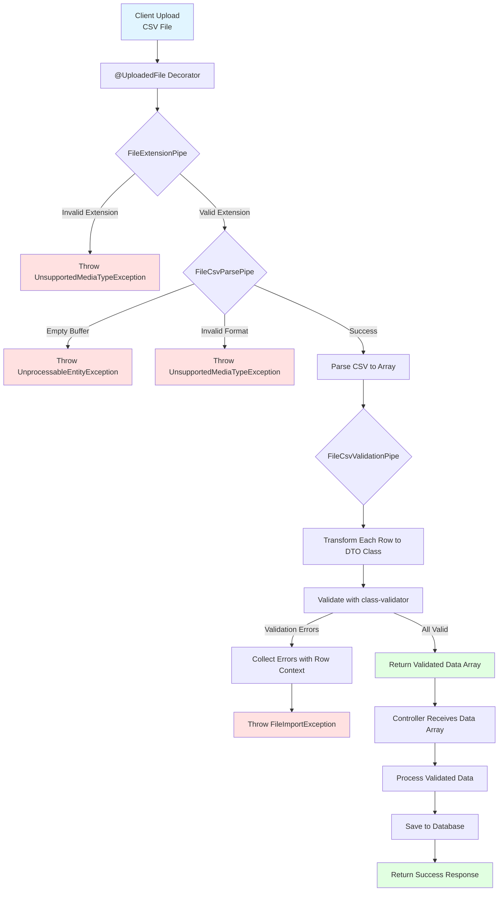

# File Upload Documentation

This documentation explains the features and usage of:
- **File Module**: Located at `src/common/file`
- **Aws S3 Module**: Located at `src/modules/aws` 

## Overview

The file upload module provides a comprehensive solution for handling file uploads in ACK NestJs Boilerplate. It includes decorators, pipes, services, and utilities for single/multiple file uploads, file validation, and CSV processing.

The module supports:

**Direct Upload**: Traditional multipart form-data upload where files are sent through the backend server. Ideal for small to medium files and when you need immediate server-side processing.


## Related Documentation

- [Request Validation Documentation][ref-doc-request-validation]
- [Handling Error Documentation][ref-doc-handling-error]
- [Message Documentation][ref-doc-message]
- [Presign Documentation][ref-doc-presign]

## Table of Contents

- [Overview](#overview)
- [Related Documentation](#related-documentation)
- [Decorators](#decorators)
  - [FileUploadSingle](#fileuploadsingle)
  - [FileUploadMultiple](#fileuploadmultiple)
  - [FileUploadMultipleFields](#fileuploadmultiplefields)
- [Enums](#enums)
- [Pipes](#pipes)
  - [FileExtensionPipe](#fileextensionpipe)
  - [FileCsvParsePipe](#filecsvparsepipe)
  - [FileCsvValidationPipe](#filecsvvalidationpipe)
- [CSV Import Flow](#csv-import-flow)
- [Usage](#usage)
  - [Basic File Upload](#basic-file-upload)
  - [CSV Import](#csv-import)
  - [Multiple Field Upload](#multiple-field-upload)
- [Error Handling](#error-handling)
- [Message Translation](#message-translation)

## Decorators

### FileUploadSingle

Handles single file upload with configurable field name and size limits.

**Parameters:**
- `options.field` (optional): Field name in form-data (default: `'file'`)
- `options.fileSize` (optional): Maximum file size in bytes (default: `FileSizeInBytes`)

**Example:**
```typescript
@FileUploadSingle({ field: 'photo', fileSize: bytes('5mb') })
```

### FileUploadMultiple

Handles multiple files upload with the same field name.

**Parameters:**
- `options.field` (optional): Field name in form-data (default: `'files'`)
- `options.maxFiles` (optional): Maximum number of files (default: `2`)
- `options.fileSize` (optional): Maximum file size per file in bytes (default: `FileSizeInBytes`)

**Example:**
```typescript
@FileUploadMultiple({ field: 'documents', maxFiles: 5 })
```

### FileUploadMultipleFields

Handles multiple files from different form fields.

**Parameters:**
- `fields`: Array of field configurations
  - `field`: Field name
  - `maxFiles`: Maximum files for this field
- `options.fileSize` (optional): Maximum file size per file in bytes (default: `FileSizeInBytes`)

**Example:**
```typescript
@FileUploadMultipleFields(
  [
    { field: 'avatar', maxFiles: 1 },
    { field: 'documents', maxFiles: 3 }
  ],
  { fileSize: bytes('15mb') }
)
```

## Enums

File extension enums for validation. These enums are used with `FileExtensionPipe` to restrict allowed file types for uploads.

### Available Enums

- `EnumFileExtensionImage`: Image files
  - `jpg`, `jpeg`, `png`

- `EnumFileExtensionDocument`: Document files
  - `pdf`, `csv`

- `EnumFileExtensionAudio`: Audio files
  - `mpeg`, `m4a`, `mp3`

- `EnumFileExtensionVideo`: Video files
  - `mp4`

- `EnumFileExtensionTemplate`: Template files
  - `hbs`

- `EnumFileExtension`: Combined type of all file extensions

**When to Use:**
- Combine multiple enums for flexible validation: `[EnumFileExtensionImage.jpg, EnumFileExtensionDocument.pdf]`
- Use specific enum for strict type control: only `EnumFileExtensionImage` values
- CSV enum is typically used with `FileCsvParsePipe` for data import features

## Pipes

### FileExtensionPipe

Validates uploaded file extensions against allowed types. This pipe checks the file extension and throws an error if the file type is not in the allowed list.

**Usage:**
Pass an array of allowed file extensions from the enum constants. Works with both single file and multiple files uploads.

**Throws:**
- `UnsupportedMediaTypeException`: When file extension is not in the allowed list

### FileCsvParsePipe

Parses CSV (.csv) files into structured data array with rows and columns. This pipe converts raw file buffer into usable JavaScript objects using semicolon (;) as delimiter.

**Returns:**
Array of parsed row objects `T[]`

**Supports:**
- CSV files (.csv) with semicolon delimiter
- Headers in first row become object property names
- Empty lines are automatically skipped

**Throws:**
- `UnprocessableEntityException`: Empty buffer or missing file
- `UnsupportedMediaTypeException`: Invalid file extension

### FileCsvValidationPipe

Transforms and validates CSV data using DTO classes with class-validator decorators. This pipe applies validation rules to each row of imported data and provides detailed error messages.

**How it Works:**
1. Receives parsed data from `FileCsvParsePipe`
2. Transforms each row into the specified DTO class
3. Validates using class-validator decorators
4. Collects all validation errors with row context
5. Throws `FileImportException` if validation fails

**Parameters:**
- DTO class for row validation

**Throws:**
- `FileImportException`: Contains detailed validation errors with row context

## CSV Import Flow

Understanding the flow of CSV file processing helps you implement robust data import features. The diagram below illustrates how uploaded CSV files are processed through validation and transformation pipelines.



## Usage

### Basic File Upload

Single and multiple file uploads with extension validation.

**Single File Upload:**

```typescript
@Controller('users')
export class UserController {
  @Post('/profile/upload/photo')
  @FileUploadSingle()
  @HttpCode(HttpStatus.OK)
  async uploadPhotoProfile(
    @UploadedFile(
      FileExtensionPipe([
        EnumFileExtensionImage.jpeg,
        EnumFileExtensionImage.png,
        EnumFileExtensionImage.jpg
      ])
    )
    file: IFile
  ) {
    const filename = this.fileService.createRandomFilename({
      path: 'profiles',
      prefix: 'photo',
      extension: this.fileService.extractExtensionFromFilename(file.originalname)
    });
    
    await this.storageService.upload(file.buffer, filename);
    
    return { filename };
  }
}
```

**Multiple Files Upload:**

```typescript
@Post('/documents/upload')
@FileUploadMultiple({ maxFiles: 5 })
async uploadDocuments(
  @UploadedFiles(
    FileExtensionPipe([
      EnumFileExtensionDocument.pdf,
      EnumFileExtensionDocument.csv
    ])
  )
  files: IFile[]
) {
  const uploadedFiles = [];
  
  for (const file of files) {
    const filename = this.fileService.createRandomFilename({
      path: 'documents',
      prefix: 'doc',
      extension: this.fileService.extractExtensionFromFilename(file.originalname)
    });
    
    await this.storageService.upload(file.buffer, filename);
    uploadedFiles.push(filename);
  }
  
  return { files: uploadedFiles };
}
```

### CSV Import

Import and validate data from CSV files.

**Basic Parsing:**

```typescript
interface UserImportDto {
  name: string;
  email: string;
  age: number;
}

@Post('/users/import/parse')
@FileUploadSingle()
async parseUsers(
  @UploadedFile(
    FileCsvParsePipe<UserImportDto>
  )
  data: UserImportDto[]
) {
  // data contains parsed rows as plain objects
  return {
    totalRows: data.length,
    preview: data.slice(0, 5) // First 5 rows
  };
}
```

**With Validation:**

```typescript
class UserImportDto {
  @IsString()
  @IsNotEmpty()
  name: string;

  @IsEmail()
  email: string;

  @IsInt()
  @Min(18)
  @Max(100)
  age: number;
}

@Post('/users/import')
@FileUploadSingle()
async importUsers(
  @UploadedFile(
    FileCsvParsePipe,
    new FileCsvValidationPipe(UserImportDto)
  )
  data: UserImportDto[]
) {
  // Data is already validated, safe to use
  await this.userRepository.createMany(data);
  
  return {
    imported: data.length
  };
}
```

### Multiple Field Upload

Upload files from different form fields simultaneously.

```typescript
@Post('/profile/complete')
@FileUploadMultipleFields([
  { field: 'avatar', maxFiles: 1 },
  { field: 'documents', maxFiles: 3 },
  { field: 'certificates', maxFiles: 2 }
])
async uploadCompleteProfile(
  @UploadedFiles() files: {
    avatar?: IFile[],
    documents?: IFile[],
    certificates?: IFile[]
  }
) {
  const result = {};
  
  if (files.avatar) {
    const avatar = files.avatar[0];
    const filename = this.fileService.createRandomFilename({
      path: 'avatars',
      prefix: 'avatar',
      extension: this.fileService.extractExtensionFromFilename(avatar.originalname)
    });
    await this.storageService.upload(avatar.buffer, filename);
    result.avatar = filename;
  }
  
  if (files.documents) {
    result.documents = [];
    for (const doc of files.documents) {
      const filename = this.fileService.createRandomFilename({
        path: 'documents',
        prefix: 'doc',
        extension: this.fileService.extractExtensionFromFilename(doc.originalname)
      });
      await this.storageService.upload(doc.buffer, filename);
      result.documents.push(filename);
    }
  }
  
  return result;
}
```

## Error Handling

### FileImportException

Thrown during CSV validation with detailed error context. This exception provides comprehensive information about validation failures including the exact row and validation errors.

**Exception Structure:**

```typescript
{
  statusCode: number;
  message: string;
  errors: Array<{
    row: number;           // Row index (0-based)
    errors: ValidationError[];  // class-validator errors
  }>;
}
```

### Common Errors

| Error Type | Status Code | Message | Description |
|------------|-------------|---------|-------------|
| Invalid Extension | 5011 | `file.error.extensionInvalid` | File extension not in allowed list |
| Empty File | 422 | `Unprocessable Entity` | File buffer is empty or missing |
| Invalid Format | 415 | `Unsupported Media Type` | File format not supported (CSV) |
| Validation Failed | 5030 | `file.error.validationDto` | DTO validation failed with details |

**Error Response Examples:**

```json
// Invalid Extension
{
  "statusCode": 5011,
  "message": "file.error.extensionInvalid"
}

// Validation Errors
{
  "statusCode": 5030,
  "message": "file.error.validationDto",
  "errors": [
    {
      "row": 0,
      "errors": [
        {
          "property": "email",
          "constraints": {
            "isEmail": "email must be an email"
          }
        },
        {
          "property": "age",
          "constraints": {
            "min": "age must not be less than 18"
          }
        }
      ]
    }
  ]
}
```

## Message Translation

File validation errors are automatically translated using the i18n system. The `FileCsvValidationPipe` integrates with `MessageService` to provide localized error messages based on the user's language preference.

**How It Works:**

1. Validation errors are captured from class-validator
2. Errors are passed to `MessageService.setValidationImportMessage()`
3. Each constraint is translated using i18n keys: `request.error.{constraint}`
4. Localized messages are returned in the error response

**Custom Error Messages:**

Add custom validation messages in your i18n language files for any class-validator constraint:

```json
{
  "error": {
    "min": "{property} must not be less than {value}",
    "max": "{property} must not be greater than {value}",
    "isEmail": "{property} must be a valid email address"
  }
}
```

See [Message Documentation][ref-doc-message] for complete language configuration details.


<!-- REFERENCES -->

<!-- BADGE LINKS -->

[ack-contributors-shield]: https://img.shields.io/github/contributors/andrechristikan/ack-nestjs-boilerplate?style=for-the-badge
[ack-forks-shield]: https://img.shields.io/github/forks/andrechristikan/ack-nestjs-boilerplate?style=for-the-badge
[ack-stars-shield]: https://img.shields.io/github/stars/andrechristikan/ack-nestjs-boilerplate?style=for-the-badge
[ack-issues-shield]: https://img.shields.io/github/issues/andrechristikan/ack-nestjs-boilerplate?style=for-the-badge
[ack-license-shield]: https://img.shields.io/github/license/andrechristikan/ack-nestjs-boilerplate?style=for-the-badge
[nestjs-shield]: https://img.shields.io/badge/nestjs-%23E0234E.svg?style=for-the-badge&logo=nestjs&logoColor=white
[nodejs-shield]: https://img.shields.io/badge/Node.js-339933?style=for-the-badge&logo=nodedotjs&logoColor=white
[typescript-shield]: https://img.shields.io/badge/TypeScript-007ACC?style=for-the-badge&logo=typescript&logoColor=white
[mongodb-shield]: https://img.shields.io/badge/MongoDB-white?style=for-the-badge&logo=mongodb&logoColor=4EA94B
[jwt-shield]: https://img.shields.io/badge/JWT-000000?style=for-the-badge&logo=JSON%20web%20tokens&logoColor=white
[jest-shield]: https://img.shields.io/badge/-jest-%23C21325?style=for-the-badge&logo=jest&logoColor=white
[pnpm-shield]: https://img.shields.io/badge/pnpm-%232C8EBB.svg?style=for-the-badge&logo=pnpm&logoColor=white&color=F9AD00
[docker-shield]: https://img.shields.io/badge/docker-%230db7ed.svg?style=for-the-badge&logo=docker&logoColor=white
[github-shield]: https://img.shields.io/badge/GitHub-100000?style=for-the-badge&logo=github&logoColor=white
[linkedin-shield]: https://img.shields.io/badge/LinkedIn-0077B5?style=for-the-badge&logo=linkedin&logoColor=white

<!-- CONTACTS -->

[ref-author-linkedin]: https://linkedin.com/in/andrechristikan
[ref-author-email]: mailto:andrechristikan@gmail.com
[ref-author-github]: https://github.com/andrechristikan
[ref-author-paypal]: https://www.paypal.me/andrechristikan
[ref-author-kofi]: https://ko-fi.com/andrechristikan

<!-- Repo LINKS -->

[ref-ack]: https://github.com/andrechristikan/ack-nestjs-boilerplate
[ref-ack-issues]: https://github.com/andrechristikan/ack-nestjs-boilerplate/issues
[ref-ack-stars]: https://github.com/andrechristikan/ack-nestjs-boilerplate/stargazers
[ref-ack-forks]: https://github.com/andrechristikan/ack-nestjs-boilerplate/network/members
[ref-ack-contributors]: https://github.com/andrechristikan/ack-nestjs-boilerplate/graphs/contributors
[ref-ack-license]: LICENSE.md

<!-- THIRD PARTY -->

[ref-nestjs]: http://nestjs.com
[ref-nestjs-swagger]: https://docs.nestjs.com/openapi/introduction
[ref-nestjs-swagger-types]: https://docs.nestjs.com/openapi/types-and-parameters
[ref-prisma]: https://www.prisma.io
[ref-prisma-mongodb]: https://www.prisma.io/docs/orm/overview/databases/mongodb#commonalities-with-other-database-provider
[ref-prisma-setup]: https://www.prisma.io/docs/getting-started/setup-prisma/add-to-existing-project#switching-databases
[ref-mongodb]: https://docs.mongodb.com/
[ref-redis]: https://redis.io
[ref-bullmq]: https://bullmq.io
[ref-nodejs]: https://nodejs.org/
[ref-typescript]: https://www.typescriptlang.org/
[ref-docker]: https://docs.docker.com
[ref-dockercompose]: https://docs.docker.com/compose/
[ref-pnpm]: https://pnpm.io
[ref-12factor]: https://12factor.net
[ref-commander]: https://nest-commander.jaymcdoniel.dev
[ref-package-json]: package.json
[ref-jwt]: https://jwt.io
[ref-jest]: https://jestjs.io/docs/getting-started
[ref-git]: https://git-scm.com
[ref-google-console]: https://console.cloud.google.com/
[ref-google-client-secret]: https://developers.google.com/identity/protocols/oauth2

[ref-doc-root]: ../readme.md
[ref-doc-activity-log]: activity-log.md
[ref-doc-authentication]: authentication.md
[ref-doc-authorization]: authorization.md
[ref-doc-cache]: cache.md
[ref-doc-configuration]: configuration.md
[ref-doc-database]: database.md
[ref-doc-environment]: environment.md
[ref-doc-feature-flag]: feature-flag.md
[ref-doc-file-upload]: file-upload.md
[ref-doc-handling-error]: handling-error.md
[ref-doc-installation]: installation.md
[ref-doc-logger]: logger.md
[ref-doc-message]: message.md
[ref-doc-pagination]: pagination.md
[ref-doc-project-structure]: project-structure.md
[ref-doc-queue]: queue.md
[ref-doc-request-validation]: request-validation.md
[ref-doc-response]: response.md
[ref-doc-security-and-middleware]: security-and-middleware.md
[ref-doc-doc]: doc.md
[ref-doc-third-party-integration]: third-party-integration.md
[ref-doc-presign]: presign.md
[ref-doc-term-policy]: term-policy.md
[ref-doc-two-factor]: two-factor.md

<!-- CONTRIBUTOR -->

[ref-contributor-gzerox]: https://github.com/Gzerox
[ref-contributor-ak2g]: https://github.com/ak2g
