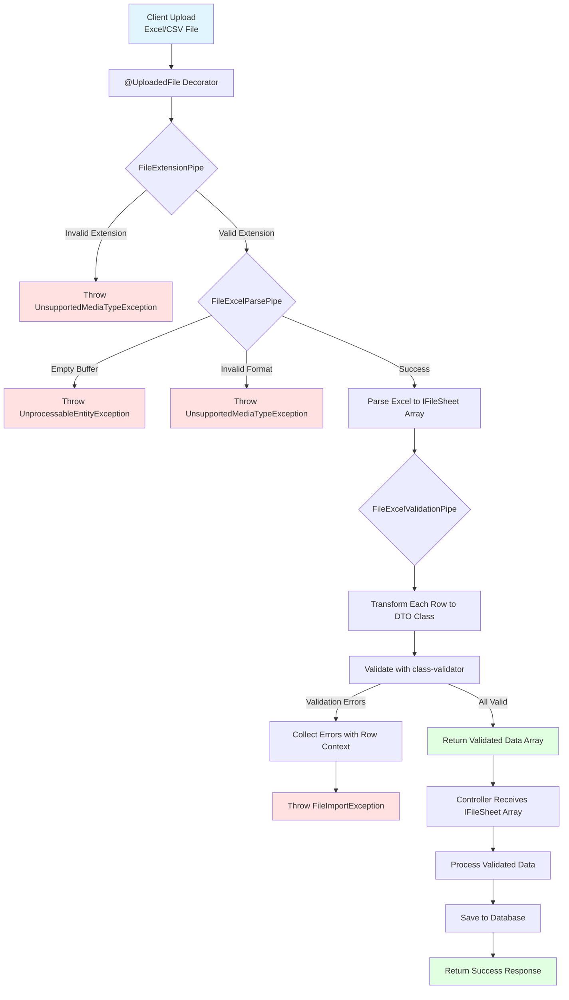
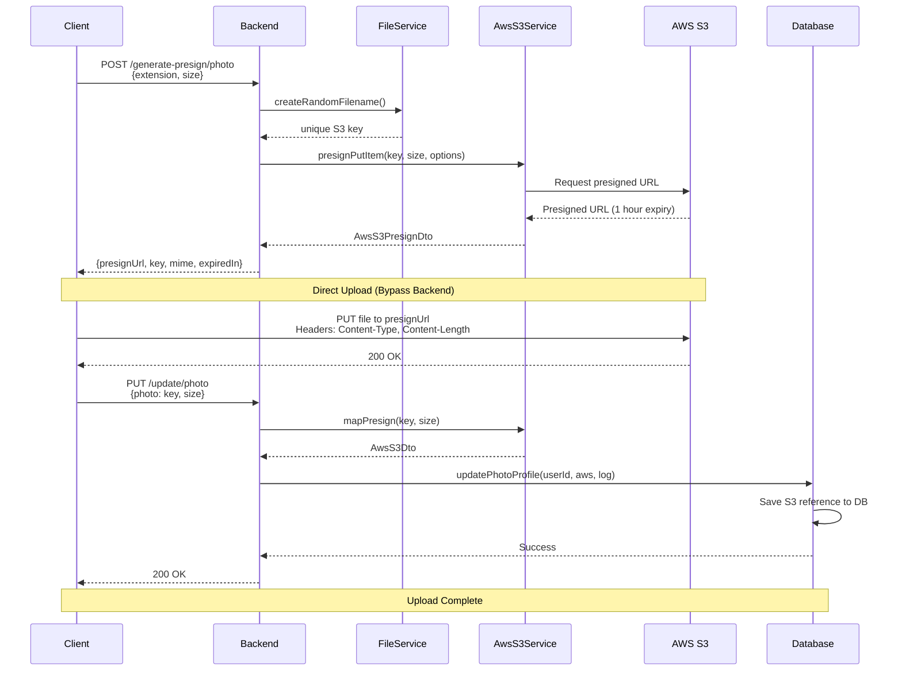

# File Upload Documentation

This documentation explains the features and usage of:
- **File Module**: Located at `src/common/file`
- **Aws S3 Module**: Located at `src/modules/aws` 

## Overview

The file upload module provides a comprehensive solution for handling file uploads in ACK NestJs Boilerplate. It includes decorators, pipes, services, and utilities for single/multiple file uploads, file validation, and Excel/CSV processing.

The module supports two primary upload methods:

1. **Direct Upload**: Traditional multipart form-data upload where files are sent through the backend server. Ideal for small to medium files and when you need immediate server-side processing.

2. **AWS S3 Presigned URL Upload**: Modern approach for client-side direct uploads to S3 without exposing AWS credentials. This method is recommended for large files as it reduces server load, improves upload performance, and provides better scalability by bypassing the backend server during the actual file transfer.

## Related Documentation

- [Request Validation Documentation][ref-doc-request-validation]
- [Handling Error Documentation][ref-doc-handling-error]
- [Message Documentation][ref-doc-message]

## Table of Contents

- [Overview](#overview)
- [Related Documentation](#related-documentation)
- [Decorators](#decorators)
  - [FileUploadSingle](#fileuploadsingle)
  - [FileUploadMultiple](#fileuploadmultiple)
  - [FileUploadMultipleFields](#fileuploadmultiplefields)
- [Enums](#enums)
- [Pipes](#pipes)
  - [FileExtensionPipe](#fileextensionpipe)
  - [FileExcelParsePipe](#fileexcelparsepipe)
  - [FileExcelValidationPipe](#fileexcelvalidationpipe)
- [Excel Import Flow](#excel-import-flow)
- [Usage](#usage)
  - [Basic File Upload](#basic-file-upload)
  - [Excel Import](#excel-import)
  - [Multiple Field Upload](#multiple-field-upload)
- [AWS S3 Presigned URL Upload](#aws-s3-presigned-url-upload)
  - [AWS S3 Presigned URL Flow](#aws-s3-presigned-url-flow)
- [Error Handling](#error-handling)
- [Message Translation](#message-translation)

## Decorators

### FileUploadSingle

Handles single file upload with configurable field name and size limits.

**Parameters:**
- `options.field` (optional): Field name in form-data (default: `'file'`)
- `options.fileSize` (optional): Maximum file size in bytes (default: `FILE_SIZE_IN_BYTES`)

**Example:**
```typescript
@FileUploadSingle({ field: 'photo', fileSize: bytes('5mb') })
```

### FileUploadMultiple

Handles multiple files upload with the same field name.

**Parameters:**
- `options.field` (optional): Field name in form-data (default: `'files'`)
- `options.maxFiles` (optional): Maximum number of files (default: `2`)
- `options.fileSize` (optional): Maximum file size per file in bytes (default: `FILE_SIZE_IN_BYTES`)

**Example:**
```typescript
@FileUploadMultiple({ field: 'documents', maxFiles: 5 })
```

### FileUploadMultipleFields

Handles multiple files from different form fields.

**Parameters:**
- `fields`: Array of field configurations
  - `field`: Field name
  - `maxFiles`: Maximum files for this field
- `options.fileSize` (optional): Maximum file size per file in bytes (default: `FILE_SIZE_IN_BYTES`)

**Example:**
```typescript
@FileUploadMultipleFields(
  [
    { field: 'avatar', maxFiles: 1 },
    { field: 'documents', maxFiles: 3 }
  ],
  { fileSize: bytes('15mb') }
)
```

## Enums

File extension enums for validation. These enums are used with `FileExtensionPipe` to restrict allowed file types for uploads.

### Available Enums

- `ENUM_FILE_EXTENSION_IMAGE`: Image files
  - `JPG`, `JPEG`, `PNG`

- `ENUM_FILE_EXTENSION_DOCUMENT`: Document files
  - `PDF`

- `ENUM_FILE_EXTENSION_EXCEL`: Spreadsheet files
  - `XLSX`, `CSV`

- `ENUM_FILE_EXTENSION_AUDIO`: Audio files
  - `MPEG`, `M4A`, `MP3`

- `ENUM_FILE_EXTENSION_VIDEO`: Video files
  - `MP4`

**When to Use:**
- Combine multiple enums for flexible validation: `[...IMAGE, ...DOCUMENT]`
- Use specific enum for strict type control: only `ENUM_FILE_EXTENSION_IMAGE`
- Excel enums are typically used with `FileExcelParsePipe` for data import features

## Pipes

### FileExtensionPipe

Validates uploaded file extensions against allowed types. This pipe checks the file extension and throws an error if the file type is not in the allowed list.

**Usage:**
Pass an array of allowed file extensions from the enum constants. Works with both single file and multiple files uploads.

**Throws:**
- `UnsupportedMediaTypeException`: When file extension is not in the allowed list

### FileExcelParsePipe

Parses Excel (.xlsx) and CSV (.csv) files into structured sheet data with rows and columns. This pipe converts raw file buffer into usable JavaScript objects.

**Returns:**
Array of `IFileSheet<T>` containing:
- `sheetName`: Name of the sheet
- `data`: Array of parsed row objects

**Supports:**
- Excel files (.xlsx) - multiple sheets
- CSV files (.csv) - single sheet

**Throws:**
- `UnprocessableEntityException`: Empty buffer or missing file
- `UnsupportedMediaTypeException`: Invalid file extension

### FileExcelValidationPipe

Transforms and validates Excel data using DTO classes with class-validator decorators. This pipe applies validation rules to each row of imported data and provides detailed error messages.

**How it Works:**
1. Receives parsed sheet data from `FileExcelParsePipe`
2. Transforms each row into the specified DTO class
3. Validates using class-validator decorators
4. Collects all validation errors with row and sheet context
5. Throws `FileImportException` if validation fails

**Parameters:**
- Array of DTO classes (one per sheet)
- First DTO validates first sheet, second DTO validates second sheet, etc.

**Throws:**
- `FileImportException`: Contains detailed validation errors with sheet name and row context

## Excel Import Flow

Understanding the flow of Excel file processing helps you implement robust data import features. The diagram below illustrates how uploaded Excel files are processed through validation and transformation pipelines.



## Usage

### Basic File Upload

Single and multiple file uploads with extension validation.

**Single File Upload:**

```typescript
@Controller('users')
export class UserController {
  @Post('/profile/upload/photo')
  @FileUploadSingle()
  @HttpCode(HttpStatus.OK)
  async uploadPhotoProfile(
    @UploadedFile(
      FileExtensionPipe([
        ENUM_FILE_EXTENSION_IMAGE.JPEG,
        ENUM_FILE_EXTENSION_IMAGE.PNG,
        ENUM_FILE_EXTENSION_IMAGE.JPG
      ])
    )
    file: IFile
  ) {
    const filename = this.fileService.createRandomFilename({
      path: 'profiles',
      prefix: 'photo',
      extension: this.fileService.extractExtensionFromFilename(file.originalname)
    });
    
    await this.storageService.upload(file.buffer, filename);
    
    return { filename };
  }
}
```

**Multiple Files Upload:**

```typescript
@Post('/documents/upload')
@FileUploadMultiple({ maxFiles: 5 })
async uploadDocuments(
  @UploadedFiles(
    FileExtensionPipe([
      ENUM_FILE_EXTENSION_DOCUMENT.PDF,
      ENUM_FILE_EXTENSION_EXCEL.XLSX
    ])
  )
  files: IFile[]
) {
  const uploadedFiles = [];
  
  for (const file of files) {
    const filename = this.fileService.createRandomFilename({
      path: 'documents',
      prefix: 'doc',
      extension: this.fileService.extractExtensionFromFilename(file.originalname)
    });
    
    await this.storageService.upload(file.buffer, filename);
    uploadedFiles.push(filename);
  }
  
  return { files: uploadedFiles };
}
```

### Excel Import

Import and validate data from Excel or CSV files.

**Basic Parsing:**

```typescript
interface UserImportDto {
  name: string;
  email: string;
  age: number;
}

@Post('/users/import/parse')
@FileUploadSingle()
async parseUsers(
  @UploadedFile(
    FileExtensionPipe([
      ENUM_FILE_EXTENSION_EXCEL.XLSX,
      ENUM_FILE_EXTENSION_EXCEL.CSV
    ]),
    FileExcelParsePipe<UserImportDto>
  )
  sheets: IFileSheet<UserImportDto>[]
) {
  // sheets[0].data contains parsed rows as plain objects
  // sheets[0].sheetName contains sheet name
  return {
    totalRows: sheets[0].data.length,
    sheetName: sheets[0].sheetName,
    preview: sheets[0].data.slice(0, 5) // First 5 rows
  };
}
```

**With Validation:**

```typescript
class UserImportDto {
  @IsString()
  @IsNotEmpty()
  name: string;

  @IsEmail()
  email: string;

  @IsInt()
  @Min(18)
  @Max(100)
  age: number;
}

@Post('/users/import')
@FileUploadSingle()
async importUsers(
  @UploadedFile(
    FileExtensionPipe([
      ENUM_FILE_EXTENSION_EXCEL.XLSX,
      ENUM_FILE_EXTENSION_EXCEL.CSV
    ]),
    FileExcelParsePipe,
    new FileExcelValidationPipe([UserImportDto])
  )
  sheets: IFileSheet<UserImportDto>[]
) {
  const users = sheets[0].data;
  
  // Data is already validated, safe to use
  await this.userRepository.createMany(users);
  
  return {
    imported: users.length,
    sheetName: sheets[0].sheetName
  };
}
```

**Multiple Sheets with Different DTOs:**

```typescript
class UserImportDto {
  @IsString()
  @IsNotEmpty()
  name: string;

  @IsEmail()
  email: string;
}

class ProductImportDto {
  @IsString()
  @IsNotEmpty()
  name: string;

  @IsNumber()
  @Min(0)
  price: number;
}

@Post('/import-complex')
@FileUploadSingle()
async importComplex(
  @UploadedFile(
    FileExtensionPipe([ENUM_FILE_EXTENSION_EXCEL.XLSX]),
    FileExcelParsePipe,
    new FileExcelValidationPipe([UserImportDto, ProductImportDto])
  )
  sheets: IFileSheet<UserImportDto | ProductImportDto>[]
) {
  // sheets[0] validated with UserImportDto
  // sheets[1] validated with ProductImportDto
  
  const users = sheets[0].data as UserImportDto[];
  const products = sheets[1].data as ProductImportDto[];
  
  await Promise.all([
    this.userRepository.createMany(users),
    this.productRepository.createMany(products)
  ]);
  
  return {
    usersImported: users.length,
    productsImported: products.length
  };
}
```

### Multiple Field Upload

Upload files from different form fields simultaneously.

```typescript
@Post('/profile/complete')
@FileUploadMultipleFields([
  { field: 'avatar', maxFiles: 1 },
  { field: 'documents', maxFiles: 3 },
  { field: 'certificates', maxFiles: 2 }
])
async uploadCompleteProfile(
  @UploadedFiles() files: {
    avatar?: IFile[],
    documents?: IFile[],
    certificates?: IFile[]
  }
) {
  const result = {};
  
  if (files.avatar) {
    const avatar = files.avatar[0];
    const filename = this.fileService.createRandomFilename({
      path: 'avatars',
      prefix: 'avatar',
      extension: this.fileService.extractExtensionFromFilename(avatar.originalname)
    });
    await this.storageService.upload(avatar.buffer, filename);
    result.avatar = filename;
  }
  
  if (files.documents) {
    result.documents = [];
    for (const doc of files.documents) {
      const filename = this.fileService.createRandomFilename({
        path: 'documents',
        prefix: 'doc',
        extension: this.fileService.extractExtensionFromFilename(doc.originalname)
      });
      await this.storageService.upload(doc.buffer, filename);
      result.documents.push(filename);
    }
  }
  
  return result;
}
```

## AWS S3 Presigned URL Upload

AWS S3 presigned URLs enable secure client-side direct uploads to S3 without exposing AWS credentials. This approach is ideal for large files, reduces server bandwidth, and improves upload performance.

**How It Works:**

1. Client requests a presigned URL from the backend with file metadata
2. Backend generates a time-limited presigned URL and returns it to the client
3. Client uploads the file directly to S3 using the presigned URL via HTTP PUT
4. Client notifies the backend of the successful upload with the S3 key

**Implementation:**

**Step 1 - Request DTO:**

```typescript
export class UserGeneratePhotoProfileRequestDto {
  @ApiProperty({
    type: 'string',
    enum: ENUM_FILE_EXTENSION_IMAGE,
    default: ENUM_FILE_EXTENSION_IMAGE.JPG,
  })
  @IsString()
  @IsEnum(ENUM_FILE_EXTENSION_IMAGE)
  @IsNotEmpty()
  extension: ENUM_FILE_EXTENSION_IMAGE;

  @ApiProperty({
    required: true,
    description: 'File size in bytes',
  })
  @IsNumber({
    allowInfinity: false,
    allowNaN: false,
    maxDecimalPlaces: 0,
  })
  @IsInt()
  @IsNotEmpty()
  size: number;
}

export class UserUpdateProfilePhotoRequestDto {
  @ApiProperty({
    required: true,
    description: 'Photo path key from S3',
    example: 'user/profile/unique-photo-key.jpg',
  })
  @IsString()
  @IsNotEmpty()
  photo: string;

  @ApiProperty({
    required: true,
    description: 'File size in bytes',
  })
  @IsNumber({
    allowInfinity: false,
    allowNaN: false,
    maxDecimalPlaces: 0,
  })
  @IsInt()
  @IsNotEmpty()
  size: number;
}
```

**Step 2 - Controller Endpoints:**

```typescript
@Controller('users')
export class UserController {
  constructor(private readonly userService: UserService) {}

  @Response('user.generatePhotoProfilePresign')
  @UserProtected()
  @AuthJwtAccessProtected()
  @Post('/profile/generate-presign/photo')
  @HttpCode(HttpStatus.OK)
  async generatePhotoProfilePresign(
    @AuthJwtPayload('userId') userId: string,
    @Body() body: UserGeneratePhotoProfileRequestDto
  ): Promise<IResponseReturn<AwsS3PresignDto>> {
    return this.userService.generatePhotoProfilePresign(userId, body);
  }

  @Response('user.updatePhotoProfile')
  @UserProtected()
  @AuthJwtAccessProtected()
  @Put('/profile/update/photo')
  async updatePhotoProfile(
    @AuthJwtPayload('userId') userId: string,
    @Body() body: UserUpdateProfilePhotoRequestDto,
    @RequestIPAddress() ipAddress: string,
    @RequestUserAgent() userAgent: RequestUserAgentDto
  ): Promise<IResponseReturn<void>> {
    return this.userService.updatePhotoProfile(userId, body, {
      ipAddress,
      userAgent,
    });
  }
}
```

**Step 3 - Service Implementation:**

```typescript
@Injectable()
export class UserService {
  constructor(
    private readonly awsS3Service: AwsS3Service,
    private readonly userRepository: UserRepository,
    private readonly fileService: FileService
  ) {}

  async generatePhotoProfilePresign(
    userId: string,
    { extension, size }: UserGeneratePhotoProfileRequestDto
  ): Promise<IResponseReturn<AwsS3PresignDto>> {
    const key: string = this.fileService.createRandomFilename({
      path: `user/${userId}/profile`,
      prefix: 'photo',
      extension,
    });

    const presign: AwsS3PresignDto = await this.awsS3Service.presignPutItem(
      { key, size },
      { 
        forceUpdate: true,
        access: ENUM_AWS_S3_ACCESSIBILITY.PUBLIC,
        expired: 3600 // 1 hour
      }
    );

    return { data: presign };
  }

  async updatePhotoProfile(
    userId: string,
    { photo, size }: UserUpdateProfilePhotoRequestDto,
    requestLog: IRequestLog
  ): Promise<IResponseReturn<void>> {
    const aws: AwsS3Dto = this.awsS3Service.mapPresign({ key: photo, size });
    await this.userRepository.updatePhotoProfile(userId, aws, requestLog);
    return;
  }
}
```

**Step 4 - Client-Side Upload:**

```typescript
async function uploadPhotoWithPresign(file: File) {
  try {
    // Request presigned URL
    const response = await fetch('/api/users/profile/generate-presign/photo', {
      method: 'POST',
      headers: {
        'Content-Type': 'application/json',
        'Authorization': `Bearer ${accessToken}`
      },
      body: JSON.stringify({
        extension: file.name.split('.').pop(),
        size: file.size
      })
    });

    const { data: presignData } = await response.json();

    // Upload directly to S3
    await fetch(presignData.presignUrl, {
      method: 'PUT',
      headers: {
        'Content-Type': presignData.mime,
        'Content-Length': file.size.toString(),
        'x-amz-checksum-algorithm': 'SHA256'
      },
      body: file
    });

    // Notify backend
    await fetch('/api/users/profile/update/photo', {
      method: 'PUT',
      headers: {
        'Content-Type': 'application/json',
        'Authorization': `Bearer ${accessToken}`
      },
      body: JSON.stringify({
        photo: presignData.key,
        size: file.size
      })
    });

    console.log('Photo uploaded successfully!');
  } catch (error) {
    console.error('Upload failed:', error);
  }
}
```

**Configuration Options:**

```typescript
interface IAwsS3PresignOptions {
  access?: ENUM_AWS_S3_ACCESSIBILITY; // PUBLIC or PRIVATE
  expired?: number; // Expiration time in seconds (default from config)
  forceUpdate?: boolean; // Allow overwriting existing files
}
```

**Response Structure:**

```typescript
interface AwsS3PresignDto {
  presignUrl: string;    // The presigned URL for upload
  key: string;           // S3 object key
  extension: string;     // File extension
  mime: string;          // MIME type
  expiredIn: number;     // URL expiration time in seconds
}
```

### AWS S3 Presigned URL Flow

Understanding the AWS S3 presigned URL upload flow helps you implement secure and efficient file uploads. The diagram below illustrates the complete process from client request to database update.



**Flow Explanation:**

1. **Generate Presigned URL Stage**:
   - Client requests presigned URL with file metadata (extension, size)
   - Backend generates unique S3 key using `FileService`
   - `AwsS3Service` creates time-limited presigned URL (default 1 hour)
   - Backend returns presigned URL data to client

2. **Direct Upload Stage**:
   - Client uploads file **directly to S3** using presigned URL
   - No backend involvement during actual file transfer
   - S3 validates request using presigned URL signature
   - Reduces server bandwidth and improves performance

3. **Database Update Stage**:
   - Client notifies backend with S3 key and file size
   - Backend maps presign data to `AwsS3Dto`
   - Repository updates user profile with S3 file reference
   - Transaction logged with IP address and user agent

**Important Notes:**

- Presigned URLs expire after configured time (default: 1 hour)
- Client must use exact Content-Type and Content-Length headers
- Failed uploads don't update database (client handles retry)
- S3 key is generated before upload to ensure uniqueness

## Error Handling

### FileImportException

Thrown during Excel validation with detailed error context. This exception provides comprehensive information about validation failures including the exact row, sheet name, and validation errors.

**Exception Structure:**

```typescript
{
  statusCode: number;
  message: string;
  errors: Array<{
    row: number;           // Sheet index (0-based)
    sheetName: string;     // Name of the sheet
    errors: ValidationError[];  // class-validator errors
  }>;
}
```

### Common Errors

| Error Type | Status Code | Message | Description |
|------------|-------------|---------|-------------|
| Invalid Extension | 5011 | `file.error.extensionInvalid` | File extension not in allowed list |
| Empty File | 422 | `Unprocessable Entity` | File buffer is empty or missing |
| Invalid Format | 415 | `Unsupported Media Type` | File format not supported (Excel/CSV) |
| Validation Failed | 5030 | `file.error.validationDto` | DTO validation failed with details |

**Error Response Examples:**

```json
// Invalid Extension
{
  "statusCode": 5011,
  "message": "file.error.extensionInvalid"
}

// Validation Errors
{
  "statusCode": 5030,
  "message": "file.error.validationDto",
  "errors": [
    {
      "row": 0,
      "sheetName": "Users",
      "errors": [
        {
          "property": "email",
          "constraints": {
            "isEmail": "email must be an email"
          }
        },
        {
          "property": "age",
          "constraints": {
            "min": "age must not be less than 18"
          }
        }
      ]
    }
  ]
}
```

## Message Translation

File validation errors are automatically translated using the i18n system. The `FileExcelValidationPipe` integrates with `MessageService` to provide localized error messages based on the user's language preference.

**How It Works:**

1. Validation errors are captured from class-validator
2. Errors are passed to `MessageService.setValidationImportMessage()`
3. Each constraint is translated using i18n keys: `request.error.{constraint}`
4. Localized messages are returned in the error response

**Custom Error Messages:**

Add custom validation messages in your i18n language files for any class-validator constraint:

```json
{
  "error": {
    "min": "{property} must not be less than {value}",
    "max": "{property} must not be greater than {value}",
    "isEmail": "{property} must be a valid email address"
  }
}
```

See [Message Documentation][ref-doc-message] for complete language configuration details.

<!-- REFERENCES -->

<!-- BADGE LINKS -->

[ack-contributors-shield]: https://img.shields.io/github/contributors/andrechristikan/ack-nestjs-boilerplate?style=for-the-badge
[ack-forks-shield]: https://img.shields.io/github/forks/andrechristikan/ack-nestjs-boilerplate?style=for-the-badge
[ack-stars-shield]: https://img.shields.io/github/stars/andrechristikan/ack-nestjs-boilerplate?style=for-the-badge
[ack-issues-shield]: https://img.shields.io/github/issues/andrechristikan/ack-nestjs-boilerplate?style=for-the-badge
[ack-license-shield]: https://img.shields.io/github/license/andrechristikan/ack-nestjs-boilerplate?style=for-the-badge
[nestjs-shield]: https://img.shields.io/badge/nestjs-%23E0234E.svg?style=for-the-badge&logo=nestjs&logoColor=white
[nodejs-shield]: https://img.shields.io/badge/Node.js-339933?style=for-the-badge&logo=nodedotjs&logoColor=white
[typescript-shield]: https://img.shields.io/badge/TypeScript-007ACC?style=for-the-badge&logo=typescript&logoColor=white
[mongodb-shield]: https://img.shields.io/badge/MongoDB-white?style=for-the-badge&logo=mongodb&logoColor=4EA94B
[jwt-shield]: https://img.shields.io/badge/JWT-000000?style=for-the-badge&logo=JSON%20web%20tokens&logoColor=white
[jest-shield]: https://img.shields.io/badge/-jest-%23C21325?style=for-the-badge&logo=jest&logoColor=white
[yarn-shield]: https://img.shields.io/badge/yarn-%232C8EBB.svg?style=for-the-badge&logo=yarn&logoColor=white
[docker-shield]: https://img.shields.io/badge/docker-%230db7ed.svg?style=for-the-badge&logo=docker&logoColor=white
[github-shield]: https://img.shields.io/badge/GitHub-100000?style=for-the-badge&logo=github&logoColor=white
[linkedin-shield]: https://img.shields.io/badge/LinkedIn-0077B5?style=for-the-badge&logo=linkedin&logoColor=white

<!-- CONTACTS -->

[ref-author-linkedin]: https://linkedin.com/in/andrechristikan
[ref-author-email]: mailto:andrechristikan@gmail.com
[ref-author-github]: https://github.com/andrechristikan
[ref-author-paypal]: https://www.paypal.me/andrechristikan
[ref-author-kofi]: https://ko-fi.com/andrechristikan

<!-- Repo LINKS -->

[ref-ack]: https://github.com/andrechristikan/ack-nestjs-boilerplate
[ref-ack-issues]: https://github.com/andrechristikan/ack-nestjs-boilerplate/issues
[ref-ack-stars]: https://github.com/andrechristikan/ack-nestjs-boilerplate/stargazers
[ref-ack-forks]: https://github.com/andrechristikan/ack-nestjs-boilerplate/network/members
[ref-ack-contributors]: https://github.com/andrechristikan/ack-nestjs-boilerplate/graphs/contributors
[ref-ack-license]: LICENSE.md

<!-- THIRD PARTY -->

[ref-nestjs]: http://nestjs.com
[ref-prisma]: https://www.prisma.io
[ref-mongodb]: https://docs.mongodb.com/
[ref-redis]: https://redis.io
[ref-bullmq]: https://bullmq.io
[ref-nodejs]: https://nodejs.org/
[ref-typescript]: https://www.typescriptlang.org/
[ref-docker]: https://docs.docker.com
[ref-dockercompose]: https://docs.docker.com/compose/
[ref-yarn]: https://yarnpkg.com
[ref-12factor]: https://12factor.net
[ref-commander]: https://nest-commander.jaymcdoniel.dev
[ref-package-json]: package.json
[ref-jwt]: https://jwt.io
[ref-jest]: https://jestjs.io/docs/getting-started
[ref-git]: https://git-scm.com
[ref-google-console]: https://console.cloud.google.com/
[ref-google-client-secret]: https://developers.google.com/identity/protocols/oauth2

<!-- DOCUMENTS -->

[ref-doc-root]: readme.md
[ref-doc-activity-log]: docs/activity-log.md
[ref-doc-authentication]: docs/authentication.md
[ref-doc-authorization]: docs/authorization.md
[ref-doc-cache]: docs/cache.md
[ref-doc-configuration]: docs/configuration.md
[ref-doc-database]: docs/database.md
[ref-doc-environment]: docs/environment.md
[ref-doc-feature-flag]: docs/feature-flag.md
[ref-doc-file-upload]: docs/file-upload.md
[ref-doc-handling-error]: docs/handling-error.md
[ref-doc-installation]: docs/installation.md
[ref-doc-logger]: docs/logger.md
[ref-doc-message]: docs/message.md
[ref-doc-pagination]: docs/pagination.md
[ref-doc-project-structure]: docs/project-structure.md
[ref-doc-queue]: docs/queue.md
[ref-doc-request-validation]: docs/request-validation.md
[ref-doc-response]: docs/response.md
[ref-doc-security-and-middleware]: docs/security-and-middleware.md
[ref-doc-doc]: docs/doc.md
[ref-doc-third-party-integration]: docs/third-party-integration.md