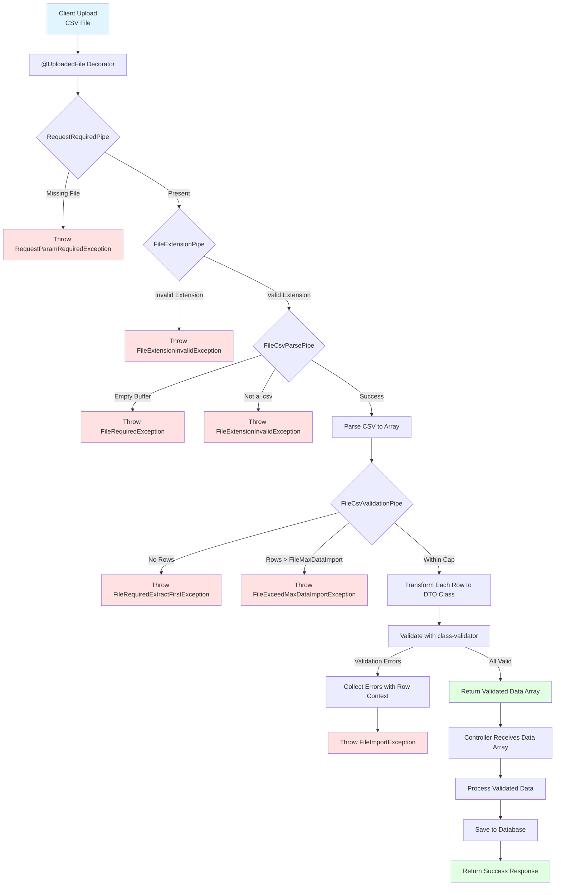

# File Upload Documentation

This documentation explains the features and usage of:
- **File Module**: Located at `src/common/file`
- **Aws S3 Module**: Located at `src/common/aws` 

## Overview

The file upload module provides a comprehensive solution for handling file uploads in ACK NestJs Boilerplate. It includes decorators, pipes, services, and utilities for single/multiple file uploads, file validation, and CSV processing.

The module supports:

**Direct Upload**: Traditional multipart form-data upload where files are sent through the backend server. Ideal for small to medium files and when you need immediate server-side processing.


## Related Documentation

- [Request Validation Documentation][ref-doc-request-validation]
- [Handling Error Documentation][ref-doc-handling-error]
- [Message Documentation][ref-doc-message]
- [Presign Documentation][ref-doc-presign]

## Table of Contents

- [Overview](#overview)
- [Related Documentation](#related-documentation)
- [Decorators](#decorators)
  - [FileUploadSingle](#fileuploadsingle)
  - [FileUploadMultiple](#fileuploadmultiple)
  - [FileUploadMultipleFields](#fileuploadmultiplefields)
- [Enums](#enums)
- [Pipes](#pipes)
  - [FileExtensionPipe](#fileextensionpipe)
  - [FileCsvParsePipe](#filecsvparsepipe)
  - [FileCsvValidationPipe](#filecsvvalidationpipe)
- [CSV Import Flow](#csv-import-flow)
- [Usage](#usage)
  - [Basic File Upload](#basic-file-upload)
  - [CSV Import](#csv-import)
  - [Multiple Field Upload](#multiple-field-upload)
- [Error Handling](#error-handling)
- [Message Translation](#message-translation)

## Decorators

The defaults come from `src/common/file/constants/file.constant.ts`:

- `FileSizeInBytes` is `bytes('10mb')`
- `FileMaxMultiple` is `3`

The `options` argument on every decorator is itself optional, but `IFileUploadSingle` and `IFileUploadMultiple` declare their fields as required. Pass the whole object or none of it.

### FileUploadSingle

Handles single file upload with configurable field name and size limits. It also caps the request at one file.

**Parameters:**
- `options.field`: Field name in form-data (default when `options` is omitted: `'file'`)
- `options.fileSize`: Maximum file size in bytes (default when `options` is omitted: `FileSizeInBytes`)

**Example:**
```typescript
@FileUploadSingle({ field: 'photo', fileSize: bytes('5mb') })
```

### FileUploadMultiple

Handles multiple files upload with the same field name.

**Parameters:**
- `options.field`: Field name in form-data (default when `options` is omitted: `'files'`)
- `options.maxFiles`: Maximum number of files (default when `options` is omitted: `FileMaxMultiple`)
- `options.fileSize`: Maximum file size per file in bytes (default when `options` is omitted: `FileSizeInBytes`)

**Example:**
```typescript
@FileUploadMultiple({ field: 'documents', maxFiles: 5, fileSize: bytes('5mb') })
```

### FileUploadMultipleFields

Handles multiple files from different form fields.

**Parameters:**
- `fields`: Array of field configurations
  - `field`: Field name
  - `maxFiles`: Maximum files for this field
- `options.fileSize` (optional): Maximum file size per file in bytes (default: `FileSizeInBytes`)

The total number of files across all fields is capped at `FileMaxMultiple` (3), regardless of what the per-field `maxFiles` values add up to.

**Example:**
```typescript
@FileUploadMultipleFields(
  [
    { field: 'avatar', maxFiles: 1 },
    { field: 'documents', maxFiles: 2 }
  ],
  { fileSize: bytes('15mb') }
)
```

## Enums

File extension enums for validation. These enums are used with `FileExtensionPipe` to restrict allowed file types for uploads.

### Available Enums

- `EnumFileExtensionImage`: Image files
  - `jpg`, `jpeg`, `png`

- `EnumFileExtensionDocument`: Document files
  - `pdf`, `csv`

- `EnumFileExtensionAudio`: Audio files
  - `mpeg`, `m4a`, `mp3`

- `EnumFileExtensionVideo`: Video files
  - `mp4`

- `EnumFileExtensionTemplate`: Template files
  - `hbs`

- `EnumFileExtension`: both a const object merging every group above and a union type of the five enums

**When to Use:**
- Combine multiple enums for flexible validation: `[EnumFileExtensionImage.jpg, EnumFileExtensionDocument.pdf]`
- Use specific enum for strict type control: only `EnumFileExtensionImage` values
- CSV enum is typically used with `FileCsvParsePipe` for data import features

## Pipes

### FileExtensionPipe

A mixin pipe built by `FileExtensionPipe(allowedExtensions)`. It reads the extension off `file.originalname` via `FileService.extractExtensionFromFilename` and throws when it is not in the allow-list. The pipe returns the file untouched; it never rewrites the value.

**Usage:**
Pass an array of allowed file extensions from the enum constants. It validates the single uploaded file.

**Passes through without validating:**
- A falsy value
- An empty object or an empty array

**Throws:**
- `FileExtensionInvalidException`: When `originalname` is missing, or the extension is not in the allowed list

### FileCsvParsePipe

Parses CSV (.csv) files into structured data array with rows and columns. This pipe converts raw file buffer into usable JavaScript objects using semicolon (;) as delimiter.

**Returns:**
Array of parsed row objects `T[]`, or `undefined` when no file was uploaded

**Supports:**
- CSV files (.csv) with semicolon delimiter
- Headers in first row become object property names
- Empty lines are automatically skipped
- Empty cells are parsed as `null`

**Throws:**
- `FileRequiredException`: Buffer is missing or zero-length
- `FileExtensionInvalidException`: Missing `originalname`, or an extension other than `csv`

### FileCsvValidationPipe

Transforms and validates CSV data using DTO classes with class-validator decorators. This pipe applies validation rules to each row of imported data and provides detailed error messages.

**How it Works:**
1. Receives parsed data from `FileCsvParsePipe`
2. Rejects an empty row set, and a row set larger than `FileMaxDataImport` (1000)
3. Transforms each row into the specified DTO class
4. Validates using class-validator with `whitelist: true` and `forbidNonWhitelisted: true`, so an unknown column fails the row
5. Collects all validation errors with row context, never failing fast on the first bad row
6. Throws `FileImportException` if any row failed

**Parameters:**
- DTO class for row validation

**Throws:**
- `FileRequiredExtractFirstException`: No rows were passed in
- `FileExceedMaxDataImportException`: Row count exceeds `FileMaxDataImport` (1000)
- `FileImportException`: Contains detailed validation errors with row context

## CSV Import Flow

Understanding the flow of CSV file processing helps you implement robust data import features. The diagram below illustrates how uploaded CSV files are processed through validation and transformation pipelines.


```mermaid
flowchart TD
    A[Client Upload<br/>CSV File] --> B[ @UploadedFile Decorator]
    B --> B2{RequestRequiredPipe}
    
    B2 -->|Missing File| B3[Throw RequestParamRequiredException]
    B2 -->|Present| C{FileExtensionPipe}
    
    C -->|Invalid Extension| D[Throw FileExtensionInvalidException]
    C -->|Valid Extension| E{FileCsvParsePipe}
    
    E -->|Empty Buffer| F[Throw FileRequiredException]
    E -->|Not a .csv| G[Throw FileExtensionInvalidException]
    E -->|Success| H[Parse CSV to Array]
    
    H --> I{FileCsvValidationPipe}
    
    I -->|No Rows| I2[Throw FileRequiredExtractFirstException]
    I -->|Rows > FileMaxDataImport| I3[Throw FileExceedMaxDataImportException]
    I -->|Within Cap| J[Transform Each Row to DTO Class]
    J --> K[Validate with class-validator]
    
    K -->|Validation Errors| L[Collect Errors with Row Context]
    L --> M[Throw FileImportException]
    
    K -->|All Valid| N[Return Validated Data Array]
    N --> O[Controller Receives Data Array]
    O --> P[Process Validated Data]
    
    P --> Q[Save to Database]
    Q --> R[Return Success Response]
    
    style A fill:#e1f5ff
    style B3 fill:#ffe1e1
    style D fill:#ffe1e1
    style F fill:#ffe1e1
    style G fill:#ffe1e1
    style I2 fill:#ffe1e1
    style I3 fill:#ffe1e1
    style M fill:#ffe1e1
    style N fill:#e1ffe1
    style R fill:#e1ffe1
```

## Usage

### Basic File Upload

Single and multiple file uploads with extension validation.

**Single File Upload:**

The live example is `POST /shared/user/profile/upload/photo` on `UserSharedController`. The controller only dispatches; the S3 write happens in `UserService.uploadPhotoProfile`.

```typescript
@UserSharedUploadPhotoProfileDoc()
@Response('user.uploadPhotoProfile')
@TermPolicyAcceptanceProtected()
@UserProtected()
@AuthJwtAccessProtected()
@ApiKeyProtected()
@FileUploadSingle()
@RequestTimeout('1m')
@HttpCode(HttpStatus.OK)
@Post('/profile/upload/photo')
async uploadPhotoProfile(
  @AuthJwtPayload('userId') userId: string,
  @UploadedFile(
    RequestRequiredPipe,
    FileExtensionPipe([
      EnumFileExtensionImage.jpeg,
      EnumFileExtensionImage.png,
      EnumFileExtensionImage.jpg
    ])
  )
  file: IFile
): Promise<void> {
  return this.userService.uploadPhotoProfile(userId, file);
}
```

The service derives the extension, builds the key, and writes the object:

```typescript
const extension = this.fileService.extractExtensionFromFilename(
  file.originalname
) as EnumFileExtensionImage;

const key: string = this.userUtil.createRandomFilenamePhotoProfileWithPath(
  userId,
  { extension }
);

const aws: IAwsS3 | null = await this.awsS3Service.putItem({
  key,
  size: file.size,
  file: file.buffer,
});
```

`putItem` returns `null` when S3 credentials are not configured, and the service skips the database write in that case.

**Multiple Files Upload:**

`@FileUploadMultiple` wires the interceptor for an array of files. `FileExtensionPipe` validates a single file, so validate each entry inside the handler.

```typescript
@Post('/documents/upload')
@FileUploadMultiple({ field: 'files', maxFiles: 3, fileSize: bytes('5mb') })
async uploadDocuments(@UploadedFiles() files: IFile[]) {
  const uploadedFiles = [];

  for (const file of files) {
    const extension = this.fileService.extractExtensionFromFilename(
      file.originalname
    ) as EnumFileExtension;

    const key = this.fileService.createRandomFilename({
      path: 'documents',
      prefix: 'doc',
      extension,
    });

    await this.awsS3Service.putItem({
      key,
      size: file.size,
      file: file.buffer,
    });
    uploadedFiles.push(key);
  }

  return { files: uploadedFiles };
}
```

### CSV Import

Import and validate data from CSV files. The live example is `POST /admin/user/import` on `UserAdminController`.

The pipe chain order is the contract: presence, then extension, then parse, then per-row validation.

The row DTO is an ordinary request DTO. `UserImportRequestDto` picks `email` and `name` off `UserCreateRequestDto`, so the import reuses the same validators as user creation:

```typescript
export class UserImportRequestDto extends PickType(UserCreateRequestDto, [
  'email',
  'name',
]) {}
```

```typescript
@UserAdminImportDoc()
@Response('user.import')
@TermPolicyAcceptanceProtected()
@PolicyAbilityProtected({
  subject: EnumPolicySubject.user,
  action: [EnumPolicyAction.read, EnumPolicyAction.create],
})
@RoleProtected(EnumRoleType.admin)
@ActivityLog(EnumActivityLogAction.adminUserImport)
@UserProtected()
@AuthJwtAccessProtected()
@ApiKeyProtected()
@FileUploadSingle()
@RequestTimeout('1m')
@HttpCode(HttpStatus.OK)
@Post('/import')
async import(
  @AuthJwtPayload('userId') createdBy: string,
  @UploadedFile(
    RequestRequiredPipe,
    FileExtensionPipe([EnumFileExtensionDocument.csv]),
    FileCsvParsePipe,
    FileCsvValidationPipe(UserImportRequestDto)
  )
  data: UserImportRequestDto[]
): Promise<void> {
  return this.userService.importByAdmin(data, createdBy);
}
```

`FileCsvParsePipe` can also be used on its own when you only need the raw rows. It returns `T[]` of plain objects with no DTO validation applied.

### Multiple Field Upload

Upload files from different form fields simultaneously.

```typescript
@Post('/profile/complete')
@FileUploadMultipleFields([
  { field: 'avatar', maxFiles: 1 },
  { field: 'documents', maxFiles: 1 },
  { field: 'certificates', maxFiles: 1 }
])
async uploadCompleteProfile(
  @UploadedFiles() files: {
    avatar?: IFile[],
    documents?: IFile[],
    certificates?: IFile[]
  }
) {
  const result = {};
  
  if (files.avatar) {
    const avatar = files.avatar[0];
    const filename = this.fileService.createRandomFilename({
      path: 'avatars',
      prefix: 'avatar',
      extension: this.fileService.extractExtensionFromFilename(
        avatar.originalname
      ) as EnumFileExtension
    });
    await this.awsS3Service.putItem({
      key: filename,
      size: avatar.size,
      file: avatar.buffer,
    });
    result.avatar = filename;
  }
  
  if (files.documents) {
    result.documents = [];
    for (const doc of files.documents) {
      const filename = this.fileService.createRandomFilename({
        path: 'documents',
        prefix: 'doc',
        extension: this.fileService.extractExtensionFromFilename(
          doc.originalname
        ) as EnumFileExtension
      });
      await this.awsS3Service.putItem({
        key: filename,
        size: doc.size,
        file: doc.buffer,
      });
      result.documents.push(filename);
    }
  }
  
  return result;
}
```

## Error Handling

### FileImportException

Thrown during CSV validation with detailed error context. This exception provides comprehensive information about validation failures including the exact row and validation errors.

**Exception Structure:**

`FileImportException` extends `AppBaseException` and maps to HTTP 422. `AppValidationImportFilter` catches it and formats it into `ResponseErrorDto`:

```typescript
{
  statusCode: number;       // EnumRequestStatusCodeError.validation
  statusCodeKey: string;    // 'validation'
  module: string;           // 'file'
  message: string;
  metadata: object;         // standard response metadata
  errors: Array<{
    row: number;            // Row index (0-based)
    errors: Array<{
      key: string;          // Constraint name (e.g. 'isEmail', 'min')
      property: string;     // DTO property name
      message: string;      // Translated error message
    }>;
  }>;
}
```

### Common Errors

| Error Type | Status Code | HTTP | Message | Description |
|------------|-------------|------|---------|-------------|
| Invalid Extension | 50101 | 415 | `file.error.extensionInvalid` | File extension not in allowed list |
| Empty File | 50100 | 422 | `file.error.required` | File buffer is empty or missing |
| Invalid Format | 50101 | 415 | `file.error.extensionInvalid` | File passed to CSV pipe is not a `.csv` file |
| Parse First | 50102 | 422 | `file.error.requiredParseFirst` | Validation pipe received no rows |
| Exceed Max Import | 50103 | 422 | `file.error.exceedMaxDataImport` | Row count exceeds `FileMaxDataImport` (1000) |
| Validation Failed | 50300 | 422 | `file.error.validationDto` | DTO validation failed with details |

Every code except `50300` comes from `EnumFileStatusCodeError`. `Validation Failed` reuses `EnumRequestStatusCodeError.validation`, so its `statusCodeKey` is `validation` while its `module` is still `file`.

**Error Response Examples:**

```json
// Invalid Extension
{
  "statusCode": 50101,
  "statusCodeKey": "extensionInvalid",
  "module": "file",
  "message": "The file extension is invalid."
}

// Validation Errors
{
  "statusCode": 50300,
  "statusCodeKey": "validation",
  "module": "file",
  "message": "The imported data failed validation.",
  "errors": [
    {
      "row": 0,
      "errors": [
        {
          "key": "isEmail",
          "property": "email",
          "message": "email must be a valid email address"
        },
        {
          "key": "min",
          "property": "age",
          "message": "age must not be less than 18"
        }
      ]
    }
  ]
}
```

## Message Translation

File validation errors are automatically translated using the i18n system. The `FileCsvValidationPipe` integrates with `MessageService` to provide localized error messages based on the user's language preference.

**How It Works:**

1. Validation errors are captured from class-validator
2. Errors are passed to `MessageService.setValidationImportMessage()`
3. Each constraint is translated using i18n keys: `request.error.{constraint}`
4. When that key does not resolve, the raw class-validator message is used instead
5. Localized messages are returned in the error response, each carrying `key`, `property`, and `message`

**Custom Error Messages:**

Add custom validation messages in `src/languages/<lang>/request.json` for any class-validator constraint:

```json
{
  "error": {
    "min": "{property} must not be less than {value}",
    "max": "{property} must not be greater than {value}",
    "isEmail": "{property} must be a valid email address"
  }
}
```

See [Message Documentation][ref-doc-message] for complete language configuration details.


<!-- REFERENCES -->

[ref-doc-request-validation]: request-validation.md
[ref-doc-handling-error]: handling-error.md
[ref-doc-message]: message.md
[ref-doc-presign]: presign.md
