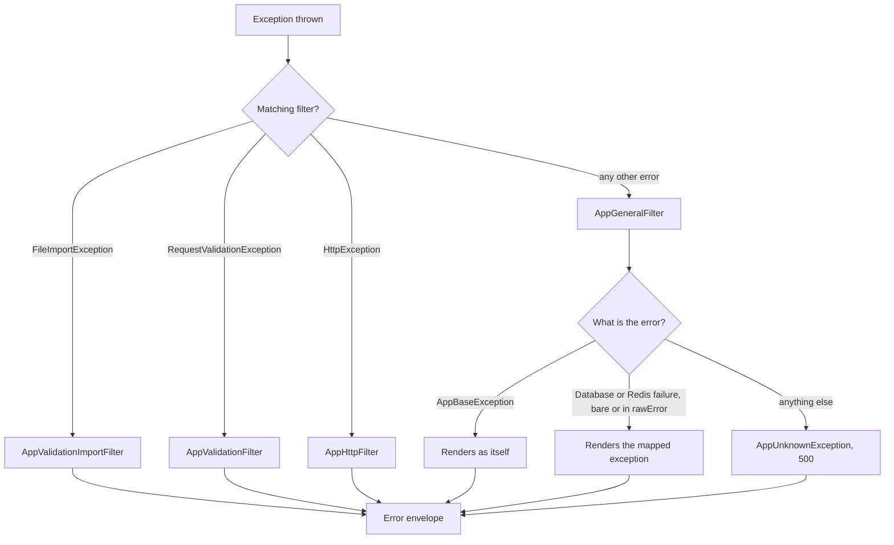

# Handling Error Documentation

Exception filters live in `src/app/filters`.

## Overview

Exception filters turn thrown errors into the same HTTP error body, with i18n messages and logging.

## Related Documents

- [Response Documentation][ref-doc-response]: Error envelope shape
- [Request Validation Documentation][ref-doc-request-validation]: Validation error path
- [Status Codes Documentation][ref-doc-status-codes]: Application `statusCode` catalog by module
- [Language Message Documentation][ref-doc-message]: Error message i18n
- [Logger Documentation][ref-doc-logger]: Error logging and Sentry
- [Doc Documentation][ref-doc-doc]: OpenAPI kit errors from `@Doc`, `*Protected` / auth kits, and when used `@ResponsePagination` / `FileUpload*` / `@ResponseFile`. Module-flow domain exceptions appear only when an endpoint opts in with `@DocErrors`

## Table of Contents

- [Overview](#overview)
- [Related Documents](#related-documents)
- [Filter Chain](#filter-chain)
- [Error Response Structure](#error-response-structure)
- [Response Metadata](#response-metadata)
- [Response Headers](#response-headers)
- [Exception Filters](#exception-filters)
    - [AppGeneralFilter](#appgeneralfilter)
    - [AppHttpFilter](#apphttpfilter)
    - [AppValidationFilter](#appvalidationfilter)
    - [AppValidationImportFilter](#appvalidationimportfilter)
- [Usage](#usage)
    - [Throwing an error](#throwing-an-error)
    - [Error with message interpolation](#error-with-message-interpolation)
    - [Error wrapping a cause](#error-wrapping-a-cause)
    - [Runtime errors outside a request](#runtime-errors-outside-a-request)
    - [Defining a new exception](#defining-a-new-exception)

## Filter Chain

Four [NestJS exception filters][ref-nestjs-exception-filters] are registered globally as `APP_FILTER` providers in `src/app/app.module.ts`. The provider array order is:

1. `AppGeneralFilter`
2. `AppHttpFilter`
3. `AppValidationFilter`
4. `AppValidationImportFilter`

NestJS evaluates global filters in reverse of the registration array, so the most specific catch runs first. Effective matching order:

1. **AppValidationImportFilter**: Handles `FileImportException`
2. **AppValidationFilter**: Handles `RequestValidationException`
3. **AppHttpFilter**: Handles framework `HttpException` (route 404s, rate-limit `ThrottlerException`, etc.)
4. **AppGeneralFilter**: Catches every other error, `AppBaseException` included

`AppBaseException` does not extend `HttpException`, so it reaches `AppGeneralFilter`.

**Processing flow**:



**Common behavior**:

- Build metadata and headers via the shared `ResponseMetadataService` (`create()` / `setHeaders()`), sourced from the request store (`RequestLanguageStoreKey` / `RequestVersionStoreKey` / `RequestIdStoreKey` / `RequestCorrelationIdStoreKey`)
- Generate timestamp and timezone information
- Resolve localized error message using [Message System][ref-doc-message]
- Set response headers
- Format into `ResponseErrorDto`
- `AppGeneralFilter` and `AppHttpFilter` log the error and report it through `SentryService.captureException` from `src/common/sentry` only when the resolved HTTP status is 500 or above. See [Logger][ref-doc-logger]
- The two validation filters neither log nor report

## Error Response Structure

All errors are formatted into `ResponseErrorDto`:

```typescript
{
  "statusCode": number,        // Custom status code or HTTP status
  "statusCodeKey": string,     // Status-code enum key (camelCase)
  "module": string,            // Owning module
  "message": string,           // Localized error message
  "metadata": { ... },         // Request/response metadata
  "data": { ... },            // Optional: additional error context
  "errors": [ ... ]           // Optional: validation errors
}
```

**Field descriptions**:

| Field | Type | Required | Description |
| --- | --- | --- | --- |
| `statusCode` | `number` | Yes | Custom status code for error identification |
| `statusCodeKey` | `string` | Yes | Status-code enum key (camelCase). Domain errors: enum key (e.g. `'notFound'`). Framework HTTP errors: camelCase HTTP status name (e.g. `'notFound'`). General/unknown: `'unknown'` |
| `module` | `string` | Yes | Owning module. Domain errors: module name (e.g. `'user'`). Framework HTTP errors: `'http'`. General/unknown: `'app'` |
| `message` | `string` | Yes | Localized message from [Message System][ref-doc-message] |
| `metadata` | `ResponseMetadataDto` | Yes | Request/response metadata |
| `data` | `unknown` | No | Additional error context |
| `errors` | `array` | No | Validation error details (validation exceptions only) |

## Response Metadata

`ResponseMetadataDto` provides contextual information:

```typescript
{
  "language": "en",
  "timestamp": 1660190937231,
  "timezone": "Asia/Jakarta",
  "version": "1",
  "repoVersion": "1.0.0",
  "requestId": "550e8400-e29b-41d4-a716-446655440000",
  "correlationId": "6ba7b810-9dad-11d1-80b4-00c04fd430c8"
}
```

**Field sources**:

| Field | Source | Fallback |
| --- | --- | --- |
| `language` | Request store `RequestLanguageStoreKey` | Config `message.language`, also for a stored value outside `EnumMessageLanguage` |
| `timestamp` | `HelperDateService.getTimestamp()` | - |
| `timezone` | `HelperDateService.getZone()` | - |
| `version` | Request store `RequestVersionStoreKey` | Config `app.urlVersion.version` |
| `repoVersion` | Config `app.version` | - |
| `requestId` | Request store `RequestIdStoreKey` | `null` |
| `correlationId` | Request store `RequestCorrelationIdStoreKey` | `null` |

## Response Headers

All filters set these headers automatically:

```
x-custom-lang: en
x-timestamp: 1660190937231
x-timezone: Asia/Jakarta
x-version: 1
x-repo-version: 1.0.0
x-request-id: 550e8400-e29b-41d4-a716-446655440000
x-correlation-id: 6ba7b810-9dad-11d1-80b4-00c04fd430c8
```

`x-request-id` and `x-correlation-id` are omitted when the request store holds no value.

A rate-limited 429 also carries `Retry-After`, in seconds.

- Whichever limiter blocks the request sets it (`RequestThrottleDefaultGuard`, `RequestThrottleRouteGuard`, or `RequestThrottleUserInterceptor`), before the exception reaches any filter.
- The filter preserves it.

See [Security and Middleware][ref-doc-security-and-middleware].

## Exception Filters

### AppGeneralFilter

**Location**: `src/app/filters/app.general.filter.ts`

**Catches**: `@Catch()`, every error no other filter claims

**Use case**: The single translator for application errors, known database and Redis failures, and unexpected errors.

**Resolution**:

1. An `AppUnknownException` renders as the mapped exception when its `rawError` maps through `DatabaseUtil.toException` or `RedisUtil.toException`, and as itself otherwise.
2. Any other `AppBaseException` renders as itself.
3. Any other error maps through the same two utils.
4. An error that maps nowhere is wrapped in `AppUnknownException`.

**Mapped failures**:

| Failure | Exception | `statusCode` | HTTP status |
| --- | --- | --- | --- |
| `PrismaClientInitializationError`, or a Prisma code in `DatabaseUnavailableCodes` (`P1001`, `P1002`, `P1008`, `P1017`, `P2024`) | `DatabaseUnavailableException` | `51802` | 503 |
| Prisma `P2034` write conflict | `DatabaseWriteConflictException` | `51801` | 409 |
| Keyv Redis not-connected error | `RedisUnavailableException` | `52400` | 503 |

**Behavior**:

- Reads `statusCode`, `httpStatus`, `messagePath`, `messageProperties`, `metadata`, and `data` from the resolved exception.
- `messageProperties` and `metadata` are `null` when the exception carries none.
- Resolves the localized message via the [Message System][ref-doc-message].
- Merges `exception.metadata` into the response metadata.
- Logs and sends to Sentry only when the resolved `httpStatus` is 500 or above. The report carries `rawError` when the thrown exception has one, otherwise the exception itself.
- An unmapped unknown error answers HTTP 500 with message path `http.serverError.internalServerError` and status code `50000` (`EnumAppStatusCodeError.unknown`).

**Response example**:

```json
{
  "statusCode": 51000,
  "statusCodeKey": "notFound",
  "module": "user",
  "message": "Sorry, we couldn't find the user you requested.",
  "metadata": { ... }
}
```

**Unknown error example**:

```json
{
  "statusCode": 50000,
  "statusCodeKey": "unknown",
  "module": "app",
  "message": "Internal Server Error",
  "metadata": { ... }
}
```

### AppHttpFilter

**Location**: `src/app/filters/app.http.filter.ts`

**Catches**: `@Catch(HttpException)`, framework HTTP exceptions only (route 404s, rate-limit `ThrottlerException` 429, payload limits, etc.)

**Use case**: NestJS/framework `HttpException`s.

- Application code does not throw `HttpException`.
- Every application error is an `AppBaseException` subclass handled by `AppGeneralFilter`.

**Message**: Resolves the message path `http.{statusCode}` via the [Message System][ref-doc-message]

**statusCodeKey and module**:

- They come from the `HttpException` response object when it carries those fields.
- Otherwise `statusCodeKey` is the camelCase `HttpStatus` name and `module` is `'http'`.

**Sentry integration**: Logs and sends only exceptions with HTTP status ≥ 500

**Response example**:

```json
{
  "statusCode": 404,
  "statusCodeKey": "notFound",
  "module": "http",
  "message": "Not Found",
  "metadata": { ... }
}
```

**Rate-limited response**:

- A breached rate limit throws `ThrottlerException`, which is a framework `HttpException`.
- This filter builds its envelope from `HttpStatus.TOO_MANY_REQUESTS`, with no application status code involved.
- The response also carries a `Retry-After` header in seconds.

```json
{
  "statusCode": 429,
  "statusCodeKey": "tooManyRequests",
  "module": "http",
  "message": "Too Many Request",
  "metadata": { ... }
}
```

### AppValidationFilter

**Location**: `src/app/filters/app.validation.filter.ts`

**Catches**: `@Catch(RequestValidationException)`, request validation errors

**Use case**: Request body, query parameters, and path parameters that fail their route's zod schema

**Behavior**:

- Formats field-specific validation errors
- Uses `MessageService.setValidationMessage()`
- Does not send to Sentry

**Response example**:

```json
{
  "statusCode": 50300,
  "statusCodeKey": "validation",
  "module": "request",
  "message": "There are validation errors.",
  "errors": [
    {
      "key": "invalidFormat",
      "property": "email",
      "message": "email does not match the expected format."
    }
  ],
  "metadata": { ... }
}
```

See [Request Validation][ref-doc-request-validation] for details.

### AppValidationImportFilter

**Location**: `src/app/filters/app.validation-import.filter.ts`

**Catches**: `@Catch(FileImportException)`, file import validation errors

**Use case**: CSV file import rows that fail their zod schema

**Behavior**:

- Formats row-level validation errors
- Uses `MessageService.setValidationImportMessage()`
- Does not send to Sentry

**Response example**:

```json
{
  "statusCode": 50300,
  "statusCodeKey": "validation",
  "module": "file",
  "message": "The imported data failed validation.",
  "errors": [
    {
      "row": 2,
      "errors": [
        {
          "key": "invalidFormat",
          "property": "email",
          "message": "email does not match the expected format."
        }
      ]
    }
  ],
  "metadata": { ... }
}
```

See [Request Validation][ref-doc-request-validation] for details.

## Usage

Application code throws a dedicated exception class per error, each extending `AppBaseException`. A runtime error outside a request throws `AppUnknownException` or a subclass (see [Runtime errors outside a request](#runtime-errors-outside-a-request)). An `AppBaseException` subclass fixes:

- its own `module`
- `statusCode`
- `statusCodeKey`
- `httpStatus`

Each class lives in the `exceptions/` folder of the module that owns its status-code enum.

### Throwing an error

```typescript
throw new UserNotFoundException();
```

### Error with message interpolation

When the i18n message has placeholders, the constructor takes explicit named params and maps them to `messageProperties`:

```typescript
throw new UserPasswordMustNewException(period);
```

The class wires it internally:

```typescript
super('user.error.passwordMustNew', { messageProperties: { period } });
```

**Message file** (`en/user.json`):

```json
{
    "error": {
        "passwordMustNew": "New password must be different from previous passwords within the past {period} days."
    }
}
```

### Error wrapping a cause

A caught error leaves the `catch` as a typed exception.

- `throw new Error(...)` is rejected by ESLint. Code throws a typed exception: `AppBaseException` when the error answers a request, `AppUnknownException` or a subclass otherwise.
- A bare `throw err` is allowed only inside an `instanceof` guard that names a class of ours. Everything else is wrapped as `throw new AppUnknownException(err)`.
- The cause rides in `rawError`. It is reported to Sentry for 5xx errors and never serialized into the response body.
- A guard that lets a typed exception through first keeps a domain exception raised inside the `try` on its own status code.

```typescript
try {
    // ...
} catch (err: unknown) {
    if (err instanceof AppBaseException) {
        throw err;
    }

    throw new AppUnknownException(err);
}
```

`AppGeneralFilter` maps a wrapped Prisma or Redis failure to its typed exception, so a `catch` around a repository call needs no database-specific branch.

**Classes a guard names**:

1. Domains guard `AppBaseException`, which covers `AppUnknownException` and its subclasses.
2. `QueueProcessorBase.process` logs the failure once at error level, then guards `QueueException`, `AppBaseException`, and BullMQ's `UnrecoverableError`, and wraps every other error in `AppUnknownException`. A processor that catches inside `handle` follows the same split.
3. `ActivityLogInterceptor` guards `AppBaseException` and the framework `HttpException`, so a framework error keeps its own filter. It wraps every other error in `AppUnknownException`.
4. Seeds guard nothing. Every caught error is wrapped in `AppUnknownException`.

### Runtime errors outside a request

`AppUnknownException` extends `AppBaseException` and fixes the status code `50000` and the HTTP status 500.

- The constructor is `AppUnknownException(rawError, description = null)`.
- `rawError` carries the cause.
- `description` replaces only the `message` of the `Error` object, which is what logs and Sentry show.
- `description` never reaches the response. The response message always resolves from the message path `http.serverError.internalServerError`.
- A runtime error with no request to answer is a subclass that names the failure through `description`.
- The status code `50000` and the HTTP status 500 apply when the error renders in a response with an unmapped `rawError`.
- A `rawError` that maps through `DatabaseUtil.toException` or `RedisUtil.toException` renders as the mapped exception (409 or 503), as [AppGeneralFilter](#appgeneralfilter) describes.

**Boot failures** throw their subclass, so the process fails with a named message:

- Firebase initialization (`FirebasePrivateKeyInvalidException`, `FirebaseInitializationFailedException`).
- JWT configuration (`AuthJwtConfigMissingException`, `AuthJwtConfigInvalidException`).

**Decorator-argument errors** throw when the route decorator is evaluated at load, so a misdecorated route fails the boot (`RequestEnvProtectedEmptyException`, `RoleProtectedEmptyException`, `PolicyProtectedEmptyException`, `PolicyProtectedActionEmptyException`, `FeatureFlagKeyEmptyException`, `FeatureFlagKeyNestedException`).

**The throttle exception** is logged, never thrown:

1. The throttle storage runs while a request is being counted, and `RequestThrottleResponseInvalidException` describes a Redis script answer it cannot read.
2. The throttler fails open, so the storage logs the exception at error level and lets the request through.
3. The exception never reaches a filter, so the client never receives it.

| Exception | Occurs when |
| --- | --- |
| `FirebasePrivateKeyInvalidException` | The configured Firebase private key cannot be normalized into a PEM key |
| `FirebaseInitializationFailedException` | The Firebase Admin SDK throws while initializing |
| `RequestEnvProtectedEmptyException` | `RequestEnvProtected` receives no environment |
| `RequestThrottleResponseInvalidException` | The throttle Redis script answers a shape or number the storage cannot read |
| `RoleProtectedEmptyException` | `RoleProtected` receives no role |
| `PolicyProtectedEmptyException` | `PolicyProtected` receives no policy |
| `PolicyProtectedActionEmptyException` | A policy given to `PolicyProtected` has no action |
| `FeatureFlagKeyEmptyException` | `FeatureFlagProtected` receives an empty key or key segment |
| `FeatureFlagKeyNestedException` | `FeatureFlagProtected` receives a key with dots |
| `AuthJwtConfigMissingException` | A required JWT key is not configured |
| `AuthJwtConfigInvalidException` | A configured JWT key does not parse as its expected format |

### Defining a new exception

Add a numeric status-code enum entry, then the class:

```typescript
export class ExampleSomethingException extends AppBaseException {
    readonly module = 'example';
    readonly statusCode = EnumExampleStatusCodeError.something;
    readonly statusCodeKey = EnumExampleStatusCodeError[this.statusCode];
    readonly httpStatus = HttpStatus.BAD_REQUEST;

    constructor() {
        super('example.error.something');
    }
}
```

<!-- REFERENCES -->

[ref-nestjs-exception-filters]: https://docs.nestjs.com/exception-filters
[ref-doc-response]: response.md
[ref-doc-request-validation]: request-validation.md
[ref-doc-status-codes]: status-codes.md
[ref-doc-message]: language-message.md
[ref-doc-logger]: logger.md
[ref-doc-security-and-middleware]: security-and-middleware.md
[ref-doc-doc]: doc.md
