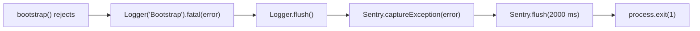

# Logger Documentation

Logger lives in `src/common/logger`.

## Overview

Pino logs cover:

- file rotation
- redaction of sensitive fields
- request/response serializers
- URL masking
- request IDs
- Sentry

Environment behavior:

- `LOGGER_PRETTIER` switches pretty-printing on or off.
- Health, hello, and docs routes are left out of auto-logging and Sentry (`logger.excludedRoutes`).
- Memory and uptime fields appear outside production.

`LoggerModule.forRoot()` registers `nestjs-pino` with two providers:

- `LoggerOptionService` assembles the pino options.
- `LoggerUtil` (`src/common/logger/utils/logger.util.ts`) holds the serializers, the redaction walk, the URL masking, and the severity mapping every record passes through.

## Related Documents

- [Configuration Documentation][ref-doc-configuration]: Logger config keys
- [Environment Documentation][ref-doc-environment]: Logger env vars
- [Handling Error Documentation][ref-doc-handling-error]: Filters that report to Sentry
- [Security and Middleware Documentation][ref-doc-security-and-middleware]: Request ID and logger middleware

## Table of Contents

- [Overview](#overview)
- [Related Documents](#related-documents)
- [Configuration](#configuration)
    - [Environment Variables](#environment-variables)
    - [Configuration Interface](#configuration-interface)
- [Usage](#usage)
    - [Log Levels](#log-levels)
    - [Log Severity](#log-severity)
- [Startup and Boot Failure](#startup-and-boot-failure)
    - [Logger Handover](#logger-handover)
    - [Boot Failure](#boot-failure)
    - [Migration Command Failure](#migration-command-failure)
- [Sensitive Data Redaction](#sensitive-data-redaction)
    - [Sensitive Paths](#sensitive-paths)
    - [Sensitive Fields](#sensitive-fields)
    - [Redaction Examples](#redaction-examples)
        - [Authentication Data](#authentication-data)
        - [Array Truncation](#array-truncation)
        - [Buffer Handling](#buffer-handling)
        - [Object Depth Limitation](#object-depth-limitation)
- [File Logging](#file-logging)
    - [Configuration](#configuration-1)
    - [File Rotation Settings](#file-rotation-settings)
    - [File Structure](#file-structure)
    - [Log Format](#log-format)
    - [Example Usage](#example-usage)
- [Auto Logging](#auto-logging)
    - [Configuration](#configuration-2)
    - [Logged Information](#logged-information)
    - [Excluded Routes](#excluded-routes)
    - [Pattern Matching Rules](#pattern-matching-rules)
    - [Adding Custom Excluded Routes](#adding-custom-excluded-routes)
    - [Auto-logging Context](#auto-logging-context)
- [Console Output](#console-output)
    - [Pretty Mode (LOGGER_PRETTIER=true)](#pretty-mode-logger_prettiertrue)
    - [JSON Mode (LOGGER_PRETTIER=false)](#json-mode-logger_prettierfalse)
    - [Debug Information (Non-Production)](#debug-information-non-production)
- [Request ID Tracking](#request-id-tracking)
    - [Id Source](#id-source)
    - [Fallback Behavior](#fallback-behavior)
    - [Usage Example](#usage-example)
    - [Request ID Header](#request-id-header)
    - [Correlation ID Handling](#correlation-id-handling)
- [Sentry Integration](#sentry-integration)
    - [Sentry Configuration](#sentry-configuration)
    - [Configuration Details](#configuration-details)
    - [Disabling Sentry](#disabling-sentry)

## Configuration

### Environment Variables

Configuration is managed through environment variables. Add these to your `.env` file:

```env
# Logger Configuration
LOGGER_ENABLE=true
LOGGER_LEVEL=debug
LOGGER_INTO_FILE=true
LOGGER_PRETTIER=true
LOGGER_AUTO=false

# Sentry Configuration (Optional)
SENTRY_DSN=<your_sentry_dsn>
```

| Variable | Description | Type | In `.env.example` | Required |
| --- | --- | --- | --- | --- |
| `LOGGER_ENABLE` | Enable/disable logging; `false` sets the Pino level to `silent` | `boolean` | `true` | Yes |
| `LOGGER_LEVEL` | Minimum log level once Pino is attached | `EnumLoggerLevel` | `debug` | Yes |
| `LOGGER_INTO_FILE` | Write logs to files | `boolean` | `true` | Yes |
| `LOGGER_PRETTIER` | Enable pretty-printing in console | `boolean` | `true` | Yes |
| `LOGGER_AUTO` | Enable automatic HTTP request/response logging | `boolean` | `false` | Yes |
| `SENTRY_DSN` | Sentry Data Source Name for error tracking; a URL, and a blank line counts as unset | `string` | empty | No |

### Configuration Interface

`IConfigLogger` (`src/configs/logger.config.ts`), registered under the `logger` key:

| Option | Description | Value |
| --- | --- | --- |
| `enable` | Enable/disable logging | `LOGGER_ENABLE` |
| `level` | Minimum log level, typed `EnumLoggerLevel` (`fatal`, `error`, `warn`, `info`, `debug`, `trace`) | `LOGGER_LEVEL` |
| `intoFile` | Write logs to files | `LOGGER_INTO_FILE` |
| `filePath` | Directory path for log files | `/logs` |
| `auto` | Enable automatic HTTP request/response logging | `LOGGER_AUTO` |
| `excludedRoutes` | Routes left out of auto-logging and Sentry (see [Excluded Routes](#excluded-routes)) | built from `app.globalPrefix` and `doc.prefix` |
| `prettier` | Enable pretty-printing in console | `LOGGER_PRETTIER` |
| `sentry.dsn` | Sentry DSN for error tracking | `SENTRY_DSN`, `null` when blank or unset |
| `sentry.timeoutInMs` | Declared on the config and read by no consumer. `Sentry.init` takes `sentry.dsn` and the sample rates, and the boot `catch` waits `AppBootstrapSentryFlushTimeoutInMs`, not this key | `ms('10s')` |
| `sentry.tracesSampleRate` | Traces sample rate outside production | `1` |
| `sentry.tracesSampleRateProduction` | Traces sample rate in production | `0.3` |
| `sentry.profilesSampleRate` | Profiles sample rate outside production | `0.5` |
| `sentry.profilesSampleRateProduction` | Profiles sample rate in production | `0.1` |

## Usage

Use [NestJS][ref-nestjs] Logger in application code:

```typescript
import { Logger } from '@nestjs/common';

export class UserDomain {
    private readonly logger = new Logger(UserDomain.name);

    async createUser(data: UserCreateRequestDto) {
        this.logger.log('Creating new user');

        try {
            const user = await this.userRepository.create(data);
            this.logger.log(`User created: ${user.id}`);
            return user;
        } catch (error) {
            // NOTE: pass object/error first, message string second
            this.logger.error(error, 'Failed to create user');
            throw error;
        }
    }

    async deleteUser(id: string) {
        this.logger.warn(`Attempting to delete user: ${id}`);
        // deletion logic
    }

    async getUserDetails(id: string) {
        this.logger.debug(`Fetching user details for: ${id}`);
        // fetch logic
    }
}
```

### Log Levels

`EnumLoggerLevel` declares Pino's own level set. These six values are what `LOGGER_LEVEL` accepts:

**Level Hierarchy (from highest to lowest priority):**

1. `fatal`: Unrecoverable failures that end the process or the job
2. `error`: Critical errors that need immediate attention
3. `warn`: Warning conditions that call for review
4. `info`: General informational messages
5. `debug`: Debug-level messages for development
6. `trace`: Fine-grained tracing, the most verbose level

The `Logger` from `@nestjs/common` is backed by `nestjs-pino`, so its method names do not all match the level they emit:

```typescript
this.logger.fatal('Fatal message'); // fatal level
this.logger.error('Error message'); // error level
this.logger.warn('Warning message'); // warn level
this.logger.log('Info message'); // info level  (method is log, not info)
this.logger.debug('Debug message'); // debug level
this.logger.verbose('Verbose message'); // trace level (method is verbose, not trace)
```

- `log()` and `verbose()` are the two that differ.
- `verbose` and `silly` are Winston names.
- Neither is a valid `LOGGER_LEVEL` value.
- `LOGGER_LEVEL=verbose` is rejected by environment validation at startup.

**Note:** Setting `LOGGER_LEVEL=warn` logs only `fatal`, `error`, and `warn` messages, filtering out `info`, `debug`, and `trace`.

### Log Severity

`LoggerUtil.mapLevelToSeverity` maps numeric Pino levels to the `EnumLoggerSeverity` values, uppercased, and writes the result to the `severity` field:

| Pino Level | Severity   | Use Case                      |
| ---------- | ---------- | ----------------------------- |
| ≥ 60       | `CRITICAL` | System-wide critical failures |
| ≥ 50       | `ERROR`    | Application errors            |
| ≥ 40       | `WARNING`  | Warning conditions            |
| ≥ 30       | `INFO`     | General information           |
| ≥ 20       | `DEBUG`    | Debug information             |
| < 20       | `TRACE`    | Trace-level debugging         |

## Startup and Boot Failure

Both entrypoints pass the same three logging options to Nest:

- `ConfigureOptions` in `src/configure.ts` serves `NestFactory.create` in `src/main.ts`.
- `src/migration.ts` passes the three inline to `CommandFactory.createWithoutRunning`.

### Logger Handover

- `bufferLogs: true` attaches Nest's log buffer. Every `Logger` call made while it is attached waits in the buffer until a flush.
- `logger: ['fatal']` limits Nest's default console logger to `fatal` entries. It covers only the window before `useLogger(Pino)`.
- `abortOnError: false` makes a failed module build reject the `bootstrap()` promise, so the bootstrap `catch` handler runs and the process does not exit on its own.
- `configure(app)` calls `app.useLogger(PinoLogger)`. `src/migration.ts` calls `app.useLogger(app.get(LoggerPino))` and then `app.flushLogs()`.
- From the `useLogger` call on, Pino follows `LOGGER_ENABLE` and `LOGGER_LEVEL`, and the `['fatal']` limit holds only before it.

What flushes the buffer, and through which logger the waiting entries print:

1. In `src/migration.ts` the `useLogger` call itself flushes, because Nest sets flush-on-override for the application context that `CommandFactory` creates. The explicit `app.flushLogs()` that follows finds the buffer empty. The waiting entries print through Pino.
2. In `src/main.ts` the `useLogger` call in `configure(app)` does not flush, because `NestFactory.create` does not set flush-on-override. The buffer stays attached until `app.listen` binds the port, and its listen callback flushes (`autoFlushLogs` defaults to `true`). The waiting entries print through Pino.
3. A failure while Nest builds the module graph flushes the buffer before it rethrows. The entries print through the default console logger, so only `fatal` entries appear.
4. `Logger.flush()` in the bootstrap `catch` handler flushes whatever is still waiting, through the logger attached at that moment.

### Boot Failure

A rejected `bootstrap()` runs the same `catch` handler in `src/main.ts` and `src/migration.ts`:



- The handler writes one `FATAL [Bootstrap]` line per failure.
- While the buffer is attached, that line waits in it, and `Logger.flush()` prints it together with every other waiting entry.
- A failure before the handover prints through Nest's console logger. Its level is `fatal` only, so the `Bootstrap` line appears and buffered `error`, `warn`, and `log` entries are dropped. Pino never receives them.
- A failure after the handover prints through Pino, so `LOGGER_ENABLE=false` silences the line. In `src/main.ts` the buffer is still attached at that point when the failure comes before `app.listen` binds, so the flush in the handler also replays the buffered startup entries through Pino. The Sentry report and the exit code stay.
- `AppBootstrapSentryFlushTimeoutInMs` (`src/app/constants/app.constant.ts`) is the 2000 ms the handler waits for Sentry to deliver the report. The `sentry.timeoutInMs` config key (10 s) is a different value that no code reads.
- Without `SENTRY_DSN`, `Sentry.init` never runs and the report goes nowhere.
- These failures reach the handler:
    - an environment variable that fails `AppEnvSchema` validation
    - a database connection that fails in `DatabaseService.onModuleInit`
    - a rejected `app.listen`

`src/instrument.ts` runs before Nest and before `AppEnvSchema` validation, so it initializes Sentry from the unvalidated environment.

- With a usable `SENTRY_DSN` set, `Sentry.init` has already run when an environment validation failure reaches the handler, so the handler's `Sentry.captureException` reports it.
- When `SENTRY_DSN` is unset or blank, the validation failure is logged and the process exits with code 1, and no report is sent.

### Migration Command Failure

- `src/migration.ts` passes nest-commander a `serviceErrorHandler`.
- The handler rethrows an `AppBaseException` unchanged and wraps any other error in `AppUnknownException` (`Running the migration command failed`).
- The rethrown error reaches the bootstrap `catch` handler, so a command that throws exits with code `1`.
- A seed that logs an error and returns, such as a missing prerequisite row, completes normally and exits with code `0`.
- A successful run closes the application and calls `process.exit(0)`.

## Sensitive Data Redaction

The logger automatically redacts sensitive fields to prevent exposure of credentials, tokens, and personal information in logs.

### Sensitive Paths

Paths where sensitive data may be located (defined in `logger.constant.ts`):

```typescript
export const LoggerSensitivePaths = [
    'req.body',
    'req.headers',
    'req.query',
    'req.params',
    'res.body',
    'res.headers',
    'request.body',
    'request.headers',
    'request.query',
    'request.params',
    'response.body',
    'response.headers',
];
```

The logger scans these paths in request/response objects and redacts any fields matching the sensitive field list.

### Sensitive Fields

Fields that are automatically redacted (defined in `logger.constant.ts`):

```typescript
export const LoggerSensitiveFields: string[] = [
    // Authentication & Authorization
    'password',
    'newPassword',
    'oldPassword',
    'token',
    'authorization',
    'bearer',
    'secret',
    'credential',
    'jwt',
    'x-api-key',
    'apiKey',
    'refreshToken',
    'accessToken',
    'sessionId',
    'privateKey',
    'secretKey',
    'otp',
    'recoveryCode',

    // Location & Personal Data
    'location',
    'gps',
    'coordinates',
    'latitude',
    'longitude',

    // Session & Cookies
    'cookie',
    'cookies',
    'set-cookie',
    'referer',

    // Flow tokens, 2FA material, and sealed notification payloads
    'inviteToken',
    'challengeToken',
    'backupCode',
    'code',
    'pendingSecret',
    'encryptedPassword',
    'encryptedLink',
    'encryptedInviteAcceptLink',
    'encryptedJoinRequestReviewLink',
    'link',
];
```

**Redaction Rules:**

- Three mechanisms redact, and they match differently:
    - `LoggerUtil.redactValue` covers request `query` and `headers`, response `headers`, and a record's `additionalData`.
        - It walks every key at every depth and compares it lowercased against the lowercased list.
        - It is therefore **case-insensitive**: `Password`, `PASSWORD`, and `password` all match.
    - Request `params` keep their names, and every value is replaced with `[REDACTED]`, whatever the name.
    - Pino's `redact.paths` (built as `LoggerSensitivePaths` combined with `LoggerSensitiveFields`) matches each path segment literally.
        - It is therefore **case-sensitive**: only the exact spelling listed in `LoggerSensitiveFields` matches.
- Fields with hyphens are wrapped in brackets in the pino paths (e.g., `req.headers["x-api-key"]`)
- All matching fields are replaced with `LoggerRedactedValue` (`[REDACTED]`)

### Redaction Examples

#### Authentication Data

**Request with sensitive data:**

```json
{
    "username": "john.doe",
    "password": "secret123",
    "apiKey": "abc-def-ghi-jkl",
    "email": "john@example.com"
}
```

**Logged as:**

```json
{
    "username": "john.doe",
    "password": "[REDACTED]",
    "apiKey": "[REDACTED]",
    "email": "john@example.com"
}
```

#### Array Truncation

Arrays longer than 10 items are automatically truncated to prevent excessive logging:

```json
{
    "items": [
        "item1",
        "item2",
        "item3",
        "item4",
        "item5",
        "item6",
        "item7",
        "item8",
        "item9",
        "item10",
        { "truncated": "...[TRUNCATED] - total length 50" }
    ]
}
```

#### Buffer Handling

Binary data (Buffers) are replaced with a placeholder:

```json
{
    "file": { "buffer": "[BUFFER]" }
}
```

#### Object Depth Limitation

`LoggerUtil.redactValue` walks objects up to `LoggerRedactMaxDepth` (**5 levels**).

A value nested deeper is replaced whole with `[REDACTED]`, so nothing past the cap is written unredacted.

The cap also bounds:

- Performance cost on deeply nested objects
- Circular references
- Log size

`LoggerUtil.sanitizeMessage` processes string leaves: it strips ANSI codes and collapses whitespace.

## File Logging

- Enable file logging by setting `LOGGER_INTO_FILE=true`.
- `pino-roll` writes logs to `./logs/api.log` with automatic rotation.

### Configuration

```env
LOGGER_INTO_FILE=true
```

### File Rotation Settings

- **File path**: `./logs/api.log`
- **Size limit**: 10MB per file
- **Rotation**: Daily or when size limit is reached
- **Directory**: Automatically created if it doesn't exist

### File Structure

```
logs/
└── api.log              # Current log file (rotates daily or at 10MB)
```

### Log Format

When `LOGGER_PRETTIER=false`, logs are written in JSON format:

```json
{
    "severity": "INFO",
    "context": "UserDomain",
    "requestId": "0192f3c4-7a1e-7b52-9c3d-5e6f7a8b9c0d",
    "correlationId": "req-abc-123",
    "timestamp": 1764577182750,
    "msg": "User created: user-123",
    "service": {
        "name": "ACKNestJs",
        "environment": "production",
        "version": "9.0.0"
    },
    "level": 30
}
```

### Example Usage

```typescript
// Enable file logging in production
// .env.production
LOGGER_ENABLE = true;
LOGGER_LEVEL = info;
LOGGER_INTO_FILE = true;
LOGGER_PRETTIER = false;
LOGGER_AUTO = true;
```

## Auto Logging

- Enable automatic HTTP request/response logging with `LOGGER_AUTO=true`.
- The feature logs all incoming HTTP requests and their responses without manual instrumentation.

### Configuration

```env
LOGGER_AUTO=true
```

### Logged Information

When auto-logging is enabled, the following information is automatically captured:

**Request** (`LoggerUtil.serializeRequest`):

- HTTP method
- `route`:
    - the matched route pattern (`baseUrl` plus the route path, such as `/api/v1/admin/user/:userId/device/list`)
    - for a request that matched no route, the URL masked by `LoggerUtil.maskUrl`
    - the raw URL and path are not logged
- User-Agent
- Content-Type
- `referer`, masked by `LoggerUtil.maskUrl`, or `null` when the request carries no `Referer` header
- Remote address and port
- Client IP address
- Authenticated user ID
- Query parameters (redacted)
- Route params
    - the parameter names are logged
    - every value is `[REDACTED]`
- Request headers (redacted)

**URL masking.** `LoggerUtil.maskUrl`:

- keeps the origin
- drops the query string and fragment
- replaces every path segment with `[REDACTED]` unless it is a route parameter name, a version segment (`v1`), or a static lowercase kebab-case word (`LoggerUrlStaticSegmentRegex`)

An ID or token in the path never reaches a log line.

**Response:**

- HTTP status code
- Response time
- Content-Length
- Response headers (sanitized)

The request id and the correlation id are not part of the `req` record. Every entry carries them as top-level fields. See [Request ID Tracking](#request-id-tracking).

### Excluded Routes

Routes excluded from auto-logging, and from Sentry events and traces, are the config key `logger.excludedRoutes` (`src/configs/logger.config.ts`). The list is built from `app.globalPrefix` and `doc.prefix`, so it follows both prefixes:

```typescript
export default registerAs('logger', (): IConfigLogger => {
    const { globalPrefix } = appConfigFunction();
    const { prefix: docPrefix } = docConfigFunction();

    return {
        // ...
        excludedRoutes: [
            `${globalPrefix}/public/hello`,
            `${globalPrefix}/public/hello/*`,
            `${globalPrefix}/system/health`,
            `${globalPrefix}/system/health/*`,
            '/metrics',
            '/metrics/*',
            '/favicon.ico',
            docPrefix,
            `${docPrefix}/*`,
            '/',
        ],
        // ...
    };
});
```

With the default prefixes (`/api`, `/docs`) the list resolves to `/api/public/hello`, `/api/system/health`, `/metrics`, `/favicon.ico`, `/docs`, their `/*` variants, and `/`.

- `LoggerOptionService` reads it for the pino-http `autoLogging.ignore` check.
- `src/instrument.ts` reads it for `beforeSend` and `tracesSampler`.

### Pattern Matching Rules

- **Exact match**: `/api/system/health` matches only this exact path
- **Wildcard suffix**: `/api/system/health/*` matches `/api/system/health/database`, `/api/system/health/aws`, etc.
- **Root path**: `/` matches only the root endpoint
- All patterns are **case-insensitive**

### Adding Custom Excluded Routes

To exclude additional routes, add patterns to `excludedRoutes` in `src/configs/logger.config.ts`:

```typescript
excludedRoutes: [
    `${globalPrefix}/public/hello`,
    `${globalPrefix}/public/hello/*`,
    `${globalPrefix}/system/health`,
    `${globalPrefix}/system/health/*`,
    '/metrics',
    '/metrics/*',
    '/favicon.ico',
    docPrefix,
    `${docPrefix}/*`,
    '/',
    // Add your custom routes
    '/internal/*',
    `${globalPrefix}/admin/debug`,
],
```

### Auto-logging Context

All auto-logged entries use the context `LoggerAutoContext` to distinguish them from manual logs:

```json
{
  "severity": "INFO",
  "context": "LoggerAutoContext",
  "requestId": "0192f3c4-7a1e-7b52-9c3d-5e6f7a8b9c0d",
  "correlationId": "req-abc-123",
  "msg": "request completed",
  "req": { ... },
  "res": { ... }
}
```

## Console Output

The logger supports two output modes: Pretty mode for development and JSON mode for production.

### Pretty Mode (`LOGGER_PRETTIER=true`)

Development-friendly colored output with structured formatting using `pino-pretty`:

```
INFO [2025-12-29 15:18:54.496 +0700]: [UserDomain] Creating new user
    requestId: "0192f3c4-7a1e-7b52-9c3d-5e6f7a8b9c0d"
    correlationId: "req-abc-123"
    service: {
      "name": "ACKNestJs",
      "environment": "local",
      "version": "9.0.0"
    }
    additionalData: {
      "userId": "user-123",
      "action": "create"
    }
    debug: {
      "memory": {
        "rss": 449,
        "heapUsed": 182
      },
      "uptime": 2,
      "pid": 12345,
      "hostname": "localhost"
    }
```

**Features:**

- Color-coded log levels (ERROR = red, WARN = yellow, INFO = green, DEBUG = blue)
- Timestamp in system timezone
- Context displayed in square brackets
- Multi-line structured data for readability

**Configuration:**

```env
LOGGER_PRETTIER=true
LOGGER_LEVEL=debug
```

### JSON Mode (`LOGGER_PRETTIER=false`)

Production-optimized structured JSON for log aggregation and analysis tools:

```json
{
    "severity": "INFO",
    "context": "UserDomain",
    "requestId": "0192f3c4-7a1e-7b52-9c3d-5e6f7a8b9c0d",
    "correlationId": "req-abc-123",
    "timestamp": 1735461534496,
    "msg": "Creating new user",
    "service": {
        "name": "ACKNestJs",
        "environment": "production",
        "version": "9.0.0"
    },
    "additionalData": { "userId": "user-123", "action": "create" },
    "level": 30
}
```

**Features:**

- Machine-readable single-line JSON format
- Consistent structure for parsing
- Compatible with log aggregation tools (ELK, Datadog, CloudWatch)
- Compact output without formatting

**Configuration:**

```env
LOGGER_PRETTIER=false
LOGGER_LEVEL=info
```

### Debug Information (Non-Production)

In non-production environments (`app.env !== 'production'`), additional debug information is automatically included in every log entry:

```json
{
    "debug": {
        "memory": {
            "rss": 413,
            "heapUsed": 181
        },
        "uptime": 1,
        "pid": 12345,
        "hostname": "dev-server"
    }
}
```

**Debug Fields:**

| Field             | Description                               | Unit    |
| ----------------- | ----------------------------------------- | ------- |
| `memory.rss`      | Resident Set Size: total memory allocated | MB      |
| `memory.heapUsed` | Heap memory currently in use              | MB      |
| `uptime`          | Process uptime since startup              | seconds |
| `pid`             | Process ID                                | number  |
| `hostname`        | Server hostname                           | string  |

**Use Cases:**

- Memory leak detection
- Performance monitoring
- Process identification in multi-instance deployments

**Note:** Debug information is automatically excluded in production to reduce log size and improve performance.

## Request ID Tracking

Every log entry carries the request id and the correlation id as top-level fields.

- The logger generates no id and reads no id header.
- `RequestRequestIdMiddleware` assigns both ids and writes them to the request store. See [Security and Middleware Documentation][ref-doc-security-and-middleware].
- The pino `mixin` in `LoggerOptionService` reads `RequestIdStoreKey` and `RequestCorrelationIdStoreKey` from `RequestStoreService` each time an entry is written.
- The log formatter writes `requestId` and `correlationId` at the top level of the entry.
- Both fields are `null` for an entry written outside a request.
- The `req` serializer (`LoggerUtil.serializeRequest`) writes no id. pino-http's own numeric `req.id` is never logged.
- `LoggerUtil.serializeRequest` reads the `user-agent`, `content-type`, and `referer` headers into the request record.
- `LoggerUtil.serializeRequest` logs the full request headers redacted.

### Id Source

- `requestId` is the inbound `x-request-id` when it matches `RequestIdRegex` (`^[A-Za-z0-9._-]{1,128}$`).
- `requestId` is a new UUID v7 otherwise.
- `correlationId` is the inbound `x-correlation-id` when it matches `RequestIdRegex`.
- `correlationId` is a new UUID v7 otherwise.
- The same values sit in the request store under `RequestIdStoreKey` and `RequestCorrelationIdStoreKey`.

### Fallback Behavior

An absent, non-string, or non-matching `x-request-id` or `x-correlation-id` is replaced with a new UUID v7.

The request is never rejected for it.

### Usage Example

**Client sends request with correlation ID:**

```bash
curl -H "x-correlation-id: req-abc-123" http://localhost:3000/api/v1/shared/user/profile/get
```

**Logger output:**

```json
{
    "requestId": "0192f3c4-7a1e-7b52-9c3d-5e6f7a8b9c0d",
    "correlationId": "req-abc-123",
    "req": {
        "method": "GET",
        "route": "/api/v1/shared/user/profile/get"
    }
}
```

### Request ID Header

What the code does with the `x-request-id` header:

- `RequestRequestIdMiddleware` validates it against `RequestIdRegex`.
- The response carries the resulting value in `x-request-id` and in the response metadata `requestId`.
- The logger binds it to each entry as the top-level `requestId` field.

### Correlation ID Handling

What the code does with the `x-correlation-id` header:

- `RequestRequestIdMiddleware` validates it against `RequestIdRegex`.
- The response echoes the resulting value in the `x-correlation-id` header and in the response metadata `correlationId`.
- The logger binds it to each entry as the top-level `correlationId` field.

## Sentry Integration

Sentry is initialized at bootstrap by `src/instrument.ts` using `loggerConfigs.sentry.dsn`. Two independent streams reach Sentry:

- log entries go to Sentry's Logs product
- exceptions go to Sentry's Issues

**Log entries (Sentry Logs).**

- With `enableLogs: true`, `Sentry.pinoIntegration` auto-forwards Pino log entries (every `logger.log` / `warn` / `error` / ...) to Sentry Logs through Node `diagnostics_channel`.
- No manual transport is wired.
- Error-level logs reach Sentry Logs only and are not duplicated as Sentry Issues.

Forwarded levels are environment-aware:

- **Production**: `warn`, `error`, `fatal`.
- **Every other environment**: `trace`, `debug`, `info`, `warn`, `error`, `fatal`.

**`SentryService`.** `src/common/sentry` holds the Sentry kit:

- `SentryModule.forRoot()` is global, imports `@sentry/nestjs/setup`, and exports `SentryService`
- Methods: `captureException(exception)`, `captureMessage(message, level)`, `log(level, message, attributes?)`, and `withScope(callback)`
- Methods never throw: a Sentry SDK failure is logged and swallowed
- `log` writes to Sentry Logs directly.
    - Its `attributes` bypass the pino redaction and are scrubbed only by `beforeSendLog`.
    - They therefore carry no credential.
- `withScope` runs a callback against a fresh Sentry scope (used by `QueueProcessorBase.onFailed` to attach job attributes before `captureException`)

**Exceptions (Sentry Issues).** Exception reporting goes through `SentryService.captureException`:

- `AppGeneralFilter`: logs and reports only when the resolved exception answers HTTP status >= 500. An `AppBaseException` below 500 produces neither a log line nor a report.
    - An `AppUnknownException` with a `description` is reported as itself, so Sentry shows the description with the cause chained.
    - Any other `AppBaseException` is reported as its `rawError` when it has one, otherwise as itself.
- `AppHttpFilter`: logs and reports the `HttpException` for framework errors with HTTP status >= 500
- `QueueProcessorBase`:
    - In `process`, it writes BullMQ `job.log` lines (start, metadata-only input, finish or failure). On catch it calls Nest `Logger.error` once, then rethrows a `QueueException`, `AppBaseException`, or `UnrecoverableError` unchanged and wraps any other error in `AppUnknownException`.
    - In `onFailed`, it reports a failed job once when BullMQ will not retry it (final attempt, or immediately for an `UnrecoverableError`), and only when the error is fatal.
    - Before `captureException`, `withScope` sets `job.id`, `job.name`, `job.attemptsMade`, and `job.maxAttempts`.
    - A `QueueException` is reported only when `isFatal` is set.
- `AuthTwoFactorDomain`: reports a stored TOTP secret that fails to decrypt, before answering `409 twoFactorSecretUnavailable`
- The bootstrap `catch` handler in `src/main.ts` and `src/migration.ts`: reports a boot failure with `Sentry.captureException` and waits for `Sentry.flush` before the process exits (see [Boot Failure](#boot-failure))

`beforeSend` is the last filter every Issue passes through. It drops:

- a non-fatal `QueueException`
- an event whose `request.url` matches `logger.excludedRoutes`
- an event whose response status code is below 500
- an event at `info` or `debug` level

Outside production, `beforeSend` also attaches the original exception under `event.extra`.

`tracesSampler` applies the same excluded-route match to transactions:

- It checks both the request URL and the span name with its HTTP method prefix removed.
- It returns a `0` sample rate for matches.

**Scrubbing.** `instrument.ts` scrubs every payload before it leaves the process, with the same `LoggerSensitiveFields` list (case-insensitive) and the same URL masking as the logger:

`beforeSend` (after the drops above) and `beforeSendTransaction`:

- `request.url` is masked and `request.query_string` removed.
- Sensitive request headers are redacted.
- Every cookie value is redacted.
- The request body is redacted (below).
- The transaction name and every span description are masked.
- Trace context, span, and breadcrumb data are scrubbed as in `beforeBreadcrumb`.

`beforeBreadcrumb`:

- URL keys (`LoggerSentryUrlKeys`) are masked.
- Query and fragment keys (`LoggerSentryQueryKeys`) are removed.
- Body keys (`LoggerSentryBodyKeys`) are redacted.
- Sensitive `http.request.header.*` / `http.response.header.*` attributes are redacted.

`beforeSendLog`:

- Log attributes are redacted by key, then scrubbed as in `beforeBreadcrumb`.

A request body is redacted by shape:

- An object is walked key by key up to `LoggerSentryRedactMaxDepth` (10) and replaced whole past it.
- A JSON string is parsed, redacted, and re-serialized. An unparseable one becomes `[REDACTED]`.
- An `application/x-www-form-urlencoded` string has the value of each sensitive key replaced.
- Any other string is replaced whole with `[REDACTED]`.

### Sentry Configuration

Configure Sentry by setting the `SENTRY_DSN` environment variable:

```env
# .env.production
SENTRY_DSN=<your_sentry_dsn>
```

### Configuration Details

The Sentry configuration is defined in `src/configs/logger.config.ts`:

```typescript
sentry: {
    dsn: string | null; // Sentry Data Source Name, null when SENTRY_DSN is unset
    timeoutInMs: number; // ms('10s'), read by no consumer
    tracesSampleRate: number; // 1
    tracesSampleRateProduction: number; // 0.3
    profilesSampleRate: number; // 0.5
    profilesSampleRateProduction: number; // 0.1
}
```

`instrument.ts` is loaded first, through `node --import ./dist/instrument.js` in the start and migration scripts and `import '@instrument'` at the top of `src/main.ts`.

- It reads `sentry.dsn` and skips `Sentry.init` entirely when it is `null`.
- The sample rates come from the logger config: in production `tracesSampleRateProduction` and `profilesSampleRateProduction`, in every other environment `tracesSampleRate` and `profilesSampleRate`.
- `tracesSampler` returns the chosen traces rate for every non-excluded transaction.
- The rest of the initializer options (`normalizeDepth`, `maxValueLength`, `maxBreadcrumbs`, `attachStacktrace`, `sendDefaultPii`) are literals in `instrument.ts`.

### Disabling Sentry

Sentry is off when `SENTRY_DSN` is unset, blank, or commented out:

```env
# SENTRY_DSN=https://...
```

When the DSN is not configured:

- `SentryService` calls send nothing.
- Exceptions are only logged locally.
- The Sentry health indicator reports `down` with `Sentry is not configured`.

<!-- REFERENCES -->

[ref-nestjs]: http://nestjs.com
[ref-doc-configuration]: configuration.md
[ref-doc-environment]: environment.md
[ref-doc-handling-error]: handling-error.md
[ref-doc-security-and-middleware]: security-and-middleware.md
