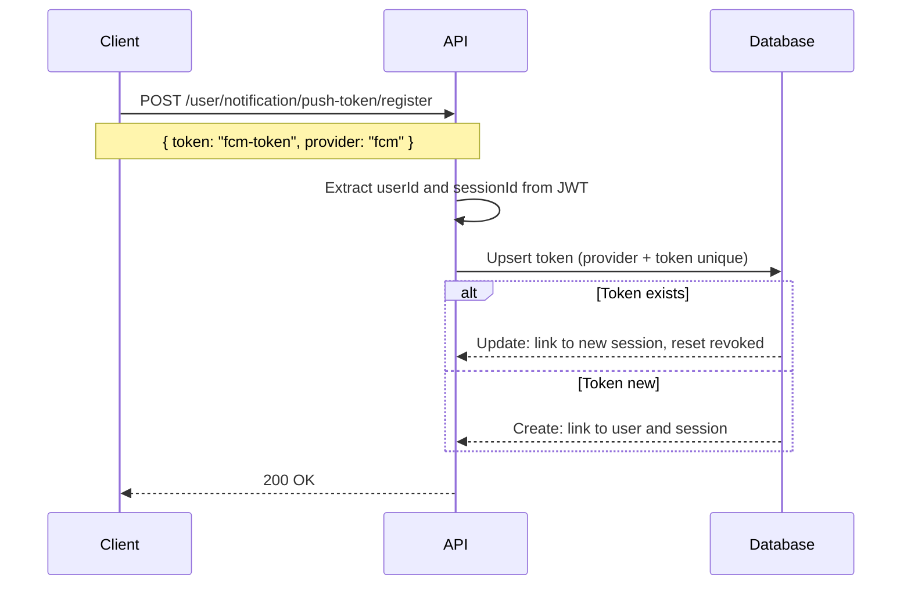
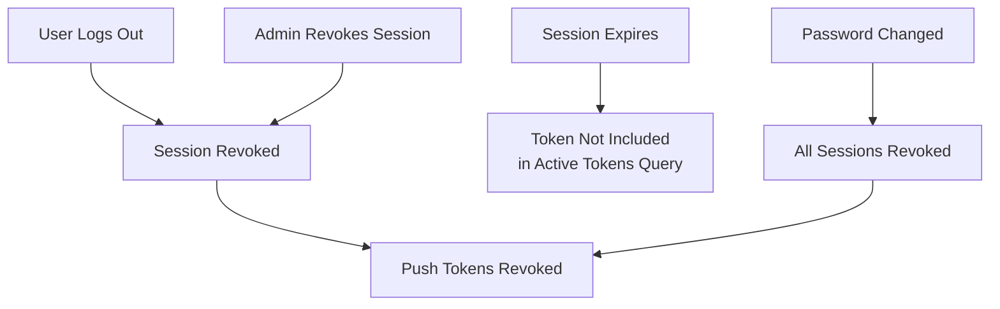
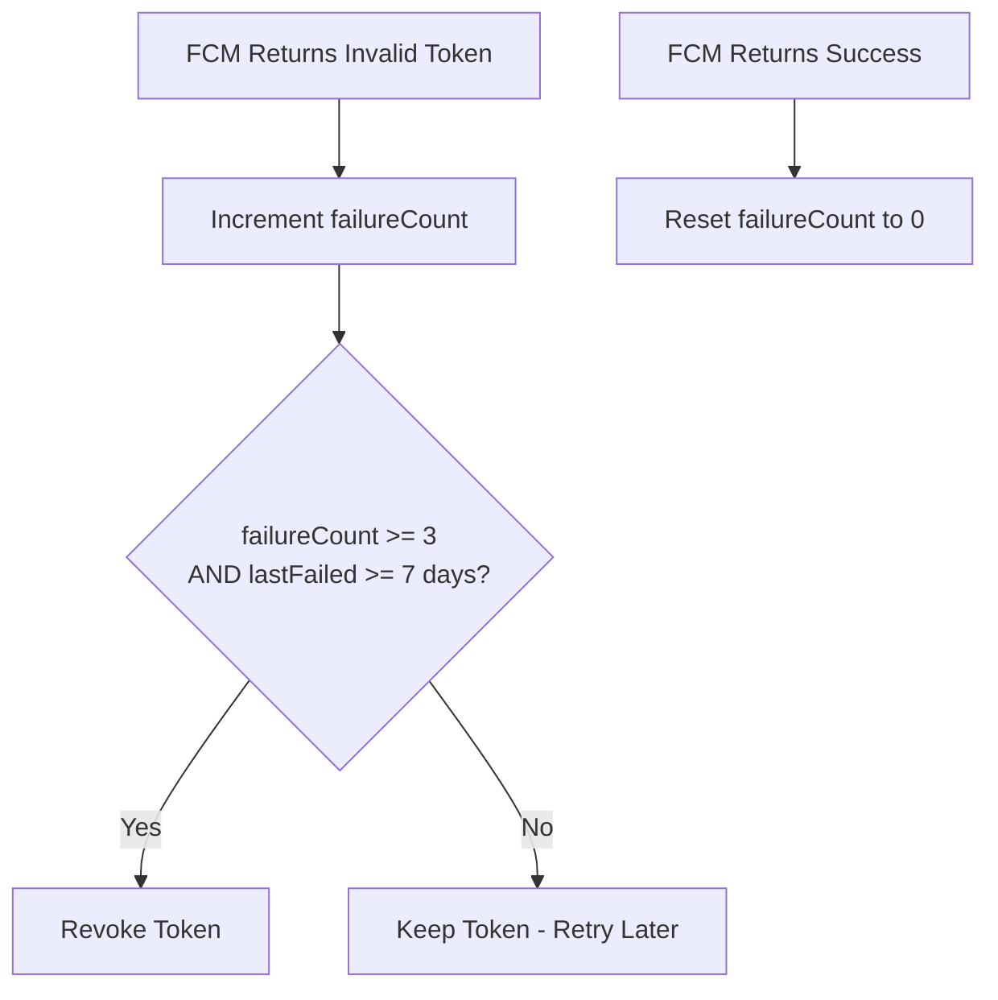
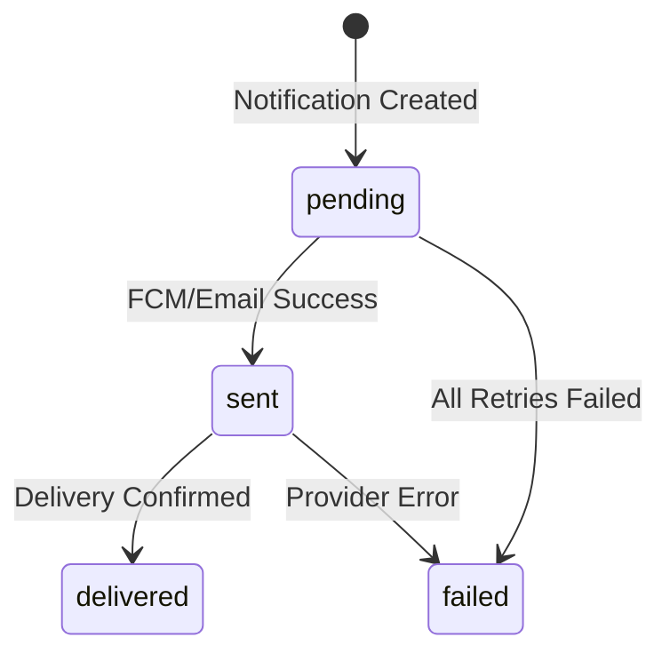
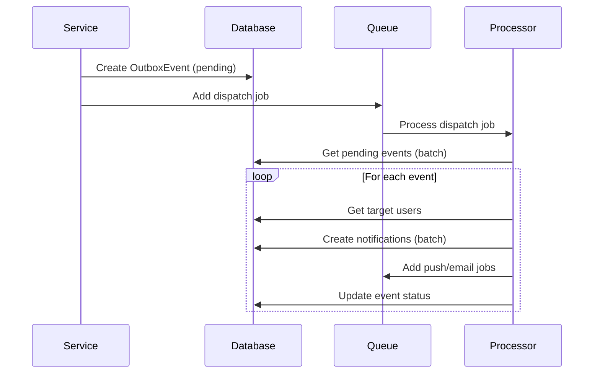

# Notification Documentation

This documentation explains the features and usage of **Notification Module**: Located at `src/modules/notification`

## Overview

The notification module provides a comprehensive notification system with multi-channel delivery (push, email), real-time delivery tracking, template support, and session-based push token management using [Firebase Cloud Messaging (FCM)][ref-firebase] for push notifications.

Key features:
- **Multi-Channel Delivery**: Email and push notifications with user preference control
- **Transactional Outbox Pattern**: Reliable notification fan-out using BullMQ
- **Push Token Management**: Session-linked tokens with automatic cleanup on session revocation
- **Delivery Tracking**: Per-channel delivery status (pending, sent, delivered, failed)
- **Template System**: i18n support with variable interpolation
- **Firebase FCM Integration**: Real push notifications with invalid token detection

## Related Documents

- [Authentication][ref-doc-authentication] - Session management and push token linking
- [Queue][ref-doc-queue] - Background job processing for notifications
- [Configuration][ref-doc-configuration] - Firebase and notification settings
- [Environment][ref-doc-environment] - Firebase environment variables

## Table of Contents

- [Overview](#overview)
- [Related Documents](#related-documents)
- [Configuration](#configuration)
    - [Firebase Configuration](#firebase-configuration)
    - [Outbox Configuration](#outbox-configuration)
- [Push Token Management](#push-token-management)
    - [Registration Flow](#registration-flow)
    - [Session-Token Dependency](#session-token-dependency)
    - [Token Cleanup Strategy](#token-cleanup-strategy)
- [Notification Channels](#notification-channels)
    - [Push Notifications](#push-notifications)
    - [Email Notifications](#email-notifications)
- [Delivery Tracking](#delivery-tracking)
    - [Delivery Status](#delivery-status)
    - [Delivery Flow](#delivery-flow)
- [Template System](#template-system)
- [API Endpoints](#api-endpoints)
    - [List Notifications](#list-notifications)
    - [Register Push Token](#register-push-token)
    - [Revoke Push Token](#revoke-push-token)
    - [Mark as Read](#mark-as-read)
    - [Mark All as Read](#mark-all-as-read)
- [Outbox Pattern](#outbox-pattern)
    - [How it Works](#how-it-works)
    - [Retry Logic](#retry-logic)

## Configuration

### Firebase Configuration

Firebase Cloud Messaging configuration in `src/configs/firebase.config.ts`:

```typescript
export default registerAs(
    'firebase',
    (): IFirebaseConfig => ({
        projectId: process.env.FIREBASE_PROJECT_ID,
        clientEmail: process.env.FIREBASE_CLIENT_EMAIL,
        privateKey: process.env.FIREBASE_PRIVATE_KEY?.replace(/\\n/g, '\n'),
    })
);
```

**Environment Variables:**
- `FIREBASE_PROJECT_ID`: Your Firebase project ID
- `FIREBASE_CLIENT_EMAIL`: Service account email (from Firebase Console)
- `FIREBASE_PRIVATE_KEY`: Private key (from Firebase Console service account JSON)

> **Note**: Get these values from Firebase Console → Project Settings → Service Accounts → Generate New Private Key

### Outbox Configuration

Outbox settings in `src/modules/notification/constants/notification.constant.ts`:

```typescript
export const NotificationOutboxDispatchIntervalMs = 30000;  // 30 seconds
export const NotificationOutboxPendingBatchSize = 50;
export const NotificationOutboxFanoutChunkSize = 1000;
export const NotificationOutboxInsertBatchSize = 500;
export const NotificationOutboxRetryDelayMs = 5000;
export const NotificationOutboxMaxAttempts = 5;
```

## Push Token Management

### Registration Flow



### Session-Token Dependency

Push tokens are automatically revoked when their associated session is revoked:



**Implementation**: 
- `SessionService.revoke()` calls `NotificationPushTokenRepository.revokeBySessionId()`
- `findActiveTokensByUser()` filters for valid sessions (non-revoked, non-expired)

### Token Cleanup Strategy

FCM best practice: lazy cleanup with failure tracking instead of immediate revocation.



**Token Fields:**
- `failureCount`: Incremented on FCM failure (batch update)
- `lastFailedAt`: Timestamp of last failure
- `isRevoked`: True when token is permanently invalid

## Notification Channels

### Push Notifications

Sent via Firebase Cloud Messaging using `FirebaseService`:

```typescript
// Single device
await firebaseService.sendPush(token, {
    title: 'Login Alert',
    body: 'New login from web',
    data: { loginFrom: 'web' }
});

// Multiple devices (batch)
const result = await firebaseService.sendMulticast(tokens, payload);
// result: { successCount, failureCount, invalidTokens }
```

**User Preference Check:**
```typescript
const enabled = await notificationSettingRepository.isEnabled(
    userId,
    EnumNotificationChannel.push,
    EnumNotificationSettingType.login
);
```

### Email Notifications

Integrated with `EmailService` for notification emails:

```typescript
if (emailEnabled && user.email) {
    await emailService.sendLoginNotification(
        user.id,
        { email, username },
        { loginFrom, loginWith, ipAddress, loginAt }
    );
}
```

## Delivery Tracking

### Delivery Status

Defined in `EnumDeliveryStatus`:

| Status | Description |
|--------|-------------|
| `pending` | Notification queued for delivery |
| `sent` | Successfully sent to provider (FCM/email) |
| `delivered` | Confirmed delivery to device |
| `failed` | Delivery failed after all retries |
| `bounced` | Email bounced back |

### Delivery Flow



**Implementation:**
```typescript
// Create delivery record
const delivery = await notificationDeliveryRepository.create(
    notificationId,
    EnumNotificationChannel.push
);

// Update status after send
if (result.successCount > 0) {
    await notificationDeliveryRepository.markSent(delivery.id);
} else {
    await notificationDeliveryRepository.markFailed(delivery.id, 'All pushes failed');
}
```

## Template System

Templates support variable interpolation using `{{variable}}` syntax:

**Repository:**
```typescript
const template = await notificationTemplateRepository.findByKeyAndLocale(
    'login_notification',
    'en'
);
```

**Rendering:**
```typescript
const { title, body } = notificationTemplateService.render(template, {
    username: 'john',
    loginFrom: 'web',
    ipAddress: '192.168.1.1'
});
// Template: "Hello {{username}}, you logged in from {{loginFrom}}"
// Result: "Hello john, you logged in from web"
```

**Locale Fallback:**
- Tries requested locale first
- Falls back to `en` if requested locale not found

## API Endpoints

All endpoints require: `@ApiKeyProtected()`, `@AuthJwtAccessProtected()`, `@UserProtected()`, `@TermPolicyAcceptanceProtected()`

### List Notifications

```http
GET /api/v1/user/notification/list
```

Returns cursor-paginated notifications for the current user.

### Register Push Token

```http
POST /api/v1/user/notification/push-token/register
Content-Type: application/json

{
    "token": "fcm-device-token",
    "provider": "fcm"
}
```

Registers or updates a push token for the current session. Uses upsert pattern.

### Revoke Push Token

```http
DELETE /api/v1/user/notification/push-token/revoke
```

Revokes all push tokens for the current session.

### Mark as Read

```http
PATCH /api/v1/user/notification/:notificationId/read
```

Marks a specific notification as read.

### Mark All as Read

```http
POST /api/v1/user/notification/read-all
```

Marks all unread notifications as read for the current user.

## Outbox Pattern

The notification module uses the transactional outbox pattern for reliable notification delivery.

### How it Works



### Retry Logic

Failed events are retried with exponential backoff:

```typescript
// Constants
NotificationOutboxRetryDelayMs = 5000    // Base delay
NotificationOutboxMaxAttempts = 5         // Max retries

// Formula: delay * 2^(attemptCount - 1)
// Attempt 1: 5s, Attempt 2: 10s, Attempt 3: 20s, etc.
```

After max attempts, events are marked as `failed` and not retried.

<!-- REFERENCES -->

[ref-firebase]: https://firebase.google.com/docs/cloud-messaging
[ref-bullmq]: https://bullmq.io

[ref-doc-authentication]: authentication.md
[ref-doc-queue]: queue.md
[ref-doc-configuration]: configuration.md
[ref-doc-environment]: environment.md
