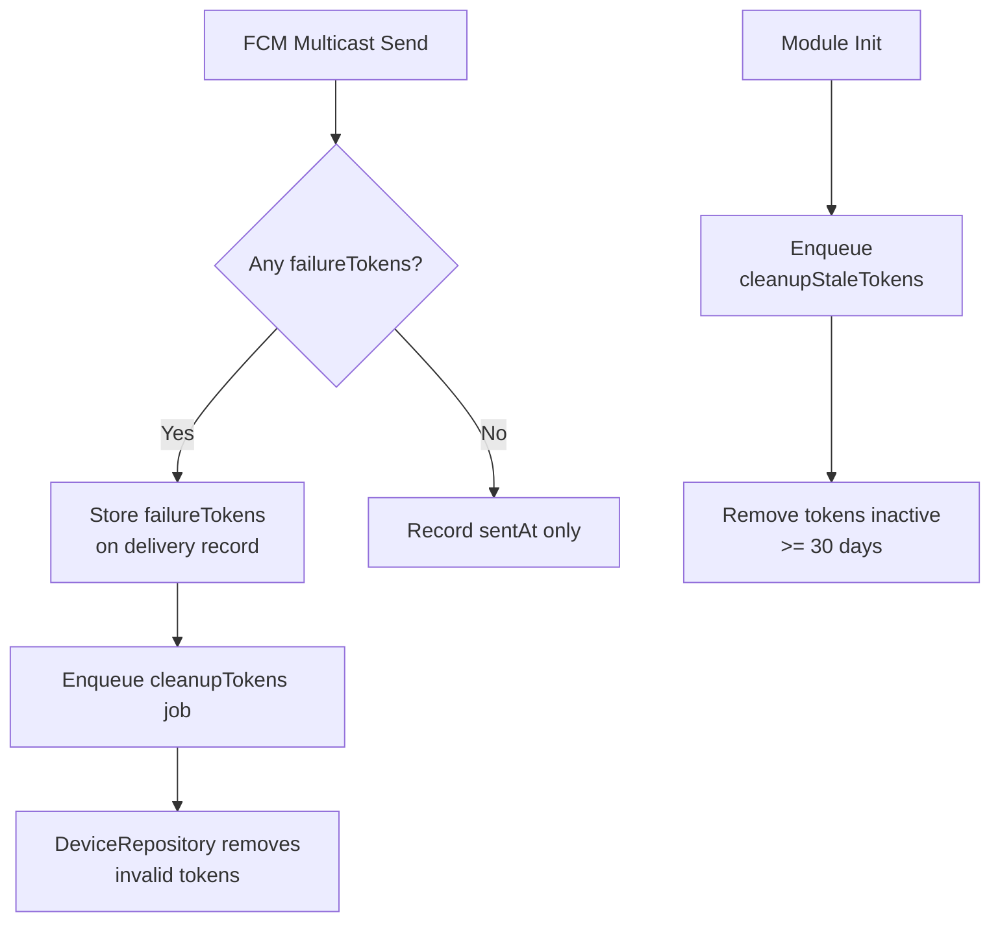
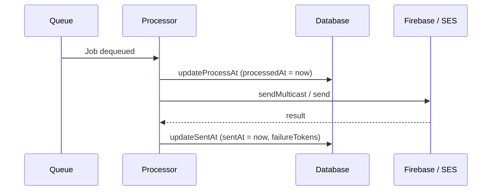

# Notification Documentation

This documentation explains the features and usage of **Notification Module**: Located at `src/modules/notification`

## Overview

The notification module provides a comprehensive multi-channel notification system backed by three dedicated BullMQ queues: one for orchestration, one for email delivery, and one for push delivery.

Key features:
- **Multi-Channel Delivery**: `email`, `push`, `inApp`, and `silent` channels
- **Queue-Based Processing**: Three separate BullMQ queues for orchestration, email, and push
- **User Preference Control**: Per type+channel opt-in/out settings for each user
- **AWS SES Email Templates**: Handlebars `.hbs` templates synced to SES via `NotificationTemplateService`
- **Firebase FCM Push**: Multicast delivery with batch chunking, rate limiting, and stale token cleanup
- **Delivery Tracking**: Per-channel `processedAt`, `sentAt`, and `failureTokens` recorded on each delivery record; `silent` and `inApp` are pre-marked at creation time

## Related Documents

- [Authentication][ref-doc-authentication] - Session management and push token linking
- [Third-Party Integration][ref-doc-third-party] - Firebase and AWS SES setup and no-op mode
- [Queue][ref-doc-queue] - Background job processing
- [Configuration][ref-doc-configuration] - App configuration
- [Environment][ref-doc-environment] - Environment variables

## Table of Contents

- [Overview](#overview)
- [Related Documents](#related-documents)
- [Notification Types and Priorities](#notification-types-and-priorities)
- [Notification Channels](#notification-channels)
- [Queue Architecture](#queue-architecture)
    - [Orchestration Queue](#orchestration-queue)
    - [Email Queue](#email-queue)
    - [Push Queue](#push-queue)
- [Push Notifications](#push-notifications)
    - [Push Token Management](#push-token-management)
    - [Token Cleanup Strategy](#token-cleanup-strategy)
    - [FCM Rate Limiting](#fcm-rate-limiting)
- [Email Notifications](#email-notifications)
    - [Template System](#template-system)
- [Delivery Tracking](#delivery-tracking)
- [User Notification Settings](#user-notification-settings)

## Notification Types and Priorities

Defined in `EnumNotificationType`:

| Type | Description |
|------|-------------|
| `userActivity` | General activity events (welcome, email verified, etc.) |
| `securityAlert` | Security-sensitive events (new device login, password change, 2FA reset) |
| `marketing` | Promotional and marketing messages |
| `transactional` | System-driven transactional events (e.g., term policy published) |

Defined in `EnumNotificationPriority`:

| Priority | Description |
|----------|-------------|
| `normal` | Standard informational notifications |
| `high` | Important events requiring prompt attention |
| `critical` | Security or time-sensitive events |

## Notification Channels

Each notification record carries one or more `NotificationDelivery` rows, one per channel. Available channels:

| Channel | Delivery | `processedAt` / `sentAt` |
|---------|----------|--------------------------|
| `email` | Via AWS SES (queued) | Set by `NotificationEmailProcessorService` after send |
| `push` | Via Firebase FCM (queued) | Set by `NotificationPushProcessorService` after send |
| `inApp` | In-application UI | Pre-filled at notification creation time |
| `silent` | No external delivery; record-only | Pre-filled at notification creation time |

A notification can target multiple channels simultaneously. The channels used for each notification type are defined per-event in `NotificationRepository` when the record is created.

> **`inApp` and `silent` are considered immediately "delivered"** — their `processedAt` and `sentAt` are both set at creation time in the repository, so no separate queue job is needed for them. Only `email` and `push` deliveries go through the async queue.

## Queue Architecture

The notification module uses **three dedicated BullMQ queues**, each with its own processor:

```
NotificationUtil        → EnumQueue.notification       → NotificationProcessor
NotificationEmailUtil   → EnumQueue.notificationEmail  → NotificationEmailProcessor
NotificationPushUtil    → EnumQueue.notificationPush   → NotificationPushProcessor
```

### Orchestration Queue

**Queue:** `EnumQueue.notification` | **Processor:** `NotificationProcessor` | **Service:** `NotificationProcessorService`

Handles the main event orchestration. When a process job is consumed, `NotificationProcessorService`:
1. Fetches the target user
2. Creates the `Notification` record (with delivery rows) in the database
3. Dispatches jobs to `notificationEmail` and/or `notificationPush` queues as appropriate

Jobs are dispatched via `NotificationUtil`, which applies deduplication per `userId` with a 1-second TTL.

**Supported processes (`EnumNotificationProcess`):**

| Job Name | Description |
|----------|-------------|
| `welcomeByAdmin` | Admin-created user welcome |
| `welcome` | Self-registered user welcome + verification email |
| `welcomeSocial` | Social login welcome |
| `temporaryPasswordByAdmin` | Temporary password assigned by admin |
| `changePassword` | User changed their password |
| `verifiedEmail` | Email address verified |
| `verifiedMobileNumber` | Mobile number verified |
| `verificationEmail` | Standalone email verification |
| `forgotPassword` | Forgot password request |
| `resetPassword` | Password was reset |
| `newDeviceLogin` | Login detected from a new/unknown device |
| `resetTwoFactorByAdmin` | Admin reset user 2FA |
| `publishTermPolicy` | New term policy published (bulk, all active users) |

### Email Queue

**Queue:** `EnumQueue.notificationEmail` | **Processor:** `NotificationEmailProcessor` | **Service:** `NotificationEmailProcessorService`

Rate-limited to match the AWS SES sending quota (`AwsSESRateLimitPerDuration` per `AwsSESRateLimitDurationInMs`).

Each job calls `AwsSESService.send()` or `AwsSESService.sendBulk()` using the named SES template for that event, with `defaultTemplateData` (`homeName`, `supportEmail`, `homeUrl`) merged automatically.

Jobs are dispatched via `NotificationEmailUtil`, which uses `jobId`-based deduplication per `userId`.

### Push Queue

**Queue:** `EnumQueue.notificationPush` | **Processor:** `NotificationPushProcessor` | **Service:** `NotificationPushProcessorService`

Rate-limited to `FirebaseMaxRateLimitPerDuration` (500,000) per `FirebaseRateLimitDurationInMs` (60 seconds), keeping safely under the FCM 600k/min ceiling.

**Supported push processes (`EnumNotificationPushProcess`):**

| Job Name | Description |
|----------|-------------|
| `newDeviceLogin` | Push alert for new device login |
| `resetPassword` | Push alert when password is reset |
| `resetTwoFactorByAdmin` | Push alert when admin resets 2FA |
| `temporaryPasswordByAdmin` | Push alert for temporary password |
| `cleanupTokens` | Remove reported invalid FCM tokens |
| `cleanupStaleTokens` | Clean up tokens inactive for ≥ 60 days |

On `onModuleInit`, `NotificationPushProcessorService` automatically dispatches a `cleanupStaleTokens` job.

## Push Notifications

### Push Token Management

Push tokens (FCM device tokens) are part of the **Device module** (`src/modules/device`), not stored in the notification module directly. `NotificationPushProcessorService` retrieves active tokens from `DeviceRepository` before dispatching FCM calls.

For push token registration, revocation, and session-linking details, see the [Device documentation][ref-doc-device].

### Token Cleanup Strategy

After each multicast send, `FirebaseService.sendMulticast()` returns `failureTokens` — tokens that FCM identified as invalid (codes in `FirebaseInvalidTokenCodes`). These are:

1. Stored on the delivery record via `NotificationRepository.updateSentAt()` (`failureTokens` field)
2. Queued as a `cleanupTokens` job in `EnumQueue.notificationPush`, handled by `NotificationPushProcessorService.processCleanupTokens()`

Stale tokens — those with no activity for `FirebaseStaleTokenThresholdInDays` (30 days) — are pruned at startup via `cleanupStaleTokens`.


```mermaid
graph TD
    A[FCM Multicast Send] --> B{Any failureTokens?}
    B -->|Yes| C[Store failureTokens <br/> on delivery record]
    C --> D[Enqueue cleanupTokens job]
    D --> E[DeviceRepository removes <br/> invalid tokens]
    B -->|No| F[Record sentAt only]
    
    G[Module Init] --> H[Enqueue <br/> cleanupStaleTokens]
    H --> I[Remove tokens inactive <br/> >= 30 days]
```

### FCM Rate Limiting

The push processor is configured with a BullMQ rate limiter:

```typescript
@QueueProcessor(EnumQueue.notificationPush, {
    limiter: {
        max: FirebaseMaxRateLimitPerDuration,   // 500,000
        duration: FirebaseRateLimitDurationInMs, // 60,000 ms
    },
})
```

`FirebaseService.sendMulticast()` also enforces a per-call chunk size of at most `FirebaseMaxSendPushBatchSize` (500) tokens per FCM `sendEachForMulticast` call, with chunks processed via `Promise.allSettled`.

For Firebase configuration and no-op mode (disabled when credentials are missing), see [Third-Party Integration — Firebase][ref-doc-third-party].

## Email Notifications

### Template System

Email templates are Handlebars (`.hbs`) files located in `src/modules/notification/templates/`. They are **uploaded to AWS SES** as named templates via `NotificationTemplateService`, which provides `import`, `get`, and `delete` operations per template.

Available templates (one per `EnumNotificationProcess` that uses email):

| Template File | Process |
|---------------|---------|
| `notification.welcome.template.hbs` | `welcome` |
| `notification.welcome-social.template.hbs` | `welcomeSocial` |
| `notification.welcome-by-admin.template.hbs` | `welcomeByAdmin` |
| `notification.temporary-password-by-admin.template.hbs` | `temporaryPasswordByAdmin` |
| `notification.change-password.template.hbs` | `changePassword` |
| `notification.forgot-password.template.hbs` | `forgotPassword` |
| `notification.new-device-login.template.hbs` | `newDeviceLogin` |
| `notification.reset-password.template.hbs` | `resetPassword` |
| `notification.verification-email.template.hbs` | `verificationEmail` |
| `notification.verified-email.template.hbs` | `verifiedEmail` |
| `notification.verified-mobile-number.template.hbs` | `verifiedMobileNumber` |
| `notification.reset-two-factor-by-admin.template.hbs` | `resetTwoFactorByAdmin` |
| `notification.publish-term-policy.template.hbs` | `publishTermPolicy` |

Templates are managed independently from migrations. Use `NotificationTemplateService` methods (e.g., `emailImportWelcome()`, `emailDeleteWelcome()`) to sync them to SES.

For AWS SES configuration and no-op mode, see [Third-Party Integration — SES][ref-doc-third-party].

## Delivery Tracking

Each `Notification` record contains embedded `NotificationDelivery` rows (one per channel). Delivery fields:

| Field | Description |
|-------|-------------|
| `processedAt` | When the processor started handling the delivery |
| `sentAt` | When the message was sent to the provider (FCM / SES) |
| `failureTokens` | FCM tokens that were invalid (push channel only) |

### Immediate channels (`silent`, `inApp`)

`silent` and `inApp` deliveries have `processedAt` and `sentAt` both pre-filled with the current timestamp **at notification creation time** inside `NotificationRepository`. No queue job is dispatched for them.

### Async channels (`email`, `push`)

`email` and `push` deliveries are initially created with no timestamps and go through the full queue lifecycle:


```mermaid
sequenceDiagram
    participant Q as Queue
    participant P as Processor
    participant DB as Database
    participant Ext as Firebase / SES

    Q->>P: Job dequeued
    P->>DB: updateProcessAt (processedAt = now)
    P->>Ext: sendMulticast / send
    Ext-->>P: result
    P->>DB: updateSentAt (sentAt = now, failureTokens)
```

## User Notification Settings

Users control which notification channels are active per type. Settings are stored in `NotificationUserSetting` (one row per `userId + type + channel`).

Allowed type+channel combinations are defined in `NotificationSettingUpdateAllowedCombinations`:

| Type | Allowed Channels |
|------|-----------------|
| `userActivity` | `email`, `inApp`, `push` |
| `marketing` | `email`, `push` |

`NotificationService.updateUserSetting()` validates the requested combination before writing. Invalid combinations throw a `BadRequestException` with `EnumNotificationStatusCodeError.invalidType` or `invalidChannel`.

The request DTO (`NotificationUserSettingRequestDto`) accepts:
- `type`: `userActivity` | `marketing`
- `channel`: `email` | `push` | `inApp`
- `isActive`: `boolean`

## Contribution

Special thanks to [ak2g][ref-contributor-ak2g] for contributing to the Notification module implementation.


<!-- REFERENCES -->

[ref-firebase]: https://firebase.google.com/docs/cloud-messaging
[ref-bullmq]: https://bullmq.io

[ref-doc-authentication]: authentication.md
[ref-doc-device]: device.md
[ref-doc-third-party]: third-party-integration.md
[ref-doc-queue]: queue.md
[ref-doc-configuration]: configuration.md
[ref-doc-environment]: environment.md

[ref-contributor-ak2g]: https://github.com/ak2g
