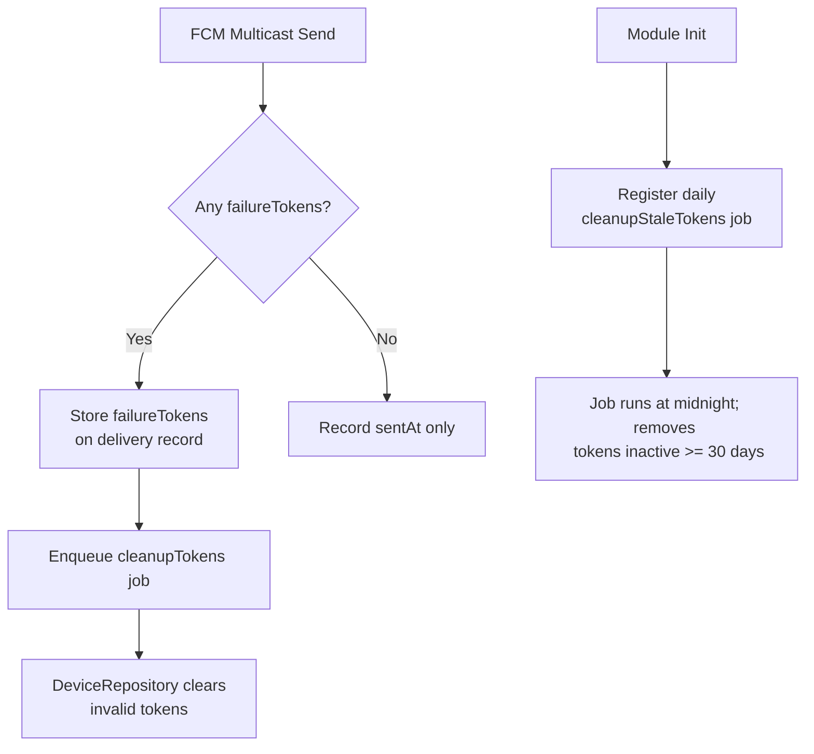
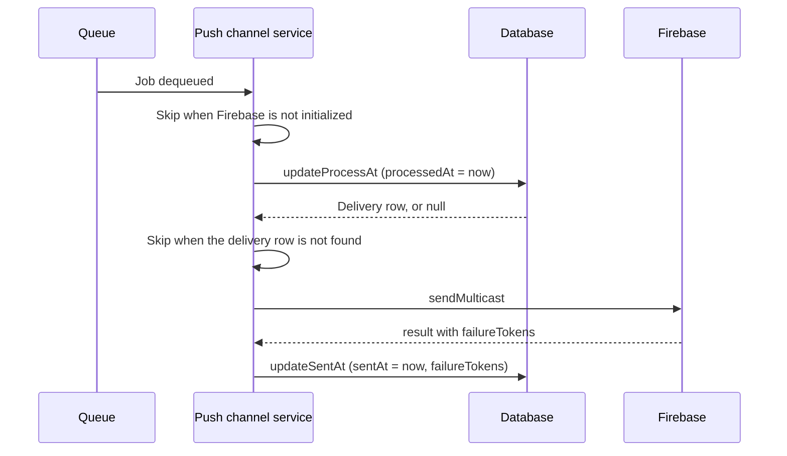

# Notification Documentation

Notification lives in `src/modules/notification`.

## Overview

Three BullMQ queues: orchestration, email, and push.

Key features:
- **Multi-Channel Delivery**: `email`, `push`, `inApp`, and `silent` channels
- **Queue-Based Processing**: Three separate BullMQ queues for orchestration, email, and push, each fed by its own `@Injectable()` queue class in `src/modules/notification/queues/`
- **User Preference Control**: Per type+channel opt-in/out settings for each user
- **AWS SES Email Templates**: Handlebars `.hbs` templates synced to SES; see [Email Documentation][ref-doc-email]
- **Firebase FCM Push**: Multicast delivery with batch chunking, rate limiting, and stale token cleanup
- **Delivery Tracking**: `silent` and `inApp` deliveries are pre-marked at creation time, `push` deliveries record `processedAt`, `sentAt`, and `failureTokens` as the processor runs, and `email` deliveries carry no timestamps at all

## Related Documents

- [Authentication][ref-doc-authentication] - Session management and push token linking
- [Email][ref-doc-email] - SES templates, sync command, and send mapping
- [Third-Party Integration][ref-doc-third-party] - Firebase and AWS SES credentials / no-op mode
- [Queue][ref-doc-queue] - Background job processing
- [Configuration][ref-doc-configuration] - App configuration
- [Environment][ref-doc-environment] - Environment variables

## Table of Contents

- [Overview](#overview)
- [Related Documents](#related-documents)
- [Notification Types and Priorities](#notification-types-and-priorities)
- [Notification Channels](#notification-channels)
- [Queue Architecture](#queue-architecture)
    - [Orchestration Queue](#orchestration-queue)
    - [Email Queue](#email-queue)
    - [Push Queue](#push-queue)
    - [Payload Encryption](#payload-encryption)
- [Push Notifications](#push-notifications)
    - [Push Token Management](#push-token-management)
    - [Token Cleanup Strategy](#token-cleanup-strategy)
    - [FCM Rate Limiting](#fcm-rate-limiting)
- [Email Notifications](#email-notifications)
- [Delivery Tracking](#delivery-tracking)
- [User Notification Settings](#user-notification-settings)
- [Shared HTTP Endpoints](#shared-http-endpoints)

## Notification Types and Priorities

Defined in `EnumNotificationType`:

| Type | Description |
|------|-------------|
| `userActivity` | General activity events (welcome, email verified, etc.) |
| `securityAlert` | Security-sensitive events (new device login, password change, 2FA reset) |
| `marketing` | Promotional and marketing messages |
| `transactional` | System-driven transactional events (e.g., term policy published) |

Defined in `EnumNotificationPriority`:

| Priority | Description |
|----------|-------------|
| `low` | Low-priority, non-urgent notifications |
| `normal` | Standard informational notifications |
| `high` | Important events requiring prompt attention |
| `critical` | Security or time-sensitive events |

## Notification Channels

Each notification record carries one or more `NotificationDelivery` rows, one per channel. Available channels:

| Channel | Delivery | `processedAt` / `sentAt` |
|---------|----------|--------------------------|
| `email` | Via AWS SES (queued) | Never set. The email channel domains send through SES and do not touch the delivery record |
| `push` | Via Firebase FCM (queued) | Set by the push channel domains: `processedAt` before the send, `sentAt` after it |
| `inApp` | In-application UI | Pre-filled at notification creation time |
| `silent` | No external delivery; record-only | Pre-filled at notification creation time |

A notification can target multiple channels simultaneously. Which channels an event carries is declared in `NotificationKindContract` (`src/modules/notification/contracts/notification.kind.contract.ts`), one entry per `EnumNotificationKind`, holding:

- the type
- the priority
- the i18n title and body keys
- two channel lists: `pendingChannels` and `deliveredChannels`

`NotificationRepository` reads that entry and creates the delivery rows from it.

> **`inApp` and `silent` are considered immediately "delivered"**: they sit in `deliveredChannels`, so their `processedAt` and `sentAt` are both stamped at creation time in the repository and no separate queue job is needed for them. `email` and `push` sit in `pendingChannels` and go through the async queue.

## Queue Architecture

The notification module uses **three dedicated BullMQ queues**, each with its own processor:

```
NotificationQueue       → EnumQueue.notification       → NotificationProcessor
NotificationEmailQueue  → EnumQueue.notificationEmail  → NotificationEmailProcessor
NotificationPushQueue   → EnumQueue.notificationPush   → NotificationPushProcessor
```

### Orchestration Queue

**Queue:** `EnumQueue.notification` | **Processor:** `NotificationProcessor` | **Service:** `NotificationProcessorService`

Handles the main event orchestration. `NotificationProcessor` dispatches a consumed job by name to `NotificationProcessorService`, which unwraps the job payload and hands it to the domain that owns the event:

| Domain | Events |
|---|---|
| `NotificationAccountDomain` | welcome, verification |
| `NotificationSecurityDomain` | passwords, two-factor, new device login |
| `NotificationTermPolicyDomain` | policy publication and acceptance |
| `NotificationWorkspaceDomain` | invites and join requests |

That domain then:

1. Fetches the target user, and for a push-capable event the user's device tokens alongside it. A user that does not resolve as active ends the job with a skip message rather than an error, so the job is not retried.
2. Mints the `notificationId` up front with `DatabaseUtil.createId()`.
3. Creates the `Notification` record (with its delivery rows) **and** dispatches the `notificationEmail` / `notificationPush` jobs in one `Promise.allSettled` batch, all carrying that pre-minted id.

Step 3 runs both sides in one batch: the id exists before either side runs, so a queued delivery job references a record the same batch is writing. `allSettled` also means a failed dispatch does not undo the notification record, and one channel failing does not stop the other. A push job is only added when the user has at least one device token.

Jobs reach this queue through `NotificationQueue`, which deduplicates on the process name plus whatever identifies that event: the target user for the account and security events, the workspace and the target user for a join request, the invite `reference` for an invite, and the policy type and version for a publication. The TTL is `notification.dedupTtlInMs` (1 second), so two different events for the same user never collapse into one.

**Supported processes (`EnumNotificationProcess`):**

| Job Name | Description |
|----------|-------------|
| `welcomeByAdmin` | Admin-created user welcome |
| `welcome` | Self-registered user welcome + verification email |
| `welcomeSocial` | Social login welcome |
| `temporaryPasswordByAdmin` | Temporary password assigned by admin |
| `changePassword` | User changed their password |
| `verifiedEmail` | Email address verified |
| `verifiedMobileNumber` | Mobile number verified |
| `verificationEmail` | Standalone email verification |
| `forgotPassword` | Forgot password request |
| `resetPassword` | Password was reset |
| `newDeviceLogin` | Login detected from a new/unknown device |
| `resetTwoFactorByAdmin` | Admin reset user 2FA |
| `publishTermPolicy` | New term policy published (bulk: active users whose `transactional` + `email` setting is on, chunked by `email.batchSize`) |
| `userAcceptTermPolicy` | User accepted a term policy |
| `workspaceInvite` | Workspace invite sent to a registered user |
| `workspaceInviteUnregistered` | Workspace invite sent to an address with no account |
| `workspaceJoinRequest` | Workspace join request submitted |
| `workspaceJoinAccepted` | Workspace join request accepted |
| `workspaceJoinRejected` | Workspace join request rejected |

### Email Queue

**Queue:** `EnumQueue.notificationEmail` | **Processor:** `NotificationEmailProcessor` | **Service:** `NotificationEmailProcessorService`

Rate-limited to match the AWS SES sending quota (`AwsSESRateLimitPerDuration` per `AwsSESRateLimitDurationInMs`).

`NotificationEmailProcessorService` routes each job to the email channel domain that owns it:

- `NotificationEmailAccountDomain`
- `NotificationEmailSecurityDomain`
- `NotificationEmailTermPolicyDomain`
- `NotificationEmailWorkspaceDomain`

That domain calls `AwsSESService.send()` or `AwsSESService.sendBulk()` using the named SES template for that event, with `defaultTemplateData` (`homeName`, `supportEmail`, `homeUrl`) merged automatically.

Jobs reach this queue through `NotificationEmailQueue`, deduplicated through BullMQ's `deduplication` option on the same identifiers the orchestration queue uses:

| Identifier | Processes |
|---|---|
| target user | account and security events |
| invite `reference` | the two invite emails |
| workspace and target user | a join request |
| policy type and version | a publication |

Most templates use `notification.dedupTtlInMs` (1 second). A template carrying a time-limited link uses the config value matching that link's expiry or resend window instead:

| Process | Config |
|---|---|
| `verificationEmail` | `verification.expiredInMs` |
| `verifiedMobileNumber` | `verification.resendInMs` |
| `forgotPassword` | `forgotPassword.resendInMs` |

### Push Queue

**Queue:** `EnumQueue.notificationPush` | **Processor:** `NotificationPushProcessor` | **Service:** `NotificationPushProcessorService`

Rate-limited to `FirebaseMaxRateLimitPerDuration` (500,000) per `FirebaseRateLimitDurationInMs` (60 seconds), keeping safely under the FCM 600k/min ceiling.

`NotificationPushProcessorService` routes each job to the push channel domain that owns it:

- `NotificationPushSecurityDomain` for the password, two-factor and new-device messages
- `NotificationPushWorkspaceDomain` for the invite and join-request messages
- `NotificationPushMaintenanceDomain` for the two token-cleanup jobs

**Supported push processes (`EnumNotificationPushProcess`):**

| Job Name | Description |
|----------|-------------|
| `newDeviceLogin` | Push alert for new device login |
| `resetPassword` | Push alert when password is reset |
| `resetTwoFactorByAdmin` | Push alert when admin resets 2FA |
| `temporaryPasswordByAdmin` | Push alert for temporary password |
| `workspaceInvite` | Push alert for a workspace invite |
| `workspaceJoinRequest` | Push alert for a workspace join request |
| `workspaceJoinAccepted` | Push alert when a join request is accepted |
| `workspaceJoinRejected` | Push alert when a join request is rejected |
| `cleanupTokens` | Remove reported invalid FCM tokens |
| `cleanupStaleTokens` | Clean up tokens inactive for ≥ 30 days |

On `onModuleInit`, `NotificationPushProcessorService` calls `NotificationPushQueue.sendCleanupStaleTokens()`, which registers a recurring `cleanupStaleTokens` job via BullMQ `upsertJobScheduler` (cron `0 0 * * *` from `notification.push.cleanupStaleTokensCron`, in the app's configured timezone). The scheduler carries no `immediately` option, so the first sweep waits for the first cron tick.

### Payload Encryption

A job payload sits in Redis until a worker consumes it, so the queue classes seal every secret-bearing field before `add()`, and only the email channel domain that sends the message opens it. Each field is sealed with `HelperEncryptionService.aes256Encrypt` under `app.encryptionSecretKey` (`APP_ENCRYPTION_SECRET_KEY`), the purpose `NotificationPayloadEncryptionPurpose` (`notification.payload`), and the recipient as authenticated data, so a sealed value copied into another recipient's job fails to open.

| Sealed field | Plain input | Processes | Authenticated data |
|---|---|---|---|
| `encryptedPassword` | `password` | `welcomeByAdmin`, `temporaryPasswordByAdmin` | recipient `userId` |
| `encryptedLink` | `link` | `welcome`, `verificationEmail`, `forgotPassword` | recipient `userId` |
| `encryptedInviteAcceptLink` | `inviteAcceptLink` | `workspaceInvite` | invited `userId` |
| `encryptedInviteAcceptLink` | `inviteAcceptLink` | `workspaceInviteUnregistered` (email queue only) | invite `reference` |
| `encryptedJoinRequestReviewLink` | `joinRequestReviewLink` | `workspaceJoinRequest` | reviewer `userId` |

`NotificationQueue` seals the fields of the orchestration jobs; the orchestration domains pass the sealed value through to the email job unopened. `NotificationEmailQueue` seals the invite link of `workspaceInviteUnregistered`, which skips the orchestration queue. Push jobs carry no secret: `NotificationPushQueue` builds each push payload from an explicit field list (`INotification*PushPayload`) that leaves out passwords and links.

A payload that fails to open (a rotated key, a tampered value, the wrong recipient) raises `HelperDecryptFailedException` (`52200`). Inside `handle`, `NotificationEmailProcessor` maps that to a BullMQ `UnrecoverableError`, so the job fails at once without retries, and `QueueProcessorBase.onFailed` reports it to Sentry. Every other email failure is rethrown as it is and retried.

## Push Notifications

### Push Token Management

Push tokens (FCM device tokens) are part of the **Device module** (`src/modules/device`), not stored in the notification module directly. The orchestration-side domains read them through `DeviceDomain.getOwnershipsWithNotificationToken()`, which calls `DeviceOwnershipRepository.findTokensByUserId()`, and place them on the push job payload as `notificationTokens`; the push channel domain sends to the tokens it receives on the job. The lookup returns only device ownerships that are not revoked and whose device holds a token, so a revoked ownership never receives a push.

For push token registration, revocation, and session-linking details, see the [Device documentation][ref-doc-device].

### Token Cleanup Strategy

After each multicast send, `FirebaseService.sendMulticast()` returns `failureTokens`; tokens that FCM identified as invalid (codes in `FirebaseInvalidTokenCodes`). These are:

1. Stored on the delivery record via `NotificationRepository.updateSentAt()` (`failureTokens` field)
2. Queued as a `cleanupTokens` job in `EnumQueue.notificationPush` through `NotificationPushQueue.sendCleanupTokens()`, deduplicated per user for `notification.push.cleanupDedupTtlInMs` (1 hour), and handled by `NotificationPushMaintenanceDomain.processCleanupTokens()`. It calls `DeviceDomain.cleanupNotificationTokens()`, which resolves the user's devices holding those tokens through `DeviceOwnershipRepository.findDeviceIdsByUserAndTokens()` and clears `notificationToken` and `notificationProvider` on them through `DeviceRepository.clearTokens()`

Stale tokens, those whose device has no `lastActiveAt` activity within `notification.push.staleTokenThresholdInMs` (30 days), are pruned daily by the recurring `cleanupStaleTokens` job registered at startup. `NotificationPushMaintenanceDomain` reads that config value and passes it to `DeviceDomain.cleanupStaleNotificationTokens(thresholdInMs)`, which calls `DeviceRepository.clearStaleTokens(thresholdInMs)`. That write clears `notificationToken` and `notificationProvider` on every device past the threshold.


```mermaid
graph TD
    A[FCM Multicast Send] --> B{Any failureTokens?}
    B -->|Yes| C[Store failureTokens <br/> on delivery record]
    C --> D[Enqueue cleanupTokens job]
    D --> E[DeviceRepository clears <br/> invalid tokens]
    B -->|No| F[Record sentAt only]
    
    G[Module Init] --> H[Register daily <br/> cleanupStaleTokens job]
    H --> I[Job runs at midnight; removes <br/> tokens inactive >= 30 days]
```

### FCM Rate Limiting

The push processor is configured with a BullMQ rate limiter:

```typescript
@QueueProcessor(EnumQueue.notificationPush, {
    limiter: {
        max: FirebaseMaxRateLimitPerDuration,   // 500,000
        duration: FirebaseRateLimitDurationInMs, // 60,000 ms
    },
})
```

`FirebaseService.sendMulticast()` also enforces a per-call chunk size of at most `FirebaseMaxSendPushBatchSize` (500) tokens per FCM `sendEachForMulticast` call, with chunks processed via `Promise.allSettled`.

For Firebase configuration and no-op mode (disabled when credentials are missing), see [Third-Party Integration; Firebase][ref-doc-third-party].

## Email Notifications

Handlebars templates, SES sync (`templateEmailNotification`), and how channel domains call `AwsSESService`: [Email Documentation][ref-doc-email].

The email queue, rate limits, dedup, and sealed payload fields stay in this document under [Email Queue](#email-queue) and [Payload Encryption](#payload-encryption).

## Delivery Tracking

Each `Notification` record has related `NotificationDelivery` rows in `NotificationDeliveries` (one per channel, via `notificationId`). Delivery fields:

| Field | Description |
|-------|-------------|
| `processedAt` | When the processor started handling the delivery. Written for `push`, pre-filled for `silent` / `inApp`, never written for `email` |
| `sentAt` | When the message was handed to FCM. Same coverage as `processedAt` |
| `failureTokens` | FCM tokens that were invalid (push channel only) |

### Immediate channels (`silent`, `inApp`)

`silent` and `inApp` deliveries have `processedAt` and `sentAt` both pre-filled with the current timestamp **at notification creation time** inside `NotificationRepository`. No queue job is dispatched for them.

### Async channels (`email`, `push`)

`email` and `push` deliveries are created with no timestamps and go through the queue.

**Only the push channel writes them back.** The email channel domains send through SES and never read or update the delivery record, so an `email` delivery row keeps `processedAt` and `sentAt` null for its whole life. A null `sentAt` on an `email` row says nothing about delivery.

The push lifecycle:


```mermaid
sequenceDiagram
    participant Q as Queue
    participant P as Push channel service
    participant DB as Database
    participant FCM as Firebase

    Q->>P: Job dequeued
    P->>P: Skip when Firebase is not initialized
    P->>DB: updateProcessAt (processedAt = now)
    DB-->>P: Delivery row, or null
    P->>P: Skip when the delivery row is not found
    P->>FCM: sendMulticast
    FCM-->>P: result with failureTokens
    P->>DB: updateSentAt (sentAt = now, failureTokens)
```

Both skips return a message rather than throwing, so a push job on a deployment with Firebase disabled completes instead of being retried.

The email lifecycle is only: job dequeued, sealed fields opened, `AwsSESService.send()` or `sendBulk()`, done. A send failure is logged and rethrown, so the job retries under the queue's own retry policy; a field that fails to open ends the job without retries (see [Payload Encryption](#payload-encryption)).

## User Notification Settings

Users control which notification channels are active per type. Settings are stored in `NotificationUserSetting` (one row per `userId + type + channel`).

Allowed type+channel combinations are defined in `NotificationSettingContract` (`src/modules/notification/contracts/notification.setting.contract.ts`):

| Type | Allowed Channels |
|------|-----------------|
| `userActivity` | `email`, `inApp`, `push` |
| `marketing` | `email`, `push` |

`NotificationDomain.updateUserSetting()` validates the requested combination before writing. Invalid combinations throw `NotificationInvalidTypeException` or `NotificationInvalidChannelException`.

The request DTO (`NotificationUserSettingRequestDto`) accepts:
- `type`: `userActivity` | `marketing`
- `channel`: `email` | `push` | `inApp`
- `isActive`: `boolean`

## Shared HTTP Endpoints

Under router prefix `/shared` and controller path `/notification` (plus global `/api` and version `v1`):

| Method | Path | Description |
|--------|------|-------------|
| `GET` | `/shared/notification/list` | List the caller's notifications |
| `GET` | `/shared/notification/setting/list` | List the caller's notification settings |
| `PATCH` | `/shared/notification/update/:notificationId/read` | Mark one notification read |
| `POST` | `/shared/notification/update/read` | Mark all notifications read |
| `PUT` | `/shared/notification/setting/update` | Update a type+channel setting |

## Contribution

Special thanks to [ak2g][ref-contributor-ak2g] for contributing to the Notification module implementation.


<!-- REFERENCES -->

[ref-firebase]: https://firebase.google.com/docs/cloud-messaging
[ref-bullmq]: https://bullmq.io

[ref-doc-authentication]: authentication.md
[ref-doc-device]: device.md
[ref-doc-third-party]: third-party-integration.md
[ref-doc-email]: email.md
[ref-doc-queue]: queue.md
[ref-doc-configuration]: configuration.md
[ref-doc-environment]: environment.md

[ref-contributor-ak2g]: https://github.com/ak2g
