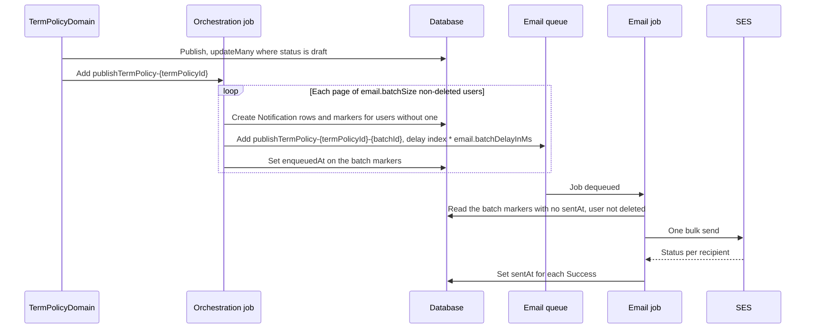
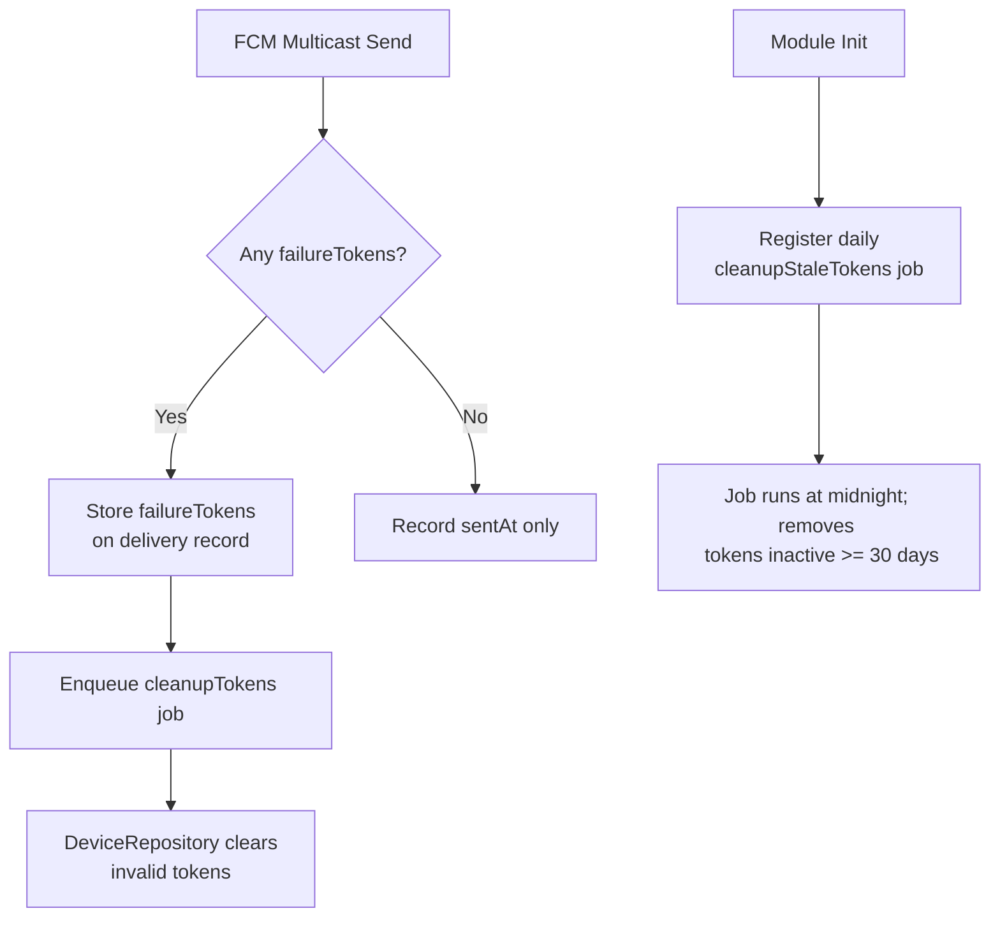
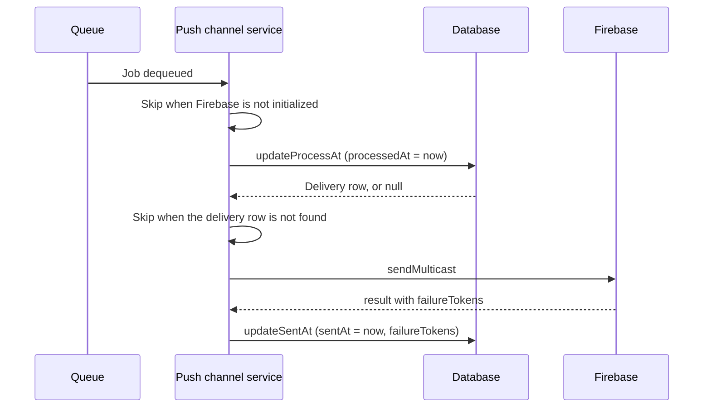

# Notification Documentation

Notification lives in `src/modules/notification`.

## Overview

Three BullMQ queues: orchestration, email, and push.

Key features:

- **Multi-Channel Delivery**: `email`, `push`, `inApp`, and `silent` channels
- **Queue-Based Processing**: Three separate BullMQ queues for orchestration, email, and push, each fed by its own `@Injectable()` queue class in `src/modules/notification/queues/`
- **User Preference Control**: Per type+channel opt-in/out settings for each user
- **AWS SES Email Templates**: Handlebars `.hbs` templates synced to SES, see [Email Documentation][ref-doc-email]
- **Firebase FCM Push**: Multicast delivery with batch chunking, rate limiting, and stale token cleanup
- **Delivery Tracking**:
    - `silent` and `inApp` deliveries are pre-marked at creation time.
    - `push` deliveries record `processedAt`, `sentAt`, and `failureTokens` as the processor runs.
    - `email` deliveries carry no timestamps at all.

## Related Documents

- [Authentication][ref-doc-authentication]: Session management and push token linking
- [Email][ref-doc-email]: SES templates, sync command, and send mapping
- [Third-Party Integration][ref-doc-third-party]: Firebase and AWS SES credentials and the unconfigured state
- [Queue][ref-doc-queue]: Background job processing
- [Configuration][ref-doc-configuration]: App configuration
- [Environment][ref-doc-environment]: Environment variables

## Table of Contents

- [Overview](#overview)
- [Related Documents](#related-documents)
- [Notification Types and Priorities](#notification-types-and-priorities)
- [Notification Channels](#notification-channels)
- [Queue Architecture](#queue-architecture)
    - [Orchestration Queue](#orchestration-queue)
    - [Email Queue](#email-queue)
    - [Push Queue](#push-queue)
    - [Payload Encryption](#payload-encryption)
    - [Job Payloads](#job-payloads)
    - [Term-Policy Publication Email](#term-policy-publication-email)
- [Push Notifications](#push-notifications)
    - [Push Token Management](#push-token-management)
    - [Token Cleanup Strategy](#token-cleanup-strategy)
    - [FCM Rate Limiting](#fcm-rate-limiting)
- [Email Notifications](#email-notifications)
- [Delivery Tracking](#delivery-tracking)
- [User Notification Settings](#user-notification-settings)
- [Shared HTTP Endpoints](#shared-http-endpoints)

## Notification Types and Priorities

Defined in `EnumNotificationType`:

| Type | Description |
| --- | --- |
| `userActivity` | General activity events (welcome, email verified, etc.) |
| `securityAlert` | Security-sensitive events (new device login, password change, 2FA reset) |
| `marketing` | Promotional and marketing messages |
| `transactional` | System-driven transactional events (e.g., term policy published) |

Defined in `EnumNotificationPriority`:

| Priority   | Description                                 |
| ---------- | ------------------------------------------- |
| `low`      | Low-priority, non-urgent notifications      |
| `normal`   | Standard informational notifications        |
| `high`     | Important events requiring prompt attention |
| `critical` | Security or time-sensitive events           |

## Notification Channels

Each notification record carries one or more `NotificationDelivery` rows, one per channel. Available channels:

| Channel | Delivery | `processedAt` / `sentAt` |
| --- | --- | --- |
| `email` | Via AWS SES (queued) | Never set. The email channel domains send through SES and do not touch the delivery record |
| `push` | Via Firebase FCM (queued) | Set by the push channel domains: `processedAt` before the send, `sentAt` after it |
| `inApp` | In-application UI | Pre-filled at notification creation time |
| `silent` | No external delivery; record-only | Pre-filled at notification creation time |

A notification can target multiple channels simultaneously. `NotificationKindContract` (`src/modules/notification/contracts/notification.kind.contract.ts`) declares which channels an event carries, with one entry per `EnumNotificationKind`, holding:

- the type
- the priority
- the i18n title and body keys
- two channel lists: `pendingChannels` and `deliveredChannels`

`NotificationRepository` reads that entry and creates the delivery rows from it.

> **`inApp` and `silent` are considered immediately "delivered"**:
>
> - They sit in `deliveredChannels`, so their `processedAt` and `sentAt` are both stamped at creation time in the repository.
> - No separate queue job is needed for them.
> - `email` and `push` sit in `pendingChannels` and go through the async queue.

## Queue Architecture

The notification module uses **three dedicated BullMQ queues**, each with its own processor:

```
NotificationQueue       → EnumQueue.notification       → NotificationProcessor
NotificationEmailQueue  → EnumQueue.notificationEmail  → NotificationEmailProcessor
NotificationPushQueue   → EnumQueue.notificationPush   → NotificationPushProcessor
```

### Orchestration Queue

**Queue:** `EnumQueue.notification` | **Processor:** `NotificationProcessor` | **Service:** `NotificationProcessorService`

Handles the main event orchestration:

1. `NotificationProcessor` dispatches a consumed job by name to `NotificationProcessorService`.
2. That service unwraps the job payload and hands it to the domain that owns the event.

| Domain                         | Events                                  |
| ------------------------------ | --------------------------------------- |
| `NotificationAccountDomain`    | welcome, verification                   |
| `NotificationSecurityDomain`   | passwords, two-factor, new device login |
| `NotificationTermPolicyDomain` | policy publication and acceptance       |
| `NotificationWorkspaceDomain`  | invites and join requests               |

That domain then:

1. Fetches the target user, and for a push-capable event the user's device tokens alongside it.
    - A user that does not resolve as active ends the job with a skip message rather than an error, so the job is not retried.
2. Mints the `notificationId` up front with `DatabaseUtil.createId()`.
3. Creates the `Notification` record (with its delivery rows) **and** dispatches the `notificationEmail` / `notificationPush` jobs in one `Promise.allSettled` batch, all carrying that pre-minted id.

Step 3 runs both sides in one batch:

- The id exists before either side runs, so a queued delivery job references a record the same batch is writing.
- `allSettled` means a failed dispatch does not undo the notification record.
- `allSettled` also means one channel failing does not stop the other.
- A push job is only added when the user has at least one device token.

Jobs reach this queue through `NotificationQueue`, which deduplicates on the process name plus whatever identifies that event:

| Event | Identifier |
| --- | --- |
| account and security events | the target user |
| a join request and its acceptance or rejection | the workspace and the target user |
| an invite | the invite `reference` |
| an acceptance | the target user and the term policy id |
| a publication | the term policy id, as the BullMQ `jobId` |

- The TTL is `notification.dedupTtlInMs` (1 second), so two different events for the same user never collapse into one.
- A publication has no deduplication TTL: its job id `publishTermPolicy-{termPolicyId}` is unique per term policy.

**Supported processes (`EnumNotificationProcess`):**

| Job Name | Description |
| --- | --- |
| `welcomeByAdmin` | Admin-created user welcome |
| `welcome` | Self-registered user welcome + verification email |
| `welcomeSocial` | Welcome for a user created by a social login, enqueued once that login has completed |
| `temporaryPasswordByAdmin` | Temporary password assigned by admin |
| `changePassword` | User changed their password |
| `verifiedEmail` | Email address verified |
| `verifiedMobileNumber` | Mobile number verified |
| `verificationEmail` | Standalone email verification |
| `forgotPassword` | Forgot password request |
| `resetPassword` | Password was reset |
| `newDeviceLogin` | Login detected from a new/unknown device |
| `resetTwoFactorByAdmin` | Admin reset user 2FA |
| `publishTermPolicy` | New term policy published. A bulk process: see [Term-Policy Publication Email](#term-policy-publication-email) |
| `userAcceptTermPolicy` | User accepted a term policy |
| `workspaceInvite` | Workspace invite sent to a registered user |
| `workspaceInviteUnregistered` | Workspace invite sent to an address with no account |
| `workspaceJoinRequest` | Workspace join request submitted |
| `workspaceJoinAccepted` | Workspace join request accepted |
| `workspaceJoinRejected` | Workspace join request rejected |

### Email Queue

**Queue:** `EnumQueue.notificationEmail` | **Processor:** `NotificationEmailProcessor` | **Service:** `NotificationEmailProcessorService`

Rate-limited to match the AWS SES sending quota (`AwsSESRateLimitPerDuration` per `AwsSESRateLimitDurationInMs`).

`NotificationEmailProcessorService` routes each job to the email channel domain that owns it:

- `NotificationEmailAccountDomain`
- `NotificationEmailSecurityDomain`
- `NotificationEmailTermPolicyDomain`
- `NotificationEmailWorkspaceDomain`

That domain:

- calls `AwsSESService.send()` or `AwsSESService.sendBulk()` using the named SES template for that event
- merges `defaultTemplateData` (`homeName`, `supportEmail`, `homeUrl`) automatically

Jobs reach this queue through `NotificationEmailQueue`:

- Every email job except the publication batch uses BullMQ's `deduplication` option, on the same identifiers the orchestration queue uses.
- A publication batch job uses a fixed BullMQ `jobId` (term policy id plus batch id) and has no deduplication TTL.

| Identifier | Processes |
| --- | --- |
| target user | account and security events |
| invite `reference` | the two invite emails |
| workspace and target user | a join request, a join acceptance, a join rejection |
| term policy id and batch id | a publication batch, as the fixed `jobId` |

Most templates use `notification.dedupTtlInMs` (1 second). A template carrying a time-limited link uses the config value matching that link's expiry or resend window instead:

| Process                | Config                      |
| ---------------------- | --------------------------- |
| `verificationEmail`    | `verification.expiredInMs`  |
| `verifiedMobileNumber` | `verification.resendInMs`   |
| `forgotPassword`       | `forgotPassword.resendInMs` |

### Push Queue

**Queue:** `EnumQueue.notificationPush` | **Processor:** `NotificationPushProcessor` | **Service:** `NotificationPushProcessorService`

Rate-limited to `FirebaseMaxRateLimitPerDuration` (500,000) per `FirebaseRateLimitDurationInMs` (60 seconds), which stays under the FCM 600k/min ceiling.

`NotificationPushProcessorService` routes each job to the push channel domain that owns it:

- `NotificationPushSecurityDomain` for the password, two-factor and new-device messages
- `NotificationPushWorkspaceDomain` for the invite and join-request messages
- `NotificationPushMaintenanceDomain` for the two token-cleanup jobs

**Supported push processes (`EnumNotificationPushProcess`):**

| Job Name                   | Description                                |
| -------------------------- | ------------------------------------------ |
| `newDeviceLogin`           | Push alert for new device login            |
| `resetPassword`            | Push alert when password is reset          |
| `resetTwoFactorByAdmin`    | Push alert when admin resets 2FA           |
| `temporaryPasswordByAdmin` | Push alert for temporary password          |
| `workspaceInvite`          | Push alert for a workspace invite          |
| `workspaceJoinRequest`     | Push alert for a workspace join request    |
| `workspaceJoinAccepted`    | Push alert when a join request is accepted |
| `workspaceJoinRejected`    | Push alert when a join request is rejected |
| `cleanupTokens`            | Remove reported invalid FCM tokens         |
| `cleanupStaleTokens`       | Clean up tokens inactive for ≥ 30 days     |

On `onModuleInit`, `NotificationPushProcessorService` calls `NotificationPushQueue.sendCleanupStaleTokens()`:

- It registers a recurring `cleanupStaleTokens` job via BullMQ `upsertJobScheduler`.
- The cron is `0 0 * * *` from `notification.push.cleanupStaleTokensCron`, in the app's configured timezone.
- The scheduler carries no `immediately` option, so the first sweep waits for the first cron tick.

### Payload Encryption

A job payload sits in Redis until a worker consumes it, so the queue classes seal every secret-bearing field before `add()`, and only the email channel domain that sends the message opens it.

Each field is sealed with `HelperEncryptionService.aes256Encrypt` under:

- `app.encryptionSecretKey` (`APP_ENCRYPTION_SECRET_KEY`)
- the purpose `NotificationPayloadEncryptionPurpose` (`notification.payload`)
- the recipient as authenticated data, so a sealed value copied into another recipient's job fails to open

| Sealed field | Plain input | Processes | Authenticated data |
| --- | --- | --- | --- |
| `encryptedPassword` | `password` | `welcomeByAdmin`, `temporaryPasswordByAdmin` | recipient `userId` |
| `encryptedLink` | `link` | `welcome`, `verificationEmail`, `forgotPassword` | recipient `userId` |
| `encryptedInviteAcceptLink` | `inviteAcceptLink` | `workspaceInvite` | invited `userId` |
| `encryptedInviteAcceptLink` | `inviteAcceptLink` | `workspaceInviteUnregistered` (email queue only) | invite `reference` |
| `encryptedJoinRequestReviewLink` | `joinRequestReviewLink` | `workspaceJoinRequest` | reviewer `userId` |

Who seals:

- `NotificationQueue` seals the fields of the orchestration jobs. The orchestration domains pass the sealed value through to the email job unopened.
- `NotificationEmailQueue` seals the invite link of `workspaceInviteUnregistered`, which skips the orchestration queue.
- Push jobs carry no secret. `NotificationPushQueue` builds each push payload from an explicit field list (`INotification*PushPayload`) that leaves out passwords and links.

A payload that fails to open (a rotated key, a tampered value, the wrong recipient) raises `HelperDecryptFailedException` (`52200`):

- Inside `handle`, `NotificationEmailProcessor` maps that to a BullMQ `UnrecoverableError`, so the job fails at once without retries.
- `QueueProcessorBase.onFailed` counts an `UnrecoverableError` as the last attempt and reports it to Sentry.
- Every other email failure is rethrown as it is and retried.

### Job Payloads

Orchestration, email, and push jobs carry an envelope, and `data` holds the extra fields of the process.

- `data` is `null` when the process carries none.
- Three jobs have a different shape: the bulk `publishTermPolicy` jobs, `cleanupTokens`, and `cleanupStaleTokens`.

| Queue | Payload |
| --- | --- |
| Orchestration | `{ userId, proceedBy, data }` |
| Orchestration, `publishTermPolicy` (bulk) | `{ proceedBy, data: { termPolicyId, type, version } }`, with no `userId`: `NotificationTermPolicyDomain.processPublishTermPolicy` pages the recipients |
| Email | `{ send: { userId, notificationId, email, username, cc, bcc }, data }` |
| Email, `publishTermPolicy` (bulk) | `{ data: { termPolicyId, type, version }, batchId, proceedBy }`, one job per batch of up to `email.batchSize` users, with no `send` list: the job reads its recipients by `batchId` |
| Email, recipient without an account | `{ send: { email, cc, bcc }, data }` |
| Push | `{ send: { userId, notificationId, notificationTokens, username }, data }` |
| Push, `cleanupTokens` | `{ userId, failureTokens }` |
| Push, `cleanupStaleTokens` | `{}` |

- `proceedBy` is the id of the user whose action raised the event.
- The orchestration domains store `proceedBy` as `createdBy` on the `Notification` row.
- Its value by process:
    - the admin for the `ByAdmin` processes
    - the publisher for `publishTermPolicy`
    - the inviter for `workspaceInvite`
    - the requester for `workspaceJoinRequest`
    - the reviewer for `workspaceJoinAccepted` and `workspaceJoinRejected`
    - the recipient for every self-triggered event, where it equals `userId`
- `cc` and `bcc` are always arrays, empty when there is no copy recipient.
    - The queue class puts them on the job.
    - The email channel domain passes each non-empty list to `AwsSESService.send()`.
- A bulk email job carries no recipient list.
    - `NotificationEmailProcessorService` passes `data`, `batchId`, and `proceedBy` to the email channel domain.
    - The email channel domain reads the batch's recipients from the database and calls `AwsSESService.sendBulk()` once. See [Term-Policy Publication Email](#term-policy-publication-email).
- `cleanupStaleTokens` is the job the `upsertJobScheduler` call registers. Its data is an empty object, and the 30-day threshold is read from config when the job runs.
- A sealed field sits inside `data`, never in `send` or at the top of the envelope.
    - The `encrypted*` field replaces its plain input (`encryptedPassword` for `password`, and so on, as in [Payload Encryption](#payload-encryption)).
    - Redis therefore holds only the ciphertext.

### Term-Policy Publication Email

Publishing a term policy adds one `publishTermPolicy` orchestration job. That job fans out to one email job per batch of users.

**Recipients:**

- Every non-deleted user is a candidate, whatever the user's status.
- Each candidate gets at most one marker, and so one `Notification` row, per term policy.
- The user's notification setting does not apply.
- `TermPolicyRecipient` (collection `TermPolicyRecipients`), owned by `NotificationRepository`, holds one marker per user and term policy, unique on `termPolicyId` and `userId`.
- A marker records the `notificationId`, the `batchId`, and the `enqueuedAt` and `sentAt` timestamps.


```mermaid
sequenceDiagram
    participant TP as TermPolicyDomain
    participant OQ as Orchestration job
    participant DB as Database
    participant EQ as Email queue
    participant EM as Email job
    participant SES

    TP->>DB: Publish, updateMany where status is draft
    TP->>OQ: Add publishTermPolicy-{termPolicyId}
    loop Each page of email.batchSize non-deleted users
        OQ->>DB: Create Notification rows and markers for users without one
        OQ->>EQ: Add publishTermPolicy-{termPolicyId}-{batchId}, delay index * email.batchDelayInMs
        OQ->>DB: Set enqueuedAt on the batch markers
    end
    EQ->>EM: Job dequeued
    EM->>DB: Read the batch markers with no sentAt, user not deleted
    EM->>SES: One bulk send
    SES-->>EM: Status per recipient
    EM->>DB: Set sentAt for each Success
```

**Publish:**

1. `TermPolicyDomain` checks the policy status. A policy already `published` answers `400` (`statusInvalid`) and adds no job.
2. The publish transaction runs an `updateMany` that matches the policy only while its status is `draft`.
3. After the transaction commits, `TermPolicyDomain` adds the orchestration job.
    - The job id is `publishTermPolicy-{termPolicyId}`.
    - The job has no deduplication TTL.

What the publish guarantees:

- The `updateMany` separates two concurrent publishes of one draft: one commits.
- The losing publish adds no job and answers one of two ways:
    - `400` (`statusInvalid`) when its `updateMany` runs after the winner commits.
    - `500` (`AppUnknownException`) when the two transactions overlap. MongoDB raises a write conflict (`P2034`) and nothing retries it.
- The job is added after the commit.
- When the add fails, the request answers `500`, the policy stays `published`, and no email goes out.
- A later publish of that policy is refused by the status pre-check, so nothing adds the job again.
- A publish therefore produces one orchestration job, and a failed add leaves every user without an email.
- The marker unique on `termPolicyId` and `userId` stops a duplicate `Notification` row and a second batch for one user.
- A repeat send to one user is possible at the SES boundary (see the email job below).

**Orchestration job:**

1. Reads the ids of non-deleted users (`UserNotDeletedWhere`: `deletedAt` null, any status) in pages of `email.batchSize`, ordered by `id` with an `id` cursor.
2. Reads the markers that already exist for the page.
3. Creates, for the users without a marker and in one transaction, a `Notification` row each (kind `publishTermPolicy`, email delivery pending) and a marker, all under one new `batchId`.
4. Adds one email job per batch.
    - The job id is `publishTermPolicy-{termPolicyId}-{batchId}`.
    - The payload is `{ data, batchId, proceedBy }`.
    - The delay is `index * email.batchDelayInMs`, where `index` counts the email jobs of the run across pages.
5. Sets `enqueuedAt` on the markers of the batches it added.

Attempts:

- `NotificationQueueFactory` gives the job `queue.job.attempts` (3) attempts in total.
- The retry backoff is exponential from `queue.job.notificationBackoffDelayInMs` (3 seconds).
- Each attempt starts again from the first page, with `index` at 0.

On a new attempt:

- A user who already has a marker gets no second marker and no second `Notification` row.
- A batch whose markers still have no `enqueuedAt` (the run stopped before step 5) gets its email job added again.
    - The batch keeps its stored `batchId`, so the job id is the same as before.
    - BullMQ ignores an add whose job id still exists in the queue, so the original job and its original delay stand.
    - When the original job is gone, the new job takes the delay `index * email.batchDelayInMs`.
    - `index` counts only the email jobs this attempt adds or re-adds. A batch already marked `enqueuedAt` adds none.

When the job exhausts its attempts:

- Users after the failing page get no marker and no email job.
- Pages before the failing one keep their markers and email jobs.
- Nothing retries the job automatically.
- The failed job stays in the queue for `queue.job.removeOnFailAgeInSeconds` (14 days).
- No route adds the job again, because the publish is its only producer and a `published` policy refuses a second publish.
- `QueueProcessorBase.onFailed` reports the final failure to Sentry.

**Email job:**

1. Reads the batch markers with no `sentAt` whose user is not deleted.
    - With none left, the job completes.
2. Makes one `AwsSESService.sendBulk()` call with the `publishTermPolicy` template, passing `type` and `version` as default template data.
3. Completes at once when SES returns an empty or absent `Status` list, before any count check.
    - SES unconfigured is this case: `sendBulk()` returns an empty `Status` list and no marker gets `sentAt`.
4. Sets `sentAt` on the markers whose SES status is `Success`.
5. Throws a fatal `QueueException` when any recipient failed.
    - The count-mismatch throw applies only to a non-empty `Status` list whose length differs from the recipient list.

On a failed or retried job:

- A retry reads only the markers with no `sentAt`, so a recipient whose marker is set is not read again.
- `sendBulk()` and the `sentAt` update are separate steps.
    - When the update fails or the worker stalls between them, the retry reads those recipients again and SES sends to them again.
- `queue.job.attempts` (3) is the number of attempts in total, with an exponential backoff from `queue.job.emailBackoffDelayInMs` (10 seconds).
- A fatal `QueueException` is retried like any other failure.
- `isFatal` decides only Sentry reporting.
- `QueueProcessorBase.onFailed` reports a fatal exception after the last attempt.
- A non-fatal `QueueException` is never reported.
- An `UnrecoverableError` skips the retries and counts as the last attempt (see [Payload Encryption](#payload-encryption)).

**Configuration:**

- `email.batchSize` is 50.
    - It is the SES cap of destinations per bulk call.
    - It is the page size of the orchestration job.
    - It is the number of recipients per email job.
- `email.batchDelayInMs` (1 second) is the step of the per-job BullMQ `delay`.

## Push Notifications

### Push Token Management

Push tokens (FCM device tokens) are part of the **Device module** (`src/modules/device`), not stored in the notification module directly.

- The orchestration-side domains read them through `DeviceDomain.getOwnershipsWithNotificationToken()`, which calls `DeviceOwnershipRepository.findTokensByUserId()`.
- They place the tokens on the push job payload as `notificationTokens`.
- The push channel domain sends to the tokens it receives on the job.
- The lookup returns only device ownerships that are not revoked and whose device holds a token, so a revoked ownership never receives a push.

For push token registration, revocation, and session-linking details, see the [Device documentation][ref-doc-device].

### Token Cleanup Strategy

After each multicast send, `FirebaseService.sendMulticast()` returns `failureTokens`: the tokens that FCM identified as invalid (codes in `FirebaseInvalidTokenCodes`). These are:

1. Stored on the delivery record via `NotificationRepository.updateSentAt()` (`failureTokens` field).
2. Queued as a `cleanupTokens` job in `EnumQueue.notificationPush` through `NotificationPushQueue.sendCleanupTokens()`.
    - The job is deduplicated per user for `notification.push.cleanupDedupTtlInMs` (1 hour).
    - `NotificationPushMaintenanceDomain.processCleanupTokens()` handles it.
    - It calls `DeviceDomain.cleanupNotificationTokens()`, which resolves the user's devices holding those tokens through `DeviceOwnershipRepository.findDeviceIdsByUserAndTokens()`.
    - It clears `notificationToken` and `notificationProvider` on them through `DeviceRepository.clearTokens()`.

Stale tokens are those whose device has no `lastActiveAt` activity within `notification.push.staleTokenThresholdInMs` (30 days). The recurring `cleanupStaleTokens` job registered at startup prunes them daily:

1. `NotificationPushMaintenanceDomain` reads that config value.
2. It passes the value to `DeviceDomain.cleanupStaleNotificationTokens(thresholdInMs)`.
3. That calls `DeviceRepository.clearStaleTokens(thresholdInMs)`, which clears `notificationToken` and `notificationProvider` on every device past the threshold.


```mermaid
graph TD
    A[FCM Multicast Send] --> B{Any failureTokens?}
    B -->|Yes| C[Store failureTokens <br/> on delivery record]
    C --> D[Enqueue cleanupTokens job]
    D --> E[DeviceRepository clears <br/> invalid tokens]
    B -->|No| F[Record sentAt only]

    G[Module Init] --> H[Register daily <br/> cleanupStaleTokens job]
    H --> I[Job runs at midnight; removes <br/> tokens inactive >= 30 days]
```

### FCM Rate Limiting

The push processor is configured with a BullMQ rate limiter:

```typescript
@QueueProcessor(EnumQueue.notificationPush, {
    limiter: {
        max: FirebaseMaxRateLimitPerDuration,   // 500,000
        duration: FirebaseRateLimitDurationInMs, // 60,000 ms
    },
})
```

`FirebaseService.sendMulticast()` also enforces chunking:

- A per-call chunk size of at most `FirebaseMaxSendPushBatchSize` (500) tokens per FCM `sendEachForMulticast` call.
- Chunks are processed via `Promise.allSettled`.
- A chunk size outside 1 to 500 raises `FirebaseChunkSizeInvalidException` (500, `52300`).

With Firebase unconfigured:

- `FirebaseService` stays uninitialized.
- The push channel domains skip every send (see [Delivery Tracking](#delivery-tracking)).

For Firebase configuration, see [Third-Party Integration: Firebase][ref-doc-third-party].

## Email Notifications

Handlebars templates, SES sync (`templateEmailNotification`), and how channel domains call `AwsSESService`: [Email Documentation][ref-doc-email].

The email queue, rate limits, dedup, and sealed payload fields stay in this document under [Email Queue](#email-queue) and [Payload Encryption](#payload-encryption).

## Delivery Tracking

Each `Notification` record has related `NotificationDelivery` rows in `NotificationDeliveries` (one per channel, via `notificationId`). Delivery fields:

| Field | Description |
| --- | --- |
| `processedAt` | When the processor started handling the delivery. Written for `push`, pre-filled for `silent` / `inApp`, never written for `email` |
| `sentAt` | When the message was handed to FCM. Same coverage as `processedAt` |
| `failureTokens` | FCM tokens that were invalid (push channel only) |

### Immediate channels (`silent`, `inApp`)

- `silent` and `inApp` deliveries have `processedAt` and `sentAt` both pre-filled with the current timestamp **at notification creation time** inside `NotificationRepository`.
- No queue job is dispatched for them.

### Async channels (`email`, `push`)

`email` and `push` deliveries are created with no timestamps and go through the queue.

**Only the push channel writes them back.**

- The email channel domains send through SES and never read or update the delivery record.
- An `email` delivery row therefore keeps `processedAt` and `sentAt` null for its whole life.
- A null `sentAt` on an `email` row says nothing about delivery.

The push lifecycle:


```mermaid
sequenceDiagram
    participant Q as Queue
    participant P as Push channel service
    participant DB as Database
    participant FCM as Firebase

    Q->>P: Job dequeued
    P->>P: Skip when Firebase is not initialized
    P->>DB: updateProcessAt (processedAt = now)
    DB-->>P: Delivery row, or null
    P->>P: Skip when the delivery row is not found
    P->>FCM: sendMulticast
    FCM-->>P: result with failureTokens
    P->>DB: updateSentAt (sentAt = now, failureTokens)
```

Both skips return a message rather than throwing, so a push job on a deployment with Firebase disabled completes instead of being retried.

The email lifecycle is only: job dequeued, sealed fields opened, `AwsSESService.send()` or `sendBulk()`, done.

- With SES unconfigured, both calls log a warning and return an empty output, so the job completes and no email leaves.
- A send failure is logged and rethrown, so the job retries under the queue's own retry policy.
- A field that fails to open ends the job without retries (see [Payload Encryption](#payload-encryption)).

## User Notification Settings

- Users control which notification channels are active per type.
- `NotificationUserSetting` stores the settings, one row per `userId + type + channel`.

Allowed type+channel combinations are defined in `NotificationSettingContract` (`src/modules/notification/contracts/notification.setting.contract.ts`):

| Type           | Allowed Channels         |
| -------------- | ------------------------ |
| `userActivity` | `email`, `inApp`, `push` |
| `marketing`    | `email`, `push`          |

- `NotificationDomain.updateUserSetting()` validates the requested combination before writing.
- Invalid combinations throw `NotificationInvalidTypeException` or `NotificationInvalidChannelException`.

The request DTO (`NotificationUserSettingRequestDto`) accepts:

- `type`: `userActivity` | `marketing`
- `channel`: `email` | `push` | `inApp`
- `isActive`: `boolean`

## Shared HTTP Endpoints

Under router prefix `/shared` and controller path `/notification` (plus global `/api` and version `v1`):

| Method | Path | Description |
| --- | --- | --- |
| `GET` | `/shared/notification/list` | List the caller's notifications |
| `GET` | `/shared/notification/setting/list` | List the caller's notification settings |
| `PATCH` | `/shared/notification/update/:notificationId/read` | Mark one notification read |
| `POST` | `/shared/notification/update/read` | Mark all notifications read |
| `PUT` | `/shared/notification/setting/update` | Update a type+channel setting |

<!-- REFERENCES -->

[ref-firebase]: https://firebase.google.com/docs/cloud-messaging
[ref-bullmq]: https://bullmq.io
[ref-doc-authentication]: authentication.md
[ref-doc-device]: device.md
[ref-doc-third-party]: third-party-integration.md
[ref-doc-email]: email.md
[ref-doc-queue]: queue.md
[ref-doc-configuration]: configuration.md
[ref-doc-environment]: environment.md
