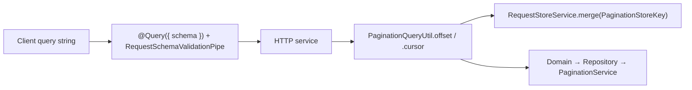

# Pagination Module Documentation

Pagination lives in `src/common/pagination`.

## Overview

Offset and cursor list helpers, plus filter and order-by parsing:
- **Offset-based pagination**: page number and limit (`/admin/**`)
- **Cursor-based pagination**: cursor tokens (every other scope)
- **Filtering**: enum, equality, date range helpers on `PaginationQueryUtil`
- **Field ordering**: validation and transformation of sort parameters
- **Error handling**: the same error body as the rest of the app

Ordering support is split across three levels:
- **HTTP query level**: `orderBy` uses `field:direction` format in a single query parameter (e.g., `name:asc`, `createdAt:desc`). Multiple entries can be sent as repeated params.
- **Service level**: `orderBy` is always an array of order objects (`IPaginationOrderBy[]`), which is the shape Prisma receives.
- **Response metadata level**: `metadata.orderBy` is a string array in the same `field:direction` format as the query (e.g., `["createdAt:desc"]`), symmetric with `metadata.availableOrderBy`. `ResponsePaginationInterceptor` performs the conversion; an empty order renders `[]`.

List query parsing is zod on `@Query({ schema })` plus `PaginationQueryUtil` in the HTTP service.

## Related Documents

- [Response Documentation][ref-doc-response] - List envelopes
- [Request Validation Documentation][ref-doc-request-validation] - Query schemas for page/limit and cursor
- [Database Documentation][ref-doc-database] - Prisma queries behind list repositories
- [Doc Documentation][ref-doc-doc] - OpenAPI for paginated routes

## Table of Contents


- [Overview](#overview)
- [Related Documents](#related-documents)
- [Table of Contents](#table-of-contents)
- [Module](#module)
    - [PaginationService](#paginationservice)
        - [Shaping the row: include or select](#shaping-the-row-include-or-select)
        - [offset<TReturn>()](#offsettreturn)
        - [offsetPage<TReturn>()](#offsetpagetreturn)
        - [cursor<TReturn>()](#cursortreturn)
    - [Query parse (zod + PaginationQueryUtil)](#query-parse-zod--paginationqueryutil)
        - [Kit base schemas](#kit-base-schemas)
        - [PaginationQueryUtil](#paginationqueryutil)
        - [Filter helpers](#filter-helpers)
        - [Allow-lists](#allow-lists)
- [Pagination Strategies](#pagination-strategies)
    - [Choosing a Strategy](#choosing-a-strategy)
    - [Offset-Based](#offset-based)
    - [Cursor-Based](#cursor-based)
- [Filtering System](#filtering-system)
    - [Enum Filters](#enum-filters)
    - [Equality Filters](#equality-filters)
    - [Date Filters](#date-filters)
- [Ordering](#ordering)
- [Usage Examples](#usage-examples)
    - [Basic Offset Pagination](#basic-offset-pagination)
    - [Cursor Pagination](#cursor-pagination)
    - [With Filters](#with-filters)
    - [Complete Example](#complete-example)
- [Integration with Doc Module](#integration-with-doc-module)
- [Implementation Notes](#implementation-notes)
    - [Performance Considerations](#performance-considerations)

## Module

### PaginationService

Core service that pages at the database. Repositories call it; HTTP services and controllers do not.

**Two tiers of parameter types.** The controller-facing types carry only what a client may influence; the repository-facing types add what only server code may set:

| Tier | Type | Fields |
|---|---|---|
| HTTP-service output of `PaginationQueryUtil` | `IPaginationQueryOffsetParams<TArgsWhere>` | `limit`, `orderBy?`, `where?`, `skip` |
| HTTP-service output of `PaginationQueryUtil` | `IPaginationQueryCursorParams<TArgsWhere>` | `limit`, `orderBy?`, `where?`, `cursor?`, `cursorField?` |
| Service args, produced by the repository | `IPaginationOffsetArgs<TArgsWhere>` | the offset params above, plus `include?` or `select?` |
| Service args, produced by the repository | `IPaginationCursorArgs<TArgsWhere>` | the cursor params above, plus `include?` or `select?`, and `includeCount?` |

Every one of these types takes a single generic, `TArgsWhere`. `include`, `select` and `includeCount` exist only on the repository tier, so the util-output types cannot express them and a client cannot reach them.

#### Shaping the row: `include` or `select`

Both repository-tier arg types intersect `IPaginationShape`, a union of `{ include?: unknown; select?: never }` and `{ select?: unknown; include?: never }`. One call therefore carries `include` or `select`, and a call carrying both fails `tsc`.

`select` reaches `findMany` and nothing else. The count query is issued as `count({ where })`, so a narrowed projection never changes the total a page reports.

A read whose row is narrower than the model declares that projection once, as a `satisfies Prisma.<Model>Select` constant in the module's `constants/` folder, and pins the row type to it:

```typescript
// src/modules/session/constants/session.constant.ts
export const SessionListSelect = {
    id: true,
    userId: true,
    /* the remaining columns follow; jti is not among them */
} satisfies Prisma.SessionSelect;

// src/modules/session/interfaces/session.interface.ts
export type ISessionListRow = Prisma.SessionGetPayload<{
    select: typeof SessionListSelect;
}>;
```

The `GetPayload` form ties the row type to the constant, so a column added to or removed from the projection moves the type with it. A nested relation takes its own select constant in the same place (`user: { select: UserRefSelect }`), and arrives narrowed the same way.

`User.password`, `Session.jti`, `ApiKey.hash`, `PasswordHistory.password` and `WorkspaceInvite.token` sit outside the `*ListSelect` constant of their module, so a paginated read of those models leaves the credential in the database.

**Methods:**

#### offset\<TReturn\>()

Executes offset-based pagination.

```typescript
async offset<TReturn, TArgsWhere = unknown>(
    repository: IPaginationRepository,
    args: IPaginationOffsetArgs<TArgsWhere>
): Promise<IPaginationOffsetReturn<TReturn>>
```

**Type Parameters:**
- `TReturn` — shape of each item in the returned `data` array
- `TArgsWhere` — Prisma `where` type for the model (e.g. `Prisma.UserWhereInput`). Defaults to `unknown`

**Parameters:**
- `repository`: Repository instance implementing IPaginationRepository
- `args`: the `IPaginationQueryOffsetParams<TArgsWhere>` the HTTP service derived, widened by the repository with `include` or `select`

**`args.orderBy` Support:**
- Always an array: `[{ createdAt: 'desc' }]`, `[{ createdAt: 'desc' }, { name: 'asc' }]`

**Default Values:**
- `orderBy`: `[{ createdAt: 'desc' }]` - Sort by creation date descending
- If omitted, defaults to `PaginationDefaultOrderBy`

**Returns:**
```typescript
{
    type: 'offset',
    count: number,           // Total items
    perPage: number,         // Items per page
    page: number,           // Current page
    totalPage: number,      // Total pages
    hasNext: boolean,       // Has next page
    hasPrevious: boolean,   // Has previous page
    nextPage?: number,      // Next page number (if hasNext)
    previousPage?: number,  // Previous page number (if hasPrevious)
    data: TReturn[]        // Paginated items
}
```

#### offsetPage\<TReturn\>()

Builds that same offset return from items and a total already in hand.

```typescript
offsetPage<TReturn>(
    items: TReturn[],
    count: number,
    params: { skip: number; limit: number }
): IPaginationOffsetReturn<TReturn>
```

`offset()` calls it once its count and `findMany` queries resolve. It is also public: the analytic anomaly and fraud detail lists compute their rows, slice `[skip, skip + limit)`, and pass the slice with the full length.

The page arithmetic lives here, and every offset response carries the result of it:

- `page` is 1-based: `Math.floor(skip / limit) + 1`, so the first page reports `1`
- `totalPage` is `Math.ceil(count / limit)`, so a result with no rows reports `0`
- `hasNext` is `page < totalPage` and `hasPrevious` is `page > 1`; `nextPage` and `previousPage` are present only when the matching flag is `true`

#### cursor\<TReturn\>()

Executes cursor-based pagination.

```typescript
async cursor<TReturn, TArgsWhere = unknown>(
    repository: IPaginationRepository,
    args: IPaginationCursorArgs<TArgsWhere>
): Promise<IPaginationCursorReturn<TReturn>>
```

**Type Parameters:**
- `TReturn` — shape of each item in the returned `data` array
- `TArgsWhere` — Prisma `where` type for the model (e.g. `Prisma.UserWhereInput`). Defaults to `unknown`

**Parameters:**
- `repository`: Repository instance
- `args`: the `IPaginationQueryCursorParams<TArgsWhere>` the HTTP service derived, widened by the repository with `include` or `select`, and with `includeCount`

**`args.orderBy` Support:**
- Always an array: `[{ createdAt: 'desc' }]`, `[{ createdAt: 'desc' }, { name: 'asc' }]`

**Default Values:**
- `orderBy`: `[{ createdAt: 'desc' }]` - Sort by creation date descending
- If omitted, defaults to `PaginationDefaultOrderBy`
- `cursorField`: `'id'` - Field used for cursor positioning

**Cursor Payload:**

The encoded cursor is URL-safe base64 over exactly two fields, and nothing else:

```typescript
{
    cursor: string,      // the cursor row's `cursorField` value
    fingerprint: string  // fingerprint of the query the cursor was issued for
}
```

- `fingerprint` is the first 16 hex characters (the leading 64 bits, `PaginationCursorFingerprintLength`) of a sha256 over the canonicalized `{ where, orderBy }`. Canonicalization sorts object keys at every depth and converts `Date` values to ISO strings, so two equivalent filters hash the same.
- The composed `where` is **not** carried on the wire. The cursor stays around 94 characters no matter how large or deeply nested the filter is, and the filter itself is never exposed to the client.

**Cursor Validation:**
- Each request recomputes the fingerprint from its own `where` and `orderBy`, then compares it to the `fingerprint` in the supplied cursor. A mismatch throws `PaginationInvalidCursorPaginationParamsException` (50203, 422).
- A cursor that is empty or not a string throws `PaginationInvalidCursorFormatException` (50205). One that decodes to an object missing `cursor` or `fingerprint` throws `PaginationInvalidCursorDataException` (50212), and one whose base64 or JSON cannot be parsed at all throws `PaginationFailedToDecodeCursorException` (50214).
- A cursor is bound to the filter, the search term, and the ordering it was issued for. Changing any of them invalidates it, and the client starts again from the first page.
- For multi-field ordering, the array order feeds the fingerprint, so the same sequence of `orderBy` entries produces a matching cursor and a different sequence does not.

**Cursor Field Tiebreaker:**
- Before it queries and before it fingerprints, `cursor()` appends `{ [cursorField]: <direction> }` to the resolved `orderBy`. The direction is copied from the last ordering term, so the tiebreaker never fights the primary sort.
- It is skipped when the client already sorts on `cursorField`.
- The tiebreaker is what makes the position stable. When the sort key is not unique (several rows sharing one `createdAt`), the cursor row has no deterministic place in the result set, and pages can repeat or skip records. `offset()` does not do this; it anchors on a row count, not on a row.
- Because the tiebreaker is part of the `orderBy` that gets fingerprinted, it is also part of what a cursor is bound to.

**Returns:**
```typescript
{
    type: 'cursor',
    cursor?: string,        // Encoded cursor for next page
    perPage: number,        // Items per page
    hasNext: boolean,       // Has next page
    count?: number,         // Total count (if includeCount: true)
    data: TReturn[]        // Paginated items
}
```

### Query parse (zod + PaginationQueryUtil)

List query parsing is not pipe-driven and is not on `PaginationService`.



1. Kit base schemas `PaginationOffsetQuerySchema` (`page` / `perPage`) and `PaginationCursorQuerySchema` (`cursor` / `perPage`) live under `src/common/pagination/dtos/`.
2. A module list DTO `.extend`s `search` / `orderBy` only when its allow-lists are non-empty, plus any filter fields. One schema const per `*.dto.ts` file.
3. The controller binds one `@Query({ schema })` and passes the whole DTO to the HTTP service.
4. The HTTP service calls `PaginationQueryUtil.offset` / `.cursor` (plus filter helpers) to produce `IPaginationQueryOffsetParams` / `IPaginationQueryCursorParams` and a `storePatch`. It merges the patch into `RequestStoreService` under `PaginationStoreKey` for response metadata.
5. Domain and repository keep receiving `IPaginationQuery*Params`. The repository widens them with `include` / `select` / `includeCount` and calls `PaginationService`.

`PaginationQueryUtil` is a pure util under `src/common/pagination/utils/`. It does not inject `RequestStoreService`. OpenAPI for list query params comes only from the zod schema on `@Query({ schema })`. `@ResponsePagination` does not emit `ApiQuery` for page, cursor, `perPage`, `search`, or `orderBy`.

#### Kit base schemas

```typescript
// src/common/pagination/dtos/pagination.offset-query.dto.ts
export const PaginationOffsetQuerySchema = z.strictObject({
    page: z.coerce.number().int().optional().meta({ … }),
    perPage: z.coerce.number().int().optional().meta({ … }),
});

// src/common/pagination/dtos/pagination.cursor-query.dto.ts
export const PaginationCursorQuerySchema = z.strictObject({
    cursor: z.string().optional().meta({ … }),
    perPage: z.coerce.number().int().optional().meta({ … }),
});
```

Module example (`src/modules/user/dtos/request/user.list.request.dto.ts`):

```typescript
export const UserListRequestSchema = PaginationOffsetQuerySchema.extend({
    search: z.string().optional().meta({
        description: `Search query, available fields: ${UserDefaultAvailableSearch.join(', ')}. …`,
        example: '',
    }),
    orderBy: z.union([z.string(), z.array(z.string())]).optional().meta({
        description: `Order by field in \`field:direction\` format. Available fields: ${UserDefaultAvailableOrderBy.join(', ')}. …`,
        example: `${UserDefaultAvailableOrderBy[0]}:desc`,
    }),
    status: z.string().optional().meta({ … }),
    roleId: RequestMongoIdSchema.optional().meta({ … }),
    countryId: RequestMongoIdSchema.optional().meta({ … }),
});
```

#### PaginationQueryUtil

**Two tiers of parameter types** (unchanged from the table under `PaginationService`):

| Protection | Defends against | Needs an allow-list? |
|---|---|---|
| the util / zod schema admit named keys only (strict list DTO) | client-invented query keys reaching Prisma (`?where=`, `?select=`, `?include=`, `?includeCount=`) | no (unconditional) |
| the allow-lists | a client sorting or searching on a column the endpoint never sanctioned | yes |

**Absent allow-lists omit the fields from the schema.** `undefined` or `[]` means the module does not `.extend` `search` / `orderBy`, so Swagger does not advertise them. There is no search predicate; order falls to `PaginationDefaultOrderBy` (`createdAt` desc).

A **configured** allow-list is enforced in the util:

- A field outside `availableOrderBy` throws `PaginationOrderByNotAllowedException` (50200, 422).
- A direction that is neither `asc` nor `desc`, including a missing one, throws `PaginationOrderDirectionNotAllowedException` (50215, 422).
- Search builds a Prisma `contains` `OR` across `availableSearch` fields.

#### Filter helpers

Filter helpers on the util (the HTTP service chooses which to apply per field):

`equalBoolean` · `equalString` · `equalNumber` · `inEnum` · `ninEnum` · `notEqual` · `dateBetween`

Date bounds use `EnumPaginationFilterDateBetweenType` (never a raw `'start'` / `'end'` string).

Each helper returns `{ where, storeFilter }` or `undefined` when the query value is absent. The HTTP service merges `storeFilter` into the CLS patch and passes `where` fragments to the domain.

```typescript
const { params, storePatch } =
    this.paginationQueryUtil.offset<Prisma.UserWhereInput>(query, {
        availableSearch: UserDefaultAvailableSearch,
        availableOrderBy: UserDefaultAvailableOrderBy,
    });
const status = this.paginationQueryUtil.inEnum(
    Prisma.UserScalarFieldEnum.status,
    query.status,
    UserDefaultStatus
);
const roleId = this.paginationQueryUtil.equalString(
    Prisma.UserScalarFieldEnum.roleId,
    query.roleId
);
this.requestStoreService.merge(PaginationStoreKey, {
    ...storePatch,
    filters: {
        ...storePatch.filters,
        ...(status?.storeFilter ?? {}),
        ...(roleId?.storeFilter ?? {}),
    },
});
```

Wire / query DTO param names are camelCase (`status`, `roleId`). The Prisma field argument at a filter-helper call site is the enum member. `PaginationQueryUtil` filter helpers are model-agnostic (`field: TField extends string`); the kit never imports a feature's Prisma model types.

A filter is a typed structure with named fields. `Record<string, any>`, a raw `filter?: string` query param, or `JSON.parse(rawFilter)` spread into `where` is not this contract.

#### Allow-lists

`availableSearch` and `availableOrderBy` live as PascalCase constants in `<module>/constants/<module>.list.constant.ts` (`UserDefaultAvailableSearch`, `ApiKeyDefaultAvailableOrderBy`), beside enum defaults the filters use. That file holds a module's list-endpoint constants and nothing else.

| List kind | Allow-list typing | Filter helper `field` argument |
|---|---|---|
| Prisma-backed model list | `Prisma.<Model>ScalarFieldEnum` members with `as const satisfies ReadonlyArray<Prisma.<Model>ScalarFieldEnum>` | `Prisma.<Model>ScalarFieldEnum.<field>` |
| Computed / analytic list (row is a declared `I*` interface) | `(keyof I<Row>)[]` | N/A when there is no Prisma column |

```typescript
export const UserDefaultAvailableSearch = [
    Prisma.UserScalarFieldEnum.name,
    Prisma.UserScalarFieldEnum.username,
    Prisma.UserScalarFieldEnum.email,
] as const satisfies ReadonlyArray<Prisma.UserScalarFieldEnum>;

export const AnalyticNearLockoutAvailableOrderBy: (keyof IAnalyticNearLockout)[] =
    ['createdAt', 'id'];
```

| Allow-list | Schema / OpenAPI | Parse behaviour |
|---|---|---|
| `undefined` or `[]` | module does not `.extend` `search` / `orderBy` | no search predicate; order falls to `PaginationDefaultOrderBy` |
| non-empty | module `.extend`s optional field with `.meta` describing the allow-list | search → `contains` `OR`; bad `orderBy` → the order exceptions above |

Set an allow-list wherever the endpoint has a defensible sort order or a real search column, and leave it out where it does not. An `availableOrderBy` names keys the returned row carries. On a cursor route every field in the allow-list is immutable.

## Pagination Strategies

### Choosing a Strategy

The route prefix decides the strategy, not the endpoint:

| Prefix | Strategy |
|---|---|
| `/admin/**` | offset |
| `/user`, `/shared`, `/system`, `/public` | cursor |

There is no per-endpoint exception list. The policy lists (`/admin/role/:roleId/policy/list` and `/system/role/:roleId/policy/list`) return the whole set under `@Response`, so they take no pagination at all.

Two consequences a client has to plan around:

- A non-admin list returns no `count`, no `page`, and no `totalPage`. `includeCount` is a repository-side argument, never a query param, so a client cannot ask for a total.
- Offset cannot reach past row 2000 (`PaginationDefaultMaxPage` × `PaginationDefaultMaxPerPage`). It narrows and browses; it never scans a whole collection.

Cursor routes also constrain what they will sort on: every field in a cursor route's `availableOrderBy` is immutable. A row whose sort key can change mid-scroll moves position, and no tiebreaker stabilises that. Where a module's offset route allows a mutable field that its cursor route cannot, the two carry separate constants, `<Module>DefaultAvailableOrderBy` and `<Module>CursorAvailableOrderBy`. When every field is immutable both routes share one constant.

### Offset-Based

**Characteristics:**
- Returns total count
- Slower with large offsets
- Predictable page numbers
- Affected by inserts/deletes during pagination

**Constraints:**
- Max page: 20 (`PaginationDefaultMaxPage`); above it throws `PaginationPageExceedsMaximumException` (50208)
- Max perPage: 100 (`PaginationDefaultMaxPerPage`); above it throws `PaginationPerPageExceedsMaximumException` (50210)
- Min page: 1; below it throws `PaginationPageCannotBeLessThanOneException` (50209)
- Min perPage: 1; below it throws `PaginationPerPageCannotBeLessThanOneException` (50211)
- A non-integer `page` or `perPage` throws `PaginationInvalidPageException` (50207) or `PaginationInvalidPerPageException` (50202)

**Response Example:**

The pagination fields sit inside the `metadata` block of the standard response envelope, not at the top level:

```json
{
    "statusCode": 200,
    "message": "...",
    "metadata": {
        "type": "offset",
        "count": 250,
        "perPage": 20,
        "page": 1,
        "totalPage": 13,
        "hasNext": true,
        "hasPrevious": false,
        "nextPage": 2,
        "search": "...",
        "filters": { ... },
        "orderBy": ["createdAt:desc"],
        "availableSearch": ["name", "email"],
        "availableOrderBy": ["createdAt", "name"]
    },
    "data": [...]
}
```

### Cursor-Based

**How It Works:**
1. The service resolves `orderBy`, appends the `cursorField` tiebreaker, and hashes the canonicalized `{ where, orderBy }` into a 16-hex-character fingerprint
2. It reads `limit + 1` rows to decide `hasNext`, then encodes the last returned row's id and that fingerprint as `{ cursor, fingerprint }`
3. On the next request it recomputes the fingerprint and compares it to the `fingerprint` in the supplied cursor
4. A mismatch throws `PaginationInvalidCursorPaginationParamsException`, so a client cannot page on with a filter or an ordering that has since changed

**Characteristics:**
- Cursor-based navigation (no page numbers)
- Consistent performance (indexed cursor field)
- Optional count, fetched only when the repository sets `includeCount`
- Safe for real-time data changes
- Constant-size cursor (around 94 characters) regardless of filter complexity
- The appended `cursorField` tiebreaker keeps the position stable even when the sort key repeats

**Constraints:**
- Max cursor length: 256 characters (`PaginationMaxCursorLength`); longer throws `PaginationCursorTooLongException` (50204)
- Cursor format: URL-safe base64 (A-Za-z0-9_-); any other character throws `PaginationInvalidCursorFormatException` (50205)
- Fingerprint mismatch: throws `PaginationInvalidCursorPaginationParamsException` (50203)
- Max perPage: 100; above it throws `PaginationPerPageExceedsMaximumException` (50210)
- Min perPage: 1; below it throws `PaginationPerPageCannotBeLessThanOneException` (50211)

**Response Example:**

The pagination fields sit inside the `metadata` block of the standard response envelope. The wire field for the encoded cursor is `nextCursor`, not `cursor`; `hasPrevious` is always `false` for this strategy:

```json
{
    "statusCode": 200,
    "message": "...",
    "metadata": {
        "type": "cursor",
        "nextCursor": "eyJjdXJzb3IiOiI1MDdmMWY3N2JjZjg2Y2Q3OTk0MzkwMTEiLCJmaW5nZXJwcmludCI6IjlmMmM0YTFiN2UwZDNhNTYifQ",
        "perPage": 20,
        "hasNext": true,
        "hasPrevious": false,
        "orderBy": ["createdAt:desc"],
        "availableSearch": ["name", "email"],
        "availableOrderBy": ["createdAt"]
    },
    "data": [...]
}
```

## Filtering System

Filters combine as `where` fragments the HTTP service passes into the domain:

```typescript
return this.userDomain.getListOffsetByAdmin(
    params,
    status?.where,
    roleId?.where,
    countryId?.where
);
```

### Enum Filters

**In (inclusion):**
```typescript
this.paginationQueryUtil.inEnum(
    Prisma.UserScalarFieldEnum.status,
    query.status,
    UserDefaultStatus
)
// Query: ?status=active,inactive
// Database: WHERE status IN ('active', 'inactive')
```

**Nin (exclusion):**
```typescript
this.paginationQueryUtil.ninEnum(
    Prisma.UserScalarFieldEnum.status,
    query.status,
    [EnumUserStatus.blocked]
)
// Query: ?status=blocked
// Database: WHERE status NOT IN ('blocked')
```

A value outside the enum throws `PaginationFilterInvalidValueEnumException` (422).

### Equality Filters

```typescript
this.paginationQueryUtil.equalBoolean(
    Prisma.ApiKeyScalarFieldEnum.isActive,
    query.isActive
)
// Query: ?isActive=true → WHERE isActive = true

this.paginationQueryUtil.equalString(
    Prisma.UserScalarFieldEnum.roleId,
    query.roleId
)
// Query: ?roleId=507f1f77bcf86cd799439011 → WHERE roleId = '…'

this.paginationQueryUtil.notEqual(
    Prisma.UserScalarFieldEnum.countryId,
    query.countryId
)
// Query: ?countryId=… → WHERE countryId != '…'
```

`equalNumber` takes the same Prisma scalar-field enum member as its first argument and coerces the query value to a number. Invalid boolean, number, or date strings throw `PaginationFilterInvalidValueException` (422).

### Date Filters

```typescript
this.paginationQueryUtil.dateBetween(
    Prisma.UserScalarFieldEnum.createdAt,
    query.startDate,
    { type: EnumPaginationFilterDateBetweenType.start }
)
this.paginationQueryUtil.dateBetween(
    Prisma.UserScalarFieldEnum.createdAt,
    query.endDate,
    { type: EnumPaginationFilterDateBetweenType.end }
)
// Query: ?startDate=2024-01-01&endDate=2024-12-31
// Database: WHERE createdAt >= '…' AND createdAt <= '…'
```

## Ordering

**Default Behavior:**
- Field: `createdAt`
- Direction: `desc` (descending)

**HTTP Query Format:**
- `orderBy` uses `field:direction` format in a single query parameter
- Repeat the parameter to sort by multiple fields

**Query Parameters:**
```
?orderBy=name:asc
?orderBy=name:asc&orderBy=createdAt:desc
```

**Internal Service Format:**
```typescript
orderBy: [
    { createdAt: 'desc' },
    { name: 'asc' }
]
```

All `orderBy` values passed to the service are arrays. The single-element array `[{ createdAt: 'desc' }]` is the typical default. Cursors do not carry the `orderBy` itself, only a fingerprint of it.

**Response Metadata Format:**
```json
"orderBy": ["createdAt:desc", "name:asc"]
```

The response reports the applied ordering back in the same `field:direction` format the query accepts, not in the internal object form, so a client can echo `metadata.orderBy` straight back as repeated `?orderBy=` params. An empty order renders `[]`.

**Field Whitelist:**
`availableOrderBy` is optional, but a route that declares it accepts sorting on those fields and nothing else. When present it lives as a `<Module>DefaultAvailableOrderBy` or `<Module>CursorAvailableOrderBy` constant and is passed into `PaginationQueryUtil` and mirrored in the list schema `.meta` description:
```typescript
this.paginationQueryUtil.offset(query, {
    availableOrderBy: UserDefaultAvailableOrderBy,
})
```

## Usage Examples

### Basic Offset Pagination

A list route travels `Controller → HTTP Service → Domain → Repository`. The domain forwards the pagination params, the repository is the layer that adds `include` or `select`, and the item schema declared on `@ResponsePagination` shapes each row on the way out.

**Controller:**
```typescript
@Doc({ summary: 'get all users' })
@ResponsePagination('user.list', { schema: UserListResponseSchema })
@TermPolicyAcceptanceProtected()
@PolicyProtected({
    subject: EnumPolicySubject.user,
    action: [EnumPolicyAction.read],
})
@RoleProtected(EnumRoleType.admin)
@UserProtected()
@AuthJwtAccessProtected()
@ApiKeyProtected()
@RequestThrottle({ user: true })
@Get('/list')
async list(
    @Query({ schema: UserListRequestSchema }) query: UserListRequestDto
): Promise<IResponsePaginationReturn<IUserList>> {
    return this.userHttpService.getListOffsetByAdmin(query);
}
```

**HTTP service:**
```typescript
async getListOffsetByAdmin(
    query: UserListRequestDto
): Promise<IResponsePaginationReturn<IUserList>> {
    const { params, storePatch } =
        this.paginationQueryUtil.offset<Prisma.UserWhereInput>(query, {
            availableSearch: UserDefaultAvailableSearch,
            availableOrderBy: UserDefaultAvailableOrderBy,
        });
    const status = this.paginationQueryUtil.inEnum(
        Prisma.UserScalarFieldEnum.status,
        query.status,
        UserDefaultStatus
    );
    const roleId = this.paginationQueryUtil.equalString(
        Prisma.UserScalarFieldEnum.roleId,
        query.roleId
    );
    const countryId = this.paginationQueryUtil.equalString(
        Prisma.UserScalarFieldEnum.countryId,
        query.countryId
    );
    this.requestStoreService.merge(PaginationStoreKey, {
        ...storePatch,
        filters: {
            ...storePatch.filters,
            ...(status?.storeFilter ?? {}),
            ...(roleId?.storeFilter ?? {}),
            ...(countryId?.storeFilter ?? {}),
        },
    });

    return this.userDomain.getListOffsetByAdmin(
        params,
        status?.where,
        roleId?.where,
        countryId?.where
    );
}
```

The page fields (`type`, `count`, `page`, `perPage`, `totalPage`, `hasNext`, `hasPrevious`, `nextPage`, `previousPage`) come from `PaginationService.offset`, which computes them in `offsetPage`: `page` is 1-based, so the first page reports `1`, and `totalPage` is `Math.ceil(count / perPage)`, so a page with no rows reports `0`.

### Cursor Pagination

**Controller:**
```typescript
@Doc({ summary: 'list workspaces for member' })
@ResponsePagination('workspace.list', { schema: WorkspaceResponseSchema })
@Get('/list')
async list(
    @Query({ schema: WorkspaceListRequestSchema }) query: WorkspaceListRequestDto,
    @AuthJwtPayload('userId') userId: string
): Promise<IResponsePaginationReturn<WorkspaceResponseDto>> {
    return this.workspaceHttpService.getListForMember(userId, query);
}
```

The page fields (`type`, `cursor` emitted as `nextCursor`, `perPage`, `hasNext`, optional `count`) come from `PaginationService.cursor`.

### With Filters

Filter fields live on the list request schema. The HTTP service maps each one through a util helper and merges `storeFilter` for response metadata. See Basic Offset Pagination above for the full pattern.

### Complete Example

The admin user list is the full stack: `UserListRequestSchema` extends `PaginationOffsetQuerySchema`, the controller binds `@Query({ schema })`, the HTTP service runs `PaginationQueryUtil` plus filters, the domain forwards params, and the repository calls `PaginationService.offset` with a `select`. `@ResponsePagination` turns the service's `IPaginationOffsetReturn` into the `metadata` block and serializes each row against the item schema. OpenAPI for the query string comes from the zod schema; pagination error kits live on `@ResponsePagination`.

## Integration with Doc Module

OpenAPI for list endpoints is co-located on the runtime stack: `@Doc`, `@ResponsePagination`, `*Protected` / auth kits, and the list zod schema on `@Query({ schema })`.

| Piece | OpenAPI source |
|---|---|
| `page` / `cursor` / `perPage` / `search` / `orderBy` / filters | list zod schema on `@Query({ schema })` via `standardSchemaConverter` |
| success page envelope | `@ResponsePagination` with `baseSchema: ResponsePaginationSchema` |
| pagination error kits (shared + offset + cursor) | `@ResponsePagination` |
| operation summary + global errors | `@Doc` |
| auth / guard errors | `*Protected` / auth decorators |

Allow-list text in `.meta({ description })` on the schema and the constants passed to `PaginationQueryUtil` are the same module list constants, so the documented contract and the enforced contract are one source. Flow: [Doc Documentation][ref-doc-doc].

## Implementation Notes

### Pagination State (CLS store)

`PaginationQueryUtil` returns a `storePatch` and does not touch CLS itself. The HTTP service merges that patch (plus filter `storeFilter` fragments) into the per-request store via `RequestStoreService.merge(PaginationStoreKey, …)`.

`ResponsePaginationInterceptor` reads the accumulated state back via `RequestStoreService.get(PaginationStoreKey)` to build the `metadata` block on the response. Key points:

- The store holds page / cursor / perPage / orderBy / availableOrderBy / search / availableSearch / filters for response metadata.
- The store holds `orderBy` in its object form (`IPaginationOrderBy[]`). `ResponsePaginationInterceptor` flattens it into `field:direction` strings on the way out, so the stored shape and the wire shape differ.
- The store never enters a domain or repository layer.
- Per-request isolation is guaranteed by the CLS store opened once per request by `ClsMiddleware`, not by DI scope.
- Pagination metadata appears on the success path only. On error the interceptor is skipped and no pagination fields are emitted.

### Performance Considerations

**Offset Pagination:**
- Use for small datasets (< 10,000 items)
- Avoid large page numbers
- Slower with large offsets (DB must skip rows)
- Use when total count is important

**Cursor Pagination:**
- Better for large datasets
- Consistent performance (indexed lookup)
- Use for infinite scroll
- Avoids N+1 count queries


<!-- REFERENCES -->

[ref-doc-response]: response.md
[ref-doc-request-validation]: request-validation.md
[ref-doc-database]: database.md
[ref-doc-doc]: doc.md
