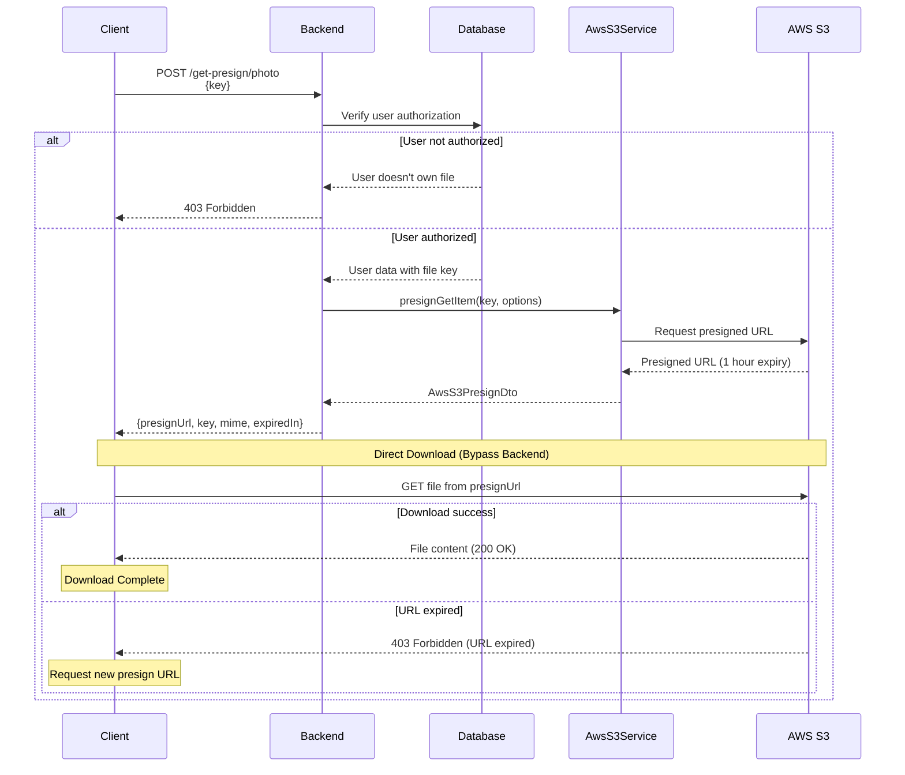
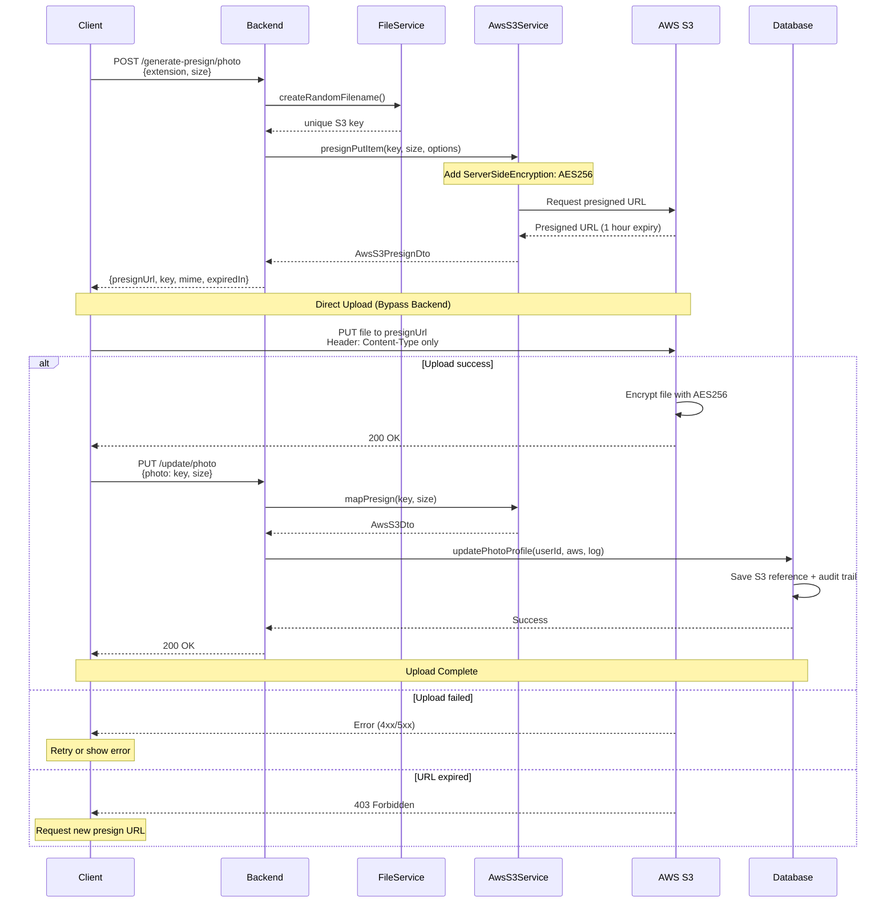

# Presign Documentation

## Overview

AWS S3 presigned URLs provide secure, time-limited access to S3 objects without requiring AWS credentials. This feature enables controlled file sharing and temporary upload/download access with built-in encryption and security.

## Related Documents

- [Message Documentation][ref-doc-message] - For internationalization and error message translation
- [Handling Error Documentation][ref-doc-handling-error] - For exception handling and response formatting
- [Doc Documentation][ref-doc-doc] - For API documentation integration with DTOs
- [File Upload Documentation][ref-doc-file-upload] - For file validation pipes

## Table of Contents

- [Overview](#overview)
- [Related Documents](#related-documents)
- [AWS S3 Presigned URL Get](#aws-s3-presigned-url-get)
- [AWS S3 Presigned URL Upload](#aws-s3-presigned-url-upload)
- [Error Handling](#error-handling)
- [Troubleshooting](#troubleshooting)

## AWS S3 Presigned URL Get

AWS S3 presigned URLs for downloads enable secure, temporary access to private S3 objects without exposing credentials. This approach is ideal for sharing files with expiring links, providing controlled access to protected resources, and enabling direct client downloads.

### How It Works

1. Client requests a presigned URL from the backend with the file key
2. Backend validates user authorization and generates a time-limited presigned URL
3. Client downloads the file directly from S3 using the presigned URL via HTTP GET
4. URL expires after the configured time period (default: 1 hour)

### Implementation

**Step 1 - Request DTO:**
```typescript
export class UserGetPhotoProfilePresignRequestDto {
  @ApiProperty({
    required: true,
    description: 'Photo path key from S3',
    example: 'user/profile/unique-photo-key.jpg',
  })
  @IsString()
  @IsNotEmpty()
  key: string;
}
```

**Step 2 - Controller Endpoint:**
```typescript
@Controller('users')
export class UserController {
  constructor(private readonly userService: UserService) {}

  @Response('user.getPhotoProfilePresign')
  @UserProtected()
  @AuthJwtAccessProtected()
  @Post('/profile/get-presign/photo')
  @HttpCode(HttpStatus.OK)
  async getPhotoProfilePresign(
    @AuthJwtPayload('userId') userId: string,
    @Body() body: UserGetPhotoProfilePresignRequestDto
  ): Promise<IResponseReturn<AwsS3PresignDto>> {
    return this.userService.getPhotoProfilePresign(userId, body);
  }
}
```

**Step 3 - Service Implementation:**
```typescript
@Injectable()
export class UserService {
  constructor(
    private readonly awsS3Service: AwsS3Service,
    private readonly userRepository: UserRepository
  ) {}

  async getPhotoProfilePresign(
    userId: string,
    { key }: UserGetPhotoProfilePresignRequestDto
  ): Promise<IResponseReturn<AwsS3PresignDto>> {
    // Verify user owns the file
    const user = await this.userRepository.findOneById(userId);
    if (user.photo?.key !== key) {
      throw new ForbiddenException('Access denied to this resource');
    }

    const presign: AwsS3PresignDto = await this.awsS3Service.presignGetItem(
      key,
      { 
        access: EnumAwsS3Accessibility.private,
        expired: 3600 // 1 hour
      }
    );

    return { data: presign };
  }
}
```

**Step 4 - Client-Side Download:**
```typescript
async function downloadPhotoWithPresign(key: string) {
  try {
    // Step 1: Request presigned URL
    const response = await fetch('/api/users/profile/get-presign/photo', {
      method: 'POST',
      headers: {
        'Content-Type': 'application/json',
        'Authorization': `Bearer ${accessToken}`
      },
      body: JSON.stringify({ key })
    });

    if (!response.ok) {
      throw new Error('Failed to get presigned URL');
    }

    const { data: presignData } = await response.json();

    // Step 2: Download directly from S3
    const fileResponse = await fetch(presignData.presignUrl, {
      method: 'GET'
    });

    if (!fileResponse.ok) {
      throw new Error('Failed to download file from S3');
    }

    const blob = await fileResponse.blob();
    
    // Step 3: Trigger browser download
    const url = window.URL.createObjectURL(blob);
    const a = document.createElement('a');
    a.href = url;
    a.download = key.split('/').pop() || 'download';
    document.body.appendChild(a);
    a.click();
    document.body.removeChild(a);
    window.URL.revokeObjectURL(url);

    console.log('Photo downloaded successfully!');
  } catch (error) {
    console.error('Download failed:', error);
    // Handle error appropriately (show user notification, etc.)
  }
}
```

### Configuration Options
```typescript
interface IAwsS3PresignGetItemOptions {
  access?: EnumAwsS3Accessibility; // public or private
  expired?: number; // Expiration time in seconds (default from config)
}
```

### Response Structure
```typescript
interface AwsS3PresignDto {
  presignUrl: string;    // The presigned URL for download
  key: string;           // S3 object key
  extension: string;     // File extension
  mime: string;          // MIME type
  expiredIn: number;     // URL expiration time in seconds
}
```

### Usage Examples
```typescript
// Example 1: Generate presign URL for private file (5 minutes)
const presign = await awsS3Service.presignGetItem(
  'user/123/documents/report.pdf',
  { 
    access: EnumAwsS3Accessibility.private,
    expired: 300 // 5 minutes
  }
);

// Example 2: Generate presign URL with default expiration (1 hour)
const presign = await awsS3Service.presignGetItem(
  'user/456/images/banner.jpg',
  {
    access: EnumAwsS3Accessibility.private
  }
);

// Example 3: Stream download in Node.js
const presign = await awsS3Service.presignGetItem('data/export.csv');
const response = await fetch(presign.presignUrl);
const buffer = await response.arrayBuffer();
```

### Flow Diagram


---

## AWS S3 Presigned URL Upload

AWS S3 presigned URLs enable secure client-side direct uploads to S3 without exposing AWS credentials. This approach is ideal for large files, reduces server bandwidth, and improves upload performance.

### How It Works

1. Client requests a presigned URL from the backend with file metadata (extension, size)
2. Backend generates a unique S3 key and time-limited presigned URL
3. Client uploads the file **directly to S3** using the presigned URL via HTTP PUT
4. Client notifies the backend of successful upload with the S3 key
5. Backend saves file reference to database with audit trail

### Implementation

**Step 1 - Request DTO:**
```typescript
export class UserGeneratePhotoProfileRequestDto {
  @ApiProperty({
    type: 'string',
    enum: EnumFileExtensionImage,
    default: EnumFileExtensionImage.JPG,
  })
  @IsString()
  @IsEnum(EnumFileExtensionImage)
  @IsNotEmpty()
  extension: EnumFileExtensionImage;

  @ApiProperty({
    required: true,
    description: 'File size in bytes',
  })
  @IsNumber({
    allowInfinity: false,
    allowNaN: false,
    maxDecimalPlaces: 0,
  })
  @IsInt()
  @IsNotEmpty()
  size: number;
}

export class UserUpdateProfilePhotoRequestDto {
  @ApiProperty({
    required: true,
    description: 'Photo path key from S3',
    example: 'user/profile/unique-photo-key.jpg',
  })
  @IsString()
  @IsNotEmpty()
  photo: string;

  @ApiProperty({
    required: true,
    description: 'File size in bytes',
  })
  @IsNumber({
    allowInfinity: false,
    allowNaN: false,
    maxDecimalPlaces: 0,
  })
  @IsInt()
  @IsNotEmpty()
  size: number;
}
```

**Step 2 - Controller Endpoints:**
```typescript
@Controller('users')
export class UserController {
  constructor(private readonly userService: UserService) {}

  @Response('user.generatePhotoProfilePresign')
  @UserProtected()
  @AuthJwtAccessProtected()
  @Post('/profile/generate-presign/photo')
  @HttpCode(HttpStatus.OK)
  async generatePhotoProfilePresign(
    @AuthJwtPayload('userId') userId: string,
    @Body() body: UserGeneratePhotoProfileRequestDto
  ): Promise<IResponseReturn<AwsS3PresignDto>> {
    return this.userService.generatePhotoProfilePresign(userId, body);
  }

  @Response('user.updatePhotoProfile')
  @UserProtected()
  @AuthJwtAccessProtected()
  @Put('/profile/update/photo')
  async updatePhotoProfile(
    @AuthJwtPayload('userId') userId: string,
    @Body() body: UserUpdateProfilePhotoRequestDto,
    @RequestIPAddress() ipAddress: string,
    @RequestUserAgent() userAgent: RequestUserAgentDto
  ): Promise<IResponseReturn<void>> {
    return this.userService.updatePhotoProfile(userId, body, {
      ipAddress,
      userAgent,
    });
  }
}
```

**Step 3 - Service Implementation:**
```typescript
@Injectable()
export class UserService {
  constructor(
    private readonly awsS3Service: AwsS3Service,
    private readonly userRepository: UserRepository,
    private readonly fileService: FileService
  ) {}

  async generatePhotoProfilePresign(
    userId: string,
    { extension, size }: UserGeneratePhotoProfileRequestDto
  ): Promise<IResponseReturn<AwsS3PresignDto>> {
    // Generate unique S3 key
    const key: string = this.fileService.createRandomFilename({
      path: `user/${userId}/profile`,
      prefix: 'photo',
      extension,
    });

    // Generate presigned URL (1 hour expiration, auto-encrypted)
    const presign: AwsS3PresignDto = await this.awsS3Service.presignPutItem(
      { key, size },
      { 
        forceUpdate: true,
        access: EnumAwsS3Accessibility.private,
        expired: 3600 // 1 hour
      }
    );

    return { data: presign };
  }

  async updatePhotoProfile(
    userId: string,
    { photo, size }: UserUpdateProfilePhotoRequestDto,
    requestLog: IRequestLog
  ): Promise<IResponseReturn<void>> {
    // Map presign data to AWS S3 DTO
    const aws: AwsS3Dto = this.awsS3Service.mapPresign({ key: photo, size });
    
    // Save to database with audit trail
    await this.userRepository.updatePhotoProfile(userId, aws, requestLog);
    
    return;
  }
}
```

**Step 4 - Client-Side Upload:**
```typescript
async function uploadPhotoSimple(file: File) {
  try {
    // Step 1: Request presigned URL
    const response = await fetch('/api/users/profile/generate-presign/photo', {
      method: 'POST',
      headers: {
        'Content-Type': 'application/json',
        'Authorization': `Bearer ${accessToken}`
      },
      body: JSON.stringify({
        extension: file.name.split('.').pop(),
        size: file.size
      })
    });

    const { data: presignData } = await response.json();

    // Step 2: Upload to S3 (simple PUT request)
    const uploadResponse = await fetch(presignData.presignUrl, {
      method: 'PUT',
      headers: {
        'Content-Type': presignData.mime,
      },
      body: file
    });

    if (!uploadResponse.ok) {
      throw new Error('S3 upload failed');
    }

    // Step 3: Notify backend
    await fetch('/api/users/profile/update/photo', {
      method: 'PUT',
      headers: {
        'Content-Type': 'application/json',
        'Authorization': `Bearer ${accessToken}`
      },
      body: JSON.stringify({
        photo: presignData.key,
        size: file.size
      })
    });

    console.log('Upload complete!');
  } catch (error) {
    console.error('Upload failed:', error);
    throw error;
  }
}
```

### Configuration Options
```typescript
interface IAwsS3PresignPutItemOptions {
  access?: EnumAwsS3Accessibility; // public or private
  expired?: number; // Expiration time in seconds (default from config)
  forceUpdate?: boolean; // Allow overwriting existing files
}
```

### Response Structure
```typescript
interface AwsS3PresignDto {
  presignUrl: string;    // The presigned URL for upload
  key: string;           // S3 object key (save this for later reference)
  extension: string;     // File extension
  mime: string;          // MIME type (use this as Content-Type header)
  expiredIn: number;     // URL expiration time in seconds
}
```

### Flow Diagram


**Flow Explanation:**

1. **Generate Presigned URL Stage:**
   - Client requests presigned URL with file metadata (extension, size)
   - Backend generates unique S3 key using `FileService`
   - `AwsS3Service` creates time-limited presigned URL with encryption enabled
   - Backend returns presigned URL data to client

2. **Direct Upload Stage:**
   - Client uploads file **directly to S3** using presigned URL
   - Only `Content-Type` header needed (encryption is automatic)
   - No backend involvement during actual file transfer
   - S3 encrypts file at rest with AES-256
   - Reduces server bandwidth and improves performance

3. **Database Update Stage:**
   - Client notifies backend with S3 key and file size
   - Backend maps presign data to `AwsS3Dto`
   - Repository updates user profile with S3 file reference
   - Transaction logged with IP address and user agent for audit trail


<!-- REFERENCES -->

<!-- BADGE LINKS -->

[ack-contributors-shield]: https://img.shields.io/github/contributors/andrechristikan/ack-nestjs-boilerplate?style=for-the-badge
[ack-forks-shield]: https://img.shields.io/github/forks/andrechristikan/ack-nestjs-boilerplate?style=for-the-badge
[ack-stars-shield]: https://img.shields.io/github/stars/andrechristikan/ack-nestjs-boilerplate?style=for-the-badge
[ack-issues-shield]: https://img.shields.io/github/issues/andrechristikan/ack-nestjs-boilerplate?style=for-the-badge
[ack-license-shield]: https://img.shields.io/github/license/andrechristikan/ack-nestjs-boilerplate?style=for-the-badge
[nestjs-shield]: https://img.shields.io/badge/nestjs-%23E0234E.svg?style=for-the-badge&logo=nestjs&logoColor=white
[nodejs-shield]: https://img.shields.io/badge/Node.js-339933?style=for-the-badge&logo=nodedotjs&logoColor=white
[typescript-shield]: https://img.shields.io/badge/TypeScript-007ACC?style=for-the-badge&logo=typescript&logoColor=white
[mongodb-shield]: https://img.shields.io/badge/MongoDB-white?style=for-the-badge&logo=mongodb&logoColor=4EA94B
[jwt-shield]: https://img.shields.io/badge/JWT-000000?style=for-the-badge&logo=JSON%20web%20tokens&logoColor=white
[jest-shield]: https://img.shields.io/badge/-jest-%23C21325?style=for-the-badge&logo=jest&logoColor=white
[pnpm-shield]: https://img.shields.io/badge/pnpm-%232C8EBB.svg?style=for-the-badge&logo=pnpm&logoColor=white&color=F9AD00
[docker-shield]: https://img.shields.io/badge/docker-%230db7ed.svg?style=for-the-badge&logo=docker&logoColor=white
[github-shield]: https://img.shields.io/badge/GitHub-100000?style=for-the-badge&logo=github&logoColor=white
[linkedin-shield]: https://img.shields.io/badge/LinkedIn-0077B5?style=for-the-badge&logo=linkedin&logoColor=white

<!-- CONTACTS -->

[ref-author-linkedin]: https://linkedin.com/in/andrechristikan
[ref-author-email]: mailto:andrechristikan@gmail.com
[ref-author-github]: https://github.com/andrechristikan
[ref-author-paypal]: https://www.paypal.me/andrechristikan
[ref-author-kofi]: https://ko-fi.com/andrechristikan

<!-- Repo LINKS -->

[ref-ack]: https://github.com/andrechristikan/ack-nestjs-boilerplate
[ref-ack-issues]: https://github.com/andrechristikan/ack-nestjs-boilerplate/issues
[ref-ack-stars]: https://github.com/andrechristikan/ack-nestjs-boilerplate/stargazers
[ref-ack-forks]: https://github.com/andrechristikan/ack-nestjs-boilerplate/network/members
[ref-ack-contributors]: https://github.com/andrechristikan/ack-nestjs-boilerplate/graphs/contributors
[ref-ack-license]: LICENSE.md

<!-- THIRD PARTY -->

[ref-nestjs]: http://nestjs.com
[ref-nestjs-swagger]: https://docs.nestjs.com/openapi/introduction
[ref-nestjs-swagger-types]: https://docs.nestjs.com/openapi/types-and-parameters
[ref-prisma]: https://www.prisma.io
[ref-prisma-mongodb]: https://www.prisma.io/docs/orm/overview/databases/mongodb#commonalities-with-other-database-provider
[ref-prisma-setup]: https://www.prisma.io/docs/getting-started/setup-prisma/add-to-existing-project#switching-databases
[ref-mongodb]: https://docs.mongodb.com/
[ref-redis]: https://redis.io
[ref-bullmq]: https://bullmq.io
[ref-nodejs]: https://nodejs.org/
[ref-typescript]: https://www.typescriptlang.org/
[ref-docker]: https://docs.docker.com
[ref-dockercompose]: https://docs.docker.com/compose/
[ref-pnpm]: https://pnpm.io
[ref-12factor]: https://12factor.net
[ref-commander]: https://nest-commander.jaymcdoniel.dev
[ref-package-json]: package.json
[ref-jwt]: https://jwt.io
[ref-jest]: https://jestjs.io/docs/getting-started
[ref-git]: https://git-scm.com
[ref-google-console]: https://console.cloud.google.com/
[ref-google-client-secret]: https://developers.google.com/identity/protocols/oauth2

[ref-doc-root]: ../readme.md
[ref-doc-activity-log]: activity-log.md
[ref-doc-authentication]: authentication.md
[ref-doc-authorization]: authorization.md
[ref-doc-cache]: cache.md
[ref-doc-configuration]: configuration.md
[ref-doc-database]: database.md
[ref-doc-environment]: environment.md
[ref-doc-feature-flag]: feature-flag.md
[ref-doc-file-upload]: file-upload.md
[ref-doc-handling-error]: handling-error.md
[ref-doc-installation]: installation.md
[ref-doc-logger]: logger.md
[ref-doc-message]: message.md
[ref-doc-pagination]: pagination.md
[ref-doc-project-structure]: project-structure.md
[ref-doc-queue]: queue.md
[ref-doc-request-validation]: request-validation.md
[ref-doc-response]: response.md
[ref-doc-security-and-middleware]: security-and-middleware.md
[ref-doc-doc]: doc.md
[ref-doc-third-party-integration]: third-party-integration.md
[ref-doc-presign]: presign.md
[ref-doc-term-policy]: term-policy.md
[ref-doc-two-factor]: two-factor.md

<!-- CONTRIBUTOR -->

[ref-contributor-gzerox]: https://github.com/Gzerox
[ref-contributor-ak2g]: https://github.com/ak2g

