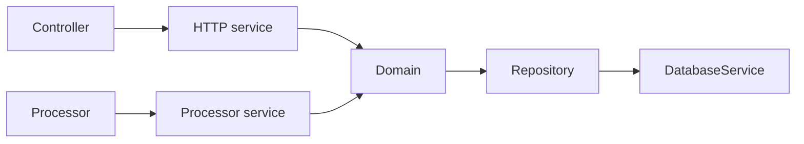

# Project Structure Documentation

## Overview

Feature modules follow the repository pattern. Layout is one folder per feature under `src/modules/`. 

## Table of Contents

- [Overview](#overview)
- [Structure](#structure)
- [App Module](#app-module)
- [Common Module](#common-module)
- [Configs](#configs)
- [Languages](#languages)
- [Migration](#migration)
- [Queues](#queues)
- [Router](#router)
- [Instrument](#instrument)
- [Migration Entrypoint](#migration-entrypoint)
- [Modules](#modules)
- [Other Modules](#other-modules)
    - [Folders](#folders)
    - [Files](#files)

## Structure

Below is an overview of the main project structure:

```
src
  ├── app
  ├── common
  ├── configs
  ├── generated
  ├── languages
  ├── migration
  ├── modules
  ├── router
  ├── queues
  ├── instrument.ts
  ├── main.ts
  ├── migration.ts
  └── swagger.ts
```

`src/generated/` is written by `pnpm generate` and not tracked by git:

- `prisma-client/` (the Prisma client, from `pnpm db:generate`)
- `package/package.ts` (the `version`, `author`, and `repository` fields of `package.json`, from `pnpm generate:package`)

Application code imports both through the `@generated/*` alias.

The project is native ESM (`"type": "module"`, `module: nodenext`, `verbatimModuleSyntax`). Every import between `src/` folders goes through a `tsconfig.json` path alias:

- `@app/*`, `@common/*`, `@configs/*`, `@modules/*`, `@router/*`, `@migration/*`, `@queues/*`, `@generated/*`
- plus `@instrument`, `@swagger`, `@main`, and `@migration` for the root files

## App Module

**Location:** `src/app/app.module.ts`

The App Module is the root module. It:

- Imports `CommonModule` (shared infrastructure and global feature modules) and `RouterModule` (HTTP route mounting and the queue processor mount)
- Registers five global exception filters: general, application, HTTP, validation, and import validation

## Common Module

**Location:** `src/common/common.module.ts`

CommonModule registers shared infrastructure and the global feature modules. Its `imports` array holds three groups, in this order:

- **Infrastructure:** `ConfigModule` (loading `src/configs/index.ts`), `MessageModule`, `LoggerModule`, `SentryModule` (which exports `SentryService`), `RedisCacheModule`, `QueueModule` (the BullMQ producer and processor connections), `CacheMainModule`, `DatabaseModule`, `RequestModule`, and `ResponseModule`
- **Shared utilities:** `HelperModule`, `PaginationModule`, `FileModule`, and `FirebaseModule`
- **The `@Global()` feature domains:** `ActivityLogDomainModule`, `ApiKeyDomainModule`, `AuthDomainModule`, `FeatureFlagDomainModule`, `RoleDomainModule`, `PolicyDomainModule`, `TermPolicyDomainModule`, `SessionDomainModule`, and `NotificationDomainModule`

## Configs

**Location:** `src/configs/`

Typed `registerAs` files. `src/configs/index.ts` loads every `*.config.ts` in that folder into `ConfigModule`. Each file holds env vars, settings, and validation for its concern. The catalog is [Configuration](configuration.md).

## Languages

**Location:** `src/languages/`

i18n JSON, one folder per locale. It contains:
- Subfolders for each supported language (e.g., `en/` for English)
- JSON files for each domain or feature (e.g., `user.json`, `auth.json`, `policy.json`) containing translation strings and messages

## Migration

**Location:** `src/migration/`

The migration folder seeds initial data. MongoDB has no migration files; the schema shape is applied by `pnpm db:migrate` (`prisma db push`). It includes:
- `migration.module.ts`: Registers every seed command as a provider
- Subfolders for migration bases, data, enums, interfaces, and seeds
- Populates the reference and bootstrap rows an empty database needs: api keys, countries, feature flags, roles, policies, term policies, users, and workspaces (the eight commands bundled into `pnpm migration:seed`)
- Ships three on-demand commands that are not part of `pnpm migration:seed`: `awsS3Config` (S3 bucket setup; see [Third Party Integration](third-party-integration.md#bucket-setup)), `templateEmailNotification` (see [Email](email.md)), and `templateTermPolicy` (see [Term Policy](term-policy.md#migration--seeding))

## Queues

**Location:** `src/queues/`

The queues folder is the BullMQ framework layer. It includes:
- `queue.module.ts`: `QueueModule.forRoot()` holds the two BullMQ root connections (producer and processor). Named queues are registered by the owning feature's `<feature>.domain.module.ts` through a `RegisterQueueOptionsFactory`; per-queue job defaults are read from `queue.config.ts`
- Subfolders for queue bases, constants, decorators, enums, exceptions, interfaces
- Processor classes live in their owning feature module (`<module>/processors/`), wired by that module's `<feature>.processor.module.ts`
- Immediate, delayed, and recurring jobs

## Router

**Location:** `src/router/`

The router folder mounts everything the application exposes. It includes:
- `router.module.ts`: Root router that imports the five access-level modules and registers their path prefixes through `RouterModule.register` from `@nestjs/core`, plus the processor mount
- `http/`: One module per access level, each holding its controllers and the `<feature>.http.module.ts` imports they need. `router.http.public.module.ts` mounts under `/public`, `router.http.system.module.ts` under `/system`, `router.http.admin.module.ts` under `/admin`, `router.http.user.module.ts` under `/user`, and `router.http.shared.module.ts` under `/shared`
- `processor/router.processor.module.ts`: Aggregates every `<feature>.processor.module.ts`, so the BullMQ workers boot with the HTTP application

## Instrument

**Location:** `src/instrument.ts`

The instrument file configures Sentry. It is loaded before the application code, through `node --import ./dist/instrument.js` in the start scripts and `import '@instrument'` at the top of `src/main.ts`, so Sentry is initialized before anything else.

- Initializes Sentry with DSN and environment config
- Sets sampling rates for traces and profiles (higher in development, lower in production)
- Drops non-fatal `QueueException` events in `beforeSend`, requests to `LoggerExcludedRoutes` (health, docs, hello, metrics, favicon, root), responses with status below 500, and events at `info` or `debug`
- Forwards Pino logs to Sentry Logs through `Sentry.pinoIntegration`, limited to `warn`, `error`, and `fatal` in production and all levels elsewhere
- Excludes the same noise routes from traces in `tracesSampler`
- Scrubs every outgoing event, transaction, breadcrumb, and log (`beforeSend`, `beforeSendTransaction`, `beforeBreadcrumb`, `beforeSendLog`): URLs masked, query strings dropped, sensitive headers, cookies, and body fields redacted. See [Logger](logger.md)
- Sets maximum breadcrumbs, value lengths, and stack trace attachment policies
- Sends no default PII (`sendDefaultPii: false`)

## Migration Entrypoint

**Location:** `src/migration.ts`

The migration file is the nest-commander entry point. It boots `MigrationModule` and runs seed commands.

- Creates a NestJS application context for CLI commands
- Logs through Pino
- Runs the named seed command, then closes the process
- Invoked as `pnpm migration` followed by the command name

## Modules

**Location:** `src/modules/`

One folder per feature. A request travels Controller to HTTP service to Domain to Repository. A job travels Processor to processor service to Domain. Lookup tables live under `contracts/` (`*.contract.ts`).



**Feature modules:**

```
modules
  ├── activity-log
  ├── analytic
  ├── api-key
  ├── auth
  ├── country
  ├── device
  ├── feature-flag
  ├── health
  ├── hello
  ├── notification
  ├── password-history
  ├── policy
  ├── project
  ├── role
  ├── session
  ├── term-policy
  ├── user
  └── workspace
```

`analytic` orchestrates live metrics through owner `*AnalyticDomain` / `*AnalyticRepository` siblings (for example `user.analytic.domain.ts` with `user.analytic.repository.ts`). It has no repository module of its own. See [Analytic](analytic.md).

**Per-layer Nest modules:**

Each layer of a feature gets its own Nest module file at the root of the feature folder, and only the ones with something to provide exist:

```
modules/<feature>
  ├── <feature>.repository.module.ts  # repositories
  ├── <feature>.domain.module.ts      # domains, utils, caches, queue classes and factories
  │                                   #   (the only one another feature consumes)
  ├── <feature>.http.module.ts        # HTTP services, imported by a router http module
  └── <feature>.processor.module.ts   # processors and their processor services
```

`<feature>.domain.module.ts` is present for every feature. A feature without background jobs has no `<feature>.processor.module.ts`; `notification` and `workspace` are the two that do. `auth`, `policy`, `health`, and `hello` carry only the layers they need.

**Folders:**

No module contains every folder below. Each module includes only the folders its feature needs. The folders fall into three tiers:

```
module
  # Core (present in almost every module)
  ├── constants
  ├── controllers
  ├── domains
  ├── dtos
  ├── enums
  ├── exceptions
  ├── interfaces
  ├── repositories
  ├── services
  ├── utils
  # Common (present when the feature needs them)
  ├── caches
  ├── decorators
  ├── guards
  # Specialized (a few modules only)
  ├── contracts
  ├── factories
  ├── indicators
  ├── interceptors
  ├── processors
  ├── queues
  └── templates
```

### Constants
Defines static values and configuration constants used throughout the module.

### Contracts
Static rule maps the module reads at runtime, one file per concept, named `<module>.<concept>.contract.ts` and exported with `@public`. A contract fixes what an enum member means for the feature: `NotificationKindContract` holds the type, priority, i18n keys and channels of each notification kind; `ActivityLogActionContract` holds the user and workspace resolution and the metadata schema of each action; `FileExtensionContract` holds the sniffed types each upload extension accepts. Coverage skips `src/**/*.contract.ts` (`vitest.config.ts`).

### Controllers
Handle incoming HTTP requests, delegate to HTTP services, and return responses. Controllers define the API endpoints for the module.

### Decorators
Custom decorators to add metadata or modify behavior of classes, methods, or properties within the module. OpenAPI for auth and guard kits lives on `*Protected` / auth decorators here; operation metadata and response envelopes live on `@Doc` and `@Response*` from `src/common/`.

### DTOs (Data Transfer Objects)
Zod schemas that define the shape of data sent and received on API endpoints, each paired with the type inferred from it. One `*.dto.ts` file holds one schema.

### Enums
Type-safe enumerations for status codes, types, or other fixed sets of values relevant to the module's domain.

### Exceptions
Dedicated exception classes, one per error, each extending `AppBaseException`. Named `<module>.<kebab-error>.exception.ts` (e.g., `user.not-found.exception.ts`).

### Factories
Factory classes or functions for creating instances of complex objects or aggregating dependencies.

### Indicators
Health-check indicators that report the status of a dependency or subsystem (used by the health module).

### Guards
Authorization and access control logic, protecting routes and resources based on user roles or permissions.

### Interfaces
TypeScript interfaces for data shapes and for repository contracts (`*.repository.interface.ts`). Services, domains, and utils are injected as classes and carry no header interface.

### Interceptors
Logic to intercept and modify requests or responses, such as logging, caching, or response transformation.

### Processors
Background job handlers, such as BullMQ processors, for asynchronous tasks related to the module.

### Queues
The `@Injectable()` classes holding the BullMQ `Queue`, one method per job the feature enqueues. They are provided and exported by `<feature>.domain.module.ts`.

### Repositories
Implements the Repository design pattern for data access, abstracting database operations and providing a clean API for domains.

### Domains
Business logic and orchestration of the module. Domains interact with repositories, other domains, utils, and queue classes. They open `DatabaseService.withTransaction` when a write spans more than one repository.

### Services
HTTP services (`*.http.service.ts`) and processor services (`*.processor.service.ts`). They translate transport or job payloads into domain calls and assemble response DTOs. They own no business rule and reach no repository.

### Caches
Dedicated cache classes that wrap a named cache provider for one feature concern (for example `SessionCache`, `FeatureFlagCache`).

### Templates
Reusable templates, such as email templates or message formats, used by the module.

### Utils
Pure shaping helpers specific to the module: mappers, predicates, and format checks. A util reaches no cache, repository, queue, request store, or file service; work that needs one of those lives in a domain.


## Other Modules

Below are explanations for the root folders and files outside `src/`:

### Folders

- **.github/**: GitHub-specific configuration including Actions workflows, issue and pull request templates, and Dependabot settings. `.github/workflows/test.yml` runs `NODE_ENV=test pnpm test` on `workflow_dispatch`. `.github/workflows/linter.yml` runs on `pull_request`.
- **.husky/**: Git hooks. `pre-commit` runs `pnpm lint:staged`, `pnpm typecheck`, `pnpm deadcode`, `pnpm spell`, and `NODE_ENV=test pnpm test`; `commit-msg` runs commitlint.
- **.vscode/**: Shared editor settings, tasks, launch configurations, and recommended extensions.
- **ci/**: Dockerfiles (`dockerfile`, `dockerfile.local`), the JWKS server nginx config, and the Vault bootstrap scripts and policies.
- **docs/**: Project documentation, including architecture, features, and usage guides.
- **generated/**: Auto-generated output: the Swagger JSON (`swagger.json`), the Vault init material (`vault/`), and agent reports (`docs/`). Not tracked by git. The Prisma client lives in `src/generated/` (see [Structure](#structure)).
- **coverage/**: Vitest coverage output from `pnpm test:cov`. Not tracked by git.
- **.vitest/**: Vitest blob reports and JSON output. Ignored by git, Docker, Prettier, ESLint, and cspell, and listed in `tsconfig.json` / `tsconfig.build.json` `exclude`. `node_modules/.vitest-cache` holds `fsModuleCache`.
- **keys/**: The JWT key pairs, the JWKS files, and `encryption-secret.env`, all written by `pnpm generate:secret`. Not tracked by git.
- **logs/**: Directory for application logs. Not tracked by git.
- **prisma/**: Contains `schema.prisma`, the single source of truth for the database schema. MongoDB has no migration files.
- **scripts/**: `generate-secret.ts` (JWT keys, JWKS, and encryption secrets; `pnpm generate:secret`) and `generate-package.ts` (`pnpm generate:package`). Node runs both directly as TypeScript.
- **test/**: The Vitest spec tree, mirroring `src/` (`test/**/*.spec.ts`). The suite is unit: one class, collaborators doubled. `pnpm test` is `TZ=UTC vitest run --passWithNoTests` and does not collect coverage. `pnpm test:cov` adds `--coverage`, which is when the 100% thresholds apply. `coverage.enabled` is `false` in `vitest.config.ts`. Controllers, processors, repositories, contracts, modules, enums, interfaces, and constants sit outside the coverage set. The doc kit in `src/common/doc/` is in it. Integration and e2e tests are not this suite. Specs exist under `test/app/` (app-layer env DTO, exceptions, filters), `test/common/pagination/` (query util and list query schemas), and `test/modules/analytic/`. `test/setup.ts` (`setupFiles`) mutes Nest `Logger` and `ConsoleLogger` by assigning no-ops onto instance and static methods. Specs do not spy loggers or `console`. `pre-commit` and CI (`.github/workflows/test.yml`, `workflow_dispatch`) run `NODE_ENV=test pnpm test`. `testTimeout` is 5000ms.

### Files

- **.commitlintrc**: Configuration for commit message linting to enforce commit standards.
- **.dockerignore**: Specifies files and directories to exclude from Docker builds.
- **.env.example**: Example environment variable file for reference and onboarding. `.env` itself is not tracked by git.
- **.gitignore**: Specifies files and directories to exclude from Git version control.
- **.npmrc**: Package manager settings (`engine-strict = true`, so the `engines` versions are enforced on install).
- **.prettierignore**: Specifies files and directories to exclude from Prettier formatting.
- **.prettierrc**: Configuration for Prettier code formatter.
- **.swcrc**: Configuration for SWC JavaScript/TypeScript compiler.
- **cspell.json**: Configuration for code spell checking to maintain code quality and consistency.
- **docker-compose.yml**: Docker Compose configuration for orchestrating multi-container Docker applications, such as local development environments.
- **eslint.config.mjs**: ESLint flat configuration. It applies `typescript-eslint` recommended rules, `eslint-plugin-security` (every recommended rule at `error`, `detect-object-injection` off, and `detect-non-literal-fs-filename` off for the notification and term-policy template domains and for `scripts/`), and import bans: `Math.random`, `crypto-js`, a bare `'crypto'` import (use `node:crypto`), `lodash` and a default `lodash-es` import (use named `lodash-es` imports), and `@generated/prisma-client/internal`. A `this.`-rooted call is assigned to a `const` before it is used in an expression position; that convention is checked in review, not by a linter.
- **knip.json**: The `pnpm deadcode` configuration. Entries are `src/main.ts`, `src/migration.ts`, `src/instrument.ts`, and `scripts/*.ts`. Unused files, exports, types, enum members, and dependencies report as warnings; every other knip rule (unlisted or unresolved imports, unlisted binaries, duplicate exports) is an error.
- **nest-cli.json**: Configuration for NestJS CLI, defining project structure and build options.
- **package.json**: Node.js project manifest, listing dependencies, scripts, and metadata.
- **pnpm-lock.yaml**: pnpm lockfile.
- **pnpm-workspace.yaml**: pnpm settings for this single-package repo: `allowBuilds` (the packages permitted to run install scripts, for example `prisma` and `@swc/core`) and `minimumReleaseAgeExclude` (packages exempted from the minimum release-age hold).
- **tsconfig.json**: TypeScript configuration read by `pnpm typecheck` (`tsc --noEmit`), by knip, by Vitest (`resolve.tsconfigPaths`), and by the editor. It targets native ESM (`module` and `moduleResolution` `nodenext`, `verbatimModuleSyntax`, `isolatedModules`). Its `include` covers `src/**/*`, `test/**/*`, `scripts/**/*`, and `vitest.config.ts`; its `exclude` includes `.vitest`. Path aliases: `@app/*`, `@common/*`, `@configs/*`, `@modules/*`, `@router/*`, `@migration/*`, `@queues/*`, `@test/*`, `@generated/*`, `@instrument`, `@swagger`, `@main`, `@migration`.
- **tsconfig.build.json**: The build-time TypeScript configuration, named by `nest-cli.json` under `compilerOptions.tsConfigPath`, so `nest build` and `nest start` read it. It extends `tsconfig.json`, narrows `include` to `src/**/*`, and excludes `test`, `scripts`, and `.vitest`.
- **vitest.config.ts**: The Vitest configuration behind `pnpm test` and `pnpm test:cov`: SWC compilation through `unplugin-swc`, the tsconfig path aliases, `test/**/*.spec.ts`, `test/setup.ts` as `setupFiles`, `isolate: false` (workers reused across files; `pool` is unset, so Vitest uses `forks`), `fsModuleCache: true` (transforms persist under `node_modules/.vitest-cache`), `testTimeout` 5000ms, and v8 coverage over `src/**/*.ts` (modules, enums, interfaces, constants, contracts, controllers, processors, repositories, `src/generated`, `src/migration`, `src/router`, `src/configs`, `src/languages`, and the root files excluded) with a 100% threshold on branches, functions, lines, and statements. The doc kit in `src/common/doc/` is in the coverage set. Coverage collection is off unless `--coverage` is passed.
- **README.md**: Project introduction, feature list, and entry point to the documentation.
- **CONTRIBUTING.md**: Contribution workflow and standards.
- **CODE_OF_CONDUCT.md**: Community code of conduct.
- **SECURITY.md**: Supported versions and vulnerability reporting process.
- **LICENSE.md**: Project license.


